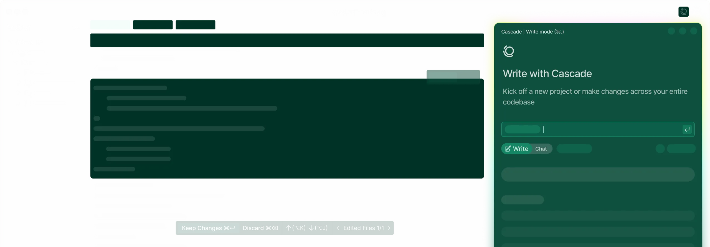
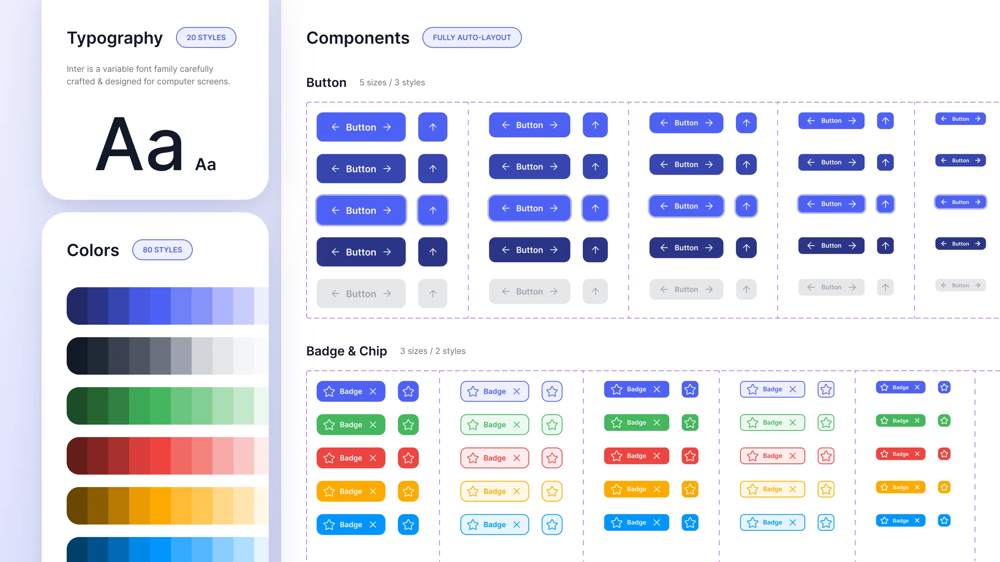
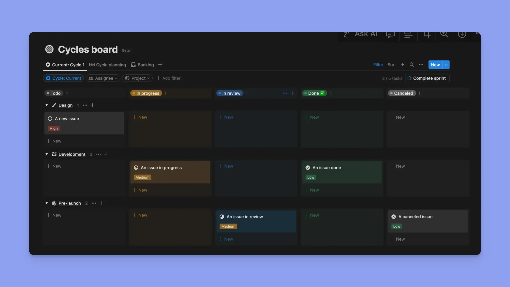
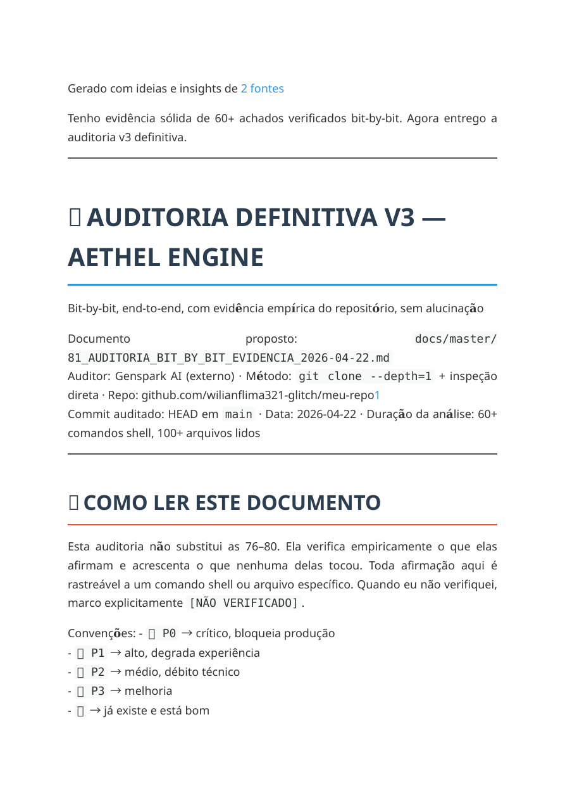
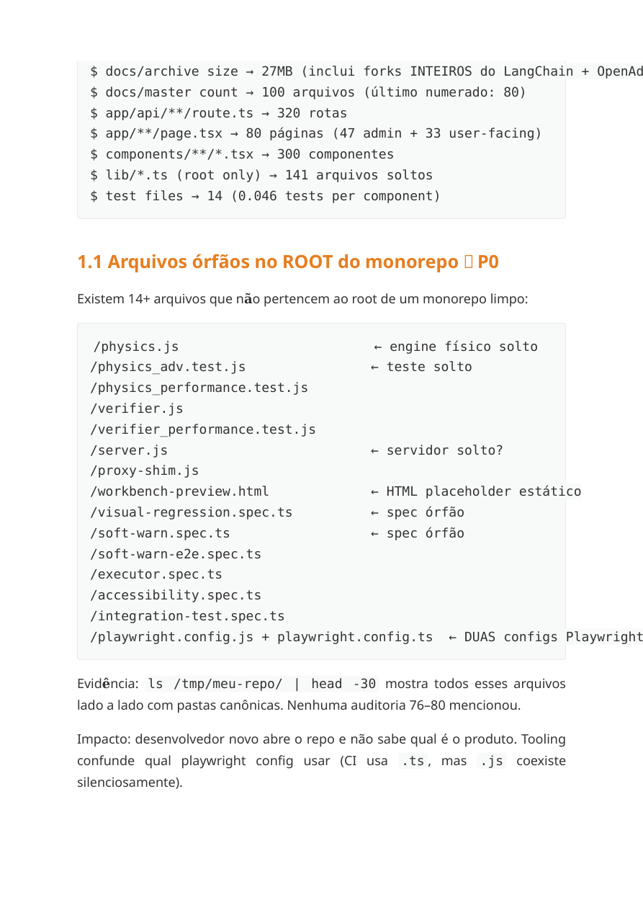
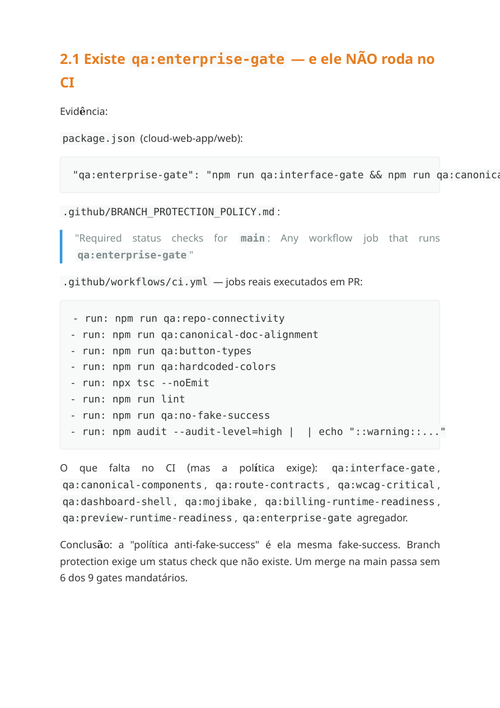

# Aethel Engine

Plataforma web para criação assistida por IA, com foco em Studio (`/dashboard`) e Workbench avançado (`/ide`).

## Rumo Canônico Atual
- Documento principal de rumo, benchmark e execução: `docs/master/82_AUDITORIA_V5_AETHEL_ENGINE_DEEP_2026-04-19.md`
- Auditoria complementar principal de sistemas e interfaces: `docs/master/83_AUDITORIA_PROFUNDA_SISTEMAS_INTERFACES_GITHUB_2026-04-22.md`
- Auditoria complementar principal de repositório, CI/CD e plano de ação: `docs/master/84_AUDITORIA_PROFUNDA_REPOSITORIO_PLANO_DE_ACAO_2026-04-22.md`
- Guardrail factual anti-fake-success: `docs/master/81_VALIDATED_PRIORITY_BACKLOG_2026-04-20.md`
- Mapa executivo do que já foi feito vs. o que falta: `docs/master/85_EXECUTION_STATUS_MAP_2026-04-22.md`
- Monorepo ativo com frontend principal em `cloud-web-app/web`
- Documentação canônica centralizada em `docs/master/`
- Política anti-fake-success aplicada como requisito de produto e engenharia

## Norte Visual da Auditoria V5

<table>
  <tr>
    <td></td>
    <td></td>
    <td></td>
  </tr>
  <tr>
    <td></td>
    <td></td>
    <td></td>
  </tr>
  <tr>
    <td></td>
    <td></td>
    <td></td>
  </tr>
</table>

## Prévia da Auditoria de Repositório + Plano de Ação

<table>
  <tr>
    <td></td>
    <td></td>
    <td></td>
  </tr>
</table>

## Fonte de Verdade
Leia nesta ordem:
1. `docs/master/00_INDEX.md`
2. `AETHEL_INTERFACE_BLUEPRINTS/00_INDEX.md`
3. `docs/master/82_AUDITORIA_V5_AETHEL_ENGINE_DEEP_2026-04-19.md`
4. `docs/master/83_AUDITORIA_PROFUNDA_SISTEMAS_INTERFACES_GITHUB_2026-04-22.md`
5. `docs/master/84_AUDITORIA_PROFUNDA_REPOSITORIO_PLANO_DE_ACAO_2026-04-22.md`
6. `docs/master/81_VALIDATED_PRIORITY_BACKLOG_2026-04-20.md`
7. `docs/master/85_EXECUTION_STATUS_MAP_2026-04-22.md`
8. `docs/master/78_EXECUTION_MASTER_PLAN_2026-04-12.md`
9. `docs/master/76_AUDITORIA_DEFINITIVA_BENCHMARK_2026-04-11.md`
10. `docs/master/75_DESIGN_SYSTEM_UNIFICATION_GUIDE_2026-04-10.md`
11. `docs/master/DEPRECATED_INDEX.md`

## Benchmark Competitivo (2026-04-11)
| Dimensão | Aethel | Cursor | Replit | Linear | v0/Vercel |
|---|---|---|---|---|---|
| Design System | 5/10 | 8/10 | 9/10 | 10/10 | 10/10 |
| Editor/IDE UX | 6/10 | 10/10 | 7/10 | N/A | 6/10 |
| AI Integration | 5/10 | 9/10 | 9/10 | N/A | 8/10 |
| Onboarding | 4/10 | 8/10 | 10/10 | 9/10 | 9/10 |
| **Média** | **4.7** | **7.9** | **8.7** | **9.1** | **8.5** |

Detalhes completos: `docs/master/82_AUDITORIA_V5_AETHEL_ENGINE_DEEP_2026-04-19.md`

## Estrutura Principal
- `cloud-web-app/web/`: app Next.js, APIs, design system e scripts de QA
- `AETHEL_INTERFACE_BLUEPRINTS/`: blueprints canônicos de produto e interface
- `docs/master/`: contratos canônicos de execução, auditoria e alinhamento
- `docs/archive/`: histórico documental não canônico
- `tools/`: scripts de QA, preflight e operação local

## Design System Canônico
Cascata oficial (definida em `docs/master/75_DESIGN_SYSTEM_UNIFICATION_GUIDE_2026-04-10.md`):
```
CSS Variables (globals.css) → Tailwind utilities → primitives e componentes canônicos
```

Componentes canônicos:
- `@/components/ui/Button`
- `@/components/ui/Input`
- `@/components/ui/Modal`
- `@/components/ui/primitives`
- `@/components/ui/premium`

## Setup Local Mínimo
1. Instale dependências:

```bash
npm install
cd cloud-web-app/web
npm install
cd ../..
```

2. Crie o runtime local:

```bash
npm run setup:local-runtime
```

Isso agora sincroniza:
- `.env` na raiz para `docker compose`
- `cloud-web-app/web/.env.local` para a app web
- `DATABASE_URL` local apontando para `localhost:5432`
- segredos locais de `JWT_SECRET` e `CSRF_SECRET`

3. Edite `cloud-web-app/web/.env.local` e ajuste pelo menos:
- `JWT_SECRET`
- `CSRF_SECRET`
- um provider real como `OPENROUTER_API_KEY` ou use `AETHEL_AI_DEMO_MODE=true`

4. Suba a stack local:

```bash
npm run up:local-stack
cd cloud-web-app/web
npm run db:push
cd ../..
```

Ou use o caminho canônico único:

```bash
npm run setup:local-db
```

5. Rode o preflight:

```bash
npm run qa:production-runtime-readiness
```

6. Suba a app:

```bash
npm run dev
```

## Validação
No app web:

```bash
cd cloud-web-app/web
npm run lint
npm run typecheck
npm run build
npm run qa:enterprise-gate
```

No repo:

```bash
npm run qa:canonical-doc-alignment
npm run qa:production-runtime-readiness
npm run qa:billing-runtime-readiness
npm run qa:preview-runtime-readiness
npm run qa:operator-readiness
```

## Prioridades Atuais (P0)
1. Unificar design system: CSS vars como fonte única
2. Esconder rotas aspiracionais atrás de feature flag
3. Ponte chat → editor com apply inline
4. Decompor AIChatPanelPro em módulos
5. Admin: migrar para mesma linguagem visual

Ver plano completo: `docs/master/82_AUDITORIA_V5_AETHEL_ENGINE_DEEP_2026-04-19.md`

## Regras de Execução
- Sem fake success
- Sem inflar claims de maturidade
- `PARTIAL`, `BLOCKED` e `ACTIVE` devem refletir runtime real
- Claim de L4/L5 só com evidência operacional no repositório
