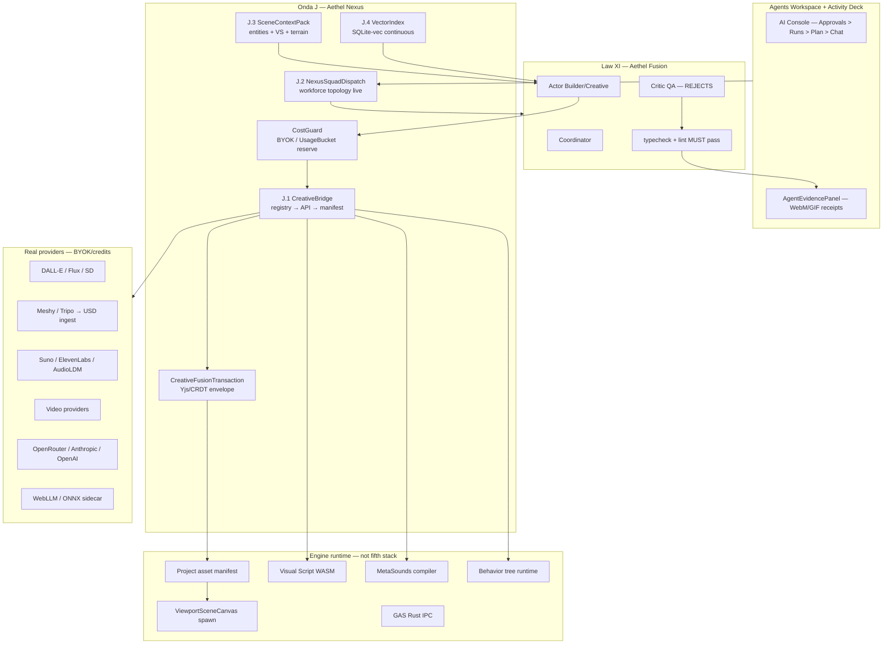

# Aethel Engine — AI Fusion & Creative Infinite Loop Spec

**Version:** 1.2 (Chief Architect — Deepened + per-step acceptance)  
**Status:** **Binding** — extends **Law XI** (Fusion orchestration) + **Law IX** (generative ingest + **Cost Guard Extendido**)  
**Canonical:** [`AETHEL_SUPREMACY_ROADMAP.md`](AETHEL_SUPREMACY_ROADMAP.md) v4.6  
**Studio cross-links:** J.7 → S7; L.14 scene context → S1/S3
**Forge (Universal IDE):** [`AETHEL_UNIVERSAL_IDE_FORGE_SPEC.md`](AETHEL_UNIVERSAL_IDE_FORGE_SPEC.md) — L.14 supersedes J.3  
**Audience:** Chief Architect, Aethel Fusion agents, implementers

---

## Mandate (Law XVI — Creative Fusion)

**No exported creative surface may ship mock artifacts, fake success, or disconnected generative paths.**

Every generative action — image, mesh, music, voice, video, world layout, Visual Script graph, cinematic beat, NPC behavior — MUST follow **one custody chain**:

```
Intent → CostGuard (BYOK/credits) → Workforce Squad → Fusion Router → Real Provider
     → Yjs/CRDT Transaction → Asset Manifest → Viewport Spawn → Evidence Ledger
```

**Three Chief Architect Travas (binding — v1.1):** see § **Chief Architect Travas** below. No Onda J step ships without all three.

**Forbidden forever in ship path:**
- `success: true` with empty or placeholder artifacts
- Agent tools that lie while HTTP APIs work (`ai-tools-registry.creative.ts` split)
- Capsule/proxy meshes presented as finished characters
- MetaSounds UI that logs instead of playing compiled graphs
- Dungeon/level generators returning empty geometry
- Critic that warns but never rejects (Law XI incomplete)
- Orchestrator `disabled` in production as permanent state (after Onda J.12)
- **Platform-funded generative calls** for free-tier users (Trava I)
- **Manifest/viewport/graph writes** outside Yjs transaction (Trava II)
- **VideoToMechanic** claiming full playable mechanics from video alone (Trava III)

**Financial rule (Law IX + Trava I):** BYOK or `UsageBucket` **reserve/settle before every provider dispatch** — including J.5–J.12 multimodal (vision, LiveVoice, BrowserOperator). Platform never absorbs cost. **Fail-closed ≠ mock:** missing BYOK/credits shows blocked UI with next action, never fake asset.

---

## Chief Architect Travas (Binding — v1.1)

### Trava I — Cost Guard Extendido (Platform Bankruptcy Prevention)

**Risk:** J.5–J.12 invoke heavy multimodal/token spend (GraphOperator vision, VideoToMechanic, LiveVoice, BrowserOperator). Unchecked calls bankrupt the platform.

**Rule:** **Entire Onda J** obeys Law IX cost discipline. **CreativeBridge (J.1) is the mandatory choke point** — no agent tool, squad dispatch, or HTTP route may call a paid provider without passing `evaluateCreativeCostGuard()` first.

| Gate | Mandate |
|------|---------|
| **Pre-flight** | `reserveMeteredUsage()` on `UsageBucket` OR valid BYOK profile (`byok-client-proxy.ts`) **before** provider HTTP |
| **Free tier** | **Zero** platform-funded generative calls — fail-closed with `blockedReason: 'credits_exhausted'` or `'byok_missing'` |
| **Settle** | Two-phase settle on success; release reservation on failure (pattern: `credit-wallet.ts` + `ai-expensive-generation-guard.ts`) |
| **Emit** | `onCloudLimitWarning` (Decision #9) before debit; block if budget exceeded |
| **J.5–J.12** | Each step declares `estimatedTokenWeight` via `model-cost-weights.ts`; Coordinator rejects mission if budget insufficient |

**Implementation targets:** extend `lib/server/ai-expensive-generation-guard.ts` → `lib/production/creative-cost-guard.ts`; wired **only** through `creative-artifact-bridge.ts`.

**Prohibition:** Bypassing CreativeBridge to hit `/api/ai/*` or external APIs without CostGuard reservation — **forbidden**.

---

### Trava II — Undo Transacional Obrigatório (Project Destruction Prevention)

**Risk:** GraphOperator (J.5) or any fusion write corrupts Visual Script, scene graph, or manifest with no recovery.

**Rule:** Every Creative Fusion mutation touching **manifest**, **viewport scene graph**, **Visual Script**, **SoundCue**, **Quest**, or **Behavior Tree** MUST execute inside a **Yjs/CRDT transaction** with undo stack integration.

| Requirement | Mandate |
|-------------|---------|
| **Envelope** | `CreativeFusionTransaction.begin()` → mutations → `commit()` or `abort()` |
| **Undo** | User **Ctrl+Z** / **Cmd+Z** reverts entire AI edit atomically — target **≤1 ms** local undo latency on typical graphs |
| **Scope** | One transaction = one AI "apply" action; nested partial applies **forbidden** |
| **Evidence** | Ledger records `transactionId` + Yjs snapshot hash before/after |
| **Offline (Law VIII)** | Local Yjs persistence (`visual-script-collaboration.ts` IndexedDB pattern) — undo works airgapped |

**Implementation targets:**
- `lib/production/creative-fusion-transaction.ts` — wraps `Y.Doc.transact()`
- Scene: extend `lib/yjs-collaboration.ts` scene locks
- VS: extend `lib/visual-script-collaboration.ts`
- Monaco/code patches: existing apply ghost + separate undo stack (Law XI path)

**Prohibition:** Direct manifest/viewport write from agent without `CreativeFusionTransaction` — **forbidden**.

---

### Trava III — VideoToMechanic Platform Reality (Hallucination Prevention)

**Risk:** J.6 **VideoToMechanic** marketed or implemented as "video → full GTA mechanics" — laboratory research, not shippable product.

**Rule:** VideoToMechanic extracts **observable logic structure** from short clips — it does **not** auto-implement physics, combat, or netcode.

| Allowed output (J.6) | Forbidden output |
|---------------------|------------------|
| **State Machine blueprint** (states, transitions, triggers inferred from video) | Full game loop or GTA-class mechanics from one clip |
| **Behavior Tree scaffold** (composites, decorators, blackboard keys — **unwired** to Rapier/GAS) | Auto-wired hit detection, damage, multiplayer |
| **Visual Script stub nodes** (placeholders with labels: "USER: wire physics here") | Claiming playable combat without user wiring |
| **Evidence receipt** with confidence scores per inferred transition | Marketing "upload gameplay → playable clone" |

**User responsibility (explicit UX):** Creator plugs Rapier impulses, GAS abilities, and VS execution paths after scaffold generation. **GraphOperator (J.5)** wires SoundCue/Quest/VFX nodes only — same undo transaction (Trava II).

**Marketing gate:** "Video-to-design scaffold" allowed after J.6; **"video-to-playable AAA" forbidden forever** on web; desktop requires user wiring + playtest evidence graph.

**Prohibition:** Shipping VideoToMechanic output that auto-runs combat/physics without documented user wiring steps — **forbidden**.

---

## State today (audit — honest)

| Layer | Status | Evidence |
|-------|--------|----------|
| Fusion model router | **REAL (partial)** | `intelligent-model-router.ts`, `fusion-role-map.ts` — **v1.1 Fusion Auto multi-specialist (ban Nano):** [`AETHEL_INTELLIGENT_ROUTING_AND_CONTEXT_COMPRESSION.md`](./AETHEL_INTELLIGENT_ROUTING_AND_CONTEXT_COMPRESSION.md) |
| 25 orchestrator roles | **REAL spec, DISABLED prod** | `ORCHESTRATOR_EXECUTION_MODE = 'disabled'` |
| 7 workforce squads | **REAL spec** | `agent-workforce-topology.ts` |
| 13 game production graphs | **REAL spec** | `game-production-spine.ts` |
| Production tool bus + ledger | **REAL, unwired chat** | `agent-tool-bus.ts`, `task-evidence-ledger.ts` |
| HTTP generative APIs | **REAL** | `/api/ai/{image,music,voice,3d,video}` |
| Agent creative tools | **FAIL-CLOSED (split)** | `ai-tools-registry.creative.ts` |
| Actor-Critic reject loop | **MISSING** | Law XI — critic append-only |
| Semantic RAG | **PARTIAL** | Hash bag-of-words ~120 files |
| Scene-aware context | **MISSING** | Code-only deep packs |
| MCP server | **REAL, parallel** | `/api/mcp` — not primary agent loop |
| Browser Operator | **PARTIAL** | In-memory recorder — no Playwright |

**Implementation score today:** ~3/10 end-to-end creative loop. **Architecture score on paper:** ~9/10.

**Capability matrix (plans + providers + gaps):** [`AETHEL_AI_PROVIDER_CAPABILITY_MATRIX.md`](./AETHEL_AI_PROVIDER_CAPABILITY_MATRIX.md) + `creative-provider-matrix.ts`.

---

## Unified architecture (target — no parallel stacks)



### Single protocol (ACP — Agent Client Protocol)

**Merge target:** `lib/ai/agent-tool-bus.ts` (events) + `lib/production/agent-tool-bus.ts` (governance) → **one ACP surface** consumed by cloud WSS and Tauri Rust (`IMPROVE-AI-001` → **J.11**).

Until merge: all creative writes MUST route through `agent-tool-job-runner.ts` + `task-evidence-ledger.ts` — never bypass governance bus.

---

## Contracts (binding interfaces)

### `CreativeArtifactRequest`

```typescript
export interface CreativeArtifactRequest {
  domain: 'image' | 'mesh' | 'music' | 'voice' | 'video' | 'texture' | 'world-layout' | 'vs-graph' | 'bt-graph' | 'cinematic-beat' | 'video-to-scaffold';
  prompt: string;
  projectId: string;
  sceneSelection?: string[];       // entity IDs
  targetPaths?: string[];          // manifest paths
  evidenceKind: string;            // ledger receipt type
  /** Trava I — REQUIRED before any paid provider call */
  costGuard: {
    byokProfileId?: string;
    usageBucketId?: string;
    estimatedTokenWeight: number;  // from model-cost-weights.ts
    reservationId?: string;        // set by creative-cost-guard after reserve
  };
  /** Trava II — REQUIRED for manifest/viewport/graph writes */
  fusionTransactionId?: string;    // CreativeFusionTransaction id
}
```

### `CreativeArtifactResult`

```typescript
export interface CreativeArtifactResult {
  success: boolean;
  artifactId: string;              // manifest entry — REQUIRED on success
  previewUrl?: string;             // viewport spawn handle
  provider: string;
  costUsd: number;
  evidenceReceiptId: string;       // task-evidence-ledger
  blockedReason?: 'byok_missing' | 'credits_exhausted' | 'provider_down' | 'scope_violation' | 'cost_guard_denied' | 'transaction_aborted';
  fusionTransactionId?: string;
  yjsSnapshotHashBefore?: string;
  yjsSnapshotHashAfter?: string;
}
```

### `CreativeFusionTransaction` (Trava II)

```typescript
export interface CreativeFusionTransaction {
  id: string;
  projectId: string;
  yDocScope: 'scene' | 'visual-script' | 'sound-cue' | 'quest' | 'behavior-tree' | 'manifest';
  begin(): Promise<void>;
  commit(): Promise<{ snapshotHashAfter: string }>;
  abort(): Promise<void>;           // no manifest/viewport mutation persisted
}
```

**Path targets:**
| Module | Path |
|--------|------|
| Creative bridge | `lib/production/creative-artifact-bridge.ts` |
| **Cost Guard (Trava I)** | `lib/production/creative-cost-guard.ts` |
| **Fusion transaction (Trava II)** | `lib/production/creative-fusion-transaction.ts` |
| **VideoToMechanic scaffold (Trava III)** | `lib/production/video-to-scaffold-extractor.ts` |
| Manifest register | `lib/production/asset-manifest-register.ts` |
| Scene context pack | `lib/production/multi-surface-context-pack.ts` (**L.14** — supersedes `scene-context-pack.ts`) |
| Vector index | `lib/server/vector-index/` (SQLite-vec) |
| Nexus dispatch | `lib/production/nexus-squad-dispatch.ts` |

---

## Workforce routing (13 graphs → squads)

| Mission | Squad | Primary agents | Output |
|---------|-------|----------------|--------|
| Full game | Game Production | game-designer, gameplay-engineer, cinematic-director | 13 spine graphs evidence-complete |
| World / biomes | Game Production + World Architect | world-graph owner | PCG + terrain + streaming |
| Characters / enemies | Technical Artist + USD path | asset-pipeline-graph | Rigged USD, not proxy capsule |
| Combat / abilities | Combat Designer + GAS | combat-graph + VS WASM | Hit chain → GAS real |
| Audio / music | Film & Audio | audio-composer, MetaSounds | **Library Foley first (#64)**; gen score/VO Plan B; Law IX ingest |
| Cinematics | Film & Audio | cinematic-director | Sequencer + **engine capture** ([Director doctrine #63](./AETHEL_CINEMATIC_DIRECTOR_DOCTRINE.md)) — not Veo default |
| Code / engine | Software Platform | engineer, qa, security-auditor | Law XI gated patches |
| Research | Research Intelligence | researcher, fact-checker | Citations → ledger |
| Browser / competitive intel | Browser Operations | browser-operator | Playwright evidence |

**Human-held (never autonomous):** financial-investment squad, production deploy, commerce checkout until H.0 audited.

---

## Onda J — Aethel Nexus (Creative Infinite Loop)

**Goal:** Market-best creative IDE — one prompt to playable, evidence-backed, no mock path. **Finish line for AI parity claims** (vs Cursor, Unity Muse, UE Fab, Runway).

**Prerequisite:** A.5 (Law XI wiring) for quality gate; parallel with B→E engine wiring.

| Step | Deliverable | Laws | Blocks mock | Status |
|------|-------------|------|-------------|--------|
| **J.1** | **CreativeBridge** + **CostGuard** + **Maestro Delegation (#61)** + **MoA ≤3** + **Auto-Heal L.5** — Premium pin decomposes; nucleus on Maestro; peripherals → Swarm ∥ ([Swarm v1.2](./AETHEL_APEX_FAST_SWARM_ORCHESTRATION.md)) | XVI, IX, XI, **Trava I** | Agent/API split; platform bankruptcy | **DONE** |
| **J.2** | **Nexus UI** — “Maestro planning…” / “Swarm on …” / “Healing…”; Activity Deck: nucleus vs peripherals; never L.5 FAIL as success | XI, X | Invisible governance | **DONE** 2026-07-11w |
| **J.3** | ~~SceneContextPack~~ → **L.14 MultiSurfaceContextPack** (scene slice) — see Forge spec Decision #50; **tokenBudget enforced** | XVI, XV | Code-only RAG | **DONE** (A2) |
| **J.4** | **VectorIndex** — continuous fs_watch, SQLite-vec embeddings, BYOK optional cloud embed — **retrieval for pack builder, not full-file dump** | VIII, XVI | Hash RAG ceiling | **DONE** core (sqlite-vec ext HELD) |
| **J.5** | **GraphOperator** — prompt → SoundCue / Quest / VFX nodes wired; **inside Yjs transaction** | XVI, IV, **Trava II** | Manual-only graphs | **DONE** 2026-07-11af |
| **J.6** | **VideoToMechanic** — clip → **State Machine blueprint + BT scaffold** (not auto-physics); user wires VS/GAS | XVI, VII, **Trava III** | "Video → GTA" hallucination | **DONE** 2026-07-11af (scaffold path) |
| **J.7** | **UsdIntegrator** — prompt positions library assets; Meshy → USD cleanup; no amorphous Tripo-only ship; **letter bw** game-ready refine conveyor (`lib/mesh-quality/*`: retopo→LOD→UV→rig→Radiance PBR→collider→critic→AethelPack) owns quality after clay ingest | XVI, VI | Proxy meshes / Tripo-only ship | **DONE** 2026-07-11af (honesty CORE; USD viewer **HELD**) + **bw** refine CLOSED 2026-07-13 (Instant Meshes / live clay poll **HELD**) |
| **J.8** | **BrowserOperator** — governed allowlisted fetch/snapshot + CostGuard per session; CDP/Playwright farm **HELD** | XVI, IX, **Trava I** | In-memory recorder only | **DONE** CORE 2026-07-11ai |
| **J.9** | **VisualEvidence** — OffscreenCanvas / capture previz WebM in ledger; stepping stone to **engine cinematic capture** (#63) — pixel-gen video **not** default trailer path | XI, XVI | Text-only receipts | **DONE** patch-hash + PNG helper; WebM **HELD** |
| **J.10** | **LiveVoice** — governed PTT/generate→play + CostGuard; duplex WebRTC **HELD** | XVI, IX, **Trava I** | Fake WebRTC room as LIVE | **DONE** CORE 2026-07-11aj |
| **J.11** | **ACP Unification** — single bus cloud + desktop Rust | XVI, VIII | Dual bus confusion | OPEN |
| **J.12** | **OrchestratorProd** — **Maestro Delegation** → parallel domain MoA cells; Nano banned (**#53 + #55 + #61**) | XI, XVI | Disabled orchestrator | OPEN |

**J-readiness checklist (every creative PR):**
- [ ] **Trava I:** CostGuard reserve → provider → settle/release; zero platform pay on free tier
- [ ] **Trava II:** `CreativeFusionTransaction` wraps all manifest/viewport/graph writes; Ctrl+Z reverts atomically
- [ ] **Trava III:** VideoToMechanic (if touched) outputs scaffold only — no auto-physics/combat
- [ ] Artifact lands in manifest with hash
- [ ] Viewport spawn OR explicit blockedReason (never fake success)
- [ ] Evidence receipt in `task-evidence-ledger` with transactionId + snapshot hashes + **modelId + taskDomain**
- [ ] Scene / multi-surface context pack attached if domain = world/mesh/vs/code (L.14); **pack ≤ tokenBudget**
- [ ] Critic pass if code touched (Law XI) — **TS:** typecheck+lint; **Rust:** cargo check+clippy+test
- [ ] **Routing:** Apex for TaskDomain; Workers = Fusion Auto Apex; **Nano banned**
- [ ] **Zero Amnesia:** Architecture Laws pack + L.14 before any write (#58)
- [ ] **Decision #55–#58:** ban Nano; Apex-first; Laws gate; Focus doctrine
- [ ] **Decision #59–#61:** Maestro Delegation + MoA + Auto-Heal; ProjectMemoryDigest on every leg
- [ ] **J-ACC Maestro:** Premium pin multi-part → peripherals **not** solo on Premium (sun/texture/UI → Swarm)
- [ ] **J-ACC MoA:** user never receives L.5 FAIL as success; CostGuard reserves Maestro+MoA+heal
- [ ] **J-ACC Swarm:** evidence logs Maestro plan + 1–3 proposals/cell + synthesis + heal turns

---

## Release Train AI-v1 (parallel to RTv1 Hub)

| Order | Deliverable | Gate |
|-------|-------------|------|
| **AI-v1-a** | A.5 Law XI — Actor-Critic + gates; Actor = **Fusion Auto Worker**; Critic Premium if available else Fusion Auto strong | No patch without gate |
| **AI-v1-b** | J.1 Bridge + CostGuard + **Maestro Delegation + MoA + Auto-Heal** (#60–#61) | Trava I + L.5 + Premium saved |
| **AI-v1-c** | J.2 Nexus UI + J.9 VisualEvidence + **transaction undo UX** | **DONE** 2026-07-11w — Trava II visible; WebM HELD |
| **AI-v1-d** | J.4 VectorIndex + **L.14 MultiSurfaceContextPack** (creative scene slice) | Project-wide + multi-surface context |
| **AI-v1-e** | J.5–J.7 GraphOperator + **VideoToMechanic scaffold** + USD | **DONE** 2026-07-11af — Trava III BT/SM only; USD viewer HELD |
| **AI-v1-f** | J.8 BrowserOperator CORE | **DONE** 2026-07-11ai — governed research; CDP farm HELD |
| **AI-v1-g** | J.10 LiveVoice CORE | **DONE** 2026-07-11aj — PTT/generate→play; duplex WebRTC HELD; J.11/J.12 still OPEN |
| **AI-v1-h** | J.11 ACP + J.12 OrchestratorProd | Single protocol prod |

---

## Market parity target (honest — after J + G)

| Capability | UE5/Fab | Unity Muse | Cursor | Runway | **Aethel after J+G** |
|------------|---------|------------|--------|--------|----------------------|
| In-editor mesh gen | MetaHuman | Limited | — | — | USD + Meshy bridge |
| Code agent quality | — | Script | **Leader** | — | Cursor-class + evidence |
| Multi-agent squads | — | — | Emerging | — | 7 squads + 13 graphs |
| Generative audio ingest | Platform | Weak | — | — | Law IX full |
| Video → gameplay scaffold | — | — | — | Video | **J.6 BT/state machine scaffold** — user wires physics |
| Governance / audit | Weak | Weak | Medium | Weak | **Leader** |
| Web publish + AI create | — | Cloud | — | — | **Wedge #1** |
| Scene-aware AI | Native | Partial | Repo | — | J.3 scene pack |
| Offline creative | — | — | Local | — | WebLLM + sidecar |

**Claim allowed after Onda J + G:** best **evidence-backed creative IDE** for indie-to-mid-core games, film beats, and web publish — not Frostbite film sim (explicitly out of scope until post-G scope doc).

---

## Prohibitions (Law XVI + Travas)

1. **No mock artifact** in manifest or viewport.
2. **No agent tool** bypassing CreativeBridge once J.1 ships.
3. **No generative call** without CostGuard reserve (Trava I) — zero platform pay on free tier.
4. **No manifest/viewport/graph write** without `CreativeFusionTransaction` (Trava II).
5. **No VideoToMechanic auto-physics/combat** — scaffold only (Trava III).
6. **No orphan blobs** — all output in project manifest + CAS path (Law VI).
7. **No Tripo-only amorphous mesh** as shipped character — USD integrator required (J.7). **Letter bw game-ready refine wedge:** Meshy/Tripo may win raw clay; Aethel owns retopo + LOD + UV/tangents + MM/DQ auto-rig + Radiance contextual PBR (no albedo bake) + collider cook + topology Actor-Critic + AethelPack — CostGuard/CreativeBridge governed; `tripoOnlyShipAllowed: false` always. **Letter bx:** live Tripo/Meshy/Luma job poll (webhook-ready) → OBJ/GLB ingest → same conveyor; `liveClayPollReady` only when path real.
8. **No MetaSounds "play log"** as shipped audio — compiler + runtime required (Law IV).
9. **No empty PCG** rooms/hallways as shipped level — block or generate real geometry.
10. **No marketing "AI creates your game"** until J.1 + J.2 + 3 spine graphs evidence-complete.
12. **No default cinematic via Veo/Sora pixel-gen** — Director path (#63); pixel video = opt-in B-roll only.  
15. **No lazy truncation in Fusion patches** — `#66` Anti-Laziness; LazyInspector before L.5; no `// ...` / TODO stubs in new hunks.

---

## Cross-links

| Doc | Relationship |
|-----|--------------|
| `AI_CRITIQUE_DEBT_REGISTRY.md` | DEBT-AI-* must close before J steps |
| `FUTURE_IMPROVEMENTS_REGISTRY.md` | IMPROVE-AI-* canonical home = Onda J |
| `game-production-spine.ts` | 13 graphs = acceptance criteria for game missions |
| `AETHEL_HARDWARE_SCALABILITY_SPEC.md` | Capability Score in multi-surface context (L.14) |
| `AETHEL_UNIVERSAL_IDE_FORGE_SPEC.md` | Onda L — J.3 absorbed into L.14; J.4 feeds L.12 |
| `AETHEL_INTELLIGENT_ROUTING_AND_CONTEXT_COMPRESSION.md` | **v1.2** Apex Router · elite OW · Laws gate · #55–#58 |
| `AETHEL_APEX_DOCTRINE_AND_EXECUTION_FOCUS.md` | **Focus 1→2** · Zero Amnesia · Zero-MVP · #56–#58 |
| `AETHEL_APEX_FAST_SWARM_ORCHESTRATION.md` | **#59–#61** Maestro Delegation · MoA · Auto-Heal · J.1/L.6 |
| `AETHEL_CINEMATIC_DIRECTOR_DOCTRINE.md` | **#63** Engine Film — Fusion directs; GPU shoots; Veo demoted |
| `AETHEL_ANTI_LAZINESS_PROTOCOL.md` | **#66** — truncation ban + LazyInspector + chunking |
| `AETHEL_METASOUNDS_SPEC.md` | S4 compiler — Law IV |

---

## Approved decisions (#30–42, v4.2 + #53–#64 + #66)

| # | Decision |
|---|----------|
| 30 | Law XVI — Creative Fusion; single artifact pipeline; no mock ship path |
| 31 | Onda J — Aethel Nexus; AI parity finish line |
| 32 | CreativeBridge unifies agent registry + HTTP APIs + manifest |
| 33 | USD integrator mandatory for character/mesh ship — not proxy capsule |
| 34 | Orchestrator enabled in production after J.12 |
| 35 | IMPROVE-AI-001→015 absorbed into Onda J.1–J.12 |
| **36** | **Trava I** — Cost Guard Extendido; J.1 choke point; zero platform pay free tier |
| **37** | **Trava II** — Yjs/CRDT transactional undo; Ctrl+Z atomic AI revert |
| **38** | **Trava III** — VideoToMechanic = BT/state machine scaffold only; user wires physics |
| **39** | **Law XI Rust gates** — `cargo check` + `cargo clippy -- -D warnings` + `cargo test` mandatory for any `.rs` AI patch |
| **53** | **Maestro/Critic prefer Premium elite + Workers = Apex Fusion Auto** (amended v1.2) |
| **55** | **Nano / dumb-fallback lane banned** |
| **56** | **Apex Doctrine + Absolute Focus 1→2** — see Apex Doctrine doc |
| **57** | **Apex-first ranking** — no COGS concession that drops below domain elite |
| **58** | **Architecture Laws gate** — no agent write without Laws + cartography + context pack |
| **59** | **Apex Fast Swarm** foundation |
| **60** | **MoA (≤3 Apex generators → Critical Synthesizer) + Auto-Heal L.5** |
| **61** | **Maestro Delegation** — Premium/Opus pin decomposes; critical nucleus on Maestro; peripherals → Apex MoA in parallel; trivial tasks skip Premium |
| **62** | **Adaptive MoA + Metered Delegation** — width 1/2/3 by Risk; trivial bypass; Free/Starter caps |
| **63** | **Cinematic Director** — Fusion writes set/camera/lights; engine/GPU captures film ($0 video API); Veo/Sora opt-in B-roll only |
| **64** | **Audio Library-First** — SFX via Treasury/Freesound + MetaSounds local transform ($0 gen); Suno/ElevenLabs only for exclusive OST lyrics + speech |
| **66** | **Anti-Laziness Protocol** — truncation ban + LazyInspector pre-L.5 + chunk ≤300 LoC; CostGuard `settle: 0` on lazy reject — [`AETHEL_ANTI_LAZINESS_PROTOCOL.md`](./AETHEL_ANTI_LAZINESS_PROTOCOL.md) |

---

## Per-step J acceptance (binding — expand J delivery map)

| Step | Acceptance ID | Criteria | Fixture |
|------|---------------|----------|---------|
| **J.1** | J-ACC-01 | Agent + HTTP same manifest path | Split registry test |
| **J.1** | J-ACC-02 | Free tier blocked without BYOK | CostGuard unit |
| **J.1** | J-ACC-03 | Reserve/settle on success path | Wallet integration |
| **J.2** | J-ACC-04 | Evidence panel shows ledger receipt | UI E2E |
| **J.4** | J-ACC-05 | fs_watch re-index < 5s p95 | Monorepo slice |
| **J.5** | J-ACC-06 | GraphOperator inside Yjs tx; Ctrl+Z | VS graph |
| **J.6** | J-ACC-07 | Video → BT scaffold only; no Rapier wire | Trava III test |
| **J.7** | J-ACC-08 | Meshy → USD → viewport; no capsule | **GF-USD-001** |
| **J.8** | J-ACC-09 | Governed fetch/snapshot session evidence in ledger (CDP farm HELD) | Browser CORE 2026-07-11ai |
| **J.9** | J-ACC-10 | WebM before/after in ledger | **GF-ANIM-001** |
| **J.12** | J-ACC-11 | 3 spine graphs evidence-complete | **GF-AI-001** |

---

## Competitor deep matrix (creative + engineering)

| Dimension | UE Muse/Fab | Unity Muse | Cursor | Devin | Runway | **Aethel J+L** |
|-----------|-------------|------------|--------|-------|--------|----------------|
| In-editor mesh | Strong | Weak | — | — | — | J.7 + S7 |
| Scene-aware prompts | Native | Partial | Repo only | — | — | **L.14 leader** |
| Generative audio | Weak | Weak | — | — | Strong | S4 + Law IX |
| Video understanding | — | — | — | — | Strong | J.6 scaffold only |
| Cost transparency | Weak | Weak | Medium | Opaque | Subscription | **Trava I leader** |
| Undo AI edits | Weak | Weak | Partial | — | — | **Trava II leader** |
| Evidence audit | Weak | Weak | Medium | Medium | Weak | **Ledger leader** |
| Web game publish | — | Cloud | — | — | — | **Wedge #1 leader** |

---

## Workforce → Studio pillar routing

| Squad mission | Primary J steps | Studio output |
|---------------|-----------------|---------------|
| World / biomes | J.5, J.7 | S2 PCG + S7 ingest |
| Characters | J.7 | S3 + S7 USD |
| Combat | J.5, J.6 | S5 GAS + VS WASM |
| Audio / film | J.5, J.9 | S4 MetaSounds + S3 sequencer |
| Code / platform | J.11, J.12 | L Forge path |

See [`AETHEL_SUPREMACY_EXECUTION_PLAYBOOK.md`](AETHEL_SUPREMACY_EXECUTION_PLAYBOOK.md) for GF-AI-001 definition.

---

## 3D Character Generation & Local-First AI Execution Spec

### 1. The Two-Stage Local AI Pipeline (Bypassing Consumer VRAM Limits)
To bypass the VRAM and compute limitations of consumer GPUs (targeting 8GB to 12GB configurations), Aethel rejects heavy direct Text-to-3D models locally. Instead, it defines a decoupled two-stage feed-forward local pipeline:

```
[Prompt] ➔ [Stage A: Quantized Image Gen (FLUX/SD)] ➔ [High-Res Orthographic Image]
                     ↓ (Swaps LoRA weights in VRAM)
            [Stage B: Reconstruction (Stable Fast 3D/TripoSR)] ➔ [Raw 3D Clay Mesh]
```

* **Stage A: Style & Intent Generation**:
  * **Engine**: Runs quantized image generation (e.g., FLUX.1-schnell 8-bit/4-bit GGUF or Stable Diffusion 3.5 Medium) locally to render high-resolution orthographic reference sheets (front, side, back views) in under 3 seconds.
  * **Mastery via LoRA Paging**: Swaps small Low-Rank Adaptation (LoRA) weight packages (20MB to 150MB each) dynamically in VRAM based on the prompt's style parameters (e.g., *low-poly*, *voxel*, *realistic sci-fi*, *cartoon*). This is governed by [`lora-pager-inject.ts`](file:///e:/Aethel%20engine/cloud-web-app/web/lib/world-forge/lora-pager-inject.ts) utilizing `transitionVramPager` to load/unload models dynamically.
* **Stage B: Spatial 3D Reconstruction**:
  * **Engine**: Runs feed-forward image-to-mesh reconstruction models (e.g., Stable Fast 3D / TripoSR weights) via ONNX Runtime configured in [`onnx-ort-session.ts`](file:///e:/Aethel%20engine/cloud-web-app/web/lib/native-gen/onnx-ort-session.ts), outputting the initial texturized clay mesh in under 2 seconds.

### 2. Desktop Integration & Tauri Sidecar Architecture
* **Process Isolation**: Local generation models run inside dedicated Tauri sidecars managed by [`SidecarManager.tsx`](file:///e:/Aethel%20engine/apps/studio-local/src/panels/SidecarManager.tsx). 
* **Optional SDK Download**: The local AI pipeline is distributed as an optional, native desktop package. When inactive or missing, the IDE falls back seamlessly to paid Cloud Provider APIs (Tripo/Meshy) or blocks with clear BYOK prompt options.

### 3. Local Quality Refining Engine (Beating Cloud Models on Local Hardware)
Raw clay output from any fast local generator lacks clean topology, causing performance loss. Aethel achieves market-leading visual quality by processing raw outputs through three local post-processing gates:

#### A. Clean Auto-Retopology (Zero Cloud Mesh Mess)
* **Execution**: Raw meshes generated locally are processed through [`auto-retopology.ts`](file:///e:/Aethel%20engine/cloud-web-app/web/lib/mesh-quality/auto-retopology.ts).
* **Target**: Reduces polycount from 500k to ~15k quads, resolving erratic point distributions and creating clean topology optimized for real-time runtime culling.

#### B. Normal Map & Texture Baking
* **Execution**: Resolves the "UV Spaghetti" issue by automatically unwrapping the retopologized mesh.
* **Target**: Bakes high-definition normals, albedo, and roughness maps directly from the high-density raw clay model. These are fed directly into the [`aaa-material-system.ts`](file:///e:/Aethel%20engine/cloud-web-app/web/lib/aaa-material-system.ts) pipeline, rendering pores, fabric wrinkles, and metallic surfaces.

#### C. Adaptive Skeleton Rigging for Custom Deformities
* **Execution**: Maps the retopologized mesh to standard animation structures.
* **Target**: Computes bone weights for humanoid joint limits defined in [`motion-matching-system.ts`](file:///e:/Aethel%20engine/cloud-web-app/web/lib/motion-matching-system.ts). When deformities are present, coordinates project against nearby joints, preventing skin clipping during motion playback.

#### D. Dynamic Cloth Simulation Separators
* **Execution**: Scans the input prompt and mesh topology for clothing identifiers.
* **Target**: Automatically flags soft-body geometry (e.g., *skirts*, *cloaks*) and registers them with the [`cloth-simulation.ts`](file:///e:/Aethel%20engine/cloud-web-app/web/lib/cloth-simulation.ts) node, separating them from rigid bone physics to prevent clipping during movements.

### 4. High-Efficiency LoRA Paging & VRAM Management (Memory Alignment)
To guarantee high-efficiency execution without causing Out-of-Memory (OOM) failures or interrupting the active WebGPU render loop in the viewport, the local AI runtime operates under a strict memory paging cycle aligned with [`lora-pager-inject.ts`](file:///e:/Aethel%20engine/cloud-web-app/web/lib/world-forge/lora-pager-inject.ts):

* **Dynamic Weight Hot-Swapping**:
  * The primary base model (UNet / DiT weights, VAE, Text Encoders) is locked in GPU memory (VRAM) as a static layer (~4.5GB VRAM footprint).
  * LoRA adapter layers (Style adapters, character sheets, and specific item geometry guidelines, ~80MB to 120MB each) are loaded and unloaded dynamically on the fly based on the prompt's parsed tokens.
  * Loading an adapter takes **<150ms** via direct tensor injection, bypassing the need to re-initialize or load full models (which takes 5s+).
* **VRAM / System RAM Caching (Dual-Buffer)**:
  * Aethel maintains a local cache directory of style LoRAs in the user's system disk.
  * **Pre-fetching Engine**: As the user types in the prompt bar, the token parser predicts which LoRAs will be required. These are pre-loaded from disk into System RAM. When generation is triggered, the sidecar streams the active tensors directly into VRAM.
  * **Memory Paging Cycle**:
    ```
    System Disk ➔ (Pre-fetch) ➔ System RAM ➔ (Direct Stream) ➔ VRAM (Active Inference)
                                                                 ↓
                                              (Unload) ➔ Released (Return to Viewport)
    ```
* **Viewport Pause Integration**:
  * During local AI generation, the viewport rendering loop is throttled down to **5 FPS** or paused (`resume_viewport` ➔ `unload_model` handshake) to release WebGPU context resources. Once the meshlet is cooked, the memory is released, and the viewport returns to 60 FPS instantly.
* **Fail-Safe CPU Offloading**:
  * If the user's hardware VRAM is fully saturated (e.g., scoring < 30 on the Capability Score), tensors are paged through CPU RAM using quantized layers. Inference time increases slightly (from 3s to 8s), but execution is guaranteed to succeed without crashes.


