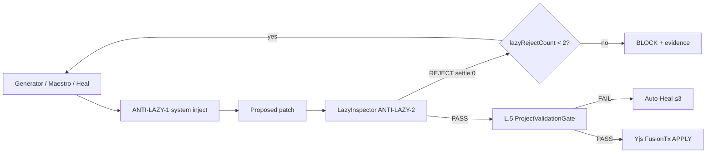

# Aethel Engine — Anti-Laziness Protocol (Fusion Absolute Travas)

**Version:** 1.0 (Chief Architect + Founder — **Decision #66**)  
**Status:** **Binding** — last governance lock before Focus 1A code  
**Date:** 2026-07-09  
**Parents:** Law XI · Zero-MVP · L.5 ProjectValidationGate · Swarm v1.3 (#59–#62) · Apex Doctrine  

**Decision #66:** **Anti-Laziness Protocol** — truncation ban in system prompts + LazyInspector pre-L.5 + intelligent chunking — **APPROVED** (Founder 2026-07-09).

**Founder one-liner:** *Fusion never accepts lazy code. Prompt forbids truncation; LazyInspector rejects before the compiler burns Fast; Maestro chunks so models never “summarize” a 3k-line file.*

**Namespace note:** Fusion **#66** ≠ Studio pillar decision IDs in Index § (also numbered #59–#66). Do not conflate.

---

## 0. Why this exists

Modern models **truncate** large edits (`// ... rest of code ...`, `TODO: implement`). That breaks engines even when the chat looks confident.

| Layer | Role | Cost |
|-------|------|------|
| **Zero-MVP + Law XI Critic** | Policy reject on stubs | May miss; LLM Critic can fail |
| **L.5 ProjectValidationGate** | Compiler/typecheck sovereign | **Expensive** if laziness already happened |
| **#66 Anti-Laziness** | Prompt + regex **before** L.5 | **Cheap** — save Fast/Premium |

**#66 does not replace L.5.** It is the **first line**. L.5 remains the **second line**.

---

## 1. Absolute Travas (ANTI-LAZY-1…5)

| ID | Trava | Binding rule |
|----|-------|--------------|
| **ANTI-LAZY-1** | **Anti-truncation system prompt** | Injected into **every** Fusion leg (Maestro, MoA generators, Synthesizer, Heal Worker) |
| **ANTI-LAZY-2** | **LazyInspector** | Regex scan on proposed patch **before** L.5; reject → internal retry `settle: 0` |
| **ANTI-LAZY-3** | **Intelligent chunking** | Apply surface ≤ **~300 LoC** per `ChewedWorkerTask` / MoA cell; split larger work |
| **ANTI-LAZY-4** | **L.5 sovereign** | Lazy PASS still requires ProjectValidationGate before user-visible APPLY |
| **ANTI-LAZY-5** | **Evidence + cap** | `lazyRejectCount` in ledger; **max 2** lazy-retries per leg; then BLOCK (not infinite loop) |

---

## 2. ANTI-LAZY-1 — System prompt (mandatory inject)

Canonical English (UI/prompts EN-only):

> You are **terminantly forbidden** from summarizing or eliding code.  
> **Never** use placeholders such as `// ...`, `// rest of the code`, `/* ... existing ... */`, `TODO`, `FIXME`, `implement here`, or `your code here`.  
> If you modify a function, deliver the **complete, compilable function**.  
> If the task exceeds one chunk, wait for the next `ChewedWorkerTask` — do **not** truncate.  
> Unified diffs may omit **unchanged** lines via standard `@@` hunk headers only — never comment-elision inside applied bodies.

Inject path (Focus 1A): `lib/ai/fusion-anti-lazy-system.ts` → prepended by Bridge / MoA orchestrator / Maestro.

---

## 3. ANTI-LAZY-2 — LazyInspector (pre-L.5)

### 3.1 Scan surface

Only **new/changed hunks** in the proposed apply (not untouched legacy lines outside the diff).

### 3.2 Forbidden patterns (illustrative — implement as named regex set)

| Pattern class | Examples (reject) | Do **not** reject |
|---------------|-------------------|-------------------|
| Comment elision | `// ...`, `// ... existing`, `/* ... */` with “rest/code/implement” | Legitimate `...` in TS **spread/rest**, `Array.prototype`, ellipsis in **strings/UI copy** outside code fences |
| Stub markers in **new** lines | `TODO`, `FIXME`, `HACK`, `XXX`, `implement here`, `your code here`, `resto do código` | Pre-existing TODO in files **not** touched by this hunk (legacy debt — Critic/human track separately) |
| Empty bodies | `throw new Error('not implemented')` as sole body on ship path; Rust `todo!()` / `unimplemented!()` in **new** ship hunks | Test files explicitly marked `@aethel-allow-todo` (rare; default **off**) |
| Fake success | `success: true` with empty artifact (Law XVI) | N/A — always reject |

**Critical:** Never ban bare `...` globally — it is valid TypeScript/JavaScript syntax.

### 3.3 CostGuard (binding)

| Event | Debit |
|-------|-------|
| LazyInspector **REJECT** | Provider call for that failed completion: **`settle: 0`** (or full refund of that leg’s reserve) |
| Internal **retry** (same leg, anti-lazy) | User **not** charged again for the lazy failure; retry uses reserved envelope or new reserve with prior settle:0 |
| Max **2** lazy-retries | Then **BLOCK** + evidence — escalate Maestro / human; do **not** burn heal budget on pure laziness |

Lazy reject is **not** an L.5 heal round. Heal rounds are for **compiler** failures after LazyInspector PASS.

### 3.4 Contract

```typescript
export interface LazyInspectorResult {
  verdict: 'PASS' | 'REJECT';
  matchedPatterns: string[];
  hunkRefs: string[];
  lazyRejectCount: number; // per leg
  settleZero: true;        // always on REJECT
}

export interface AntiLazyChunkPolicy {
  maxApplyLocPerTask: 300;
  splitStrategy: 'function' | 'file-slice' | 'disjoint-paths';
}
```

**Paths:** `lib/production/lazy-inspector.ts` · `lib/ai/fusion-anti-lazy-system.ts` · wired in `apex-moa-orchestrator.ts` + Maestro + Auto-Heal **before** L.5.

---

## 4. ANTI-LAZY-3 — Intelligent chunking

| Rule | Detail |
|------|--------|
| **Default cap** | ~**300 LoC** apply surface per `ChewedWorkerTask` / MoA cell |
| **Who splits** | Maestro (#61) or Adaptive MoA planner (#62) — **not** the generator inventing `// ...` |
| **Large file** | Multiple tasks with **disjoint `allowedPaths`** or sequential barriers on same file |
| **Allowed** | Surgical **unified diff** omitting unchanged lines (`@@`) — **not** comment placeholders |
| **Forbidden** | “Rewrite entire 3000-line file with middle elided” |

Aligns with Law XI micro-context — chunking is orchestration, not a third swarm.

---

## 5. Pipeline order (binding)



---

## 6. Integration map

| Wave / step | Obligation |
|-------------|------------|
| **J.1** | Bridge injects ANTI-LAZY-1; all provider outs → LazyInspector |
| **J.2** | Optional toast: “Regenerating — incomplete patch blocked” (no charge copy) |
| **L.5 / L.6** | Lazy PASS required before sandbox gate; loop diagram includes LazyInspector |
| **#60 Heal** | Only after Lazy PASS; compiler log heal ≠ lazy retry |
| **#61 / #62** | Chunk ≤300 LoC; adaptive width unchanged |
| **Law XI Critic** | Still rejects TODO/FIXME if LazyInspector missed edge case |
| **Evidence ledger** | `lazyRejectCount`, `matchedPatterns`, `settleZero: true` |

---

## 7. What #66 is **not**

- Not a license to skip L.5  
- Not a ban on unified-diff context omission (`@@`)  
- Not a ban on TypeScript `...` spread/rest  
- Not Spec Hygiene (#65 recommendation) — different decision  
- Not live until Focus 1A implements the three modules above  

**Anti-Hype Anchor (binding):** See Swarm [`AETHEL_APEX_FAST_SWARM_ORCHESTRATION.md`](./AETHEL_APEX_FAST_SWARM_ORCHESTRATION.md) **§0a**. Never claim “perfect code,” “5 seconds,” or “Maestro never writes.” L.5 = compiler gate, not 120 FPS. Advantage = **reliability + multi-surface context**, not stopwatch vs Composer.

---

## 8. Execution checklist (Focus 1A)

| # | Deliverable |
|---|-------------|
| A1 | `fusion-anti-lazy-system.ts` — prompt constant + inject helper |
| A2 | `lazy-inspector.ts` — regex set + hunk-only scan + tests |
| A3 | Wire before L.5 in MoA / Maestro / Heal |
| A4 | CostGuard `settle: 0` on lazy REJECT |
| A5 | Maestro split policy `maxApplyLocPerTask: 300` |
| A6 | Ledger fields + GF: seeded lazy patch → REJECT → retry → PASS |

---

## 9. Decisions

| # | Text |
|---|------|
| **#66** | Anti-Laziness Protocol — APPROVED |

---

## 10. Changelog

| Date | Ver | Change |
|------|-----|--------|
| 2026-07-09 | **1.0** | Decision #66 — prompt + LazyInspector + chunking; CostGuard settle:0; L.5 second line |
