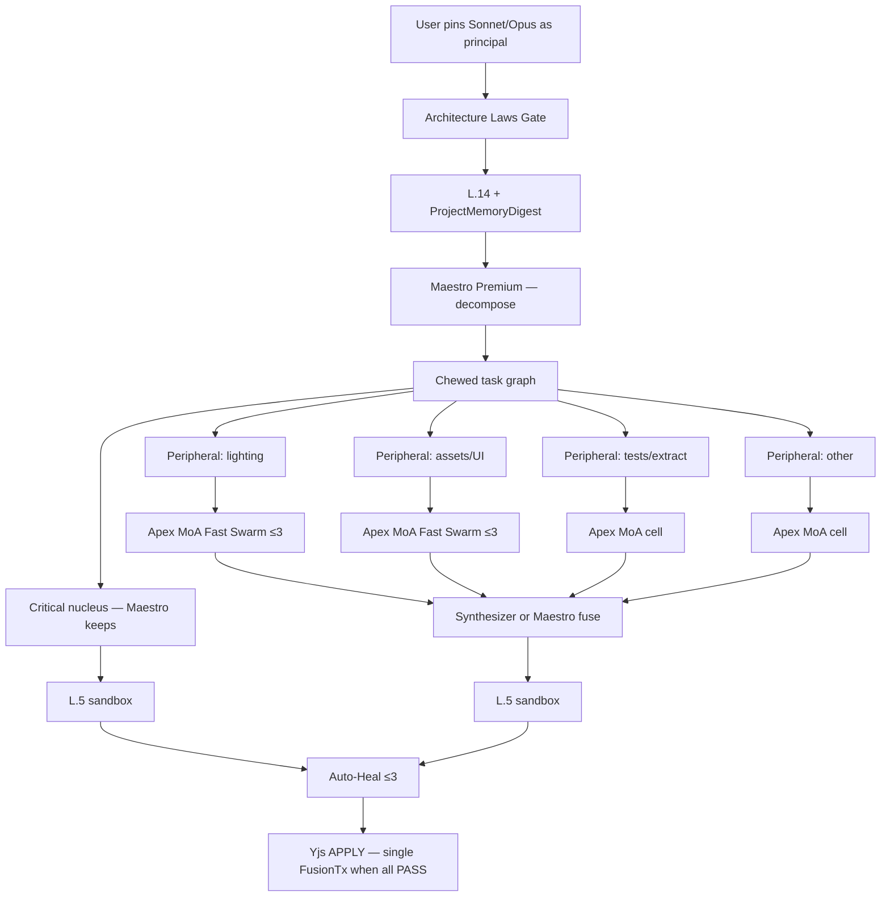
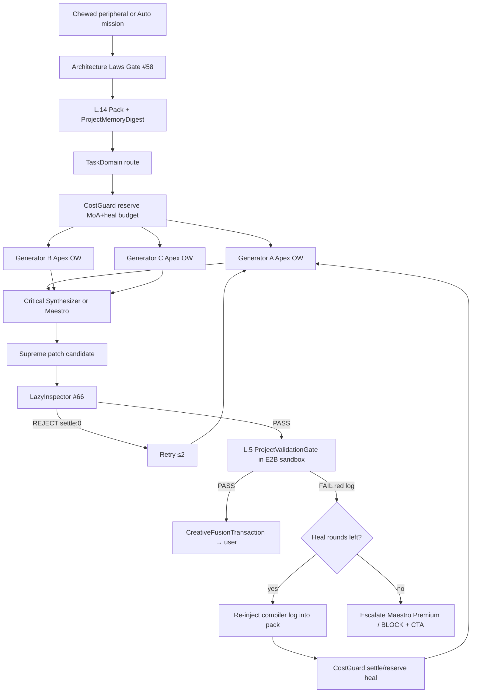

# Aethel Engine — Apex Fast Swarm Orchestration (J.1 Foundation)

**Version:** 1.3 (Chief Architect — **#62 Adaptive MoA** + Maestro + Heal)  
**Status:** **Binding** — foundation for **Onda J.1 CreativeBridge** + **Onda L.5/L.6** + Focus 1A  
**Date:** 2026-07-09  

**Decision #59:** Apex Fast Swarm — APPROVED  
**Decision #60:** MoA ≤3 → Critical Synthesizer + Auto-Heal L.5 — APPROVED  
**Decision #61:** **Maestro Delegation** — user-pinned Premium (Sonnet/Opus) **must not** solo peripheral work; Maestro decomposes, keeps **critical nucleus**, delegates peripherals to **Apex MoA Fast Swarm in parallel** — **APPROVED**  
**Decision #62:** **Adaptive MoA + Metered Delegation** — width 1/2/3 by Risk; trivial bypass; Free/Starter caps; heal routing; mission barrier; preflight estimate — **APPROVED** (Founder 2026-07-09)  
**Decision #66:** **Anti-Laziness Protocol** — truncation ban + LazyInspector pre-L.5 + chunk ≤300 LoC — **APPROVED** — [`AETHEL_ANTI_LAZINESS_PROTOCOL.md`](./AETHEL_ANTI_LAZINESS_PROTOCOL.md)

**Founder one-liner (#62):** *Orquestrador ajusta quantos e quais Apex entram por Risk/domínio; Premium = Maestro no núcleo, não elenco fixo de 3; trivial não queima Sonnet; Free não faz fan-out.*

**Related:** [`AETHEL_FUSION_ORCHESTRATION_CRITIQUE_AND_PLAN_ALIGNMENT.md`](./AETHEL_FUSION_ORCHESTRATION_CRITIQUE_AND_PLAN_ALIGNMENT.md) · [`AETHEL_ANTI_LAZINESS_PROTOCOL.md`](./AETHEL_ANTI_LAZINESS_PROTOCOL.md) (#66)

---

## 0a. Canonical Anti-Hype Anchor (binding — last theoretical lock)

**Status:** **APPROVED** (Founder 2026-07-09). This paragraph is the **reality anchor** for all Fusion / MoA / Composer-comparison marketing and executor prompts. Violating it = vaporware risk.

> **We thank the reality check on the team.** If we promised *“perfect code in 5 seconds without the Maestro ever touching the work,”* the world would correctly call Aethel Engine liars and vaporware at launch.
>
> **Four reality gears (binding):**
>
> 1. **Maestro is not a lazy boss.** Premium/Opus is expensive because it writes the **hardest nucleus**. The Swarm does the **labor** (peripherals) in parallel — not “Sonnet never codes.”
> 2. **Wall-clock may be slower than Cursor.** Our wedge is **reliability** — patches that do not break the **3D world** / project gates — not a stopwatch race.
> 3. **Perfection does not exist.** Auto-Heal + **L.5** guarantee the **compiler/typecheck did not spit red**, not that the game runs at 120 FPS on first apply.
> 4. **Adaptive MoA (#62)** — width 1/2/3 by Risk; trivial tasks skip Maestro; Free does not fan out. Never market “always 3 DeepSeeks + 5s win.”
>
> **Honest claim until Focus 1 + L.5 + L.12/L.14 ship:** *Architecture approved for governed multi-surface Fusion — not “we already beat Composer.”*

**Forbidden marketing phrases:** “perfect code,” “5 seconds,” “zero hallucinations,” “Maestro never writes,” “aniquila o Composer,” “código perfeito.”

**Allowed:** Maestro + Adaptive MoA + LazyInspector + L.5 Auto-Heal; multi-surface context (L.14) vs code-only RAG; reliability over solo serial agents — **as plan**, then as product after exit gates.

**Note:** `implementation_plan.md` remains **Block 6 billing only** — do not park Fusion doctrine there. This section is the canonical home.

---

## 0. Updated verdict (Maestro Delegation + MoA + Auto-Heal)

| Order point | Verdict | Binding amendment |
|-------------|---------|-------------------|
| **Premium as principal ≠ Premium does everything** | **APPROVE #61** | Sonnet/Opus = **Maestro**: decompose + critical nucleus only; **forbid** solo sun-light / texture-fetch / trivial UI on Premium |
| Maestro delegates peripherals to Fast Swarm in parallel | **APPROVE** | Lighting, asset search, UI chrome, tests, extract → Apex MoA cells **∥** Maestro nucleus |
| MoA ≤3 Apex generators → Synthesizer (or Maestro fuse) | **APPROVE** | Apex-ranked OW — not “any cheap.” Name: **Apex MoA Fast Swarm** |
| **Adaptive width 1/2/3 by Risk (#62)** | **APPROVE** | Risk&lt;40 → **1**; 40–69 → **2**; ≥70 or polish → **3**. Models from Apex registry per TaskDomain — **not** 3 fixed IAs |
| **Trivial bypass (#62)** | **APPROVE** | Risk&lt;25 + single peripheral domain → **no Maestro**, single Apex Fast |
| Auto-Heal L.5 for **all** code (Maestro **and** Swarm) | **APPROVE** | L.5 sovereign; max heal **3**; user never sees red compile as success |
| **Anti-Laziness (#66)** | **APPROVE** | Prompt ban + LazyInspector **before** L.5 (`settle: 0`); chunk ≤300 LoC |
| Domain specialists | **APPROVE** | TaskDomain; CreativeBridge for assets |
| Yjs + ProjectMemory absolute | **REINFORCE** | Shared across Maestro + all Swarm legs |
| Unit economics | **IMPROVES** with #61+#62 | Premium saved; Fast burn capped by adaptive width + tier caps |

**Cold analysis:** Forcing Sonnet to adjust sunlight or download a texture is **Premium waste** and **latency waste**. Maestro Delegation + parallel Swarm is faster and protects the 37.5K Premium polish budget. MoA on peripherals stays lucrative (§5); Maestro nucleus stays short Premium turns.

---

## 0b. Maestro Delegation flow (binding when user pins Premium / Opus)



### Delegation rules (#61)

| Keep on Maestro (Premium / Ultra) | Delegate to Apex MoA Fast Swarm (Fast pool) |
|-----------------------------------|--------------------------------------------|
| Architecture / combat / netcode **nucleus** | Sun / lighting tweaks |
| Hard multi-file refactors, auth/billing Risk≥70 | Texture/asset **search** (via CreativeBridge) |
| Final fuse of Swarm outputs when Risk high | Boilerplate UI, i18n strings, docs |
| Escalation after heal exhausted | Unit test stubs, extract/summarize, cartography queries |

**Hard forbids:**  
1. User pin Premium → router **must** still run Maestro Delegation on multi-domain missions (not “Sonnet solo everything”).  
2. Single-domain **trivial** task (Risk&lt;25, one peripheral) → **skip Maestro**; Fast Apex single or MoA only — **do not** burn Premium.  
3. Opus/Ultra = same Maestro rules; Ultra still wallet/BYOK only for Hero nucleus.  
4. Max **4** peripheral Swarm cells in parallel per mission (JobBudget).  
5. Maestro emit = `ChewedWorkerTask[]` + `criticalTaskId` — Swarm never invents scope.

---

### 0c. Two-Tier Sovereign Execution & Memory Hygiene Mandate (Binding)

To maximize low-level backend power while guaranteeing luxury visual ergonomics and pristine memory hygiene:

```
 ┌─────────────────────────────────────────────────────────────────────────────┐
 │               DIVISÃO SOBERANA DE EXECUÇÃO & HIGIENE DE MEMÓRIA             │
 ├─────────────────────────────────────────────────────────────────────────────┤
 │                                                                             │
 │ 1. ENGENHEIRO DE BACKEND SOBERANO (DEEPSEEK):                               │
 │    • Opera 100% do Rust Kernel, Física, Shaders WGSL, Matemática e SoA.    │
 │    • Autocrítica Local: Usa tokens de pensamento (*Thinking Tokens*) e      │
 │      o compilador de Rust (`cargo check` / `clippy`) com Custo Zero do      │
 │      Maestro para tarefas micro-estruturais.                                │
 │    • Regras de Ferro: Anti-Mock, Anti-Demo, Anti-Placebo e Anti-Preguiça.  │
 │                                                                             │
 │ 2. DIRETOR GLOBAL & ARQUITETO DE UI/UX (MAESTRO - CLAUDE / GEMINI):         │
 │    • Governa todas as Interfaces Visuais (React / Next.js / Design System). │
 │    • Exige o mais alto padrão estético no viewport e na tela do usuário.    │
 │    • Supervisiona o grafo de tarefas e resolve conflitos entre agentes.     │
 │                                                                             │
 │ 3. HIGIENE DE MEMÓRIA & EXPULSÃO DE LIXO (METABOLIC MEMORY LIFECYCLE):      │
 │    • O contexto do DeepSeek e dos agentes opera em Janela Deslizante        │
 │      (Sliding Window <= 30 mensagens ativas).                               │
 │    • Históricos antigos são comprimidos e descarregados para o disco local, │
 │      garantindo que o contexto NUNCA acumule lixo ou sofra degradação.     │
 │                                                                             │
 └─────────────────────────────────────────────────────────────────────────────┘
```

---

## 1. MoA flow (Mixture of Agents) — binding

Used for: (a) peripherals under Maestro, (b) Fusion Auto when Premium empty, (c) L.6 when no Premium pin.



### 1.1 Roles

| Role | Count | Apex examples | Job | Pool |
|------|-------|---------------|-----|------|
| **Maestro** | 0–1 | Sonnet / Opus (user pin or high Risk) | Decompose; critical nucleus; optional final fuse | Premium / Ultra |
| **Generator** | **1 / 2 / 3** per MoA cell (**#62**) | Apex registry for TaskDomain (**DeepSeek-V4-Pro** code/engine; Maestro for narrative; peers) — **selected per job, not fixed trio** (**#67**; Qwen/Grok/Llama expunged) | Independent proposals | Fast |
| **Critical Synthesizer** | 1 per cell (only if width ≥2) | Premium if Maestro busy; else Apex OW | Fuse MoA → one patch | Premium or Fast |
| **Domain specialist cell** | 0–4 ∥ (JobBudget-capped) | Lighting / assets / UI / tests | Peripheral only | Fast / Creative |
| **Heal Worker** | MoA or Maestro on nucleus | Compiler log repair | Until L.5 PASS | Fast / Premium |

### 1.1b Adaptive MoA width (#62 — binding)

| Risk / polish | Generators | Synthesizer |
|---------------|------------|-------------|
| Risk &lt; 40 (or Starter max) | **1** Apex for domain | Skip — single proposal is the candidate |
| Risk 40–69 | **2** Apex peers (different families when possible) | Required |
| Risk ≥ 70 or polish / Critic reject retry | **3** Apex peers | Required |
| **Free tier** | **1** max — MoA fan-out **off** | N/A |
| **Starter** | **max 2**; **no** Premium Maestro | If width 2 |
| **Trivial bypass** | Risk &lt; 25 + single TaskDomain peripheral | **No Maestro**; 1 Apex Fast only |

**Model selection:** Apex Router loads candidates for `TaskDomain` from `fusion-specialist-registry` (`apexRank`). Orchestrator picks top N for that job — roster **changes** with domain and availability. Premium Maestro is **not** one of the MoA generators unless `fuseByMaestro` after MoA.

### 1.2 Hard rules (Maestro + MoA + Heal)

1. **Apex only** — no Nano (#55).  
2. **#61 Delegation** when Premium pinned on multi-part missions.  
3. **#62 Adaptive width** — never default to 3; compute N from Risk + plan tier.  
4. **Identical context** — Maestro + all generators share Laws + pack + ProjectMemoryDigest.  
5. **No cross-talk during MoA generate** — synthesis/Maestro fuse only.  
6. **CostGuard** reserves Maestro + all MoA cells + heal **before** fan-out; **J.2 preflight estimate** shows Fast/Premium/$ before send.  
7. **L.5 before user-visible apply** — Maestro nucleus **and** Swarm patches — **after** LazyInspector PASS (#66).  
8. **#66 Anti-Laziness** — system prompt inject; LazyInspector regex on new hunks; chunk ≤~300 LoC; lazy REJECT → `settle: 0` + ≤2 retries.  
9. **Auto-Heal** max **3**; heal **nucleus** → Maestro if Premium left; heal **peripheral** → same MoA cell (don’t burn Sonnet on CSS). Heal ≠ lazy retry.  
10. **Mission barrier** — APPLY only when all required cells L.5 PASS (or explicit partial apply with honest UI).  
11. **Yjs only on APPLY** — one FusionTx when mission barrier passes (or per chewed task if streamed).  
12. **JobBudget** — see §5; peripheral cells capped by weighted tokens, not only count.  
13. **Domain split** — lighting ≠ code nucleus; assets via Bridge/Wallet.

### 1.3 Contracts

```typescript
export interface MaestroDelegationPlan {
  missionId: string;
  maestroModelId: string;            // user-pinned Sonnet/Opus
  criticalTask: ChewedWorkerTask;    // nucleus — Maestro executes
  peripheralTasks: ChewedWorkerTask[]; // max 4 — each may spawn MoA cell
  projectMemoryDigestId: string;
  lawsPackId: string;
  contextPackId: string;
}

export interface ApexMoAJob {
  jobId: string;
  parentMissionId?: string;          // set when delegated by Maestro
  taskDomain: TaskDomain;
  lawsPackId: string;
  contextPackId: string;
  projectMemoryDigestId: string;
  riskScore: number;                 // drives #62 width
  generatorWidth: 1 | 2 | 3;         // Adaptive MoA (#62)
  generatorModelIds: [string, string?, string?]; // length === generatorWidth; Apex-selected
  synthesizerModelId?: string;       // required if generatorWidth >= 2
  synthesizerPool?: 'premium' | 'fast';
  fuseByMaestro?: boolean;           // Maestro fuses instead of OW synth
  maxHealRounds: 1 | 2 | 3;
  costGuardReservationId: string;
  jobBudget: AiJobBudget;
  trivialBypass?: boolean;           // #62 — no Maestro, single Apex
}

export interface MoAGeneratorProposal {
  modelId: string;
  patchRef: string;
  rationaleRef: string;
}

export interface MoASynthesisResult {
  supremePatchRef: string;
  borrowedFrom: string[];
  synthesizerModelId: string;
}

export interface AutoHealTurn {
  round: number;
  validationGate: ProjectValidationGateResult;
  compilerLogRef: string;
  repairJobId: string;
}

export interface ApexMoAResult {
  verdict: 'APPLY' | 'ESCALATE' | 'BLOCK';
  proposals: MoAGeneratorProposal[];
  synthesis?: MoASynthesisResult;
  healTurns: AutoHealTurn[];
  validationGate?: ProjectValidationGateResult;
  fusionTransactionId?: string;
  evidenceReceiptId: string;
}
```

**Paths:**  
`lib/ai/fusion-specialist-registry.ts` · `lib/production/maestro-delegation.ts` · `lib/production/apex-moa-orchestrator.ts` · `lib/production/critical-synthesizer.ts` · `lib/production/auto-heal-loop.ts` · L.5 · J.1 Bridge/CostGuard

---

## 2. Memory — absolute truth (reinforced)

| Store | Owns | Maestro / MoA / Heal may |
|-------|------|---------------------------|
| **Yjs + CreativeFusionTransaction** | Project code/scene/graph | **Write only on APPLY** |
| **ProjectMemoryDigest** | Conventions, open rejects, last Maestro plan | Read every leg; update after APPLY |
| **L.14 MultiSurfaceContextPack** | Surgical facts | Rebuild per heal with compiler log |
| **Architecture Laws pack** | Project laws / .md | Mandatory (#58) |
| **task-evidence-ledger** | Maestro plan + all MoA/heal | Append-only |
| **LLM provider threads** | Nothing durable | **Forbidden** as source of truth |

Maestro and Swarm **share the same digest** — the team never “loses the thread” mid-delegation.

---

## 3. Onda J integration (Creative Nexus)

| Step | Adjustment |
|------|------------|
| **J.1** | Bridge path = **Maestro Delegation (#61)** when Premium pinned + multi-part; else Adaptive MoA (#62) + Auto-Heal; CostGuard reserves Maestro+cells+heal |
| **J.2** | UX: “Maestro planning…” → “Swarm N× Apex…” → “Healing…”; **preflight estimate** Fast/Premium/$; Activity Deck shows nucleus vs peripherals + width |
| **J.4 / L.14** | Same pack/digest to Maestro + all cells |
| **J.12** | OrchestratorProd = Maestro → parallel domain MoA cells (adaptive width) |
| **AI-v1-b** | DoD: `maestro-delegation.ts` + Adaptive MoA + heal (#60–#62) |

**J-readiness add:**  
- [ ] Premium pin on multi-part mission → peripherals **not** executed on Premium alone  
- [ ] MoA width 1/2/3 by Risk in evidence (`generatorWidth` + modelIds)  
- [ ] Trivial bypass: no Premium debit on Risk&lt;25 single-domain  
- [ ] Auto-Heal ≤3; no L.5 FAIL as success  
- [ ] ProjectMemoryDigest on Maestro + every MoA leg  

---

## 4. Onda L integration (Universal IDE)

| Step | Adjustment |
|------|------------|
| **L.1** | Sandbox held across heal; optional shared sandbox for Maestro nucleus + Swarm patches |
| **L.5** | Validates **Maestro nucleus and Swarm** patches; feeds Auto-Heal |
| **L.6** | Loop = **Laws → Maestro plan (if Premium) → nucleus∥MoA cells → L.5 → Heal×≤3 → APPLY** |
| **L.12 / L.14** | Pack rebuild on heal; Maestro plan stored in digest |
| **#49 / #60 / #61 / #62** | L.5 heal + Maestro Delegation + Adaptive MoA |

**L-readiness add:**  
- [ ] GF: Premium-pin mission delegates lighting cell to Swarm (no Premium debit on that cell)  
- [ ] Auto-Heal seeded error → PASS without user paste  
- [ ] JobBudget: ≤4 peripheral cells; MoA width adaptive (#62)  
- [ ] Free: MoA fan-out off; Starter: max width 2  

---

## 5. Unit economics — Maestro Delegation + MoA

### 5.1 Why #61 saves Premium (and time)

| Anti-pattern | Cost |
|--------------|------|
| Sonnet solos sunlight + texture fetch + combat nucleus | Burns Premium on trivia; serial latency |
| **Maestro nucleus + 4 Swarm peripherals ∥** | Premium ~1–2K raw on plan+nucleus; Fast absorbs MoA; **wall-clock parallel** |

Pro Premium 37.5K lasts **far longer** when peripherals never touch it.

### 5.2 MoA Fast burn (unchanged order-of-magnitude)

| Leg | Raw tokens (typ.) |
|-----|-------------------|
| Generator ×1 / ×2 / ×3 | ~2K / ~4K / ~6K |
| Synthesizer (width ≥2) | ~2–3,000 |
| Heal ~0.5–1 | ~3,000 |
| **MoA cell (adaptive)** | **~5–14K** Fast |

| Metric | Value |
|--------|--------|
| Pro Fast 3M | More cells/mo when Risk stays mid/low (#62) |
| Maestro plan+nucleus | ~1.5–4K Premium raw / mission |

**Verdict:** #61+#62 **improve** Premium UX length and Fast burn; MoA-on-chat still **forbidden**. Prices unchanged.

---

## 6. UX (Fable bar — honest)

1. User pins Sonnet; asks for stealth combat + lighting + assets.  
2. Chrome: Maestro planning → Swarm parallel → Healing…  
3. Bastidores: Risk→width N → Apex picks for domain → nucleus on Sonnet ∥ MoA cells → L.5 all → Yjs.  
4. Delivery: compiling apply or blockedReason — not chat essay / not fake AAA.

---

## 7. Execution checklist (Claude)

| # | Deliverable | Wave |
|---|-------------|------|
| S0 | `maestro-delegation.ts` + Chewed task graph | J.1 / **#61** |
| S1 | `fusion-specialist-registry.ts` Apex | Focus 1A |
| S2 | `apex-moa-orchestrator.ts` + **#62 width** | J.1 / #60–#62 |
| S3 | `critical-synthesizer.ts` (+ Maestro fuse path; skip if width=1) | J.1 |
| S4 | `auto-heal-loop.ts` ↔ L.5 (nucleus→Maestro / peripheral→cell) | L.5 / L.6 |
| S5 | ProjectMemoryDigest every leg | L.14 |
| S6 | Bridge CostGuard Maestro+MoA envelope + preflight estimate | J.1 / J.2 |
| S7 | JobBudget defaults + Free/Starter caps | Block 6 / J.1 |
| S8 | Router: Premium pin → Delegation on multi-part; trivial → Fast only | Block 1 / **#62** |
| S9 | `fusion-anti-lazy-system.ts` + `lazy-inspector.ts` + CostGuard settle:0 | Focus 1A / **#66** |

---

## 7.1 The 4 Anti-Fragility Swarm Safeguards (Binding Execution Mandate)

To prevent real-world failure modes (Rate-Limits, Interface Mismatch, Token Bleed, and Global Invariant Breakage):

| Safeguard | Risk Mitigated | Architecture & Enforcement |
|-----------|----------------|----------------------------|
| **1. Circuit-Breaker & Provider Fallback** | 429 Too Many Requests / Latency spikes | Automated exponential backoff + sub-second fallback routing (Anthropic $\leftrightarrow$ DeepSeek $\leftrightarrow$ OpenAI). |
| **2. Subagent Interface AST Type-Gate** | Interface mismatch between parallel cells | AST symbol compatibility check (`cargo check` / TS AST) before merging patches from different swarm legs. |
| **3. Token-Bleed 3-Iteration Hard Cap** | Retry loops burning credits silently | Strict maximum of 3 Auto-Heal turns; graceful halt with calm diagnostic escalation if heal fails. |
| **4. Global Dependency Invariant Map** | Localized edits breaking distant systems | `scene-context-pack.ts` injects global dependency graphs, ensuring isolated subagents stay aware of macro game loops. |

---

## 8. Decisions

| # | Text |
|---|------|
| **#59** | Apex Fast Swarm — APPROVED |
| **#60** | MoA ≤3 + Synthesizer + Auto-Heal L.5 — APPROVED |
| **#61** | Maestro Delegation — APPROVED |
| **#62** | Adaptive MoA + Metered Delegation — **APPROVED** |
| **#66** | Anti-Laziness Protocol — **APPROVED** |

---

## 9. Changelog

| Date | Ver | Change |
|------|-----|--------|
| 2026-07-09 | 1.0–1.2 | Swarm + Maestro + MoA + Heal |
| 2026-07-09 | **1.3** | **#62 APPROVED** — adaptive width 1/2/3; trivial bypass; Free/Starter caps; heal routing; mission barrier; preflight |
| 2026-07-09 | **1.3a** | **#66** Anti-Laziness — LazyInspector before L.5; chunk ≤300; settle:0 |
| 2026-07-09 | **1.3b** | **§0a Canonical Anti-Hype Anchor** — last theoretical lock; reliability over stopwatch |

