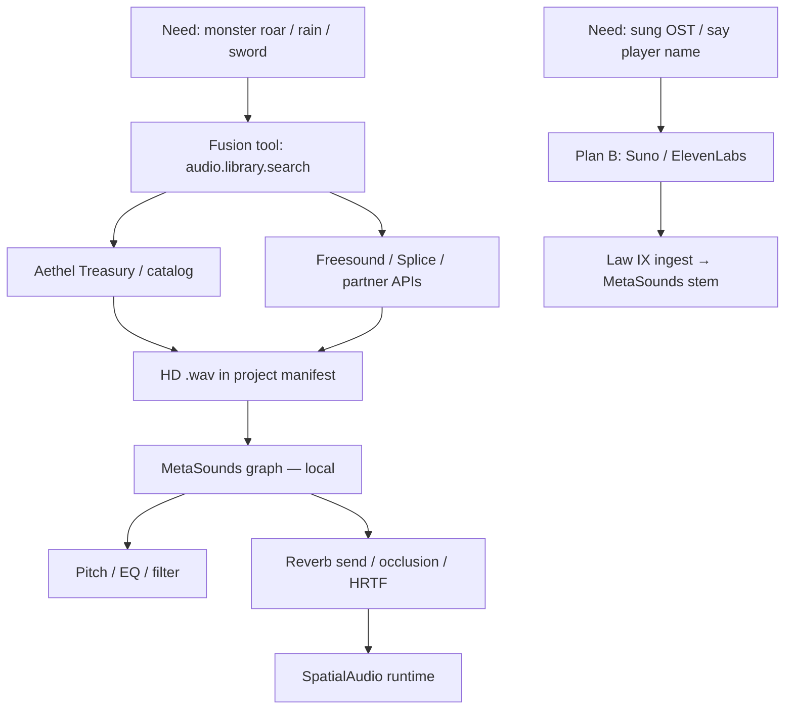

# Aethel Engine — Audio Library-First Doctrine (MetaSounds + Treasury)

**Version:** 1.0 (Chief Architect — Founder order: AAA sound design, not gen-SFX)  
**Status:** **Binding** — Law IV × Law IX × Fusion × Treasury  
**Date:** 2026-07-09  

**Decision #64:** **SFX default = Library fetch + MetaSounds local transform — $0 generative audio credits.** Generative music/voice APIs (Suno/Udio/ElevenLabs) = **Plan B** only for exclusive scored music with lyrics and speech/VO. Gunshots, footsteps, rain, swords, monster roars → **search → download .wav → MetaSounds graph** (pitch/reverb/EQ/occlusion).

**Parents:**  
[`AETHEL_METASOUNDS_SPEC.md`](./AETHEL_METASOUNDS_SPEC.md) (S4) ·  
[`AETHEL_CINEMATIC_DIRECTOR_DOCTRINE.md`](./AETHEL_CINEMATIC_DIRECTOR_DOCTRINE.md) (#63) ·  
[`AETHEL_AI_FUSION_CREATIVE_SPEC.md`](./AETHEL_AI_FUSION_CREATIVE_SPEC.md) ·  
[`AETHEL_NETWORK_COMMERCE_LIVEOPS_SPEC.md`](./AETHEL_NETWORK_COMMERCE_LIVEOPS_SPEC.md) (Treasury / store) ·  
[`AETHEL_APEX_FAST_SWARM_ORCHESTRATION.md`](./AETHEL_APEX_FAST_SWARM_ORCHESTRATION.md)

---

## 0. Verdict

| Claim | Verdict |
|-------|---------|
| Don’t gen shotgun / roar via AI by default | **APPROVE** — expensive + often worse than studio libraries |
| Fusion searches Treasury / Freesound / partner libs → HD `.wav` | **APPROVE** — **$0** Premium/Creative gen credits for the asset itself |
| MetaSounds adjusts pitch / reverb / EQ / occlusion **locally** | **APPROVE** — Law IV; CPU/GPU local = $0 API |
| Gen APIs only for exclusive OST lyrics + speech VO | **APPROVE** — Plan B; Creative Wallet |
| 99% world SFX = library + MetaSounds | **APPROVE** — Naughty Dog / Sony-class pipeline |

**Golden rule (pairs with #63):**  
*LLM directs. Engine shoots picture. **Library + MetaSounds** shoot sound. Generative audio is Plan B.*

---

## 1. Why this matches AAA (and our unit economics)

| Anti-pattern | Cost / quality |
|--------------|----------------|
| Gen every footstep / gunshot | High Creative COGS; muddy/inconsistent |
| **Library .wav + MetaSounds graph** | Fetch free/licensed; transform local; consistent identity |

Same logic as Director doctrine: **don’t invent pixels; don’t invent one-shot SFX** when Hollywood libraries exist.

---

## 2. Flow (binding)

### 2.1 Cost ledger

| Step | Debits |
|------|--------|
| `audio.library.search` + download | **$0** gen credits; optional partner rate limits; CDN/storage if cloud project |
| MetaSounds compile + play | **$0** API — local Web Audio / desktop |
| LLM choosing which clip + wiring graph | Fast/Premium **tiny** (direction only) |
| Suno / Udio / ElevenLabs | **Creative Wallet** — Plan B only |

**Never** route “play shotgun” to `/api/ai/music` or voice gen by default.

---

## 3. When Plan B (generative) is allowed

| Allowed | Forbidden as default |
|---------|----------------------|
| Exclusive **sung** score with user lyrics | Gunshot / footstep / rain / wind / sword / UI click |
| **Speech**: NPC says player name / dynamic dialogue | Replacing entire Foley library with gen |
| Rare one-off stinger when library miss + user confirms | Silent auto-fallback to gen without UX |

Router: `TaskDomain: audio.foley` → library tool; `audio.score` / `audio.speech` → gen APIs via CreativeBridge + CostGuard.

---

## 4. MetaSounds “toque de mestre” (local, free)

Fusion emits **graph patches** (not new waveforms) for:

| Transform | Example |
|-----------|---------|
| Pitch | Lower roar → bigger monster |
| Reverb send | Cave vs open field |
| EQ / filter | Muffled behind wall (pairs with Rapier occlusion) |
| Distance / concurrency | Law IV spatial core |
| Random / variation | Slight pitch jitter so repeats don’t machine-gun |

**Zero-MVP:** No play-log-only SoundCue as shipped (# MetaSounds spec). Compiler required (S4.0+).

---

## 5. Treasury + partners

| Source | Role |
|--------|------|
| **Aethel Treasury / Hub catalog** | First-party + licensed packs; commerce lanes after H.0 |
| **Freesound.org** (or equiv CC) | Partner search — respect license tags in manifest |
| **Splice / commercial** | Optional BYOK / paid pack — user entitlement |
| Project local `/audio` | User drops — always preferred if tagged |

Manifest entry must store: `license`, `sourceUrl`, `hash`, `metasoundsGraphId`.

---

## 6. Fusion / J / Swarm wiring

| Piece | Behavior |
|-------|----------|
| MoA peripheral cell `audio.foley` | Search + MetaSounds wire — **not** Suno |
| Maestro | May keep dialogue script nucleus; Foley always delegated |
| J.1 CreativeBridge | Gen music/voice only; library fetch is **non-gen** tool (still evidence-logged) |
| J.5 | SoundCue / MetaSounds nodes in FusionTx |
| CostGuard | Gen audio = Creative Wallet; library = no gen reserve |

---

## 7. Honest ship state

| Item | Today |
|------|-------|
| MetaSounds compiler | **AUSENTE** — S4 delivery |
| SoundCueEditor | play-log — **not** ship audio |
| Library search tool | **Spec** — implement with Focus / S4 |
| Suno / ElevenLabs HTTP | REAL paths — demote to Plan B in product routing |

Marketing “AAA MetaSounds Foley” only after S4.0+ acceptance + library tool green.

---

## 8. Prohibitions

1. Default SFX via generative music/voice APIs.  
2. Play-log as shipped MetaSounds.  
3. Ignoring license on Freesound/partner clips.  
4. Burning Premium on “generate footstep.”  
5. Claiming library+MetaSounds live before S4 compiler ships.

---

## 9. Implementation map

| # | Deliverable | Wave |
|---|-------------|------|
| A1 | `audio.library.search` tool + Treasury/Freesound adapter | S4 / J |
| A2 | Manifest license + hash for clips | S4 / S7 |
| A3 | MetaSounds compiler S4.0 (wav + envelope) | E / S4 |
| A4 | Fusion router: foley → library; score/speech → gen | J.1 / Apex |
| A5 | CostGuard: gen audio Creative Wallet only | J.1 / 6F |
| A6 | GF-AUDIO-001 combat mix with **library** stems | S4 |

---

## 10. Checklist

- [x] Library-first Foley doctrine  
- [x] MetaSounds local transform = free mastery  
- [x] Gen = Plan B (OST lyrics + speech)  
- [x] Align #63 picture + #64 sound  
- [ ] Claude: A1–A5 with S4  

---

## 11. Changelog

| Date | Ver | Change |
|------|-----|--------|
| 2026-07-09 | 1.0 | Decision #64 — Library + MetaSounds first; gen audio Plan B |
