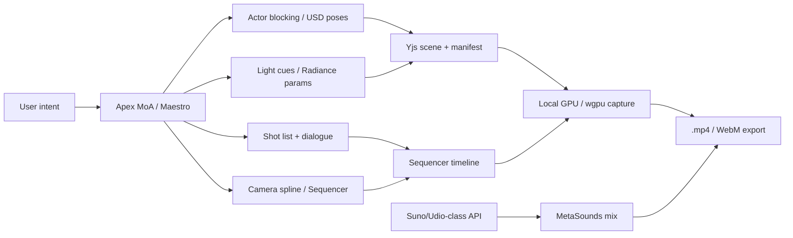

# Aethel Engine — Cinematic Director Doctrine (Engine Film, Not Pixel Gen)

**Version:** 1.0 (Chief Architect — Founder order: Director ≠ Renderer)  
**Status:** **Binding product doctrine** for video/cinematics × Fusion × billing  
**Date:** 2026-07-09  

**Decision #63:** **Aethel does not pay Veo/Sora toll for primary cinematics.** Fusion = **Film Director** (script, blocking, lights, camera). **Aethel Engine / local GPU** = **camera crew** (capture → `.mp4` / WebM). Pixel-gen video APIs = **optional B-roll only**, never the default ship path.

**Parents:**  
[`AETHEL_APEX_FAST_SWARM_ORCHESTRATION.md`](./AETHEL_APEX_FAST_SWARM_ORCHESTRATION.md) ·  
[`AETHEL_AI_FUSION_CREATIVE_SPEC.md`](./AETHEL_AI_FUSION_CREATIVE_SPEC.md) (J.5 / J.9 / cinematic-director) ·  
[`AETHEL_AAA_PARITY_TARGETS.md`](./AETHEL_AAA_PARITY_TARGETS.md) (Radiance, G.8) ·  
[`AETHEL_MARGIN_CREATIVE_WALLET_TURNS_CALCULATOR.md`](./AETHEL_MARGIN_CREATIVE_WALLET_TURNS_CALCULATOR.md) ·  
[`AETHEL_AI_WORKLOAD_AND_BILLING_ALIGNMENT.md`](./AETHEL_AI_WORKLOAD_AND_BILLING_ALIGNMENT.md) ·  
Law IV MetaSounds · Law XV Capability Score

---

## 0. Verdict

| Claim | Verdict |
|-------|---------|
| “Generate the **film set**, not the pixels” | **APPROVE** — core moat vs Veo/Sora |
| Fusion MoA writes script + camera + light cues | **APPROVE** — Fast/Premium LLM only (cheap vs video APIs) |
| Engine / user GPU records the shot → `$0` video API | **APPROVE** as **target economics** |
| Quality > Veo on **consistency** (faces/objects don’t melt) | **APPROVE** *when* scene is real 3D + Sequencer capture |
| “Pixar / UE5 / FF cutscene” marketing | **CONDITIONAL** — only after **Onda G** Radiance + Sequencer export acceptance (G.8); web = honest lower bar |
| Music via Suno/Udio-class + MetaSounds mix | **APPROVE** — audio API COGS ≪ video; Law IV ingest |
| Default `/api/ai/video` Veo path for trailers | **DEMOTE** — optional B-roll; **not** primary cinematic pipeline |

**Golden rule:**  
*LLM directs. Engine shoots. Pixel-gen video is a side quest.*

---

## 1. The secret — Director vs Renderer

| Layer | Who | Pays |
|-------|-----|------|
| Roteiro, batidas, posições, câmera | Fusion (Maestro + MoA Fast) | Fast/Premium **LLM** tokens — cents |
| Atores / props (se faltarem) | Meshy/library / user assets | Creative Wallet / BYOK — **not** Veo |
| Luz + GI | Engine (Radiance when G ships; baked/SSGI on web) | **$0 API** |
| Gravação do filme | User GPU or desktop render farm path | **$0 video API**; electricity/local only |
| Score / VO | Suno/Udio/ElevenLabs-class | Creative Wallet — cheap vs video |
| Pixel video API (Veo/Sora/Runway) | Optional B-roll / moodboard | Creative Wallet — **opt-in**, never default cinematic |

---

## 2. Why this annihilates Veo cost (and when it doesn’t)

### 2.1 Wins

| Veo/Sora pain | Aethel Director path |
|---------------|----------------------|
| $/second pixel gen | Capture = local render → **$0 API** |
| Identity melt / object morph | Same mesh + materials every frame |
| Relight = regenerate $ | Drag light → re-capture **free** |
| No gameplay reuse | Same scene = playable + cinematic |

### 2.2 Honest costs that remain (do not hallucinate “everything free”)

| Still costs money / quota | Ledger |
|---------------------------|--------|
| LLM directing (script/camera) | Fast/Premium pools |
| Missing hero meshes / textures | Creative Wallet / library |
| Music / voice APIs | Creative Wallet (cheap) |
| Cloud cook / CDN for published trailer | Infra / Publish Pass — not Veo |
| Desktop RT quality | User hardware (Law XV score) |

**Never claim:** “Full Hollywood film, zero cost, on integrated GPU webgl2.”  
**Do claim:** “Primary cinematic path avoids pixel-gen video APIs; consistency of real 3D; re-light free.”

---

## 3. Quality bar — Fable / UE5 honesty

| Tier | When allowed to say | What user gets |
|------|---------------------|----------------|
| **Web cinematic** | After Sequencer + capture + baked/SSGI path | Consistent 3D trailer; **not** Radiance HW |
| **Desktop cinematic** | After G.3 Radiance + G.8 export + S3 sequencer | Near UE5 cutscene class on enthusiast RT |
| **Pixel-gen B-roll** | Opt-in Creative Wallet | Style plates only — labeled |

Aligns with AAA parity: Radiance **web excluded**; HW RT = enthusiast.  
J.9 VisualEvidence (OffscreenCanvas WebM) = **evidence / previz** stepping stone — not the final G.8 product alone.

---

## 4. Fusion wiring (J + Swarm)

| Step | Role in Director doctrine |
|------|---------------------------|
| **Maestro / MoA (#60–#61)** | Write shot list, blocking, camera splines as **data** (Sequencer JSON / Yjs) — not pixels |
| **cinematic-director** squad | Owns Sequencer graph evidence |
| **J.5 GraphOperator** | Wire cinematic / VFX nodes in FusionTx |
| **J.7 USD** | Place real assets — no proxy capsule as final actor |
| **J.9** | Previz WebM receipts while G.8 matures |
| **CreativeBridge** | Music/voice APIs only; **block** default video pixel-gen for “make my cutscene” |
| **L.5** | Validate any generated scripts/timelines that touch code |

**Router TaskDomain (add):** `cinematic.direct` → Apex OW/Premium for plan; **never** route “make trailer” to `video` pixel provider by default.

**CostGuard:**  
- `cinematic.direct` → LLM pools  
- `cinematic.capture` → **$0** provider (local) + optional cook metering later  
- `video.pixelgen` → Creative Wallet + explicit user opt-in  

---

## 5. Music & voice (approved) — refined by #64

| Modality | Default path | Gen API? |
|----------|--------------|----------|
| Foley / world SFX (99%) | Treasury / Freesound → `.wav` → **MetaSounds** pitch/reverb/EQ/occlusion | **No** — [#64](./AETHEL_AUDIO_LIBRARY_FIRST_DOCTRINE.md) |
| Exclusive sung OST / lyrics | Suno/Udio-class + MetaSounds ingest | **Yes** — Creative Wallet |
| Speech / say player name | ElevenLabs-class | **Yes** — Creative Wallet |
| Adaptive / spatial mix | MetaSounds runtime (Law IV) | Local $0 |

Picture (#63) + Sound (#64): Fusion directs; engine shoots; **library Foley**; gen audio Plan B only.

---

## 6. Billing / plans alignment

| Old risk | New doctrine |
|----------|--------------|
| `videoMinJob` 80K weighted burns Pro feel | Primary cutscene **does not** call pixel video |
| GAP-FUSION-02 video on LLM pool | Capture path bypasses video provider; Creative Wallet only for opt-in B-roll + music |
| Marketing “AI video like Sora” | Marketing **“AI-directed engine cinema”** after Sequencer+capture ship |

Pro $29 stays viable: users burn Fast on **direction**, not $1–2/clip Veo.

---

## 7. Ship honesty & Focus order

| Prerequisite | Focus / Onda |
|--------------|--------------|
| Real scene + File Explorer | Focus 1 |
| Viewport capture path (even simple) | Focus 2 / J.9 |
| Sequencer timeline authoring | S3 / cinematic-director |
| Radiance-quality marketing | **Onda G** acceptance |
| MetaSounds music ingest | Law IV / S4 |

**Until Sequencer+capture exist:** UI may offer **Director previz** (J.9) and must **not** pretend Veo-free 4K FF cutscenes.

---

## 8. Prohibitions

1. Default “Generate trailer” → Veo/Sora/Runway without Director path.  
2. Marketing Radiance/UE5 parity on webgl2.  
3. Proxy capsule as cinematic hero (J.7).  
4. MetaSounds play-log as shipped score mix.  
5. Claiming `$0` total cost while ignoring LLM + asset + music APIs.  
6. Skipping CreativeBridge for music/voice.

---

## 9. Implementation map (Claude — after Focus 1)

| # | Deliverable | Depends |
|---|-------------|---------|
| C1 | `TaskDomain: cinematic.direct` in Apex registry | Router |
| C2 | Shot list / Sequencer schema in Yjs FusionTx | J.5 / S3 |
| C3 | Local capture → WebM/mp4 (desktop wgpu first; web canvas capture honest) | Focus 2 / J.9 |
| C4 | CostGuard: `cinematic.capture` = $0 provider | J.1 |
| C5 | Pixel video providers = opt-in B-roll only in UI | Creative matrix |
| C6 | Music → MetaSounds ingest path | Law IV |
| C7 | G.8 cinematic export golden fixture | Onda G |

---

## 10. Checklist

- [x] Director ≠ pixel renderer doctrine  
- [x] $0 video API for primary capture path  
- [x] Music APIs + MetaSounds approved  
- [x] Honest G vs web quality bar  
- [x] Align billing away from Veo default  
- [ ] Claude: C1–C4 after Focus 1–2 foundations  
- [ ] Marketing copy review before “UE5 cutscene” claims  

---

## 11. Changelog

| Date | Ver | Change |
|------|-----|--------|
| 2026-07-09 | 1.0 | Decision #63 — Engine Film doctrine; Veo demoted; Swarm directs; GPU shoots |
