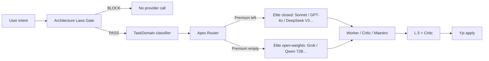

# Aethel Engine — Intelligent Routing & Context Compression (Onda J + L)

**Version:** 1.2 (Chief Architect — **Apex Router**; elite open-weights fallback; Zero Amnesia Laws gate)  
**Status:** **Binding** for Onda J (Nexus) + Onda L (Forge)  
**Date:** 2026-07-09  

**Doctrine overlay (wins on conflict):** [`AETHEL_APEX_DOCTRINE_AND_EXECUTION_FOCUS.md`](./AETHEL_APEX_DOCTRINE_AND_EXECUTION_FOCUS.md) — Decisions **#56–#58**

**Does not change:** retail prices ($0/$9/$29/$79), dual-pool sizes (Fast weighted pool vs Premium raw), Ultra-off-sub.  
**Does change (v1.2):**  
- **Apex-first:** per TaskDomain, select **LMSYS Arena / Aethel-bench elite** — **not** “any cheap specialist”  
- Premium empty → **elite open-weights** (Grok-class, Qwen 72B-class, peers) — **never** Nano/dumb  
- **Architecture Laws pack** mandatory before any agent write (Zero Amnesia)  
- Cost ceilings = **pool entitlement filters**, not quality sacrifice  

**Code today (honest):**
- Router **partial:** `lib/ai/intelligent-model-router.ts` + `fusion-role-map.ts` — **no** Apex registry, **no** Laws gate  
- Context: hash RAG partial; **L.14 / L.12 MISSING**

**Related:**  
[`AETHEL_APEX_DOCTRINE_AND_EXECUTION_FOCUS.md`](./AETHEL_APEX_DOCTRINE_AND_EXECUTION_FOCUS.md) · [`AETHEL_AI_FUSION_CREATIVE_SPEC.md`](./AETHEL_AI_FUSION_CREATIVE_SPEC.md) · [`AETHEL_UNIVERSAL_IDE_FORGE_SPEC.md`](./AETHEL_UNIVERSAL_IDE_FORGE_SPEC.md) · [`AETHEL_MARGIN_CREATIVE_WALLET_TURNS_CALCULATOR.md`](./AETHEL_MARGIN_CREATIVE_WALLET_TURNS_CALCULATOR.md)

---

## 0. Verdict (one page)

| Question | Binding answer (v1.2) |
|----------|------------------------|
| Cheap model to save COGS? | **Forbidden** if it drops below Apex quality for the domain (**Decision #57**) |
| Static Fast / Nano? | **Banned** (#55) |
| Premium empty? | **Elite open-weights** Fusion Auto (Arena-top for domain) on Fast pool — not dumb tier |
| Who owns memory? | **Aethel only** — Yjs + VectorIndex + L.14 + Laws pack (#58) |
| Write without architecture context? | **BLOCK** — no provider call |
| Multi-model coherence? | Stateless models + shared pack + Laws + ledger |

**Golden rules:**  
1. *Apex for TaskDomain first; billing pool second.*  
2. *Every write: Laws gate PASS + contextPackId + tokenBudget.*  
3. *Premium empty → elite open-weights Auto — never Nano.*  
4. *No `modelClass: 'nano'`.*

---

## 0b. Critical analysis — Apex vs “cheap specialist”

| Approach | Verdict |
|----------|---------|
| v1.0 static Fast/Nano Workers | **Rejected** — quality cliff |
| v1.1 Fusion Auto with low $/M ceiling as primary rank | **Amended** — ceiling must not demote below Apex |
| **v1.2 Apex Router** | **Binding** — Arena/bench elite per domain; open-weights elite when Premium gone |

Risks R1–R10 from v1.1 remain; add:

| Risk | Mitigation |
|------|------------|
| **R11** Apex Fast burn empties 3M pool early | Honest UX + wallet/BYOK; **never** silent weak swap; JobBudget |
| **R12** Arena leaderboard ≠ coding skill | Aethel golden benches per TaskDomain override Arena when conflict |
| **R13** Laws pack too large | Compress Laws to digests + linked .md slices; still **mandatory** presence |

---

## 1. Hierarchy — Maestro / Worker / Critic + Apex Fusion Auto



| Lane | When Premium remains | When Premium empty |
|------|----------------------|--------------------|
| **Maestro / Critic** | Elite closed (Sonnet-class etc.) | Elite open-weights ≠ Actor family |
| **Worker** | Apex for domain (DeepSeek V3 / Sonnet / GPT-4o per pool weights) | Apex open-weights for domain |
| **Hero** | Wallet/BYOK Ultra only | Same |

### 1.2 ChewedWorkerTask

```typescript
export interface ChewedWorkerTask {
  taskId: string;
  parentJobId: string;
  objective: string;
  acceptanceCriteria: string[];
  allowedPaths: string[];
  contextPackId: string;
  lawsPackId: string;                // REQUIRED — Zero Amnesia
  tokenBudget: number;
  roleLane: 'worker';
  taskDomain: TaskDomain;
  modelClass: 'fusion_auto' | 'premium' | 'ultra';
  apexRequired: true;                // never relax to non-elite
  maxIterations: 1 | 2;
}
```

---

## 2. Context compression + Zero Amnesia

### 2.1 Hard laws

| Rule | Binding |
|------|---------|
| No naked repo dump | Pack only |
| tokenBudget truncate | Yes |
| **Architecture Laws pack** | **Mandatory before write** (#58) |
| Models own memory | **Never** — Yjs + VectorIndex + pack |

### 2.2 Architecture Laws gate

See Apex Doctrine §2. Missing laws/cartography/pack → `ARCHITECTURE_CONTEXT_REQUIRED`.

### 2.3 Pack priority

P0: Laws digest + objective + acceptance + allowed paths + signatures  
P1: RepoGraph neighborhood + vector top-k + scene digest  
P2: validation/terminal tails  
DROP: full monorepo / full scene JSON / raw long chat  

Default budgets: chat 2K · Worker 1.5K · Maestro 2.5K · Critic 1.2K · world step 3K (Laws digest always included in P0).

---

## 3. Apex Fusion Auto — TaskDomain → elite

### 3.1 Billing vs product

| Name | Meaning |
|------|---------|
| Fast pool | 1× metering for open-weights / budget-weight elites |
| Premium pool | 40× metering for closed frontier elites |
| **Apex** | Quality rank from Arena + Aethel benches — **not** cheapest |
| Nano | **Banned** |

### 3.2 Domain elite (illustrative)

| TaskDomain | Premium path (Apex) | Premium empty (Apex open-weights) |
|------------|---------------------|-----------------------------------|
| Complex code | Claude Sonnet-class, GPT-4o, DeepSeek V3 | Qwen 72B-class, Grok-class, top open code |
| Shader | Same + shader bench | Top open code + long context |
| Lore | Top Arena writing | Top open 70B+ creative |
| Extract | Strong structured (not Nano) | Same class OW |
| Critic / plan | Premium elite | Strongest OW ≠ Actor family |

### 3.3 Selection algorithm (v1.2)

1. Laws gate PASS (writes)  
2. Classify TaskDomain  
3. Load Apex candidates (Arena top + Aethel bench)  
4. Premium remaining → prefer Premium-class Apex for Maestro/Critic/high Risk  
5. Else highest Apex score on Fast-pool-eligible elites  
6. Fallback = next Apex peers — **never Nano**  
7. No Apex candidate → **deny** + wallet/BYOK CTA (do not degrade)

### 3.4 Registry

Path: `lib/ai/fusion-specialist-registry.ts` — `apexRank`, `arenaCategory`, `openWeights`, domains, tools/json.  
Refresh ≤ monthly. CI fails if Worker can select `qualityTier: 'nano'`.

### 3.5 UX Premium = 0%

“Premium polish used — **Fusion Auto Apex** is using elite open-weights for your task domain.”  
Never “basic AI.”

### 3.6 Types

```typescript
export type ModelClass = 'fusion_auto' | 'premium' | 'ultra';

export interface FusionAutoDecision {
  mode: 'premium_apex' | 'open_weights_apex' | 'hero' | 'denied';
  modelId: string;
  domain: TaskDomain;
  apexRank: number;
  fallbackChain: string[];
  debitPool: 'fast' | 'premium' | 'wallet' | 'byok';
  deniedReason?:
    | 'architecture_context_required'
    | 'no_apex_candidate'
    | 'ultra_requires_wallet'
    | 'nano_lane_forbidden'
    | 'context_too_large';
}
```

---

## 4. Onda J / L (v1.2)

| Step | Adjustment |
|------|------------|
| **J.1** | CostGuard after Laws gate; log apexRank + modelId |
| **J.2** | Fusion Auto **Apex** chip; Premium 0% → open-weights elite copy |
| **J.4 / L.14** | Pack + Laws pack to all specialists |
| **J.12** | Workers Apex Auto; disjoint parallel paths only |
| **L.6** | Laws → Apex Worker → L.5 → Critic |
| **#54** pack + **#58** Laws | Both hard gates |

**Decisions:** #53 amended · #55 ban Nano · #56 Apex doctrine · #57 Apex-first · #58 Laws gate

---

## 5. Pro $29

Apex may burn Fast pool faster than weak models — **accepted**. Protect via JobBudget + wallet CTA, **not** quality demotion. Prices unchanged.

---

## 6. Implementation (Claude) — Focus 1A

| Work | Closes |
|------|--------|
| Apex registry + Arena sync | #56 #57 |
| ArchitectureLawsGate | #58 |
| Remove nano paths | #55 |
| Laws → pack → Apex → provider | Focus 1 |

---

## 7. Checklist

- [x] Apex-first  
- [x] Elite open-weights fallback  
- [x] Zero Amnesia Laws gate  
- [x] Ban Nano  
- [ ] Claude Focus 1A implement  

---

## 8. Changelog

| Date | Ver | Change |
|------|-----|--------|
| 2026-07-09 | 1.0 | Maestro/Worker; Nano; #53–#54 |
| 2026-07-09 | 1.1 | Fusion Auto; ban Nano; #55 |
| 2026-07-09 | **1.2** | **Apex Router; elite OW fallback; Laws gate #56–#58; cost must not outrank quality** |
