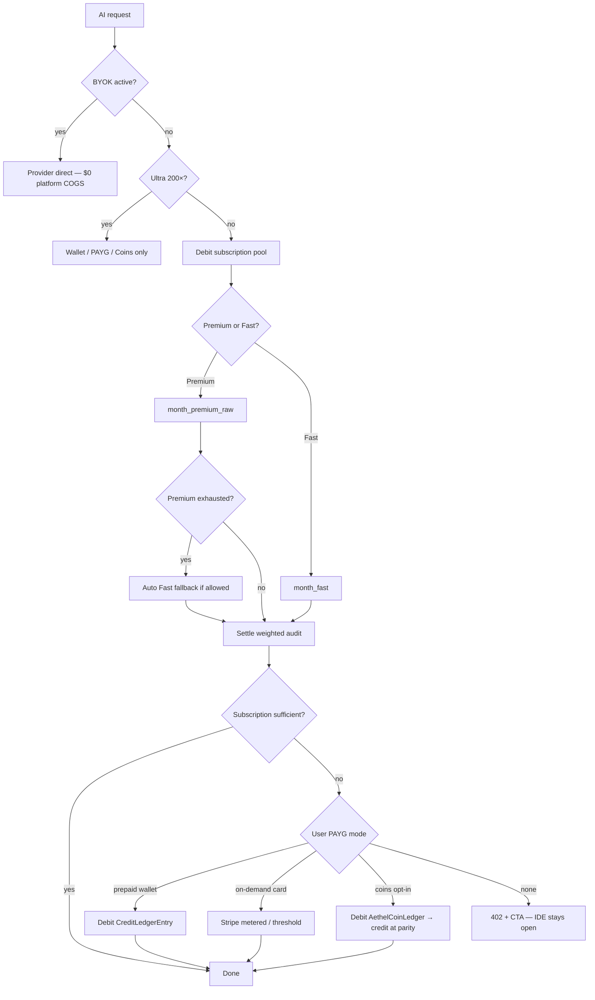

# Aethel Engine — Pay-As-You-Go, Credit Wallet & Overage UX Spec

**Version:** 1.1 (Chief Architect — Cursor-class UX + spend caps + $ meters)  
**Status:** **Binding for Wave 6 billing** — no invented Stripe Price IDs; maps to existing code  
**Canonical sources:**
- [`AETHEL_PLANS_CANONICAL_REFERENCE.md`](./AETHEL_PLANS_CANONICAL_REFERENCE.md) v1.1 — journeys J1–J7, UX principles
- [`cloud-web-app/web/lib/plans.ts`](../../cloud-web-app/web/lib/plans.ts) + [`plan-ai-quotas.ts`](../../cloud-web-app/web/lib/plan-ai-quotas.ts)
- [`lib/metering.ts`](../../cloud-web-app/web/lib/metering.ts) + [`lib/plan-limits.ts`](../../cloud-web-app/web/lib/plan-limits.ts)
- [`lib/credit-wallet.ts`](../../cloud-web-app/web/lib/credit-wallet.ts) + [`CreditWallet.tsx`](../../cloud-web-app/web/components/billing/CreditWallet.tsx)
- [`billing_security_analysis.md`](./billing_security_analysis.md) §4–§5
- [`contracts_planning.md`](./contracts_planning.md) §3.4, §6.4–§6.8
- [`AETHEL_UNIT_ECONOMICS_AND_SUBSCRIPTION_ALIGNMENT.md`](./AETHEL_UNIT_ECONOMICS_AND_SUBSCRIPTION_ALIGNMENT.md)

**Integrates:** Law IX, XII, XIV · Decision #67 (three ledgers) · IMPROVE-BILLING-004 · DEBT-FIN-008

---

## Executive summary

| Question | Answer (from code today) | Target (Block 6) |
|----------|--------------------------|------------------|
| Subscription Fast + Premium? | **Yes (Pro+)** | Unchanged + $ equivalent on meters |
| Keep using AI when pools empty? | **No** — hard stop | Wallet → PAYG (capped) → 402 with 4 CTAs |
| Prepaid top-up? | Partial — no Stripe | Live Checkout + settle |
| PAYG like Cursor? | Not live | Opt-in + **mandatory spend cap** |
| Aethel Coins for AI? | Not live | Hidden from AI chrome until H.1 opt-in |
| Double billing? | **GAP-PAYG-01** | Single `spend-resolver` |

**Target UX (binding):** subscription → Fast/Premium → wallet → PAYG (capped) → calm 402. **IDE never locked.** Coins never appear in AI status chrome.

---

## 1. What is REAL in the repo (2026-07-07)

### 1.1 Two parallel billing paths (not unified)

| System | Module | Prisma | Wired on |
|--------|--------|--------|----------|
| **Subscription quota (dual-pool)** | `metering.ts`, `plan-limits.ts` | `UsageBucket` (`month`, `month_fast`, `month_premium_raw`) | Most `/api/ai/*`, image/3d/video guards |
| **Credit Wallet** | `credit-wallet.ts` | `CreditLedgerEntry` | `chat`, `stream`, orchestrator paths only |

**Critical gap:** Subscription debit and wallet debit run **in parallel** on chat — user could be blocked by wallet even with subscription quota left, or theoretically double-charged after unification unless fixed.

### 1.2 Subscription dual-pool (REAL — Pro+)

From `plan-ai-quotas.ts`:

| Tier | Fast/mo (1×) | Premium raw/mo | Weighted audit/mo |
|------|--------------|----------------|-------------------|
| Free | 200K | — | 200K |
| Starter | 1M | — | 1M |
| Pro / Basic legacy | 3M | 37.5K | 4.5M |
| Studio | 12M | 150K | 18M |
| Enterprise | 70M | 750K | 100M |

**Behavior (REAL in `plan-limits.ts`):**
- Premium exhausted → `PREMIUM_POOL_EXHAUSTED` + auto Fast fallback if Fast remaining
- Both pools exhausted → `QUOTA_EXCEEDED` — message says *"Upgrade or connect BYOK"*
- Ultra (200×) → `ULTRA_REQUIRES_WALLET` — blocked on subscription path
- **No automatic wallet fallback** when subscription empty

### 1.3 Credit Wallet (PARTIAL)

| Piece | Status | Evidence |
|-------|--------|----------|
| Ledger reserve/settle | **REAL** | `credit-wallet.ts` — optimistic lock on `CreditLedgerEntry` |
| Balance API | **REAL** | `GET /api/wallet/summary` |
| Purchase intent | **REAL, no payment** | `POST /api/wallet/purchase` → `checkoutUrl: null`, `capabilityStatus: 'PARTIAL'` |
| UI packages + USD | **REAL (display only)** | `CreditWallet.tsx` — see §3.2 |
| Stripe webhook settlement | **NOT LIVE** | Pending entries with `settled: false` never auto-credit |
| On-demand card charge | **NOT LIVE** | No metered subscription item for AI overage |

### 1.4 Weight / cost formulas (DUPLICATE — DEBT-FIN-008)

| File | Formula | Used by |
|------|---------|---------|
| `lib/ai/model-cost-weights.ts` | 1× / 40× / 200× vs $0.15/M budget | `metering.ts`, `plan-limits.ts` |
| `lib/credit-wallet-costs.ts` | Per-model multipliers + credits/1K | `credit-wallet.ts`, chat cost estimate |

**Binding fix (Wave 6):** Wallet debits **must** call `applyTokenWeight()` from `model-cost-weights.ts`; retire duplicate multipliers in `credit-wallet-costs.ts`.

### 1.5 Aethel Coins (PLANNED — not AI wallet)

- **Target:** `AethelCoinLedgerEntry` — Treasury mint/burn (`AETHEL_NETWORK_COMMERCE_LIVEOPS_SPEC.md` XII)
- **Use:** Universal Store, Hub Promoted, P2P — **not** LLM subscription pool
- **Optional bridge:** User may **convert Coins → AI Credits** at published parity (Treasury policy) — never 1:1 implicit

### 1.6 BYOK (LIVE — Block 6E)

`contracts_planning.md` §4 — client IndexedDB `aethel-byok-v1`; headers `X-Aethel-BYOK-*`; server skips metering/wallet; 10 req/min proxy; audit `billingMode=byok` (no key fields). **Never server-persist keys.** Legacy `User.byokKey` retired (settings POST 410; DELETE clears).

**LIVE routes:** chat, stream, chat-advanced, query, complete, inline-completion, inline-edit (+ clients send `getByokHeaders()`).

**Creative generate BYOK keys (Stability/Flux etc.):** Wave **6F** — until then CostGuard `hasByok` is header/`byokProfileId` only (no DB bypass on platform creative COGS).

### 1.7 Creative multimodal (LIVE — Block 6F)

Image/3D/video/music/voice → CreativeBridge CostGuard → **Creative Wallet** (`lane: creative`). **Does not** debit LLM Fast/Premium (`GAP-FUSION-02` **CLOSED**). Monthly included credits per plan; overage → creative balance → 402.

---

## 2. Target model — Cursor-like spend ladder

### 2.1 Debit order (binding — single path per request)



**Rules:**
1. **One ledger debit per request** — never UsageBucket + Wallet for same tokens (fixes GAP-PAYG-01).
2. **Subscription always first** — included value is consumed before paid overage (fair + margin on subscription).
3. **Premium → Fast fallback** — keep current `premiumAutoFallback` on Pro+ (Cursor-style “slow pool” equivalent).
4. **Ultra always paid path** — wallet, PAYG, or BYOK; never subscription included.
5. **IDE never gated** — only AI endpoints return 402; editor, scene, local Tauri unlimited.

### 2.2 Two visible pools + one overflow bucket (UX)

| UI meter | Source | User mental model |
|----------|--------|-------------------|
| **Fast AI** | `month_fast` / `tokensFastPerMonth` | “Everyday coding, autocomplete, agents on Flash” |
| **Premium AI** | `month_premium_raw` / `tokensPremiumRawPerMonth` | “Sonnet / GPT-5 class — limited monthly” |
| **Extra usage** | Wallet balance OR PAYG accrued OR Coins | “Pay only what I use beyond plan” |

**Starter/Free:** single Fast meter only (no Premium pool row).

### 2.3 Pay-as-you-go modes (user choice)

| Mode | When | Charge | Margin note |
|------|------|--------|-------------|
| **Included** | Within subscription pools | $0 marginal | Already paid — COGS capped by `billing_security_analysis.md` §4.2 |
| **Prepaid wallet** | User buys credits ahead | Pack or custom amount | **Preferred** — no Stripe per-request fees; user commits |
| **On-demand (card)** | Toggle “Continue with usage-based pricing” | Metered; bill at **$25 threshold** or month-end (Cursor pattern) | +**10%** vs prepaid (covers Stripe + risk) — **minimum viable premium** |
| **Aethel Coins** | Opt-in in Settings → Billing | Convert at Treasury parity | Separate ledger; conversion fee **≤5%** to Treasury |
| **BYOK** | User keys in client | $0 platform provider | Platform SKU margin on infra only |

**Default for Pro/Studio:** PAYG **off** until user enables (no surprise bills).  
**At 80% pool:** non-blocking toast — “Buy credits” or “Enable pay-as-you-go with a spend cap”.  
**At 100% both pools:** 402 modal — CTA order: Buy credits → Enable PAYG → BYOK → Upgrade.

### 2.4 PAYG spend caps (binding — v1.1)

| Cap preset | Default for | Behavior |
|------------|-------------|----------|
| **$25** | Suggested first enable | Soft stop AI when accrued ≥ cap; email at 50% and 100% |
| **$50** | Power users | Same |
| **$100** | Studio individuals | Same |
| **Custom** | $10–$500 | Admin/Studio may set org max |

**Rules:**
- Cannot enable PAYG without choosing a cap.
- Cap change mid-month cannot lower below already-accrued amount.
- Accrual bills at **min($25 threshold, month-end)** — Cursor pattern.
- Rate = prepaid equivalent × **1.10**.

### 2.5 Dollar equivalent on meters (binding)

Show beside every pool:

$$\text{\$ remaining} \approx \frac{\text{weighted tokens remaining}}{1\,000\,000} \times \$0.15 \times \text{displayMarkup}$$

Use **displayMarkup = 1.0** for included subscription (educational only — “API-equivalent”).  
For wallet/PAYG remaining, use **actual retail** ($/M from pack or on-demand rate).

Label: `Fast 62% · ~$0.18 API-eq` — never claim this is what user will be charged for included pool.

---

## 3. Pricing alignment (from existing UI + margin floor)

### 3.1 Weight reference (canonical)

From `billing_security_analysis.md` §5:

$$\text{WeightedTokens} = \text{RawTokens} \times \frac{\text{ModelCostPerM}}{0.15}$$

| Class | Weight | Examples |
|-------|--------|----------|
| Fast | **1×** | Gemini Flash, Haiku, GPT-nano |
| Premium | **40×** | Sonnet, GPT-5, o3-mini |
| Ultra | **200×** | Opus, o1 — wallet/BYOK/PAYG only |

### 3.2 Credit packs (REAL in UI — settlement pending)

From `CreditWallet.tsx` (display prices — **not yet charged via Stripe**):

| Package ID | Credits | USD | Bonus | Effective credits |
|------------|---------|-----|-------|-------------------|
| `pack-500` | 500 | $9.99 | 0 | 500 |
| `pack-1500` | 1500 | $24.99 | 100 | 1600 |
| `pack-5000` | 5000 | $74.99 | 500 | 5500 |
| `pack-15000` | 15000 | $199.99 | 2000 | 17000 |

**Credit definition (binding for Wave 6):**

> **1 AI Credit = 1,000 weighted tokens** on the chat/code path (`calculateTokenCost('chat', weightedTokens)` after DEBT-FIN-008 unification).

**Implied retail API ceiling (Fast 1×):**

| Pack | Weighted tokens | $/M weighted | Max API @ $0.15/M | Gross margin |
|------|-----------------|--------------|-------------------|--------------|
| Starter 500 | 500K | **$19.98/M** | ~$0.075 | **~99%** |
| Creator 1600 | 1.6M | **$15.62/M** | ~$0.24 | **~98%** |
| Pro 5500 | 5.5M | **$13.63/M** | ~$0.83 | **~97%** |
| Studio 17000 | 17M | **$11.76/M** | ~$2.55 | **~96%** |

Premium Sonnet call debits **40× fewer raw tokens** from the same credit balance — user sees “Premium cost: 40 credits per 1K raw” in receipt.

**Turn / creative job tables (binding UX copy):** [`AETHEL_MARGIN_CREATIVE_WALLET_TURNS_CALCULATOR.md`](./AETHEL_MARGIN_CREATIVE_WALLET_TURNS_CALCULATOR.md) §3–§4 — e.g. $9.99 ≈ **~2** normal Sonnet turns or **~83** Fast turns; video min job ≈ **80** creative credits.

**Subscription still best value:** Pro $29 includes 4.5M weighted ≈ **$6.44/M** equivalent if bought as Creator packs — intentional; overage priced higher to protect margin without punishing subscribers.

### 3.3 On-demand rate (binding formula)

$$\text{OnDemandUSD} = \text{PrepaidUSD} \times 1.10$$

Example: same 500K weighted block → **$10.99** on-demand vs **$9.99** prepaid.

**Floor:** never below provider cost + **15%** gross margin on weighted tokens (Trava I).

### 3.4 Flexible top-up (replaces deprecated fixed packs policy)

`contracts_planning.md` §3.4 — credit packs **discontinued as policy**, but UI still shows packs. **Wave 6:**

- Keep packs as **presets** in UI
- Add **custom amount** slider (min $5, max $500/mo velocity cap)
- Same credit formula; Stripe Checkout Session or saved payment method

---

## 4. Best-in-class UX (binding — v1.1)

Cross-check journeys **J1–J7** in [`AETHEL_PLANS_CANONICAL_REFERENCE.md`](./AETHEL_PLANS_CANONICAL_REFERENCE.md) §10.3.

### 4.1 Surfaces

| Surface | Content | Component target |
|---------|---------|------------------|
| **Settings → Usage** | Dual bars + $ eq + wallet + PAYG toggle + **spend cap** + Creative meter + receipt list | `UsageDashboard` (new or extend) |
| **IDE status chip** | `Fast 62% · Prem 18% · Extra $4.20` | IDE chrome (Block 6H) |
| **Composer cost chip** | Pre-send estimate: pool + weighted + $ | InlineComposer / chat input |
| **402 modal** | “AI quota reached” + 4 CTAs | Shared `AiQuotaModal` |
| **Agent banner** | Premium→Fast fallback notice | Agent / Nexus surfaces |
| **Studio admin Usage** | Org pool + member caps | Studio billing admin |

### 4.2 402 response contract

```typescript
interface AiQuotaBlockedResponse {
  error: 'QUOTA_EXCEEDED' | 'ULTRA_REQUIRES_WALLET' | 'INSUFFICIENT_WALLET' | 'PAYG_CAP_REACHED';
  pools: {
    fast: { used: number; limit: number; usdEquivalent: number };
    premiumRaw: { used: number; limit: number; usdEquivalent: number };
    weightedAudit: { used: number; limit: number };
  };
  wallet: { available: number; currency: 'credits'; usdEquivalent: number };
  payg: { enabled: boolean; accruedUsd: number; capUsd: number | null };
  actions: Array<
    | { type: 'buy_credits'; href: '/dashboard/billing/credits'; primary?: true }
    | { type: 'enable_payg'; href: '/dashboard/billing/usage'; requiresSpendCap: true }
    | { type: 'connect_byok'; href: '/dashboard/settings/ai' }
    | { type: 'upgrade'; href: '/pricing' }
    | { type: 'view_usage'; href: '/dashboard/billing/usage' }
  >;
  ideLocked: false; // ALWAYS — never lock editor/viewport/local
  message: string; // calm EN, no "suspended" / "banned"
}
```

**CTA order (UI):** buy_credits → enable_payg → connect_byok → upgrade.  
**Coins:** omit from `actions` until H.1 + user opt-in flag.

### 4.3 Threshold notifications

| Threshold | Action |
|-----------|--------|
| 80% Fast or Premium | In-app toast (6C.7) + email when Resend/SendGrid configured (6H.8); suggest credits or PAYG |
| 100% Premium | Auto Fast fallback (Pro+); toast “Using Fast AI” |
| 100% both | Soft block AI; 402 modal |
| PAYG 50% / 100% of cap | Email + banner; at 100% → `PAYG_CAP_REACHED` |
| Wallet < 50 credits | Yellow banner on Usage + studio cost live |
| Month reset (UTC) | Quiet toast “Pools refreshed” |

### 4.4 Creative Wallet (IMPROVE-BILLING-004) — **LIVE 6F**

Separate meter — image/video/3D/music/voice **do not** drain LLM Fast/Premium.  
Debit path: `createCreativeWalletCostGuardAdapter` → `CreditLedgerEntry` `lane: creative` + `User.creativeCreditBalance`.  
UI: Creative wallet card on Usage page (`UsageDashboard`) — never mixed into Fast/Premium fill.

### 4.5 Composer pre-send cost chip (new — best-in-market)

Before every platform-billed AI send:

1. Resolve model → weight class (Fast / Premium / Ultra).
2. Estimate tokens (prompt + expected completion).
3. Show chip: `~1.2K Fast` or `~400 Prem · ~$0.08` or `Ultra · wallet`.
4. If Ultra and no wallet/BYOK/PAYG → disable send with tooltip linking 402 actions.
5. Never block local/offline models.

### 4.6 Microcopy (EN — binding tone)

| Bad (forbidden) | Good |
|-----------------|------|
| Account suspended | AI quota reached for this month |
| You have no access | IDE stays open — choose how to continue AI |
| Buy more tokens | Buy credits or enable pay-as-you-go |
| Unlimited AI | Dual AI pools + optional extra usage |
| Failed | Couldn’t complete this AI request |

---

## 5. Implementation gaps (honest backlog)

| ID | Gap | Priority | Owner |
|----|-----|----------|-------|
| **GAP-PAYG-01** | Double debit chat/stream (UsageBucket + wallet) | **P0** | Wave 6 |
| **GAP-PAYG-02** | No wallet fallback when subscription empty | **P0** | Wave 6 |
| **GAP-PAYG-03** | Stripe settlement for `/api/wallet/purchase` | **P0** | Wave 6 |
| **GAP-PAYG-04** | On-demand metered billing (saved PM) | **P1** | Wave 6b |
| **GAP-PAYG-05** | Unify `credit-wallet-costs` → `model-cost-weights` | **P0** | DEBT-FIN-008 |
| **GAP-PAYG-06** | BYOK bypass | **CLOSED** (6E) | DEBT-BILLING-001 |
| **GAP-PAYG-07** | AethelCoinLedger + optional convert-to-credits | **P2** | H.1 |
| **GAP-PAYG-08** | Creative separate wallet | **CLOSED** (6F) | IMPROVE-BILLING-004 |
| **GAP-PAYG-09** | `/api/quotas` wallet + PAYG flags | **CLOSED** (6B/6C) | Wave 6 |
| **GAP-PAYG-10** | $ meters / composer cost chip | **CLOSED** (6H) | Wave 6H |
| **GAP-PAYG-11** | PAYG without mandatory spend cap | **CLOSED** (6C) | Wave 6C |
| **GAP-PAYG-12** | Studio org shared pool | **HELD** (honest UI gate) | Wave 6H.6 |

### 5.1 P0 code sketch (spend resolver — not implemented)

Single module `lib/ai/spend-resolver.ts`:

1. Resolve entitlements + BYOK header
2. Estimate weighted cost via `applyTokenWeight`
3. Try subscription pools (`checkPoolQuota` / `consumeMeteredUsage` partial)
4. If remainder > 0 && wallet/PAYG enabled → `reserveCredits(remainder)`
5. Settle actual on response

---

## 6. Fairness & anti-loss checklist

| Principle | Enforcement |
|-----------|-------------|
| User pays for what they use | Itemized ledger entries: pool vs wallet vs PAYG |
| Minimum viable profit | Prepaid ≥ ~$12/M weighted; on-demand +10%; ultra wallet-only |
| Subscription value preserved | Included pools consumed first |
| No surprise bills | PAYG off by default; **mandatory spend cap**; email at 50%/100% of cap |
| No ledger mixing | AI credits ≠ Aethel Coins (#67); Coins hidden from AI chrome |
| Transparent Premium cost | Show raw + weighted + $ eq in usage receipt |
| IDE always works | Local Tauri unlimited; cloud sync separate cap |
| Calm language | Never “suspended” / “banned” for quota |

---

## 7. Cross-links

| Doc | Section |
|-----|---------|
| `AETHEL_PLANS_CANONICAL_REFERENCE.md` | §9 overage summary |
| `AETHEL_UNIT_ECONOMICS_AND_SUBSCRIPTION_ALIGNMENT.md` | §1 three ledgers, §4.2 dual-pool, §8 overage |
| `contracts_planning.md` | §6.8 overage UX (this spec summary) |
| `billing_security_analysis.md` | §4.2 margin, §5 weights |
| `AETHEL_NETWORK_COMMERCE_LIVEOPS_SPEC.md` | Aethel Coins Treasury |
| `FUTURE_IMPROVEMENTS_REGISTRY.md` | IMPROVE-BILLING-004 |

---

## Changelog

| Date | Version | Change |
|------|---------|--------|
| 2026-07-07 | 1.0 | Initial reality audit + Cursor-like spend ladder + pack math from `CreditWallet.tsx` |
| 2026-07-09 | 1.1 | Spend caps mandatory; $ meters; composer cost chip; 402 `PAYG_CAP_REACHED`; microcopy; GAP-PAYG-10–12; Coins hidden from AI actions |
