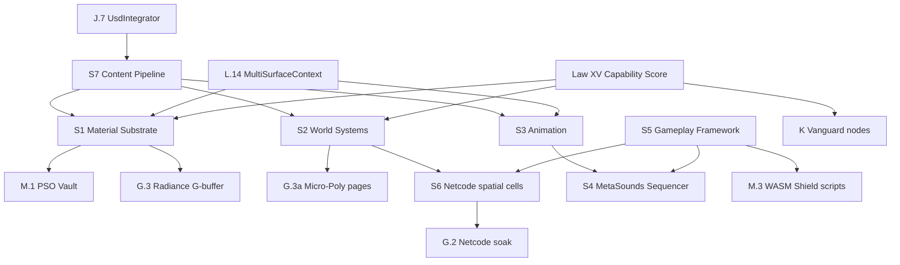
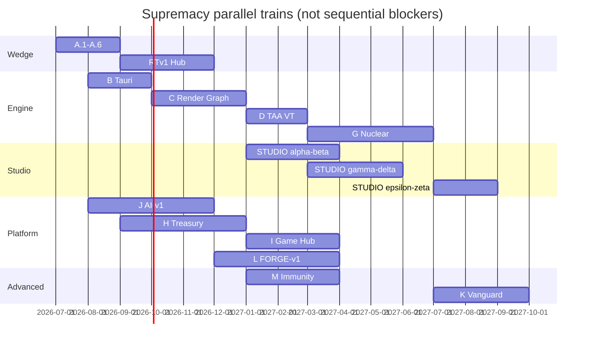

# Aethel Engine — Studio Supremacy Index (Master Plan Map)

**Version:** 1.5 (Chief Architect — **hygiene sync**: Focus order + doctrine registry #55–#64 + **#66**)  
**Status:** **Binding** — canonical index of **all** supremacy specifications  
**Canonical:** [`AETHEL_SUPREMACY_ROADMAP.md`](AETHEL_SUPREMACY_ROADMAP.md) v4.7  
**Completeness certificate:** [`AETHEL_PLANNING_COMPLETENESS.md`](AETHEL_PLANNING_COMPLETENESS.md) v1.2  
**Executor map:** [`AETHEL_CLAUDE_EXECUTION_MASTER_MAP.md`](AETHEL_CLAUDE_EXECUTION_MASTER_MAP.md) v1.4  
**Live ledger:** [`AETHEL_FOCUS1_EXECUTION_PROGRESS.md`](AETHEL_FOCUS1_EXECUTION_PROGRESS.md)  
**Purpose:** Single navigation map — every competitor surface mapped to a **Studio Bible** or **Onda**. **Do not create new MDs** — annotate / deepen these.

---

## Document Authority (binding — anti-lost)

| Tier | Open | Role |
|------|------|------|
| **0** | `.aethelrules` · `.cursorrules` | Absolute bans + quality gates |
| **1a** | [`AETHEL_SUPREMACY_ROADMAP.md`](AETHEL_SUPREMACY_ROADMAP.md) | 16 Laws · Ondas · governance |
| **1b** | **This Index** | Navigate every binding spec |
| **1c** | [`AETHEL_CLAUDE_EXECUTION_MASTER_MAP.md`](AETHEL_CLAUDE_EXECUTION_MASTER_MAP.md) | **Task queue** (current round only) |
| **1d** | [`AETHEL_FOCUS1_EXECUTION_PROGRESS.md`](AETHEL_FOCUS1_EXECUTION_PROGRESS.md) | **Live DONE/OPEN** + shipped interfaces |
| **2** | One pillar / onda / billing spec named by the round | Detail on demand |
| **3** | Playbook · Completeness · critiques | Exit gates / certificates — not daily preload |
| **X** | `cloud-web-app/CLAUDE_MASTER_EXECUTION_PLAN_V7\|V8` + V24/V30/Ultimate/UX Monetization | **SUPERSEDED** — Master Map §2.4 |

**Forbidden:** inventing another “Session Radar / Handoff / Master Plan V9” file. Update Progress + Master Map + this Index instead.

---

## Execution order (binding — hygiene 2026-07-09)

**Focus 1** (AI brain + real files) → **Focus 2** (renderer + terrain) → **Block 6** (billing truth) → then Hub/G marketing.  
Doctrines **#55–#64** + **#66** bind. **Anti-Hype Anchor** (Swarm §0a) binds all Fusion marketing. **No new planning** unless a new competitor surface appears.  
**Theoretical documentation closed** (2026-07-09) — execution in progress.  
**Claude boot:** Progress ledger → Master Map current round → one spec. Billing-first only if live payment fire. Details: [`AETHEL_APEX_DOCTRINE_AND_EXECUTION_FOCUS.md`](AETHEL_APEX_DOCTRINE_AND_EXECUTION_FOCUS.md).

---

## How to read this index

| Layer | Role |
|-------|------|
| **16 Laws** | Non-negotiable mandates in Supremacy Roadmap |
| **Ondas A→M** | Sequenced delivery trains |
| **Studio Pillars S1→S7** | **Production-tool depth** — artist/animator/designer/technical artist parity vs UE5 |
| **Nuclear G.3** | Render confrontation (Micro-Poly, Radiance, Entropy) |
| **Vanguard K / Forge L / Immunity M** | Next-decade + IDE + runtime defects |
| Doctrines **#55–#64** + **#66** | Apex / MoA / Director / Foley / **Anti-Lazy** — **SPEC** until Focus/S3/S4 exit |

**Executor rule:** No PR touching a pillar domain without that pillar's **acceptance checklist** + **G/K/L/M/S-readiness**.

---

## Complete specification map

### Core governance

| Document | Version | Scope |
|----------|---------|-------|
| [`AETHEL_SUPREMACY_ROADMAP.md`](AETHEL_SUPREMACY_ROADMAP.md) | **4.7** | 16 Laws, Ondas A→M, Studio S1→S7, **Focus order one-liner** |
| [`AETHEL_SUPREMACY_EXECUTION_PLAYBOOK.md`](AETHEL_SUPREMACY_EXECUTION_PLAYBOOK.md) | 1.1 | GF-* fixtures (28), CI gates, PR decision tree |
| [`AETHEL_PLANNING_COMPLETENESS.md`](AETHEL_PLANNING_COMPLETENESS.md) | **1.2** | A.0 100% planning + hygiene registry |
| [`AETHEL_FULL_PLAN_CORPUS_CRITIQUE.md`](AETHEL_FULL_PLAN_CORPUS_CRITIQUE.md) | 1.0 | Cold critique — seams, blind spots, priority stack |
| [`AETHEL_ENGINE_SUPREMACY_CRITIQUE_AND_UI_DISCIPLINE.md`](AETHEL_ENGINE_SUPREMACY_CRITIQUE_AND_UI_DISCIPLINE.md) | 1.0 | **UE surpass honesty + UI non-pollution** |
| [`AETHEL_UX_AND_ROBUSTNESS_ALIGNMENT_MASTER.md`](AETHEL_UX_AND_ROBUSTNESS_ALIGNMENT_MASTER.md) | 1.0 | **Critiques × all plans × UX/RB gates** |
| [`AETHEL_TECHNICAL_DEPTH_AND_ROBUSTNESS_GAP.md`](AETHEL_TECHNICAL_DEPTH_AND_ROBUSTNESS_GAP.md) | 1.0 | **Plans × code audit — surpass Cursor/UE/Roblox/Stripe** |
| [`AETHEL_CLAUDE_EXECUTION_MASTER_MAP.md`](AETHEL_CLAUDE_EXECUTION_MASTER_MAP.md) | **1.4** | **Task queue** Focus 1→2 + Blocks 6/2/3/7 |
| [`AETHEL_FOCUS1_EXECUTION_PROGRESS.md`](AETHEL_FOCUS1_EXECUTION_PROGRESS.md) | live | DONE/OPEN ledger + interfaces (backend Focus/6A/2A–2B shipped) |
| [`AETHEL_APEX_DOCTRINE_AND_EXECUTION_FOCUS.md`](AETHEL_APEX_DOCTRINE_AND_EXECUTION_FOCUS.md) | 1.0 | Focus 1→2 · #56–#58 |
| [`AETHEL_PLANS_CANONICAL_REFERENCE.md`](AETHEL_PLANS_CANONICAL_REFERENCE.md) | 1.1 | **Single plan table + UX journeys J1–J7** |
| [`AETHEL_PAYG_AND_WALLET_SPEC.md`](AETHEL_PAYG_AND_WALLET_SPEC.md) | 1.1 | Overage / wallet / PAYG + spend caps + $ meters |
| [`AETHEL_MARGIN_CREATIVE_WALLET_TURNS_CALCULATOR.md`](AETHEL_MARGIN_CREATIVE_WALLET_TURNS_CALCULATOR.md) | 1.0 | Mix margin · Creative · wallet→turns |
| [`AETHEL_AI_PROVIDER_CAPABILITY_MATRIX.md`](AETHEL_AI_PROVIDER_CAPABILITY_MATRIX.md) | 1.0 | LLM Fusion + creative spine |
| [`AETHEL_UNIT_ECONOMICS_AND_SUBSCRIPTION_ALIGNMENT.md`](AETHEL_UNIT_ECONOMICS_AND_SUBSCRIPTION_ALIGNMENT.md) | 1.4 | COGS/REV bound to `plans.ts`, anti-loss |
| [`AETHEL_HARDWARE_SCALABILITY_SPEC.md`](AETHEL_HARDWARE_SCALABILITY_SPEC.md) | 1.3 | Law XV + subscription cloud quotas |
| [`aethel_architecture_philosophy.md`](aethel_architecture_philosophy.md) | — | Philosophical laws 1–5 (2030 = **do not execute**) |

### Render & runtime (vs UE Nanite/Lumen/Niagara + stutter/loading/crash)

| Document | Onda | UE counterpart |
|----------|------|----------------|
| [`AETHEL_AAA_PARITY_TARGETS.md`](AETHEL_AAA_PARITY_TARGETS.md) | G.3 | Nanite, Lumen, Niagara/Chaos |
| [`AETHEL_VANGUARD_TECHNOLOGIES_SPEC.md`](AETHEL_VANGUARD_TECHNOLOGIES_SPEC.md) | K | DLSS-class, 3DGS, WebXR |
| [`AETHEL_RUNTIME_IMMUNITY_SPEC.md`](AETHEL_RUNTIME_IMMUNITY_SPEC.md) | M | PSO stutter, DirectStorage, crash isolation |
| [`AETHEL_MATERIAL_SUBSTRATE_SPEC.md`](AETHEL_MATERIAL_SUBSTRATE_SPEC.md) | **S1** | Material Editor, Substrate |

### World & content (vs UE World Partition, PCG, Landscape, Fab)

| Document | Onda | UE counterpart |
|----------|------|----------------|
| [`AETHEL_WORLD_SYSTEMS_SPEC.md`](AETHEL_WORLD_SYSTEMS_SPEC.md) | **S2** | World Partition, PCG, Landscape, Foliage |
| [`AETHEL_CONTENT_PIPELINE_SPEC.md`](AETHEL_CONTENT_PIPELINE_SPEC.md) | **S7** | Interchange, Fab, Quixel, USD cook |

### Character, animation, audio, cinematics (vs UE Control Rig, Sequencer, MetaSounds)

| Document | Onda | UE counterpart |
|----------|------|----------------|
| [`AETHEL_ANIMATION_CINEMATICS_SPEC.md`](AETHEL_ANIMATION_CINEMATICS_SPEC.md) | **S3** | Control Rig, Sequencer — **#63 marketing needs S3.0+** |
| [`AETHEL_METASOUNDS_SPEC.md`](AETHEL_METASOUNDS_SPEC.md) | **S4** | MetaSounds — **#64 needs S4.0+ compiler** |
| [`AETHEL_CINEMATIC_DIRECTOR_DOCTRINE.md`](AETHEL_CINEMATIC_DIRECTOR_DOCTRINE.md) | J+G | **#63** Engine Film — SPEC until capture+Sequencer |
| [`AETHEL_AUDIO_LIBRARY_FIRST_DOCTRINE.md`](AETHEL_AUDIO_LIBRARY_FIRST_DOCTRINE.md) | S4+J | **#64** Foley library-first — SPEC until S4+search |

### Gameplay & multiplayer (vs UE GAS ecosystem, Iris, replication)

| Document | Onda | UE counterpart |
|----------|------|----------------|
| [`AETHEL_GAMEPLAY_FRAMEWORK_SPEC.md`](AETHEL_GAMEPLAY_FRAMEWORK_SPEC.md) | **S5** | GAS, Gameplay Tags, Mass Entity, State Tree |
| [`AETHEL_NETCODE_PRODUCTION_SPEC.md`](AETHEL_NETCODE_PRODUCTION_SPEC.md) | **S6** | Replication Graph, dedicated server, anti-cheat |

### AI, IDE, platform (vs Cursor, v0, Muse, Fab, Steam, Roblox)

| Document | Onda | Counterpart |
|----------|------|-------------|
| [`AETHEL_AI_FUSION_CREATIVE_SPEC.md`](AETHEL_AI_FUSION_CREATIVE_SPEC.md) | J | Muse, Runway, agent IDE |
| [`AETHEL_INTELLIGENT_ROUTING_AND_CONTEXT_COMPRESSION.md`](AETHEL_INTELLIGENT_ROUTING_AND_CONTEXT_COMPRESSION.md) | J+L | **v1.2** Apex Router · #55–#58 |
| [`AETHEL_APEX_DOCTRINE_AND_EXECUTION_FOCUS.md`](AETHEL_APEX_DOCTRINE_AND_EXECUTION_FOCUS.md) | Exec | Focus 1→2 · #56–#58 |
| [`AETHEL_APEX_FAST_SWARM_ORCHESTRATION.md`](AETHEL_APEX_FAST_SWARM_ORCHESTRATION.md) | J.1+L | **v1.3** Maestro+Adaptive MoA+Heal · **#59–#62** + **#66** |
| [`AETHEL_ANTI_LAZINESS_PROTOCOL.md`](AETHEL_ANTI_LAZINESS_PROTOCOL.md) | J+L | **#66** LazyInspector + chunk ≤300 · **APPROVED** |
| [`AETHEL_FUSION_ORCHESTRATION_CRITIQUE_AND_PLAN_ALIGNMENT.md`](AETHEL_FUSION_ORCHESTRATION_CRITIQUE_AND_PLAN_ALIGNMENT.md) | J | **#62 APPROVED** (v1.1) |
| [`AETHEL_AI_WORKLOAD_AND_BILLING_ALIGNMENT.md`](AETHEL_AI_WORKLOAD_AND_BILLING_ALIGNMENT.md) | J+6 | JobBudget · keep prices |
| [`AETHEL_FULL_PLAN_CORPUS_CRITIQUE.md`](AETHEL_FULL_PLAN_CORPUS_CRITIQUE.md) | Meta | Cold critique · priority stack |
| [`AETHEL_UNIVERSAL_IDE_FORGE_SPEC.md`](AETHEL_UNIVERSAL_IDE_FORGE_SPEC.md) | L | Cursor, v0, Devin |
| [`AETHEL_NETWORK_COMMERCE_LIVEOPS_SPEC.md`](AETHEL_NETWORK_COMMERCE_LIVEOPS_SPEC.md) | H | Epic Store, Roblox economy |
| [`AETHEL_GAME_HUB_PLATFORM_GROWTH_SPEC.md`](AETHEL_GAME_HUB_PLATFORM_GROWTH_SPEC.md) | I | Steam discovery, Roblox Hub |

---

## Studio Pillars S1→S7 (production-tool supremacy)

Parallel to Ondas — **do not delay Wedge**; **S.0 hooks** in A–D.

| Pillar | Bible | Primary waves | Ship gate |
|--------|-------|---------------|-----------|
| **S1** Material Substrate | Material spec | C→D | S1 acceptance |
| **S2** World Systems | World spec | A.1→C→D | S2 acceptance |
| **S3** Animation & Cinematics | Animation spec | E (+ D sequencer) | S3 acceptance · **#63 marketing** |
| **S4** MetaSounds | MetaSounds spec | E | S4 acceptance · **#64 marketing** |
| **S5** Gameplay Framework | Gameplay spec | C→G.2 | S5 acceptance |
| **S6** Netcode Production | Netcode spec | C hooks→G.2 | S6 acceptance |
| **S7** Content Pipeline | Content spec | A.2→VI→J.7 | S7 acceptance |

**Combined studio claim gate:** "Full production studio parity" marketing only after **S1–S7** acceptance suites + **G.3** nuclear on desktop enthusiast.

---

## Competitor supremacy matrix (planning target — honest)

| Competitor | Aethel surpass vector | Primary specs |
|------------|----------------------|---------------|
| **Unreal Engine 5** | WASM Shield + web publish + Capability Score + governed AI + no PSO stutter (M) | G.3, M, S1–S7 |
| **Unity 6** | Single stack web+desktop + Fusion IDE + entitlements (H) | L, J, H, XV |
| **Cursor / v0** | Multi-surface context + evidence + Cost Guard + game+web unified | L, J |
| **Devin** | Governed sandbox + validation gate + evidence ledger | L |
| **Steam / Epic Store** | Indie Hub + instant demo + cross-save (I) + Treasury (H) | I, H |
| **Roblox** | Create→publish→earn + web demo + honest netcode badges (UGC/WASM = later) | I, H, S6 |
| **Runway / Veo** | Engine cinema (#63 Director) + library Foley (#64) — not pixel-gen default | #63, #64, S3, S4 |

---

## S-readiness checklist (every Onda A–F PR)

- [ ] **G + K + L + M-readiness** (existing)
- [ ] Material graph changes register **PSO fingerprint** (S1, M.0)
- [ ] World/terrain/PCG changes use **partition cell schema** (S2)
- [ ] Animation/sequencer changes use **track schema** (S3)
- [ ] Audio graph changes target **MetaSounds compiler** path (S4)
- [ ] Gameplay changes use **tags/data asset IDs** (S5)
- [ ] Multiplayer hooks expose **replication intent** (S6)
- [ ] Asset import changes extend **cook manifest** (S7)

---

## Approved decisions (#59–66, v4.6)

| # | Decision |
|---|----------|
| 59 | **Studio Pillars S1→S7** — binding production-tool bibles; parallel to Ondas |
| 60 | **S1 Material Substrate** — material graph compiler mandatory; no hardcoded TSX materials in ship path |
| 61 | **S2 World Systems** — PCG + World Partition spec replaces one-line roadmap entries |
| 62 | **S3 Animation** — Sequencer + Control Rig parity class; MetaHuman = USD not capsule |
| 63 | **S4 MetaSounds** — graph compiler mandatory; play-log forbidden at ship |
| 64 | **S5 Gameplay Framework** — tags + data assets + Mass SoA at 10k entities |
| 65 | **S6 Netcode** — dedicated spec; G.2 table alone insufficient for marketing |
| 66 | **S7 Content Pipeline** — USD/Fab-class ingest extends Law VI + J.7 |

---

## Pillar dependency graph (binding integration)

No pillar ships in isolation. **Executor:** PR touching domain X must not break contracts of upstream pillars.

**Critical path for studio claim:** S7 → S1 → G.3 → S2 → S3 → S4 → S5 → S6 (parallel where possible after C foundation).

---

## STUDIO-v1 release train (detailed milestones)

Parallel to **A.1–A.6** and **B→D**; does **not** block Wedge #1 (DX + web publish + Hub + AI evidence).

| Milestone | Steps | Gate | Depends on |
|-----------|-------|------|------------|
| **STUDIO-α** | S1.0, S2.0, S5.0, S6.0, S7.0 | Schema hooks in C PRs | Onda C start |
| **STUDIO-β** | S1.1, S2.1, S7.1 | Viewport-visible material + terrain partition | A.1 terrain, C render graph |
| **STUDIO-γ** | S1.2, S2.2, S2.3, S3.0, S5.1–S5.2 | PCG non-empty + sequencer schema | D |
| **STUDIO-δ** | S3.1–S3.3, S4.0–S4.2, S5.3 | Animation + audio graph ship | E |
| **STUDIO-ε** | S1.3, S2.4, S3.4, S4.3, S5.4, S6.1–S6.3 | Full framework + netcode hardening | G.2 |
| **STUDIO-ζ** | S6.4–S6.5, S7.2–S7.4 | Soak + content marketplace validation | G + H |

**Marketing gates (binding):**

| Claim | Required milestones |
|-------|---------------------|
| "Material editor" | STUDIO-β + S1.1 acceptance |
| "Open world" | STUDIO-γ + S2.1 + Law XV tier proof |
| "MetaSounds" | STUDIO-δ + S4.0 acceptance |
| "Production multiplayer" | STUDIO-ε + S6.2 + G.2 |
| "Full studio parity" | STUDIO-ζ + G.3 enthusiast + S1–S7 all acceptance |

---

## Honest limitations register (global — do not market beyond)

| Limitation | Reason | Aethel stance vs UE5 |
|------------|--------|----------------------|
| **ML Deformer / full MetaHuman neural** | GPU + dataset + legal | USD facial rig S3.4; no neural deformer Day 1 |
| **Substrate 1:1 slab parity** | UE proprietary stack | S1 simplified slab model — functionally equivalent for artists |
| **Console TRC automation** | Cert labs + platform SDKs | G.4 manual checklist; no "certified console" until G.4 |
| **Hardware RT on web** | WebGL2/WebGPU limits | Law XV: SSGI + probes forever on web |
| **50 km² on web** | 4 GB heap + bandwidth | Honest 1–4 km² web; 50 km² desktop enthusiast only |
| **Iris 1:1 replication** | UE server stack years | S6 Iris-class **intent** — custom graph + GAS deltas |
| **Fab marketplace DCC** | Epic ecosystem lock-in | S7 + H: ingest + publish; not Epic Fab clone |
| **Chaos Destruction 1:1** | Entropy is Aethel answer | G.3d–e Entropy — not Chaos physics clone |
| **DirectStorage on macOS/Linux** | OS API | M.2 Win-first; GPU decompress fallback elsewhere |
| **Neural upscale on integrated GPU** | ONNX perf | K.1 disabled on integrated; FSR path Law XV |

**Surpass vectors (where Aethel wins honestly):**

1. **Web + desktop single stack** — Unity-class without split engine
2. **WASM script isolation (M.3)** — UE C++ crash class eliminated for gameplay scripts
3. **PSO tier bundles (M.1)** — documented JIT fallback vs UE silent stutter
4. **Capability Score (Law XV)** — honest downgrade vs UE "works on my 4090" demos
5. **Governed AI (Law XVI + L)** — evidence ledger + Cost Guard vs Muse black box
6. **Instant web publish + Hub (I)** — Steam discovery latency eliminated for demos
7. **Agent-first IDE (L)** — Cursor + v0 + game context unified

---

## Technology alignment matrix

| Technology | Spec owner | Web path | Desktop path | Competitor ref |
|------------|------------|----------|--------------|----------------|
| WGSL shaders | S1, C | WebGPU | wgpu | UE HLSL → SM6 |
| Bindless heaps | C, Law V | WebGPU limits | wgpu full | UE bindless |
| Meshlets | S7, G.3a | Reduced LOD | Full Nanite-class | Nanite |
| VT pages | S1, M.2 | Range Fetch | DS + GPU decode | UE VT |
| Web Audio DAG | S4 | Primary | Sidecar optional | MetaSounds |
| Rapier physics | S3, S5, S6 | WASM worker | Native Rust | Chaos |
| GAS | S5 | IPC to Rust | Native | UE GAS |
| USD | S7, J.7 | Cook cloud | Local + cloud | Interchange |
| ONNX | K | — | Sidecar | DLSS |
| Yjs CRDT | L, J | Primary collab | Sync | Perforce + Live |

---

## Risk register (planning — mitigate before ship)

| ID | Risk | Impact | Mitigation |
|----|------|--------|------------|
| R-S01 | Material compiler explosion (variant combinatorics) | PSO vault size, compile times | S1 variant mask cap; M.1 tier bundles |
| R-S02 | PCG empty output (Anti-Mock violation) | Trust / demos fail | S2.2 CI: min instance count; fail-closed cook |
| R-S03 | Sequencer scope creep | E slip | S3.0 schema first; defer ML Deformer |
| R-S04 | MetaSounds GC in hot path | Audio dropouts | S4: pre-allocated AudioParam; worker compile |
| R-S05 | GAS JSON creep in IPC | 60 Hz stall | S5: binary layout audit in CI |
| R-S06 | Netcode without determinism | Rollback impossible | S6 blocked until Decision #6 Rapier path green |
| R-S07 | USD material loss on import | Artist revolt | S7.1 golden fixtures; manual fallback graph |
| R-S08 | Studio pillars delay Wedge | Business failure | S.0 hooks only in A–F; STUDIO-v1 parallel |

---

## Supremacy scorecard (planning depth — **100% A.0**)

| Domain | UE5/competitor ref | **Plan depth** | Code today | Next action |
|--------|-------------------|----------------|------------|-------------|
| Render nuclear G.3 | UE5 Nanite/Lumen | **100%** | ~15% | Execute C→G |
| Studio S1–S7 | UE5 editor tools | **100%** | ~5–20% | Execute STUDIO-v1 |
| AI / IDE J + L | Cursor/v0/Devin | **100%** | ~25% | Execute J.1 |
| Platform H + I | Epic/Roblox/Steam | **100%** | ~10% | Execute H.0 |
| Runtime M + Vanguard K | UE defects + DLSS/XR | **100%** | ~0% | Post-C / post-G |
| Law XV Hardware | Tier gating | **100%** | partial | Execute B.1 |
| Execution ops | GF fixtures + CI | **100% spec** | 0% files | A.1 creates GF-* |
| Migration / onboarding | UE5 artists | **100%** | N/A | Publish guide |

**Certificate:** [`AETHEL_PLANNING_COMPLETENESS.md`](AETHEL_PLANNING_COMPLETENESS.md) — **no further planning required** unless new competitor surface emerges.

**Implementation gap** is intentional next phase — not a planning deficiency.

---

## Execution playbook (operational layer)

**Binding companion:** [`AETHEL_SUPREMACY_EXECUTION_PLAYBOOK.md`](AETHEL_SUPREMACY_EXECUTION_PLAYBOOK.md)

| Playbook section | Use when |
|------------------|----------|
| Executor decision tree | Every PR review |
| Golden fixture catalog (GF-*) | Writing acceptance tests |
| Test pyramid L0–L5 | CI design |
| Wave integration matrix | Sequencing work |
| CI gate registry | Adding qa scripts |
| Agent evidence requirements | Fusion/Forge PRs |

---

## Golden fixtures quick reference

See playbook for full list. **Minimum before STUDIO-β:** GF-MAT-001, GF-WORLD-001, GF-USD-001.

---

## Onda A→M + Studio — unified timeline (planning)

**Note:** Gantt is **planning visualization** — Wedge does not wait for G or K.

---

## Spec version registry (hygiene 2026-07-09)

| Document | Version | Depth tier |
|----------|---------|------------|
| Studio Index | **1.5** | Master map + Focus order + doctrine registry |
| Planning Completeness | **1.2** | Certificate + full registry sync |
| Claude Execution Master Map | **1.4** | Focus 1→2 + blocks |
| Routing / Context | **1.2** | Apex |
| Apex Fast Swarm | **1.3** | Maestro + Adaptive MoA (#62) + Heal + #66 hook |
| Anti-Laziness Protocol | **1.0** | **#66 APPROVED** |
| Fusion critique | **1.1** | #62 APPROVED |
| Plans Canonical | **1.1** | Prices + journeys |
| PAYG / Wallet | **1.1** | Spend caps |
| Execution Playbook | **1.1** | GF-* (28) |
| S1–S7 pillars | **1.2** | Node catalogs |
| AAA / Forge / Immunity / Vanguard | **1.1** | Parallel waves |
| AI Fusion J | **1.2** | Per-step acceptance |
| Roadmap | **4.7** | Governance + Focus one-liner |
| Director #63 / Audio #64 / Full Critique | **1.0** | SPEC until exit gates |

**Note:** Studio pillar decision IDs (#59–#66 in this Index §) are **pillar governance** — distinct from Fusion doctrine IDs (**#55–#64**, **#66** Anti-Lazy in AI Fusion / Swarm docs). Do not conflate.

---

## Historical / reference / SUPERSEDED (do not execute from these)

| Document | Status |
|----------|--------|
| [`CLAUDE_MASTER_BRIEF.md`](CLAUDE_MASTER_BRIEF.md) · [`CLAUDE_MEGA_WAVES.md`](CLAUDE_MEGA_WAVES.md) | Catalog / wave narrative — **Master Map overrides** order |
| [`master_mission_briefing.md`](master_mission_briefing.md) · [`walkthrough.md`](walkthrough.md) | Mission / narrative |
| [`AUDITORIA_V33_CRITICA_DOS_3_MDS.md`](AUDITORIA_V33_CRITICA_DOS_3_MDS.md) · audits / UX critiques | Historical reconciliation |
| [`AI_CRITIQUE_DEBT_REGISTRY.md`](AI_CRITIQUE_DEBT_REGISTRY.md) · [`FUTURE_IMPROVEMENTS_REGISTRY.md`](FUTURE_IMPROVEMENTS_REGISTRY.md) | Ticket registries — close via Master Map blocks |
| [`aethel_vision_2030.md`](aethel_vision_2030.md) | **DO NOT EXECUTE** |
| `cloud-web-app/CLAUDE_MASTER_EXECUTION_PLAN_V7.md` | **SUPERSEDED** |
| `cloud-web-app/CLAUDE_MASTER_EXECUTION_PLAN_V8.md` | **SUPERSEDED** |
| `cloud-web-app/CLAUDE_CRITICAL_ALIGNMENT_V24.md` | **SUPERSEDED** |
| `cloud-web-app/CLAUDE_ULTIMATE_QA_CRITIQUE_V30` | **SUPERSEDED** |
| `cloud-web-app/CLAUDE_MASTER_ULTIMATE_ARCHITECTURE_SPEC` | **SUPERSEDED** |
| `cloud-web-app/CLAUDE_AETHEL_UX_MONETIZATION_ALIGNMENT` | **SUPERSEDED** |
| ~~`AETHEL_CLAUDE_SESSION_RADAR.md`~~ · ~~`AETHEL_CLAUDE_HANDOFF_FOCUS.md`~~ | **Deleted** — folded into Focus Progress + Master Map §0 |

**Changelog:** 2026-07-13da — **Native ONNX fixture honesty CLOSED (probe) / HELD (`nativeOnnxReady`)** (`onnx-fixture-honesty` + ca honesty wire; redistributable text-to-3d `.onnx` unavailable — size/license; Identity stub ≠ text-to-3d; probe false; ready did **not** flip; BYOK clay cb remains; cargo `local-ai` / Instant Meshes / Tripo local / Coins / Agones / Nanite / DLSS [HELD]; cu protocol CLOSED). 2026-07-13cz — **GameSave cloud marketing honesty flip CLOSED (probe) / HELD (`gameSaveCloudMarketingReady`)** (`gamesave-cloud-marketing` + LiveOps F.2 wire + actor immortal gate; no `DATABASE_URL` → probe false; marketing did **not** flip; cloud immortal / Coins / Agones / Nanite / DLSS [HELD]). 2026-07-13cy — **GPU Fracture + Mass ECS playtest wire CLOSED** (`lib/playtest` + SimulationTick/GameLoop `fractureMassPlaytestRequested`; soak-gated `fractureMassPlaytestReady` distinct from cv/cw; Chaos / 100k / Unreal Mass / Coins / Agones / Nanite / DLSS [HELD]). 2026-07-13cx — **FinOps + Founder God Mode Forge CLOSED** (domain economic router UI→Sonnet / Kernel→Grok·Opus + CostGuard settle:0; WeeklyEvolution + HotFix cadence → L.6 `autonomous-engineer-loop`; L.11 UIMutation; FounderEvolutionInbox AgentsWindow Evolution tab; honesty competitor radar; community AAA audit fail-closed; L.1 sandbox / full AgenticUIStudio L.7 / RepoGraphRAG L.12 / Coins / Agones / Nanite / DLSS [HELD]). 2026-07-13cw — **GPU Mass ECS CLOSED** (`lib/mass-ecs` SoA + WebGPU agent step; soak-gated `gpuMassEcsReady`; 100k / Unreal Mass [HELD]). 2026-07-13cv — **GPU-Driven Fracture CLOSED** (`lib/destruction` hierarchical Voronoi + GPU debris; soak-gated `gpuFractureReady`; Chaos parity [HELD]). 2026-07-13cu — **Native ONNX ORT weights soak CLOSED (protocol) / HELD (`nativeOnnxReady`)** (`onnx-ort-session` load+pager around infer + disk weights probe; Rust `onnx_native_gen` deepen; soak-gated `nativeOnnxReady` did **not** flip — no `.onnx` on disk; weights missing ≠ ready; BYOK clay cb remains; cargo `local-ai` / Instant Meshes / Tripo local / Coins / Agones / Nanite / DLSS [HELD]). 2026-07-13ct — **Detour NavMesh deepen CLOSED** (`detour-navmesh` agent A* on ch walkable + off-mesh jump/drop/teleport/ladder + conveyor rebuild after gen; soak-gated `detourNavReady` distinct from `gpuRecastReady` / `unrealRecastParityReady: false`; UE Recast/Detour parity / NavMesh editor / Coins / Agones / Nanite / DLSS [HELD]). 2026-07-13cs — **Ocean GPU FFT deepen CLOSED** (`gpu-fft-ocean` WebGPU compute FFT WGSL `ocean-fft-displacement-v1`; CapScore GT730 → CPU; soak-gated `gpuFftOceanReady` distinct from marketing `gpuFftAllowed: false`; AAA `enableOcean` WebGPU opts; UE Water / Coins / Agones / Nanite / DLSS [HELD]). 2026-07-13cq — **Ocean Mesh Bind + Explicit Buoyancy CLOSED** (`OceanRenderPass` + duck-typed WaterParams + PBR sky/Radiance sun·cloud coupling + AAARenderer.enableOcean; `OceanBuoyancyVolume` data-driven float; soak-gated `oceanMeshBindReady` distinct from cm; UE Water / marketing gpuFftAllowed / Coins / Agones / Nanite / DLSS [HELD]). 2026-07-13cr — **Aethel Cosmos volumetric acoustic atmosphere wire CLOSED** (`acoustic-atmosphere-wire` vacuum/hull/atmosphere → playtest audio bus; CapScore GT730 acousticRaySteps; soak-gated `acousticAtmosphereReady` distinct from cn/co/cp; Full HRTF AAA / MetaSounds GPU / MMO space / Star-Citizen-solved / Agones / Nanite / Coins / DLSS [HELD]). 2026-07-13cp — **Aethel Cosmos PBR sky viewport wire CLOSED** (`pbr-sky-viewport-wire` Rayleigh/Mie → AAARenderer scene.background before present; CapScore GT730 sky samples; soak-gated `pbrSkyViewportReady` distinct from cn/co; painted skybox claim + UE atmosphere / Bruneton LUT / MMO space / Star-Citizen-solved / Agones / Nanite / Coins [HELD]). 2026-07-13co — **Aethel Cosmos playtest soak deepen CLOSED** (multi-frame floating-origin rebase + nested island + CCD sweep + dual BVH query + CapScore GT730; SimulationTick velocity/obstacles/render/dual-BVH no-op holes closed; soak-gated `cosmosPlaytestSoakReady` distinct from cn `cosmosScaleReady`; MMO space / Star-Citizen-solved / Agones / Nanite / Coins / cloud immortal [HELD]). 2026-07-13cn — **Aethel Cosmos planetary/space scale CLOSED** (`lib/cosmos/` LWC f64 + gravity volumes + volumetric 3D streaming + planetary SDF + nested grids / dual BVH / reversed-Z / CCD / interest / acoustic / PBR sky / floating origin / actor persistence; GameLoop+SimulationTick+AAARenderer wire; soak-gated `cosmosScaleReady`; MMO space / Star-Citizen-solved / Agones / Nanite / Coins / cloud immortal [HELD]). 2026-07-13cm — **Ocean viewport / playtest wire CLOSED** (`ocean-viewport-wire` + `ocean-playtest-wire` FFT mesh + Rapier buoyancy + SimulationTick/GameLoop `oceanViewportRequested` + CapScore degrade; soak-gated `oceanViewportReady`; Zero-UI when off; UE Water / GPU FFT / Coins / Agones / Nanite / DLSS [HELD]). 2026-07-13cl — **Sequencer IDE play / apply deepen CLOSED** (`sequencer-viewport-wire` + `sequencer-play-wire` playhead tick + `evaluateSequencerCurve` + Studio `SequencerIdePanel` scrub/play; soak-gated `sequencerPlayReady`; Zero-UI runtime; UE Sequencer / final footage / Coins / Agones / Nanite / DLSS [HELD]). 2026-07-13ck — **Partition streaming soak CLOSED** (`partition-playtest-wire` frustum fly-through + CapScore budgets + SimulationTick/GameLoop `partitionStreamingRequested`; soak-gated `partitionStreamingReady`; no-loading-screen / UE Partition parity / 50km² / Nanite / Coins / Agones / DLSS [HELD]). 2026-07-13cj — **EQS → GAS playtest wire CLOSED** (`eqs-playtest-wire` + `eqsPlaytestReady` soak-gated + TopologyBus.evaluateAndFireWithEqs + SimulationTick/GameLoop + BT EqsFireAbilityActionNode; bu lib-only → real AI fire path; GAS IPC 60Hz / UE EQS parity / Coins / Agones / Nanite / DLSS [HELD]). 2026-07-13ci — **FSR + ScalableRenderGraph executor deepen CLOSED** (`fsr-executor` CapScore spatial + SRG FSR.executorShipped + AAARenderer.enableFsrUpscale + GameLoop/useRenderPipeline; soak-gated fsrSrgReady; GT730 performance; Zero-UI native; full frameGraphLive / DLSS web / FSR3 Frame Gen [HELD]). 2026-07-13ch — **GPU NavMesh / Recast heightfield→walkable soak CLOSED** (`gpu-recast-navmesh` + WGSL `navmesh-heightfield-walkable-v1` + conveyor GPU-or-CPU; `gpuRecastReady` soak-gated; Law XV GT730 Zero-UI; Unreal Recast/Detour parity `[HELD]`). 2026-07-13cg — **Frente Delta Escala Colossal + Hardware Max CLOSED** (lib/hardware worker/async/FSR/CapScore; lib/world-streaming partition; lib/ocean FFT+buoyancy; Sequencer+#63; Yjs viewport 3D; DLSS/Nanite/no-stutter/UE parity/Agones [HELD]). 2026-07-13cf — **Radiance viewport enable+composite CLOSED** (`enableRadianceOnRenderer` → GameLoop + `useRenderPipeline`; `RadianceRtCompositePass` additive RT blit; honesty `radianceViewportEnableReady`; Law XV GT730 Zero-UI; HW RT / Radiance GI / Lumen marketing `[HELD]`; sibling **cg** Front Delta). 2026-07-13ce — **Competitive rollback GameLoop soak CLOSED** (`competitive-rollback-soak` + honesty + GameLoop ticks `FixedPointRollbackSession` + `SimulationTick.skipRapierPhysics` when competitive; `competitiveRollbackSoakReady`; `ggpoLive` / desync-free marketing `[HELD]`; honest: Unreal/Unity still better at live netcode rollback). 2026-07-13cd — **World Forge → Studio IDE wire CLOSED** (`selectWorldForgeRoute` + `generateWorldForge` + `gen-world` Studio tool + `WorldStudioClient` viewport + `/studio/gen-world` + honesty math-pcg vs LoRA HELD; Zero-UI when LoRA/ONNX HELD; `worldForgeIdeReady`; Partition / Nanite / Coins / Agones `[HELD]`; GPU Recast CLOSED later as **ch**). 2026-07-13cc — **Aethel World Forge deepen CLOSED** (`lib/world-forge` LoRA inject scaffold + SDF→heightfield + seamless PBR math + biome masks + PCG hybrid InstancedMesh + CPU NavMesh + collider LOD + Law XV budgets + FusionTx; `loraClayReady`/`cityFromPrompt`/`Substance`/`Partition streaming`/`Nanite cinema` `[HELD]`; GPU Recast CLOSED later as **ch**; honest: NOT surpassed Unreal/Unity AAA; vs Meshy/Tripo lead refine bw/bz/ca, raw clay HELD). 2026-07-13cb — **Native Gen → Studio IDE + CreativeBridge wire CLOSED** (`selectGameReadyCharacterRoute` + `generateGameReadyCharacter` + `gen-character` Studio tool + honesty badges native vs BYOK; CreativeBridge cloud clay choke; local $0 FusionTx; Zero-UI when `nativeOnnxReady` HELD; ORT / Instant Meshes / Tripo local / Coins / Agones `[HELD]`). 2026-07-13ca — **Native 3D Generation Travas CLOSED** (`lib/native-gen` VRAM pager + splat→mesh MC + V-HACD + heat-diffusion + bw LOD + consume bz semantic/delight + FusionTx; Rust `onnx_native_gen` scaffold; `vramPagerReady`/`splatToMeshReady`/`vhacdReady`/`heatDiffusionReady`; `nativeOnnxReady: false`; Instant Meshes / Tripo local / ORT soak / commercial V-HACD / Poisson `[HELD]`). 2026-07-13bz — **Remesh quality deepen CLOSED** (`auto-retopology` + semantic landmark edge-loops + `delighting-pbr` Radiance albedo/N/R/M; LOD `native-gen-lod-tiers:v1` ca-consumer; `remeshQualityDeepened`; `instantMeshesParityReady` always false; V-HACD/heat-diffusion → **ca**; Instant Meshes `[HELD]`). 2026-07-13by — **CLOUD-001 god-rays / depth-blend deepen CLOSED** (`volumetric-clouds` depth RT + GodRaysPass; Law XV adaptive samples; `RadianceFrameWire.tickPost`; `VOLUMETRIC_CLOUDS_SHIP_STATUS=CLOSED`; full volumetric AAA marketing `[HELD]`). 2026-07-13bx — **Live clay OBJ poll → 3D Quality Pipeline CLOSED** (`clay-live-poll` + `live-clay-quality-bridge`; Tripo/Meshy/Luma poll/webhook → OBJ/GLB → conveyor; `liveClayPollReady`; CostGuard settle:0; BYOK fail-closed; Instant Meshes/XAtlas `[HELD]`). 2026-07-13bv — **WebGPU Dual Quaternion Skinning soak CLOSED** (`dual-quaternion-skinning` + `dq-viewport-wire` + WGSL `dual-quaternion-skin-v1`; `dqComputeSkinningReady` soak-gated; Law XV GT730 fail-closed; WebGL2/CPU Zero-UI fallback; Nanite/Euphoria AAA skinning `[HELD]`). 2026-07-13bw — **3D Quality Pipeline / game-ready refine CLOSED** (lib/mesh-quality conveyor; Instant Meshes/live clay [HELD]; tripoOnlyShipAllowed:false; DQ soak closed later as **bv**). 2026-07-13bu — **Character/GAS topology deepen CLOSED** (DQ skin + biological bridge + GAS prediction↔bl + foot IK + retarget + EQS + Data-Asset IDE→AssetPipeline; GGPO-live / Euphoria / GAS IPC `[HELD]`; DQ compute soak deepened **bv**). 2026-07-13bt — **Radiance frame wire CLOSED** (BVH+RT+denoiser + cascade/VSM hybrid + adaptive cloud steps into `AAARenderer`; Law XV GT730 fail-closed; HW RT / god-rays / Radiance GI marketing `[HELD]`). 2026-07-13bs — **Console HAL / wgpu desktop deepen CLOSED** (backend enum WebGPU/Vulkan/DX12/PS5_HELD + negotiate; `consoleHalReady` on documented desktop path; `ps5GnmReady` always false; live present/submit soak `[HELD]`). 2026-07-13br — **WASM Plugin ABI + sandbox injector deepen CLOSED** (ABI negotiate + sandboxed `WebAssembly.Module`/`Instance` fixture; `wasmPluginAbiReady` on negotiate+instantiate; AgentShell sandbox-only; plugin marketplace `[HELD]`). 2026-07-13bq — **Editor ≠ Runtime isolation deepen CLOSED** (IDE/Next deny-list + `assertRuntimeExportClean` on publish/export; `editorRuntimeIsolated` on clean gate; `v8WinitHostReady` `[HELD]`). 2026-07-13bp — **Object Pool / Frame Arena zero-stutter deepen CLOSED** (`GameplayPoolBus` + `assertNoHotPathAlloc` soak + SimulationTick wire; `objectPoolEnforced` on soak; `zeroStutterMarketingAllowed` `[HELD]` until Founder M.1). 2026-07-13bo — **Law VI AethelPack Zstd WASM compression CLOSED** (`@bokuweb/zstd-wasm` encode/decode + prefer-Zstd cook path + honest deflate fallback; `zstdEncoderReady` on prove; BC7/ASTC/VT/Rust-worker `[HELD]`). 2026-07-13bn — **Law VI AethelPack / Asset Cook deepen CLOSED** (JS pack writer deflate+SHA-256 multi-asset `.aethelpack` + publish cook Law XVI + `cookPackReady` on real pack bytes; BC7/ASTC/VT/Rust-worker `[HELD]`). 2026-07-13bm — **Law I physics-worker + SAB deepen CLOSED** (protocol + manager + `physics-sim.worker` bind/step against bk shared-transform ring; SimulationTick/GameLoop `physicsWorkerRequested`; `physicsWorkerReady` when shared step proven; zero-stutter / Rapier-in-worker soak `[HELD]`; Zero-UI when Worker/COI unavailable). 2026-07-13bl — **Fixed-point physics / netcode deepen CLOSED** (Q16.16 + `FixedPointPhysicsAdapter` + `FixedPointRollbackSession` snapshot/restore; competitive mode flag sidesteps Rapier float; `fixedPointNetcodeReady` when path wired; `ggpoLive` / desync-free / competitive marketing `[HELD]`; Zero-UI when unavailable). 2026-07-13bk — **Law I SAB + COOP/COEP production deepen CLOSED** (middleware + next.config COOP/COEP on play/runtime/studio/ide; `SharedTransformPhysicsBridge` + Atomics/fallback-copy in SimulationTick; `sabTransformsReady` only when headers+bridge+allocation+COI+SAB; zero-stutter / physics-worker `[HELD]`). 2026-07-13bj — **F.1 GameSave cloud honesty deepen CLOSED** (Prisma-proven `gameSaveCloudReady` gate; R2 CAS optional; dual-write + CloudProvider; marketing `[HELD]` without DATABASE_URL). 2026-07-13bi — **7 Critical AAA Production Gaps CORE scaffolds CLOSED** (M/K/L deepen: AethelPack cook fail-closed + Console HAL trait + Editor≠Runtime + SAB transforms + ObjectPool/FrameArena + fixed-point/rollback + WASM Plugin ABI + `GET /api/runtime/aaa-production-honesty`; native baker / PS5 GNM / V8+winit / GGPO-live / pool soak `[HELD]`). 2026-07-13bh — **Landscape seeded sculpt-noise brush deepen CORE CLOSED** (deterministic seeded value-noise → heightfield authority → `aethel:terrain-heightfield-changed`; same seed → same heights; Rapier playtest loop `[HELD]`). 2026-07-13bg — **Landscape erosion / hydraulic brush deepen CORE CLOSED** (deterministic brush-local hydraulic + thermal → heightfield authority → `aethel:terrain-heightfield-changed`; sculpt-noise CLOSED later as **bh**). 2026-07-13bf — **Landscape foliage brush deepen CORE CLOSED** (foliage authority + paint/erase → `aethel:terrain-foliage-changed` → InstancedMesh viewport; erosion CLOSED later as **bg**; sculpt-noise CLOSED later as **bh**). 2026-07-13be — **Landscape paint / layer brush deepen CORE CLOSED** (splatmap authority + paint brush → `aethel:terrain-splatmap-changed` → viewport vertex colors; foliage CLOSED later as **bf**; erosion CLOSED later as **bg**; sculpt-noise CLOSED later as **bh**). 2026-07-13bd — **Hub I.7 cross-save UX CORE CLOSED** (durable `crossSavePolicy` default-on opt-out + Showcase panel + GameSave gate; `marketingCrossSaveAllowed` / `gameSaveCloudReady` `[HELD]` until DB+R2; I.8 cross-play marketing remains fail-closed). 2026-07-13bc — **Hub I.8 cross-play honesty CORE CLOSED** (`cross-play-capability` probe + G.2/Agones gate + Showcase Same-platform badges + hub-honesty wire; `marketingCrossPlayAllowed` fail-closed; live matchmaking / Agones fleet `[HELD]`). 2026-07-13bb — **Law III Active Ragdoll muscle/balance apply CORE CLOSED** (`lib/physics/active-ragdoll-apply.ts` PD + balance → Rapier/web force substrate; ambient posture optional; `activeRagdollHeld` flip when apply+Rapier ready; Euphoria AAA / desktop Rust / CSI `[HELD]`). 2026-07-13ba — **K.0/J Ambient → World/Character physics subscribe CLOSED** (`AmbientPhysicsPort` + `subscribeAmbientEmotionForPhysics` + live-wire `onPhysicsHint`; classic no-op when `csiReady` false; enhancement posture/priority without hardware; `autoApplyForces: false`; Law III Active Ragdoll apply deepen **bb**). 2026-07-13az — **K.0/J AmbientEmotionDelta live wire CLOSED** (`live-wire.ts` + MoA/BT subscribe + CostGuard suppressor settle:0 + MultiSurface `ambientCriticalDelta`; CSI/TinyML/camera/always-on cloud emotion `[HELD]`). 2026-07-13ay — **F.1 GameSave Prisma/R2 cloud deepen CLOSED** (Prisma `GameSave` + `prisma-gamesave-authority` + optional R2 CAS + dual-write API + `prisma-gamesave-cloud-provider`; `gameSaveCloudReady` / `cloudSyncEnabled` marketing `[HELD]` until DATABASE_URL + remote R2/S3). 2026-07-13ax — **K.0/M.0 Ambient + Affective Computing scaffold CLOSED** (`lib/ambient/` + `aethel/ambient` API + CostGuard suppressor settle:0 + gameplay-heuristic fallback + MoA/BT ports; Rust `ambient_sensor_kernel` isolated thread; Vanguard K.5 + Immunity M.0 ambient deepened; real CSI NIC / TinyML / camera fusion / CSI BPM truth / always-on cloud emotion `[HELD]`; cargo toolchain `[HELD]`). 2026-07-13aw — **F.1 GameSave durable CORE CLOSED** (`game-save-authority` + checksum/conflict + `/api/liveops/gamesave` + `gameSaveDurableReady` flip; Prisma/R2 cloud sync / `cloudSyncEnabled` marketing `[HELD]`). 2026-07-13av — **Hub I.2 helpful-vote + early-access review deepen CORE CLOSED** (`helpful-vote-authority` + `early-access-title-authority` + reviews/helpful/early-access APIs + `VerifiedReviewsPanel` ranking/badge; Promoted / Coins / Agones / F.1 GameSave `[HELD]`). 2026-07-13au — **Hub I.1 AI moderation discovery deepen CORE CLOSED** (`discovery-moderation-authority` + deny-list engine + optional BYOK LLM critic + feed gate; `marketingAiModeratedDiscoveryAllowed` flip; Promoted / Coins / Agones `[HELD]`). 2026-07-13at — **Hub I.4 party / rich presence / deep-link CLOSED** (`rich-presence-authority` + `party-invite-authority` + `social-party-gates` + presence/party/deep-link APIs + `PartyPresencePanel`; `marketingSocialPartyAllowed` flip; Agones session `[HELD]`). 2026-07-13as — **Hub I.4 Social CORE CLOSED** (`social-moderation-authority` + COPPA gate + block/report/gates APIs + `SocialModerationPanel`; `marketingSocialModerationAllowed` flip; party/deep-link `[HELD]`). 2026-07-13ar — **Hub I.1 impression ledger deepen CORE CLOSED** (`impression-ledger-authority` + feed budget gate + `impressionLedgerReady` / 2k marketing flip; AI-mod / Promoted / Hub Coins / social `[HELD]`). 2026-07-13aq — **Hub I.1 Discovery Feed engine CORE CLOSED** (`discovery-feed-engine` + `retention-scorer` + `GET /api/hub/feed` + Arcade/Showcase panel; `discoveryFeedReady` / `marketingDiscoveryAllowed` flip; AI-mod / Promoted / Hub Coins / social `[HELD]`). 2026-07-11ap — **Hub I.2 GameReview store CORE CLOSED** (disk GameReview + 2h F.2 gate API + star UI + `reviewsStoreReady` flip; I.1 discovery / helpful votes / early-access UI / Hub Coins / social `[HELD]`). 2026-07-11ao — **F.2 LiveOps/telemetry honesty deepen CORE CLOSED** (TelemetrySpool + PlayerGameStats + playtime ingest + Hub F.2 probe; I.1 discovery / F.1 cloud GameSave / heatmaps `[HELD]`). 2026-07-11an — **LandscapeEditor heightfield deepen CORE CLOSED** (brush sculpt/smooth/flatten → durable authority → viewport/physics event; paint CLOSED later as **be**; foliage CLOSED later as **bf**; erosion CLOSED later as **bg**; sculpt-noise CLOSED later as **bh**; Rapier playtest loop `[HELD]`). 2026-07-11am — **Hub RTv1 I.5/I.6 honesty CORE CLOSED** (F2P taxonomy + Showcase on `/arcade`; discovery/reviews/social/Hub checkout fail-closed; `/hub` alias; no parallel fake store). 2026-07-11al — **Focus 1B + Onda A.1 CORE CLOSED** (Tauri `fs_tree`/`fs_watch`/`get_project_root`/`pick_project_directory` → FileExplorer + workbench host watch; heightfield live viewport mesh + Rapier collider params + brush refresh; **STOP** J.11/J.12). 2026-07-11ak — **Founder Pacto pivot** (STOP J.11/J.12; ordered Focus 1B then A.1). 2026-07-11aj — **AI-v1-g J.10 LiveVoice CORE CLOSED** (PTT/generate→play + CreativeBridge CostGuard + waveform/lipsync + evidence ledger; Nexus receipt + honesty badge PTT Live / WebRTC `[HELD]`; full-duplex WebRTC room **HELD**; J.11/J.12 Founder-stopped). 2026-07-11ai — **AI-v1-f J.8 BrowserOperator CORE CLOSED** (governed allowlist fetch/snapshot + CreativeBridge CostGuard + evidence ledger J-ACC-09; Nexus receipt + AethelResearch CDP `[HELD]` badge; full Chromium CDP/Playwright farm **HELD**). 2026-07-11ah — **Block 9 Desktop native CORE CLOSED** (AgentShellPolicy #48 + PTY path honesty badge/API + sidecar AI health HELD + fs-watch latency helper + Electron quarantine; DESK-002/006/007 CLOSED; DESK-003/TERM-001 PARTIAL; DESK-004/005/SIDECAR-001/SSR-001 HELD). 2026-07-11ag — **Block 8 Audio / VR / publish CORE CLOSED** (AUDIO-001 reverb send + AUDIO-002 audible voice + MetaSounds S4.0 compiler + #64 library Foley + baked-lighting gate + VR foveation frame wire + Arcade `[HELD]` chrome; MetaSounds S4.1+ / WebXR viewport entry / HRTF AAA **HELD**). 2026-07-11af — **AI-v1-e CORE CLOSED** (J.5 GraphOperator + J.6 VideoToMechanic scaffold + J.7 UsdIntegrator honesty; J.8/J.10/J.11/J.12 HELD; next Block 8 Audio). 2026-07-11ae — **Block 7 Studio shell CORE CLOSED** (console 5k virtualize + playtest postMessage; dock+session resume; DashboardIntentRail; Code/Research/Game profiles; VS port snap; orphan admin redirects; maturity `[HELD]`; Monaco ghost; desktop console IPC **HELD**). 2026-07-11ad — **Block 5 Character CORE CLOSED** (MOTION-001 SOA + O(1) + two-bone IK; DEST-001 convex hull + Rapier fragment session; CLOTH-001 numeric hash + bone capsules; GPU cloth collision + GAS IPC + Fortune 3D **HELD**). 2026-07-11ac — **Block 4 World CORE CLOSED** (FOLIAGE-001 surgical erase + PERF-003 InstancedMesh painter + TERRAIN-001 smooth + ASSET-001 hierarchy GLTF/FBX/OBJ; CLOUD-001 depth/god-rays + USD viewer **HELD**). 2026-07-11ab — **Block 3B.1 Law XV Capability Score CORE CLOSED** (`hardware-profile` + SRG blueprint registry + Auto Fidelity/honesty wire; 3B.2–3B.4 HELD). 2026-07-11aa — **Wave H-a Marketplace honesty CORE CLOSED** (paid install gate + Buy checkout + earnings Stripe Express honesty + treasury-capability; Coins/Universal still HELD). 2026-07-11z — **Block 3A Render honesty CORE CLOSED** (strip Nanite/RT placebo + Fidelity dropdown + frameloop pause + finalRenderSafe chrome + `qa:aaa-marketing-gate`; AAARenderSystem wire → 3B). 2026-07-11y — **Block 2B Netcode honesty CORE CLOSED** (binary hotpath + rollback replay + MP honesty badge/API + burst scale guard + MK-G2; Agones fleet / competitive Rapier / cross-play still HELD). 2026-07-11x — **Block 2A Yjs CORE CLOSED** (branch channel + doc room + sync LED + seats + fusion Yjs undo; Agones/2B HELD). 2026-07-11w — **AI-v1-c CLOSED** (J.2 Nexus UI + J.9 VisualEvidence patch-hash + Trava II undo banner; WebM HELD). 2026-07-11v — **6H.8 billing emails CLOSED** (pool 80% + PAYG 50/100; Resend/SendGrid or HELD). 2026-07-11u — **6C.4 PAYG invoice CLOSED** (SetupIntent PM + flush + cron). 2026-07-11t — **A2 / J.4+L.14 LIVE** (VectorIndex SQLite+watch + MultiSurface orchestrator + architecture spine → MoA/chat). 2026-07-11s — **A1 / F1-A MoA+Heal LIVE**. 2026-07-11r — **6G commerce spine CORE CLOSED**. 2026-07-11 — Document Authority.