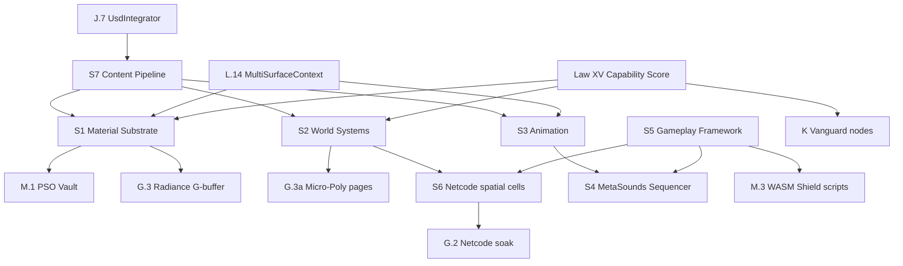
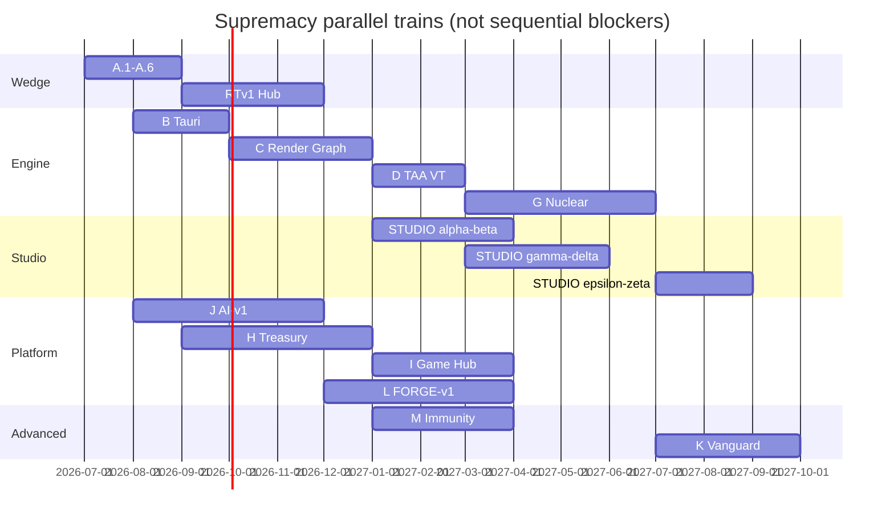

# Aethel Engine — Studio Supremacy Index (Master Plan Map)

**Version:** 1.5 (Chief Architect — **hygiene sync**: Focus order + doctrine registry #55–#64 + **#66**)  
**Status:** **Binding** — canonical index of **all** supremacy specifications  
**Canonical:** [`AETHEL_SUPREMACY_ROADMAP.md`](AETHEL_SUPREMACY_ROADMAP.md) v4.7  
**Completeness certificate:** [`AETHEL_PLANNING_COMPLETENESS.md`](AETHEL_PLANNING_COMPLETENESS.md) v1.2  
**Executor map:** [`AETHEL_CLAUDE_EXECUTION_MASTER_MAP.md`](AETHEL_CLAUDE_EXECUTION_MASTER_MAP.md) v1.4  
**Live ledger:** [`AETHEL_FOCUS1_EXECUTION_PROGRESS.md`](AETHEL_FOCUS1_EXECUTION_PROGRESS.md)  
**Purpose:** Single navigation map — every competitor surface mapped to a **Studio Bible** or **Onda**. **Do not create new MDs** — annotate / deepen these.

---

## Document Authority (binding — anti-lost)

| Tier | Open | Role |
|------|------|------|
| **0** | `.aethelrules` · `.cursorrules` | Absolute bans + quality gates |
| **1a** | [`AETHEL_SUPREMACY_ROADMAP.md`](AETHEL_SUPREMACY_ROADMAP.md) | 16 Laws · Ondas · governance |
| **1b** | **This Index** | Navigate every binding spec |
| **1c** | [`AETHEL_CLAUDE_EXECUTION_MASTER_MAP.md`](AETHEL_CLAUDE_EXECUTION_MASTER_MAP.md) | **Task queue** (current round only) |
| **1d** | [`AETHEL_FOCUS1_EXECUTION_PROGRESS.md`](AETHEL_FOCUS1_EXECUTION_PROGRESS.md) | **Live DONE/OPEN** + shipped interfaces |
| **2** | One pillar / onda / billing spec named by the round | Detail on demand |
| **3** | Playbook · Completeness · critiques | Exit gates / certificates — not daily preload |
| **X** | `cloud-web-app/CLAUDE_MASTER_EXECUTION_PLAN_V7\|V8` + V24/V30/Ultimate/UX Monetization | **SUPERSEDED** — Master Map §2.4 |

**Forbidden:** inventing another “Session Radar / Handoff / Master Plan V9” file. Update Progress + Master Map + this Index instead.

---

## Execution order (binding — hygiene 2026-07-09 + Consolidation 2026-07-23)

**Focus 1** (AI brain + real files) → **Focus 2** (renderer + terrain) → **Block 6** (billing truth) → then Hub/G marketing.  
**Active override (2026-07-23 + 2026-08-08 sync + 2026-08-10 Top-1 Matrix):** **Consolidation Wave CW0–CW7** (Master Map §0c) before new exotic kernel letters or new Master-UX hero panels. Progress: CW2/CW5/CW7 **PARTIAL**; **CW1 DONE-core** (15-slot hero bench CLOSED; product PARTIAL); **CW3 DONE-core (2026-08-08)** — present-root + fail-closed marketing (UE RHI residual HELD); **CW4 DONE (2026-08-08)**; **CW6 DONE apply-path** (`COMPOSER_SURPASS_CLAIM=false` — not Cursor surpass). CW0 freeze **ACTIVE**. **P2b Anti-MOCK fully cleared** (BLOCKER/HIGH/MEDIUM = 0 OPEN). Onda J: J.7 USDZ **PARTIAL**, J.4 BYOK **PARTIAL**, J.9 auto-attach + cinematic previz (#63) **DONE-core** (final/G.8/Veo HELD), J.11/J.12 **STOPPED**. Onda L: L.1/L.2/L.5/L.7-core/L.10-green/L.12-soak landed; L.4/L.8/L.9/L.13 = **PARTIAL** (not GAP). Hub checkout **HELD** (H.1+ human cert). Onda G **deferred** (~15% scaffold — **Unreal 100% FALSE**; G.% uplift only via AAA Parity evidence gates). Onda N Quant: N1–N5/§23/Dual-Mode **PARTIAL**; `investmentGrade=false`. **Not ready to sell** as Universal IDE / AI-native / Hub checkout / Vanguard Quant / UE parity. Next: Progress §Remaining OPEN + Top-15 (R1 H.1+ → R4 L.8 E2B soak → …). **Top-1 matrix:** Progress §Top-1 Market Gap Matrix · Master Map §0c.  
[`AETHEL_MASTER_STUDIO_UX_UI_SPECIFICATION.md`](AETHEL_MASTER_STUDIO_UX_UI_SPECIFICATION.md) = **vision + acceptance matrix** (§0), not ship certificate.  
Doctrines **#55–#64** + **#66** bind. **Anti-Hype Anchor** (Swarm §0a) binds all Fusion marketing. **No new planning** unless a new competitor surface appears.  
**Theoretical documentation closed** (2026-07-09) — execution in progress.  
**Claude boot:** Progress ledger → Master Map current round (§0c if Consolidation active) → one spec. Billing-first only if live payment fire. Details: [`AETHEL_APEX_DOCTRINE_AND_EXECUTION_FOCUS.md`](AETHEL_APEX_DOCTRINE_AND_EXECUTION_FOCUS.md).

---

## How to read this index

| Layer | Role |
|-------|------|
| **16 Laws** | Non-negotiable mandates in Supremacy Roadmap |
| **Ondas A→M** | Sequenced delivery trains |
| **Studio Pillars S1→S7** | **Production-tool depth** — artist/animator/designer/technical artist parity vs UE5 |
| **Nuclear G.3** | Render confrontation (Micro-Poly, Radiance, Entropy) |
| **Vanguard K / Forge L / Immunity M** | Next-decade + IDE + runtime defects |
| Doctrines **#55–#64** + **#66** | Apex / MoA / Director / Foley / **Anti-Lazy** — **SPEC** until Focus/S3/S4 exit |

**Executor rule:** No PR touching a pillar domain without that pillar's **acceptance checklist** + **G/K/L/M/S-readiness**.

---

## Complete specification map

### Core governance

| Document | Version | Scope |
|----------|---------|-------|
| [`AETHEL_SUPREMACY_ROADMAP.md`](AETHEL_SUPREMACY_ROADMAP.md) | **4.7** | 16 Laws, Ondas A→M, Studio S1→S7, **Focus order one-liner** |
| [`AETHEL_SUPREMACY_EXECUTION_PLAYBOOK.md`](AETHEL_SUPREMACY_EXECUTION_PLAYBOOK.md) | 1.1 | GF-* fixtures (28), CI gates, PR decision tree |
| [`AETHEL_PLANNING_COMPLETENESS.md`](AETHEL_PLANNING_COMPLETENESS.md) | **1.2** | A.0 100% planning + hygiene registry |
| [`AETHEL_FULL_PLAN_CORPUS_CRITIQUE.md`](AETHEL_FULL_PLAN_CORPUS_CRITIQUE.md) | 1.0 | Cold critique — seams, blind spots, priority stack |
| [`AETHEL_ENGINE_SUPREMACY_CRITIQUE_AND_UI_DISCIPLINE.md`](AETHEL_ENGINE_SUPREMACY_CRITIQUE_AND_UI_DISCIPLINE.md) | 1.0 | **UE surpass honesty + UI non-pollution** |
| [`AETHEL_UX_AND_ROBUSTNESS_ALIGNMENT_MASTER.md`](AETHEL_UX_AND_ROBUSTNESS_ALIGNMENT_MASTER.md) | 1.0 | **Critiques × all plans × UX/RB gates** |
| [`AETHEL_TECHNICAL_DEPTH_AND_ROBUSTNESS_GAP.md`](AETHEL_TECHNICAL_DEPTH_AND_ROBUSTNESS_GAP.md) | 1.0 | **Plans × code audit — surpass Cursor/UE/Roblox/Stripe** |
| [`AETHEL_CLAUDE_EXECUTION_MASTER_MAP.md`](AETHEL_CLAUDE_EXECUTION_MASTER_MAP.md) | **1.4** | **Task queue** Focus 1→2 + Blocks 6/2/3/7 |
| [`AETHEL_FOCUS1_EXECUTION_PROGRESS.md`](AETHEL_FOCUS1_EXECUTION_PROGRESS.md) | live | DONE/OPEN ledger + interfaces (backend Focus/6A/2A–2B shipped) |
| [`AETHEL_APEX_DOCTRINE_AND_EXECUTION_FOCUS.md`](AETHEL_APEX_DOCTRINE_AND_EXECUTION_FOCUS.md) | 1.0 | Focus 1→2 · #56–#58 |
| [`AETHEL_PLANS_CANONICAL_REFERENCE.md`](AETHEL_PLANS_CANONICAL_REFERENCE.md) | 1.1 | **Single plan table + UX journeys J1–J7** |
| [`AETHEL_PAYG_AND_WALLET_SPEC.md`](AETHEL_PAYG_AND_WALLET_SPEC.md) | 1.1 | Overage / wallet / PAYG + spend caps + $ meters |
| [`AETHEL_MARGIN_CREATIVE_WALLET_TURNS_CALCULATOR.md`](AETHEL_MARGIN_CREATIVE_WALLET_TURNS_CALCULATOR.md) | 1.0 | Mix margin · Creative · wallet→turns |
| [`AETHEL_AI_PROVIDER_CAPABILITY_MATRIX.md`](AETHEL_AI_PROVIDER_CAPABILITY_MATRIX.md) | 1.0 | LLM Fusion + creative spine |
| [`AETHEL_UNIT_ECONOMICS_AND_SUBSCRIPTION_ALIGNMENT.md`](AETHEL_UNIT_ECONOMICS_AND_SUBSCRIPTION_ALIGNMENT.md) | 1.4 | COGS/REV bound to `plans.ts`, anti-loss |
| [`AETHEL_HARDWARE_SCALABILITY_SPEC.md`](AETHEL_HARDWARE_SCALABILITY_SPEC.md) | 1.3 | Law XV + subscription cloud quotas |
| [`aethel_architecture_philosophy.md`](aethel_architecture_philosophy.md) | — | Philosophical laws 1–5 (2030 = **do not execute**) |

### Render & runtime (vs UE Nanite/Lumen/Niagara + stutter/loading/crash)

| Document | Onda | UE counterpart |
|----------|------|----------------|
| [`AETHEL_AAA_PARITY_TARGETS.md`](AETHEL_AAA_PARITY_TARGETS.md) | G.3 | Nanite, Lumen, Niagara/Chaos |
| [`AETHEL_VANGUARD_TECHNOLOGIES_SPEC.md`](AETHEL_VANGUARD_TECHNOLOGIES_SPEC.md) | K | DLSS-class, 3DGS, WebXR |
| [`AETHEL_RUNTIME_IMMUNITY_SPEC.md`](AETHEL_RUNTIME_IMMUNITY_SPEC.md) | M | PSO stutter, DirectStorage, crash isolation |
| [`AETHEL_MATERIAL_SUBSTRATE_SPEC.md`](AETHEL_MATERIAL_SUBSTRATE_SPEC.md) | **S1** | Material Editor, Substrate |
| [`AETHEL_MATERIALX_INTEGRATION_SPEC.md`](AETHEL_MATERIALX_INTEGRATION_SPEC.md) | G/S1 | MaterialX `.mtlx` interchange (draft v1.0) |
| [`AETHEL_OPENVDB_INTEGRATION_SPEC.md`](AETHEL_OPENVDB_INTEGRATION_SPEC.md) | G/S2 | OpenVDB `.vdb` interchange (draft v1.0) |

### World & content (vs UE World Partition, PCG, Landscape, Fab)

| Document | Onda | UE counterpart |
|----------|------|----------------|
| [`AETHEL_WORLD_SYSTEMS_SPEC.md`](AETHEL_WORLD_SYSTEMS_SPEC.md) | **S2** | World Partition, PCG, Landscape, Foliage |
| [`AETHEL_CONTENT_PIPELINE_SPEC.md`](AETHEL_CONTENT_PIPELINE_SPEC.md) | **S7** | Interchange, Fab, Quixel, USD cook |

### Character, animation, audio, cinematics (vs UE Control Rig, Sequencer, MetaSounds)

| Document | Onda | UE counterpart |
|----------|------|----------------|
| [`AETHEL_ANIMATION_CINEMATICS_SPEC.md`](AETHEL_ANIMATION_CINEMATICS_SPEC.md) | **S3** | Control Rig, Sequencer — **#63 marketing needs S3.0+** |
| [`AETHEL_METASOUNDS_SPEC.md`](AETHEL_METASOUNDS_SPEC.md) | **S4** | MetaSounds — **#64 needs S4.0+ compiler** |
| [`AETHEL_CINEMATIC_DIRECTOR_DOCTRINE.md`](AETHEL_CINEMATIC_DIRECTOR_DOCTRINE.md) | J+G | **#63** Engine Film — SPEC until capture+Sequencer |
| [`AETHEL_AUDIO_LIBRARY_FIRST_DOCTRINE.md`](AETHEL_AUDIO_LIBRARY_FIRST_DOCTRINE.md) | S4+J | **#64** Foley library-first — SPEC until S4+search |

### Gameplay & multiplayer (vs UE GAS ecosystem, Iris, replication)

| Document | Onda | UE counterpart |
|----------|------|----------------|
| [`AETHEL_GAMEPLAY_FRAMEWORK_SPEC.md`](AETHEL_GAMEPLAY_FRAMEWORK_SPEC.md) | **S5** | GAS, Gameplay Tags, Mass Entity, State Tree |
| [`AETHEL_NETCODE_PRODUCTION_SPEC.md`](AETHEL_NETCODE_PRODUCTION_SPEC.md) | **S6** | Replication Graph, dedicated server, anti-cheat |

### AI, IDE, platform (vs Cursor, v0, Muse, Fab, Steam, Roblox)

| Document | Onda | Counterpart |
|----------|------|-------------|
| [`AETHEL_AI_FUSION_CREATIVE_SPEC.md`](AETHEL_AI_FUSION_CREATIVE_SPEC.md) | J | Muse, Runway, agent IDE |
| [`AETHEL_INTELLIGENT_ROUTING_AND_CONTEXT_COMPRESSION.md`](AETHEL_INTELLIGENT_ROUTING_AND_CONTEXT_COMPRESSION.md) | J+L | **v1.2** Apex Router · #55–#58 |
| [`AETHEL_APEX_DOCTRINE_AND_EXECUTION_FOCUS.md`](AETHEL_APEX_DOCTRINE_AND_EXECUTION_FOCUS.md) | Exec | Focus 1→2 · #56–#58 |
| [`AETHEL_APEX_FAST_SWARM_ORCHESTRATION.md`](AETHEL_APEX_FAST_SWARM_ORCHESTRATION.md) | J.1+L | **v1.3** Maestro+Adaptive MoA+Heal · **#59–#62** + **#66** |
| [`AETHEL_ANTI_LAZINESS_PROTOCOL.md`](AETHEL_ANTI_LAZINESS_PROTOCOL.md) | J+L | **#66** LazyInspector + chunk ≤300 · **APPROVED** |
| [`AETHEL_FUSION_ORCHESTRATION_CRITIQUE_AND_PLAN_ALIGNMENT.md`](AETHEL_FUSION_ORCHESTRATION_CRITIQUE_AND_PLAN_ALIGNMENT.md) | J | **#62 APPROVED** (v1.1) |
| [`AETHEL_AI_WORKLOAD_AND_BILLING_ALIGNMENT.md`](AETHEL_AI_WORKLOAD_AND_BILLING_ALIGNMENT.md) | J+6 | JobBudget · keep prices |
| [`AETHEL_FULL_PLAN_CORPUS_CRITIQUE.md`](AETHEL_FULL_PLAN_CORPUS_CRITIQUE.md) | Meta | Cold critique · priority stack |
| [`AETHEL_UNIVERSAL_IDE_FORGE_SPEC.md`](AETHEL_UNIVERSAL_IDE_FORGE_SPEC.md) | L | Cursor, v0, Devin |
| [`AETHEL_NETWORK_COMMERCE_LIVEOPS_SPEC.md`](AETHEL_NETWORK_COMMERCE_LIVEOPS_SPEC.md) | H | Epic Store, Roblox economy |
| [`AETHEL_GAME_HUB_PLATFORM_GROWTH_SPEC.md`](AETHEL_GAME_HUB_PLATFORM_GROWTH_SPEC.md) | I | Steam discovery, Roblox Hub |
| [`AETHEL_QUANTITATIVE_FINANCE_SPEC.md`](AETHEL_QUANTITATIVE_FINANCE_SPEC.md) | N | Wall Street HFT, Renaissance, Citadel |

---

## Studio Pillars S1→S7 (production-tool supremacy)

Parallel to Ondas — **do not delay Wedge**; **S.0 hooks** in A–D.

| Pillar | Bible | Primary waves | Ship gate |
|--------|-------|---------------|-----------|
| **S1** Material Substrate | Material spec | C→D | S1 acceptance |
| **S2** World Systems | World spec | A.1→C→D | S2 acceptance |
| **S3** Animation & Cinematics | Animation spec | E (+ D sequencer) | S3 acceptance · **#63 marketing** |
| **S4** MetaSounds | MetaSounds spec | E | S4 acceptance · **#64 marketing** |
| **S5** Gameplay Framework | Gameplay spec | C→G.2 | S5 acceptance |
| **S6** Netcode Production | Netcode spec | C hooks→G.2 | S6 acceptance |
| **S7** Content Pipeline | Content spec | A.2→VI→J.7 | S7 acceptance |

**Combined studio claim gate:** "Full production studio parity" marketing only after **S1–S7** acceptance suites + **G.3** nuclear on desktop enthusiast.

---

## Competitor supremacy matrix (planning target — honest)

| Competitor | Aethel surpass vector | Primary specs |
|------------|----------------------|---------------|
| **Unreal Engine 5** | WASM Shield + web publish + Capability Score + governed AI + no PSO stutter (M) | G.3, M, S1–S7 |
| **Unity 6** | Single stack web+desktop + Fusion IDE + entitlements (H) | L, J, H, XV |
| **Cursor / v0** | Multi-surface context + evidence + Cost Guard + game+web unified | L, J |
| **Devin** | Governed sandbox + validation gate + evidence ledger | L |
| **Steam / Epic Store** | Indie Hub + instant demo + cross-save (I) + Treasury (H) | I, H |
| **Roblox** | Create→publish→earn + web demo + honest netcode badges (UGC/WASM = later) | I, H, S6 |
| **Runway / Veo** | Engine cinema (#63 Director) + library Foley (#64) — not pixel-gen default | #63, #64, S3, S4 |

---

## S-readiness checklist (every Onda A–F PR)

- [ ] **G + K + L + M-readiness** (existing)
- [ ] Material graph changes register **PSO fingerprint** (S1, M.0)
- [ ] World/terrain/PCG changes use **partition cell schema** (S2)
- [ ] Animation/sequencer changes use **track schema** (S3)
- [ ] Audio graph changes target **MetaSounds compiler** path (S4)
- [ ] Gameplay changes use **tags/data asset IDs** (S5)
- [ ] Multiplayer hooks expose **replication intent** (S6)
- [ ] Asset import changes extend **cook manifest** (S7)

---

## Approved decisions (#59–66, v4.6)

| # | Decision |
|---|----------|
| 59 | **Studio Pillars S1→S7** — binding production-tool bibles; parallel to Ondas |
| 60 | **S1 Material Substrate** — material graph compiler mandatory; no hardcoded TSX materials in ship path |
| 61 | **S2 World Systems** — PCG + World Partition spec replaces one-line roadmap entries |
| 62 | **S3 Animation** — Sequencer + Control Rig parity class; MetaHuman = USD not capsule |
| 63 | **S4 MetaSounds** — graph compiler mandatory; play-log forbidden at ship |
| 64 | **S5 Gameplay Framework** — tags + data assets + Mass SoA at 10k entities |
| 65 | **S6 Netcode** — dedicated spec; G.2 table alone insufficient for marketing |
| 66 | **S7 Content Pipeline** — USD/Fab-class ingest extends Law VI + J.7 |

---

## Pillar dependency graph (binding integration)

No pillar ships in isolation. **Executor:** PR touching domain X must not break contracts of upstream pillars.

**Critical path for studio claim:** S7 → S1 → G.3 → S2 → S3 → S4 → S5 → S6 (parallel where possible after C foundation).

---

## STUDIO-v1 release train (detailed milestones)

Parallel to **A.1–A.6** and **B→D**; does **not** block Wedge #1 (DX + web publish + Hub + AI evidence).

| Milestone | Steps | Gate | Depends on |
|-----------|-------|------|------------|
| **STUDIO-α** | S1.0, S2.0, S5.0, S6.0, S7.0 | Schema hooks in C PRs | Onda C start |
| **STUDIO-β** | S1.1, S2.1, S7.1 | Viewport-visible material + terrain partition | A.1 terrain, C render graph |
| **STUDIO-γ** | S1.2, S2.2, S2.3, S3.0, S5.1–S5.2 | PCG non-empty + sequencer schema | D |
| **STUDIO-δ** | S3.1–S3.3, S4.0–S4.2, S5.3 | Animation + audio graph ship | E |
| **STUDIO-ε** | S1.3, S2.4, S3.4, S4.3, S5.4, S6.1–S6.3 | Full framework + netcode hardening | G.2 |
| **STUDIO-ζ** | S6.4–S6.5, S7.2–S7.4 | Soak + content marketplace validation | G + H |

**Marketing gates (binding):**

| Claim | Required milestones |
|-------|---------------------|
| "Material editor" | STUDIO-β + S1.1 acceptance |
| "Open world" | STUDIO-γ + S2.1 + Law XV tier proof |
| "MetaSounds" | STUDIO-δ + S4.0 acceptance |
| "Production multiplayer" | STUDIO-ε + S6.2 + G.2 |
| "Full studio parity" | STUDIO-ζ + G.3 enthusiast + S1–S7 all acceptance |

---

## Honest limitations register (global — do not market beyond)

| Limitation | Reason | Aethel stance vs UE5 |
|------------|--------|----------------------|
| **ML Deformer / full MetaHuman neural** | GPU + dataset + legal | USD facial rig S3.4; no neural deformer Day 1 |
| **Substrate 1:1 slab parity** | UE proprietary stack | S1 simplified slab model — functionally equivalent for artists |
| **Console TRC automation** | Cert labs + platform SDKs | G.4 manual checklist; no "certified console" until G.4 |
| **Hardware RT on web** | WebGL2/WebGPU limits | Law XV: SSGI + probes forever on web |
| **50 km² on web** | 4 GB heap + bandwidth | Honest 1–4 km² web; 50 km² desktop enthusiast only |
| **Iris 1:1 replication** | UE server stack years | S6 Iris-class **intent** — custom graph + GAS deltas |
| **Fab marketplace DCC** | Epic ecosystem lock-in | S7 + H: ingest + publish; not Epic Fab clone |
| **Chaos Destruction 1:1** | Entropy is Aethel answer | G.3d–e Entropy — not Chaos physics clone |
| **DirectStorage on macOS/Linux** | OS API | M.2 Win-first; GPU decompress fallback elsewhere |
| **Neural upscale on integrated GPU** | ONNX perf | K.1 disabled on integrated; FSR path Law XV |

**Surpass vectors (where Aethel wins honestly):**

1. **Web + desktop single stack** — Unity-class without split engine
2. **WASM script isolation (M.3)** — UE C++ crash class eliminated for gameplay scripts
3. **PSO tier bundles (M.1)** — documented JIT fallback vs UE silent stutter
4. **Capability Score (Law XV)** — honest downgrade vs UE "works on my 4090" demos
5. **Governed AI (Law XVI + L)** — evidence ledger + Cost Guard vs Muse black box
6. **Instant web publish + Hub (I)** — Steam discovery latency eliminated for demos
7. **Agent-first IDE (L)** — Cursor + v0 + game context unified

---

## Technology alignment matrix

| Technology | Spec owner | Web path | Desktop path | Competitor ref |
|------------|------------|----------|--------------|----------------|
| WGSL shaders | S1, C | WebGPU | wgpu | UE HLSL → SM6 |
| Bindless heaps | C, Law V | WebGPU limits | wgpu full | UE bindless |
| Meshlets | S7, G.3a | Reduced LOD | Full Nanite-class | Nanite |
| VT pages | S1, M.2 | Range Fetch | DS + GPU decode | UE VT |
| Web Audio DAG | S4 | Primary | Sidecar optional | MetaSounds |
| Rapier physics | S3, S5, S6 | WASM worker | Native Rust | Chaos |
| GAS | S5 | IPC to Rust | Native | UE GAS |
| USD | S7, J.7 | Cook cloud | Local + cloud | Interchange |
| ONNX | K | — | Sidecar | DLSS |
| Yjs CRDT | L, J | Primary collab | Sync | Perforce + Live |

---

## Risk register (planning — mitigate before ship)

| ID | Risk | Impact | Mitigation |
|----|------|--------|------------|
| R-S01 | Material compiler explosion (variant combinatorics) | PSO vault size, compile times | S1 variant mask cap; M.1 tier bundles |
| R-S02 | PCG empty output (Anti-Mock violation) | Trust / demos fail | S2.2 CI: min instance count; fail-closed cook |
| R-S03 | Sequencer scope creep | E slip | S3.0 schema first; defer ML Deformer |
| R-S04 | MetaSounds GC in hot path | Audio dropouts | S4: pre-allocated AudioParam; worker compile |
| R-S05 | GAS JSON creep in IPC | 60 Hz stall | S5: binary layout audit in CI |
| R-S06 | Netcode without determinism | Rollback impossible | S6 blocked until Decision #6 Rapier path green |
| R-S07 | USD material loss on import | Artist revolt | S7.1 golden fixtures; manual fallback graph |
| R-S08 | Studio pillars delay Wedge | Business failure | S.0 hooks only in A–F; STUDIO-v1 parallel |

---

## Supremacy scorecard (planning depth — **100% A.0**)

| Domain | UE5/competitor ref | **Plan depth** | Code today | Next action |
|--------|-------------------|----------------|------------|-------------|
| Render nuclear G.3 | UE5 Nanite/Lumen | **100%** | ~15% scaffold | **Deferred** (P2e); **no Unreal 100%**; G.% uplift **only** via Progress §**G.% Evidence Ladder** band gates (AAA Parity §G.%); CapScore `g3CodeDepthPercent=15` locked |
| Studio S1–S7 | UE5 editor tools | **100%** | ~5–20% | Deepen existing surfaces; no new hero panels (CW0) |
| AI / IDE J + L | Cursor/v0/Devin | **100%** | ~55–70% cores / **~35–45% market claim** | Cores real (P2b 0; L.10/L.12; L.4/L.8/L.13 PARTIAL). **Marketing forbidden** until L.8 soak + L.13 acceptance + (J.12 or Founder alt). `COMPOSER_SURPASS_CLAIM=false` |
| Platform H + I | Epic/Roblox/Steam | **100%** | ~40–50% ops (Instant Play+I.2 live); checkout **0%** | **H.0 DONE**; Instant Play + I.2 + Law XV + R18 SHIPPED; **H.1+ flip HELD** (human/legal cert) — blocks sell |
| Runtime M + Vanguard K | UE defects + DLSS/XR | **100%** | ~0% product | Post-platform / post-G |
| **Quant Finance Onda N** | Jane Street / retail HFT | **100% spec** (v2.10) | **~5–15% fail-closed cores** (N1–N5/§23/Dual-Mode PARTIAL; SF1–SF3 PARTIAL); SF5–SF7 / FIX / live broker **HELD**; `investmentGrade=false` | No finance marketing; SF5/SF6 before any live adapter; Progress §Onda N + Top-1 Matrix |
| Law XV Hardware | Tier gating | **100%** | partial | Bake gate wired on web-static Instant Play; Cap Score / FSR deepen remains |
| Execution ops | GF fixtures + CI | **100% spec** | partial live | Keep production vitest green (~654+); dual-stack Law XI |
| Migration / onboarding | UE5 artists | **100%** | N/A | Publish guide |

**Competitor gap (one-liner):** Cursor Composer / v0 HMR / UE AAA / Devin autonomy / institutional quant — **all HELD for marketing**. **Unreal 100% = FALSE.** Honest leads: CostGuard+L.5 apply, Instant Play+bake, RepoGraphRAG soak, fail-closed Anti-MOCK + Quant honesty. Full matrix: Progress §Top-1 Market Gap Matrix.

**Certificate:** [`AETHEL_PLANNING_COMPLETENESS.md`](AETHEL_PLANNING_COMPLETENESS.md) — **no further planning required** unless new competitor surface emerges.

**Implementation gap** is intentional next phase — not a planning deficiency.

---

## Execution playbook (operational layer)

**Binding companion:** [`AETHEL_SUPREMACY_EXECUTION_PLAYBOOK.md`](AETHEL_SUPREMACY_EXECUTION_PLAYBOOK.md)

| Playbook section | Use when |
|------------------|----------|
| Executor decision tree | Every PR review |
| Golden fixture catalog (GF-*) | Writing acceptance tests |
| Test pyramid L0–L5 | CI design |
| Wave integration matrix | Sequencing work |
| CI gate registry | Adding qa scripts |
| Agent evidence requirements | Fusion/Forge PRs |

---

## Golden fixtures quick reference

See playbook for full list. **Minimum before STUDIO-β:** GF-MAT-001, GF-WORLD-001, GF-USD-001.

---

## Onda A→M + Studio — unified timeline (planning)

**Note:** Gantt is **planning visualization** — Wedge does not wait for G or K.

---

## Spec version registry (hygiene 2026-07-09)

| Document | Version | Depth tier |
|----------|---------|------------|
| Studio Index | **1.5** | Master map + Focus order + doctrine registry |
| Planning Completeness | **1.2** | Certificate + full registry sync |
| Claude Execution Master Map | **1.4** | Focus 1→2 + blocks |
| Routing / Context | **1.2** | Apex |
| Apex Fast Swarm | **1.3** | Maestro + Adaptive MoA (#62) + Heal + #66 hook |
| Anti-Laziness Protocol | **1.0** | **#66 APPROVED** |
| Fusion critique | **1.1** | #62 APPROVED |
| Plans Canonical | **1.1** | Prices + journeys |
| PAYG / Wallet | **1.1** | Spend caps |
| Execution Playbook | **1.1** | GF-* (28) |
| S1–S7 pillars | **1.2** | Node catalogs |
| AAA / Forge / Immunity / Vanguard | **1.1** | Parallel waves |
| AI Fusion J | **1.2** | Per-step acceptance |
| Roadmap | **4.7** | Governance + Focus one-liner |
| Director #63 / Audio #64 / Full Critique | **1.0** | SPEC until exit gates |

**Note:** Studio pillar decision IDs (#59–#66 in this Index §) are **pillar governance** — distinct from Fusion doctrine IDs (**#55–#64**, **#66** Anti-Lazy in AI Fusion / Swarm docs). Do not conflate.

---

## Historical / reference / SUPERSEDED (do not execute from these)

| Document | Status |
|----------|--------|
| [`CLAUDE_MASTER_BRIEF.md`](CLAUDE_MASTER_BRIEF.md) · [`CLAUDE_MEGA_WAVES.md`](CLAUDE_MEGA_WAVES.md) | Catalog / wave narrative — **Master Map overrides** order |
| [`master_mission_briefing.md`](master_mission_briefing.md) · [`walkthrough.md`](walkthrough.md) | Mission / narrative |
| [`AUDITORIA_V33_CRITICA_DOS_3_MDS.md`](AUDITORIA_V33_CRITICA_DOS_3_MDS.md) · audits / UX critiques | Historical reconciliation |
| [`AI_CRITIQUE_DEBT_REGISTRY.md`](AI_CRITIQUE_DEBT_REGISTRY.md) · [`FUTURE_IMPROVEMENTS_REGISTRY.md`](FUTURE_IMPROVEMENTS_REGISTRY.md) | Ticket registries — close via Master Map blocks |
| [`aethel_vision_2030.md`](aethel_vision_2030.md) | **DO NOT EXECUTE** |
| `cloud-web-app/CLAUDE_MASTER_EXECUTION_PLAN_V7.md` | **SUPERSEDED** |
| `cloud-web-app/CLAUDE_MASTER_EXECUTION_PLAN_V8.md` | **SUPERSEDED** |
| `cloud-web-app/CLAUDE_CRITICAL_ALIGNMENT_V24.md` | **SUPERSEDED** |
| `cloud-web-app/CLAUDE_ULTIMATE_QA_CRITIQUE_V30` | **SUPERSEDED** |
| `cloud-web-app/CLAUDE_MASTER_ULTIMATE_ARCHITECTURE_SPEC` | **SUPERSEDED** |
| `cloud-web-app/CLAUDE_AETHEL_UX_MONETIZATION_ALIGNMENT` | **SUPERSEDED** |
| ~~`AETHEL_CLAUDE_SESSION_RADAR.md`~~ · ~~`AETHEL_CLAUDE_HANDOFF_FOCUS.md`~~ | **Deleted** — folded into Focus Progress + Master Map §0 |

**Changelog:** 2026-08-10 g3-evidence-ladder — Progress §**G.% Evidence Ladder** (15→30→50→80→100; Critic fail-closed); harsh engine substrate critique; CapScore `g3CodeDepthPercent=15` lock; scorecard G.3 stays ~15% scaffold. 2026-08-10 top1-market-gap — Progress §**Top-1 Market Gap Matrix** (Engine/IDE/Hub/Quant/AI); reject Unreal 100%; AAA Parity §G.% evidence gates; Master Map §0c + Index scorecard synced (Quant ~5–15% fail-closed cores, not 0% / not investment-grade). 2026-08-10 engine-finance-substrate — Scorecard row **Quant Finance Onda N** (spec 100%; SF1–SF2 PARTIAL); Progress §Engine+Finance shared substrate S1–S8. 2026-08-08 docs-honesty-gap — Scorecard split AI/IDE “cores vs market claim”; Platform ops uplift for Instant Play+I.2 vs checkout 0%; competitor one-liner; CW6 `COMPOSER_SURPASS_CLAIM=false`; **not ready to sell** Universal IDE/AI-native. Next = Progress Top-15 (R1→R4→…). 2026-08-08 rtv1-c-h1-audit — H.1+ Treasury audit probe SHIPPED (`evaluateTreasuryAudit` + certificate authority; prod ignores FORCE/`?checkout=1`; flip still HELD until mint/Backpack/human cert). Next OPEN R4 L.8 E2B HMR. 2026-08-08 cw1-hero-bench — CW1 15-slot hero bench DONE-core (`master-ux-hero-panel-bench.ts`; real surfaces only; not 15/15 ship; R12→CW5 Storybook/Figma). 2026-08-08 timeline-event-cue-bus — Timeline event lane PARTIAL editor bus (`subscribeTimelineEventCues` edge-trigger; demo silent; GAS/gameplay bind OPEN). 2026-08-08 timeline-material-color — Timeline material scrub UNHELD via `ISceneService.setColor` → live R3F `object.color`; event was HELD (since PARTIAL bus). 2026-08-08 timeline-channel-move — Timeline keyframe drag-move + visibility.opacity channel; material/event were HELD pending setColor (material since UNHELD); Remaining OPEN pruned (R2/R3/R5/R18 closed).  2026-08-08 rtv1-law-xv-bake — Law XV bake Instant Play DONE (receipt+lightmap fail-closed; Progress OPEN #2). 2026-08-08 docs-authority-sync — **Progress/Master Map/Index honesty sync:** P2b Anti-MOCK fully cleared; scorecard J+L ~45–65% (L PARTIAL not GAP); Platform H.0 DONE → next H.1+; Instant Play+I.2 ops shipped; Onda G deferred; Remaining OPEN table in Progress. 2026-08-08 p2-synth — **P2 synthesizer audit** (Progress §P2c–P2e): git anchor `bc8dd1627`; working-tree desktop `rendering/*` + J.11/J.12/L scaffolds **uncommitted**; 90-day order J→L→RTv1→G→M; AAA jumps explicit ADIADOS (P2e). Master Map §0c synced (CW6 DONE apply-path; L.1 DONE `2ff277306`). 2026-07-19ip — **XPBD + fixed-substep PBD deepen CLOSED (ip)** (compliance/Δλ + h=dt/n_substeps; N_cons=144; residual↓ with iters; pin stable; same-seed bit-identical; `positionBasedDynamicsXpbdReady` distinct from hj; Chaos/cloth AAA HELD; `CARGO_TARGET_DIR=E:\aethel-target-gnu-ip`). Domain 4 still **WAIT**. 2026-07-19io — **SPH spatial-hash deepen Critic REWORK CLOSED (io)** (N=1331 11³ lattice spacing≈h domain≥8h; avg C_step<N²/8; max_neighbors≤min(128,N/8); `matterThermodynamicsSphHashReady` gated; wire soak merges hash; DualSPH/Chaos AAA HELD; `cargo test --lib` **721**). Domain 4 still **WAIT**. 2026-07-19in — **Binary-seed/WGSL-noise/sparse-instance distinct evidence fingerprints CLOSED (in)** (fk/gh/fd measured `distinct_from_*` + `evidence_kind`/`evidence_fingerprint` + trio cross-check `fixed_chunk_crc32_ooo_delta_reassemble` ≠ `seeded_value_gradient_simplex_uv_fbm` ≠ `seeded_aabb_density_instance_place`; **38** literals; wires forward evidence; soak gates ready; AAA HELD; `cargo test --lib` **719**). Domain 4 still **WAIT**. 2026-07-19in — **Critic Domain physics audit** (soak-lite catalog ≠ Unreal-depth; gy FLIP Progress demoted; letter remap hygiene OK; wedge does not consume kernels; ~302 `distinct_from_*: true` remain after fingerprint trio; next ships = SPH hash / XPBD / FLIP pressure / WorldSoA couple — not neural grind). 2026-07-19im — **Spine/fluid-ninja/caustics distinct evidence fingerprints CLOSED (im)** (gl/gg/gj measured `distinct_from_*` + `evidence_kind`/`evidence_fingerprint` + trio cross-check `soa_spine_dust_wind_drag_cull` ≠ `semi_lagrangian_jacobi_div_free` ≠ `cauchy_snell_rgb_caustic_focus`; **42** literals; wires forward evidence; soak gates ready; AAA HELD; `cargo test --lib` **718**). Domain 4 still **WAIT**. 2026-07-19il — **CRDT/godrays/streaming-cache distinct evidence fingerprints CLOSED (il)** (fg/gb/fp measured `distinct_from_*` + `evidence_kind`/`evidence_fingerprint` + trio cross-check `lww_gcounter_orset_concurrent_converge` ≠ `beer_lambert_single_scatter_godray` ≠ `l2_fill_l1_promote_demote_hit`; **42** literals; wires forward evidence; soak gates ready; AAA HELD; `cargo test --lib` **717**). Domain 4 still **WAIT**. 2026-07-19ik — **Delta-seed/metabolic/DSL distinct evidence fingerprints CLOSED (ik)** (fh/fq/gc measured `distinct_from_*` + `evidence_kind`/`evidence_fingerprint` + trio cross-check `base_seed_ordered_delta_peer_converge` ≠ `cold_page_reclaim_budget_pressure` ≠ `force_integrate_distance_dsl_program`; **48** literals; wires forward evidence; soak gates ready; AAA HELD; `cargo test --lib` **716**). Domain 4 still **WAIT**. 2026-07-19ij — **Contextual/pressure/entropy distinct evidence fingerprints CLOSED (ij)** (ey/fa/ez measured `distinct_from_*` + `evidence_kind`/`evidence_fingerprint` + trio cross-check `aabb_sphere_gravity_timescale_damping` ≠ `ideal_gas_piston_compress_heat_expand` ≠ `soa_velocity_stress_entropy_erosion`; **50** literals; wires forward evidence; soak gates ready; AAA HELD; `cargo test --lib` **715**). Domain 4 still **WAIT**. 2026-07-19ii — **Bitstream/state-sync/baremetal distinct evidence fingerprints CLOSED (ii)** (fj/fi/dl measured `distinct_from_*` + `evidence_kind`/`evidence_fingerprint` + trio cross-check `bit_writer_sync_field_frame_roundtrip` ≠ `snapshot_delta_ack_peer_catchup` ≠ `entity_slot_bump_oom_flush_rewind`; **56** literals; wires forward evidence; soak gates ready; AAA HELD; `cargo test --lib` **712**). Domain 4 still **WAIT**. 2026-07-19ih — **Field/slab/ghost distinct evidence fingerprints CLOSED (ih)** (dq/dm/fr measured `distinct_from_*` + `evidence_kind`/`evidence_fingerprint` + trio cross-check `soa_pressure_radiation_collapse_diffuse` ≠ `mmap_free_list_slot_alloc_reuse` ≠ `ghost_predict_vs_integrate_velocity`; **60** literals; wires forward evidence; soak gates ready; AAA HELD; `cargo test --lib` **711**). Domain 4 still **WAIT**. 2026-07-19ig — **Desktop/fractal/entropy distinct evidence fingerprints CLOSED (ig)** (de·df·dg·dk/ds/dr measured `distinct_from_*` + `evidence_kind`/`evidence_fingerprint` + trio cross-check `world_soa_tick_optional_lbm_mass` ≠ `hdr_nits_dust_beer_lambert_balance` ≠ `soa_force_stress_young_tear_timescale`; **72** literals; wires forward evidence; soak gates ready; AAA HELD; `cargo test --lib` **710**). Domain 4 still **WAIT**. 2026-07-19if — **Mnemonic/shadow/curved distinct evidence fingerprints CLOSED (if)** (dw/du/dt measured `distinct_from_*` + `evidence_kind`/`evidence_fingerprint` + trio cross-check `soa_offscreen_coherence_exponential_decay` ≠ `volume_history_ring_negative_delta_rewind` ≠ `schwarzschild_weak_field_light_deflection`; **86** literals; wires forward evidence; soak gates ready; AAA HELD; `cargo test --lib` **708**). Domain 4 still **WAIT**. 2026-07-19ie — **Micro-displace/conflict/synesthetic distinct evidence fingerprints CLOSED (ie)** (ev/hm/dx measured `distinct_from_*` + `evidence_kind`/`evidence_fingerprint` + trio cross-check `multi_octave_value_noise_sdf_displace` ≠ `stress_threshold_soa_vortex_inject` ≠ `density_cross_modal_acoustic_radiation_tremor`; **111** literals; wires forward evidence; soak gates ready; AAA HELD; `cargo test --lib` **707**). Domain 4 still **WAIT**. 2026-07-19id — **Volumetric/SDF-audio/hybrid-PBD distinct evidence fingerprints CLOSED (id)** (ew/ex/gy measured `distinct_from_*` + `evidence_kind`/`evidence_fingerprint` + trio cross-check `path_density_beer_lambert_integral` ≠ `sdf_listener_source_occlusion_march` ≠ `eulerian_lagrangian_grid_pbd_couple`; **128** literals; wires forward evidence; soak gates ready; AAA HELD). Domain 4 still **WAIT**. 2026-07-19ic — **FEA/LBM/NS distinct evidence fingerprints CLOSED (ic)** (eh/gw/gv measured `distinct_from_*` + `evidence_kind`/`evidence_fingerprint` + trio cross-check `bar_truss_global_stiffness_solve` ≠ `fluid_dust_bounceback` ≠ `stable_fluids_diffuse_advect_project`; LBM remote peers beyond fluid↔gas; **147** literals; wires forward evidence; soak gates ready; AAA HELD). Domain 4 still **WAIT**. 2026-07-19ib — **Voxel/SVO remote-peer distinct evidence CLOSED (ib)** (es/et/eu remaining remote `distinct_from_*: true` measured via `evidence_kind`/`evidence_fingerprint` after **hv** trio peers; `hybrid_svo_insert_query` ≠ `distance_screen_depth_lod` ≠ `layered_interior_meat`; **228** literals; wires forward evidence; soak gates ready; AAA HELD). Domain 4 still **WAIT**. 2026-07-19ia — **Acoustic/FM distinct evidence fingerprints CLOSED (ia)** (ej/ei/ef measured `distinct_from_*` + `evidence_kind`/`evidence_fingerprint` + trio cross-check `fm_additive_collision_pcm_bank` ≠ `room_rt60_sabine_eyring_geometry` ≠ `image_source_delay_gain_tap`; **83** fields; wires forward evidence; soak gates ready; AAA HELD). Domain 4 still **WAIT**. 2026-07-19hz — **PBD/damping/SPH distinct evidence fingerprints CLOSED (hz)** (hj/hl/hk measured `distinct_from_*` + `evidence_kind`/`evidence_fingerprint` + trio+LBM cross-check `soa_distance_constraint_projection` ≠ `medium_viscosity_acoustic_damping` ≠ `soa_sph_density_pressure_thermal`; **62** fields; eo/en/dv wires forward evidence; soak gates ready; AAA HELD). Domain 4 still **WAIT**. 2026-07-19hx — **Hermite/SDF-sculptor distinct evidence fingerprints CLOSED (hx)** (el/ek/em measured `distinct_from_*` + `evidence_kind`/`evidence_fingerprint` + trio cross-check `hermite_crease_dihedral_snap` ≠ `hermite_qef_dual_contour` ≠ `dense_sdf_softmin_brush`; **93** fields; soak gates ready; AAA HELD). Domain 4 still **WAIT**. 2026-07-19hw — **Velocity/SDF-MV/octree distinct evidence fingerprints CLOSED (hw)** (er/eq/ep measured `distinct_from_*` + fingerprints + trio cross-check; soak gates ready; AAA HELD). Domain 4 still **WAIT**. 2026-07-19hv — **Voxel/SVO distinct evidence fingerprints CLOSED (hv)** (eu/et/es measured peer `distinct_from_*` + `evidence_kind`/`evidence_fingerprint` + trio cross-check; soak gates ready; AAA HELD). Domain 4 still **WAIT**. 2026-07-19hu — **Critic Top-5 quality uplift CLOSED (hu)** (PBD precolored hot solve; LBM fluid↔gas fingerprints; NS/SPH/hybrid conservation ε; C-band demote conflict/fractal/theory; probe soak audit). Domain 4 still **WAIT**. 2026-07-19 — **Domains 1–3 letter remap YES** (Domain physics **gv–gy + hj–hm + ho–ht** CLOSED; neural **ha–hg/hn** untouched; **hn** reserved → theory **ht**; contaminated Domain ha–hg retired). 2026-07-19 — **Domains 1–3 audit PARTIAL** (superseded by remap; was: gv–gy OK; gz/hh/hi OPEN; ha–hg collide). 2026-07-19gv — **Aerodynamic Navier–Stokes real CLOSED** (aerodynamic_navier_stokes SoA zero-alloc loop; soak-gated aerodynamicNavierStokesReady; full_cfd_parity_ready false HELD). 2026-07-17cx+ — Founder hybrid Claude routing = existing Apex `ui-sonnet`/`kernel-reasoning` (cx; slugs `anthropic/claude-sonnet-4` / `anthropic/claude-opus-4`; J.11/J.12 HELD). 2026-07-17gt — **Gaze-foveated reprojection real CLOSED** (gaze_foveated_reprojection eccentricity quality map + temporal reprojection-lite; fovea>periph + gaze shift + motion blend soak; studio-local kernel_gaze_foveated_reprojection_wire IPC; soak-gated gazeFoveatedReprojectionReady; vr_foveated_aaa_ready/dlss_ready false HELD). 2026-07-17gp+ — Founder intent-compiler reconfirm soak-green (Physical Intent→WGSL string; GPU submit HELD). 2026-07-17gs — **Strain-aware texturing real CLOSED** (strain_aware_texturing curvature + UV-jacobian stretch → albedo whitening; higher strain→whiter/brighter + stretch increases whitening + same-seed + values≥0 soak; studio-local kernel_strain_aware_texturing_wire IPC; soak-gated strainAwareTexturingReady distinct from gq usdImporterBridgeReady + gp mslWgslCompilerReady + go spectralLightPipelineReady + gn alexaCinematicOpticsReady + gm 
adianceCascadesGiReady + gr hdr32bitFloatPipelineReady + prior; cloth_skin_strain_aaa_ready false HELD; kernel tests **688** green E:; studio cargo check --lib green). 2026-07-17gr — **HDR 32-bit float pipeline real CLOSED** (hdr_32bit_float_pipeline linear scene-referred RGB → exposure/nits → Kelvin WB lite → f32 handoff; finite + higher exposure→higher lum + same-seed soak; studio-local `kernel_hdr_32bit_float_pipeline_wire` IPC; soak-gated `hdr32bitFloatPipelineReady` distinct from gf `acesCinematicTonemapperReady` + go `spectralLightPipelineReady` + prior; pairs with gf ACES not full ACES 1.3; `full_hdr10_ready` / `dolby_vision_ready` / `ue_hdr_aaa_ready` false HELD; kernel tests **688** green E:; studio `cargo check --lib` green). 2026-07-17gq — **USD importer bridge real CLOSED** (usd_importer_bridge ASCII USDA lite `#usda` + `def Xform` + `float3` → scene nodes; fixture N nodes/transforms + same-bytes fingerprint + invalid fail-closed soak; studio-local `kernel_usd_importer_bridge_wire` IPC; soak-gated `usdImporterBridgeReady` distinct from go `spectralLightPipelineReady` + gn `alexaCinematicOpticsReady` + gm `radianceCascadesGiReady` + gl `atmosphericSpineParticlesReady` + gp `mslWgslCompilerReady` + prior; `open_usd_aaa_ready` / `pixar_hydra_aaa_ready` false HELD; kernel tests **677** green E:; studio `cargo check --lib` green). 2026-07-17gp — **MSL→WGSL compiler real CLOSED** (msl_wgsl_compiler tiny IR/AST → real WGSL string emit; same IR→same WGSL + invalid IR fail-closed + `@fragment`/`fn main` soak; studio-local `kernel_msl_wgsl_compiler_wire` IPC; soak-gated `mslWgslCompilerReady` distinct from gh `wgslSurfaceNoiseKernelReady` + gf `acesCinematicTonemapperReady` + go `spectralLightPipelineReady` + gn `alexaCinematicOpticsReady` + prior; `full_metal_spirv_compiler_aaa_ready` false HELD; kernel tests **677** green E:; studio `cargo check --lib` green). 2026-07-17go — **Spectral light pipeline real CLOSED** (spectral_light_pipeline 32-band SPD×reflectance → CIE XYZ → linear sRGB + Beer–Lambert flesh; red R>B + blue B>R + absorption darkens + thicker flesh lowers T + same-seed + no NaN soak; studio-local `kernel_spectral_light_pipeline_wire` IPC; soak-gated `spectralLightPipelineReady` distinct from gj `spectralDispersionCausticsReady` + gd `chromaticGlassRefractionReady` + ge `preintegratedSssTransmittanceReady` + gm `radianceCascadesGiReady` + gf `acesCinematicTonemapperReady` + prior; `spectral_path_tracer_aaa_ready` false HELD; kernel tests **667** green E:; studio `cargo check --lib` green). 2026-07-17gn — **Alexa cinematic optics real CLOSED** (alexa_cinematic_optics CMOS-lite ISO gain + anamorphic UV + halation + film grain + Bayer RGGB demosaic; higher ISO→more grain + anamorphic≠spherical + spectrum used + same-seed + no NaN soak; studio-local `kernel_alexa_cinematic_optics_wire` IPC; soak-gated `alexaCinematicOpticsReady` distinct from gf `acesCinematicTonemapperReady` + gm `radianceCascadesGiReady` + gl `atmosphericSpineParticlesReady` + gk `hybridClusterShadingVsvmReady` + prior; `arri_alexa_aaa_ready` / `panavision_aaa_ready` false HELD; kernel module tests **10** green E:; studio `cargo check --lib` green). 2026-07-17gm — **Radiance Cascades GI real CLOSED** (radiance_cascades_gi multi-res probe cascades 8/4/2 + angular bins + coarse->fine bilinear merge; lit>dark + merge=0/monotonic + same-seed soak; studio-local `kernel_radiance_cascades_gi_wire` IPC; soak-gated `radianceCascadesGiReady` distinct from ga `voxelConeRadiosityReady` + gk `hybridClusterShadingVsvmReady` + neural GI stubs + prior; `lumen_radiance_cascades_aaa_ready` false HELD; kernel tests **653** green E:; studio `cargo check --lib` green). 2026-07-17gl — **Atmospheric spine particles real CLOSED** (atmospheric_spine_particles SoA spine wind+gravity+density drag + lifetime cull; positions change vs t0 + dead culled + same-seed + no NaN soak; studio-local `kernel_atmospheric_spine_particles_wire` IPC; soak-gated `atmosphericSpineParticlesReady` distinct from gk `hybridClusterShadingVsvmReady` + gj `spectralDispersionCausticsReady` + gg `fluidNinjaComputeReady` + gf `acesCinematicTonemapperReady` + ge `preintegratedSssTransmittanceReady` + gd `chromaticGlassRefractionReady` + prior; `niagara_cascade_aaa_ready` / `ue_cascade_aaa_ready` false HELD; kernel tests **653** green E:; studio `cargo check --lib` green). 2026-07-17gk — **Hybrid Cluster Shading VSVM real CLOSED** (hybrid_cluster_shading_vsvm tile×depth cluster partition + point-light sphere→AABB assign + Lambert/Blinn fixture; lit>unlit + non-empty lists + localization + same-seed + no NaN soak; studio-local `kernel_hybrid_cluster_shading_vsvm_wire` IPC; soak-gated `hybridClusterShadingVsvmReady` distinct from gg `fluidNinjaComputeReady` + gf `acesCinematicTonemapperReady` + ge `preintegratedSssTransmittanceReady` + gd `chromaticGlassRefractionReady` + prior; `full_forward_plus_ready` / `ue_clustered_deferred_aaa_ready` false HELD; kernel tests **637** green E:; studio `cargo check --lib` green). 2026-07-17gj — **Spectral dispersion caustics real CLOSED** (spectral_dispersion_caustics wavelength-split Snell + Cauchy η(λ) lens → 24×24 caustic grid; hotspot>unfocused + chromatic spread>mono + same-seed + ≥0/no NaN soak; studio-local `kernel_spectral_dispersion_caustics_wire` IPC; soak-gated `spectralDispersionCausticsReady` distinct from gi `infiniteAntiAliasingReady` + gh `wgslSurfaceNoiseKernelReady` + gg `fluidNinjaComputeReady` + gf `acesCinematicTonemapperReady` + ge `preintegratedSssTransmittanceReady` + gd `chromaticGlassRefractionReady` + prior; `spectral_path_tracer_aaa_ready` false HELD; kernel module tests **9** green E:; studio `cargo check --lib` green). 2026-07-17gf — **ACES cinematic tonemapper real CLOSED** (aces_cinematic_tonemapper Stephen Hill ACES-fitted HDR→LDR input/RRT-ODT/output; high-lum compress∈[0,1] + mid-grey stable + same input→same output + no NaN soak; studio-local `kernel_aces_cinematic_tonemapper_wire` IPC; soak-gated `acesCinematicTonemapperReady` distinct from ge `preintegratedSssTransmittanceReady` + gd `chromaticGlassRefractionReady` + gc `dynamicPhysicsDslReady` + prior; `full_aces_13_studio_ready` / `ue_aces_aaa_ready` false HELD; kernel tests **602** green E:; studio `cargo check --lib` green). 2026-07-17gg — **Fluid Ninja compute real CLOSED** (fluid_ninja_compute semi-Lagrangian advect + Jacobi pressure project + SDF solids; div↓ + density mass conserved + same-seed field + no NaN soak; studio-local `kernel_fluid_ninja_compute_wire` IPC; soak-gated `fluidNinjaComputeReady` distinct from ge `preintegratedSssTransmittanceReady` + gd `chromaticGlassRefractionReady` + ed `aerodynamicNavierStokesReady` + ee `latticeBoltzmannFluidSolverReady` + gf `acesCinematicTonemapperReady` + prior; `fluid_ninja_aaa_ready` / `niagara_fluid_aaa_ready` false HELD; kernel tests **602** green E:; studio `cargo check --lib` green). 2026-07-17ge — **Preintegrated SSS transmittance real CLOSED** (preintegrated_sss_transmittance wrap×Gaussian-sum T(thickness,N·L); thicker→lower T + same-seed RGB + values≥0 soak; studio-local `kernel_preintegrated_sss_transmittance_wire` IPC; soak-gated `preintegratedSssTransmittanceReady` distinct from gd `chromaticGlassRefractionReady` + gc `dynamicPhysicsDslReady` + gb `atmosphericScatteringGodraysReady` + prior; `full_skin_sss_aaa_ready` / `ue_subsurface_profile_aaa_ready` false HELD; kernel tests **581** green E:; studio `cargo check --lib` green). 2026-07-17gd — **Chromatic glass refraction real CLOSED** (chromatic_glass_refraction Snell refract + Cauchy η(λ) RGB; RGB diverge vs mono + same-seed unit dirs + TIR→reflect soak; studio-local `kernel_chromatic_glass_refraction_wire` IPC; soak-gated `chromaticGlassRefractionReady` distinct from gc `dynamicPhysicsDslReady` + gb `atmosphericScatteringGodraysReady` + ga `voxelConeRadiosityReady` + prior; `spectral_path_tracer_aaa_ready` / `ue_glass_aaa_ready` false HELD; kernel tests **571** green E:; studio `cargo check --lib` green). 2026-07-17gc — **Dynamic physics DSL real CLOSED** (dynamic_physics_dsl apply_force/impulse/set_mass/set_velocity/integrate/distance lite + SoA eval; force→Δv vs no-op + same-program + invalid fail-closed + distance project soak; studio-local `kernel_dynamic_physics_dsl_wire` IPC; soak-gated `dynamicPhysicsDslReady` distinct from gb `atmosphericScatteringGodraysReady` + ga `voxelConeRadiosityReady` + fz `symmetricVectorAlgebraReady` + fy `recursiveFractalEnhancementReady` + fx `blueNoiseDitheringReady` + fw `quantumOverlapReady` + ey `contextualPhysicsOverrideReady` + prior; `chaos_mass_physics_dsl_aaa_ready` false HELD; kernel tests **561** green E:; studio `cargo check --lib` green). 2026-07-17gb — **Atmospheric scattering godrays real CLOSED** (atmospheric_scattering_godrays Beer–Lambert τ/T + single-scatter godray; denser/longer→lower T + occluder < clear + same-seed + [0,1] soak; studio-local `kernel_atmospheric_scattering_godrays_wire` IPC; soak-gated `atmosphericScatteringGodraysReady` distinct from ga `voxelConeRadiosityReady` + fz `symmetricVectorAlgebraReady` + fy `recursiveFractalEnhancementReady` + fx `blueNoiseDitheringReady` + fw `quantumOverlapReady` + ew `volumetricExtinctionMediumReady` + prior; `volumetric_fog_aaa_ready` / `ue_sky_atmosphere_ready` false HELD; kernel tests **548** green E:; studio `cargo check --lib` green). 2026-07-17ga — **Voxel cone radiosity real CLOSED** (voxel_cone_radiosity seeded radiance/occupancy grid + cone march; occluded < open + same-seed + energy≥0 soak; studio-local `kernel_voxel_cone_radiosity_wire` IPC; soak-gated `voxelConeRadiosityReady` distinct from fz `symmetricVectorAlgebraReady` + fy `recursiveFractalEnhancementReady` + fx `blueNoiseDitheringReady` + fw `quantumOverlapReady` + prior; `lumen_vxgi_aaa_ready` false HELD; kernel tests **540** green E:; studio `cargo check --lib` green). 2026-07-17fz — **Symmetric vector algebra real CLOSED** (symmetric_vector_algebra mat4 mul/transpose/inverse + vec3/vec4 dot/cross; soak M*I=M + associativity + inv·M≈I + same-seed; studio-local `kernel_symmetric_vector_algebra_wire` IPC; soak-gated `symmetricVectorAlgebraReady` distinct from fy `recursiveFractalEnhancementReady` + fx `blueNoiseDitheringReady` + fw `quantumOverlapReady` + prior; `simd_avx512_math_aaa_ready` false HELD; kernel tests **533** green E:; studio `cargo check --lib` green). 2026-07-17fy — **Recursive fractal enhancement real CLOSED** (recursive_fractal_enhancement diamond-square lite midpoint displacement; same-seed + depth>0 variance/edge/filled soak; studio-local `kernel_recursive_fractal_enhancement_wire` IPC; soak-gated `recursiveFractalEnhancementReady` distinct from fx `blueNoiseDitheringReady` + fw `quantumOverlapReady` + ev `microDisplacementNoiseReady` + prior; `nanite_lumen_terrain_aaa_ready` false HELD; kernel tests **523** green E:; studio `cargo check --lib` green). 2026-07-17fx — **Blue noise dithering relaxer real CLOSED** (blue_noise_dithering_relaxer dart-throw + relax blue-noise point set; same-seed + min-dist > white soak; studio-local `kernel_blue_noise_dithering_wire` IPC; soak-gated `blueNoiseDitheringReady` distinct from fw `quantumOverlapReady` + eo `stochasticVirtualSdfReady` + prior; `ssao_taa_aaa_ready` false HELD; kernel tests **516** green E:; studio `cargo check --lib` green). 2026-07-17fw — **Quantum overlap real CLOSED** (quantum_overlap AABB–AABB + sphere–sphere SoA/pair overlap; intersect true / disjoint false soak; studio-local `kernel_quantum_overlap_wire` IPC; soak-gated `quantumOverlapReady` distinct from fv `formalLogicVerifierReady` + fu `genomicSeedTransmitterReady` + ft `genomicSeedLibraryReady` + fh `deltaSeedSynchronizationReady` + ey `contextualPhysicsOverrideReady` + prior; `broadphase_aaa_ready` false HELD; kernel tests **509** green E:; studio `cargo check --lib` green). 2026-07-17fv — **Formal logic verifier real CLOSED** (formal_logic_verifier MutEvent/SceneGraph propositional predicates no-NaN + scale bounds + seed non-zero; valid accept + invalid fail-closed soak; studio-local `kernel_formal_logic_verifier_wire` IPC; soak-gated `formalLogicVerifierReady` distinct from fu `genomicSeedTransmitterReady` + ft `genomicSeedLibraryReady` + fh `deltaSeedSynchronizationReady` + fb `geometricScaleConstraintsReady` + prior; `theorem_prover_aaa_ready` false HELD; kernel tests **502** green E:; studio `cargo check --lib` green). 2026-07-17fu — **Genomic seed transmitter real CLOSED** (genomic_seed_transmitter pack (id,seed,tag) → fk chunks → unpack → ft library insert; transmit→receive→insert + out-of-order + corrupt CRC fail-closed soak; studio-local `kernel_genomic_seed_transmitter_wire` IPC; soak-gated `genomicSeedTransmitterReady` distinct from ft `genomicSeedLibraryReady` + fk `binarySeedStreamerReady` + fh `deltaSeedSynchronizationReady` + prior; `network_dna_aaa_ready` false HELD; kernel tests **492** green E:; studio `cargo check --lib` green). 2026-07-17ft — **Genomic seed library real CLOSED** (genomic_seed_library GenomicSeedRegistry insert/lookup/hash by id; roundtrip + collision-free + miss fail-closed soak; studio-local `kernel_genomic_seed_library_wire` IPC; soak-gated `genomicSeedLibraryReady` distinct from fs `reversibleQuantumUndoReady` + fh `deltaSeedSynchronizationReady` + fd `sparseSeedInstancingReady` + prior; `asset_dna_aaa_ready` false HELD; kernel tests **483** green E:; studio `cargo check --lib` green). 2026-07-17fs — **Reversible quantum undo real CLOSED** (reversible_quantum_undo UndoStack WorldSoA snapshot + inverse MutEvent pack; apply→undo restore soak; studio-local `kernel_reversible_quantum_undo_wire` IPC; soak-gated `reversibleQuantumUndoReady` distinct from fr `ghostStatePredictorReady` + fh `deltaSeedSynchronizationReady` + du `shadowTimeReversalReady` + prior; `editor_undo_aaa_ready` false HELD; kernel tests **474** green E:; studio `cargo check --lib` green). 2026-07-17fr — **Ghost state predictor real CLOSED** (ghost_state_predictor WorldSoA dead-reckon p'=p+v·dt·timescale; predicted≈er integrate soak; studio-local `kernel_ghost_state_predictor_wire` IPC; soak-gated `ghostStatePredictorReady` distinct from er `velocityBufferEcsReady` + fq `metabolicMemoryReady` + fp `hierarchicalStreamingCacheReady` + fo `liveCacheManagerReady` + prior; `netcode_prediction_aaa_ready` false HELD; kernel tests **464** green E:; studio `cargo check --lib` green). 2026-07-17fq — **Metabolic memory real CLOSED** (metabolic_memory generational working-set arena alloc+tick age+reclaim cold under budget; reclaim frees capacity soak; studio-local `kernel_metabolic_memory_wire` IPC; soak-gated `metabolicMemoryReady` distinct from fp `hierarchicalStreamingCacheReady` + fo `liveCacheManagerReady` + fn `thermalSchedulerReady` + fm `asynchronousRealityThreadsReady` + fl `cpuAffinityMicroWorkersReady` + ff `atomicThreadSyncReady` + fe `lockfreeRingBufferReady` + prior; `os_vmm_aaa_ready` false HELD; kernel tests **455** green E:; studio `cargo check --lib` green). 2026-07-17fp — **Hierarchical streaming cache real CLOSED** (hierarchical_streaming_cache L1 hot fo LRU + L2 cold promote/demote; L2 fill + L1 hit-after-promote soak; studio-local `kernel_hierarchical_streaming_cache_wire` IPC; soak-gated `hierarchicalStreamingCacheReady` distinct from fo `liveCacheManagerReady` + fn `thermalSchedulerReady` + fm `asynchronousRealityThreadsReady` + fl `cpuAffinityMicroWorkersReady` + ff `atomicThreadSyncReady` + fe `lockfreeRingBufferReady` + prior; `vt_nanite_streaming_aaa_ready` false HELD; kernel tests **447** green E:; studio `cargo check --lib` green). 2026-07-17fo — **Live cache manager real CLOSED** (live_cache_manager fixed-cap LRU u64→bytes/u64 get/put/evict; capacity eviction + hit-after-put soak; studio-local `kernel_live_cache_manager_wire` IPC; soak-gated `liveCacheManagerReady` distinct from fn `thermalSchedulerReady` + fm `asynchronousRealityThreadsReady` + fl `cpuAffinityMicroWorkersReady` + ff `atomicThreadSyncReady` + fe `lockfreeRingBufferReady` + prior; `cdn_asset_cache_aaa_ready` false HELD; kernel tests **439** green E:; studio `cargo check --lib` green). 2026-07-17fn — **Thermal scheduler real CLOSED** (thermal_scheduler ThermalBudgetScheduler simulated °C / 0–100 score → tick job quota; cool vs hot soak proves hot fewer jobs; studio-local `kernel_thermal_scheduler_wire` IPC; soak-gated `thermalSchedulerReady` distinct from fm `asynchronousRealityThreadsReady` + fl `cpuAffinityMicroWorkersReady` + ff `atomicThreadSyncReady` + fe `lockfreeRingBufferReady` + prior; `hw_thermal_sensor_ready` false HELD; kernel tests **431** green E:; studio `cargo check --lib` green). 2026-07-17fm — **Asynchronous reality threads real CLOSED** (asynchronous_reality_threads AsyncRealityLanes std::thread physics+visual mpsc + ordered physics apply; reverse-enqueue 64-tick order + 32 visual completion soak; studio-local `kernel_asynchronous_reality_threads_wire` IPC; soak-gated `asynchronousRealityThreadsReady` distinct from fl `cpuAffinityMicroWorkersReady` + ff `atomicThreadSyncReady` + fe `lockfreeRingBufferReady` + prior; `async_runtime_aaa_ready` false HELD; kernel tests **423** green E:; studio `cargo check --lib` green). 2026-07-17fl — **CPU affinity micro-workers real CLOSED** (cpu_affinity_micro_workers MicroWorkerPool std::thread + Condvar job queue; 4×64 job sum soak; best-effort SetThreadAffinityMask; studio-local `kernel_cpu_affinity_micro_workers_wire` IPC; soak-gated `cpuAffinityMicroWorkersReady` distinct from ff `atomicThreadSyncReady` + fe `lockfreeRingBufferReady` + fk `binarySeedStreamerReady` + prior; `cpuAffinityPinReady` false HELD when unverified; `rayon_dots_aaa_ready` false HELD; kernel tests **417** green E:; studio `cargo check --lib` green). 2026-07-17fk — **Binary seed streamer real CLOSED** (binary_seed_streamer fixed-size chunked seed+payload seq/CRC + fh DeltaSeedLog compose; multi-chunk/out-of-order/CRC fail-closed soak; studio-local `kernel_binary_seed_streamer_wire` IPC; soak-gated `binarySeedStreamerReady` distinct from fj `bitstreamRealitySyncReady` + fi `stateSyncProtocolReady` + fh `deltaSeedSynchronizationReady` + prior; `quic_network_aaa_ready` false HELD; kernel tests **411** green E:; studio `cargo check --lib` green). 2026-07-17fj — **Bitstream reality sync real CLOSED** (bitstream_reality_sync LSB BitWriter/BitReader u32/f32 + sync-field pack + optional fi SyncFrame bit pack; field/unaligned/SyncFrame roundtrip + fail-closed soak; studio-local `kernel_bitstream_reality_sync_wire` IPC; soak-gated `bitstreamRealitySyncReady` distinct from fi `stateSyncProtocolReady` + fh `deltaSeedSynchronizationReady` + fg `crdtQuantumSyncReady` + ff `atomicThreadSyncReady` + fe `lockfreeRingBufferReady` + fd `sparseSeedInstancingReady` + fc `universalLogarithmicScaleReady` + fb `geometricScaleConstraintsReady` + fa `digitalPressureChamberReady` + prior; `netcode_compression_aaa_ready` false HELD; kernel tests **401** green E:; studio `cargo check --lib` green). 2026-07-17fi — **State sync protocol real CLOSED** (state_sync_protocol SyncFrame Snapshot/Delta/Ack + SyncAuthority/SyncPeer; snapshot hash + sequence + apply/ack; composes fh DeltaSeedLog; peer catch-up soak; studio-local `kernel_state_sync_protocol_wire` IPC; soak-gated `stateSyncProtocolReady` distinct from fh `deltaSeedSynchronizationReady` + fg `crdtQuantumSyncReady` + ff `atomicThreadSyncReady` + fe `lockfreeRingBufferReady` + fd `sparseSeedInstancingReady` + fc `universalLogarithmicScaleReady` + fb `geometricScaleConstraintsReady` + fa `digitalPressureChamberReady` + prior; `yjs_netcode_aaa_ready` false HELD; kernel tests **391** green E:; studio `cargo check --lib` green). 2026-07-17fh — **Delta seed synchronization real CLOSED** (delta_seed_synchronization base seed + ordered MutEvent deltas ADNA pack; SceneGraph replica apply; peer converge + pack roundtrip + incremental catch-up soak; studio-local `kernel_delta_seed_synchronization_wire` IPC; soak-gated `deltaSeedSynchronizationReady` distinct from fg `crdtQuantumSyncReady` + ff `atomicThreadSyncReady` + fe `lockfreeRingBufferReady` + fd `sparseSeedInstancingReady` + fc `universalLogarithmicScaleReady` + fb `geometricScaleConstraintsReady` + fa `digitalPressureChamberReady` + prior; `yjs_netcode_aaa_ready` false HELD; kernel tests **385** green E:; studio `cargo check --lib` green). 2026-07-17fg — **CRDT quantum sync real CLOSED** (crdt_quantum_sync LWW + G-Counter + OR-Set merge commutative/associative; concurrent replica converge soak; studio-local `kernel_crdt_quantum_sync_wire` IPC; soak-gated `crdtQuantumSyncReady` distinct from ff `atomicThreadSyncReady` + fe `lockfreeRingBufferReady` + fd `sparseSeedInstancingReady` + fc `universalLogarithmicScaleReady` + fb `geometricScaleConstraintsReady` + fa `digitalPressureChamberReady` + prior; `yjs_automerge_aaa_ready` false HELD; kernel tests **379** green E:; studio `cargo check --lib` green). 2026-07-17ff — **Atomic thread sync real CLOSED** (atomic_thread_sync AtomicUsize arrival barrier + epoch + wait-group + UI signal; all-pass-after-last-arrival soak; studio-local `kernel_atomic_thread_sync_wire` IPC; soak-gated `atomicThreadSyncReady` distinct from fe `lockfreeRingBufferReady` + fd `sparseSeedInstancingReady` + fc `universalLogarithmicScaleReady` + fb `geometricScaleConstraintsReady` + fa `digitalPressureChamberReady` + prior; `rayon_dots_aaa_ready` false HELD; kernel tests **372** green E:; studio `cargo check --lib` green). 2026-07-17fe — **Lock-free ring buffer real CLOSED** (lockfree_ring_buffer fixed-capacity SPSC Atomics `u64` ring try_push/try_pop fail-closed; FIFO + wrap + multi-thread SPSC soak; studio-local `kernel_lockfree_ring_buffer_wire` IPC; soak-gated `lockfreeRingBufferReady` distinct from fd `sparseSeedInstancingReady` + fc `universalLogarithmicScaleReady` + fb `geometricScaleConstraintsReady` + fa `digitalPressureChamberReady` + ez `dynamicMatterEntropyReady` + prior; `crossbeam_lockfree_aaa_ready` false HELD; kernel tests **366** green E:; studio `cargo check --lib` green). 2026-07-17fd — **Sparse seed instancing real CLOSED** (sparse_seed_instancing seeded AABB instance deltas + density→count; same-seed determinism + density soak; studio-local `kernel_sparse_seed_instancing_wire` IPC; soak-gated `sparseSeedInstancingReady` distinct from fc `universalLogarithmicScaleReady` + fb `geometricScaleConstraintsReady` + fa `digitalPressureChamberReady` + ez `dynamicMatterEntropyReady` + ey `contextualPhysicsOverrideReady` + prior; `hism_nanite_foliage_aaa_ready` false HELD; kernel tests **359** green E:; studio `cargo check --lib` green). 2026-07-17fc — **Universal logarithmic scale real CLOSED** (universal_logarithmic_scale signed-log world↔log + floating-origin rebase + nested origin offsets; roundtrip + relative-Δ soak; studio-local `kernel_universal_logarithmic_scale_wire` IPC; soak-gated `universalLogarithmicScaleReady` distinct from fb `geometricScaleConstraintsReady` + fa `digitalPressureChamberReady` + ez `dynamicMatterEntropyReady` + ey `contextualPhysicsOverrideReady` + prior; `star_citizen_cosmos_aaa_ready` false HELD; kernel tests **351** green E:; studio `cargo check --lib` green). 2026-07-17fb — **Geometric scale constraints real CLOSED** (geometric_scale_constraints WorldSoA `scale_x/y/z` + `parent` min/max clamps + parent-child inheritance; out-of-range snaps soak; studio-local `kernel_geometric_scale_constraints_wire` IPC; soak-gated `geometricScaleConstraintsReady` distinct from fa `digitalPressureChamberReady` + ez `dynamicMatterEntropyReady` + ey `contextualPhysicsOverrideReady` + dw `mnemonicMatterEntropyReady` + prior; `ue_constraint_aaa_ready` false HELD; kernel tests **344** green E:; studio `cargo check --lib` green). 2026-07-17fa — **Digital pressure chamber real CLOSED** (digital_pressure_chamber sealed ideal-gas `P=ρRT` + piston compress; compress→P↑ soak; studio-local `kernel_digital_pressure_chamber_wire` IPC; soak-gated `digitalPressureChamberReady` distinct from ez `dynamicMatterEntropyReady` + ey `contextualPhysicsOverrideReady` + dw `mnemonicMatterEntropyReady` + ds `fractalEnergyPerturbationReady` + ec `matterThermodynamicsSphReady` + ev–dc; `cfd_chamber_aaa_ready` false HELD; kernel tests **337** green E:; studio `cargo check --lib` green). 2026-07-17ez — **Dynamic matter entropy real CLOSED** (dynamic_matter_entropy live disorder from WorldSoA `|vel|` + stress SoA; fast≫static soak; studio-local `kernel_dynamic_matter_entropy_wire` IPC; soak-gated `dynamicMatterEntropyReady` distinct from dw `mnemonicMatterEntropyReady` + ey `contextualPhysicsOverrideReady` + ds `fractalEnergyPerturbationReady` + ev–dc; `chaos_thermodynamics_aaa_ready` false HELD; kernel tests **328** green E:; studio `cargo check --lib` green). 2026-07-17ey — **Contextual physics override real CLOSED** (contextual_physics_override AABB/sphere volumes → gravity scale / timescale / damping on WorldSoA; inside≠outside soak; studio-local `kernel_contextual_physics_override_wire` IPC; soak-gated `contextualPhysicsOverrideReady` distinct from ex `sdfAudioRaymarchingReady` + ew `volumetricExtinctionMediumReady` + dz `atmosphericPhysicalDampingReady` + ds `fractalEnergyPerturbationReady` + ev–dc; `chaos_physics_volume_aaa_ready` false HELD; kernel tests **321** green E:; studio `cargo check --lib` green). 2026-07-17ex — **SDF audio raymarching real CLOSED** (sdf_audio_raymarching listener→source SDF sphere-trace occlusion + em grid + optional ew couple; clear identity + blocked attenuates soak; studio-local `kernel_sdf_audio_raymarching_wire` IPC; soak-gated `sdfAudioRaymarchingReady` distinct from ew `volumetricExtinctionMediumReady` + ef `acousticRaytracingEchoReady` + ei `acousticReverbGeometryReady` + ej/em/ev–dc; `metasounds_hrtf_aaa_ready` false HELD; kernel tests **315** green E:; studio `cargo check --lib` green). 2026-07-17ew — **Volumetric extinction medium real CLOSED** (volumetric_extinction_medium Beer–Lambert path τ=∫σρ ds + eu density couple; vacuum identity + longer/denser → more extinction soak; studio-local `kernel_volumetric_extinction_medium_wire` IPC; soak-gated `volumetricExtinctionMediumReady` distinct from ev `microDisplacementNoiseReady` + eu `internalVoxelDensityReady` + et–dc / dc uniform Beer–Lambert; `lumen_vdb_volumetric_aaa_ready` false HELD; kernel tests **306** green E:; studio `cargo check --lib` green). 2026-07-17ev — **Micro displacement noise real CLOSED** (micro_displacement_noise multi-octave FBM SDF displace; dirt=0 identity + higher dirt → larger \|Δ\| soak; studio-local `kernel_micro_displacement_noise_wire` IPC; soak-gated `microDisplacementNoiseReady` distinct from eu `internalVoxelDensityReady` + et–dc; `nanite_micro_displacement_aaa_ready` false HELD; kernel tests **296** green E:; studio `cargo check --lib` green). 2026-07-17eu — **Internal voxel density real CLOSED** (internal_voxel_density crust/mantle/core + material DNA + vein noise; studio-local `kernel_internal_voxel_density_wire` IPC; soak-gated `internalVoxelDensityReady` distinct from et `svoDepthLodReady` + es–dc; `volumetric_meat_aaa_ready` false HELD). 2026-07-16et — **SVO depth LOD real CLOSED** (svo_depth_lod SvoDepthLodPolicy camera distance + projected screen-error → max SVO depth; near→deeper far→shallower soak + HybridGeometrySvo query cap; studio-local `kernel_svo_depth_lod_wire` IPC; soak-gated `svoDepthLodReady` distinct from es `hybridGeometrySvoReady` + er `velocityBufferEcsReady` + eq `sdfMotionVectorBufferReady` + ep `sdfOctreeHashingReady` + eo `stochasticVirtualSdfReady` + en `sdfAdaptiveCascadesReady` + em `sdfSculptorReady` + el `hermiteSharpFeaturesReady` + ek `hermiteDualityGridReady` + ej `fmAdditiveSynthesisReady` + ei `acousticReverbGeometryReady` + ef `acousticRaytracingEchoReady` + eh `finiteElementAnalysisReady` + ee–ea/dz–dq/dc–dm; `nanite_svo_aaa_ready` false HELD; kernel tests **280** green E:; studio `cargo check --lib` green; ~140 stubs / Coins / Agones / Nanite / DLSS [HELD]). 2026-07-16es — **Hybrid geometry SVO real CLOSED** (hybrid_geometry_svo AABB sparse voxel octree insert occupied leaves + occupancy/LOD query; insert+hit + empty miss soak; optional ep-style cell couple; studio-local `kernel_hybrid_geometry_svo_wire` IPC; soak-gated `hybridGeometrySvoReady` distinct from er `velocityBufferEcsReady` + eq `sdfMotionVectorBufferReady` + ep `sdfOctreeHashingReady` + eo `stochasticVirtualSdfReady` + en `sdfAdaptiveCascadesReady` + em `sdfSculptorReady` + el `hermiteSharpFeaturesReady` + ek `hermiteDualityGridReady` + ej `fmAdditiveSynthesisReady` + ei `acousticReverbGeometryReady` + ef `acousticRaytracingEchoReady` + eh `finiteElementAnalysisReady` + ee–ea/dz–dq/dc–dm; `nanite_svo_aaa_ready` false HELD; kernel tests **272** green E:; studio `cargo check --lib` green; ~140 stubs / Coins / Agones / Nanite / DLSS [HELD]). 2026-07-16er — **Velocity buffer ECS real CLOSED** (velocity_buffer_ecs SceneGraph vel_x/y/z SoA + Euler integrate + VelocityMotionBuffer Δpos; integrate moves + buffer=Δpos soak; studio-local `kernel_velocity_buffer_ecs_wire` IPC; soak-gated `velocityBufferEcsReady` distinct from eq `sdfMotionVectorBufferReady` + ep `sdfOctreeHashingReady` + eo `stochasticVirtualSdfReady` + en `sdfAdaptiveCascadesReady` + em `sdfSculptorReady` + el `hermiteSharpFeaturesReady` + ek `hermiteDualityGridReady` + ej `fmAdditiveSynthesisReady` + ei `acousticReverbGeometryReady` + ef `acousticRaytracingEchoReady` + eh `finiteElementAnalysisReady` + ee–ea/dz–dq/dc–dm; `taa_dlss_ready` false HELD; kernel tests **261** green E:; studio `cargo check --lib` green; ~140 stubs / Coins / Agones / Nanite / DLSS [HELD]). 2026-07-16eq — **SDF motion vector buffer real CLOSED** (sdf_motion_vector_buffer SdfMotionVectorBuffer prev/curr surface samples + 3D/2D MVs; static→near-zero + translated→coherent MV soak; studio-local `kernel_sdf_motion_vector_buffer_wire` IPC; soak-gated `sdfMotionVectorBufferReady` distinct from ep `sdfOctreeHashingReady` + eo `stochasticVirtualSdfReady` + en `sdfAdaptiveCascadesReady` + em `sdfSculptorReady` + el `hermiteSharpFeaturesReady` + ek `hermiteDualityGridReady` + ej `fmAdditiveSynthesisReady` + ei `acousticReverbGeometryReady` + ef `acousticRaytracingEchoReady` + eh `finiteElementAnalysisReady` + ee–ea/dz–dq/dc–dm; `taa_dlss_ready` false HELD; kernel tests **252** green E:; studio `cargo check --lib` green; ~140 stubs / Coins / Agones / Nanite / DLSS [HELD]). 2026-07-16ep — **SDF octree hashing real CLOSED** (sdf_octree_hashing SdfSpatialHash surface-band brick insert + O(1) query; studio-local `kernel_sdf_octree_hashing_wire` IPC; soak-gated `sdfOctreeHashingReady` distinct from eo `stochasticVirtualSdfReady` + en `sdfAdaptiveCascadesReady` + em `sdfSculptorReady` + el `hermiteSharpFeaturesReady` + ek `hermiteDualityGridReady` + ej `fmAdditiveSynthesisReady` + ei `acousticReverbGeometryReady` + ef `acousticRaytracingEchoReady` + eh `finiteElementAnalysisReady` + ee–ea/dz–dq/dc–dm; `nanite_svo_aaa_ready` false HELD; kernel tests **244** green E:; studio `cargo check --lib` green; ~140 stubs / Coins / Agones / Nanite / DLSS [HELD]). 2026-07-16eo — **Stochastic virtual SDF real CLOSED** (stochastic_virtual_sdf seeded stratified/jittered sparse probes + k-NN IDW reconstruct; studio-local `kernel_stochastic_virtual_sdf_wire` IPC; soak-gated `stochasticVirtualSdfReady` distinct from en `sdfAdaptiveCascadesReady` + em `sdfSculptorReady` + el `hermiteSharpFeaturesReady` + ek `hermiteDualityGridReady` + ej `fmAdditiveSynthesisReady` + ei `acousticReverbGeometryReady` + ef `acousticRaytracingEchoReady` + eh `finiteElementAnalysisReady` + ee–ea/dz–dq/dc–dm; `nanite_virtual_texture_aaa_ready` false HELD; kernel tests **234** green E:; studio `cargo check --lib` green; ~140 stubs / Coins / Agones / Nanite / DLSS [HELD]). 2026-07-16en — **SDF adaptive cascades real CLOSED** (sdf_adaptive_cascades SdfCascadeVolume 3-level 16/8/4 + mid-probe `|sdf|` LOD + trilinear; studio-local `kernel_sdf_adaptive_cascades_wire` IPC; soak-gated `sdfAdaptiveCascadesReady` distinct from em `sdfSculptorReady` + el `hermiteSharpFeaturesReady` + ek `hermiteDualityGridReady` + ej `fmAdditiveSynthesisReady` + ei `acousticReverbGeometryReady` + ef `acousticRaytracingEchoReady` + eh `finiteElementAnalysisReady` + ee–ea/dz–dq/dc–dm; `nanite_clipmap_aaa_ready` false HELD; kernel tests **225** green E:; studio `cargo check --lib` green; ~140 stubs / Coins / Agones / Nanite / DLSS [HELD]). 2026-07-16em — **SDF sculptor real CLOSED** (sdf_sculptor dense SdfGrid + sphere/box softmin Add/Carve; studio-local `kernel_sdf_sculptor_wire` IPC; soak-gated `sdfSculptorReady` distinct from el `hermiteSharpFeaturesReady` + ek `hermiteDualityGridReady` + ej `fmAdditiveSynthesisReady` + ei `acousticReverbGeometryReady` + ef `acousticRaytracingEchoReady` + eh `finiteElementAnalysisReady` + ee–ea/dz–dq/dc–dm; `magica_csg_parity_ready` / `ue_geometry_parity_ready` false HELD; kernel tests **215** green E:; studio `cargo check --lib` green; ~140 stubs / Coins / Agones / Nanite / DLSS [HELD]). 2026-07-15el — **Hermite sharp features real CLOSED** (hermite_sharp_features dihedral crease mark + feature-aware snap vs smooth blend; couples ek HermiteGrid; studio-local `kernel_hermite_sharp_features_wire` IPC; soak-gated `hermiteSharpFeaturesReady` distinct from ek `hermiteDualityGridReady` + ej `fmAdditiveSynthesisReady` + ei `acousticReverbGeometryReady` + ef `acousticRaytracingEchoReady` + eh `finiteElementAnalysisReady` + ee–ea/dz–dq/dc–dm; `instant_meshes_parity_ready` false HELD; kernel tests **207** green E:; studio `cargo check --lib` green; ~140 stubs / Coins / Agones / Nanite / DLSS [HELD]). 2026-07-15ek — **Hermite duality grid real CLOSED** (hermite_duality_grid scalar+∇ HermiteGrid + dual-contouring-lite QEF; studio-local `kernel_hermite_duality_grid_wire` IPC; soak-gated `hermiteDualityGridReady` distinct from ej `fmAdditiveSynthesisReady` + ei `acousticReverbGeometryReady` + ef `acousticRaytracingEchoReady` + eh `finiteElementAnalysisReady` + ee–ea/dz–dq/dc–dm; `instant_meshes_parity_ready` false HELD; kernel tests **199** green E:; studio `cargo check --lib` green; ~140 stubs / Coins / Agones / Nanite / DLSS [HELD]). 2026-07-15ej — **FM / additive synthesis real CLOSED** (fm_additive_synthesis Chowning FM + additive harmonic bank from collision density/force/moisture; studio-local `kernel_fm_additive_synthesis_wire` IPC; soak-gated `fmAdditiveSynthesisReady` distinct from ei `acousticReverbGeometryReady` + ef `acousticRaytracingEchoReady` + eh `finiteElementAnalysisReady` + ee–ea/dz–dq/dc–dm; `metasounds_hrtf_aaa_ready` / `suno_aaa_ready` false HELD; kernel tests **191** green E:; studio `cargo check --lib` green; ~140 stubs / Coins / Agones / Nanite / DLSS [HELD]). 2026-07-15ei — **Acoustic reverb geometry real CLOSED** (acoustic_reverb_geometry Sabine/Eyring RT60 from box volume+absorption + early reflection delay; studio-local `kernel_acoustic_reverb_geometry_wire` IPC; soak-gated `acousticReverbGeometryReady` distinct from ef `acousticRaytracingEchoReady` + eh `finiteElementAnalysisReady` + ee–ea/dz–dq/dc–dm; `metasounds_hrtf_aaa_ready` false HELD; kernel tests **183** green E:; studio `cargo check --lib` green; ~140 stubs / Coins / Agones / Nanite / DLSS [HELD]). 2026-07-15eh — **Finite element analysis minimal real CLOSED** (finite_element_analysis_kernel 2D spring-truss assemble K + dense free-DOF solve; studio-local `kernel_finite_element_analysis_wire` IPC; soak-gated `finiteElementAnalysisReady` distinct from ea `positionBasedDynamicsReady` + ef `acousticRaytracingEchoReady` + ee–eb/dz–dq/dc–dm; `ansys_fea_parity_ready` / `chaos_fea_aaa_ready` false HELD; kernel tests **174** green E:; studio `cargo check --lib` green; ~140 stubs / Coins / Agones / Nanite / DLSS [HELD]). 2026-07-15eg — **Web kernel honesty catalog deepen CLOSED (`kernelRustExtendedSurfaceDocumented`) / HELD (`kernelRustFoundationReady` without live Tauri)** (`KERNEL_RUST_EXTENDED_SURFACE` 16 dq–ef probes matching Rust camelCase; surfaceVersion `dn+eg`; optional Studio badge dq–ef catalog chip; ready soak gates unchanged fail-closed; `kernel-rust-foundation-eg` **3** + dp **5** + do **4** + dn **7** = **19** green; mmap/SAB production / AVX-512 / Chaos/100k / ~140 stubs / Coins / Agones / Nanite / DLSS [HELD]). 2026-07-15ef — **Acoustic raytracing echo real CLOSED** (acoustic_raytracing_echo specular/image-source wall delay+gain + vacuum silent; studio-local `kernel_acoustic_raytracing_echo_wire` IPC; soak-gated `acousticRaytracingEchoReady` distinct from dc sonic impedance + dg `kernelSpectralSonicDesktopReady` + dx `synestheticSensoryRemapReady` + dz/ee–ea/dy–dq/dc–dm; `metasounds_hrtf_aaa_ready` false HELD; kernel tests **166** green E:; studio `cargo check --lib` green; ~140 stubs / Coins / Agones / Nanite / DLSS [HELD]). 2026-07-15ee — **Lattice-Boltzmann fluid solver real CLOSED** (lattice_boltzmann_fluid_solver D2Q9 bounce-back collide+stream + tool dust/momentum inject; studio-local `kernel_lattice_boltzmann_fluid_solver_wire` IPC; soak-gated `latticeBoltzmannFluidSolverReady` distinct from dc gas `lbmKernelReady` + ed/ec/eb/ea/dz/dy/dx/dw/dv/du/dt/ds/dr/dq/dc–dm; `full_lbm_parity_ready` / `chaos_fluid_aaa_ready` false HELD; kernel tests **159** green E:; studio `cargo check --lib` green; ~140 stubs / Coins / Agones / Nanite / DLSS [HELD]). 2026-07-15ed — **Aerodynamic Navier–Stokes minimal real CLOSED** (aerodynamic_navier_stokes FluidGrid2D + Jacobi diffuse + semi-Lagrangian advect + Stam project; studio-local `kernel_aerodynamic_navier_stokes_wire` IPC; soak-gated `aerodynamicNavierStokesReady` distinct from ec/eb/ea/dz/dy/dx/dw/dv/du/dt/ds/dr/dq/dc–dm; `full_cfd_parity_ready` / `chaos_fluid_aaa_ready` false HELD; kernel tests **153** green E:; studio `cargo check --lib` green; ~140 stubs / Coins / Agones / Nanite / DLSS [HELD]). 2026-07-15ec — **Matter Thermodynamics SPH minimal real CLOSED** (matter_thermodynamics_sph SoA pos/vel/dens/temp + Poly6 density + spiky pressure + heat diffusion; studio-local `kernel_matter_thermodynamics_sph_wire` IPC; soak-gated `matterThermodynamicsSphReady` distinct from eb/ea/dz/dy/dx/dw/dv/du/dt/ds/dr/dq/dc–dm; `dualsphysics_parity_ready` / `chaos_fluid_aaa_ready` false HELD; kernel tests **147** green E:; studio `cargo check --lib` green; ~140 stubs / Coins / Agones / Nanite / DLSS [HELD]). 2026-07-15eb — **Hybrid Eulerian–Lagrangian PBD real CLOSED** (hybrid_eulerian_lagrangian_pbd Eulerian density/velocity grid sample + Lagrangian ea PBD + velocity deposit; studio-local `kernel_hybrid_eulerian_lagrangian_pbd_wire` IPC; soak-gated `hybridEulerianLagrangianPbdReady` distinct from ea/dz/dy/dx/dw/dv/du/dt/ds/dr/dq/dc–dm; `flip_apic_parity_ready` / `chaos_hybrid_fluid_ready` false HELD; kernel tests **140** green E:; studio `cargo check --lib` green; ~140 stubs / Coins / Agones / Nanite / DLSS [HELD]). 2026-07-15ea — **Position-Based Dynamics minimal real CLOSED** (position_based_dynamics SoA particles + distance constraint projection 1–2 iters + residual decrease + FractalEnergyField stress couple; studio-local `kernel_position_based_dynamics_wire` IPC; soak-gated `positionBasedDynamicsReady` distinct from dz/dy/dx/dw/dv/du/dt/ds/dr/dq/dc–dm; `chaos_pbd_parity_ready` / `xpbd_cloth_aaa_ready` false HELD; kernel tests **131** green E:; studio `cargo check --lib` green; ~140 stubs / Coins / Agones / Nanite / DLSS [HELD]). 2026-07-15dz — **Atmospheric Physical Damping real CLOSED** (atmospheric_physical_damping viscosity `v*=exp(-μ·dt)` + vacuum/water/air acoustic gain/speed/pitch; studio-local `kernel_atmospheric_physical_damping_wire` IPC; soak-gated `atmosphericPhysicalDampingReady` distinct from dy/dx/dw/dv/du/dt/ds/dr/dq/dc–dm; `ue_atmosphere_parity_ready` false HELD; kernel tests **122** green E:; studio `cargo check --lib` green; ~140 stubs / Coins / Agones / Nanite / DLSS [HELD]). 2026-07-15dy — **Autonomous Conflict Generator real CLOSED** (autonomous_conflict_generator ConflictEventBuffer SoA vortex spawn on tensor_stress > threshold + low-stress identity + FractalEnergyField stress couple; studio-local `kernel_autonomous_conflict_generator_wire` IPC; soak-gated `autonomousConflictGeneratorReady` distinct from dx/dw/dv/du/dt/ds/dr/dq/dc–dm; `adversary_ai_chaos_parity_ready` false HELD; kernel tests **113** green E:; studio `cargo check --lib` green; ~140 stubs / Coins / Agones / Nanite / DLSS [HELD]). 2026-07-15dx — **Synesthetic Sensory Remap real CLOSED** (synesthetic_sensory_remap density+freq → acoustic_gain/radiation_proxy/tremor_amplitude with vacuum silence→EM + dense muffle→tremor; studio-local `kernel_synesthetic_sensory_remap_wire` IPC; soak-gated `synestheticSensoryRemapReady` distinct from dw/dv/du/dt/ds/dr/dq/dc–dm; `metasounds_hrtf_aaa_ready` false HELD; kernel tests **105** green E:; studio `cargo check --lib` green; ~140 stubs / Coins / Agones / Nanite / DLSS [HELD]). 2026-07-15dw � **Mnemonic Matter Entropy real CLOSED** (mnemonic_matter_entropy SoA coherence exponential decay off-screen > on-screen slower; studio-local `kernel_mnemonic_matter_entropy_wire` IPC; soak-gated `mnemonicMatterEntropyReady` distinct from dv/du/dt/ds/dr/dq/dc�dm; `unreal_gc_streaming_parity_ready` false HELD; kernel tests **98** green E:; studio `cargo check --lib` green; ~140 stubs / Coins / Agones / Nanite / DLSS [HELD]). 2026-07-15dv � **Four-Dimensional Time SDF real CLOSED** (four_dimensional_time_sdf W-axis sphere?box morph; same XYZ different W changes distance; studio-local `kernel_four_dimensional_time_sdf_wire` IPC; soak-gated `fourDimensionalTimeSdfReady` distinct from du/dt/ds/dr/dq/dc�dm; `four_dimensional_continuum_ready` / `unreal_4d_parity_ready` false HELD; kernel tests **91** green E:; studio `cargo check --lib` green; ~140 stubs / Coins / Agones / Nanite / DLSS [HELD]). 2026-07-15du � **Shadow Kernel Time Reversal real CLOSED** (shadow_kernel_time_reversal WorldSoA volume ring + negative-delta rewind restores positions; studio-local `kernel_shadow_time_reversal_wire` IPC; soak-gated `shadowTimeReversalReady` distinct from dt/ds/dr/dq/dc�dm; `dual_timeline_240_ready` false HELD; kernel tests **83** green E:; studio `cargo check --lib` green; ~140 stubs / Coins / Agones / Nanite / DLSS [HELD]). 2026-07-15dt � **Non-Euclidean Curved Raymarcher real CLOSED** (non_euclidean_curved_raymarcher Schwarzschild a=4M/b light_vector bend + mass=0 identity + heavier>lighter; studio-local `kernel_curved_raymarcher_wire` IPC; soak-gated `curvedRaymarcherReady` distinct from ds/dr/dq/dc�dm; Full GR/Escher/GPU raymarch HELD; kernel tests **75** green E:; studio `cargo check --lib` green; ~140 stubs / Coins / Agones / Nanite / DLSS [HELD]). 2026-07-15ds � **Fractal Energy Perturbation real CLOSED** (fractal_energy_perturbation SoA force+stress inject + Young tear + WorldSoA timescale couple; studio-local `kernel_fractal_energy_perturbation_wire` IPC; soak-gated `fractalEnergyPerturbationReady` distinct from dr/dq/dc�dm; Chaos/PBD full parity HELD; kernel tests **68** green E:; studio `cargo check --lib` green; ~140 stubs / Coins / Agones / Nanite / DLSS [HELD]). 2026-07-15dr � **Autonomous Entropy Corrector real CLOSED** (autonomous_entropy_corrector HDR nits reduce + dust inject Beer�Lambert; studio-local `kernel_autonomous_entropy_corrector_wire` IPC; soak-gated `autonomousEntropyCorrectorReady` distinct from dq/dc�dm; Unreal/ACES tonemapper HELD; kernel tests **61** green E:; studio `cargo check --lib` green; ~140 stubs / Coins / Agones / Nanite / DLSS [HELD]). 2026-07-15dq � **Unified Field Network minimal real CLOSED** (unified_field_network SoA pressure+radiation + collapse/update; studio-local `kernel_unified_field_network_wire` IPC; soak-gated `unifiedFieldNetworkReady` distinct from dc�dm; Chaos/Unreal AAA field HELD; kernel tests **55** green E:; studio `cargo check --lib` green; ~140 stubs / Coins / Agones / Nanite / DLSS [HELD]). 2026-07-15dp � **Studio IDE kernel foundation honesty badge CLOSED (wire chip) / HELD (`kernelRustFoundationReady` without live Tauri host)** (`KernelRustFoundationHonestyBadge` + `kernel-rust-foundation-studio-badge` Wire live vs Ready [HELD]; do sync + dn probe; Zero-UI when unavailable; `SceneViewportStage` mount; Vitest mock Tauri flips Ready; `kernel-rust-foundation-dp` **5** + do **4** + dn **7** = **16** green; mmap/SAB production / AVX-512 / Chaos/100k / ~140 stubs / Coins / Agones / Nanite / DLSS [HELD]). 2026-07-15do � **Tauri?web kernel soak wire CLOSED (`kernelRustFoundationWebWireReady`) / HELD (`kernelRustFoundationReady` without live Tauri host)** (`kernel-rust-foundation-tauri-bridge` invoke dc�dm probe cmds when `__TAURI__`/invoke; fail-closed plain browser; studio-local `kernel_foundation_wire` `probe_kernel_foundation_cmd`; deepen dn honesty; Vitest mock invoke proves flip via `tauri-ipc`; `kernel-rust-foundation-do` **4** + dn **7** = **11** green; studio `cargo check --lib` green; mmap/SAB production / AVX-512 / Chaos/100k / ~140 stubs / Coins / Agones / Nanite / DLSS [HELD]). 2026-07-15dn � **web/TS kernel honesty bridge CLOSED (probe) / HELD (`kernelRustFoundationReady`)** (`lib/kernel` `probeKernelRustFoundationHonesty` + surface dc�dm + `GET /api/runtime/kernel-rust-foundation-honesty`; fail-closed without desktop soak evidence; Vitest inject proves flip; distinct from cv `gpuFractureReady` / cw `gpuMassEcsReady` / cy `fractureMassPlaytestReady`; probe false � no Tauri in web; `kernel-rust-foundation-dn` **7** green; live Tauri IPC web bridge CLOSED as **do**; mmap/SAB production / AVX-512 / Chaos/100k / ~140 stubs / Coins / Agones / Nanite / DLSS [HELD]). 2026-07-15dm � **slab allocator mmap real CLOSED** (`slab_allocator_mmap` memmap2 fixed-size slot pool + O(1) free-list index alloc/free, fail-closed when full; studio-local `kernel_slab_allocator_mmap_wire` IPC; soak-gated `slabAllocatorMmapReady` distinct from di `mmapEcsPagerReady`, dl `baremetalMemoryManagerReady`, dc FrameArena / `probe_kernel_foundation`, dk `simdWorldSoaHotPathReady`, dj `simdClayMathReady`, dh `worldSoaSabLayoutReady`, de `kernelDesktopWireReady`, df `kernelMutDnaDesktopReady`, dg `kernelSpectralSonicDesktopReady`; `mmap_sab_production_ready` false; kernel tests **50** green E:; studio `cargo check --lib` green; Chaos/100k/mmap-SAB production/AVX-512/GR/dual-240 / ~140 stubs / Coins / Agones / Nanite / DLSS / studio-local `cargo test --lib` WebView2+GNU runtime [HELD]). 2026-07-15dl � **BareMetalMemoryManager real CLOSED** (`baremetal_memory_manager` wrap `LinearFrameAllocator` entity-slot + frame-burst, fail-closed OOM + flush; studio-local `kernel_baremetal_memory_manager_wire` IPC; soak-gated `baremetalMemoryManagerReady` distinct from dc FrameArena / `probe_kernel_foundation`, dk `simdWorldSoaHotPathReady`, dj `simdClayMathReady`, di `mmapEcsPagerReady`, dh `worldSoaSabLayoutReady`, de `kernelDesktopWireReady`, df `kernelMutDnaDesktopReady`, dg `kernelSpectralSonicDesktopReady`; kernel tests **46** green E:; studio `cargo check --lib` green; Chaos/100k/mmap-SAB production/AVX-512/GR/dual-240 / ~140 stubs / Coins / Agones / Nanite / DLSS / studio-local `cargo test --lib` WebView2+GNU runtime [HELD]). 2026-07-15dk � **SIMD ? WorldSoA hot-path wire CLOSED** (`ecs_core` `tick_physics_simd` / `apply_pos_y_scale_add_simd` via dj `simd_clay_math::scale_add_f32` on real WorldSoA columns; `desktop_soak` SIMD?scalar e world tick; studio-local `kernel_simd_world_soa_hot_path_wire` IPC; soak-gated `simdWorldSoaHotPathReady` distinct from dj `simdClayMathReady`, di `mmapEcsPagerReady`, dh `worldSoaSabLayoutReady`, de `kernelDesktopWireReady`, df `kernelMutDnaDesktopReady`, dg `kernelSpectralSonicDesktopReady`, and dc `probe_kernel_foundation`; `avx512_kernel_ready` false; kernel tests **43** green E:; studio `cargo check --lib` green; Chaos/100k/mmap-SAB production/AVX-512/GR/dual-240 / ~140 stubs / Coins / Agones / Nanite / DLSS / studio-local `cargo test --lib` WebView2+GNU runtime [HELD]). 2026-07-15dj � **SIMD clay math CLOSED** (`simd_clay_math` real SSE2/AVX2 SoA scale-add + sphere SDF + scalar fallback + `is_x86_feature_detected!`; studio-local `kernel_simd_clay_math_wire` IPC; soak-gated `simdClayMathReady` distinct from di `mmapEcsPagerReady`, dh `worldSoaSabLayoutReady`, de `kernelDesktopWireReady`, df `kernelMutDnaDesktopReady`, dg `kernelSpectralSonicDesktopReady`, and dc `probe_kernel_foundation`; `avx512_kernel_ready` false; kernel tests **39** green E:; studio `cargo check --lib` green; Chaos/100k/mmap-SAB production/AVX-512/GR/dual-240 / ~140 stubs / Coins / Agones / Nanite / DLSS / studio-local `cargo test --lib` WebView2+GNU runtime [HELD]). 2026-07-15di � **mmap ECS pager deepen CLOSED** (`mmap_ecs_pager` real `memmap2::MmapMut` file-backed WorldHeader+SoA map/write/flush/remap soak; studio-local `kernel_mmap_ecs_pager_wire` IPC; soak-gated `mmapEcsPagerReady` distinct from dh `worldSoaSabLayoutReady`, de `kernelDesktopWireReady`, df `kernelMutDnaDesktopReady`, dg `kernelSpectralSonicDesktopReady`, and dc `probe_kernel_foundation`; `mmap_sab_production_ready` false; kernel tests **33** green E:; studio `cargo check --lib` green; Chaos/100k/mmap-SAB production/AVX-512/GR/dual-240 / ~140 stubs / Coins / Agones / Nanite / DLSS / studio-local `cargo test --lib` WebView2+GNU runtime [HELD]). 2026-07-15dh � **WorldSoA SAB / shared-memory layout header CLOSED** (`wasm_shared_memory_buffer` `#[repr(C)]` WorldHeader + column offset table + allocate-once SoA pos/timescale + readback soak; studio-local `kernel_world_soa_sab_wire` IPC; soak-gated `worldSoaSabLayoutReady` distinct from de `kernelDesktopWireReady`, df `kernelMutDnaDesktopReady`, dg `kernelSpectralSonicDesktopReady`, and dc `probe_kernel_foundation`; `mmap_sab_production_ready` false until COOP/SAB host; kernel tests **29** green E:; studio `cargo check --lib` green; Chaos/100k/mmap-SAB production/AVX-512/GR/dual-240 / ~140 stubs / Coins / Agones / Nanite / DLSS / studio-local `cargo test --lib` WebView2+GNU runtime [HELD]). 2026-07-15dg � **timescale + Beer�Lambert + sonic desktop soak CLOSED** (`desktop_soak` RecursiveStateBranching dilation + spectral Beer�Lambert + sonic impedance; studio-local `kernel_spectral_sonic_desktop_wire` IPC; soak-gated `kernelSpectralSonicDesktopReady` distinct from de `kernelDesktopWireReady`, df `kernelMutDnaDesktopReady`, and dc `probe_kernel_foundation`; kernel tests **25** green E:; studio `cargo check --lib` green; Chaos/100k/mmap-SAB/AVX-512/GR/dual-240 / ~140 stubs / Coins / Agones / Nanite / DLSS / studio-local `cargo test --lib` WebView2+GNU runtime [HELD]). 2026-07-15df � **MutDNA + FrameArena desktop soak deepen CLOSED** (`desktop_soak` MutEvent DNA serialize/replay + LinearFrameAllocator bump; studio-local `kernel_mut_dna_desktop_wire` IPC; soak-gated `kernelMutDnaDesktopReady` distinct from de `kernelDesktopWireReady` and dc `probe_kernel_foundation`; kernel tests **23** green E:; studio `cargo check --lib` green; Chaos/100k/mmap-SAB/AVX-512/GR/dual-240 / ~140 stubs / Coins / Agones / Nanite / DLSS / studio-local `cargo test --lib` WebView2+GNU runtime [HELD]). 2026-07-15de � **WorldSoA + LBM desktop soak wire CLOSED** (`desktop_soak` + studio-local `kernel_desktop_wire` IPC; soak-gated `kernelDesktopWireReady` distinct from `probe_kernel_foundation`; kernel tests **21** green E:; studio `cargo check --lib` green; Chaos/100k/mmap-SAB/AVX-512/GR/dual-240 / ~140 stubs / Coins / Agones / Nanite / DLSS / studio-local `cargo test --lib` WebView2+GNU runtime [HELD]). 2026-07-15dd � **studio-local Rust dep hygiene CLOSED** (`apps/studio-local/src-tauri`: `base64` + Rapier `BroadPhase` + bytemuck `min_const_generics`; path dep `aethel-kernel-rust` intact; `CARGO_TARGET_DIR=E:\aethel-target-gnu`; `cargo check --lib --target x86_64-pc-windows-gnu` green exit 0; Chaos/100k/mmap-SAB/AVX-512/GR/dual-240 / ~140 stubs / Coins / Agones / Nanite / DLSS [HELD]). 2026-07-15dc � **Kernel Rust Foundation CLOSED** (`packages/aethel-kernel-rust` WorldSoA + FrameArena bump + LBM D2Q9 + MutEvent DNA + timescale/Beer-Lambert/sonic + `kernel_honesty`; studio-local path dep + `ecs_core` reexport; kernel tests **18** green E:; studio check blockers cleared as **dd**; Chaos/100k/mmap-SAB/AVX-512/GR/dual-240 / ~140 wave stubs / Coins / Agones / Nanite / DLSS [HELD]). 2026-07-13da � **Native ONNX fixture honesty CLOSED (probe) / HELD (`nativeOnnxReady`)** (`onnx-fixture-honesty` + ca honesty wire; redistributable text-to-3d `.onnx` unavailable � size/license; Identity stub ? text-to-3d; probe false; ready did **not** flip; BYOK clay cb remains; cargo `local-ai` / Instant Meshes / Tripo local / Coins / Agones / Nanite / DLSS [HELD]; cu protocol CLOSED). 2026-07-13cz � **GameSave cloud marketing honesty flip CLOSED (probe) / HELD (`gameSaveCloudMarketingReady`)** (`gamesave-cloud-marketing` + LiveOps F.2 wire + actor immortal gate; no `DATABASE_URL` ? probe false; marketing did **not** flip; cloud immortal / Coins / Agones / Nanite / DLSS [HELD]). 2026-07-13cy � **GPU Fracture + Mass ECS playtest wire CLOSED** (`lib/playtest` + SimulationTick/GameLoop `fractureMassPlaytestRequested`; soak-gated `fractureMassPlaytestReady` distinct from cv/cw; Chaos / 100k / Unreal Mass / Coins / Agones / Nanite / DLSS [HELD]). 2026-07-13cx � **FinOps + Founder God Mode Forge CLOSED** (domain economic router UI?Sonnet / Kernel?Grok�Opus + CostGuard settle:0; WeeklyEvolution + HotFix cadence ? L.6 `autonomous-engineer-loop`; L.11 UIMutation; FounderEvolutionInbox AgentsWindow Evolution tab; honesty competitor radar; community AAA audit fail-closed; L.1 sandbox / full AgenticUIStudio L.7 / RepoGraphRAG L.12 / Coins / Agones / Nanite / DLSS [HELD]). 2026-07-13cw � **GPU Mass ECS CLOSED** (`lib/mass-ecs` SoA + WebGPU agent step; soak-gated `gpuMassEcsReady`; 100k / Unreal Mass [HELD]). 2026-07-13cv � **GPU-Driven Fracture CLOSED** (`lib/destruction` hierarchical Voronoi + GPU debris; soak-gated `gpuFractureReady`; Chaos parity [HELD]). 2026-07-13cu � **Native ONNX ORT weights soak CLOSED (protocol) / HELD (`nativeOnnxReady`)** (`onnx-ort-session` load+pager around infer + disk weights probe; Rust `onnx_native_gen` deepen; soak-gated `nativeOnnxReady` did **not** flip � no `.onnx` on disk; weights missing ? ready; BYOK clay cb remains; cargo `local-ai` / Instant Meshes / Tripo local / Coins / Agones / Nanite / DLSS [HELD]). 2026-07-13ct � **Detour NavMesh deepen CLOSED** (`detour-navmesh` agent A* on ch walkable + off-mesh jump/drop/teleport/ladder + conveyor rebuild after gen; soak-gated `detourNavReady` distinct from `gpuRecastReady` / `unrealRecastParityReady: false`; UE Recast/Detour parity / NavMesh editor / Coins / Agones / Nanite / DLSS [HELD]). 2026-07-13cs � **Ocean GPU FFT deepen CLOSED** (`gpu-fft-ocean` WebGPU compute FFT WGSL `ocean-fft-displacement-v1`; CapScore GT730 ? CPU; soak-gated `gpuFftOceanReady` distinct from marketing `gpuFftAllowed: false`; AAA `enableOcean` WebGPU opts; UE Water / Coins / Agones / Nanite / DLSS [HELD]). 2026-07-13cq � **Ocean Mesh Bind + Explicit Buoyancy CLOSED** (`OceanRenderPass` + duck-typed WaterParams + PBR sky/Radiance sun�cloud coupling + AAARenderer.enableOcean; `OceanBuoyancyVolume` data-driven float; soak-gated `oceanMeshBindReady` distinct from cm; UE Water / marketing gpuFftAllowed / Coins / Agones / Nanite / DLSS [HELD]). 2026-07-13cr � **Aethel Cosmos volumetric acoustic atmosphere wire CLOSED** (`acoustic-atmosphere-wire` vacuum/hull/atmosphere ? playtest audio bus; CapScore GT730 acousticRaySteps; soak-gated `acousticAtmosphereReady` distinct from cn/co/cp; Full HRTF AAA / MetaSounds GPU / MMO space / Star-Citizen-solved / Agones / Nanite / Coins / DLSS [HELD]). 2026-07-13cp � **Aethel Cosmos PBR sky viewport wire CLOSED** (`pbr-sky-viewport-wire` Rayleigh/Mie ? AAARenderer scene.background before present; CapScore GT730 sky samples; soak-gated `pbrSkyViewportReady` distinct from cn/co; painted skybox claim + UE atmosphere / Bruneton LUT / MMO space / Star-Citizen-solved / Agones / Nanite / Coins [HELD]). 2026-07-13co � **Aethel Cosmos playtest soak deepen CLOSED** (multi-frame floating-origin rebase + nested island + CCD sweep + dual BVH query + CapScore GT730; SimulationTick velocity/obstacles/render/dual-BVH no-op holes closed; soak-gated `cosmosPlaytestSoakReady` distinct from cn `cosmosScaleReady`; MMO space / Star-Citizen-solved / Agones / Nanite / Coins / cloud immortal [HELD]). 2026-07-13cn � **Aethel Cosmos planetary/space scale CLOSED** (`lib/cosmos/` LWC f64 + gravity volumes + volumetric 3D streaming + planetary SDF + nested grids / dual BVH / reversed-Z / CCD / interest / acoustic / PBR sky / floating origin / actor persistence; GameLoop+SimulationTick+AAARenderer wire; soak-gated `cosmosScaleReady`; MMO space / Star-Citizen-solved / Agones / Nanite / Coins / cloud immortal [HELD]). 2026-07-13cm � **Ocean viewport / playtest wire CLOSED** (`ocean-viewport-wire` + `ocean-playtest-wire` FFT mesh + Rapier buoyancy + SimulationTick/GameLoop `oceanViewportRequested` + CapScore degrade; soak-gated `oceanViewportReady`; Zero-UI when off; UE Water / GPU FFT / Coins / Agones / Nanite / DLSS [HELD]). 2026-07-13cl � **Sequencer IDE play / apply deepen CLOSED** (`sequencer-viewport-wire` + `sequencer-play-wire` playhead tick + `evaluateSequencerCurve` + Studio `SequencerIdePanel` scrub/play; soak-gated `sequencerPlayReady`; Zero-UI runtime; UE Sequencer / final footage / Coins / Agones / Nanite / DLSS [HELD]). 2026-07-13ck � **Partition streaming soak CLOSED** (`partition-playtest-wire` frustum fly-through + CapScore budgets + SimulationTick/GameLoop `partitionStreamingRequested`; soak-gated `partitionStreamingReady`; no-loading-screen / UE Partition parity / 50km� / Nanite / Coins / Agones / DLSS [HELD]). 2026-07-13cj � **EQS ? GAS playtest wire CLOSED** (`eqs-playtest-wire` + `eqsPlaytestReady` soak-gated + TopologyBus.evaluateAndFireWithEqs + SimulationTick/GameLoop + BT EqsFireAbilityActionNode; bu lib-only ? real AI fire path; GAS IPC 60Hz / UE EQS parity / Coins / Agones / Nanite / DLSS [HELD]). 2026-07-13ci � **FSR + ScalableRenderGraph executor deepen CLOSED** (`fsr-executor` CapScore spatial + SRG FSR.executorShipped + AAARenderer.enableFsrUpscale + GameLoop/useRenderPipeline; soak-gated fsrSrgReady; GT730 performance; Zero-UI native; full frameGraphLive / DLSS web / FSR3 Frame Gen [HELD]). 2026-07-13ch — **GPU NavMesh / Recast heightfield→walkable soak CLOSED** (`gpu-recast-navmesh` + WGSL `navmesh-heightfield-walkable-v1` + conveyor GPU-or-CPU; `gpuRecastReady` soak-gated; Law XV GT730 Zero-UI; Unreal Recast/Detour parity `[HELD]`). 2026-07-13cg — **Frente Delta Escala Colossal + Hardware Max CLOSED** (lib/hardware worker/async/FSR/CapScore; lib/world-streaming partition; lib/ocean FFT+buoyancy; Sequencer+#63; Yjs viewport 3D; DLSS/Nanite/no-stutter/UE parity/Agones [HELD]). 2026-07-13cf — **Radiance viewport enable+composite CLOSED** (`enableRadianceOnRenderer` → GameLoop + `useRenderPipeline`; `RadianceRtCompositePass` additive RT blit; honesty `radianceViewportEnableReady`; Law XV GT730 Zero-UI; HW RT / Radiance GI / Lumen marketing `[HELD]`; sibling **cg** Front Delta). 2026-07-13ce — **Competitive rollback GameLoop soak CLOSED** (`competitive-rollback-soak` + honesty + GameLoop ticks `FixedPointRollbackSession` + `SimulationTick.skipRapierPhysics` when competitive; `competitiveRollbackSoakReady`; `ggpoLive` / desync-free marketing `[HELD]`; honest: Unreal/Unity still better at live netcode rollback). 2026-07-13cd — **World Forge → Studio IDE wire CLOSED** (`selectWorldForgeRoute` + `generateWorldForge` + `gen-world` Studio tool + `WorldStudioClient` viewport + `/studio/gen-world` + honesty math-pcg vs LoRA HELD; Zero-UI when LoRA/ONNX HELD; `worldForgeIdeReady`; Partition / Nanite / Coins / Agones `[HELD]`; GPU Recast CLOSED later as **ch**). 2026-07-13cc — **Aethel World Forge deepen CLOSED** (`lib/world-forge` LoRA inject scaffold + SDF→heightfield + seamless PBR math + biome masks + PCG hybrid InstancedMesh + CPU NavMesh + collider LOD + Law XV budgets + FusionTx; `loraClayReady`/`cityFromPrompt`/`Substance`/`Partition streaming`/`Nanite cinema` `[HELD]`; GPU Recast CLOSED later as **ch**; honest: NOT surpassed Unreal/Unity AAA; vs Meshy/Tripo lead refine bw/bz/ca, raw clay HELD). 2026-07-13cb — **Native Gen → Studio IDE + CreativeBridge wire CLOSED** (`selectGameReadyCharacterRoute` + `generateGameReadyCharacter` + `gen-character` Studio tool + honesty badges native vs BYOK; CreativeBridge cloud clay choke; local $0 FusionTx; Zero-UI when `nativeOnnxReady` HELD; ORT / Instant Meshes / Tripo local / Coins / Agones `[HELD]`). 2026-07-13ca — **Native 3D Generation Travas CLOSED** (`lib/native-gen` VRAM pager + splat→mesh MC + V-HACD + heat-diffusion + bw LOD + consume bz semantic/delight + FusionTx; Rust `onnx_native_gen` scaffold; `vramPagerReady`/`splatToMeshReady`/`vhacdReady`/`heatDiffusionReady`; `nativeOnnxReady: false`; Instant Meshes / Tripo local / ORT soak / commercial V-HACD / Poisson `[HELD]`). 2026-07-13bz — **Remesh quality deepen CLOSED** (`auto-retopology` + semantic landmark edge-loops + `delighting-pbr` Radiance albedo/N/R/M; LOD `native-gen-lod-tiers:v1` ca-consumer; `remeshQualityDeepened`; `instantMeshesParityReady` always false; V-HACD/heat-diffusion → **ca**; Instant Meshes `[HELD]`). 2026-07-13by — **CLOUD-001 god-rays / depth-blend deepen CLOSED** (`volumetric-clouds` depth RT + GodRaysPass; Law XV adaptive samples; `RadianceFrameWire.tickPost`; `VOLUMETRIC_CLOUDS_SHIP_STATUS=CLOSED`; full volumetric AAA marketing `[HELD]`). 2026-07-13bx — **Live clay OBJ poll → 3D Quality Pipeline CLOSED** (`clay-live-poll` + `live-clay-quality-bridge`; Tripo/Meshy/Luma poll/webhook → OBJ/GLB → conveyor; `liveClayPollReady`; CostGuard settle:0; BYOK fail-closed; Instant Meshes/XAtlas `[HELD]`). 2026-07-13bv — **WebGPU Dual Quaternion Skinning soak CLOSED** (`dual-quaternion-skinning` + `dq-viewport-wire` + WGSL `dual-quaternion-skin-v1`; `dqComputeSkinningReady` soak-gated; Law XV GT730 fail-closed; WebGL2/CPU Zero-UI fallback; Nanite/Euphoria AAA skinning `[HELD]`). 2026-07-13bw — **3D Quality Pipeline / game-ready refine CLOSED** (lib/mesh-quality conveyor; Instant Meshes/live clay [HELD]; tripoOnlyShipAllowed:false; DQ soak closed later as **bv**). 2026-07-13bu — **Character/GAS topology deepen CLOSED** (DQ skin + biological bridge + GAS prediction↔bl + foot IK + retarget + EQS + Data-Asset IDE→AssetPipeline; GGPO-live / Euphoria / GAS IPC `[HELD]`; DQ compute soak deepened **bv**). 2026-07-13bt — **Radiance frame wire CLOSED** (BVH+RT+denoiser + cascade/VSM hybrid + adaptive cloud steps into `AAARenderer`; Law XV GT730 fail-closed; HW RT / god-rays / Radiance GI marketing `[HELD]`). 2026-07-13bs — **Console HAL / wgpu desktop deepen CLOSED** (backend enum WebGPU/Vulkan/DX12/PS5_HELD + negotiate; `consoleHalReady` on documented desktop path; `ps5GnmReady` always false; live present/submit soak `[HELD]`). 2026-07-13br — **WASM Plugin ABI + sandbox injector deepen CLOSED** (ABI negotiate + sandboxed `WebAssembly.Module`/`Instance` fixture; `wasmPluginAbiReady` on negotiate+instantiate; AgentShell sandbox-only; plugin marketplace `[HELD]`). 2026-07-13bq — **Editor ≠ Runtime isolation deepen CLOSED** (IDE/Next deny-list + `assertRuntimeExportClean` on publish/export; `editorRuntimeIsolated` on clean gate; `v8WinitHostReady` `[HELD]`). 2026-07-13bp — **Object Pool / Frame Arena zero-stutter deepen CLOSED** (`GameplayPoolBus` + `assertNoHotPathAlloc` soak + SimulationTick wire; `objectPoolEnforced` on soak; `zeroStutterMarketingAllowed` `[HELD]` until Founder M.1). 2026-07-13bo — **Law VI AethelPack Zstd WASM compression CLOSED** (`@bokuweb/zstd-wasm` encode/decode + prefer-Zstd cook path + honest deflate fallback; `zstdEncoderReady` on prove; BC7/ASTC/VT/Rust-worker `[HELD]`). 2026-07-13bn — **Law VI AethelPack / Asset Cook deepen CLOSED** (JS pack writer deflate+SHA-256 multi-asset `.aethelpack` + publish cook Law XVI + `cookPackReady` on real pack bytes; BC7/ASTC/VT/Rust-worker `[HELD]`). 2026-07-13bm — **Law I physics-worker + SAB deepen CLOSED** (protocol + manager + `physics-sim.worker` bind/step against bk shared-transform ring; SimulationTick/GameLoop `physicsWorkerRequested`; `physicsWorkerReady` when shared step proven; zero-stutter / Rapier-in-worker soak `[HELD]`; Zero-UI when Worker/COI unavailable). 2026-07-13bl — **Fixed-point physics / netcode deepen CLOSED** (Q16.16 + `FixedPointPhysicsAdapter` + `FixedPointRollbackSession` snapshot/restore; competitive mode flag sidesteps Rapier float; `fixedPointNetcodeReady` when path wired; `ggpoLive` / desync-free / competitive marketing `[HELD]`; Zero-UI when unavailable). 2026-07-13bk — **Law I SAB + COOP/COEP production deepen CLOSED** (middleware + next.config COOP/COEP on play/runtime/studio/ide; `SharedTransformPhysicsBridge` + Atomics/fallback-copy in SimulationTick; `sabTransformsReady` only when headers+bridge+allocation+COI+SAB; zero-stutter / physics-worker `[HELD]`). 2026-07-13bj — **F.1 GameSave cloud honesty deepen CLOSED** (Prisma-proven `gameSaveCloudReady` gate; R2 CAS optional; dual-write + CloudProvider; marketing `[HELD]` without DATABASE_URL). 2026-07-13bi — **7 Critical AAA Production Gaps CORE scaffolds CLOSED** (M/K/L deepen: AethelPack cook fail-closed + Console HAL trait + Editor≠Runtime + SAB transforms + ObjectPool/FrameArena + fixed-point/rollback + WASM Plugin ABI + `GET /api/runtime/aaa-production-honesty`; native baker / PS5 GNM / V8+winit / GGPO-live / pool soak `[HELD]`). 2026-07-13bh — **Landscape seeded sculpt-noise brush deepen CORE CLOSED** (deterministic seeded value-noise → heightfield authority → `aethel:terrain-heightfield-changed`; same seed → same heights; Rapier playtest loop `[HELD]`). 2026-07-13bg — **Landscape erosion / hydraulic brush deepen CORE CLOSED** (deterministic brush-local hydraulic + thermal → heightfield authority → `aethel:terrain-heightfield-changed`; sculpt-noise CLOSED later as **bh**). 2026-07-13bf — **Landscape foliage brush deepen CORE CLOSED** (foliage authority + paint/erase → `aethel:terrain-foliage-changed` → InstancedMesh viewport; erosion CLOSED later as **bg**; sculpt-noise CLOSED later as **bh**). 2026-07-13be — **Landscape paint / layer brush deepen CORE CLOSED** (splatmap authority + paint brush → `aethel:terrain-splatmap-changed` → viewport vertex colors; foliage CLOSED later as **bf**; erosion CLOSED later as **bg**; sculpt-noise CLOSED later as **bh**). 2026-07-13bd — **Hub I.7 cross-save UX CORE CLOSED** (durable `crossSavePolicy` default-on opt-out + Showcase panel + GameSave gate; `marketingCrossSaveAllowed` / `gameSaveCloudReady` `[HELD]` until DB+R2; I.8 cross-play marketing remains fail-closed). 2026-07-13bc — **Hub I.8 cross-play honesty CORE CLOSED** (`cross-play-capability` probe + G.2/Agones gate + Showcase Same-platform badges + hub-honesty wire; `marketingCrossPlayAllowed` fail-closed; live matchmaking / Agones fleet `[HELD]`). 2026-07-13bb — **Law III Active Ragdoll muscle/balance apply CORE CLOSED** (`lib/physics/active-ragdoll-apply.ts` PD + balance → Rapier/web force substrate; ambient posture optional; `activeRagdollHeld` flip when apply+Rapier ready; Euphoria AAA / desktop Rust / CSI `[HELD]`). 2026-07-13ba — **K.0/J Ambient → World/Character physics subscribe CLOSED** (`AmbientPhysicsPort` + `subscribeAmbientEmotionForPhysics` + live-wire `onPhysicsHint`; classic no-op when `csiReady` false; enhancement posture/priority without hardware; `autoApplyForces: false`; Law III Active Ragdoll apply deepen **bb**). 2026-07-13az — **K.0/J AmbientEmotionDelta live wire CLOSED** (`live-wire.ts` + MoA/BT subscribe + CostGuard suppressor settle:0 + MultiSurface `ambientCriticalDelta`; CSI/TinyML/camera/always-on cloud emotion `[HELD]`). 2026-07-13ay — **F.1 GameSave Prisma/R2 cloud deepen CLOSED** (Prisma `GameSave` + `prisma-gamesave-authority` + optional R2 CAS + dual-write API + `prisma-gamesave-cloud-provider`; `gameSaveCloudReady` / `cloudSyncEnabled` marketing `[HELD]` until DATABASE_URL + remote R2/S3). 2026-07-13ax — **K.0/M.0 Ambient + Affective Computing scaffold CLOSED** (`lib/ambient/` + `aethel/ambient` API + CostGuard suppressor settle:0 + gameplay-heuristic fallback + MoA/BT ports; Rust `ambient_sensor_kernel` isolated thread; Vanguard K.5 + Immunity M.0 ambient deepened; real CSI NIC / TinyML / camera fusion / CSI BPM truth / always-on cloud emotion `[HELD]`; cargo toolchain `[HELD]`). 2026-07-13aw — **F.1 GameSave durable CORE CLOSED** (`game-save-authority` + checksum/conflict + `/api/liveops/gamesave` + `gameSaveDurableReady` flip; Prisma/R2 cloud sync / `cloudSyncEnabled` marketing `[HELD]`). 2026-07-13av — **Hub I.2 helpful-vote + early-access review deepen CORE CLOSED** (`helpful-vote-authority` + `early-access-title-authority` + reviews/helpful/early-access APIs + `VerifiedReviewsPanel` ranking/badge; Promoted / Coins / Agones / F.1 GameSave `[HELD]`). 2026-07-13au — **Hub I.1 AI moderation discovery deepen CORE CLOSED** (`discovery-moderation-authority` + deny-list engine + optional BYOK LLM critic + feed gate; `marketingAiModeratedDiscoveryAllowed` flip; Promoted / Coins / Agones `[HELD]`). 2026-07-13at — **Hub I.4 party / rich presence / deep-link CLOSED** (`rich-presence-authority` + `party-invite-authority` + `social-party-gates` + presence/party/deep-link APIs + `PartyPresencePanel`; `marketingSocialPartyAllowed` flip; Agones session `[HELD]`). 2026-07-13as — **Hub I.4 Social CORE CLOSED** (`social-moderation-authority` + COPPA gate + block/report/gates APIs + `SocialModerationPanel`; `marketingSocialModerationAllowed` flip; party/deep-link `[HELD]`). 2026-07-13ar — **Hub I.1 impression ledger deepen CORE CLOSED** (`impression-ledger-authority` + feed budget gate + `impressionLedgerReady` / 2k marketing flip; AI-mod / Promoted / Hub Coins / social `[HELD]`). 2026-07-13aq — **Hub I.1 Discovery Feed engine CORE CLOSED** (`discovery-feed-engine` + `retention-scorer` + `GET /api/hub/feed` + Arcade/Showcase panel; `discoveryFeedReady` / `marketingDiscoveryAllowed` flip; AI-mod / Promoted / Hub Coins / social `[HELD]`). 2026-07-11ap — **Hub I.2 GameReview store CORE CLOSED** (disk GameReview + 2h F.2 gate API + star UI + `reviewsStoreReady` flip; I.1 discovery / helpful votes / early-access UI / Hub Coins / social `[HELD]`). 2026-07-11ao — **F.2 LiveOps/telemetry honesty deepen CORE CLOSED** (TelemetrySpool + PlayerGameStats + playtime ingest + Hub F.2 probe; I.1 discovery / F.1 cloud GameSave / heatmaps `[HELD]`). 2026-07-11an — **LandscapeEditor heightfield deepen CORE CLOSED** (brush sculpt/smooth/flatten → durable authority → viewport/physics event; paint CLOSED later as **be**; foliage CLOSED later as **bf**; erosion CLOSED later as **bg**; sculpt-noise CLOSED later as **bh**; Rapier playtest loop `[HELD]`). 2026-07-11am — **Hub RTv1 I.5/I.6 honesty CORE CLOSED** (F2P taxonomy + Showcase on `/arcade`; discovery/reviews/social/Hub checkout fail-closed; `/hub` alias; no parallel fake store). 2026-07-11al — **Focus 1B + Onda A.1 CORE CLOSED** (Tauri `fs_tree`/`fs_watch`/`get_project_root`/`pick_project_directory` → FileExplorer + workbench host watch; heightfield live viewport mesh + Rapier collider params + brush refresh; **STOP** J.11/J.12). 2026-07-11ak — **Founder Pacto pivot** (STOP J.11/J.12; ordered Focus 1B then A.1). 2026-07-11aj — **AI-v1-g J.10 LiveVoice CORE CLOSED** (PTT/generate→play + CreativeBridge CostGuard + waveform/lipsync + evidence ledger; Nexus receipt + honesty badge PTT Live / WebRTC `[HELD]`; full-duplex WebRTC room **HELD**; J.11/J.12 Founder-stopped). 2026-07-11ai — **AI-v1-f J.8 BrowserOperator CORE CLOSED** (governed allowlist fetch/snapshot + CreativeBridge CostGuard + evidence ledger J-ACC-09; Nexus receipt + AethelResearch CDP `[HELD]` badge; full Chromium CDP/Playwright farm **HELD**). 2026-07-11ah — **Block 9 Desktop native CORE CLOSED** (AgentShellPolicy #48 + PTY path honesty badge/API + sidecar AI health HELD + fs-watch latency helper + Electron quarantine; DESK-002/006/007 CLOSED; DESK-003/TERM-001 PARTIAL; DESK-004/005/SIDECAR-001/SSR-001 HELD). 2026-07-11ag — **Block 8 Audio / VR / publish CORE CLOSED** (AUDIO-001 reverb send + AUDIO-002 audible voice + MetaSounds S4.0 compiler + #64 library Foley + baked-lighting gate + VR foveation frame wire + Arcade `[HELD]` chrome; MetaSounds S4.1+ / WebXR viewport entry / HRTF AAA **HELD**). 2026-07-11af — **AI-v1-e CORE CLOSED** (J.5 GraphOperator + J.6 VideoToMechanic scaffold + J.7 UsdIntegrator honesty; J.8/J.10/J.11/J.12 HELD; next Block 8 Audio). 2026-07-11ae — **Block 7 Studio shell CORE CLOSED** (console 5k virtualize + playtest postMessage; dock+session resume; DashboardIntentRail; Code/Research/Game profiles; VS port snap; orphan admin redirects; maturity `[HELD]`; Monaco ghost; desktop console IPC **HELD**). 2026-07-11ad — **Block 5 Character CORE CLOSED** (MOTION-001 SOA + O(1) + two-bone IK; DEST-001 convex hull + Rapier fragment session; CLOTH-001 numeric hash + bone capsules; GPU cloth collision + GAS IPC + Fortune 3D **HELD**). 2026-07-11ac — **Block 4 World CORE CLOSED** (FOLIAGE-001 surgical erase + PERF-003 InstancedMesh painter + TERRAIN-001 smooth + ASSET-001 hierarchy GLTF/FBX/OBJ; CLOUD-001 depth/god-rays + USD viewer **HELD**). 2026-07-11ab — **Block 3B.1 Law XV Capability Score CORE CLOSED** (`hardware-profile` + SRG blueprint registry + Auto Fidelity/honesty wire; 3B.2–3B.4 HELD). 2026-07-11aa — **Wave H-a Marketplace honesty CORE CLOSED** (paid install gate + Buy checkout + earnings Stripe Express honesty + treasury-capability; Coins/Universal still HELD). 2026-07-11z — **Block 3A Render honesty CORE CLOSED** (strip Nanite/RT placebo + Fidelity dropdown + frameloop pause + finalRenderSafe chrome + `qa:aaa-marketing-gate`; AAARenderSystem wire → 3B). 2026-07-11y — **Block 2B Netcode honesty CORE CLOSED** (binary hotpath + rollback replay + MP honesty badge/API + burst scale guard + MK-G2; Agones fleet / competitive Rapier / cross-play still HELD). 2026-07-11x — **Block 2A Yjs CORE CLOSED** (branch channel + doc room + sync LED + seats + fusion Yjs undo; Agones/2B HELD). 2026-07-11w — **AI-v1-c CLOSED** (J.2 Nexus UI + J.9 VisualEvidence patch-hash + Trava II undo banner; WebM HELD). 2026-07-11v — **6H.8 billing emails CLOSED** (pool 80% + PAYG 50/100; Resend/SendGrid or HELD). 2026-07-11u — **6C.4 PAYG invoice CLOSED** (SetupIntent PM + flush + cron). 2026-07-11t — **A2 / J.4+L.14 LIVE** (VectorIndex SQLite+watch + MultiSurface orchestrator + architecture spine → MoA/chat). 2026-07-11s — **A1 / F1-A MoA+Heal LIVE**. 2026-07-11r — **6G commerce spine CORE CLOSED**. 2026-07-11 — Document Authority.
 2026-07-19gw ? **Kernel LBM Fluid Solver Zero-Alloc Cache-Aligned CLOSED** (lattice_boltzmann_fluid_solver zero-alloc in `step` loop; 64-byte padded `AlignedVec` + `AlignedBoolVec`; real D2Q9 BGK collide+stream; studio-local `kernel_lattice_boltzmann_fluid_solver_wire` IPC; soak-gated `latticeBoltzmannFluidSolverReady` distinct from ed/gv aerodynamicNavierStokesReady + prior; full_lbm_parity_ready / chaos_fluid_aaa_ready false HELD).
### Letter gx: `lattice_boltzmann_gas_fluid`
- **Status**: CLOSED
- **Details**: Implemented D2Q9 LBM with thermodynamic state, ideal gas law lite, zero-alloc step. Soak proves temperature diffuses and affects density/velocity.
- **Parity/Full Features**: HELD
2026-07-19hk+ ✓ **Domains 1–3 Domain annihilation letter remap CLOSED** (physics **hj–hm + ho–ht**; probes `positionBasedDynamicsReady` … `unifiedFieldTheoryReady`; neural ha–hg/hn unchanged; next Domain 4: **G + K + L + M-readiness**).

2026-07-19gy ✓ **Kernel Hybrid Eulerian Lagrangian PBD CLOSED** (hybrid_eulerian_lagrangian_pbd zero-alloc in `hybrid_step` loop; real Bidirectional Grid-Particle FLIP/APIC conversion; studio-local `kernel_hybrid_eulerian_lagrangian_pbd_wire` IPC; soak-gated `hybridEulerianLagrangianPbdReady` distinct from prior; flip_apic_parity_ready / chaos_hybrid_fluid_ready false HELD).
