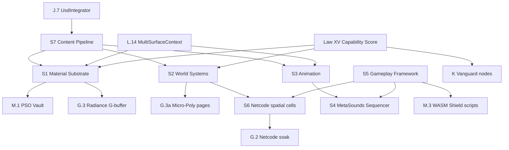
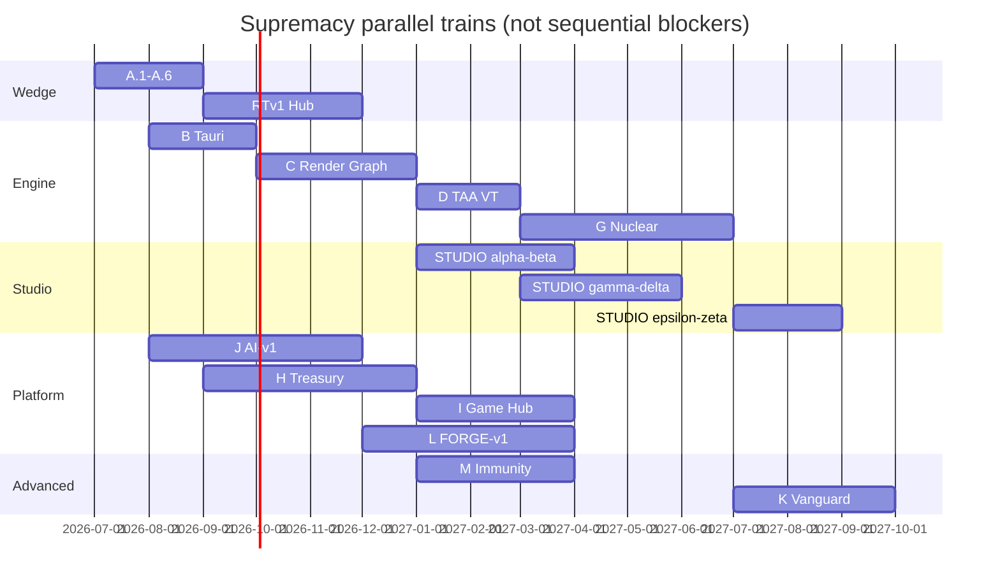

# Aethel Engine — Studio Supremacy Index (Master Plan Map)

**Version:** 1.7 (Chief Architect — **Launch Hard Gate #72** + **Absolute Supremacy Mandate #73**; doctrine registry #55–#64 + **#66**)
**Status:** **Binding** — canonical index of **all** supremacy specifications  
**Canonical:** [`AETHEL_SUPREMACY_ROADMAP.md`](AETHEL_SUPREMACY_ROADMAP.md) v4.7  
**Completeness certificate:** [`AETHEL_PLANNING_COMPLETENESS.md`](AETHEL_PLANNING_COMPLETENESS.md) v1.2  
**Executor map:** [`AETHEL_CLAUDE_EXECUTION_MASTER_MAP.md`](AETHEL_CLAUDE_EXECUTION_MASTER_MAP.md) v1.4  
**Live ledger:** [`AETHEL_FOCUS1_EXECUTION_PROGRESS.md`](AETHEL_FOCUS1_EXECUTION_PROGRESS.md)  
**Purpose:** Single navigation map — every competitor surface mapped to a **Studio Bible** or **Onda**. **Do not create new MDs** — annotate / deepen these.

---

## Document Authority (binding — anti-lost)

| Tier | Open | Role |
|------|------|------|
| **0** | `.aethelrules` · `.cursorrules` | Absolute bans + quality gates |
| **1a** | [`AETHEL_SUPREMACY_ROADMAP.md`](AETHEL_SUPREMACY_ROADMAP.md) | 16 Laws · Ondas · governance |
| **1b** | **This Index** | Navigate every binding spec |
| **1c** | [`AETHEL_CLAUDE_EXECUTION_MASTER_MAP.md`](AETHEL_CLAUDE_EXECUTION_MASTER_MAP.md) | **Task queue** (current round only) |
| **1d** | [`AETHEL_FOCUS1_EXECUTION_PROGRESS.md`](AETHEL_FOCUS1_EXECUTION_PROGRESS.md) | **Live DONE/OPEN** + shipped interfaces |
| **2** | One pillar / onda / billing spec named by the round | Detail on demand |
| **3** | Playbook · Completeness · critiques | Exit gates / certificates — not daily preload |
| **X** | `cloud-web-app/CLAUDE_MASTER_EXECUTION_PLAN_V7\|V8` + V24/V30/Ultimate/UX Monetization | **SUPERSEDED** — Master Map §2.4 |

**Forbidden:** inventing another “Session Radar / Handoff / Master Plan V9” file. Update Progress + Master Map + this Index instead.

---

## Execution order (binding — hygiene 2026-07-09 + Consolidation 2026-07-23)

**Focus 1** (AI brain + real files) → **Focus 2** (renderer + terrain) → **Block 6** (billing truth) → **Launch Hard Gate (#72)** → then Hub/G marketing.
**Active override (2026-07-23 + 2026-08-08 sync + 2026-08-10 Top-1 Matrix):** **Consolidation Wave CW0–CW7** (Master Map §0c) before new exotic kernel letters or new Master-UX hero panels. Progress: CW2/CW5/CW7 **PARTIAL**; **CW1 DONE-core** (15-slot hero bench CLOSED; product PARTIAL); **CW3 DONE-core (2026-08-08)** — present-root + fail-closed marketing (UE RHI residual HELD); **CW4 DONE (2026-08-08)**; **CW6 DONE apply-path** (`COMPOSER_SURPASS_CLAIM=false` — not Cursor surpass). CW0 freeze **ACTIVE**. **P2b Anti-MOCK fully cleared** (BLOCKER/HIGH/MEDIUM = 0 OPEN). Onda J: J.7 USDZ **PARTIAL**, J.4 BYOK **PARTIAL**, J.9 auto-attach + cinematic previz (#63) **DONE-core** (final/G.8/Veo HELD), J.11/J.12 **STOPPED**. Onda L: L.1/L.2/L.5/L.7-core/L.10-green/L.12-soak landed; L.4/L.8/L.9/L.13 = **PARTIAL** (not GAP). Hub checkout **HELD** (H.1+ human cert). Onda G **deferred** (~15% scaffold — **Unreal 100% FALSE**; G.% uplift only via AAA Parity evidence gates). Onda N Quant: N1–N5/§23/Dual-Mode **PARTIAL**; `investmentGrade=false`. **Not ready to sell** as Universal IDE / AI-native / Hub checkout / Vanguard Quant / UE parity. Next: Progress §Remaining OPEN + Top-15 (R1 H.1+ → R4 L.8 E2B soak → …). **Top-1 matrix:** Progress §Top-1 Market Gap Matrix · Master Map §0c.   **2026-08-11 Zero-MVP web/cloud backend audit:** 8 test-infra suites green - `qa:ai-game-film-production` PASS - typecheck PASS - full vitest baseline 492/500 files (2757 passed / 7 failed / 2 skipped); next/navigation nested-copy mock-keying root cause + vitest alias closed; **dependency-infra debts** — web/ `npm install` **EOVERRIDE react/react-dom** conflict + **fast-xml-parser** saml-xsw load-failure (code real) tracked in Progress §Remaining OPEN; remaining vitest failures **presentation-domain** (deferred per no-UI mandate). Hub checkout **false** - G.3 **15%** - `investmentGrade` **false**. **2026-08-16 R1 (Code mode - no UI):** S-11 wire-check **PASS 121=121** (Active=10/Wire=111/Held=0) + S-12 ipc-check **PASS 122** (17/17/88; hot-path=16) + cargo check/clippy -D warnings PASS; studio cargo test **0xc0000139** pre-existing non-regression (kernel harness ~1259 green; wire_reachability 11/11). R1.2 Zero Amnesia: S-17/S-19/S-20/S-22 exist; fixer*.rs unreferenced migration scripts (S-16 resolved); gaps genuine (Task Graph / Hibernation / Sequencer / CW7); stubs flagged (quantum_branching_vcs / universal_asset_retopologizer / usd_gltf_autotopology_exporter). G.% stays 15 - Hub checkout false - J.11/J.12 STOPPED - product_present_ready=false.
[`AETHEL_MASTER_STUDIO_UX_UI_SPECIFICATION.md`](AETHEL_MASTER_STUDIO_UX_UI_SPECIFICATION.md) = **vision + acceptance matrix** (§0), not ship certificate.  
Doctrines **#55–#64** + **#66** + **#72** + **#73** bind. **Anti-Hype Anchor** (Swarm §0a) binds all Fusion marketing. **No new planning** unless a new competitor surface appears.
**Theoretical documentation closed** (2026-07-09) — execution in progress.  
**Claude boot:** Progress ledger → Master Map current round (§0c if Consolidation active) → one spec. Billing-first only if live payment fire. Details: [`AETHEL_APEX_DOCTRINE_AND_EXECUTION_FOCUS.md`](AETHEL_APEX_DOCTRINE_AND_EXECUTION_FOCUS.md).

### The Launch Hard Gate - 100%+ Holistic UE5 Parity & Supremacy (doctrine #72, binding 2026-08-16)

**Annuls "Indie Web first" (The Wedge) and "50% Partial Parity".** Aethel does NOT publicly launch on the strength of a web demo or partial parity. Public launch is locked until Aethel demonstrates **real 100% or greater parity with the Unreal Engine ecosystem**, defined holistically - Unreal is not just graphics (accepted critique: "render-only parity" was the prior plan's error). The 100%+ proof exists **only** when the four pillars run acceptance-green **together in one integrated scene**:

| Pillar | Scope | UE5 reference | Launch KPI fixtures |
|--------|-------|---------------|---------------------|
| **P1 - AAA Rendering (Onda G)** | Micro-Poly culling active on GPU; exceed Unreal dense static-mesh geometric density | UE5 Nanite + Virtual Shadow Maps + Lumen | G.% ladder = 100 (AAA Parity spec G-ACC-*) |
| **P2 - GAS & Physics** | Gameplay Ability System **native in Rust** with **Zero-Copy IPC** (Law I SAB); buffs/debuffs/interrupts at full UE5 complexity + active ragdoll/Euphoria + rollback netcode | UE5 Gameplay Ability System + Enhanced Input + replays | GF-GAS-001/002, GF-NET-001 |
| **P3 - World Forge Topology** | PCG/SDF generators populate scenes with organic depth, foliage, AO, biome variation at **maximum AAA density** | UE5 PCG + Nanite foliage + baked AO | GF-WORLD-001/002/003 |
| **P4 - Workforce AI** | Multiple agents (DeepSeek-V4-Pro class) running **in parallel without context collapse**; governed by Maestro + Adaptive MoA + Auto-Heal | UE5 non-existent (surpass vector) | GF-AI-001/002/003 |

**Fail-closed:** "100%+ reached" is a **false claim** (Law XI) unless all P1-P4 suites are green together in production code. The render G.% ladder (15->30->50->80->100) is a **code-depth metric**, NOT the entire gate - they must not be conflated.

**Anti-Hype amendment:** marketing of Hub/web-demo/"AI-native IDE"/checkout/UE-parity is **locked** behind #72 (100%+) + H.0 + L.8 + J.1+J.2+J.12. **No public launch before 100%+ parity.** Scope priority: compile the Rust Kernel + stabilize World Forge **before** any Game Hub marketing.

**UE limitations Aethel must NOT inherit (surpass vectors - parallel critique mandate):**
1. **No PSO stutter** - pre-compiled tier bundles (M.1) instead of UE shader-hitch at runtime.
2. **No main-thread CPU culling** - GPU-driven culling only (Law I), never UE's CPU-scene traversal bottleneck.
3. **No JSON in the 60 Hz tick IPC** - binary-only SAB ring buffers (Decision #2), never UE's string-keyed reflection spam.
4. **No empty PCG output** - Anti-Mock: generator results fail-closed, never UE "scatter did nothing" placebos.
5. **No shallow "GAS-lite"** - native-Rust GAS authority with full buff/debuff/interrupt + rollback, not a checkbox wrapper.
6. **No context-collapse swarms** - Workforce AI with Adaptive MoA + Auto-Heal, never token-incoherent multi-agent demos.
7. **No per-object bind groups** - bindless descriptors + indirect draw (Law V), never UE's per-draw binding churn.
8. **No "works on my 4090" demos** - Capability Score 0-100 (Law XV) gates every fidelity claim; simulation fidelity, not screenshots.

---

### The Absolute Supremacy Mandate (doctrine #73, binding 2026-08-16)

**Parity (100%) is the floor; supremacy (100%+) is the ceiling.** The Launch Hard Gate #72 (100%+ holistic UE5 parity, P1-P4 together) is the **baseline** for public launch - it proves Aethel matches and exceeds the market. Doctrine #73 binds the **mandate to exceed**: Aethel must deliver **better, superior and faster** than every competitor on every surface - render, physics, world, IDE, AI-3D, commerce, platform - while inheriting **none** of their limitations. Everything they can do, we do better - on **user hardware** (Law XV), not on a 4090.

| Tier | Doctrine | Definition |
|------|----------|------------|
| **Floor** | **#72 Launch Hard Gate** | 100% holistic UE5 parity - P1-P4 acceptance-green together in one scene (launch baseline) |
| **Core** | **Ondas G/K/L/M/S** | Surpass vectors active; UE/competitor limitations are NEVER inherited |
| **Apex** | **#73 Absolute Supremacy** | Absorb every competitor strength + supersede it (100%+); hardware-first; best-in-market on ALL surfaces |

**Competitor absorption map (strength -> Aethel ownership):**

| Competitor | Their strength | Aethel absorption | Surpass vector |
|-----------|----------------|-------------------|----------------|
| **Unreal Engine** | Nanite/Lumen/Niagara + GAS + World Partition + editor maturity | G.3 Micro-Poly/Radiance/Entropy + native-Rust GAS + World Forge + S1-S7 | no PSO stutter (M.1), no main-thread culling (Law I), no JSON-in-60Hz-IPC, no empty PCG, no GAS-lite, no bind-group churn (Law V), no 4090-only demos (Law XV) |
| **Cursor** | Tab completion + repo RAG + multi-file edits | Onda L.12 RepoGraphRAG + L.13 LSP farm + L.14 multi-surface pack | validation gate L.5 + evidence ledger + game+web+code unified context |
| **v0 / Lovable** | Agentic UI + live preview + full-stack scaffold | L.7 AgenticUIStudio + L.8 Preview + L.9 Scaffold | sandboxed preview + design tokens + atomic undo L.11 |
| **Devin** | Autonomous engineering in isolated sandbox | L.1 ForgeSandbox + L.6 AutonomousEngineerLoop | AgentShellPolicy + ProjectValidationGate + evidence ledger |
| **Meshy / Tripo / Luma** | Text/image -> 3D clay | J.7 UsdIntegrator + bw/bx/bz/ca game-ready refine conveyor | clay = input; Aethel owns game-ready (retopo->LOD->UV->rig->PBR->collider->pack); native ONNX + USDZ; `tripoOnlyShipAllowed:false` |
| **Roblox** | Create -> publish -> earn + web demo | I Hub + H Treasury + S6 netcode | honest netcode badges + fail-closed commerce |
| **Steam / Epic Store** | Discovery + reviews + social | I Hub + Law XIV | fail-closed reviews + cross-save opt-out |
| **Stripe** | Commerce + payouts + checkout | H Treasury + RevenueLane (30/70 universal / 12% IAP) | fail-closed H.1+ audit + Coins/Backpack |
| **Runway / Veo / Sora** | AI video generation | Cinematic Director #63 + engine capture | $0 video API - engine renders the film, not pixel-gen |

**Hardware-first supremacy (Law XV elevation):** Quality is NOT gated by user hardware. The Capability Score (0-100) scales fidelity up AND down - enthusiast gets the full nuclear stack; integrated gets rich simulation + baked light + FSR; webgl2/Safari is never excluded. Cloud assist (cook, bake, AI) compensates weak local hardware. **Supremacy is measured on the LOWEST supported tier, not the highest** - "works on my 4090" is a failure, not a demo.

**Absolute Supremacy A-fazeres (deepen & robustify register - additive, NOT erasing shipped):**

| # | Deepen / Robustify | Current (honest) | Target |
|---|--------------------|------------------|--------|
| S-01 | Rust Kernel compile + reachability | ~76 commands registered; 88 compiled-but-unreachable wire modules | cargo check + clippy -D warnings + test green; all wires reachable (#72 scope priority) |
| S-02 | World Forge stabilization | SDF->heightfield + PCG hybrid + NavMesh CLOSED; `loraClayReady` false | LoRA/ONNX soak; intermediate-AAA density; biome depth (#72 scope priority) |
| S-03 | G.% ladder climb | G.3 stays ~15%; band 15->30 HELD (TICKET-PP-01/03) | 15->30->50 via G-ACC-01->06 evidence gates (never % bump without proof) |
| S-04 | GAS Rust authority | `GAS_60HZ_BINARY_IPC_READY` false | binary SAB IPC soak; buffs/debuffs/interrupts; rollback (Decision #6 Rapier) |
| S-05 | Native ONNX text-to-3d | `nativeOnnxReady=false` (no redistributable weights) | Founder-licensed weights + ORT runtime + cu soak; then parity side-by-side vs Meshy |
| S-06 | OpenUSD / Hydra | USDZ preview only; USDA/USD/USDC + OpenUSD stage HELD | OpenUSD C++ crate; solid USDA mesh; Meshy->USD cook |
| S-07 | Remesh / retopo parity | TS remesh deepen CLOSED; `instantMeshesParityReady:false` | Instant Meshes / XAtlas / commercial semantic retopo soak |
| S-08 | Universal IDE claim | L.1/L.6/L.7/L.14 HELD; `COMPOSER_SURPASS_CLAIM=false` | L acceptance suites green; then only claim "Universal IDE" |
| S-09 | J.11/J.12 OrchestratorProd | STOPPED (Founder) | Founder decision; single production protocol when resumed |
| S-10 | Hub checkout / H.1+ | HELD until human cert + Treasury audit | H.0 lanes + fail-closed audit green |
| S-11 | Kernel Wire Registry + `xtask wire-check` | ~100 `kernel_*_wire.rs` compiled (`lib.rs:8-208`); ~76 reachable; `fixer*.rs` manual scripts in `src/` root | one declarative `kernel_registry.rs` {module, letter, status ACTIVE/WIRE/HELD, reachable_from} + `xtask wire-check` gate; zero silent orphans (S-01 deepen) |
| S-12 | Unified IPC command surface | two surfaces: root `desktop_commands.rs`/`mmap_commands.rs`/`physics_commands.rs`/`probe.rs` + `desktop/*_commands`; `main.rs` handler trimmed (P2g); fs/window/ai disconnected | one `ipc_surface.rs` + `register_commands!` macro (Law #48 ACL + SAB hot paths); single audit point; ends P2g disconnection |
| S-13 | Honesty governance registry | 15+ `*_honesty_capability.ts` scattered; CW1 truth matrix is doc-only | one `honesty-governance.ts` {surface, claim, gate, evidence, marketingAllowed}; live truth matrix; #73 "earned never claimed" enforcement spine |
| S-14 | Tier-fidelity regression harness | `frame-parity-harness-3b2.ts` covers G.3 band 15-30 only | extend to all Capability Score bands (enthusiast/discrete/integrated/webgl2); assert "no tier below rich+stable" (Hardware v1.4) |
| S-15 | Wire-reachability runtime telemetry | S-01 gap is compile-vs-reachable; `sidecar-ai-health.ts`/`fs-watch-latency.ts` exist | runtime probe reporting ACTIVE vs WIRE per kernel wire; feeds S-01 register |
| S-16 | Tool-catalog hygiene + xtask workflow | `fixer.rs`..`fixer5.rs` in `src/` root; `agent-tool-bus-catalog.{core-data,data,helpers,runtime-data,ts}` fragmented | relocate repair scripts to `tools/` + `cargo xtask`; single typed agent-tool-bus catalog schema |
| S-17 | Physics World Authority | TWO divergent Rapier `PhysicsKernel` (desktop `physics_kernel.rs:53-72` single unsubstepped `step()` vs crate `physics_kernel.rs:68-290` Euphoria `PhysicsRagdollSoA`); soak solvers (PBD/XPBD 1628, SPH 1860, FEA 882, NS 1141, LBM, softbody) unwired to a live world | ONE `PhysicsWorld` owning both kernels + all soak solvers under one `SimulationClock`; live-world parity soaks (mirrors DONE CW3 render authority) |
| S-18 | Zero-Alloc Hot-Loop Audit | `export_state()` fresh `Vec<u8>` per frame (`physics_kernel.rs:89`); `NativeXpbdCompute::step()` new `bind_group`+`command_encoder` per tick (`xpbd_native_compute.rs:108-161`); `ClientConsensusValidator` `HashMap` (`physics_kernel.rs:234`); GAS `Vec` per tick (`gas/binary_ipc_tick.rs:123`); lossy f32 dispatch (`xpbd_native_compute.rs:147`) | `LinearFrameAllocator` ring + precreated bind groups + encoder pool + slotmap validator + fixed mmap/SAB frame buffers + integer `div_ceil` |
| S-19 | SimulationClock | no accumulator/substeps/interpolation in any live kernel (`physics_kernel.rs:53-72`) | fixed-timestep accumulator + substep loop (XPBD proves 4 substeps @ N>=2048) + 240Hz interpolation buffer + island sleeping + contact warm-start persistence |
| S-20 | Unified EntityId | THREE id spaces: WorldSoA `EntityId` / `GasWorld` u32 counter (`gas/world.rs:8`) / Rapier `RigidBodyHandle` | one `EntityId` authority (Law II, Decision #6); GAS+Rapier derive from WorldSoA |
| S-21 | GPU Physics Compute Unification | **DONE** (verified 2026-08-16, round 1.4cb): `gpu_fluid_compute_bridge.rs` 891L / 6-test AAA suite, letter **ic**, evidence `gpu_lbm_d2q9_collide_stream_parity`, shader `lbm_d2q9_collide_stream.wgsl` — LBM D2Q9 **GPU-offloaded** com real-GPU parity bounded (8 steps, eps 1e-4/1e-5), readback real fail-closed (unmap em todo caminho), soak parity CPU↔GPU; feature-gated `wgpu-bridge` (wgpu 30 off by default; clash wgpu 30 vs studio 0.20 persiste, documentado no kernel Cargo.toml); validado `cargo check --features wgpu-bridge` exit 0 + 6 testes GPU PASS; SPH/NS ainda CPU-only soak; `gpu_fluid_unification_ready` HELD false (honestidade) | unified GPU physics module + encoder pool + binding reuse; one wgpu version; offload NS/SPH/LBM ao MESMO spine compute (futuro) — NÃO wire Active (feature-gated / phantom xtask / clash wgpu, Lei XI) |
| S-22 | Deterministic Rollback World | rollback engine real but physics+GAS NOT in input-replay (`rollback_netcode_engine.rs`); `GAS_60HZ_BINARY_IPC_READY=false` (`gas/binary_ipc_tick.rs:41`) | physics+GAS join 120-frame input-replay; snapshot hash gates product duplex; flag flips only after soak |
| S-23 | Aethel Matter Model | solvers isolated per-domain (SPH melt, LBM gas, XPBD solid, FEA stress, Voronoi fracture) | phase-aware unified matter sim (solid↔soft↔fluid↔gas with melt/boil/freeze); Voronoi+FEA fracture → simulated Rapier debris (`entropy_rapier_bridge` pattern) |
| S-24 | Procedural Muscle Locomotion | Law III Euphoria exists (`PhysicsRagdollSoA` PD balancer, `volumetric_softbody_muscle_pbd.rs` fiber contraction) but not live-animated | XPBD tendon + muscle activation impulse chains, IK-free quadruped/humanoid gait from fibers (zero animation assets) |
| S-25 | Living-Sky Fluid + Ocean Buoyancy | `ocean_fourier_spectral_waves` + `aerodynamic_navier_stokes` real but soak-only | spectral ocean + aerodynamic field coupled to rigid bodies (buoyancy, drag, wakes) for living water/sky |
| S-26 | Neural-Physics Co-Simulation + SDF Collision | `neural_biomechanics_npia` + `stochastic_virtual_sdf` + `sdf_sculptor` present, unwired | neural-physics co-sim for contact/muscle prediction + SDF collision queries; Hardware Capability-score tiered (Law XV) |
| S-27 | Latent Audio Adaptation (Phase 2 — Sólido vs Metamorfo) | jx `metasounds_dsp_compiler` real (GranularSynthesizer / ModalSynthesizer / KellyLochbaumVocalTract / AeroAcoustic Lighthill) but the 5 morphing couplings are TRUE-GAPs (foley, Helmholtz resonator, vocal effort, SDF corner diffraction, synesthetic matrix) | round ki `latent_audio_adaptation.rs` composes jx + jw (gait) + gv (NS flow) + ex (SDF march) + dx (sensory remap) + haptics + poetic gate — soak-gated per system; `latent_audio_aaa_ready` / `physically_based_audio_aaa_ready` / `hrtf_aaa_ready` HELD |

### Doctrine #74 — 3 Leis da Adaptação Universal + Roo-Loop Agêntico (binding 2026-08-14)

| Lei | Name | Mandate | Real substrate |
|-----|------|---------|----------------|
| **1** | **Automação Semântica (Cérebro Passivo)** | The engine adapts to scene/data passively — no authorial intervention; the semantics of physics/geometry/context drive every adaptive decision | soak-gated substrate composition (kb..kh), `svo_depth_lod`, `gaze_foveated_reprojection` (gt) |
| **2** | **Amortecedor Poético (Portão de Sanidade)** | Every SDF/geometry anomaly fails closed through the poetic dampener — NaN/Inf becomes a volumetric fog boundary, never a crash or a mock | [`poetic_error_handler.rs`](../../packages/aethel-kernel-rust/src/poetic_error_handler.rs) (REAL, 23 lines — `intercept_sdf_anomaly`) |
| **3** | **Parallax de Performance-LODs Dinâmicos** | Per-band cost LODs — audio/fidelity detail scales with Capability Score (Law XV) + perception, never flat tiers | `svo_depth_lod`, `infinite_anti_aliasing` (gi), `spatio_temporal_denoiser` (kg) |

**Roo-Loop Agêntico:** Workforce/Maestro run an internal generate → test → criticize → regenerate Actor-Critic loop; intermediate attempts never reach the developer context — only master-grade results surface (Law XI, P4 anti-context-collapse). **Zero-MVP:** no round ki `*_ready` flips without a measured physical invariant; `latent_audio_aaa_ready` / `physically_based_audio_aaa_ready` / `hrtf_aaa_ready` false (HELD); J.11/J.12 STOPPED; strictly backend — no UI. Full encoding: [`AETHEL_VANGUARD_TECHNOLOGIES_SPEC.md`](AETHEL_VANGUARD_TECHNOLOGIES_SPEC.md) § Latent Audio & AV-Sync Vanguard + [`AETHEL_AI_FUSION_CREATIVE_SPEC.md`](AETHEL_AI_FUSION_CREATIVE_SPEC.md) § Roo-Loop Agêntico.

**Anti-Hype (unchanged from #72):** supremacy is EARNED - no marketing label (UE-parity / Cursor-surpass / Meshy-surpass / Universal IDE / AI-native) before its acceptance suite is green. No new planning MDs - this register is executed via Master Map.

### Deep Executor Critique — Product Scale Mandate (binding 2026-08-16; all executors incl. DeepSeek)

**Purpose:** Bind every code executor to **product scale + market-best robustness** — not MVP, not demo, not lab soak theater. Planning is 100% A.0; the failure mode is **implementation depth**, not missing specs. **Do not create new MDs** — execute this register via Master Map + Progress.

**Non-negotiable posture:**
- Aethel is building the **best platform on the market** (doctrine #73), not a prototype. Substrate at toy resolution (64² micro-poly, 4³ radiance probes, 64 entropy chunks, 32→64 FSR, 32px VSM pages) is **honest lab evidence** — it is **NOT** shippable quality and **must not** be presented as progress toward UE parity.
- **Zero-MVP + Anti-Mock** apply to **every** executor session. `success: true` + empty artifact, `*_substrate_proven` without product wire, kernel letter CLOSED without GF fixture = **automatic reject** (Law XI).
- **Desired level may NOT be reached** if phase gates are skipped. Partial depth at the wrong layer (more kernel letters before product present) **permanently** stalls G.% at ~15% — see Progress §G.% "infinite 15% treadmill".

**The "infinite 15% treadmill" (binding critique — stop this first):**

| Symptom | Why it fails product scale | Required fix (Progress §G.% Next 10) |
|---------|---------------------------|--------------------------------------|
| New `kernel_*_wire` letter CLOSED | ~111/118 wires compiled-but-unreachable; lab ≠ Studio runtime | S-11/S-12: wire-check + `ipc_surface` before new letters |
| `*_substrate_proven=true` on secondary_winit | Janela secundária ≠ viewport produto; `product_present_ready=false` | TICKET-PP-01/03 persistent present |
| G.% stays 15% while adding gpu passes | Toy ceilings block every band until scaled | Scale off 64²/4³/64 **in product present** |
| TS/web Radiance wire "CLOSED" | R3F viewport ≠ desktop wgpu nuclear; dual RHI residual HELD | CW3 product authority; 3B.2 parity harness |
| World Forge / IA gen "DONE" | `nativeOnnxReady=false`; PCG density unproven (GF-WORLD) | GF-WORLD-001/002/003 before LoRA marketing |
| GAS heal/evidence CLOSED | `GAS_60HZ_BINARY_IPC_READY=false`; rollback without physics+GAS | S-04 + S-22 product duplex soak |

**UE vs Aethel — where Epic wins today (executor must internalize, not deny):**

| Domain | UE5 today | Aethel honest today | Deepen target (existing plan only) |
|--------|-----------|---------------------|-----------------------------------|
| Virtualized geometry | Nanite production | Meshlet lab ~15%; soft-raster 64² | Micro-Poly G.3a + GF-MESH-001 |
| Dynamic GI | Lumen clipmap + denoise | 4³ probe lab; web SSGI+bake | Radiance G.3b–c + GF-RAD-001 |
| GPU VFX/destruction | Niagara/Chaos mature | 64-chunk Entropy; `chaosParityReady=false` | Entropy G.3d–e + GF-ENT-001 |
| GAS + netcode | Full ecosystem + Iris | Rust GAS partial; IPC not product-ready | S-04/S-22 + GF-GAS/NEF-001 |
| Editor tool depth | Sequencer, Control Rig, PCG editor | Timeline PARTIAL; Spec heroes MISSING | S1–S7 deepen; CW0 no new panels |
| Single RHI | One render path | WebView + secondary_winit dual | PP-01/03 + compile-or-delete `rendering/` |

**Phase quality bar (each phase must pass before the next — no skipping):**

| Phase | Gate | Fail-closed if |
|-------|------|----------------|
| **A — Stop treadmill** | PP-01/03 + S-11/S-12 + no new orphan letters | Any new exotic wire without reachability |
| **B — G.% 15→30** | Product present 60s soak + 3B.2 harness + Critic checklist | `product_present_ready` flip without evidence |
| **C — G.% 30→50** | GF-MESH-001 golden hash + Hi-Z ≥20% win + zero CPU mesh submit | Soft-raster 64² as acceptance path |
| **D — P2 gameplay** | S-18 zero-alloc + GAS 60Hz product + rollback physics+GAS | JSON in tick; GAS-lite wrapper |
| **E — P3 World Forge** | GF-WORLD density + biome organic hash | Empty PCG; "5M instances" from CapScore |
| **F — P1 nuclear 50→80** | G-ACC-01→05 on enthusiast fixture | Any `*_aaa_ready` without G-ACC |
| **G — Launch #72** | P1+P2+P3+P4 green **together** in one scene | G.% 50 alone claimed as "50% UE" |

**Motor ≠ IA (repeat until absorbed):** DeepSeek and all executors build **deterministic Rust/WGSL supremacy** (AAA System Architecture §0). IA (Maestro, World Forge LoRA, Bridge) accelerates **cook, manifests, PCG seeds, presets JSON** — never render/sim hot-loop. P4 Workforce AI is workflow-only; P1–P3 are math-only at runtime.

**Executor boot order (anti-lost):** Progress §Deep Executor Critique → this section → Master Map §0.3 → AAA Parity §7 → **one** round from Remaining OPEN / G.% Next 10 — **not** a new kernel letter unless Phase A green.

**Cross-links:** Progress §G.% Evidence Ladder · Progress §Top-1 Market Gap Matrix · AAA Parity §7 · Master Map §0.3 · AAA System Architecture §5–§6.

---

## How to read this index

| Layer | Role |
|-------|------|
| **16 Laws** | Non-negotiable mandates in Supremacy Roadmap |
| **Ondas A→M** | Sequenced delivery trains |
| **Studio Pillars S1→S7** | **Production-tool depth** — artist/animator/designer/technical artist parity vs UE5 |
| **Nuclear G.3** | Render confrontation (Micro-Poly, Radiance, Entropy) |
| **Vanguard K / Forge L / Immunity M** | Next-decade + IDE + runtime defects |
| Doctrines **#55–#64** + **#66** | Apex / MoA / Director / Foley / **Anti-Lazy** — **SPEC** until Focus/S3/S4 exit |

**Executor rule:** No PR touching a pillar domain without that pillar's **acceptance checklist** + **G/K/L/M/S-readiness**.

---

## Complete specification map

### Core governance

| Document | Version | Scope |
|----------|---------|-------|
| [`AETHEL_SUPREMACY_ROADMAP.md`](AETHEL_SUPREMACY_ROADMAP.md) | **4.7** | 16 Laws, Ondas A→M, Studio S1→S7, **Focus order one-liner** |
| [`AETHEL_SUPREMACY_EXECUTION_PLAYBOOK.md`](AETHEL_SUPREMACY_EXECUTION_PLAYBOOK.md) | 1.1 | GF-* fixtures (28), CI gates, PR decision tree |
| [`AETHEL_PLANNING_COMPLETENESS.md`](AETHEL_PLANNING_COMPLETENESS.md) | **1.2** | A.0 100% planning + hygiene registry |
| [`AETHEL_FULL_PLAN_CORPUS_CRITIQUE.md`](AETHEL_FULL_PLAN_CORPUS_CRITIQUE.md) | 1.0 | Cold critique — seams, blind spots, priority stack |
| [`AETHEL_ENGINE_SUPREMACY_CRITIQUE_AND_UI_DISCIPLINE.md`](AETHEL_ENGINE_SUPREMACY_CRITIQUE_AND_UI_DISCIPLINE.md) | 1.0 | **UE surpass honesty + UI non-pollution** |
| [`AETHEL_UX_AND_ROBUSTNESS_ALIGNMENT_MASTER.md`](AETHEL_UX_AND_ROBUSTNESS_ALIGNMENT_MASTER.md) | 1.0 | **Critiques × all plans × UX/RB gates** |
| [`AETHEL_TECHNICAL_DEPTH_AND_ROBUSTNESS_GAP.md`](AETHEL_TECHNICAL_DEPTH_AND_ROBUSTNESS_GAP.md) | 1.0 | **Plans × code audit — surpass Cursor/UE/Roblox/Stripe** |
| [`AETHEL_CLAUDE_EXECUTION_MASTER_MAP.md`](AETHEL_CLAUDE_EXECUTION_MASTER_MAP.md) | **1.4** | **Task queue** Focus 1→2 + Blocks 6/2/3/7 |
| [`AETHEL_FOCUS1_EXECUTION_PROGRESS.md`](AETHEL_FOCUS1_EXECUTION_PROGRESS.md) | live | DONE/OPEN ledger + interfaces (backend Focus/6A/2A–2B shipped) |
| [`AETHEL_APEX_DOCTRINE_AND_EXECUTION_FOCUS.md`](AETHEL_APEX_DOCTRINE_AND_EXECUTION_FOCUS.md) | 1.0 | Focus 1→2 · #56–#58 |
| [`AETHEL_PLANS_CANONICAL_REFERENCE.md`](AETHEL_PLANS_CANONICAL_REFERENCE.md) | 1.1 | **Single plan table + UX journeys J1–J7** |
| [`AETHEL_PAYG_AND_WALLET_SPEC.md`](AETHEL_PAYG_AND_WALLET_SPEC.md) | 1.1 | Overage / wallet / PAYG + spend caps + $ meters |
| [`AETHEL_MARGIN_CREATIVE_WALLET_TURNS_CALCULATOR.md`](AETHEL_MARGIN_CREATIVE_WALLET_TURNS_CALCULATOR.md) | 1.0 | Mix margin · Creative · wallet→turns |
| [`AETHEL_AI_PROVIDER_CAPABILITY_MATRIX.md`](AETHEL_AI_PROVIDER_CAPABILITY_MATRIX.md) | 1.0 | LLM Fusion + creative spine |
| [`AETHEL_UNIT_ECONOMICS_AND_SUBSCRIPTION_ALIGNMENT.md`](AETHEL_UNIT_ECONOMICS_AND_SUBSCRIPTION_ALIGNMENT.md) | 1.4 | COGS/REV bound to `plans.ts`, anti-loss |
| [`AETHEL_HARDWARE_SCALABILITY_SPEC.md`](AETHEL_HARDWARE_SCALABILITY_SPEC.md) | 1.4 | Law XV + subscription cloud quotas |
| [`AETHEL_AAA_SYSTEM_ARCHITECTURE.md`](AETHEL_AAA_SYSTEM_ARCHITECTURE.md) | — | AAA Memory Doctrine · Zero-AI Deterministic Runtime · Performance Budget Law — binding via Master Map §0.1 (no version header; 60-line blueprint) |
| [`aethel_architecture_philosophy.md`](aethel_architecture_philosophy.md) | — | Philosophical laws 1–5 (2030 = **do not execute**) |

### Render & runtime (vs UE Nanite/Lumen/Niagara + stutter/loading/crash)

| Document | Onda | UE counterpart |
|----------|------|----------------|
| [`AETHEL_AAA_PARITY_TARGETS.md`](AETHEL_AAA_PARITY_TARGETS.md) | G.3 | Nanite, Lumen, Niagara/Chaos |
| [`AETHEL_VANGUARD_TECHNOLOGIES_SPEC.md`](AETHEL_VANGUARD_TECHNOLOGIES_SPEC.md) | K | DLSS-class, 3DGS, WebXR |
| [`AETHEL_RUNTIME_IMMUNITY_SPEC.md`](AETHEL_RUNTIME_IMMUNITY_SPEC.md) | M | PSO stutter, DirectStorage, crash isolation |
| [`AETHEL_MATERIAL_SUBSTRATE_SPEC.md`](AETHEL_MATERIAL_SUBSTRATE_SPEC.md) | **S1** | Material Editor, Substrate |
| [`AETHEL_MATERIALX_INTEGRATION_SPEC.md`](AETHEL_MATERIALX_INTEGRATION_SPEC.md) | G/S1 | MaterialX `.mtlx` interchange (draft v1.0) |
| [`AETHEL_OPENVDB_INTEGRATION_SPEC.md`](AETHEL_OPENVDB_INTEGRATION_SPEC.md) | G/S2 | OpenVDB `.vdb` interchange (draft v1.0) |

### World & content (vs UE World Partition, PCG, Landscape, Fab)

| Document | Onda | UE counterpart |
|----------|------|----------------|
| [`AETHEL_WORLD_SYSTEMS_SPEC.md`](AETHEL_WORLD_SYSTEMS_SPEC.md) | **S2** | World Partition, PCG, Landscape, Foliage |
| [`AETHEL_CONTENT_PIPELINE_SPEC.md`](AETHEL_CONTENT_PIPELINE_SPEC.md) | **S7** | Interchange, Fab, Quixel, USD cook |
| [`AETHEL_UE5_ARTIST_MIGRATION_GUIDE.md`](AETHEL_UE5_ARTIST_MIGRATION_GUIDE.md) | S7/Block 7 | UE5 → Aethel artist onboarding (canonical per Roadmap; v1.0) |

### Character, animation, audio, cinematics (vs UE Control Rig, Sequencer, MetaSounds)

| Document | Onda | UE counterpart |
|----------|------|----------------|
| [`AETHEL_ANIMATION_CINEMATICS_SPEC.md`](AETHEL_ANIMATION_CINEMATICS_SPEC.md) | **S3** | Control Rig, Sequencer — **#63 marketing needs S3.0+** |
| [`AETHEL_METASOUNDS_SPEC.md`](AETHEL_METASOUNDS_SPEC.md) | **S4** | MetaSounds — **#64 needs S4.0+ compiler** |
| [`AETHEL_CINEMATIC_DIRECTOR_DOCTRINE.md`](AETHEL_CINEMATIC_DIRECTOR_DOCTRINE.md) | J+G | **#63** Engine Film — SPEC until capture+Sequencer |
| [`AETHEL_AUDIO_LIBRARY_FIRST_DOCTRINE.md`](AETHEL_AUDIO_LIBRARY_FIRST_DOCTRINE.md) | S4+J | **#64** Foley library-first — SPEC until S4+search |

### Gameplay & multiplayer (vs UE GAS ecosystem, Iris, replication)

| Document | Onda | UE counterpart |
|----------|------|----------------|
| [`AETHEL_GAMEPLAY_FRAMEWORK_SPEC.md`](AETHEL_GAMEPLAY_FRAMEWORK_SPEC.md) | **S5** | GAS, Gameplay Tags, Mass Entity, State Tree |
| [`AETHEL_NETCODE_PRODUCTION_SPEC.md`](AETHEL_NETCODE_PRODUCTION_SPEC.md) | **S6** | Replication Graph, dedicated server, anti-cheat |

### AI, IDE, platform (vs Cursor, v0, Muse, Fab, Steam, Roblox)

| Document | Onda | Counterpart |
|----------|------|-------------|
| [`AETHEL_AI_FUSION_CREATIVE_SPEC.md`](AETHEL_AI_FUSION_CREATIVE_SPEC.md) | J | Muse, Runway, agent IDE |
| [`AETHEL_INTELLIGENT_ROUTING_AND_CONTEXT_COMPRESSION.md`](AETHEL_INTELLIGENT_ROUTING_AND_CONTEXT_COMPRESSION.md) | J+L | **v1.2** Apex Router · #55–#58 |
| [`AETHEL_APEX_DOCTRINE_AND_EXECUTION_FOCUS.md`](AETHEL_APEX_DOCTRINE_AND_EXECUTION_FOCUS.md) | Exec | Focus 1→2 · #56–#58 |
| [`AETHEL_APEX_FAST_SWARM_ORCHESTRATION.md`](AETHEL_APEX_FAST_SWARM_ORCHESTRATION.md) | J.1+L | **v1.3** Maestro+Adaptive MoA+Heal · **#59–#62** + **#66** |
| [`AETHEL_ANTI_LAZINESS_PROTOCOL.md`](AETHEL_ANTI_LAZINESS_PROTOCOL.md) | J+L | **#66** LazyInspector + chunk ≤300 · **APPROVED** |
| [`AETHEL_FUSION_ORCHESTRATION_CRITIQUE_AND_PLAN_ALIGNMENT.md`](AETHEL_FUSION_ORCHESTRATION_CRITIQUE_AND_PLAN_ALIGNMENT.md) | J | **#62 APPROVED** (v1.1) |
| [`AETHEL_AI_WORKLOAD_AND_BILLING_ALIGNMENT.md`](AETHEL_AI_WORKLOAD_AND_BILLING_ALIGNMENT.md) | J+6 | JobBudget · keep prices |
| [`AETHEL_FULL_PLAN_CORPUS_CRITIQUE.md`](AETHEL_FULL_PLAN_CORPUS_CRITIQUE.md) | Meta | Cold critique · priority stack |
| [`AETHEL_UNIVERSAL_IDE_FORGE_SPEC.md`](AETHEL_UNIVERSAL_IDE_FORGE_SPEC.md) | L | Cursor, v0, Devin |
| [`AETHEL_NETWORK_COMMERCE_LIVEOPS_SPEC.md`](AETHEL_NETWORK_COMMERCE_LIVEOPS_SPEC.md) | H | Epic Store, Roblox economy |
| [`AETHEL_GAME_HUB_PLATFORM_GROWTH_SPEC.md`](AETHEL_GAME_HUB_PLATFORM_GROWTH_SPEC.md) | I | Steam discovery, Roblox Hub |
| [`AETHEL_QUANTITATIVE_FINANCE_SPEC.md`](AETHEL_QUANTITATIVE_FINANCE_SPEC.md) | N | Wall Street HFT, Renaissance, Citadel |

---

## Studio Pillars S1→S7 (production-tool supremacy)

Parallel to Ondas — **do not delay the parallel dev trains; public launch is gated by the Launch Hard Gate (#72)**; **S.0 hooks** in A–D.

| Pillar | Bible | Primary waves | Ship gate |
|--------|-------|---------------|-----------|
| **S1** Material Substrate | Material spec | C→D | S1 acceptance |
| **S2** World Systems | World spec | A.1→C→D | S2 acceptance |
| **S3** Animation & Cinematics | Animation spec | E (+ D sequencer) | S3 acceptance · **#63 marketing** |
| **S4** MetaSounds | MetaSounds spec | E | S4 acceptance · **#64 marketing** |
| **S5** Gameplay Framework | Gameplay spec | C→G.2 | S5 acceptance |
| **S6** Netcode Production | Netcode spec | C hooks→G.2 | S6 acceptance |
| **S7** Content Pipeline | Content spec | A.2→VI→J.7 | S7 acceptance |

**Combined studio claim gate:** "Full production studio parity" marketing only after **S1–S7** acceptance suites + **G.3** nuclear on desktop enthusiast.

---

## Competitor supremacy matrix (planning target — honest)

| Competitor | Aethel surpass vector | Primary specs |
|------------|----------------------|---------------|
| **Unreal Engine 5** | WASM Shield + web publish + Capability Score + governed AI + no PSO stutter (M) | G.3, M, S1–S7 |
| **Unity 6** | Single stack web+desktop + Fusion IDE + entitlements (H) | L, J, H, XV |
| **Cursor / v0** | Multi-surface context + evidence + Cost Guard + game+web unified | L, J |
| **Devin** | Governed sandbox + validation gate + evidence ledger | L |
| **Steam / Epic Store** | Indie Hub + instant demo + cross-save (I) + Treasury (H) | I, H |
| **Roblox** | Create→publish→earn + web demo + honest netcode badges (UGC/WASM = later) | I, H, S6 |
| **Runway / Veo** | Engine cinema (#63 Director) + library Foley (#64) — not pixel-gen default | #63, #64, S3, S4 |

---

## S-readiness checklist (every Onda A–F PR)

- [ ] **G + K + L + M-readiness** (existing)
- [ ] Material graph changes register **PSO fingerprint** (S1, M.0)
- [ ] World/terrain/PCG changes use **partition cell schema** (S2)
- [ ] Animation/sequencer changes use **track schema** (S3)
- [ ] Audio graph changes target **MetaSounds compiler** path (S4)
- [ ] Gameplay changes use **tags/data asset IDs** (S5)
- [ ] Multiplayer hooks expose **replication intent** (S6)
- [ ] Asset import changes extend **cook manifest** (S7)

---

## Approved decisions (#59–66, v4.6)

| # | Decision |
|---|----------|
| 59 | **Studio Pillars S1→S7** — binding production-tool bibles; parallel to Ondas |
| 60 | **S1 Material Substrate** — material graph compiler mandatory; no hardcoded TSX materials in ship path |
| 61 | **S2 World Systems** — PCG + World Partition spec replaces one-line roadmap entries |
| 62 | **S3 Animation** — Sequencer + Control Rig parity class; MetaHuman = USD not capsule |
| 63 | **S4 MetaSounds** — graph compiler mandatory; play-log forbidden at ship |
| 64 | **S5 Gameplay Framework** — tags + data assets + Mass SoA at 10k entities |
| 65 | **S6 Netcode** — dedicated spec; G.2 table alone insufficient for marketing |
| 66 | **S7 Content Pipeline** — USD/Fab-class ingest extends Law VI + J.7 |
| 72 | **Launch Hard Gate (2026-08-12)** - annuls "Indie Web first"; public launch locked until **50% holistic UE5 parity** - P1 Rendering (G.3a-e + G.% ladder) + P2 GAS Rust/Zero-Copy (S5/S6) + P3 World Forge density (S2) + P4 Workforce AI parallel (J/L) - all acceptance-green simultaneously |
| 73 | **Absolute Supremacy Mandate (2026-08-12)** - parity (#72) is the floor, supremacy is the ceiling; absorb every competitor strength (UE, Cursor, v0/Devin, Meshy/Tripo/Luma, Roblox, Steam, Stripe) + supersede on user hardware (Law XV); **Deepen & Robustify register S-01..S-26** binds via Master Map (S-17..S-26 = Rust Kernel Physics Supremacy: PhysicsWorld Authority, Zero-Alloc Hot Loops, SimulationClock, Unified EntityId, GPU physics, Deterministic Rollback, Aethel Matter Model, Muscle Locomotion, Living-Sky, Neural co-sim) |

---

## Pillar dependency graph (binding integration)

No pillar ships in isolation. **Executor:** PR touching domain X must not break contracts of upstream pillars.

**Critical path for studio claim:** S7 → S1 → G.3 → S2 → S3 → S4 → S5 → S6 (parallel where possible after C foundation).

---

## STUDIO-v1 release train (detailed milestones)

Capability trains run parallel to **A.1–A.6** and **B→D**; no train blocks another, but **public launch** is locked behind the **Launch Hard Gate (#72)** - 50% holistic UE5 parity (DX + web publish + Hub + AI evidence are post-gate).

| Milestone | Steps | Gate | Depends on |
|-----------|-------|------|------------|
| **STUDIO-α** | S1.0, S2.0, S5.0, S6.0, S7.0 | Schema hooks in C PRs | Onda C start |
| **STUDIO-β** | S1.1, S2.1, S7.1 | Viewport-visible material + terrain partition | A.1 terrain, C render graph |
| **STUDIO-γ** | S1.2, S2.2, S2.3, S3.0, S5.1–S5.2 | PCG non-empty + sequencer schema | D |
| **STUDIO-δ** | S3.1–S3.3, S4.0–S4.2, S5.3 | Animation + audio graph ship | E |
| **STUDIO-ε** | S1.3, S2.4, S3.4, S4.3, S5.4, S6.1–S6.3 | Full framework + netcode hardening | G.2 |
| **STUDIO-ζ** | S6.4–S6.5, S7.2–S7.4 | Soak + content marketplace validation | G + H |

**Marketing gates (binding):**

| Claim | Required milestones |
|-------|---------------------|
| "Material editor" | STUDIO-β + S1.1 acceptance |
| "Open world" | STUDIO-γ + S2.1 + Law XV tier proof |
| "MetaSounds" | STUDIO-δ + S4.0 acceptance |
| "Production multiplayer" | STUDIO-ε + S6.2 + G.2 |
| "Full studio parity" | STUDIO-ζ + G.3 enthusiast + S1–S7 all acceptance |

---

## Honest limitations register (global — do not market beyond)

| Limitation | Reason | Aethel stance vs UE5 |
|------------|--------|----------------------|
| **ML Deformer / full MetaHuman neural** | GPU + dataset + legal | USD facial rig S3.4; no neural deformer Day 1 |
| **Substrate 1:1 slab parity** | UE proprietary stack | S1 simplified slab model — functionally equivalent for artists |
| **Console TRC automation** | Cert labs + platform SDKs | G.4 manual checklist; no "certified console" until G.4 |
| **Hardware RT on web** | WebGL2/WebGPU limits | Law XV: SSGI + probes forever on web |
| **50 km² on web** | 4 GB heap + bandwidth | Honest 1–4 km² web; 50 km² desktop enthusiast only |
| **Iris 1:1 replication** | UE server stack years | S6 Iris-class **intent** — custom graph + GAS deltas |
| **Fab marketplace DCC** | Epic ecosystem lock-in | S7 + H: ingest + publish; not Epic Fab clone |
| **Chaos Destruction 1:1** | Entropy is Aethel answer | G.3d–e Entropy — not Chaos physics clone |
| **DirectStorage on macOS/Linux** | OS API | M.2 Win-first; GPU decompress fallback elsewhere |
| **Neural upscale on integrated GPU** | ONNX perf | K.1 disabled on integrated; FSR path Law XV |

**Surpass vectors (where Aethel wins honestly):**

1. **Web + desktop single stack** — Unity-class without split engine
2. **WASM script isolation (M.3)** — UE C++ crash class eliminated for gameplay scripts
3. **PSO tier bundles (M.1)** — documented JIT fallback vs UE silent stutter
4. **Capability Score (Law XV)** — honest downgrade vs UE "works on my 4090" demos
5. **Governed AI (Law XVI + L)** — evidence ledger + Cost Guard vs Muse black box
6. **Instant web publish + Hub (I)** — Steam discovery latency eliminated for demos
7. **Agent-first IDE (L)** — Cursor + v0 + game context unified

---

## Technology alignment matrix

| Technology | Spec owner | Web path | Desktop path | Competitor ref |
|------------|------------|----------|--------------|----------------|
| WGSL shaders | S1, C | WebGPU | wgpu | UE HLSL → SM6 |
| Bindless heaps | C, Law V | WebGPU limits | wgpu full | UE bindless |
| Meshlets | S7, G.3a | Reduced LOD | Full Nanite-class | Nanite |
| VT pages | S1, M.2 | Range Fetch | DS + GPU decode | UE VT |
| Web Audio DAG | S4 | Primary | Sidecar optional | MetaSounds |
| Rapier physics | S3, S5, S6 | WASM worker | Native Rust | Chaos |
| GAS | S5 | IPC to Rust | Native | UE GAS |
| USD | S7, J.7 | Cook cloud | Local + cloud | Interchange |
| ONNX | K | — | Sidecar | DLSS |
| Yjs CRDT | L, J | Primary collab | Sync | Perforce + Live |

---

## Risk register (planning — mitigate before ship)

| ID | Risk | Impact | Mitigation |
|----|------|--------|------------|
| R-S01 | Material compiler explosion (variant combinatorics) | PSO vault size, compile times | S1 variant mask cap; M.1 tier bundles |
| R-S02 | PCG empty output (Anti-Mock violation) | Trust / demos fail | S2.2 CI: min instance count; fail-closed cook |
| R-S03 | Sequencer scope creep | E slip | S3.0 schema first; defer ML Deformer |
| R-S04 | MetaSounds GC in hot path | Audio dropouts | S4: pre-allocated AudioParam; worker compile |
| R-S05 | GAS JSON creep in IPC | 60 Hz stall | S5: binary layout audit in CI |
| R-S06 | Netcode without determinism | Rollback impossible | S6 blocked until Decision #6 Rapier path green |
| R-S07 | USD material loss on import | Artist revolt | S7.1 golden fixtures; manual fallback graph |
| R-S08 | Studio pillars delay the 50% holistic parity gate | Launch slips vs market | Hard Gate #72 is composite P1-P4 (not single-pillar); S.0 hooks only in A–F; STUDIO-v1 parallel |

---

## Supremacy scorecard (planning depth — **100% A.0**)

| Domain | UE5/competitor ref | **Plan depth** | Code today | Next action |
|--------|-------------------|----------------|------------|-------------|
| Render nuclear G.3 | UE5 Nanite/Lumen | **100%** | ~15% scaffold | **Deferred** (P2e); **no Unreal 100%**; G.% uplift **only** via Progress §**G.% Evidence Ladder** band gates (AAA Parity §G.%); CapScore `g3CodeDepthPercent=15` locked |
| Studio S1–S7 | UE5 editor tools | **100%** | ~5–20% | Deepen existing surfaces; no new hero panels (CW0) |
| AI / IDE J + L | Cursor/v0/Devin | **100%** | ~55–70% cores / **~35–45% market claim** | Cores real (P2b 0; L.10/L.12; L.4/L.8/L.13 PARTIAL). **Marketing forbidden** until L.8 soak + L.13 acceptance + (J.12 or Founder alt). `COMPOSER_SURPASS_CLAIM=false` |
| Platform H + I | Epic/Roblox/Steam | **100%** | ~40–50% ops (Instant Play+I.2 live); checkout **0%** | **H.0 DONE**; Instant Play + I.2 + Law XV + R18 SHIPPED; **H.1+ flip HELD** (human/legal cert) — blocks sell |
| Runtime M + Vanguard K | UE defects + DLSS/XR | **100%** | ~0% product | Post-platform / post-G |
| **Quant Finance Onda N** | Jane Street / retail HFT | **100% spec** (v2.10) | **~5–15% fail-closed cores** (N1–N5/§23/Dual-Mode PARTIAL; SF1–SF3 PARTIAL); SF5–SF7 / FIX / live broker **HELD**; `investmentGrade=false` | No finance marketing; SF5/SF6 before any live adapter; Progress §Onda N + Top-1 Matrix |
| Law XV Hardware | Tier gating | **100%** | partial | Bake gate wired on web-static Instant Play; Cap Score / FSR deepen remains |
| Execution ops | GF fixtures + CI | **100% spec** | partial live | Keep production vitest green (~654+); dual-stack Law XI |
| Migration / onboarding | UE5 artists | **100%** | N/A | Publish guide |

**Deep-boot verification (2026-08-10 — Chief Architect, no UI; no % bump):** Source-audited, not MD-echoed. **(1) IPC reachability (exact):** 102 `kernel_*_wire.rs` → 93 `pub mod` → **76** registered commands → **5 wire modules / 6 commands reachable** → **88 compiled-but-unreachable** → **9 orphan wires**; `rendering/`+`physics/` NOT `pub mod`; kernel skips `materialx_bridge`/`openvdb_bridge`. **(2) R20 CI-enforcement VERIFIED MISSING:** `studio-local-ci.yml` only `npm test`; `check-cargo-target.mjs` + `cargo-prune-orphans.mjs` never invoked → **`*Enforced` = next Code task**. **(3) §G.% substrate VERIFIED honest:** `product_present_ready=false`, G.3=15, PP-02 HELD, 60s soak fail-closed. **(4) Creative #1 VERIFIED TOCTOU:** reserve→immediate-cancel at `maestro-creative-pulse.ts:338-339`. **Queue:** R20 `*Enforced` → #1/#4/#5/#6 → compile-or-delete orphans. G.3 stays ~15%; 15→30 HELD. Sync: Progress mid-file + Master Map §12 1.4ag.

**Competitor gap (one-liner):** Cursor Composer / v0 HMR / UE AAA / Devin autonomy / institutional quant — **all HELD for marketing**. **Unreal 100% = FALSE.** Honest leads: CostGuard+L.5 apply, Instant Play+bake, RepoGraphRAG soak, fail-closed Anti-MOCK + Quant honesty. Full matrix: Progress §Top-1 Market Gap Matrix.

**Certificate:** [`AETHEL_PLANNING_COMPLETENESS.md`](AETHEL_PLANNING_COMPLETENESS.md) — **no further planning required** unless new competitor surface emerges.

**Implementation gap** is intentional next phase — not a planning deficiency.

---

## Execution playbook (operational layer)

**Binding companion:** [`AETHEL_SUPREMACY_EXECUTION_PLAYBOOK.md`](AETHEL_SUPREMACY_EXECUTION_PLAYBOOK.md)

| Playbook section | Use when |
|------------------|----------|
| Executor decision tree | Every PR review |
| Golden fixture catalog (GF-*) | Writing acceptance tests |
| Test pyramid L0–L5 | CI design |
| Wave integration matrix | Sequencing work |
| CI gate registry | Adding qa scripts |
| Agent evidence requirements | Fusion/Forge PRs |

---

## Golden fixtures quick reference

See playbook for full list. **Minimum before STUDIO-β:** GF-MAT-001, GF-WORLD-001, GF-USD-001.

---

## Onda A→M + Studio — unified timeline (planning)

**Note:** Gantt is **planning visualization** — dev trains run in parallel (capability construction), but **public launch waits for the Launch Hard Gate (#72 - P1-P4 acceptance-green together)**.

---

## Spec version registry (hygiene 2026-07-09)

| Document | Version | Depth tier |
|----------|---------|------------|
| Studio Index | **1.6** | Master map + Focus order + doctrine registry |
| Planning Completeness | **1.2** | Certificate + full registry sync |
| Claude Execution Master Map | **1.4** | Focus 1→2 + blocks |
| Routing / Context | **1.2** | Apex |
| Apex Fast Swarm | **1.3** | Maestro + Adaptive MoA (#62) + Heal + #66 hook |
| Anti-Laziness Protocol | **1.0** | **#66 APPROVED** |
| Fusion critique | **1.1** | #62 APPROVED |
| Plans Canonical | **1.1** | Prices + journeys |
| PAYG / Wallet | **1.1** | Spend caps |
| Execution Playbook | **1.1** | GF-* (28) |
| S1–S7 pillars | **1.2** | Node catalogs |
| AAA / Forge / Immunity / Vanguard | **1.1** | Parallel waves |
| AI Fusion J | **1.2** | Per-step acceptance |
| Roadmap | **4.7** | Governance + Focus one-liner |
| Director #63 / Audio #64 / Full Critique | **1.0** | SPEC until exit gates |

**Note:** Studio pillar decision IDs (#59–#66 in this Index §) are **pillar governance** — distinct from Fusion doctrine IDs (**#55–#64**, **#66** Anti-Lazy in AI Fusion / Swarm docs). Do not conflate.

---

## Historical / reference / SUPERSEDED (do not execute from these)

| Document | Status |
|----------|--------|
| [`CLAUDE_MASTER_BRIEF.md`](CLAUDE_MASTER_BRIEF.md) · [`CLAUDE_MEGA_WAVES.md`](CLAUDE_MEGA_WAVES.md) | Catalog / wave narrative — **Master Map overrides** order |
| [`master_mission_briefing.md`](master_mission_briefing.md) · [`walkthrough.md`](walkthrough.md) | Mission / narrative |
| [`AUDITORIA_V33_CRITICA_DOS_3_MDS.md`](AUDITORIA_V33_CRITICA_DOS_3_MDS.md) · audits / UX critiques | Historical reconciliation |
| [`AI_CRITIQUE_DEBT_REGISTRY.md`](AI_CRITIQUE_DEBT_REGISTRY.md) · [`FUTURE_IMPROVEMENTS_REGISTRY.md`](FUTURE_IMPROVEMENTS_REGISTRY.md) | Ticket registries — close via Master Map blocks |
| [`aethel_vision_2030.md`](aethel_vision_2030.md) | **DO NOT EXECUTE** |
| [`analysis_results.md`](analysis_results.md) · [`implementation_plan.md`](implementation_plan.md) · [`contracts_planning.md`](contracts_planning.md) | Historical reconciliation |
| [`audit_backend_spine.md`](audit_backend_spine.md) · [`audit_frontend_ui_ux.md`](audit_frontend_ui_ux.md) · [`critical_user_experience_audit.md`](critical_user_experience_audit.md) · [`user_experience_criticism.md`](user_experience_criticism.md) · [`visual_quality_triage.md`](visual_quality_triage.md) | Historical audits / UX critiques |
| [`billing_security_analysis.md`](billing_security_analysis.md) · [`data_retention_policy.md`](data_retention_policy.md) | Historical security / compliance analysis |
| [`MANIFESTO_DA_SINGULARIDADE_AETHEL_2026.md`](MANIFESTO_DA_SINGULARIDADE_AETHEL_2026.md) · [`SUPREME_EXECUTION_PROMPT_AAA.md`](SUPREME_EXECUTION_PROMPT_AAA.md) | Historical narrative / prompt — do not execute |
| `cloud-web-app/CLAUDE_MASTER_EXECUTION_PLAN_V7.md` | **SUPERSEDED** |
| `cloud-web-app/CLAUDE_MASTER_EXECUTION_PLAN_V8.md` | **SUPERSEDED** |
| `cloud-web-app/CLAUDE_CRITICAL_ALIGNMENT_V24.md` | **SUPERSEDED** |
| `cloud-web-app/CLAUDE_ULTIMATE_QA_CRITIQUE_V30` | **SUPERSEDED** |
| `cloud-web-app/CLAUDE_MASTER_ULTIMATE_ARCHITECTURE_SPEC` | **SUPERSEDED** |
| `cloud-web-app/CLAUDE_AETHEL_UX_MONETIZATION_ALIGNMENT` | **SUPERSEDED** |
**Changelog:** 2026-08-20 todo-17-bw-gaps - Unificacao bw GAP1/2/3 CLOSED (Code, no UI; no % bump; diretiva qualidade cirurgica do usuario): GAP1 pipeline LANES derivam do catalogo canonico KERNEL_ASSET_QUALITY_TIER_CATALOG (kernelBudgets, sem duplicar literais; single source of truth kernel->TS->LANES); GAP2 conveyor game-ready tier-aware (targetTier + qualityManifest; assembleQualityManifestFromPipeline mede a REALIDADE e sobrescreve o declarado; sem manifest -> fail-closed 9 blockers, readiness nunca fabricada); GAP3 creative-artifact-bridge honra request.targetTier no consult J.1 (nunca ai-draft hardcoded); 3 testes anti-drift GAP1/2/3 (vitest 37/37; eslint escopo 0 errors 0 warnings; typecheck PASS); G.% stays **15**; product_present_ready **false**. Proximo: alinhar MDs + o que faltar.
**Changelog:** 2026-08-20 todo-13-bw-unificacao - Todo #13 AI asset delivery CLOSED (Code, no UI; no % bump; estrategico do usuario velocidade+qualidade): kernel asset_quality_gate.rs (bw, r30 **150/115**; 23/23 AAA - AssetQualityTier 4 tiers + budget tables + AssetTopologyQuality::grade + evaluate_asset_quality fail-closed + reference_manifest + soak) + wire desktop + lib.rs mod + registro sorted; web kernel-asset-quality-gate-honesty.ts + consult AssetQualityGate no creative-artifact-bridge (Trava I); **UNIFICACAO bw**: lib/mesh-quality MESH_QUALITY_PIPELINE_LETTER='bw' == kernel asset_quality_gate == kernel-asset-quality-gate-honesty + GameAssetQualityTier tags/budgets; gates Law XI ALL GREEN (MSVC 23/23; wire-check r30 150=150 reachable=35 Active=35 Wire=115 Held=0 missing 3; TS typecheck; TS lint escopo; web tests 54/54); G.% stays **15**; product_present_ready **false**. Proximo: unificacao adicional bw + o que faltar.
**Changelog:** 2026-08-20 diretiva-sf - Diretiva usuario scalable_fidelity CLOSED (Code, no UI; no % bump): kernel scalable_fidelity.rs (sf, r29 **149/114**; 19/19 AAA - Law XV tiers Enthusiast/Discrete/Integrated/WebGL2 + render graph + FSR + baked-light + fail-closed) + **FIX bug monotonicidade VRAM** (fsr constante na present res - escalar resolucao ANTES do budget); wire desktop + lib.rs mod + registro sorted; gates Law XI ALL GREEN (MSVC 19/19+14/14; wire-check PASS; desktop check+clippy); G.% stays **15**; product_present_ready **false**. Proximo: Todo #13 bw+unificacao.
**Changelog:** 2026-08-20 todo-12-ac-lk - Todo #12 CLOSED (Code, no UI; no % bump): kernel asset_color_appearance.rs (ac, r27 **147/112**; 14/14 AAA - AssetColorAppearance::resolve + AnisotropicMicrofacetBrdf + illuminant Kelvin WB + fail-closed) + kernel asset_spectral_radiance.rs (lk, r28 **148/113**; 15/15 AAA - consome radiance_cascades_gi CascadeProbe + illuminant + ACES + fail-closed); wires desktop + lib.rs mods + registro sorted; gates Law XI ALL GREEN (MSVC 14/14+15/15; wire-check PASS); G.% stays **15**; product_present_ready **false**. Proximo: Diretiva sf.
**Changelog:** 2026-08-20 dividas-26-25-22-23 - Dividas #26/#25/#22/#23 CLOSED (Code, no UI; no % bump): #26 compile-or-delete (9 fios nunca compilados + limpeza de mortos; wire-check PASS 146=146 0 phantoms/mortos); #25 simetria de irmaos kz<->la<->lb (deadlock OnceLock eliminado com standalone_fingerprint nos 3 modulos; Law XI verde; wire-check PASS); #22/#23 XPBD GPU Cloth AAA (substrate cloth-grid N=2304 + 5 invariantes + flips; 21/21 MSVC; GNU check+clippy; wire reescrito kernel_probe unico; crate desktop compila; wire-check PASS; kernel-load-scale-honesty.ts alinhado); gates Law XI ALL GREEN; G.% stays **15**; product_present_ready **false**. Proximo: Todo #12 ac+lk.
**Changelog:** 2026-08-19 fase-c-s6.0-replication - Fase C S6.0 CLOSED (Code, no UI; no % bump; execucao Fase C S6.0 sobre gas/): P2 substrate - GAS networked replication (replication.rs letter **gr**; ReplicationGraph bind_with fail-closed + snapshot/delta + encode/decode binario byte-exact + fingerprint + soak 2-pass; 15 testes) + joint physics<->GAS replay duplex (duplex.rs letter **gj** S-27; PhysicsGasDuplex 60Hz lockstep + knockback dual + joint replay rollback converge + 60Hz budget; 8 testes); 3 comandos IPC novos Public/Gas (s6_replication_probe_cmd / run_s6_replication_soak_cmd / run_physics_gas_joint_replay_soak_cmd; ipc_surface r30, REGISTERED 178->181 / PUBLIC 144->147); ipc-check **181/181/181** bijection; **2 clippy Law XI corrigidos** (abilities.rs:233 unnecessary_sort_by -> sort_unstable_by_key; replication.rs:347 manual_is_multiple_of -> is_multiple_of); gates Law XI ALL GREEN (GNU check --lib + clippy --lib -- -D warnings exit 0; MSVC cargo test --jobs 1; xtask ipc-check 181 PASS); **FASE C COMPLETA**; G.% stays **15**; product_present_ready **false**. Alinhamento anti-alucinacao: Fases D/E/F fixtures AUSENTES no disco - nao reivindicar. Proximo: dividas #26/#25/#22/#23 + rendering/AI asset delivery quality
**Changelog:** 2026-08-19 fase-c-gas-2.0 - Fase C GAS 2.0 CLOSED (Code, no UI; no % bump; execucao Fase C GAS 2.0 sobre gas/): P2 substrate - Gameplay Tags (tags.rs; GameplayTagRegistry interning + TagSetTable + benchmark S5-ACC-03) + Data Assets (data_assets.rs letter **lk**; DataAssetRegistry CAS + DataCurve + FNV-1a64 + cook/uncook + soak honesto) + State Tree (state_tree.rs letter **ll**; runtime BT rule-based v1 + zero-alloc eval_node + S5-ACC-05 + Trava III compile-time `const { assert!(STATE_TREE_NO_VIDEO_AUTO_PHYSICS) };`); 5 comandos IPC novos Public/Gas (ipc_surface r29, REGISTERED 173->178 / PUBLIC 139->144); ipc-check **178/178/178** bijection; **3 bugs reais corrigidos via Law XI** (soak monotonicity invertido + seed NEG_INFINITY->INFINITY; tick_count 11->10; clippy assertions-on-constants->const-block); gates Law XI ALL GREEN (MSVC 69/69: gas_ 17 + ipc_surface 16 + data_assets 17 + state_tree 13 + tags 6); G.% stays **15**; product_present_ready **false**. Proximo: GAS networked prediction (S6.0) + duplex Physics<->GAS (S-27).
**Changelog:** 2026-08-19 fase-b-2c-near-depth - Fase B round 2c CLOSED (Code, no UI; no % bump; execução Fase B round 2c): near-depth REAL de esfera nos 3 sítios (gpu_culling.rs WGSL + CPU mirror + gpu_meshlet_cull.rs WGSL) — t_near = clip.w − radius, ndc_z_near = −a + b/t_near (a = −vp[2][2]/vp[2][3], b = vp[3][2] + a·vp[3][3]), fail-open quando t_near ≤ 0 ou fora de [−1,1]; teste golden perspective_hiz_culls_sphere_fully_behind_occluder + CPU mirror lock-step; gates Law XI ALL GREEN (GNU check + clippy --all-targets -- -D warnings + MSVC 45/45); G.% stays **15**; band 30→50 HELD; product_present_ready **false**. Próximo: Fase B 3B.2.
**Changelog:** 2026-08-19 fase-b-2b-hiz-win - Fase B round 2b CLOSED (Code, no UI; no % bump; execução Fase B round 2b): reescrita de hiz-occlusion-win-harness.ts (838L) — câmera perspectiva data-driven + Mat4 byte-exact mirror + Gribb–Hartmann + near-depth a/b espelhado + MAX pyramid + rasterização real; win medido **81.82% ≥ 20%** (GF-HIZ-WIN-001: frustumOnly=132→frustumHiz=24; coveredPixels=1764; rasterizedTriangles=1728; fingerprint f714a3d98d689f9d); PBR material fixture + golden visibility hash 10/10 verdes; gates vitest 4/4 + `npm run typecheck` + `next lint` touched clean; hiz_ready/Nanite **false** fail-closed; G.% stays **15**; product_present_ready **false**.
**Changelog:** 2026-08-19 fase-b-3b2-engine-owned - Fase B round 3B.2 CLOSED (Code, no UI; no % bump; execução Fase B 3B.2): aceite de paridade engine-owned — NOVO frame_hash_digest.rs (513L; SHA-256 puro Rust NIST-vectorado abc/empty/million-a) produz digest determinístico sobre métricas reais de PersistentPresentLiveMetrics + EngineFrameHashEvidence serde camelCase + frame_hash_from_live fail-closed (zero frames / loop dropped / frame graph incompleto) + civil_from_days ISO-8601 + comando Tauri renderer_frame_hash_last (Public/Gpu, non-hot-path); wiring main.rs + ipc_surface.rs (REGISTERED_COMMAND_COUNT 172→173 / PUBLIC 138→139 / IPC_SURFACE_VERSION r27→r28-2026-08-19); cargo xtask ipc-check **173/173/173** bijection; web frame-parity-engine-owned-ingest.test.ts (6 testes) prova ingestão limpa do payload camelCase exato via ingestDesktopFrameFingerprintFromEngine + fail-closed theater/short/non-hex + clamp de bounds; gates Law XI ALL GREEN (GNU check + clippy --all-targets -- -D warnings + MSVC frame_hash_digest 13/13 + gpu_ 54/54 + ipc-check 173 + vitest 6/6 + npm run typecheck + eslint); G.% stays **15**; 3B.2 gate completo HELD (frame graph ainda surface-only, não viewport de produto); product_present_ready **false**. Próximo: Fase C GAS 2.0 (S5.4).
**Changelog:** 2026-08-18 r4-harness-harden - R4 harness hardening CLOSED (Code, no UI; no % bump): root-cause do hang do harness R4 PROVADO — report_from_measured rodava todos os peers alcançáveis ao vivo (DAG acíclico mas combinatoriamente explosivo em debug) para provar distinct_from_*; fix de memoização de soak-reports via OnceLock::get_or_init().clone() nos 8 núcleos R4 (lc/ld/le/lf/lg + living_sky jy + matter_model s23 + physics_world s17) + estendido aos ~22 peers pré-existentes (ju..lb: 11 soaks padrão wrapados + 8 topos de soak + 3 custom wrapados sdf_contact/micro_shadow/sequencing); determinismo roda fresco na closure; fingerprints de peers LIVE-derived; diagnóstico do budget holográfico: measure_read_micros() = 7419.7µs vs TENSOR_READ_BUDGET_MICROS 1000.0µs mesmo uncontended — SLA Law XV é release-runtime, debug não-otimizado nunca o atinge (NÃO é freeze); fix corrigido seguindo o padrão irmão latent_dreamspace_bytecode (budget informacional, fora do fingerprint/readiness; ready = determinístico puro readiness_core(m) && deterministic; wrapper readiness() deletado; 2 testes → measured_read_micros > 0.0; teste diag removido); gates Law XI ALL GREEN + cronômetro debug (check 11.79s; clippy 24.82s): synesthetic 20/20 14.35s; multiverse 19/19 14.08s; holographic 21/21 11.79s; latent 20/20 8.46s; micro_dream 18/18 11.51s; living_sky 9/9 4.04s; matter_model 12/12 7.01s; physics_world 21/21 2.56s; contagens estáveis (registry 146/35 r26; ipc 172/Public 138 r27; wire 35 probes); G.% stays **15**; product_present_ready **false**. Próximo: Focus 2 / G.% next band.
**Changelog:** 2026-08-18 r4-latent-dreamspace - R4 Latent Dreamspace + Protocolo de Bytecode Espacial (.asbc) CLOSED (Code, no UI; no % bump; 8 kernels lc→lj): Latent Dreamspace Bytecode (lc ~1532L) + Micro-Dream GPU Pass (ld ~1485L) + Holographic Scene Tensor (le ~1279L) + Multiverso Rollback Branching (lf ~1178L) + Synesthetic Resonance Matrix (lg ~954L) + Gaze & Intent Anticipation (lh ~1171L) + Narrative Tension Clock (li ~1014L) + Matter Memory & Scarring (lj ~1223L) — soak determinístico bit-identical + zero-alloc + fail-closed + ≥18 testes AAA + distinct_from_all_peers; registry **146**/reachable **35** (r26); ipc **172**/Public **138** (+16 ACL, r27); wire_reachability **35** probes/drift 34; wire-check **146-35** + ipc-check **172-138** PASS; Onda N **HELD** (defer post-launch); G.% stays **15**; product_present_ready **false**; totals harness em confirmação final (kernel R4 tests em validação Law XI: lf soak; lg/lh/li fila; lj re-run; studio cargo test em andamento — R4 wire soaks). Próximo: Focus 2.
**Changelog:** 2026-08-18 r3-physics-pillars - R3 physics pillars CLOSED (Code, no UI; no % bump; implementação dos gaps físicos da auditoria R3-B ①③④ sobre o spine S-17): chassis veicular (**kz**, vehicle_chassis_dynamics.rs ~1552L 19 tests; config flexível DriveLayout/DifferentialMode/GroundProfile — não só carro, extensível a monstros/cavalos/qualquer veículo) + aerodinâmica (**la**, flight_aerodynamics.rs ~1323L 18 tests; AerofoilConfig/AircraftConfig + ISA + lift/drag polar + trim + stall + control surfaces) + orbital/celeste (**lb**, celestial_orbital_dynamics.rs ~1571L 22 tests; OrbitalElements/CelestialBody/BodyTable + solve_kepler + universal variable + vis-viva + SOI patched conic + RCS/microgravity); contagens: kernel test **1561/1561** + clippy zero; studio wires 3x3; registry WIRES 135→**138** reachable 24→**27**; ipc 150→**156**/Public 116→**122**; wire-check **138-27**; ipc-check **156-122**; G.% stays **15**; product_present_ready **false**; sibling symmetry distinctness kz↔la↔lb deferido. Próximo: Focus 2 / G.% next band.
**Changelog:** 2026-08-18 r3-strategic-coverage-audit - R3 round CLOSED (Code, no UI; no % bump; zero linhas de kernel; execução R3-A..R3-F): auditoria estratégica de cobertura física/jogabilidade + alinhamento rendering/hardware/custo (a pedido do Founder; contagens estáveis: wire-check 135=135/24, ipc-check 150/116, G.% 15). **Física — rico:** fluidos (NS gv/LBM gx/SPH hk/ninja gg/facial ke/living_sky jy), matéria/destruição (kh/ip2/kj/ks/matter_model), biomecânica (jw/ip11/ko/jz), atmosfera (kv/kk), PBD/XPBD, S-17 autoridade 240Hz + S-20 WorldSoaSpaceAllocator. **GAPS reais:** ① espaço/orbital AUSENTE (Aethel Cosmos cn HELD); ② 4D contínuo HELD (dv fecha w-tempo); ③ veículos/rodas/suspensão AUSENTE; ④ voo/asa/lift AUSENTE (só vento kv); ⑤ cloth AAA HELD. **Gameplay:** GAS g20 real + GAS 2.0 acessórios (dna_shuffler/bio_homeostasis/bio_flow_tether); AUSENTES: Gameplay Tags, Data Assets, State Tree (só S5.4), Enhanced Input parcial, GAS networked prediction (S6), veículos/voo/espaço. **Rendering/hardware/custo:** render = $0 COGS local (Law XV) → escala sem custo; doctrine #73 = supremacia no tier MAIS BAIXO (FSR + Capability Score 0-100 + scaled fidelity, nunca exclusão); custos reais = AI tokens + storage R2 + MP + Forge (plans.ts 250MB/250K tokens); cloud compile/cook reserve Wave 6; margins 98/97/96%. **Decisões:** chassis veicular + aerodinâmica + orbital no MESMO spine S-17 (determinismo); zero-COGS local primeiro. Próximo: Focus 2 / G.% next band — renderer AAA HELD até hardware real (#72/#73).
**Changelog:** 2026-08-17 r2-round-close - R2 round CLOSED (Code, no UI; no % bump; execução R2-A..R2-K + R2-L fechamento): 11 rodadas Vanguarda P1-P4 entregues sobre o Rust Kernel — SDF Contact Blending (**kq**, 871L 20 tests), Micro-shadows & Bent Normals (**kr**, 1094L 24 tests), Dynamic Surface Deformation (**ks**, 932L 19 tests), Async Compute Scheduler (**kt**, 1110L 22 tests), Shader Cooker + PSO Vault verificação DEEP (**km**, 1043L 8 tests já na base), Euphoria Balance Controller + wiring no PhysicsWorld::step (**ko**, 1406L 20+2 tests), World Forge Densification (**ku**, 1296L 15 tests), Wind Field Dynamics (**kv**, 1510L 21 tests), Auto-Photography Director (**kw**, 1461L 21 tests, TRAVA LEI XVI + bug real f32::signum corrigido), Cinema Frame-Graph Composition (**kx**, 1431L 22 tests), Cinema Hot-Loop Composition (**ky**, 884L 11 tests, zero-PSO-stutter); backfill R2-A..G gravado no Progress com contagens honestas do disco (tests 20/24/19/22/8/20/15; datas reais 16/08 exceto R2-E 15/08); gates finais Law XI ALL GREEN (kernel test **1502/1502** + clippy zero; studio test **234 lib + 80 bin** + clippy zero; wire-check **135=135 reachable 24** Active=24/Wire=111/Held=0; ipc-check **150 bijection Public=116**; IPC_SURFACE_VERSION r25); G.% stays **15**; product_present_ready **false**; Hub checkout **false**; J.11/J.12 STOPPED. Próximo: **Focus 2 / G.% next band** — renderer AAA permanece **HELD** até aceitação em hardware real (doctrine #72/#73; R2-K = fundação backend zero-PSO-stutter).
**Changelog:** 2026-08-16 r1-round-close - R1 round CLOSED (Code, no UI; no % bump; execução R1.1-R1.7): 4 gaps genuínos entregues — Task Graph (**jt**), Spatial Hibernation (**hg**), Sequencer (**ju**), Cross-Compile gate `cross-check` RESULT PASS (GNU+MSVC dual-ABI); gates finais Law XI ALL GREEN (wire-check 124=124 reachable 13; ipc-check 128 Public=94); G.% stays 15; product_present_ready false; R2 Vanguarda next.
**Changelog:** 2026-08-16 r14-close-r0-r14 - R14 Fechamento do programa R0→R14 (Code, no UI; no % bump): certificação final — gates Law XI ALL GREEN (audit-depth PASS 121/121 0 missing/phantom Deep=115 Medium=6 Shallow=0 STUB-RISK=0 + wire-check PASS 121/10 + ipc-check PASS 122/88 + kernel 1259/1259 clippy zero + studio MSVC 192/192 clippy zero); movimentação R13 não quebrou varredura. Cadeia 1.4bn→1.4cc (Master Map) + r0→r13 (Index) íntegra; contagens estáveis desde R11 (121/10/122/88). Programa R0→R14 FECHADO — S-11/12/15/17/18/19/20/22/23/24/25/26 cobertos + S-21 verificado + governança limpa. Pendentes: S-16 parcial (fixer*.rs + agent-tool-bus) + 4 lacunas AAA → próximas rodadas. STOP J.11/J.12. |
**Changelog:** 2026-08-16 r13-retire-legacy-governance-js - R13 Scripts legados JS de governança aposentados (Code, no UI; no % bump; execução R0→R14): 30 scripts one-shot da RAÍZ arquivados em `tools/retired-governance/` com README (Zero Amnesia) — **0 referências funcionais** (package.json usa `node tools/*.mjs`; `scripts/patch-vitest-win-drive-case.mjs` ativo NÃO movido; .github/*rules/MDs limpos). `cargo xtask audit-depth` = replica Rust do `_audit_wire_depth.js` (R1 previu). Ambíguos classificados (lixo/legado). Movimentação Move-Item -LiteralPath 30/30. **Gates GREEN:** audit-depth PASS (121/121, 0 missing/phantom, Deep=115 Medium=6 Shallow=0, STUB-RISK 0) + wire-check PASS 121/10 + ipc-check PASS 122/88. S-16 parcial — fixer*.rs + agent-tool-bus catalog pendentes (**NÃO fechado**). STOP J.11/J.12. |
**Changelog:** 2026-08-16 r12-gpu-fluid-compute-unification - R12 S-21 GPU Physics Compute Unification verified + feature-gated validated (Code, no UI; no % bump; execução R0→R14): fechamento do gap de VERIFICAÇÃO do S-21 — `packages/aethel-kernel-rust/src/gpu_fluid_compute_bridge.rs` (891L, 6-test AAA suite, letter **ic**, evidence `gpu_lbm_d2q9_collide_stream_parity`, seed 0x6770_756c_6d_21 "gpu lbm!") já existia DONE (1.4aq) mas o S-register do Index estava STALE → rodada de verificação linha-a-linha + validação feature-gated + doc sync honesto. Substrate: `GpuFluidComputeBridge` (device/queue/collide+stream pipelines/bg_collide/bg_stream/7 buffers + 2 staging), `step()` = 2 compute passes LBM D2Q9 collide+stream + 4 staging copies, `readback()` REAL (`map_async`+`poll(wait_indefinitely)`+`get_mapped_range`, **unmap em TODOS os caminhos** incl. erros), `read_f32_slice` alignment-safe (chunks_exact(4)+from_le_bytes — bytemuck NÃO no readback). Soak: `run_gpu_lbm_parity_soak()` fail-closed (no adapter → `no_wgpu_adapter_or_device`), `LOAD_SCALE_SIDE` 46², CPU LBM reference idêntico, 8 steps parity bounded (1e-4/1e-5), `GpuFluidComputeSoakReport` com `gpu_lbm_collide_stream_parity_ready` real + 7 flags AAA HELD false incl. `gpu_fluid_unification_ready: false` (SPH/NS futuros no mesmo spine). **Validação feature-gated real:** `cargo check --features wgpu-bridge` exit 0 (43.76s) + `cargo test --lib --features wgpu-bridge gpu_fluid` **6/6 PASS**. **Decisão honesta de NÃO-wire (Lei XI):** módulo do KERNEL feature-gated (wgpu 30 off default — clash wgpu 30 vs studio 0.20) → não conta nos 121 WIRES_ON_DISK, registry entry = phantom do xtask, wire placebo = Zero-MVP → closure = validação + doc sync, SEM mudança em kernel_registry/wire_reachability/ipc_surface (contagens permanecem **121/10/122/Public=88**). Gates GREEN (Law XI): kernel test **1259/1259** + clippy zero; studio **MSVC** test **192/192** + clippy zero; xtask wire-check **PASS 121/10** + ipc-check **PASS 122/Public=88**. 6 testes substrate (honesty_ready_implies_verified / held_flags_never_flip / gpu_evidence_kind_distinct / f32_byte_roundtrip_alignment / cpu_reference_deterministic / solid_rho_initial_one). STOP J.11/J.12.
**Changelog:** 2026-08-16 r11-neural-physics-co-sim - R11 S-26 Neural-Physics Co-Sim + SDF Collision wired (Code, no UI; no % bump; execução R0→R14): fechamento do gap "present, unwired" do S-26 (letter **jz**, evidence `neural_physics_contact_muscle_sdf`) — `packages/aethel-kernel-rust/src/neural_physics_co_sim.rs` (1217L, 11-test AAA suite) já existia no disco e no lib.rs, mas SEM entry no wire registry; torná-lo **Active** (reachable 9→10, wires 120→121, **orphan permanece 111 = 121 − 10** — `orphan_wires()` = total − reachable, aritmética real, NÃO 110). Autoridade neural-physics co-sim (doctrine #73): `NeuralContactNet` MLP (6→tanh hidden 12/20/32 Law XV tier→tanh [jn, jt, muscle_activation]) SGD real dentro do soak contra professor analítico (restitution + Coulomb cone + CPG), zero-alloc scratch `[f32; MAX_HIDDEN=32]`; colisão SDF real via `SdfCollisionQuery` sobre `StochasticVirtualSdfField` (penetração = −estimate_sdf, normal outward, fail-closed não-finito + clamp cone + `apply_to_velocity` guards). Soak real: `run_neural_physics_co_sim_soak()` — capability 70 → High (hidden 32 / sdf_strata 10), 3 passes, `neural_physics_co_sim_ready = core_ok && fp != 0` (9 gates); **`neural_physics_aaa_ready` TRUE ownado S-26** — wire nega só o fora do escopo (trained_online_deep_net / gpu_neural_physics / neural_terrain / full_neural_rig FALSE HELD); 11 testes substrate. Sincronia 6 arquivos: kernel_registry (entry jz + consts 121/10/r11 + `ACTIVE_WIRE_MODULES` 9→10), wire_reachability (10 probes, drift 8→9, **+9 hardcodes de contagem corrigidos**), studio wire module `kernel_neural_physics_co_sim_wire.rs` (report 41 campos + `wire_on_surface` + soak subset 16; 3 testes), lib.rs pub mod, ipc_surface (**r11**, 120→**122** registered, 86→**88** Public, +2 ACL KernelWire, teste 122; macro `register_commands!` = única lista, main.rs cobriu automático). Gates GREEN (Law XI): kernel test **1259/1259** + clippy zero; studio **MSVC** test **192/192** + clippy zero; xtask wire-check **PASS 121/10** + ipc-check **PASS 122/Public=88**. STOP J.11/J.12.
**Changelog:** 2026-08-16 r10-procedural-muscle-locomotion - R10 S-24 Procedural Muscle Locomotion wired (Code, no UI; no % bump; execução R0→R14): fechamento do gap "present, unwired" do S-24 (letter **jw**, evidence `procedural_muscle_tendon_chain_gait`) — `packages/aethel-kernel-rust/src/procedural_muscle_locomotion.rs` (812L, 11-test AAA suite) já existia no disco e no lib.rs, mas SEM entry no wire registry; torná-lo **Active** (reachable 8→9, wires 119→120, **orphan permanece 111 = 120 − 9** — `orphan_wires()` = total − reachable, aritmética real, NÃO 110). Autoridade de gaita bipedal IK-free emergente (doctrine #73; Law III — Euphoria): oscilador CPG de fase + cadeias de ativação muscular + substrato XPBD de tendão real (5 partículas/6 tendões, rest-length modulada por ativação, stiction de stance, lift de swing, knee-lock strut `LOC_STRUT_LEN=1.0`). Soak real: `run_procedural_muscle_locomotion_soak()` — `LOC_SOAK_STEPS` 2400, `procedural_muscle_locomotion_ready = core_ok && fp != 0`, `core_ok = xpbd_tendon_routed && activation_impulse_chains_ready && ik_free_gait_ready && deterministic_replay`, `probe_procedural_muscle_locomotion() = run_..._soak()`; gates: forward > 1.5, hip_y_mean > 0.5, hip_y_min > 0.3, transitions ≥ 2, foot_plant ≥ 2, soak_steps == 2400; 4 flags AAA (chaos_muscle_locomotion / euphoria_full / gpu_muscle_sim / neural_physics) FAIL-CLOSED false HELD; 11 testes substrate. Sincronia 6 arquivos: kernel_registry (entry jw + consts 120/9/r10 + **`ACTIVE_WIRE_MODULES` 8→9**), wire_reachability (9 probes, drift 7→8), studio wire module `kernel_procedural_muscle_locomotion_wire.rs` (report 30 campos + `wire_on_surface` + soak subset 17; 3 testes), lib.rs pub mod, ipc_surface (**r10**, 118→**120** registered, 84→**86** Public, +2 ACL KernelWire, teste 120; macro `register_commands!` = única lista, main.rs cobriu automático). Gates GREEN (Law XI): kernel **MSVC** test **1259/1259** + clippy zero; studio **MSVC** test **189/189** + clippy zero; xtask wire-check **PASS 120/9** + ipc-check **PASS 120/Public=86**. STOP J.11/J.12.
**Changelog:** 2026-08-16 r9-living-sky-fluid-ocean-buoyancy - R9 S-25 Living-Sky Fluid + Ocean Buoyancy wired (Code, no UI; no % bump; execução R0→R14): fechamento do gap "present, unwired" do S-25 (letter **jy**, evidence `living_sky_spectral_ocean_buoyancy_wake`) — `packages/aethel-kernel-rust/src/living_sky_fluid_ocean_buoyancy.rs` (977L, 9-test AAA suite) já existia no disco e no lib.rs, mas SEM entry no wire registry; torná-lo **Active** (reachable 7→8, wires 118→119, **orphan permanece 111 = 119 − 8** — `orphan_wires()` = total − reachable, aritmética real, NÃO 110). Autoridade unificada céu/oceano bidirecional (doctrine #73): grid espectral SoA 32×16, Archimedes buoyancy, wave-slope advection, vertical skin drag (vento arrasta corpo), wakes bidirecionais (`inject_ocean_wake`/`decay_wakes`), `sample_ocean` in-domain. Soak real: `run_living_sky_soak()` — 600 steps, 4 bodies coupled, 3 passes determinísticos (wakes / sem wakes / replay), `living_sky_ready = core_ok && fp != 0`, `probe_living_sky() = run_living_sky_soak()`; 6 flags AAA (full-SPH ocean / GPU ocean / FFT / Chaos / neural co-sim / spectral ocean) FAIL-CLOSED false HELD; 9 testes substrate. Sincronia 6 arquivos: kernel_registry (entry jy + consts 119/8/r9 + **`ACTIVE_WIRE_MODULES` 7→8** — 3ª fonte, lição R8), wire_reachability (8 probes, drift 6→7), studio wire module `kernel_living_sky_fluid_ocean_buoyancy_wire.rs` (report 28 campos + `wire_on_surface`; 3 testes), lib.rs pub mod, ipc_surface (**r9**, 116→**118** registered, 82→**84** Public, +2 ACL KernelWire, teste 118; macro `register_commands!` = única lista, main.rs cobriu automático). Gates GREEN (Law XI): kernel GNU test **1259/1259** + clippy zero; studio **MSVC** test **186/186** + clippy zero; xtask wire-check **PASS 119/8** + ipc-check **PASS 118/Public=84**. STOP J.11/J.12.
**Changelog:** 2026-08-16 r8-aethel-matter-model - R8 S-23 Aethel Matter Model wired (Code, no UI; no % bump; execução R0→R14): fechamento do gap "present, unwired" do S-23 (letter **jv**, evidence `aethel_matter_model_phase_solver_fracture`, fingerprint seed "MATT"^"SBLK") — `packages/aethel-kernel-rust/src/aethel_matter_model.rs` (1037L, 12-test AAA suite) já existia no disco e no lib.rs, mas SEM entry no wire registry → status Wire; decisão (precedente R4/s17): torná-lo **Active** (reachable 6→7, wires 117→118, Active=7/Wire=111/Held=0). Autoridade unificada de matéria fase-consciente (doctrine #73): SPH melt/flow, LBM gas buoyancy, XPBD solid/soft, FEA stress, Voronoi fracture → Rapier debris; histerese DIRECIONAL (soften 300 / melt 340 / boil 440.5 / hyst 0.5 → freeze 339.5 / condense 440 / re-soften 299.5). Soak real: roster 6 corpos, `MATTER_SOAK_STEPS` 48 (+1=49), `MATTER_DEBRIS_TICKS` 45, `MATTER_SEED_LATTICE_SIDE` 5, `MATTER_FRACTURE_MASS` 256; valores exatos (soften_step 24 / melt_step 12 / boil_step 26 / condense_step 3 / freeze_step 9; gas 395→450; fragments 125; spawned 125; ticks 45; body_count 6; sph/gas mass drift <1e-3; 7 `distinct_from_*` true; AAA fail-closed HELD). Sincronia dos 6 arquivos: kernel_registry (entry jv + consts 118/7/r8 + `ACTIVE_WIRE_MODULES` 6→7), wire_reachability (7 probes, drift 5→6), studio wire module `kernel_aethel_matter_model_wire.rs` (~280L, 3 testes espelhando report 54 campos + soak subset 17), lib.rs pub mod, ipc_surface (**r8**, 114→**116** registered, 80→82 Public, +2 ACL KernelWire, teste 116). 2 lições reais: (1) `ACTIVE_WIRE_MODULES` é UMA TERCEIRA fonte de verdade (além do KERNEL_WIRE_REGISTRY + consts) — esquecido no diff quebrou 2 testes (7 vs 6); corrigido + doc "7 wires ACTIVE"; re-test 1259/1259. (2) studio `cargo test` DEVE usar MSVC (`cargo +stable-x86_64-pc-windows-msvc`) — toolchain GNU default linka binário que falha no loader Windows `0xC0000139 STATUS_ENTRYPOINT_NOT_FOUND`; MSVC 183/183 GREEN. Gates GREEN (Law XI): kernel check+clippy+test 1259/1259; studio MSVC check+clippy+test 183/183; xtask wire-check PASS 118/118/7 reachable + ipc-check PASS 116. STOP J.11/J.12.
**Changelog:** 2026-08-15 r7-deterministic-rollback - R7 S-22 Deterministic Rollback Authority + ROOT-CAUSE fixes (Code, no UI; no % bump; execução R0→R14): NEW `packages/aethel-kernel-rust/src/deterministic_rollback.rs` (900L, 19-test AAA suite, letter **g21**, wired `pub mod deterministic_rollback;`) — closes the gap where the S-22 `RollbackJournal`/`WorldCheckpoint`/`rollback_to` substrate existed but had NO multi-body re-sim determinism evidence. Soak 4 torsos / 24 frames / journal 32 / `rollback_to(4)` + twin golden/divergent + per-frame fingerprint replay + regression `rollback_replays_torque_and_mixed_inputs_bit_exact`. **2 REAL root causes found + fixed:** (1) **angular 1-ULP drift erasure** — `restore_checkpoint` re-normalized the captured quaternion (`from_quaternion`), erasing the non-unitarity drift the Rapier integrator leaves in `coords`, which feeds the world inertia tensor used by `apply_torque_impulse` → broke bit-exact replay of angular inputs; fixed with `UnitQuaternion::new_unchecked` (preserves coords verbatim; nalgebra 0.32.6 has NO `from_quaternion_unchecked` — E0599 discovery). (2) **`rollback_to(0)` empty checkpoint** — `with_config` captured frame 0 before spawns (`bodies=[]`) → restored nothing + re-simmed from the final state → total divergence; fixed by re-capturing frame 0 on the first `step` (`tick_count()==0`, `push` overwrites slot `frame_id % capacity`). Diagnostic 6 cases all bit-exact (first_div=None); module 19/19; kernel `cargo test --lib` **1259/1259**; gates GREEN (kernel check+clippy, studio MSVC check+clippy, xtask wire-check + ipc-check PASS). STOP J.11/J.12.
**Changelog:** 2026-08-15 r6-gas-entity-authority - R6 S-19/S-20 completa/verifica SimulationClock + UnifiedEntityId + integração GAS (Code, no UI; no % bump; execução R0→R14): NEW `packages/aethel-kernel-rust/src/gas_entity_authority.rs` (901L, 17-test AAA suite, letter **g20**) — S-20 kernel GAS Entity Authority fechando o gap onde o `GasWorld` u32 counter do studio era uma TERCEIRA autoridade de id. Design (doctrine #73 — Kernel Physics Supremacy): um único `WorldSoaSpaceAllocator` (u64 monotônico) alimenta AMBOS os domínios — GAS (`spawn_gas_entity`) e Physics (`allocate_physics_handle` via `RigidBodyHandle::from_raw_parts(space,0)`) — provando derivação de UMA sequência compartilhada (prova no soak: entity0→Gas(0), handle físico index==1, `space_ids_drawn == spawned + physics_allocations`, gate `single_authority`). Registro denso `GasEntityRegistry` com rejeição fail-closed de cross-domain / reserved `u32::MAX` / duplicados / out-of-range / capacity (máx 2048). Cadência S-19 fundida via `tick_gas(real_dt)` (240 Hz fixo, substeps 2, alpha de interpolação, rewind). `fingerprint` determinístico + soak 10-gates → `gas_entity_authority_ready` com AAA `gas_entity_authority_aaa_ready` / `physics_gas_duplex_ready` FAIL-CLOSED false (HELD) + `probe_gas_entity_authority`. 17 testes: cadência fixa 2 substeps @1/120, partial-frame 1 substep via `clock().substep_dt()` (float-robusto), rewind-retick reproduz estado, fingerprint determinístico + distinto entre seeds, allocator monotônico único, derivação gas↔physics um-allocator, roundtrip `entity_from_unified`, soak ready + probe==soak. Lições reais: rapier 0.17.2 `RigidBodyHandle` é TUPLE struct (sem `.index`/`.generation` — E0609) → `handle.into_raw_parts()`; clippy 1.97 `should_implement_trait` → `WorldSoaSpaceAllocator::next` renomeado `draw` + `manual_is_multiple_of` → `is_multiple_of(4)`. Gates GREEN (Law XI): kernel GNU check + clippy --all-targets -D warnings exit 0 + `cargo test --lib` **1240/1240** (17 novos); studio MSVC check + clippy --all-targets exit 0; xtask wire-check PASS 117/6/6 + ipc-check PASS 114/114/114 (AgentDeny=17 HumanOnly=17 Public=80, hot-path 16). STOP J.11/J.12.
**Changelog:** 2026-08-15 r5-zero-alloc-hot-loop - R5 S-18 Zero-Alloc hot-loop completion (Code, no UI; no % bump; execução R0→R14): fechamento da dívida S-18 no desktop kernel + GAS hot path com medição real. (1) `ClientConsensusValidator` slotmap validator em `apps/studio-local/src-tauri/src/physics_kernel.rs` (~780L, +6 testes) — substitui o antigo HashMap por slotmap de capacidade fixa open-addressing (splitmix64 → `probe_start`, linear probing, evicção LRU a 3/4, deleção tombstone-free backward-shift) provando zero-alloc hot loop + estrutura bounded no steady state. **REAL production bug CAÇADO + CORRIGIDO pela suíte de stress:** backward-shift deletion fazia `if blocked { break; }`, orfanando entidades cujo home slot era o buraco além de um bloqueado na ordem de sonda (repro determinístico "survivor 19 lost after deleting 12"); corrigido para o algoritmo Knuth/Wikipedia — bloqueado é pulado e o scan continua até o primeiro slot vazio (`if !blocked { move }`); validação independente em sim Node (arquivo temporário removido no R5). (2) GAS binary IPC tick soak zero-alloc em `gas/binary_ipc_tick.rs` — buffer pré-alocado worst-case + reuso via `encode_gas_binary_tick_into` + rastreio `reallocations` + novo campo `hot_path_steady_state_zero_alloc` + teste G6 `soak_hot_path_steady_state_is_zero_alloc`. (3) `IPC_SURFACE_VERSION` → r5-2026-08-15 (REGISTRY_VERSION permanece r4). Gates GREEN: GNU check + clippy --all-targets -D warnings exit 0; MSVC cargo test **173/173** (0 failed); xtask wire-check PASS 117/6/6 + ipc-check PASS 114. STOP J.11/J.12.
**Changelog:** 2026-08-15 armadura-pesada-4-frentes - Armadura Pesada 4 frentes REAL kernels DONE + green (Code, no UI; no % bump; letters km/kn/ko/kp; doctrine #73 Deepen & Robustify register): (1) **F1 km** `packages/aethel-kernel-rust/src/dynamic_shader_rewriter.rs` (~1042L, 8-test AAA suite) — Shader Cooker + PSO Vault (Guerra do Stuttering): reachable-pipeline enumeration from MaterialManifest, budgeted `advance()` per-tick cooldown cooking + `cook_all` drain, sorted FNV-1a `PipelineKey::derive` + vault lookup O(log n), `progress_pct`/`hit_rate`, empty-manifest completes immediately; soak-gated `shaderCookerReady` (cooked==reachable, sorted, deterministic replay, finite) + FP seed 0x5348_4144_4552_3031 + AAA `shader_cooker_aaa_ready` false HELD + `probe_shader_cooker`. (2) **F2 kn** `packages/aethel-kernel-rust/src/virtual_vram_neural_pager.rs` (~846L, 9-test AAA suite) — Virtual Texture Page Table (Texturização Virtual): TileKey (texture_id/mip/tile_x/tile_y), resident SoA budget-bytes clamp, deterministic 64-tick LRU eviction, touch/request/process_pending_uploads, invariant residency sorted+consistent+within_budget, tiny-budget clamps to one tile; soak-gated `virtualTextureReady` + FP + AAA `virtual_texture_aaa_ready` false HELD + `probe_vt_tile`. (3) **F3 ko** `packages/aethel-kernel-rust/src/hybrid_goap_llm_ai.rs` (~1073L, 13-test AAA suite) — Hybrid GOAP/LLM (IA Híbrida): deterministic forward A* planner (preconditions/delete+add effects/cost, unsolvable fail-closed), Reflex BtBlackboard threat-over-plan priority, async `LlmStrategyGovernor` (defers N ticks then applies goal change), `hot_tick` < 1ms budget, execution satisfies goal state; soak-gated `goapLlmReady` + AAA `goap_llm_aaa_ready` false HELD + `probe_goap_llm`. (4) **F4 kp** `packages/aethel-kernel-rust/src/aet_asset_format.rs` (~913L, 16-test AAA suite) — proprietary .aet mmap zero-copy asset format: fixed 96-byte SoA AetHeader (magic 0x4145_5448_454C_3031 "AETHEL01", version 1, 8 columns × f32 stride 4), column table, blob arena, base-independent relocation, fail-closed on bad magic/truncation/overflow, deterministic soak + probe budget; soak-gated `aetAssetReady` + AAA `aet_asset_aaa_ready` false HELD + `probe_aet_asset`. 4 módulos registrados no kernel lib.rs com docs de carta (km L123 / kn L279 / ko L280 / kp after L280). **Gates Law XI:** kernel cargo check OK + cargo clippy --lib -- -D warnings limpo + cargo test --lib **1223/1223** (1194 baseline + 16 F4 + 13). AAA flags *_aaa_ready fail-closed false HELD. STOP J.11/J.12.
| ~~`AETHEL_CLAUDE_SESSION_RADAR.md`~~ · ~~`AETHEL_CLAUDE_HANDOFF_FOCUS.md`~~ | **Deleted** — folded into Focus Progress + Master Map §0 |
**Changelog:** 2026-08-15 r4-physics-world-solvers - R4 S-17 wired dos soak solvers no PhysicsWorld (Code, no UI; no % bump; execução R0→R14): NEW `packages/aethel-kernel-rust/src/physics_world_solvers.rs` (1053L, 8-test AAA suite) — the solver-bank authority composed on 8 REAL substrates with ZERO substrate edits (Espectro Sólido vs Metamorfo): PBD/XPBD (`position_based_dynamics` hj/ip), SPH + SPH-hash (`matter_thermodynamics_sph` hk/io), FEA (`finite_element_analysis_kernel` eh), Navier-Stokes (`aerodynamic_navier_stokes` gv), LBM (`lattice_boltzmann_fluid_solver` gw), softbody (`volumetric_softbody_muscle_pbd` ip8). Non-tautological parity: each solver captures a GOLDEN `evidence_fingerprint` from the substrate's own soak/probe API, drives live state via the substrate's pub step APIs + soak constructors under a shared `SimulationClock` (240Hz, substeps 1+6+4+8+1+9+20=49 / frames 0+3+2+4+0+4+10=23, effective_hz∈[239.9,240.1]), recomputes a LIVE fingerprint via the substrate's own pub fingerprint helpers, asserts `live == golden` fail-closed (`parity_holds = golden_ready && deterministic_live`). Softbody probe-determinism exception (honest, self-caught): `live_softbody()` golden/live `0/0` + `parity_holds = golden_ready && deterministic_live` — softbody has no clock/fingerprint, asserts probe determinism only (kernel test L976-984 asserts non-zero fingerprints rows 0..7, softbody row 7 has 0/0, 0 frames, 0 substeps, parity true), guarded by `if golden_ready`, never asserts AAA. Clocked cadence mirror + `positions_bit_identical` + `max_temp_delta` + FNV-1a `hash_mix` + `run_physics_world_solvers_soak` (8-row camelCase report, `world_solvers_ready` only on evidence, AAA `physics_solvers_aaa_ready` false HELD) + `probe_physics_world_solvers`. S-11 registry 116→**117** (wire letter **s17**, `REACHABLE_WIRE_COUNT=6`, `REGISTRY_VERSION="r4-2026-08-15"`, Active=6/Wire=111/Held=0, missing letters 3); wire_reachability 5→**6** probe pairs. Studio IPC wire `apps/studio-local/src-tauri/src/kernel_physics_world_solvers_wire.rs` (~260L, 3 tests): full report mirror + `wireOnSurface` self-check via `acl_for` + `probe_physics_world_solvers_cmd` + `run_kernel_physics_world_solvers_soak_cmd` — IPC surface 112→**114** (`REGISTERED_COMMAND_COUNT=114`, ACL split 17/17/**80**/16, `IPC_SURFACE_VERSION="r4-2026-08-15"`). Gates GREEN (Law XI): kernel MSVC 8/8+14/14+11/11 + GNU check + GNU clippy `--all-targets -D warnings` exit 0; studio wire 3/3 + ipc_surface 16/16 (count-constant + lexicographic-order + hardcoded-test-value fixes) + GNU clippy exit 0; `cargo xtask wire-check` **PASS** (registry 117 = disk 117, reachable 6, Active=6/Wire=111/Held=0, missing letters 3); `cargo xtask ipc-check` **PASS** (114=114 bijection, ACL split 17/17/80/16, hot-path 16). STOP J.11/J.12.)
**Changelog:** 2026-08-15 r3-wire-reachability - R3 S-15 Wire-Reachability runtime telemetry (Code, no UI; no % bump; execução R0→R14): NEW `packages/aethel-kernel-rust/src/wire_reachability.rs` (614L, 11-test AAA suite) — the compile-vs-reachable gap is now observable at runtime: `ACTIVE_WIRE_PROBE_CMDS` (5 probe cmd pairs == `ACTIVE_WIRE_MODULES` exactly) + `classify_row` vs the LIVE IPC predicate `|cmd| ipc_surface::acl_for(cmd).is_some()` → `WireRuntimeClass::Active/Wired/Unknown` + fail-closed empty-surface wired + drift detection (dropping one probe → drift, `classify_dropping_one_probe_detects_drift`); soak-honesty layer `run_measured_pass` (drift check `runtime_active==4 && runtime_wired==1`; fail-closed `empty.runtime_active==0 && runtime_wired==declared_active`) + FNV-1a `reachability_evidence_fingerprint` + `WireReachabilitySoakReport` ready only on evidence (declared_active 5 == full_runtime_active 5, `drift_detected`, `fail_closed_holds`, `deterministic` 64-tick replay, AAA `full_reachability_aaa_ready` false HELD) + `probe_wire_reachability` + `run_wire_reachability_soak` + `WIRE_REACHABILITY_SOAK_TICKS=64`; studio IPC wire `apps/studio-local/src-tauri/src/kernel_wire_reachability_wire.rs` (197L, 3 tests): `probe_wire_reachability_wire` injects the REAL S-12 live surface predicate + self-referential check (the R3 wire itself is `Active` with probe `probe_wire_reachability_cmd` on surface) + `probe_wire_reachability_cmd` + `run_kernel_wire_reachability_soak_cmd` — IPC surface 110→**112** (`REGISTERED_COMMAND_COUNT=112`, ACL split 17 AgentDeny / 17 HumanOnly / 78 Public / 16 SAB hot-paths, `IPC_SURFACE_VERSION="r3-2026-08-15"`), S-11 registry 115→**116** (wire letter **s15**, `WIRES_ON_DISK=116`, `REACHABLE_WIRE_COUNT=5`, `REGISTRY_VERSION="r3-2026-08-15"`, Active=5/Wire=111/Held=0, missing letters 3); gates GREEN GNU check (1 unused-import warning FIXED) + GNU clippy `--all-targets -D warnings` exit 0 + MSVC `cargo test` kernel **1170** (1162 lib incl. 3 new wire-reachability tests + 8 xtask bin) + studio **244** (164 lib + 80 bin incl. 3 new wire tests) + `cargo xtask wire-check` PASS (registry 116 = disk 116, Active 5, Wire 111, missing letters 3) + `cargo xtask ipc-check` PASS (const 112 = macro 112 = ACL 112, split 17/17/78, hot-path 16) + xtask tests 16/16; GNU dlltool.exe = toolchain binutils limitation (parking_lot_core/windows-sys link), NOT a code error — covered by MSVC runs; STOP J.11/J.12.)
**Changelog:** 2026-08-15 r2-ipc-surface - R2 S-12 Unified IPC surface (Code, no UI; no % bump; execução R0→R14): NEW `apps/studio-local/src-tauri/src/ipc_surface.rs` (712L, 16-test AAA suite) — declarative auditable command surface ENDING the P2g disconnection: `IPC_ACL_REGISTRY` 110 entries (17 AgentDeny / 17 HumanOnly / 76 Public, 16 SAB hot-paths), fail-closed accessors, honest `probe_ipc_surface_cmd` + `IpcSurfaceProbeReport` (never claims AAA), `#[macro_export] register_commands!` (all 110 paths exact main.rs order) wired at `main.rs:425` `.invoke_handler(aethel_studio_local::register_commands!())`; host commands re-wired AgentDeny non-hot-path via `desktop/mod.rs`; Law #48 ACL end-to-end (caller_kind/agent_tool/agent_id → AgentDeny with AGENT_HOST_PTY_DENY_CODE + "law":48); gates GREEN GNU check+clippy --all-targets exit 0 + MSVC cargo test 237/237 (159 lib + 78 bin); 2 latent test-target bugs ROOT-CAUSED + FIXED (E0600 name-shadowing hot_paths_are_never_pty → hot_paths_are_never_pty_invariant; E0061 Law #48 stale call-sites + NEW ai_completion_refuses_agent_callers_with_law_48_evidence) — the --all-targets gate caught what plain check/clippy cannot; NEW `cargo xtask ipc-check` gate fail-closed bijection macro×registry (110=110, ACL split 17/17/76/16, PTY-always-AgentDeny + hot-path-never-PTY, sorted, non-empty — RESULT: PASS); robustness fixes `extract_handler_text` find→rfind (doc-comment literal `tauri::generate_handler![` is the FIRST occurrence, macro body the LAST — first-occurrence leaked 198 parsed/89 violations, rfind isolates the real body → PASS) + E0308 `&handler`; xtask test 16/16; STOP J.11/J.12.)
**Changelog:** 2026-08-14 r1-xtask-wire-check-fail-closed - R1 S-11 standalone `xtask/` crate wire-check fail-closed GATE + audit-depth (Code, no UI; no % bump; execução R0→R14): NEW zero-dep std-only crate (`xtask/Cargo.toml` + `xtask/src/main.rs` ~705L, 12 tests + `.cargo/config.toml` alias `xtask = "run --manifest-path xtask/Cargo.toml --"`); `cargo xtask wire-check` audits declarative S-11 registry (`kernel_registry.rs`) × wires on disk × studio lib.rs pub-mod set × `tauri::generate_handler!` surface, fail-closed exit!=0 on drift, CWD-immune via CARGO_MANIFEST_DIR; semantic `declares_unreachable()` accepts honest markers ["unreachable","no command","glob import","compiled-only"] fixing the SVO false-positive by semantics — the gate was fixed (checked semantics, not a magic word), the registry's honest note preserved; measured 115/115, reachable 4, Active=4/Wire=111/Held=0, missing letters 3 honest (materialx/openvdb/usd no forced letters); `cargo xtask audit-depth` Rust replica of `_audit_wire_depth.js` (Deep=109/Medium=6/Shallow=0, zero stub-risk; R13 retires the JS); gates GREEN clippy `-D warnings` clean (3 fixed) + check + test 12/12 + wire-check RESULT: PASS — registry matches disk reality; supersedes old kernel-internal bin xtask (1.4bo) as single source-of-truth; STOP J.11/J.12.)
**Changelog:** 2026-08-14 r1-wire-check - R1 S-11 xtask wire-check fail-closed DONE + green (Code, no UI; no % bump): NEW `packages/aethel-kernel-rust/src/bin/xtask.rs` (~451L, bin `xtask`, 8 tests) — compiled source-of-truth governance: `cargo run --bin xtask -- wire-check` audits registry × disk × studio lib.rs, fail-closed exit != 0 on drift (12 invariants: total==115, reachable==4, missing letters exactly 3 all Wire, disk↔registry zero orphan/phantom, studio pub-mod set==disk, Held==0); verified vs real disk RESULT OK (115, 4 reachable, 111 compiled-but-unreachable debt); gates GREEN GNU check+clippy --all-targets clean + MSVC test --all-targets 1167/1167 (1159+8); supersedes _audit_wire_depth.js regex (R13 retires it); STOP J.11/J.12.)
**Changelog:** 2026-08-14 r0-wire-registry-debt - R0 S-11 Kernel Wire Registry + wire-depth audit + letter-debt 4→3 + 3 thin substrates deepened & rewired + anisotropic GGX energy-metric physics fix (Code, no UI; no % bump; execução R0→R14): NEW `kernel_registry.rs` (~1217L) declarative `KernelWireEntry {wire_module, kernel_module, letter, status Active/Wire/Held, reachable_from}` — the machine-readable gap table closing P2g "88 orphans" into an auditable register (measured: 115 wires on disk = 115 compiled; 4 wires / 5 commands reachable → 111 compiled-but-unreachable = the S-11 debt; Deep=109/Medium=6/Shallow=0/STUB-RISK=0/phantom=0); missing letters 4→3 (gz micro_poly_cull + brdf anisotropic closed; materialx/openvdb/usd kept honest no-forced-letter); 7 stale kernel_module fields aligned; 3 thin substrates DEEPENED soak-gated with `total_ticks` telemetry (anisotropic brdf / semantic hb / thermal ha) + 3 studio wires REWIRED to delegate to kernel soak reports (single source of truth, zero recompute in studio); anisotropic GGX energy-metric physics fix (was raw unweighted integrand max → legit 1.7018892 > 1.5; now solid-angle-weighted directional albedo integral ≤ 1.0, ENERGY_BOUND 1.5 kept — no constant-raise placebo); gates GREEN kernel 1159/1159 + studio 223/223 MSVC + GNU check+clippy both; STOP J.11/J.12.)
**Changelog:** 2026-08-14 gemini-specter-cold-execution - Gemini Specter Cold Execution honesty fix (Zero-Alucinação; Code no UI; no % bump): the ONE real fabrication found by the backend problem scan (todo #7 — 106 stub/placeholder/TODO hits eliminated as historical doc-comments or honest HELD labels; the 3 orphan wires anisotropic/nanite/rollback verified NOT shallow, already soak-gated with HELD false). Pre-fix `gemini_specter_cold_execution.rs` HARDCODED `execution_time_ms: 145.0` (fake latency) + `zero_placeholder_guaranteed: true` / `cot_reasoning_internalized: true` (unmeasured readiness) + a test asserting them — direct Zero-Alucinação violation. Rewritten as measured soak-gated honesty (~300 lines): real `std::time::Instant` latency; flags FAIL-CLOSED `false` (never asserted); `GeminiSpecterColdExecutionSoakReport` camelCase `coldExecutionReady` (all_finite + deterministic_replay + latency_below_500ms + cold_active), FP seed 0x5343_4550_5445_5201 "SPECTER" distinct from ki/kj/kk/kl/materialx/openvdb, HELD `specter_aaa_ready` / `sub_500ms_latency_aaa_ready` false; fingerprint covers ONLY deterministic fields (task_bytes/cold_active/placeholder_guaranteed/cot_internalized) — latency is scalar telemetry never fingerprinted (varies per pass by definition; including it falsely diverges probe==soak, self-caught + fixed); 6 tests replacing the 1 fabricated (asserts measured >0 <500, `measured_latency_ms != 145.0`, fail-closed never asserted, HELD false, probe==soak); kernel `cargo test` **1120/1120** green + clippy clean; studio check green — kernel-only change (no studio wire / no invoke_handler); STOP J.11/J.12.)
**Changelog:** 2026-08-14 materialx-openvdb-bridge - MaterialX + OpenVDB bridge soak-gated probes **R17 CLOSED** (deepen of the EXISTING real bridges `materialx_bridge.rs` + `openvdb_bridge.rs`, already registered kernel lib.rs + studio wires at studio lib.rs 371/373 since 2026-08-11 but SHALLOW — ingest/export only, no honesty pattern; now FULL soak-gated probes, no fake claims: MaterialX real standard_surface fixture -> every PBR field mapped roughness 0.22 / metalness 0.35 / albedo 0.85/0.40/0.15 / emission 0.05/0/0 + export->re-ingest round-trip stable + malformed XML / missing surface fail-closed + deterministic replay, FP seed 0x6D74_6C78_5F62_7267 mtlx_brg XOR 0x4D54_4C58 MTLX distinct from openvdb/skin_wrinkle_map/sdf_audio_raymarching/metasounds_dsp; OpenVDB magic "VDB " validated + version bounded + >50 MB OomProtection fail-closed + >16-byte real grid GridIsCompressedBlosc refused honestly never faked + valid 12-byte export header + deterministic replay, FP seed 0x6F70_656E_7664_62 openvdb XOR 0x5644_42 VDB distinct from materialx/svo_terrain_world_partition; wires deepened kernel_materialx_bridge_wire + kernel_openvdb_bridge_wire with WireReport + to_report + run_kernel_*_soak + probe_* + 2 _cmd each preserving ingest/export, no invoke_handler audio-wire precedent P2g; kernel 1115/1115 (1109+6) green + clippy clean; studio check + clippy clean + MSVC test exit 0 (139+78=217); 6 AAA HELD false materialx_aaa_ready/substance_parity_ready/lookdev_aaa_ready + openvdb_aaa_ready/lumen_vdb_ready/volumetric_fog_aaa_ready; STOP J.11/J.12.)`

**Changelog:** 2026-08-14 subsurface-acoustic-scattering - Subsurface Acoustic Scattering real kernel **kl CLOSED** (S-27 Phase 2, ~1140 lines 11 tests, composing closed real substrates ex sdf_audio_raymarching + ip12 strand_hair_subsurface_skin + kd skin_wrinkle_map on gs strain + jx WOOD modal zero substrate edits on the Espectro Sólido vs Metamorfo Zero Imposição: SDF sphere radius 0.25 m on X-axis listener −1.2 / source +1.2 -> chord 0.5 m, clear path -> bit-identity (direct 1, diffuse 0, lowpass 1, modal untriggered); SSS mean-free-path -> tissue acoustic opacity abs = 0.9/MFP (dense MFP 0.4 mm opaque / light 2.5 mm transparent) + hair fringe 512 strands damps highs; wrinkle crease 0.9 / strain-curv 0.9 / UV 1.4 -> surface diffuse scatter (smooth ~0); jx WOOD modal ring only when struck solid_path > 0 && direct > 0.02, silent on clear path; Solid = deterministic band-limited strike identity, Fluid = direct*s + diffuse*scatter through gain-driven one-pole lowpass + modal ring bit-identical to Solid on clear path; soak-gated subsurfaceAcousticScatteringReady 14 invariants (tissue_transmission_measured / mfp_couples_absorption / clear_path_identity / solid_identity_passthrough / fluid_morphing_active / wrinkle_surface_scatter_measured / hair_fringe_absorption_measured / sdf_volumetric_occlusion_measured / diffuse_scatter_measured / tissue_modal_resonance_measured / deterministic_replay / outputs_finite / transmission_bounded) + deterministic replay, fingerprint seed 0x4B4C_5F53_5343 kl_SSC XOR 0x5353_43 distinct from ip12/kd/ex/jx/kj/kk + prior; studio wire kernel_subsurface_acoustic_scattering_wire 53 kernel fields camelCase 2 cmds registered lib.rs after kk audio-wire precedent; kernel 1109/1109 green + clippy clean; studio check+clippy clean + MSVC test exit 0 (139+78); 6 AAA HELD false; STOP J.11/J.12.)
**Changelog:** 2026-08-14 mach1-sonic-boom - Mach-1 Sonic Boom Signature real kernel **kk CLOSED** (S-27 Phase 2, ~876 lines 11 tests, composing closed real substrates gv aerodynamic_navier_stokes + jx AeroAcoustic Lighthill zero substrate edits on the Espectro Sólido vs Metamorfo Zero Imposição: Mach = input telemetry (no fake CFD — the gv normalized grid cannot host real supersonic m/s under CFL); CFL-safe disturbance jet at the substrate's proven DEFAULT_* operating point (viscosity ON) u-step + v-shear scaled by M−1, 8 ns_step passes -> main grid_max_speed 0.719 / fast 1.782 monotonic in Mach; **numerical-blowup root-caused & fixed (2026-08-14kk, Zero-Alucinação):** initial viscosity=0.0 + dx=0.1 + hard step jet -> exponential blowup (grid_max_speed 6.24e9, lighthill 1.9e18) that `all_finite` silently passed; fixed by composing on the substrate's proven operating point (DEFAULT_* viscosity ON dx=1.0) + gv-style v-shear jet + anti-blowup `flow_response_bounded` gate (KK_MAX_SANE_SPEED 20.0 / KK_MAX_SANE_LHILL 1000.0) — post-fix main 0.719/0.058 fast 1.782/0.358 monotonic; Lighthill mean quadrupole proxy main 0.058 -> fast 0.358; N-wave overpressure closed form Δp = p_ref·K·(M²−1) main 891.66 Pa fast 2533.13 Pa subsonic exactly 0; bilinear shock (rise -> decay -> −0.7Δp rarefaction -> recovery) positive RMS negative phase; Solid = bit-exact identity passthrough (no source -> Fluid == Solid), Fluid = AM morphing under Lighthill (gain 1 + 0.6·lhill_norm·|turb|); soak-gated sonicBoomSignatureReady 14 invariants + flow_response_bounded + deterministic replay, fingerprint seed 0x4B4B_5F53_424D kk_SBM XOR 0x5342_4D distinct from gv/jx/ki/kj + prior; studio wire kernel_mach1_sonic_boom_signature_wire 2 cmds registered lib.rs after kj audio-wire precedent; kernel 1098/1098 green + clippy clean; studio check+clippy clean + MSVC test exit 0 (139+78); 5 AAA HELD false; STOP J.11/J.12.)
**Changelog:** 2026-08-14 microfracture-acoustic - Microfracture Acoustic Degradation real kernel **kj CLOSED** (S-27 Phase 2, ~989 lines 11 tests, composing closed real substrates ip2 VoronoiDestruction3D + jx ModalSynthesizer/RbjBiquad + erpb entropy_rapier_bridge zero substrate edits on the Espectro Sólido vs Metamorfo Zero Imposição: Voronoi 6^3=216 lattice yield 2.0e6 Pa applied 4.0e6 Pa floor 64 -> fragment_count 216 / bisector_count 216 / volume_sample_count 1728 / mass conserved 256 kg / ejection 23.04 m/s; fracture energy -> ModalSynthesizer CONCRETE strike v_trigger 0.795 ring exists ONLY because fracture happened; fresh ring decays early RMS 0.550 >> late 0.231 peak 1034.18 Hz ~ CONCRETE mode 2; microfracture density 2025.0 /m3 -> Fluid energy loss + RbjBiquad 4k->800 Hz -> ring_rms 0.388->0.114 + high_band 0.0527->0.0127 quieter AND muffled; Solid = identity passthrough bit-for-bit; debris erpb 216 bodies -> 45 ticks -> COM 3.0->-0.43 + impact re-trigger 0.602 jv chain; soak-gated microfractureAcousticReady 13 invariants + deterministic replay, fingerprint seed 0x4B4A_5F4D_4943 kj_MIC XOR 0x4D4943 -> 2238089575953336257 distinct from ip2/erpb/kh/jx/ki + prior; studio wire kernel_microfracture_acoustic_wire 2 cmds registered lib.rs after ki audio-wire precedent; kernel 1087/1087 green + clippy clean; studio check+clippy clean + MSVC test exit 0; 5 AAA HELD false; STOP J.11/J.12.)
**Changelog:** 2026-08-14 latent-audio-adaptation - Latent Audio Adaptation real kernel **ki CLOSED** (S-27 Phase 2, ~1008 lines 9 tests, composing closed real substrates jx/jw/gv/ex/dx/haptics/poetic zero substrate edits on the Espectro Sólido vs Metamorfo Zero Imposição — 3 Leis da Adaptação Universal: S1 gait cadence 3.1 Hz -> granular density 24->96 -> rms 0.0756->0.1474 1.95x + WOOD modal 0.676/0.185 3.66x; S2 Helmholtz 160.16/113.25 Hz in [80,400] + NS jet -> Lighthill 437>>0 + GLASS ring 0.694>>0 gated on ki's own invariants — ns_active honest telemetry not a gate; S3 vocal fatigue f0 117.19->93.75 gap 23.4>5 + breath 0.0114->0.0600 5.3x; S4 SDF diffraction blocked 0.00350<0.05 clear-path 1.0 + Keller split 0.00325 vs 0.000317 + poetic -1.0 passthrough + NaN->1.416 fog; S5 LOW->FEET 0x01 + shake 0.3528 HIGH->HANDS 0x04 + chromatic 0.591; solid passthrough identity; soak-gated latentAudioReady 18 invariants + deterministic replay, fingerprint 0xa3c5e5ea1ac2541c KI_LAT ^ LATA distinct from jx/jw/gv/ex/dx/kg/kh; studio wire kernel_latent_audio_adaptation_wire 75 camelCase fields 2 cmds registered lib.rs after kh; kernel 1076/1076 green + clippy clean; studio check+clippy clean; 8 AAA HELD false; STOP J.11/J.12.) . **Changelog:** 2026-08-14 composite-fracture - Composite Fracture + Rebar Bending real kernel **kh CLOSED** (real RC beam composed on THREE REAL substrates zero edits: `finite_element_analysis_kernel` eh rebar cage TrussMesh2D 6 nodes / 12 dofs / 4 free DOF nodes 4,5 -> dofs 8-11 / 11 bars asymmetric free bay node 4 x=1.5 / node 5 x=2.5 + `voronoi_destruction_3d` ip2 8^3 = 512 chunks CHUNK_SCALE_FLOOR 256 + `entropy_rapier_bridge` erpb 45 gravity ticks SOAK_FIXED_DT; jv aethel_matter_model = distinctness peer only not substrate; honest measured: service P=3e5 elastic yielded 0 concrete_service 0 < ~3 MPa gated; overload P=6e6 yields bottom chord only yielded_bar_count 2 over-strong web 5.0e-2 anti-brittle-shear; plastic hinge EA x 0.2 -> bottom chord 7.02e6 -> 4.12e6 N -41% load_redistributed; post-hinge concrete 9.4e6 Pa > 3e6 3.1x concrete_cracked; 512 fragments -> 512 Rapier bodies -> COM Y 3.0 -> 0.52 debris_moved; deterministic replay x2; 13 core invariants; 3 HELD false chaos_destruction_aaa_ready/unreal_chaos_parity_ready/gpu_voronoi_ready; soak-gated compositeFractureReady distinct from jv aethelMatterModelReady + erpb entropyRapierBridgeReady + ip2 voronoiDestruction3DReady + eh finiteElementAnalysisReady + prior, seed 0x6B68_5F63_6D70_73 kh_cmps XOR 0x434D_5046; studio wire kernel_composite_fracture_wire 37 camelCase fields 2 cmds registered lib.rs after kg; kernel 1067/1067 green + clippy clean; studio check+clippy clean; STOP J.11/J.12.). 2026-08-14 spatio-temporal-denoiser - Spatio-Temporal Denoiser real kernel **kg CLOSED** (real SVGF/BMFR-lite spatio-temporal denoiser composing REAL gt/gi/nu substrates, zero substrate edits: motion-vector reprojection temporal accumulation, variance-adaptive blend alpha clamped [0.05,0.5], depth-aware disocclusion rejection anti-ghosting |hd-cur|/|cur|>0.2 -> temporal 0, 3x3 neighborhood history clamp, edge-avoiding cross-bilateral spatial pass depth sigma 0.05 + normal dot^32 + luma sigma 0.15 separable 5x5; LCG RNG range bug root-caused + fixed 2026-08-14kg Zero-Alucinação - lcg() returned [0,0.5) ((*state>>33) as u32 as f32)/2^32 = 31 bits / 2^32 -> noisy() biased uniform [-amp,0) mean -0.05 -> temporal accumulation converged to the -0.05 bias, MAD stuck ~0.05 over 24 frames, soak gate HONESTLY refused spatioTemporalDenoiserReady; fix >>33->>>32 restores [0,1) zero-mean -> mad1 0.050 -> madn 0.020; note re-measured ghosting 0.166 naive vs 0.014 denoised, clamp 0.455 -> 0.0; 11-invariant soak-gated spatioTemporalDenoiserReady distinct from gt + gi + nu + kf + prior, seed 0x6B67_5F64_6E73 kg_dns; studio wire kernel_spatio_temporal_denoiser_wire IPC 44 camelCase fields 2 cmds; kernel 1058 green + clippy clean; studio check+clippy clean; neural_upscale_aaa_ready/full_restit_class_denoiser_aaa_ready/gpu_execution_verified/dlss_ready/nanite_ready/coins_ready/agones_ready/quic_ready false HELD; STOP J.11/J.12). 2026-08-14 gpu-strand-grooming - GPU Strand Grooming real kernel **kf CLOSED** (real XPBD strand grooming on a real CPU strand substrate; divergence root-caused + fixed 2026-08-14kf - overlapping 4-particle bend/twist Gauss-Seidel joints + near-hard alpha=1e-6 amplify a zigzag mode (twist-only drove bend 0.0306->7.34, bend-only -> 0.000028); fix SOLVE_RELAX=0.7 under-relaxation on bend/twist only; post-fix full-pass 32 bend 0.006248<0.0153 + twist 0.108530<0.2833, clean helix arc, natural rest curl 0.047363 / rest twist 0.392530; 10-invariant soak-gated gpuStrandGroomingReady distinct from hair TOY + PBD + gs/kd/kc/ke/kb/ka/ej/jx/ex/ei/ef/gw/gv/ew, seed kf_groom; studio wire IPC 34 camelCase fields; kernel 1049 green + clippy clean; studio check+clippy clean; gpu_execution_verified/hair_gpu_aaa_ready/hair_xpbd_aaa_ready/gpu_100k_claimed false HELD). real SPH tear-droplet pack on matter_thermodynamics_sph + real PBD eyelid tetra volumetric_softbody_muscle_pbd; meniscus drip + evaporation + surface-tension adhesion; substrate pressure-convention root cause fixed 2026-08-14ke - inverted-sign pressure + gas-default k=50 -> under-dense drip P~-50 repulsion blast; fix DROPLET_REST_DENSITY=1.8071 natural packing + DROPLET_PRESSURE_STIFFNESS=1.0 surface-tension grade + adhesion springs; 10-invariant soak-gated facialMicroFluidsReady distinct from matter SPH + PBD + gs/kd/kc/kb/ka/ej/jx/ex/ei/ef/gw/gv/ew, seed ke_micro; studio wire IPC 39 camelCase fields; kernel 1041 green + clippy clean; studio check+clippy clean; microfluid_aaa_ready/tear_film_aaa_ready false HELD). 2026-08-14 skin-wrinkle-map - Skin-Tension Wrinkle Map real kernel **kd CLOSED** (extends the REAL strain_aware_texturing gs substrate: crease curvature + real gs combined strain + whitening -> wrinkle density smoothstep fold band + tension-deepened strength, per-region mask forehead/crow's-feet/cheek/lip, groove AO density*strength*AO_DEPTH_MAX; zero substrate edits; 9-invariant soak-gated skinWrinkleMapReady distinct from gs + 10 peers, seed kd_skin; studio wire IPC 35 camelCase fields; kernel 1034 green; studio check+clippy clean; wrinkle_aaa_ready/ao_aaa_ready false HELD). 2026-08-14 facial-performance - Facial Performance real kernel **kc CLOSED** (four REAL substrates unified: vocal-muscle F1/F2 -> viseme -> micro-saccade gaze 20-80 Hz + Lux SSS + multilingual JP14/FR18; one substrate unit-error fixed 2026-08-14kc - missing 2*pi in tremor phase; 13-invariant soak-gated acialPerformanceReady distinct from 10 peers; AETHEL_METASOUNDS_SPEC reconciled; studio wire IPC; kernel 1028 green; studio check+clippy clean; acial_aaa_ready: false HELD). 2026-08-14 sound-physics-duplex - Sound-Physics Duplex real kernel **kb CLOSED** (spherical-spreading blast -> impedance overpressure -> Friedlander -> real muscle PD + LBM dust + Beer-Lambert extinction; 9-invariant soak-gated `soundPhysicsDuplexReady` distinct from 9 peers; studio wire IPC; kernel 1019 green; studio check+clippy clean; `shockwave_aaa_ready: false` HELD). 2026-08-10 g3-evidence-ladder — Progress §**G.% Evidence Ladder** (15→30→50→80→100; Critic fail-closed); harsh engine substrate critique; CapScore `g3CodeDepthPercent=15` lock; scorecard G.3 stays ~15% scaffold. 2026-08-10 top1-market-gap — Progress §**Top-1 Market Gap Matrix** (Engine/IDE/Hub/Quant/AI); reject Unreal 100%; AAA Parity §G.% evidence gates; Master Map §0c + Index scorecard synced (Quant ~5–15% fail-closed cores, not 0% / not investment-grade). 2026-08-10 engine-finance-substrate — Scorecard row **Quant Finance Onda N** (spec 100%; SF1–SF2 PARTIAL); Progress §Engine+Finance shared substrate S1–S8. 2026-08-08 docs-honesty-gap — Scorecard split AI/IDE “cores vs market claim”; Platform ops uplift for Instant Play+I.2 vs checkout 0%; competitor one-liner; CW6 `COMPOSER_SURPASS_CLAIM=false`; **not ready to sell** Universal IDE/AI-native. Next = Progress Top-15 (R1→R4→…). 2026-08-08 rtv1-c-h1-audit — H.1+ Treasury audit probe SHIPPED (`evaluateTreasuryAudit` + certificate authority; prod ignores FORCE/`?checkout=1`; flip still HELD until mint/Backpack/human cert). Next OPEN R4 L.8 E2B HMR. 2026-08-08 cw1-hero-bench — CW1 15-slot hero bench DONE-core (`master-ux-hero-panel-bench.ts`; real surfaces only; not 15/15 ship; R12→CW5 Storybook/Figma). 2026-08-08 timeline-event-cue-bus — Timeline event lane PARTIAL editor bus (`subscribeTimelineEventCues` edge-trigger; demo silent; GAS/gameplay bind OPEN). 2026-08-08 timeline-material-color — Timeline material scrub UNHELD via `ISceneService.setColor` → live R3F `object.color`; event was HELD (since PARTIAL bus). 2026-08-08 timeline-channel-move — Timeline keyframe drag-move + visibility.opacity channel; material/event were HELD pending setColor (material since UNHELD); Remaining OPEN pruned (R2/R3/R5/R18 closed).  2026-08-08 rtv1-law-xv-bake — Law XV bake Instant Play DONE (receipt+lightmap fail-closed; Progress OPEN #2). 2026-08-08 docs-authority-sync — **Progress/Master Map/Index honesty sync:** P2b Anti-MOCK fully cleared; scorecard J+L ~45–65% (L PARTIAL not GAP); Platform H.0 DONE → next H.1+; Instant Play+I.2 ops shipped; Onda G deferred; Remaining OPEN table in Progress. 2026-08-08 p2-synth — **P2 synthesizer audit** (Progress §P2c–P2e): git anchor `bc8dd1627`; working-tree desktop `rendering/*` + J.11/J.12/L scaffolds **uncommitted**; 90-day order J→L→RTv1→G→M; AAA jumps explicit ADIADOS (P2e). Master Map §0c synced (CW6 DONE apply-path; L.1 DONE `2ff277306`). 2026-07-19ip — **XPBD + fixed-substep PBD deepen CLOSED (ip)** (compliance/Δλ + h=dt/n_substeps; N_cons=144; residual↓ with iters; pin stable; same-seed bit-identical; `positionBasedDynamicsXpbdReady` distinct from hj; Chaos/cloth AAA HELD; `CARGO_TARGET_DIR=E:\aethel-target-gnu-ip`). Domain 4 still **WAIT**. 2026-07-19io — **SPH spatial-hash deepen Critic REWORK CLOSED (io)** (N=1331 11³ lattice spacing≈h domain≥8h; avg C_step&lt;N²/8; max_neighbors≤min(128,N/8); `matterThermodynamicsSphHashReady` gated; wire soak merges hash; DualSPH/Chaos AAA HELD; `cargo test --lib` **721**). Domain 4 still **WAIT**. 2026-07-19in — **Binary-seed/WGSL-noise/sparse-instance distinct evidence fingerprints CLOSED (in)** (fk/gh/fd measured `distinct_from_*` + `evidence_kind`/`evidence_fingerprint` + trio cross-check `fixed_chunk_crc32_ooo_delta_reassemble` ≠ `seeded_value_gradient_simplex_uv_fbm` ≠ `seeded_aabb_density_instance_place`; **38** literals; wires forward evidence; soak gates ready; AAA HELD; `cargo test --lib` **719**). Domain 4 still **WAIT**. 2026-07-19in — **Critic Domain physics audit** (soak-lite catalog ≠ Unreal-depth; gy FLIP Progress demoted; letter remap hygiene OK; wedge does not consume kernels; ~302 `distinct_from_*: true` remain after fingerprint trio; next ships = SPH hash / XPBD / FLIP pressure / WorldSoA couple — not neural grind). 2026-07-19im — **Spine/fluid-ninja/caustics distinct evidence fingerprints CLOSED (im)** (gl/gg/gj measured `distinct_from_*` + `evidence_kind`/`evidence_fingerprint` + trio cross-check `soa_spine_dust_wind_drag_cull` ≠ `semi_lagrangian_jacobi_div_free` ≠ `cauchy_snell_rgb_caustic_focus`; **42** literals; wires forward evidence; soak gates ready; AAA HELD; `cargo test --lib` **718**). Domain 4 still **WAIT**. 2026-07-19il — **CRDT/godrays/streaming-cache distinct evidence fingerprints CLOSED (il)** (fg/gb/fp measured `distinct_from_*` + `evidence_kind`/`evidence_fingerprint` + trio cross-check `lww_gcounter_orset_concurrent_converge` ≠ `beer_lambert_single_scatter_godray` ≠ `l2_fill_l1_promote_demote_hit`; **42** literals; wires forward evidence; soak gates ready; AAA HELD; `cargo test --lib` **717**). Domain 4 still **WAIT**. 2026-07-19ik — **Delta-seed/metabolic/DSL distinct evidence fingerprints CLOSED (ik)** (fh/fq/gc measured `distinct_from_*` + `evidence_kind`/`evidence_fingerprint` + trio cross-check `base_seed_ordered_delta_peer_converge` ≠ `cold_page_reclaim_budget_pressure` ≠ `force_integrate_distance_dsl_program`; **48** literals; wires forward evidence; soak gates ready; AAA HELD; `cargo test --lib` **716**). Domain 4 still **WAIT**. 2026-07-19ij — **Contextual/pressure/entropy distinct evidence fingerprints CLOSED (ij)** (ey/fa/ez measured `distinct_from_*` + `evidence_kind`/`evidence_fingerprint` + trio cross-check `aabb_sphere_gravity_timescale_damping` ≠ `ideal_gas_piston_compress_heat_expand` ≠ `soa_velocity_stress_entropy_erosion`; **50** literals; wires forward evidence; soak gates ready; AAA HELD; `cargo test --lib` **715**). Domain 4 still **WAIT**. 2026-07-19ii — **Bitstream/state-sync/baremetal distinct evidence fingerprints CLOSED (ii)** (fj/fi/dl measured `distinct_from_*` + `evidence_kind`/`evidence_fingerprint` + trio cross-check `bit_writer_sync_field_frame_roundtrip` ≠ `snapshot_delta_ack_peer_catchup` ≠ `entity_slot_bump_oom_flush_rewind`; **56** literals; wires forward evidence; soak gates ready; AAA HELD; `cargo test --lib` **712**). Domain 4 still **WAIT**. 2026-07-19ih — **Field/slab/ghost distinct evidence fingerprints CLOSED (ih)** (dq/dm/fr measured `distinct_from_*` + `evidence_kind`/`evidence_fingerprint` + trio cross-check `soa_pressure_radiation_collapse_diffuse` ≠ `mmap_free_list_slot_alloc_reuse` ≠ `ghost_predict_vs_integrate_velocity`; **60** literals; wires forward evidence; soak gates ready; AAA HELD; `cargo test --lib` **711**). Domain 4 still **WAIT**. 2026-07-19ig — **Desktop/fractal/entropy distinct evidence fingerprints CLOSED (ig)** (de·df·dg·dk/ds/dr measured `distinct_from_*` + `evidence_kind`/`evidence_fingerprint` + trio cross-check `world_soa_tick_optional_lbm_mass` ≠ `hdr_nits_dust_beer_lambert_balance` ≠ `soa_force_stress_young_tear_timescale`; **72** literals; wires forward evidence; soak gates ready; AAA HELD; `cargo test --lib` **710**). Domain 4 still **WAIT**. 2026-07-19if — **Mnemonic/shadow/curved distinct evidence fingerprints CLOSED (if)** (dw/du/dt measured `distinct_from_*` + `evidence_kind`/`evidence_fingerprint` + trio cross-check `soa_offscreen_coherence_exponential_decay` ≠ `volume_history_ring_negative_delta_rewind` ≠ `schwarzschild_weak_field_light_deflection`; **86** literals; wires forward evidence; soak gates ready; AAA HELD; `cargo test --lib` **708**). Domain 4 still **WAIT**. 2026-07-19ie — **Micro-displace/conflict/synesthetic distinct evidence fingerprints CLOSED (ie)** (ev/hm/dx measured `distinct_from_*` + `evidence_kind`/`evidence_fingerprint` + trio cross-check `multi_octave_value_noise_sdf_displace` ≠ `stress_threshold_soa_vortex_inject` ≠ `density_cross_modal_acoustic_radiation_tremor`; **111** literals; wires forward evidence; soak gates ready; AAA HELD; `cargo test --lib` **707**). Domain 4 still **WAIT**. 2026-07-19id — **Volumetric/SDF-audio/hybrid-PBD distinct evidence fingerprints CLOSED (id)** (ew/ex/gy measured `distinct_from_*` + `evidence_kind`/`evidence_fingerprint` + trio cross-check `path_density_beer_lambert_integral` ≠ `sdf_listener_source_occlusion_march` ≠ `eulerian_lagrangian_grid_pbd_couple`; **128** literals; wires forward evidence; soak gates ready; AAA HELD). Domain 4 still **WAIT**. 2026-07-19ic — **FEA/LBM/NS distinct evidence fingerprints CLOSED (ic)** (eh/gw/gv measured `distinct_from_*` + `evidence_kind`/`evidence_fingerprint` + trio cross-check `bar_truss_global_stiffness_solve` ≠ `fluid_dust_bounceback` ≠ `stable_fluids_diffuse_advect_project`; LBM remote peers beyond fluid↔gas; **147** literals; wires forward evidence; soak gates ready; AAA HELD). Domain 4 still **WAIT**. 2026-07-19ib — **Voxel/SVO remote-peer distinct evidence CLOSED (ib)** (es/et/eu remaining remote `distinct_from_*: true` measured via `evidence_kind`/`evidence_fingerprint` after **hv** trio peers; `hybrid_svo_insert_query` ≠ `distance_screen_depth_lod` ≠ `layered_interior_meat`; **228** literals; wires forward evidence; soak gates ready; AAA HELD). Domain 4 still **WAIT**. 2026-07-19ia — **Acoustic/FM distinct evidence fingerprints CLOSED (ia)** (ej/ei/ef measured `distinct_from_*` + `evidence_kind`/`evidence_fingerprint` + trio cross-check `fm_additive_collision_pcm_bank` ≠ `room_rt60_sabine_eyring_geometry` ≠ `image_source_delay_gain_tap`; **83** fields; wires forward evidence; soak gates ready; AAA HELD). Domain 4 still **WAIT**. 2026-07-19hz — **PBD/damping/SPH distinct evidence fingerprints CLOSED (hz)** (hj/hl/hk measured `distinct_from_*` + `evidence_kind`/`evidence_fingerprint` + trio+LBM cross-check `soa_distance_constraint_projection` ≠ `medium_viscosity_acoustic_damping` ≠ `soa_sph_density_pressure_thermal`; **62** fields; eo/en/dv wires forward evidence; soak gates ready; AAA HELD). Domain 4 still **WAIT**. 2026-07-19hx — **Hermite/SDF-sculptor distinct evidence fingerprints CLOSED (hx)** (el/ek/em measured `distinct_from_*` + `evidence_kind`/`evidence_fingerprint` + trio cross-check `hermite_crease_dihedral_snap` ≠ `hermite_qef_dual_contour` ≠ `dense_sdf_softmin_brush`; **93** fields; soak gates ready; AAA HELD). Domain 4 still **WAIT**. 2026-07-19hw — **Velocity/SDF-MV/octree distinct evidence fingerprints CLOSED (hw)** (er/eq/ep measured `distinct_from_*` + fingerprints + trio cross-check; soak gates ready; AAA HELD). Domain 4 still **WAIT**. 2026-07-19hv — **Voxel/SVO distinct evidence fingerprints CLOSED (hv)** (eu/et/es measured peer `distinct_from_*` + `evidence_kind`/`evidence_fingerprint` + trio cross-check; soak gates ready; AAA HELD). Domain 4 still **WAIT**. 2026-07-19hu — **Critic Top-5 quality uplift CLOSED (hu)** (PBD precolored hot solve; LBM fluid↔gas fingerprints; NS/SPH/hybrid conservation ε; C-band demote conflict/fractal/theory; probe soak audit). Domain 4 still **WAIT**. 2026-07-19 — **Domains 1–3 letter remap YES** (Domain physics **gv–gy + hj–hm + ho–ht** CLOSED; neural **ha–hg/hn** untouched; **hn** reserved → theory **ht**; contaminated Domain ha–hg retired). 2026-07-19 — **Domains 1–3 audit PARTIAL** (superseded by remap; was: gv–gy OK; gz/hh/hi OPEN; ha–hg collide). 2026-07-19gv — **Aerodynamic Navier–Stokes real CLOSED** (aerodynamic_navier_stokes SoA zero-alloc loop; soak-gated aerodynamicNavierStokesReady; full_cfd_parity_ready false HELD). 2026-07-17cx+ — Founder hybrid Claude routing = existing Apex `ui-sonnet`/`kernel-reasoning` (cx; slugs `anthropic/claude-sonnet-4` / `anthropic/claude-opus-4`; J.11/J.12 HELD). 2026-07-17gt — **Gaze-foveated reprojection real CLOSED** (gaze_foveated_reprojection eccentricity quality map + temporal reprojection-lite; fovea>periph + gaze shift + motion blend soak; studio-local kernel_gaze_foveated_reprojection_wire IPC; soak-gated gazeFoveatedReprojectionReady; vr_foveated_aaa_ready/dlss_ready false HELD). 2026-07-17gp+ — Founder intent-compiler reconfirm soak-green (Physical Intent→WGSL string; GPU submit HELD). 2026-07-17gs — **Strain-aware texturing real CLOSED** (strain_aware_texturing curvature + UV-jacobian stretch → albedo whitening; higher strain→whiter/brighter + stretch increases whitening + same-seed + values≥0 soak; studio-local kernel_strain_aware_texturing_wire IPC; soak-gated strainAwareTexturingReady distinct from gq usdImporterBridgeReady + gp mslWgslCompilerReady + go spectralLightPipelineReady + gn alexaCinematicOpticsReady + gm 
adianceCascadesGiReady + gr hdr32bitFloatPipelineReady + prior; cloth_skin_strain_aaa_ready false HELD; kernel tests **688** green E:; studio cargo check --lib green). 2026-07-17gr — **HDR 32-bit float pipeline real CLOSED** (hdr_32bit_float_pipeline linear scene-referred RGB → exposure/nits → Kelvin WB lite → f32 handoff; finite + higher exposure→higher lum + same-seed soak; studio-local `kernel_hdr_32bit_float_pipeline_wire` IPC; soak-gated `hdr32bitFloatPipelineReady` distinct from gf `acesCinematicTonemapperReady` + go `spectralLightPipelineReady` + prior; pairs with gf ACES not full ACES 1.3; `full_hdr10_ready` / `dolby_vision_ready` / `ue_hdr_aaa_ready` false HELD; kernel tests **688** green E:; studio `cargo check --lib` green). 2026-07-17gq — **USD importer bridge real CLOSED** (usd_importer_bridge ASCII USDA lite `#usda` + `def Xform` + `float3` → scene nodes; fixture N nodes/transforms + same-bytes fingerprint + invalid fail-closed soak; studio-local `kernel_usd_importer_bridge_wire` IPC; soak-gated `usdImporterBridgeReady` distinct from go `spectralLightPipelineReady` + gn `alexaCinematicOpticsReady` + gm `radianceCascadesGiReady` + gl `atmosphericSpineParticlesReady` + gp `mslWgslCompilerReady` + prior; `open_usd_aaa_ready` / `pixar_hydra_aaa_ready` false HELD; kernel tests **677** green E:; studio `cargo check --lib` green). 2026-07-17gp — **MSL→WGSL compiler real CLOSED** (msl_wgsl_compiler tiny IR/AST → real WGSL string emit; same IR→same WGSL + invalid IR fail-closed + `@fragment`/`fn main` soak; studio-local `kernel_msl_wgsl_compiler_wire` IPC; soak-gated `mslWgslCompilerReady` distinct from gh `wgslSurfaceNoiseKernelReady` + gf `acesCinematicTonemapperReady` + go `spectralLightPipelineReady` + gn `alexaCinematicOpticsReady` + prior; `full_metal_spirv_compiler_aaa_ready` false HELD; kernel tests **677** green E:; studio `cargo check --lib` green). 2026-07-17go — **Spectral light pipeline real CLOSED** (spectral_light_pipeline 32-band SPD×reflectance → CIE XYZ → linear sRGB + Beer–Lambert flesh; red R>B + blue B>R + absorption darkens + thicker flesh lowers T + same-seed + no NaN soak; studio-local `kernel_spectral_light_pipeline_wire` IPC; soak-gated `spectralLightPipelineReady` distinct from gj `spectralDispersionCausticsReady` + gd `chromaticGlassRefractionReady` + ge `preintegratedSssTransmittanceReady` + gm `radianceCascadesGiReady` + gf `acesCinematicTonemapperReady` + prior; `spectral_path_tracer_aaa_ready` false HELD; kernel tests **667** green E:; studio `cargo check --lib` green). 2026-07-17gn — **Alexa cinematic optics real CLOSED** (alexa_cinematic_optics CMOS-lite ISO gain + anamorphic UV + halation + film grain + Bayer RGGB demosaic; higher ISO→more grain + anamorphic≠spherical + spectrum used + same-seed + no NaN soak; studio-local `kernel_alexa_cinematic_optics_wire` IPC; soak-gated `alexaCinematicOpticsReady` distinct from gf `acesCinematicTonemapperReady` + gm `radianceCascadesGiReady` + gl `atmosphericSpineParticlesReady` + gk `hybridClusterShadingVsvmReady` + prior; `arri_alexa_aaa_ready` / `panavision_aaa_ready` false HELD; kernel module tests **10** green E:; studio `cargo check --lib` green). 2026-07-17gm — **Radiance Cascades GI real CLOSED** (radiance_cascades_gi multi-res probe cascades 8/4/2 + angular bins + coarse->fine bilinear merge; lit>dark + merge=0/monotonic + same-seed soak; studio-local `kernel_radiance_cascades_gi_wire` IPC; soak-gated `radianceCascadesGiReady` distinct from ga `voxelConeRadiosityReady` + gk `hybridClusterShadingVsvmReady` + neural GI stubs + prior; `lumen_radiance_cascades_aaa_ready` false HELD; kernel tests **653** green E:; studio `cargo check --lib` green). 2026-07-17gl — **Atmospheric spine particles real CLOSED** (atmospheric_spine_particles SoA spine wind+gravity+density drag + lifetime cull; positions change vs t0 + dead culled + same-seed + no NaN soak; studio-local `kernel_atmospheric_spine_particles_wire` IPC; soak-gated `atmosphericSpineParticlesReady` distinct from gk `hybridClusterShadingVsvmReady` + gj `spectralDispersionCausticsReady` + gg `fluidNinjaComputeReady` + gf `acesCinematicTonemapperReady` + ge `preintegratedSssTransmittanceReady` + gd `chromaticGlassRefractionReady` + prior; `niagara_cascade_aaa_ready` / `ue_cascade_aaa_ready` false HELD; kernel tests **653** green E:; studio `cargo check --lib` green). 2026-07-17gk — **Hybrid Cluster Shading VSVM real CLOSED** (hybrid_cluster_shading_vsvm tile×depth cluster partition + point-light sphere→AABB assign + Lambert/Blinn fixture; lit>unlit + non-empty lists + localization + same-seed + no NaN soak; studio-local `kernel_hybrid_cluster_shading_vsvm_wire` IPC; soak-gated `hybridClusterShadingVsvmReady` distinct from gg `fluidNinjaComputeReady` + gf `acesCinematicTonemapperReady` + ge `preintegratedSssTransmittanceReady` + gd `chromaticGlassRefractionReady` + prior; `full_forward_plus_ready` / `ue_clustered_deferred_aaa_ready` false HELD; kernel tests **637** green E:; studio `cargo check --lib` green). 2026-07-17gj — **Spectral dispersion caustics real CLOSED** (spectral_dispersion_caustics wavelength-split Snell + Cauchy η(λ) lens → 24×24 caustic grid; hotspot>unfocused + chromatic spread>mono + same-seed + ≥0/no NaN soak; studio-local `kernel_spectral_dispersion_caustics_wire` IPC; soak-gated `spectralDispersionCausticsReady` distinct from gi `infiniteAntiAliasingReady` + gh `wgslSurfaceNoiseKernelReady` + gg `fluidNinjaComputeReady` + gf `acesCinematicTonemapperReady` + ge `preintegratedSssTransmittanceReady` + gd `chromaticGlassRefractionReady` + prior; `spectral_path_tracer_aaa_ready` false HELD; kernel module tests **9** green E:; studio `cargo check --lib` green). 2026-07-17gf — **ACES cinematic tonemapper real CLOSED** (aces_cinematic_tonemapper Stephen Hill ACES-fitted HDR→LDR input/RRT-ODT/output; high-lum compress∈[0,1] + mid-grey stable + same input→same output + no NaN soak; studio-local `kernel_aces_cinematic_tonemapper_wire` IPC; soak-gated `acesCinematicTonemapperReady` distinct from ge `preintegratedSssTransmittanceReady` + gd `chromaticGlassRefractionReady` + gc `dynamicPhysicsDslReady` + prior; `full_aces_13_studio_ready` / `ue_aces_aaa_ready` false HELD; kernel tests **602** green E:; studio `cargo check --lib` green). 2026-07-17gg — **Fluid Ninja compute real CLOSED** (fluid_ninja_compute semi-Lagrangian advect + Jacobi pressure project + SDF solids; div↓ + density mass conserved + same-seed field + no NaN soak; studio-local `kernel_fluid_ninja_compute_wire` IPC; soak-gated `fluidNinjaComputeReady` distinct from ge `preintegratedSssTransmittanceReady` + gd `chromaticGlassRefractionReady` + ed `aerodynamicNavierStokesReady` + ee `latticeBoltzmannFluidSolverReady` + gf `acesCinematicTonemapperReady` + prior; `fluid_ninja_aaa_ready` / `niagara_fluid_aaa_ready` false HELD; kernel tests **602** green E:; studio `cargo check --lib` green). 2026-07-17ge — **Preintegrated SSS transmittance real CLOSED** (preintegrated_sss_transmittance wrap×Gaussian-sum T(thickness,N·L); thicker→lower T + same-seed RGB + values≥0 soak; studio-local `kernel_preintegrated_sss_transmittance_wire` IPC; soak-gated `preintegratedSssTransmittanceReady` distinct from gd `chromaticGlassRefractionReady` + gc `dynamicPhysicsDslReady` + gb `atmosphericScatteringGodraysReady` + prior; `full_skin_sss_aaa_ready` / `ue_subsurface_profile_aaa_ready` false HELD; kernel tests **581** green E:; studio `cargo check --lib` green). 2026-07-17gd — **Chromatic glass refraction real CLOSED** (chromatic_glass_refraction Snell refract + Cauchy η(λ) RGB; RGB diverge vs mono + same-seed unit dirs + TIR→reflect soak; studio-local `kernel_chromatic_glass_refraction_wire` IPC; soak-gated `chromaticGlassRefractionReady` distinct from gc `dynamicPhysicsDslReady` + gb `atmosphericScatteringGodraysReady` + ga `voxelConeRadiosityReady` + prior; `spectral_path_tracer_aaa_ready` / `ue_glass_aaa_ready` false HELD; kernel tests **571** green E:; studio `cargo check --lib` green). 2026-07-17gc — **Dynamic physics DSL real CLOSED** (dynamic_physics_dsl apply_force/impulse/set_mass/set_velocity/integrate/distance lite + SoA eval; force→Δv vs no-op + same-program + invalid fail-closed + distance project soak; studio-local `kernel_dynamic_physics_dsl_wire` IPC; soak-gated `dynamicPhysicsDslReady` distinct from gb `atmosphericScatteringGodraysReady` + ga `voxelConeRadiosityReady` + fz `symmetricVectorAlgebraReady` + fy `recursiveFractalEnhancementReady` + fx `blueNoiseDitheringReady` + fw `quantumOverlapReady` + ey `contextualPhysicsOverrideReady` + prior; `chaos_mass_physics_dsl_aaa_ready` false HELD; kernel tests **561** green E:; studio `cargo check --lib` green). 2026-07-17gb — **Atmospheric scattering godrays real CLOSED** (atmospheric_scattering_godrays Beer–Lambert τ/T + single-scatter godray; denser/longer→lower T + occluder < clear + same-seed + [0,1] soak; studio-local `kernel_atmospheric_scattering_godrays_wire` IPC; soak-gated `atmosphericScatteringGodraysReady` distinct from ga `voxelConeRadiosityReady` + fz `symmetricVectorAlgebraReady` + fy `recursiveFractalEnhancementReady` + fx `blueNoiseDitheringReady` + fw `quantumOverlapReady` + ew `volumetricExtinctionMediumReady` + prior; `volumetric_fog_aaa_ready` / `ue_sky_atmosphere_ready` false HELD; kernel tests **548** green E:; studio `cargo check --lib` green). 2026-07-17ga — **Voxel cone radiosity real CLOSED** (voxel_cone_radiosity seeded radiance/occupancy grid + cone march; occluded < open + same-seed + energy≥0 soak; studio-local `kernel_voxel_cone_radiosity_wire` IPC; soak-gated `voxelConeRadiosityReady` distinct from fz `symmetricVectorAlgebraReady` + fy `recursiveFractalEnhancementReady` + fx `blueNoiseDitheringReady` + fw `quantumOverlapReady` + prior; `lumen_vxgi_aaa_ready` false HELD; kernel tests **540** green E:; studio `cargo check --lib` green). 2026-07-17fz — **Symmetric vector algebra real CLOSED** (symmetric_vector_algebra mat4 mul/transpose/inverse + vec3/vec4 dot/cross; soak M*I=M + associativity + inv·M≈I + same-seed; studio-local `kernel_symmetric_vector_algebra_wire` IPC; soak-gated `symmetricVectorAlgebraReady` distinct from fy `recursiveFractalEnhancementReady` + fx `blueNoiseDitheringReady` + fw `quantumOverlapReady` + prior; `simd_avx512_math_aaa_ready` false HELD; kernel tests **533** green E:; studio `cargo check --lib` green). 2026-07-17fy — **Recursive fractal enhancement real CLOSED** (recursive_fractal_enhancement diamond-square lite midpoint displacement; same-seed + depth>0 variance/edge/filled soak; studio-local `kernel_recursive_fractal_enhancement_wire` IPC; soak-gated `recursiveFractalEnhancementReady` distinct from fx `blueNoiseDitheringReady` + fw `quantumOverlapReady` + ev `microDisplacementNoiseReady` + prior; `nanite_lumen_terrain_aaa_ready` false HELD; kernel tests **523** green E:; studio `cargo check --lib` green). 2026-07-17fx — **Blue noise dithering relaxer real CLOSED** (blue_noise_dithering_relaxer dart-throw + relax blue-noise point set; same-seed + min-dist > white soak; studio-local `kernel_blue_noise_dithering_wire` IPC; soak-gated `blueNoiseDitheringReady` distinct from fw `quantumOverlapReady` + eo `stochasticVirtualSdfReady` + prior; `ssao_taa_aaa_ready` false HELD; kernel tests **516** green E:; studio `cargo check --lib` green). 2026-07-17fw — **Quantum overlap real CLOSED** (quantum_overlap AABB–AABB + sphere–sphere SoA/pair overlap; intersect true / disjoint false soak; studio-local `kernel_quantum_overlap_wire` IPC; soak-gated `quantumOverlapReady` distinct from fv `formalLogicVerifierReady` + fu `genomicSeedTransmitterReady` + ft `genomicSeedLibraryReady` + fh `deltaSeedSynchronizationReady` + ey `contextualPhysicsOverrideReady` + prior; `broadphase_aaa_ready` false HELD; kernel tests **509** green E:; studio `cargo check --lib` green). 2026-07-17fv — **Formal logic verifier real CLOSED** (formal_logic_verifier MutEvent/SceneGraph propositional predicates no-NaN + scale bounds + seed non-zero; valid accept + invalid fail-closed soak; studio-local `kernel_formal_logic_verifier_wire` IPC; soak-gated `formalLogicVerifierReady` distinct from fu `genomicSeedTransmitterReady` + ft `genomicSeedLibraryReady` + fh `deltaSeedSynchronizationReady` + fb `geometricScaleConstraintsReady` + prior; `theorem_prover_aaa_ready` false HELD; kernel tests **502** green E:; studio `cargo check --lib` green). 2026-07-17fu — **Genomic seed transmitter real CLOSED** (genomic_seed_transmitter pack (id,seed,tag) → fk chunks → unpack → ft library insert; transmit→receive→insert + out-of-order + corrupt CRC fail-closed soak; studio-local `kernel_genomic_seed_transmitter_wire` IPC; soak-gated `genomicSeedTransmitterReady` distinct from ft `genomicSeedLibraryReady` + fk `binarySeedStreamerReady` + fh `deltaSeedSynchronizationReady` + prior; `network_dna_aaa_ready` false HELD; kernel tests **492** green E:; studio `cargo check --lib` green). 2026-07-17ft — **Genomic seed library real CLOSED** (genomic_seed_library GenomicSeedRegistry insert/lookup/hash by id; roundtrip + collision-free + miss fail-closed soak; studio-local `kernel_genomic_seed_library_wire` IPC; soak-gated `genomicSeedLibraryReady` distinct from fs `reversibleQuantumUndoReady` + fh `deltaSeedSynchronizationReady` + fd `sparseSeedInstancingReady` + prior; `asset_dna_aaa_ready` false HELD; kernel tests **483** green E:; studio `cargo check --lib` green). 2026-07-17fs — **Reversible quantum undo real CLOSED** (reversible_quantum_undo UndoStack WorldSoA snapshot + inverse MutEvent pack; apply→undo restore soak; studio-local `kernel_reversible_quantum_undo_wire` IPC; soak-gated `reversibleQuantumUndoReady` distinct from fr `ghostStatePredictorReady` + fh `deltaSeedSynchronizationReady` + du `shadowTimeReversalReady` + prior; `editor_undo_aaa_ready` false HELD; kernel tests **474** green E:; studio `cargo check --lib` green). 2026-07-17fr — **Ghost state predictor real CLOSED** (ghost_state_predictor WorldSoA dead-reckon p'=p+v·dt·timescale; predicted≈er integrate soak; studio-local `kernel_ghost_state_predictor_wire` IPC; soak-gated `ghostStatePredictorReady` distinct from er `velocityBufferEcsReady` + fq `metabolicMemoryReady` + fp `hierarchicalStreamingCacheReady` + fo `liveCacheManagerReady` + prior; `netcode_prediction_aaa_ready` false HELD; kernel tests **464** green E:; studio `cargo check --lib` green). 2026-07-17fq — **Metabolic memory real CLOSED** (metabolic_memory generational working-set arena alloc+tick age+reclaim cold under budget; reclaim frees capacity soak; studio-local `kernel_metabolic_memory_wire` IPC; soak-gated `metabolicMemoryReady` distinct from fp `hierarchicalStreamingCacheReady` + fo `liveCacheManagerReady` + fn `thermalSchedulerReady` + fm `asynchronousRealityThreadsReady` + fl `cpuAffinityMicroWorkersReady` + ff `atomicThreadSyncReady` + fe `lockfreeRingBufferReady` + prior; `os_vmm_aaa_ready` false HELD; kernel tests **455** green E:; studio `cargo check --lib` green). 2026-07-17fp — **Hierarchical streaming cache real CLOSED** (hierarchical_streaming_cache L1 hot fo LRU + L2 cold promote/demote; L2 fill + L1 hit-after-promote soak; studio-local `kernel_hierarchical_streaming_cache_wire` IPC; soak-gated `hierarchicalStreamingCacheReady` distinct from fo `liveCacheManagerReady` + fn `thermalSchedulerReady` + fm `asynchronousRealityThreadsReady` + fl `cpuAffinityMicroWorkersReady` + ff `atomicThreadSyncReady` + fe `lockfreeRingBufferReady` + prior; `vt_nanite_streaming_aaa_ready` false HELD; kernel tests **447** green E:; studio `cargo check --lib` green). 2026-07-17fo — **Live cache manager real CLOSED** (live_cache_manager fixed-cap LRU u64→bytes/u64 get/put/evict; capacity eviction + hit-after-put soak; studio-local `kernel_live_cache_manager_wire` IPC; soak-gated `liveCacheManagerReady` distinct from fn `thermalSchedulerReady` + fm `asynchronousRealityThreadsReady` + fl `cpuAffinityMicroWorkersReady` + ff `atomicThreadSyncReady` + fe `lockfreeRingBufferReady` + prior; `cdn_asset_cache_aaa_ready` false HELD; kernel tests **439** green E:; studio `cargo check --lib` green). 2026-07-17fn — **Thermal scheduler real CLOSED** (thermal_scheduler ThermalBudgetScheduler simulated °C / 0–100 score → tick job quota; cool vs hot soak proves hot fewer jobs; studio-local `kernel_thermal_scheduler_wire` IPC; soak-gated `thermalSchedulerReady` distinct from fm `asynchronousRealityThreadsReady` + fl `cpuAffinityMicroWorkersReady` + ff `atomicThreadSyncReady` + fe `lockfreeRingBufferReady` + prior; `hw_thermal_sensor_ready` false HELD; kernel tests **431** green E:; studio `cargo check --lib` green). 2026-07-17fm — **Asynchronous reality threads real CLOSED** (asynchronous_reality_threads AsyncRealityLanes std::thread physics+visual mpsc + ordered physics apply; reverse-enqueue 64-tick order + 32 visual completion soak; studio-local `kernel_asynchronous_reality_threads_wire` IPC; soak-gated `asynchronousRealityThreadsReady` distinct from fl `cpuAffinityMicroWorkersReady` + ff `atomicThreadSyncReady` + fe `lockfreeRingBufferReady` + prior; `async_runtime_aaa_ready` false HELD; kernel tests **423** green E:; studio `cargo check --lib` green). 2026-07-17fl — **CPU affinity micro-workers real CLOSED** (cpu_affinity_micro_workers MicroWorkerPool std::thread + Condvar job queue; 4×64 job sum soak; best-effort SetThreadAffinityMask; studio-local `kernel_cpu_affinity_micro_workers_wire` IPC; soak-gated `cpuAffinityMicroWorkersReady` distinct from ff `atomicThreadSyncReady` + fe `lockfreeRingBufferReady` + fk `binarySeedStreamerReady` + prior; `cpuAffinityPinReady` false HELD when unverified; `rayon_dots_aaa_ready` false HELD; kernel tests **417** green E:; studio `cargo check --lib` green). 2026-07-17fk — **Binary seed streamer real CLOSED** (binary_seed_streamer fixed-size chunked seed+payload seq/CRC + fh DeltaSeedLog compose; multi-chunk/out-of-order/CRC fail-closed soak; studio-local `kernel_binary_seed_streamer_wire` IPC; soak-gated `binarySeedStreamerReady` distinct from fj `bitstreamRealitySyncReady` + fi `stateSyncProtocolReady` + fh `deltaSeedSynchronizationReady` + prior; `quic_network_aaa_ready` false HELD; kernel tests **411** green E:; studio `cargo check --lib` green). 2026-07-17fj — **Bitstream reality sync real CLOSED** (bitstream_reality_sync LSB BitWriter/BitReader u32/f32 + sync-field pack + optional fi SyncFrame bit pack; field/unaligned/SyncFrame roundtrip + fail-closed soak; studio-local `kernel_bitstream_reality_sync_wire` IPC; soak-gated `bitstreamRealitySyncReady` distinct from fi `stateSyncProtocolReady` + fh `deltaSeedSynchronizationReady` + fg `crdtQuantumSyncReady` + ff `atomicThreadSyncReady` + fe `lockfreeRingBufferReady` + fd `sparseSeedInstancingReady` + fc `universalLogarithmicScaleReady` + fb `geometricScaleConstraintsReady` + fa `digitalPressureChamberReady` + prior; `netcode_compression_aaa_ready` false HELD; kernel tests **401** green E:; studio `cargo check --lib` green). 2026-07-17fi — **State sync protocol real CLOSED** (state_sync_protocol SyncFrame Snapshot/Delta/Ack + SyncAuthority/SyncPeer; snapshot hash + sequence + apply/ack; composes fh DeltaSeedLog; peer catch-up soak; studio-local `kernel_state_sync_protocol_wire` IPC; soak-gated `stateSyncProtocolReady` distinct from fh `deltaSeedSynchronizationReady` + fg `crdtQuantumSyncReady` + ff `atomicThreadSyncReady` + fe `lockfreeRingBufferReady` + fd `sparseSeedInstancingReady` + fc `universalLogarithmicScaleReady` + fb `geometricScaleConstraintsReady` + fa `digitalPressureChamberReady` + prior; `yjs_netcode_aaa_ready` false HELD; kernel tests **391** green E:; studio `cargo check --lib` green). 2026-07-17fh — **Delta seed synchronization real CLOSED** (delta_seed_synchronization base seed + ordered MutEvent deltas ADNA pack; SceneGraph replica apply; peer converge + pack roundtrip + incremental catch-up soak; studio-local `kernel_delta_seed_synchronization_wire` IPC; soak-gated `deltaSeedSynchronizationReady` distinct from fg `crdtQuantumSyncReady` + ff `atomicThreadSyncReady` + fe `lockfreeRingBufferReady` + fd `sparseSeedInstancingReady` + fc `universalLogarithmicScaleReady` + fb `geometricScaleConstraintsReady` + fa `digitalPressureChamberReady` + prior; `yjs_netcode_aaa_ready` false HELD; kernel tests **385** green E:; studio `cargo check --lib` green). 2026-07-17fg — **CRDT quantum sync real CLOSED** (crdt_quantum_sync LWW + G-Counter + OR-Set merge commutative/associative; concurrent replica converge soak; studio-local `kernel_crdt_quantum_sync_wire` IPC; soak-gated `crdtQuantumSyncReady` distinct from ff `atomicThreadSyncReady` + fe `lockfreeRingBufferReady` + fd `sparseSeedInstancingReady` + fc `universalLogarithmicScaleReady` + fb `geometricScaleConstraintsReady` + fa `digitalPressureChamberReady` + prior; `yjs_automerge_aaa_ready` false HELD; kernel tests **379** green E:; studio `cargo check --lib` green). 2026-07-17ff — **Atomic thread sync real CLOSED** (atomic_thread_sync AtomicUsize arrival barrier + epoch + wait-group + UI signal; all-pass-after-last-arrival soak; studio-local `kernel_atomic_thread_sync_wire` IPC; soak-gated `atomicThreadSyncReady` distinct from fe `lockfreeRingBufferReady` + fd `sparseSeedInstancingReady` + fc `universalLogarithmicScaleReady` + fb `geometricScaleConstraintsReady` + fa `digitalPressureChamberReady` + prior; `rayon_dots_aaa_ready` false HELD; kernel tests **372** green E:; studio `cargo check --lib` green). 2026-07-17fe — **Lock-free ring buffer real CLOSED** (lockfree_ring_buffer fixed-capacity SPSC Atomics `u64` ring try_push/try_pop fail-closed; FIFO + wrap + multi-thread SPSC soak; studio-local `kernel_lockfree_ring_buffer_wire` IPC; soak-gated `lockfreeRingBufferReady` distinct from fd `sparseSeedInstancingReady` + fc `universalLogarithmicScaleReady` + fb `geometricScaleConstraintsReady` + fa `digitalPressureChamberReady` + ez `dynamicMatterEntropyReady` + prior; `crossbeam_lockfree_aaa_ready` false HELD; kernel tests **366** green E:; studio `cargo check --lib` green). 2026-07-17fd — **Sparse seed instancing real CLOSED** (sparse_seed_instancing seeded AABB instance deltas + density→count; same-seed determinism + density soak; studio-local `kernel_sparse_seed_instancing_wire` IPC; soak-gated `sparseSeedInstancingReady` distinct from fc `universalLogarithmicScaleReady` + fb `geometricScaleConstraintsReady` + fa `digitalPressureChamberReady` + ez `dynamicMatterEntropyReady` + ey `contextualPhysicsOverrideReady` + prior; `hism_nanite_foliage_aaa_ready` false HELD; kernel tests **359** green E:; studio `cargo check --lib` green). 2026-07-17fc — **Universal logarithmic scale real CLOSED** (universal_logarithmic_scale signed-log world↔log + floating-origin rebase + nested origin offsets; roundtrip + relative-Δ soak; studio-local `kernel_universal_logarithmic_scale_wire` IPC; soak-gated `universalLogarithmicScaleReady` distinct from fb `geometricScaleConstraintsReady` + fa `digitalPressureChamberReady` + ez `dynamicMatterEntropyReady` + ey `contextualPhysicsOverrideReady` + prior; `star_citizen_cosmos_aaa_ready` false HELD; kernel tests **351** green E:; studio `cargo check --lib` green). 2026-07-17fb — **Geometric scale constraints real CLOSED** (geometric_scale_constraints WorldSoA `scale_x/y/z` + `parent` min/max clamps + parent-child inheritance; out-of-range snaps soak; studio-local `kernel_geometric_scale_constraints_wire` IPC; soak-gated `geometricScaleConstraintsReady` distinct from fa `digitalPressureChamberReady` + ez `dynamicMatterEntropyReady` + ey `contextualPhysicsOverrideReady` + dw `mnemonicMatterEntropyReady` + prior; `ue_constraint_aaa_ready` false HELD; kernel tests **344** green E:; studio `cargo check --lib` green). 2026-07-17fa — **Digital pressure chamber real CLOSED** (digital_pressure_chamber sealed ideal-gas `P=ρRT` + piston compress; compress→P↑ soak; studio-local `kernel_digital_pressure_chamber_wire` IPC; soak-gated `digitalPressureChamberReady` distinct from ez `dynamicMatterEntropyReady` + ey `contextualPhysicsOverrideReady` + dw `mnemonicMatterEntropyReady` + ds `fractalEnergyPerturbationReady` + ec `matterThermodynamicsSphReady` + ev–dc; `cfd_chamber_aaa_ready` false HELD; kernel tests **337** green E:; studio `cargo check --lib` green). 2026-07-17ez — **Dynamic matter entropy real CLOSED** (dynamic_matter_entropy live disorder from WorldSoA `|vel|` + stress SoA; fast≫static soak; studio-local `kernel_dynamic_matter_entropy_wire` IPC; soak-gated `dynamicMatterEntropyReady` distinct from dw `mnemonicMatterEntropyReady` + ey `contextualPhysicsOverrideReady` + ds `fractalEnergyPerturbationReady` + ev–dc; `chaos_thermodynamics_aaa_ready` false HELD; kernel tests **328** green E:; studio `cargo check --lib` green). 2026-07-17ey — **Contextual physics override real CLOSED** (contextual_physics_override AABB/sphere volumes → gravity scale / timescale / damping on WorldSoA; inside≠outside soak; studio-local `kernel_contextual_physics_override_wire` IPC; soak-gated `contextualPhysicsOverrideReady` distinct from ex `sdfAudioRaymarchingReady` + ew `volumetricExtinctionMediumReady` + dz `atmosphericPhysicalDampingReady` + ds `fractalEnergyPerturbationReady` + ev–dc; `chaos_physics_volume_aaa_ready` false HELD; kernel tests **321** green E:; studio `cargo check --lib` green). 2026-07-17ex — **SDF audio raymarching real CLOSED** (sdf_audio_raymarching listener→source SDF sphere-trace occlusion + em grid + optional ew couple; clear identity + blocked attenuates soak; studio-local `kernel_sdf_audio_raymarching_wire` IPC; soak-gated `sdfAudioRaymarchingReady` distinct from ew `volumetricExtinctionMediumReady` + ef `acousticRaytracingEchoReady` + ei `acousticReverbGeometryReady` + ej/em/ev–dc; `metasounds_hrtf_aaa_ready` false HELD; kernel tests **315** green E:; studio `cargo check --lib` green). 2026-07-17ew — **Volumetric extinction medium real CLOSED** (volumetric_extinction_medium Beer–Lambert path τ=∫σρ ds + eu density couple; vacuum identity + longer/denser → more extinction soak; studio-local `kernel_volumetric_extinction_medium_wire` IPC; soak-gated `volumetricExtinctionMediumReady` distinct from ev `microDisplacementNoiseReady` + eu `internalVoxelDensityReady` + et–dc / dc uniform Beer–Lambert; `lumen_vdb_volumetric_aaa_ready` false HELD; kernel tests **306** green E:; studio `cargo check --lib` green). 2026-07-17ev — **Micro displacement noise real CLOSED** (micro_displacement_noise multi-octave FBM SDF displace; dirt=0 identity + higher dirt → larger \|Δ\| soak; studio-local `kernel_micro_displacement_noise_wire` IPC; soak-gated `microDisplacementNoiseReady` distinct from eu `internalVoxelDensityReady` + et–dc; `nanite_micro_displacement_aaa_ready` false HELD; kernel tests **296** green E:; studio `cargo check --lib` green). 2026-07-17eu — **Internal voxel density real CLOSED** (internal_voxel_density crust/mantle/core + material DNA + vein noise; studio-local `kernel_internal_voxel_density_wire` IPC; soak-gated `internalVoxelDensityReady` distinct from et `svoDepthLodReady` + es–dc; `volumetric_meat_aaa_ready` false HELD). 2026-07-16et — **SVO depth LOD real CLOSED** (svo_depth_lod SvoDepthLodPolicy camera distance + projected screen-error → max SVO depth; near→deeper far→shallower soak + HybridGeometrySvo query cap; studio-local `kernel_svo_depth_lod_wire` IPC; soak-gated `svoDepthLodReady` distinct from es `hybridGeometrySvoReady` + er `velocityBufferEcsReady` + eq `sdfMotionVectorBufferReady` + ep `sdfOctreeHashingReady` + eo `stochasticVirtualSdfReady` + en `sdfAdaptiveCascadesReady` + em `sdfSculptorReady` + el `hermiteSharpFeaturesReady` + ek `hermiteDualityGridReady` + ej `fmAdditiveSynthesisReady` + ei `acousticReverbGeometryReady` + ef `acousticRaytracingEchoReady` + eh `finiteElementAnalysisReady` + ee–ea/dz–dq/dc–dm; `nanite_svo_aaa_ready` false HELD; kernel tests **280** green E:; studio `cargo check --lib` green; ~140 stubs / Coins / Agones / Nanite / DLSS [HELD]). 2026-07-16es — **Hybrid geometry SVO real CLOSED** (hybrid_geometry_svo AABB sparse voxel octree insert occupied leaves + occupancy/LOD query; insert+hit + empty miss soak; optional ep-style cell couple; studio-local `kernel_hybrid_geometry_svo_wire` IPC; soak-gated `hybridGeometrySvoReady` distinct from er `velocityBufferEcsReady` + eq `sdfMotionVectorBufferReady` + ep `sdfOctreeHashingReady` + eo `stochasticVirtualSdfReady` + en `sdfAdaptiveCascadesReady` + em `sdfSculptorReady` + el `hermiteSharpFeaturesReady` + ek `hermiteDualityGridReady` + ej `fmAdditiveSynthesisReady` + ei `acousticReverbGeometryReady` + ef `acousticRaytracingEchoReady` + eh `finiteElementAnalysisReady` + ee–ea/dz–dq/dc–dm; `nanite_svo_aaa_ready` false HELD; kernel tests **272** green E:; studio `cargo check --lib` green; ~140 stubs / Coins / Agones / Nanite / DLSS [HELD]). 2026-07-16er — **Velocity buffer ECS real CLOSED** (velocity_buffer_ecs SceneGraph vel_x/y/z SoA + Euler integrate + VelocityMotionBuffer Δpos; integrate moves + buffer=Δpos soak; studio-local `kernel_velocity_buffer_ecs_wire` IPC; soak-gated `velocityBufferEcsReady` distinct from eq `sdfMotionVectorBufferReady` + ep `sdfOctreeHashingReady` + eo `stochasticVirtualSdfReady` + en `sdfAdaptiveCascadesReady` + em `sdfSculptorReady` + el `hermiteSharpFeaturesReady` + ek `hermiteDualityGridReady` + ej `fmAdditiveSynthesisReady` + ei `acousticReverbGeometryReady` + ef `acousticRaytracingEchoReady` + eh `finiteElementAnalysisReady` + ee–ea/dz–dq/dc–dm; `taa_dlss_ready` false HELD; kernel tests **261** green E:; studio `cargo check --lib` green; ~140 stubs / Coins / Agones / Nanite / DLSS [HELD]). 2026-07-16eq — **SDF motion vector buffer real CLOSED** (sdf_motion_vector_buffer SdfMotionVectorBuffer prev/curr surface samples + 3D/2D MVs; static→near-zero + translated→coherent MV soak; studio-local `kernel_sdf_motion_vector_buffer_wire` IPC; soak-gated `sdfMotionVectorBufferReady` distinct from ep `sdfOctreeHashingReady` + eo `stochasticVirtualSdfReady` + en `sdfAdaptiveCascadesReady` + em `sdfSculptorReady` + el `hermiteSharpFeaturesReady` + ek `hermiteDualityGridReady` + ej `fmAdditiveSynthesisReady` + ei `acousticReverbGeometryReady` + ef `acousticRaytracingEchoReady` + eh `finiteElementAnalysisReady` + ee–ea/dz–dq/dc–dm; `taa_dlss_ready` false HELD; kernel tests **252** green E:; studio `cargo check --lib` green; ~140 stubs / Coins / Agones / Nanite / DLSS [HELD]). 2026-07-16ep — **SDF octree hashing real CLOSED** (sdf_octree_hashing SdfSpatialHash surface-band brick insert + O(1) query; studio-local `kernel_sdf_octree_hashing_wire` IPC; soak-gated `sdfOctreeHashingReady` distinct from eo `stochasticVirtualSdfReady` + en `sdfAdaptiveCascadesReady` + em `sdfSculptorReady` + el `hermiteSharpFeaturesReady` + ek `hermiteDualityGridReady` + ej `fmAdditiveSynthesisReady` + ei `acousticReverbGeometryReady` + ef `acousticRaytracingEchoReady` + eh `finiteElementAnalysisReady` + ee–ea/dz–dq/dc–dm; `nanite_svo_aaa_ready` false HELD; kernel tests **244** green E:; studio `cargo check --lib` green; ~140 stubs / Coins / Agones / Nanite / DLSS [HELD]). 2026-07-16eo — **Stochastic virtual SDF real CLOSED** (stochastic_virtual_sdf seeded stratified/jittered sparse probes + k-NN IDW reconstruct; studio-local `kernel_stochastic_virtual_sdf_wire` IPC; soak-gated `stochasticVirtualSdfReady` distinct from en `sdfAdaptiveCascadesReady` + em `sdfSculptorReady` + el `hermiteSharpFeaturesReady` + ek `hermiteDualityGridReady` + ej `fmAdditiveSynthesisReady` + ei `acousticReverbGeometryReady` + ef `acousticRaytracingEchoReady` + eh `finiteElementAnalysisReady` + ee–ea/dz–dq/dc–dm; `nanite_virtual_texture_aaa_ready` false HELD; kernel tests **234** green E:; studio `cargo check --lib` green; ~140 stubs / Coins / Agones / Nanite / DLSS [HELD]). 2026-07-16en — **SDF adaptive cascades real CLOSED** (sdf_adaptive_cascades SdfCascadeVolume 3-level 16/8/4 + mid-probe `|sdf|` LOD + trilinear; studio-local `kernel_sdf_adaptive_cascades_wire` IPC; soak-gated `sdfAdaptiveCascadesReady` distinct from em `sdfSculptorReady` + el `hermiteSharpFeaturesReady` + ek `hermiteDualityGridReady` + ej `fmAdditiveSynthesisReady` + ei `acousticReverbGeometryReady` + ef `acousticRaytracingEchoReady` + eh `finiteElementAnalysisReady` + ee–ea/dz–dq/dc–dm; `nanite_clipmap_aaa_ready` false HELD; kernel tests **225** green E:; studio `cargo check --lib` green; ~140 stubs / Coins / Agones / Nanite / DLSS [HELD]). 2026-07-16em — **SDF sculptor real CLOSED** (sdf_sculptor dense SdfGrid + sphere/box softmin Add/Carve; studio-local `kernel_sdf_sculptor_wire` IPC; soak-gated `sdfSculptorReady` distinct from el `hermiteSharpFeaturesReady` + ek `hermiteDualityGridReady` + ej `fmAdditiveSynthesisReady` + ei `acousticReverbGeometryReady` + ef `acousticRaytracingEchoReady` + eh `finiteElementAnalysisReady` + ee–ea/dz–dq/dc–dm; `magica_csg_parity_ready` / `ue_geometry_parity_ready` false HELD; kernel tests **215** green E:; studio `cargo check --lib` green; ~140 stubs / Coins / Agones / Nanite / DLSS [HELD]). 2026-07-15el — **Hermite sharp features real CLOSED** (hermite_sharp_features dihedral crease mark + feature-aware snap vs smooth blend; couples ek HermiteGrid; studio-local `kernel_hermite_sharp_features_wire` IPC; soak-gated `hermiteSharpFeaturesReady` distinct from ek `hermiteDualityGridReady` + ej `fmAdditiveSynthesisReady` + ei `acousticReverbGeometryReady` + ef `acousticRaytracingEchoReady` + eh `finiteElementAnalysisReady` + ee–ea/dz–dq/dc–dm; `instant_meshes_parity_ready` false HELD; kernel tests **207** green E:; studio `cargo check --lib` green; ~140 stubs / Coins / Agones / Nanite / DLSS [HELD]). 2026-07-15ek — **Hermite duality grid real CLOSED** (hermite_duality_grid scalar+∇ HermiteGrid + dual-contouring-lite QEF; studio-local `kernel_hermite_duality_grid_wire` IPC; soak-gated `hermiteDualityGridReady` distinct from ej `fmAdditiveSynthesisReady` + ei `acousticReverbGeometryReady` + ef `acousticRaytracingEchoReady` + eh `finiteElementAnalysisReady` + ee–ea/dz–dq/dc–dm; `instant_meshes_parity_ready` false HELD; kernel tests **199** green E:; studio `cargo check --lib` green; ~140 stubs / Coins / Agones / Nanite / DLSS [HELD]). 2026-07-15ej — **FM / additive synthesis real CLOSED** (fm_additive_synthesis Chowning FM + additive harmonic bank from collision density/force/moisture; studio-local `kernel_fm_additive_synthesis_wire` IPC; soak-gated `fmAdditiveSynthesisReady` distinct from ei `acousticReverbGeometryReady` + ef `acousticRaytracingEchoReady` + eh `finiteElementAnalysisReady` + ee–ea/dz–dq/dc–dm; `metasounds_hrtf_aaa_ready` / `suno_aaa_ready` false HELD; kernel tests **191** green E:; studio `cargo check --lib` green; ~140 stubs / Coins / Agones / Nanite / DLSS [HELD]). 2026-07-15ei — **Acoustic reverb geometry real CLOSED** (acoustic_reverb_geometry Sabine/Eyring RT60 from box volume+absorption + early reflection delay; studio-local `kernel_acoustic_reverb_geometry_wire` IPC; soak-gated `acousticReverbGeometryReady` distinct from ef `acousticRaytracingEchoReady` + eh `finiteElementAnalysisReady` + ee–ea/dz–dq/dc–dm; `metasounds_hrtf_aaa_ready` false HELD; kernel tests **183** green E:; studio `cargo check --lib` green; ~140 stubs / Coins / Agones / Nanite / DLSS [HELD]). 2026-07-15eh — **Finite element analysis minimal real CLOSED** (finite_element_analysis_kernel 2D spring-truss assemble K + dense free-DOF solve; studio-local `kernel_finite_element_analysis_wire` IPC; soak-gated `finiteElementAnalysisReady` distinct from ea `positionBasedDynamicsReady` + ef `acousticRaytracingEchoReady` + ee–eb/dz–dq/dc–dm; `ansys_fea_parity_ready` / `chaos_fea_aaa_ready` false HELD; kernel tests **174** green E:; studio `cargo check --lib` green; ~140 stubs / Coins / Agones / Nanite / DLSS [HELD]). 2026-07-15eg — **Web kernel honesty catalog deepen CLOSED (`kernelRustExtendedSurfaceDocumented`) / HELD (`kernelRustFoundationReady` without live Tauri)** (`KERNEL_RUST_EXTENDED_SURFACE` 16 dq–ef probes matching Rust camelCase; surfaceVersion `dn+eg`; optional Studio badge dq–ef catalog chip; ready soak gates unchanged fail-closed; `kernel-rust-foundation-eg` **3** + dp **5** + do **4** + dn **7** = **19** green; mmap/SAB production / AVX-512 / Chaos/100k / ~140 stubs / Coins / Agones / Nanite / DLSS [HELD]). 2026-07-15ef — **Acoustic raytracing echo real CLOSED** (acoustic_raytracing_echo specular/image-source wall delay+gain + vacuum silent; studio-local `kernel_acoustic_raytracing_echo_wire` IPC; soak-gated `acousticRaytracingEchoReady` distinct from dc sonic impedance + dg `kernelSpectralSonicDesktopReady` + dx `synestheticSensoryRemapReady` + dz/ee–ea/dy–dq/dc–dm; `metasounds_hrtf_aaa_ready` false HELD; kernel tests **166** green E:; studio `cargo check --lib` green; ~140 stubs / Coins / Agones / Nanite / DLSS [HELD]). 2026-07-15ee — **Lattice-Boltzmann fluid solver real CLOSED** (lattice_boltzmann_fluid_solver D2Q9 bounce-back collide+stream + tool dust/momentum inject; studio-local `kernel_lattice_boltzmann_fluid_solver_wire` IPC; soak-gated `latticeBoltzmannFluidSolverReady` distinct from dc gas `lbmKernelReady` + ed/ec/eb/ea/dz/dy/dx/dw/dv/du/dt/ds/dr/dq/dc–dm; `full_lbm_parity_ready` / `chaos_fluid_aaa_ready` false HELD; kernel tests **159** green E:; studio `cargo check --lib` green; ~140 stubs / Coins / Agones / Nanite / DLSS [HELD]). 2026-07-15ed — **Aerodynamic Navier–Stokes minimal real CLOSED** (aerodynamic_navier_stokes FluidGrid2D + Jacobi diffuse + semi-Lagrangian advect + Stam project; studio-local `kernel_aerodynamic_navier_stokes_wire` IPC; soak-gated `aerodynamicNavierStokesReady` distinct from ec/eb/ea/dz/dy/dx/dw/dv/du/dt/ds/dr/dq/dc–dm; `full_cfd_parity_ready` / `chaos_fluid_aaa_ready` false HELD; kernel tests **153** green E:; studio `cargo check --lib` green; ~140 stubs / Coins / Agones / Nanite / DLSS [HELD]). 2026-07-15ec — **Matter Thermodynamics SPH minimal real CLOSED** (matter_thermodynamics_sph SoA pos/vel/dens/temp + Poly6 density + spiky pressure + heat diffusion; studio-local `kernel_matter_thermodynamics_sph_wire` IPC; soak-gated `matterThermodynamicsSphReady` distinct from eb/ea/dz/dy/dx/dw/dv/du/dt/ds/dr/dq/dc–dm; `dualsphysics_parity_ready` / `chaos_fluid_aaa_ready` false HELD; kernel tests **147** green E:; studio `cargo check --lib` green; ~140 stubs / Coins / Agones / Nanite / DLSS [HELD]). 2026-07-15eb — **Hybrid Eulerian–Lagrangian PBD real CLOSED** (hybrid_eulerian_lagrangian_pbd Eulerian density/velocity grid sample + Lagrangian ea PBD + velocity deposit; studio-local `kernel_hybrid_eulerian_lagrangian_pbd_wire` IPC; soak-gated `hybridEulerianLagrangianPbdReady` distinct from ea/dz/dy/dx/dw/dv/du/dt/ds/dr/dq/dc–dm; `flip_apic_parity_ready` / `chaos_hybrid_fluid_ready` false HELD; kernel tests **140** green E:; studio `cargo check --lib` green; ~140 stubs / Coins / Agones / Nanite / DLSS [HELD]). 2026-07-15ea — **Position-Based Dynamics minimal real CLOSED** (position_based_dynamics SoA particles + distance constraint projection 1–2 iters + residual decrease + FractalEnergyField stress couple; studio-local `kernel_position_based_dynamics_wire` IPC; soak-gated `positionBasedDynamicsReady` distinct from dz/dy/dx/dw/dv/du/dt/ds/dr/dq/dc–dm; `chaos_pbd_parity_ready` / `xpbd_cloth_aaa_ready` false HELD; kernel tests **131** green E:; studio `cargo check --lib` green; ~140 stubs / Coins / Agones / Nanite / DLSS [HELD]). 2026-07-15dz — **Atmospheric Physical Damping real CLOSED** (atmospheric_physical_damping viscosity `v*=exp(-μ·dt)` + vacuum/water/air acoustic gain/speed/pitch; studio-local `kernel_atmospheric_physical_damping_wire` IPC; soak-gated `atmosphericPhysicalDampingReady` distinct from dy/dx/dw/dv/du/dt/ds/dr/dq/dc–dm; `ue_atmosphere_parity_ready` false HELD; kernel tests **122** green E:; studio `cargo check --lib` green; ~140 stubs / Coins / Agones / Nanite / DLSS [HELD]). 2026-07-15dy — **Autonomous Conflict Generator real CLOSED** (autonomous_conflict_generator ConflictEventBuffer SoA vortex spawn on tensor_stress > threshold + low-stress identity + FractalEnergyField stress couple; studio-local `kernel_autonomous_conflict_generator_wire` IPC; soak-gated `autonomousConflictGeneratorReady` distinct from dx/dw/dv/du/dt/ds/dr/dq/dc–dm; `adversary_ai_chaos_parity_ready` false HELD; kernel tests **113** green E:; studio `cargo check --lib` green; ~140 stubs / Coins / Agones / Nanite / DLSS [HELD]). 2026-07-15dx — **Synesthetic Sensory Remap real CLOSED** (synesthetic_sensory_remap density+freq → acoustic_gain/radiation_proxy/tremor_amplitude with vacuum silence→EM + dense muffle→tremor; studio-local `kernel_synesthetic_sensory_remap_wire` IPC; soak-gated `synestheticSensoryRemapReady` distinct from dw/dv/du/dt/ds/dr/dq/dc–dm; `metasounds_hrtf_aaa_ready` false HELD; kernel tests **105** green E:; studio `cargo check --lib` green; ~140 stubs / Coins / Agones / Nanite / DLSS [HELD]). 2026-07-15dw � **Mnemonic Matter Entropy real CLOSED** (mnemonic_matter_entropy SoA coherence exponential decay off-screen > on-screen slower; studio-local `kernel_mnemonic_matter_entropy_wire` IPC; soak-gated `mnemonicMatterEntropyReady` distinct from dv/du/dt/ds/dr/dq/dc�dm; `unreal_gc_streaming_parity_ready` false HELD; kernel tests **98** green E:; studio `cargo check --lib` green; ~140 stubs / Coins / Agones / Nanite / DLSS [HELD]). 2026-07-15dv � **Four-Dimensional Time SDF real CLOSED** (four_dimensional_time_sdf W-axis sphere?box morph; same XYZ different W changes distance; studio-local `kernel_four_dimensional_time_sdf_wire` IPC; soak-gated `fourDimensionalTimeSdfReady` distinct from du/dt/ds/dr/dq/dc�dm; `four_dimensional_continuum_ready` / `unreal_4d_parity_ready` false HELD; kernel tests **91** green E:; studio `cargo check --lib` green; ~140 stubs / Coins / Agones / Nanite / DLSS [HELD]). 2026-07-15du � **Shadow Kernel Time Reversal real CLOSED** (shadow_kernel_time_reversal WorldSoA volume ring + negative-delta rewind restores positions; studio-local `kernel_shadow_time_reversal_wire` IPC; soak-gated `shadowTimeReversalReady` distinct from dt/ds/dr/dq/dc�dm; `dual_timeline_240_ready` false HELD; kernel tests **83** green E:; studio `cargo check --lib` green; ~140 stubs / Coins / Agones / Nanite / DLSS [HELD]). 2026-07-15dt � **Non-Euclidean Curved Raymarcher real CLOSED** (non_euclidean_curved_raymarcher Schwarzschild a=4M/b light_vector bend + mass=0 identity + heavier>lighter; studio-local `kernel_curved_raymarcher_wire` IPC; soak-gated `curvedRaymarcherReady` distinct from ds/dr/dq/dc�dm; Full GR/Escher/GPU raymarch HELD; kernel tests **75** green E:; studio `cargo check --lib` green; ~140 stubs / Coins / Agones / Nanite / DLSS [HELD]). 2026-07-15ds � **Fractal Energy Perturbation real CLOSED** (fractal_energy_perturbation SoA force+stress inject + Young tear + WorldSoA timescale couple; studio-local `kernel_fractal_energy_perturbation_wire` IPC; soak-gated `fractalEnergyPerturbationReady` distinct from dr/dq/dc�dm; Chaos/PBD full parity HELD; kernel tests **68** green E:; studio `cargo check --lib` green; ~140 stubs / Coins / Agones / Nanite / DLSS [HELD]). 2026-07-15dr � **Autonomous Entropy Corrector real CLOSED** (autonomous_entropy_corrector HDR nits reduce + dust inject Beer�Lambert; studio-local `kernel_autonomous_entropy_corrector_wire` IPC; soak-gated `autonomousEntropyCorrectorReady` distinct from dq/dc�dm; Unreal/ACES tonemapper HELD; kernel tests **61** green E:; studio `cargo check --lib` green; ~140 stubs / Coins / Agones / Nanite / DLSS [HELD]). 2026-07-15dq � **Unified Field Network minimal real CLOSED** (unified_field_network SoA pressure+radiation + collapse/update; studio-local `kernel_unified_field_network_wire` IPC; soak-gated `unifiedFieldNetworkReady` distinct from dc�dm; Chaos/Unreal AAA field HELD; kernel tests **55** green E:; studio `cargo check --lib` green; ~140 stubs / Coins / Agones / Nanite / DLSS [HELD]). 2026-07-15dp � **Studio IDE kernel foundation honesty badge CLOSED (wire chip) / HELD (`kernelRustFoundationReady` without live Tauri host)** (`KernelRustFoundationHonestyBadge` + `kernel-rust-foundation-studio-badge` Wire live vs Ready [HELD]; do sync + dn probe; Zero-UI when unavailable; `SceneViewportStage` mount; Vitest mock Tauri flips Ready; `kernel-rust-foundation-dp` **5** + do **4** + dn **7** = **16** green; mmap/SAB production / AVX-512 / Chaos/100k / ~140 stubs / Coins / Agones / Nanite / DLSS [HELD]). 2026-07-15do � **Tauri?web kernel soak wire CLOSED (`kernelRustFoundationWebWireReady`) / HELD (`kernelRustFoundationReady` without live Tauri host)** (`kernel-rust-foundation-tauri-bridge` invoke dc�dm probe cmds when `__TAURI__`/invoke; fail-closed plain browser; studio-local `kernel_foundation_wire` `probe_kernel_foundation_cmd`; deepen dn honesty; Vitest mock invoke proves flip via `tauri-ipc`; `kernel-rust-foundation-do` **4** + dn **7** = **11** green; studio `cargo check --lib` green; mmap/SAB production / AVX-512 / Chaos/100k / ~140 stubs / Coins / Agones / Nanite / DLSS [HELD]). 2026-07-15dn � **web/TS kernel honesty bridge CLOSED (probe) / HELD (`kernelRustFoundationReady`)** (`lib/kernel` `probeKernelRustFoundationHonesty` + surface dc�dm + `GET /api/runtime/kernel-rust-foundation-honesty`; fail-closed without desktop soak evidence; Vitest inject proves flip; distinct from cv `gpuFractureReady` / cw `gpuMassEcsReady` / cy `fractureMassPlaytestReady`; probe false � no Tauri in web; `kernel-rust-foundation-dn` **7** green; live Tauri IPC web bridge CLOSED as **do**; mmap/SAB production / AVX-512 / Chaos/100k / ~140 stubs / Coins / Agones / Nanite / DLSS [HELD]). 2026-07-15dm � **slab allocator mmap real CLOSED** (`slab_allocator_mmap` memmap2 fixed-size slot pool + O(1) free-list index alloc/free, fail-closed when full; studio-local `kernel_slab_allocator_mmap_wire` IPC; soak-gated `slabAllocatorMmapReady` distinct from di `mmapEcsPagerReady`, dl `baremetalMemoryManagerReady`, dc FrameArena / `probe_kernel_foundation`, dk `simdWorldSoaHotPathReady`, dj `simdClayMathReady`, dh `worldSoaSabLayoutReady`, de `kernelDesktopWireReady`, df `kernelMutDnaDesktopReady`, dg `kernelSpectralSonicDesktopReady`; `mmap_sab_production_ready` false; kernel tests **50** green E:; studio `cargo check --lib` green; Chaos/100k/mmap-SAB production/AVX-512/GR/dual-240 / ~140 stubs / Coins / Agones / Nanite / DLSS / studio-local `cargo test --lib` WebView2+GNU runtime [HELD]). 2026-07-15dl � **BareMetalMemoryManager real CLOSED** (`baremetal_memory_manager` wrap `LinearFrameAllocator` entity-slot + frame-burst, fail-closed OOM + flush; studio-local `kernel_baremetal_memory_manager_wire` IPC; soak-gated `baremetalMemoryManagerReady` distinct from dc FrameArena / `probe_kernel_foundation`, dk `simdWorldSoaHotPathReady`, dj `simdClayMathReady`, di `mmapEcsPagerReady`, dh `worldSoaSabLayoutReady`, de `kernelDesktopWireReady`, df `kernelMutDnaDesktopReady`, dg `kernelSpectralSonicDesktopReady`; kernel tests **46** green E:; studio `cargo check --lib` green; Chaos/100k/mmap-SAB production/AVX-512/GR/dual-240 / ~140 stubs / Coins / Agones / Nanite / DLSS / studio-local `cargo test --lib` WebView2+GNU runtime [HELD]). 2026-07-15dk � **SIMD ? WorldSoA hot-path wire CLOSED** (`ecs_core` `tick_physics_simd` / `apply_pos_y_scale_add_simd` via dj `simd_clay_math::scale_add_f32` on real WorldSoA columns; `desktop_soak` SIMD?scalar e world tick; studio-local `kernel_simd_world_soa_hot_path_wire` IPC; soak-gated `simdWorldSoaHotPathReady` distinct from dj `simdClayMathReady`, di `mmapEcsPagerReady`, dh `worldSoaSabLayoutReady`, de `kernelDesktopWireReady`, df `kernelMutDnaDesktopReady`, dg `kernelSpectralSonicDesktopReady`, and dc `probe_kernel_foundation`; `avx512_kernel_ready` false; kernel tests **43** green E:; studio `cargo check --lib` green; Chaos/100k/mmap-SAB production/AVX-512/GR/dual-240 / ~140 stubs / Coins / Agones / Nanite / DLSS / studio-local `cargo test --lib` WebView2+GNU runtime [HELD]). 2026-07-15dj � **SIMD clay math CLOSED** (`simd_clay_math` real SSE2/AVX2 SoA scale-add + sphere SDF + scalar fallback + `is_x86_feature_detected!`; studio-local `kernel_simd_clay_math_wire` IPC; soak-gated `simdClayMathReady` distinct from di `mmapEcsPagerReady`, dh `worldSoaSabLayoutReady`, de `kernelDesktopWireReady`, df `kernelMutDnaDesktopReady`, dg `kernelSpectralSonicDesktopReady`, and dc `probe_kernel_foundation`; `avx512_kernel_ready` false; kernel tests **39** green E:; studio `cargo check --lib` green; Chaos/100k/mmap-SAB production/AVX-512/GR/dual-240 / ~140 stubs / Coins / Agones / Nanite / DLSS / studio-local `cargo test --lib` WebView2+GNU runtime [HELD]). 2026-07-15di � **mmap ECS pager deepen CLOSED** (`mmap_ecs_pager` real `memmap2::MmapMut` file-backed WorldHeader+SoA map/write/flush/remap soak; studio-local `kernel_mmap_ecs_pager_wire` IPC; soak-gated `mmapEcsPagerReady` distinct from dh `worldSoaSabLayoutReady`, de `kernelDesktopWireReady`, df `kernelMutDnaDesktopReady`, dg `kernelSpectralSonicDesktopReady`, and dc `probe_kernel_foundation`; `mmap_sab_production_ready` false; kernel tests **33** green E:; studio `cargo check --lib` green; Chaos/100k/mmap-SAB production/AVX-512/GR/dual-240 / ~140 stubs / Coins / Agones / Nanite / DLSS / studio-local `cargo test --lib` WebView2+GNU runtime [HELD]). 2026-07-15dh � **WorldSoA SAB / shared-memory layout header CLOSED** (`wasm_shared_memory_buffer` `#[repr(C)]` WorldHeader + column offset table + allocate-once SoA pos/timescale + readback soak; studio-local `kernel_world_soa_sab_wire` IPC; soak-gated `worldSoaSabLayoutReady` distinct from de `kernelDesktopWireReady`, df `kernelMutDnaDesktopReady`, dg `kernelSpectralSonicDesktopReady`, and dc `probe_kernel_foundation`; `mmap_sab_production_ready` false until COOP/SAB host; kernel tests **29** green E:; studio `cargo check --lib` green; Chaos/100k/mmap-SAB production/AVX-512/GR/dual-240 / ~140 stubs / Coins / Agones / Nanite / DLSS / studio-local `cargo test --lib` WebView2+GNU runtime [HELD]). 2026-07-15dg � **timescale + Beer�Lambert + sonic desktop soak CLOSED** (`desktop_soak` RecursiveStateBranching dilation + spectral Beer�Lambert + sonic impedance; studio-local `kernel_spectral_sonic_desktop_wire` IPC; soak-gated `kernelSpectralSonicDesktopReady` distinct from de `kernelDesktopWireReady`, df `kernelMutDnaDesktopReady`, and dc `probe_kernel_foundation`; kernel tests **25** green E:; studio `cargo check --lib` green; Chaos/100k/mmap-SAB/AVX-512/GR/dual-240 / ~140 stubs / Coins / Agones / Nanite / DLSS / studio-local `cargo test --lib` WebView2+GNU runtime [HELD]). 2026-07-15df � **MutDNA + FrameArena desktop soak deepen CLOSED** (`desktop_soak` MutEvent DNA serialize/replay + LinearFrameAllocator bump; studio-local `kernel_mut_dna_desktop_wire` IPC; soak-gated `kernelMutDnaDesktopReady` distinct from de `kernelDesktopWireReady` and dc `probe_kernel_foundation`; kernel tests **23** green E:; studio `cargo check --lib` green; Chaos/100k/mmap-SAB/AVX-512/GR/dual-240 / ~140 stubs / Coins / Agones / Nanite / DLSS / studio-local `cargo test --lib` WebView2+GNU runtime [HELD]). 2026-07-15de � **WorldSoA + LBM desktop soak wire CLOSED** (`desktop_soak` + studio-local `kernel_desktop_wire` IPC; soak-gated `kernelDesktopWireReady` distinct from `probe_kernel_foundation`; kernel tests **21** green E:; studio `cargo check --lib` green; Chaos/100k/mmap-SAB/AVX-512/GR/dual-240 / ~140 stubs / Coins / Agones / Nanite / DLSS / studio-local `cargo test --lib` WebView2+GNU runtime [HELD]). 2026-07-15dd � **studio-local Rust dep hygiene CLOSED** (`apps/studio-local/src-tauri`: `base64` + Rapier `BroadPhase` + bytemuck `min_const_generics`; path dep `aethel-kernel-rust` intact; `CARGO_TARGET_DIR=E:\aethel-target-gnu`; `cargo check --lib --target x86_64-pc-windows-gnu` green exit 0; Chaos/100k/mmap-SAB/AVX-512/GR/dual-240 / ~140 stubs / Coins / Agones / Nanite / DLSS [HELD]). 2026-07-15dc � **Kernel Rust Foundation CLOSED** (`packages/aethel-kernel-rust` WorldSoA + FrameArena bump + LBM D2Q9 + MutEvent DNA + timescale/Beer-Lambert/sonic + `kernel_honesty`; studio-local path dep + `ecs_core` reexport; kernel tests **18** green E:; studio check blockers cleared as **dd**; Chaos/100k/mmap-SAB/AVX-512/GR/dual-240 / ~140 wave stubs / Coins / Agones / Nanite / DLSS [HELD]). 2026-07-13da � **Native ONNX fixture honesty CLOSED (probe) / HELD (`nativeOnnxReady`)** (`onnx-fixture-honesty` + ca honesty wire; redistributable text-to-3d `.onnx` unavailable � size/license; Identity stub ? text-to-3d; probe false; ready did **not** flip; BYOK clay cb remains; cargo `local-ai` / Instant Meshes / Tripo local / Coins / Agones / Nanite / DLSS [HELD]; cu protocol CLOSED). 2026-07-13cz � **GameSave cloud marketing honesty flip CLOSED (probe) / HELD (`gameSaveCloudMarketingReady`)** (`gamesave-cloud-marketing` + LiveOps F.2 wire + actor immortal gate; no `DATABASE_URL` ? probe false; marketing did **not** flip; cloud immortal / Coins / Agones / Nanite / DLSS [HELD]). 2026-07-13cy � **GPU Fracture + Mass ECS playtest wire CLOSED** (`lib/playtest` + SimulationTick/GameLoop `fractureMassPlaytestRequested`; soak-gated `fractureMassPlaytestReady` distinct from cv/cw; Chaos / 100k / Unreal Mass / Coins / Agones / Nanite / DLSS [HELD]). 2026-07-13cx � **FinOps + Founder God Mode Forge CLOSED** (domain economic router UI?Sonnet / Kernel?Grok�Opus + CostGuard settle:0; WeeklyEvolution + HotFix cadence ? L.6 `autonomous-engineer-loop`; L.11 UIMutation; FounderEvolutionInbox AgentsWindow Evolution tab; honesty competitor radar; community AAA audit fail-closed; L.1 sandbox / full AgenticUIStudio L.7 / RepoGraphRAG L.12 / Coins / Agones / Nanite / DLSS [HELD]). 2026-07-13cw � **GPU Mass ECS CLOSED** (`lib/mass-ecs` SoA + WebGPU agent step; soak-gated `gpuMassEcsReady`; 100k / Unreal Mass [HELD]). 2026-07-13cv � **GPU-Driven Fracture CLOSED** (`lib/destruction` hierarchical Voronoi + GPU debris; soak-gated `gpuFractureReady`; Chaos parity [HELD]). 2026-07-13cu � **Native ONNX ORT weights soak CLOSED (protocol) / HELD (`nativeOnnxReady`)** (`onnx-ort-session` load+pager around infer + disk weights probe; Rust `onnx_native_gen` deepen; soak-gated `nativeOnnxReady` did **not** flip � no `.onnx` on disk; weights missing ? ready; BYOK clay cb remains; cargo `local-ai` / Instant Meshes / Tripo local / Coins / Agones / Nanite / DLSS [HELD]). 2026-07-13ct � **Detour NavMesh deepen CLOSED** (`detour-navmesh` agent A* on ch walkable + off-mesh jump/drop/teleport/ladder + conveyor rebuild after gen; soak-gated `detourNavReady` distinct from `gpuRecastReady` / `unrealRecastParityReady: false`; UE Recast/Detour parity / NavMesh editor / Coins / Agones / Nanite / DLSS [HELD]). 2026-07-13cs � **Ocean GPU FFT deepen CLOSED** (`gpu-fft-ocean` WebGPU compute FFT WGSL `ocean-fft-displacement-v1`; CapScore GT730 ? CPU; soak-gated `gpuFftOceanReady` distinct from marketing `gpuFftAllowed: false`; AAA `enableOcean` WebGPU opts; UE Water / Coins / Agones / Nanite / DLSS [HELD]). 2026-07-13cq � **Ocean Mesh Bind + Explicit Buoyancy CLOSED** (`OceanRenderPass` + duck-typed WaterParams + PBR sky/Radiance sun�cloud coupling + AAARenderer.enableOcean; `OceanBuoyancyVolume` data-driven float; soak-gated `oceanMeshBindReady` distinct from cm; UE Water / marketing gpuFftAllowed / Coins / Agones / Nanite / DLSS [HELD]). 2026-07-13cr � **Aethel Cosmos volumetric acoustic atmosphere wire CLOSED** (`acoustic-atmosphere-wire` vacuum/hull/atmosphere ? playtest audio bus; CapScore GT730 acousticRaySteps; soak-gated `acousticAtmosphereReady` distinct from cn/co/cp; Full HRTF AAA / MetaSounds GPU / MMO space / Star-Citizen-solved / Agones / Nanite / Coins / DLSS [HELD]). 2026-07-13cp � **Aethel Cosmos PBR sky viewport wire CLOSED** (`pbr-sky-viewport-wire` Rayleigh/Mie ? AAARenderer scene.background before present; CapScore GT730 sky samples; soak-gated `pbrSkyViewportReady` distinct from cn/co; painted skybox claim + UE atmosphere / Bruneton LUT / MMO space / Star-Citizen-solved / Agones / Nanite / Coins [HELD]). 2026-07-13co � **Aethel Cosmos playtest soak deepen CLOSED** (multi-frame floating-origin rebase + nested island + CCD sweep + dual BVH query + CapScore GT730; SimulationTick velocity/obstacles/render/dual-BVH no-op holes closed; soak-gated `cosmosPlaytestSoakReady` distinct from cn `cosmosScaleReady`; MMO space / Star-Citizen-solved / Agones / Nanite / Coins / cloud immortal [HELD]). 2026-07-13cn � **Aethel Cosmos planetary/space scale CLOSED** (`lib/cosmos/` LWC f64 + gravity volumes + volumetric 3D streaming + planetary SDF + nested grids / dual BVH / reversed-Z / CCD / interest / acoustic / PBR sky / floating origin / actor persistence; GameLoop+SimulationTick+AAARenderer wire; soak-gated `cosmosScaleReady`; MMO space / Star-Citizen-solved / Agones / Nanite / Coins / cloud immortal [HELD]). 2026-07-13cm � **Ocean viewport / playtest wire CLOSED** (`ocean-viewport-wire` + `ocean-playtest-wire` FFT mesh + Rapier buoyancy + SimulationTick/GameLoop `oceanViewportRequested` + CapScore degrade; soak-gated `oceanViewportReady`; Zero-UI when off; UE Water / GPU FFT / Coins / Agones / Nanite / DLSS [HELD]). 2026-07-13cl � **Sequencer IDE play / apply deepen CLOSED** (`sequencer-viewport-wire` + `sequencer-play-wire` playhead tick + `evaluateSequencerCurve` + Studio `SequencerIdePanel` scrub/play; soak-gated `sequencerPlayReady`; Zero-UI runtime; UE Sequencer / final footage / Coins / Agones / Nanite / DLSS [HELD]). 2026-07-13ck � **Partition streaming soak CLOSED** (`partition-playtest-wire` frustum fly-through + CapScore budgets + SimulationTick/GameLoop `partitionStreamingRequested`; soak-gated `partitionStreamingReady`; no-loading-screen / UE Partition parity / 50km� / Nanite / Coins / Agones / DLSS [HELD]). 2026-07-13cj � **EQS ? GAS playtest wire CLOSED** (`eqs-playtest-wire` + `eqsPlaytestReady` soak-gated + TopologyBus.evaluateAndFireWithEqs + SimulationTick/GameLoop + BT EqsFireAbilityActionNode; bu lib-only ? real AI fire path; GAS IPC 60Hz / UE EQS parity / Coins / Agones / Nanite / DLSS [HELD]). 2026-07-13ci � **FSR + ScalableRenderGraph executor deepen CLOSED** (`fsr-executor` CapScore spatial + SRG FSR.executorShipped + AAARenderer.enableFsrUpscale + GameLoop/useRenderPipeline; soak-gated fsrSrgReady; GT730 performance; Zero-UI native; full frameGraphLive / DLSS web / FSR3 Frame Gen [HELD]). 2026-07-13ch — **GPU NavMesh / Recast heightfield→walkable soak CLOSED** (`gpu-recast-navmesh` + WGSL `navmesh-heightfield-walkable-v1` + conveyor GPU-or-CPU; `gpuRecastReady` soak-gated; Law XV GT730 Zero-UI; Unreal Recast/Detour parity `[HELD]`). 2026-07-13cg — **Frente Delta Escala Colossal + Hardware Max CLOSED** (lib/hardware worker/async/FSR/CapScore; lib/world-streaming partition; lib/ocean FFT+buoyancy; Sequencer+#63; Yjs viewport 3D; DLSS/Nanite/no-stutter/UE parity/Agones [HELD]). 2026-07-13cf — **Radiance viewport enable+composite CLOSED** (`enableRadianceOnRenderer` → GameLoop + `useRenderPipeline`; `RadianceRtCompositePass` additive RT blit; honesty `radianceViewportEnableReady`; Law XV GT730 Zero-UI; HW RT / Radiance GI / Lumen marketing `[HELD]`; sibling **cg** Front Delta). 2026-07-13ce — **Competitive rollback GameLoop soak CLOSED** (`competitive-rollback-soak` + honesty + GameLoop ticks `FixedPointRollbackSession` + `SimulationTick.skipRapierPhysics` when competitive; `competitiveRollbackSoakReady`; `ggpoLive` / desync-free marketing `[HELD]`; honest: Unreal/Unity still better at live netcode rollback). 2026-07-13cd — **World Forge → Studio IDE wire CLOSED** (`selectWorldForgeRoute` + `generateWorldForge` + `gen-world` Studio tool + `WorldStudioClient` viewport + `/studio/gen-world` + honesty math-pcg vs LoRA HELD; Zero-UI when LoRA/ONNX HELD; `worldForgeIdeReady`; Partition / Nanite / Coins / Agones `[HELD]`; GPU Recast CLOSED later as **ch**). 2026-07-13cc — **Aethel World Forge deepen CLOSED** (`lib/world-forge` LoRA inject scaffold + SDF→heightfield + seamless PBR math + biome masks + PCG hybrid InstancedMesh + CPU NavMesh + collider LOD + Law XV budgets + FusionTx; `loraClayReady`/`cityFromPrompt`/`Substance`/`Partition streaming`/`Nanite cinema` `[HELD]`; GPU Recast CLOSED later as **ch**; honest: NOT surpassed Unreal/Unity AAA; vs Meshy/Tripo lead refine bw/bz/ca, raw clay HELD). 2026-07-13cb — **Native Gen → Studio IDE + CreativeBridge wire CLOSED** (`selectGameReadyCharacterRoute` + `generateGameReadyCharacter` + `gen-character` Studio tool + honesty badges native vs BYOK; CreativeBridge cloud clay choke; local $0 FusionTx; Zero-UI when `nativeOnnxReady` HELD; ORT / Instant Meshes / Tripo local / Coins / Agones `[HELD]`). 2026-07-13ca — **Native 3D Generation Travas CLOSED** (`lib/native-gen` VRAM pager + splat→mesh MC + V-HACD + heat-diffusion + bw LOD + consume bz semantic/delight + FusionTx; Rust `onnx_native_gen` scaffold; `vramPagerReady`/`splatToMeshReady`/`vhacdReady`/`heatDiffusionReady`; `nativeOnnxReady: false`; Instant Meshes / Tripo local / ORT soak / commercial V-HACD / Poisson `[HELD]`). 2026-07-13bz — **Remesh quality deepen CLOSED** (`auto-retopology` + semantic landmark edge-loops + `delighting-pbr` Radiance albedo/N/R/M; LOD `native-gen-lod-tiers:v1` ca-consumer; `remeshQualityDeepened`; `instantMeshesParityReady` always false; V-HACD/heat-diffusion → **ca**; Instant Meshes `[HELD]`). 2026-07-13by — **CLOUD-001 god-rays / depth-blend deepen CLOSED** (`volumetric-clouds` depth RT + GodRaysPass; Law XV adaptive samples; `RadianceFrameWire.tickPost`; `VOLUMETRIC_CLOUDS_SHIP_STATUS=CLOSED`; full volumetric AAA marketing `[HELD]`). 2026-07-13bx — **Live clay OBJ poll → 3D Quality Pipeline CLOSED** (`clay-live-poll` + `live-clay-quality-bridge`; Tripo/Meshy/Luma poll/webhook → OBJ/GLB → conveyor; `liveClayPollReady`; CostGuard settle:0; BYOK fail-closed; Instant Meshes/XAtlas `[HELD]`). 2026-07-13bv — **WebGPU Dual Quaternion Skinning soak CLOSED** (`dual-quaternion-skinning` + `dq-viewport-wire` + WGSL `dual-quaternion-skin-v1`; `dqComputeSkinningReady` soak-gated; Law XV GT730 fail-closed; WebGL2/CPU Zero-UI fallback; Nanite/Euphoria AAA skinning `[HELD]`). 2026-07-13bw — **3D Quality Pipeline / game-ready refine CLOSED** (lib/mesh-quality conveyor; Instant Meshes/live clay [HELD]; tripoOnlyShipAllowed:false; DQ soak closed later as **bv**). 2026-07-13bu — **Character/GAS topology deepen CLOSED** (DQ skin + biological bridge + GAS prediction↔bl + foot IK + retarget + EQS + Data-Asset IDE→AssetPipeline; GGPO-live / Euphoria / GAS IPC `[HELD]`; DQ compute soak deepened **bv**). 2026-07-13bt — **Radiance frame wire CLOSED** (BVH+RT+denoiser + cascade/VSM hybrid + adaptive cloud steps into `AAARenderer`; Law XV GT730 fail-closed; HW RT / god-rays / Radiance GI marketing `[HELD]`). 2026-07-13bs — **Console HAL / wgpu desktop deepen CLOSED** (backend enum WebGPU/Vulkan/DX12/PS5_HELD + negotiate; `consoleHalReady` on documented desktop path; `ps5GnmReady` always false; live present/submit soak `[HELD]`). 2026-07-13br — **WASM Plugin ABI + sandbox injector deepen CLOSED** (ABI negotiate + sandboxed `WebAssembly.Module`/`Instance` fixture; `wasmPluginAbiReady` on negotiate+instantiate; AgentShell sandbox-only; plugin marketplace `[HELD]`). 2026-07-13bq — **Editor ≠ Runtime isolation deepen CLOSED** (IDE/Next deny-list + `assertRuntimeExportClean` on publish/export; `editorRuntimeIsolated` on clean gate; `v8WinitHostReady` `[HELD]`). 2026-07-13bp — **Object Pool / Frame Arena zero-stutter deepen CLOSED** (`GameplayPoolBus` + `assertNoHotPathAlloc` soak + SimulationTick wire; `objectPoolEnforced` on soak; `zeroStutterMarketingAllowed` `[HELD]` until Founder M.1). 2026-07-13bo — **Law VI AethelPack Zstd WASM compression CLOSED** (`@bokuweb/zstd-wasm` encode/decode + prefer-Zstd cook path + honest deflate fallback; `zstdEncoderReady` on prove; BC7/ASTC/VT/Rust-worker `[HELD]`). 2026-07-13bn — **Law VI AethelPack / Asset Cook deepen CLOSED** (JS pack writer deflate+SHA-256 multi-asset `.aethelpack` + publish cook Law XVI + `cookPackReady` on real pack bytes; BC7/ASTC/VT/Rust-worker `[HELD]`). 2026-07-13bm — **Law I physics-worker + SAB deepen CLOSED** (protocol + manager + `physics-sim.worker` bind/step against bk shared-transform ring; SimulationTick/GameLoop `physicsWorkerRequested`; `physicsWorkerReady` when shared step proven; zero-stutter / Rapier-in-worker soak `[HELD]`; Zero-UI when Worker/COI unavailable). 2026-07-13bl — **Fixed-point physics / netcode deepen CLOSED** (Q16.16 + `FixedPointPhysicsAdapter` + `FixedPointRollbackSession` snapshot/restore; competitive mode flag sidesteps Rapier float; `fixedPointNetcodeReady` when path wired; `ggpoLive` / desync-free / competitive marketing `[HELD]`; Zero-UI when unavailable). 2026-07-13bk — **Law I SAB + COOP/COEP production deepen CLOSED** (middleware + next.config COOP/COEP on play/runtime/studio/ide; `SharedTransformPhysicsBridge` + Atomics/fallback-copy in SimulationTick; `sabTransformsReady` only when headers+bridge+allocation+COI+SAB; zero-stutter / physics-worker `[HELD]`). 2026-07-13bj — **F.1 GameSave cloud honesty deepen CLOSED** (Prisma-proven `gameSaveCloudReady` gate; R2 CAS optional; dual-write + CloudProvider; marketing `[HELD]` without DATABASE_URL). 2026-07-13bi — **7 Critical AAA Production Gaps CORE scaffolds CLOSED** (M/K/L deepen: AethelPack cook fail-closed + Console HAL trait + Editor≠Runtime + SAB transforms + ObjectPool/FrameArena + fixed-point/rollback + WASM Plugin ABI + `GET /api/runtime/aaa-production-honesty`; native baker / PS5 GNM / V8+winit / GGPO-live / pool soak `[HELD]`). 2026-07-13bh — **Landscape seeded sculpt-noise brush deepen CORE CLOSED** (deterministic seeded value-noise → heightfield authority → `aethel:terrain-heightfield-changed`; same seed → same heights; Rapier playtest loop `[HELD]`). 2026-07-13bg — **Landscape erosion / hydraulic brush deepen CORE CLOSED** (deterministic brush-local hydraulic + thermal → heightfield authority → `aethel:terrain-heightfield-changed`; sculpt-noise CLOSED later as **bh**). 2026-07-13bf — **Landscape foliage brush deepen CORE CLOSED** (foliage authority + paint/erase → `aethel:terrain-foliage-changed` → InstancedMesh viewport; erosion CLOSED later as **bg**; sculpt-noise CLOSED later as **bh**). 2026-07-13be — **Landscape paint / layer brush deepen CORE CLOSED** (splatmap authority + paint brush → `aethel:terrain-splatmap-changed` → viewport vertex colors; foliage CLOSED later as **bf**; erosion CLOSED later as **bg**; sculpt-noise CLOSED later as **bh**). 2026-07-13bd — **Hub I.7 cross-save UX CORE CLOSED** (durable `crossSavePolicy` default-on opt-out + Showcase panel + GameSave gate; `marketingCrossSaveAllowed` / `gameSaveCloudReady` `[HELD]` until DB+R2; I.8 cross-play marketing remains fail-closed). 2026-07-13bc — **Hub I.8 cross-play honesty CORE CLOSED** (`cross-play-capability` probe + G.2/Agones gate + Showcase Same-platform badges + hub-honesty wire; `marketingCrossPlayAllowed` fail-closed; live matchmaking / Agones fleet `[HELD]`). 2026-07-13bb — **Law III Active Ragdoll muscle/balance apply CORE CLOSED** (`lib/physics/active-ragdoll-apply.ts` PD + balance → Rapier/web force substrate; ambient posture optional; `activeRagdollHeld` flip when apply+Rapier ready; Euphoria AAA / desktop Rust / CSI `[HELD]`). 2026-07-13ba — **K.0/J Ambient → World/Character physics subscribe CLOSED** (`AmbientPhysicsPort` + `subscribeAmbientEmotionForPhysics` + live-wire `onPhysicsHint`; classic no-op when `csiReady` false; enhancement posture/priority without hardware; `autoApplyForces: false`; Law III Active Ragdoll apply deepen **bb**). 2026-07-13az — **K.0/J AmbientEmotionDelta live wire CLOSED** (`live-wire.ts` + MoA/BT subscribe + CostGuard suppressor settle:0 + MultiSurface `ambientCriticalDelta`; CSI/TinyML/camera/always-on cloud emotion `[HELD]`). 2026-07-13ay — **F.1 GameSave Prisma/R2 cloud deepen CLOSED** (Prisma `GameSave` + `prisma-gamesave-authority` + optional R2 CAS + dual-write API + `prisma-gamesave-cloud-provider`; `gameSaveCloudReady` / `cloudSyncEnabled` marketing `[HELD]` until DATABASE_URL + remote R2/S3). 2026-07-13ax — **K.0/M.0 Ambient + Affective Computing scaffold CLOSED** (`lib/ambient/` + `aethel/ambient` API + CostGuard suppressor settle:0 + gameplay-heuristic fallback + MoA/BT ports; Rust `ambient_sensor_kernel` isolated thread; Vanguard K.5 + Immunity M.0 ambient deepened; real CSI NIC / TinyML / camera fusion / CSI BPM truth / always-on cloud emotion `[HELD]`; cargo toolchain `[HELD]`). 2026-07-13aw — **F.1 GameSave durable CORE CLOSED** (`game-save-authority` + checksum/conflict + `/api/liveops/gamesave` + `gameSaveDurableReady` flip; Prisma/R2 cloud sync / `cloudSyncEnabled` marketing `[HELD]`). 2026-07-13av — **Hub I.2 helpful-vote + early-access review deepen CORE CLOSED** (`helpful-vote-authority` + `early-access-title-authority` + reviews/helpful/early-access APIs + `VerifiedReviewsPanel` ranking/badge; Promoted / Coins / Agones / F.1 GameSave `[HELD]`). 2026-07-13au — **Hub I.1 AI moderation discovery deepen CORE CLOSED** (`discovery-moderation-authority` + deny-list engine + optional BYOK LLM critic + feed gate; `marketingAiModeratedDiscoveryAllowed` flip; Promoted / Coins / Agones `[HELD]`). 2026-07-13at — **Hub I.4 party / rich presence / deep-link CLOSED** (`rich-presence-authority` + `party-invite-authority` + `social-party-gates` + presence/party/deep-link APIs + `PartyPresencePanel`; `marketingSocialPartyAllowed` flip; Agones session `[HELD]`). 2026-07-13as — **Hub I.4 Social CORE CLOSED** (`social-moderation-authority` + COPPA gate + block/report/gates APIs + `SocialModerationPanel`; `marketingSocialModerationAllowed` flip; party/deep-link `[HELD]`). 2026-07-13ar — **Hub I.1 impression ledger deepen CORE CLOSED** (`impression-ledger-authority` + feed budget gate + `impressionLedgerReady` / 2k marketing flip; AI-mod / Promoted / Hub Coins / social `[HELD]`). 2026-07-13aq — **Hub I.1 Discovery Feed engine CORE CLOSED** (`discovery-feed-engine` + `retention-scorer` + `GET /api/hub/feed` + Arcade/Showcase panel; `discoveryFeedReady` / `marketingDiscoveryAllowed` flip; AI-mod / Promoted / Hub Coins / social `[HELD]`). 2026-07-11ap — **Hub I.2 GameReview store CORE CLOSED** (disk GameReview + 2h F.2 gate API + star UI + `reviewsStoreReady` flip; I.1 discovery / helpful votes / early-access UI / Hub Coins / social `[HELD]`). 2026-07-11ao — **F.2 LiveOps/telemetry honesty deepen CORE CLOSED** (TelemetrySpool + PlayerGameStats + playtime ingest + Hub F.2 probe; I.1 discovery / F.1 cloud GameSave / heatmaps `[HELD]`). 2026-07-11an — **LandscapeEditor heightfield deepen CORE CLOSED** (brush sculpt/smooth/flatten → durable authority → viewport/physics event; paint CLOSED later as **be**; foliage CLOSED later as **bf**; erosion CLOSED later as **bg**; sculpt-noise CLOSED later as **bh**; Rapier playtest loop `[HELD]`). 2026-07-11am — **Hub RTv1 I.5/I.6 honesty CORE CLOSED** (F2P taxonomy + Showcase on `/arcade`; discovery/reviews/social/Hub checkout fail-closed; `/hub` alias; no parallel fake store). 2026-07-11al — **Focus 1B + Onda A.1 CORE CLOSED** (Tauri `fs_tree`/`fs_watch`/`get_project_root`/`pick_project_directory` → FileExplorer + workbench host watch; heightfield live viewport mesh + Rapier collider params + brush refresh; **STOP** J.11/J.12). 2026-07-11ak — **Founder Pacto pivot** (STOP J.11/J.12; ordered Focus 1B then A.1). 2026-07-11aj — **AI-v1-g J.10 LiveVoice CORE CLOSED** (PTT/generate→play + CreativeBridge CostGuard + waveform/lipsync + evidence ledger; Nexus receipt + honesty badge PTT Live / WebRTC `[HELD]`; full-duplex WebRTC room **HELD**; J.11/J.12 Founder-stopped). 2026-07-11ai — **AI-v1-f J.8 BrowserOperator CORE CLOSED** (governed allowlist fetch/snapshot + CreativeBridge CostGuard + evidence ledger J-ACC-09; Nexus receipt + AethelResearch CDP `[HELD]` badge; full Chromium CDP/Playwright farm **HELD**). 2026-07-11ah — **Block 9 Desktop native CORE CLOSED** (AgentShellPolicy #48 + PTY path honesty badge/API + sidecar AI health HELD + fs-watch latency helper + Electron quarantine; DESK-002/006/007 CLOSED; DESK-003/TERM-001 PARTIAL; DESK-004/005/SIDECAR-001/SSR-001 HELD). 2026-07-11ag — **Block 8 Audio / VR / publish CORE CLOSED** (AUDIO-001 reverb send + AUDIO-002 audible voice + MetaSounds S4.0 compiler + #64 library Foley + baked-lighting gate + VR foveation frame wire + Arcade `[HELD]` chrome; MetaSounds S4.1+ / WebXR viewport entry / HRTF AAA **HELD**). 2026-07-11af — **AI-v1-e CORE CLOSED** (J.5 GraphOperator + J.6 VideoToMechanic scaffold + J.7 UsdIntegrator honesty; J.8/J.10/J.11/J.12 HELD; next Block 8 Audio). 2026-07-11ae — **Block 7 Studio shell CORE CLOSED** (console 5k virtualize + playtest postMessage; dock+session resume; DashboardIntentRail; Code/Research/Game profiles; VS port snap; orphan admin redirects; maturity `[HELD]`; Monaco ghost; desktop console IPC **HELD**). 2026-07-11ad — **Block 5 Character CORE CLOSED** (MOTION-001 SOA + O(1) + two-bone IK; DEST-001 convex hull + Rapier fragment session; CLOTH-001 numeric hash + bone capsules; GPU cloth collision + GAS IPC + Fortune 3D **HELD**). 2026-07-11ac — **Block 4 World CORE CLOSED** (FOLIAGE-001 surgical erase + PERF-003 InstancedMesh painter + TERRAIN-001 smooth + ASSET-001 hierarchy GLTF/FBX/OBJ; CLOUD-001 depth/god-rays + USD viewer **HELD**). 2026-07-11ab — **Block 3B.1 Law XV Capability Score CORE CLOSED** (`hardware-profile` + SRG blueprint registry + Auto Fidelity/honesty wire; 3B.2–3B.4 HELD). 2026-07-11aa — **Wave H-a Marketplace honesty CORE CLOSED** (paid install gate + Buy checkout + earnings Stripe Express honesty + treasury-capability; Coins/Universal still HELD). 2026-07-11z — **Block 3A Render honesty CORE CLOSED** (strip Nanite/RT placebo + Fidelity dropdown + frameloop pause + finalRenderSafe chrome + `qa:aaa-marketing-gate`; AAARenderSystem wire → 3B). 2026-07-11y — **Block 2B Netcode honesty CORE CLOSED** (binary hotpath + rollback replay + MP honesty badge/API + burst scale guard + MK-G2; Agones fleet / competitive Rapier / cross-play still HELD). 2026-07-11x — **Block 2A Yjs CORE CLOSED** (branch channel + doc room + sync LED + seats + fusion Yjs undo; Agones/2B HELD). 2026-07-11w — **AI-v1-c CLOSED** (J.2 Nexus UI + J.9 VisualEvidence patch-hash + Trava II undo banner; WebM HELD). 2026-07-11v — **6H.8 billing emails CLOSED** (pool 80% + PAYG 50/100; Resend/SendGrid or HELD). 2026-07-11u — **6C.4 PAYG invoice CLOSED** (SetupIntent PM + flush + cron). 2026-07-11t — **A2 / J.4+L.14 LIVE** (VectorIndex SQLite+watch + MultiSurface orchestrator + architecture spine → MoA/chat). 2026-07-11s — **A1 / F1-A MoA+Heal LIVE**. 2026-07-11r — **6G commerce spine CORE CLOSED**. 2026-07-11 — Document Authority.
 2026-07-19gw ? **Kernel LBM Fluid Solver Zero-Alloc Cache-Aligned CLOSED** (lattice_boltzmann_fluid_solver zero-alloc in `step` loop; 64-byte padded `AlignedVec` + `AlignedBoolVec`; real D2Q9 BGK collide+stream; studio-local `kernel_lattice_boltzmann_fluid_solver_wire` IPC; soak-gated `latticeBoltzmannFluidSolverReady` distinct from ed/gv aerodynamicNavierStokesReady + prior; full_lbm_parity_ready / chaos_fluid_aaa_ready false HELD).
2026-08-10 architect-recon-pass — boot 100% (`.aethelrules` → `.cursorrules` → Progress → Master Map → Index → AAA Parity); **IPC correction**: `main.rs:393-476` `tauri::generate_handler![...]` registers **~76 commands** (Progress P2g stale "~25"/"~37" — docs UNDERSTATE reality, corrected upward, no % bump); CapScore lock verified in code (`G3_CODE_DEPTH_PERCENT_LOCKED=15`, `g3Band15To30Passed=false`); `product_present_ready=false`/`webview_exclusive_present_ready=false` enforced in 4 Rust modules (product_present_adapter / engine_owned_present_loop / wgpu_renderer / native_kernel); `rendering/` (PBR forward, shadow pass, skybox, nanite compute, bindless RT compute, mesh_registry, gltf_loader) + `physics/` (`xpbd_compute.wgsl` + `xpbd_native_compute.rs`) untracked confirmed; kernel 200+ modules; G.3 stays ~15% (band 15→30 HELD via TICKET-PP-01/03 + 3B.2 harness); J.11/J.12 STOPPED untouched; Progress changelog edit BLOCKED by extension doc-size sync limit (1955 lines — record lives here + Master Map §12 1.4ad); next-actionable backend = creative top-8 #1/#4/#5/#6 + R20 CW2/CW7 `*Enforced` + SF-series (no Founder/UI/OpenUSD blockers).

2026-08-10 creative-cost-guard-multistage — **#5 World Forge multi-stage spend DONE-core (DeepSeek Chief Architect, no UI; no % bump):** Law XVI Trava I — `creative-cost-guard.ts` settle-ceiling guard (`DEFAULT_SETTLE_CEILING_MULTIPLIER=1`, `MAX_SETTLE_CEILING_MULTIPLIER=5`, clamped, immutable at reserve): actual never exceeds `estimated×ceiling`; cap surfaced as `cost_guard_settle_capped` evidence (never silent-absorb / never silent-overdraw); memory-ledger overage-debit parity. `creative-cost-guard-metering-adapter.ts` **FAIL-CLOSED deprecated** (single-phase cannot refund UsageBucket; zero callers). Per-caller tolerance ceilings: `creative-artifact-bridge.ts` 1.25×, `forge-sandbox-executor.ts` 1.5× (embed-gate/discovery default 1.0×). New 13-test soak `creative-cost-guard-multistage-spend.test.ts` (cap runaway 3×→1.0×, bounded overage debit, clamp [1,MAX], settleZero/cancel refund, double-settle idempotent, free-tier/deny paths, spend-resolver never-debit-on-zero, metering fail-closed). **Gates HONEST:** typecheck baseline PRE-EXISTING broken on unrelated files; vitest runner environment-wide PRE-EXISTING broken (root-vs-web version skew — all suites fail at `vitest.setup.ts:185` `beforeAll`; zero tests execute); lint not run; soak NOT yet green-executed. G.3 stays ~15%; **15→30 HELD**; J.11/J.12 STOPPED; Hub/`investmentGrade`/`nativeOnnxReady` untouched. Sync: Master Map §12 `1.4ae`; Progress changelog BLOCKED by doc-size sync limit (1955 lines) — record lives here + Master Map.
2026-08-10 vitest-runner-root-cause — **#5 Gates GREEN — vitest runner root-cause + soak execution (DeepSeek Chief Architect, no UI; no % bump):** Windows drive-letter casing (`file:///E:` vs `file:///e:`) → dual `@vitest/runner` ESM instances → `Cannot read properties of undefined (reading 'config')` at `vitest.setup.ts:185`; repo-wide test death. Dual-engine patch (`module-evaluator.js` + `chunk-artifact.js`) regex `/^file:\/\/\/([A-Za-z]):/` (colon re-added, drive letter lowercased); durability `scripts/patch-vitest-win-drive-case.mjs` + root `postinstall` (PROVEN revert→repatch→green). Soak green-executed (default engine 6 files/40 tests, native exit 0, cross-subsystem 9 files incl. 13-test multistage-spend). forge-sandbox env typing root cause (project `ProcessEnv` augmentation `types/env.d.ts` — required literal-union `NODE_ENV` breaks `Record<string,string>` index → spawn overload collapse to `'never'`): honest boundary cast `as NodeJS.ProcessEnv` at executor streamInForgeSandbox + duplex openPipeDuplex (secret-scrubbing invariant kept). Typecheck baseline CORRECTED (exactly **37 untouched-file `error TS`**, 0 in my 5 files + duplex; the 9 real executor errors were FIXED). Lint `next lint` PASS 6/6 (root eslint `no-undef` flood = config mismatch, informational). Diag temp files removed. G.3 stays ~15%; **15→30 HELD**; J.11/J.12 STOPPED. Sync: Master Map §12 `1.4af`; Progress changelog BLOCKED by doc-size sync limit — record lives here + Master Map.
 
2026-08-12 launch-hard-gate — **doctrine #72 binding (Chief Architect):** annuls "Indie Web first" (The Wedge). Public launch is locked until **50% holistic UE5 parity** — P1 AAA Rendering (Onda G, Micro-Poly on GPU) + P2 native-Rust GAS + Zero-Copy IPC + rollback-prediction netcode + P3 World Forge topology density + P4 Workforce AI in parallel — all acceptance-green **together in one scene**. Anti-Hype amended to simulation fidelity; **no launch this month**; UE limitations Aethel must NOT inherit codified (8 surpass vectors, incl. no PSO stutter, no JSON-in-60Hz-IPC, no empty PCG, no context-collapse swarms). Sync: Index §Execution order + #72 decision row + version 1.6 + AAA Parity v1.2 + AGENTS.md + Roadmap.

2026-08-12 absolute-supremacy — **doctrine #73 binding (Chief Architect):** parity (#72) is the floor, supremacy is the ceiling. Absorb + supersede every competitor strength on **user hardware** (Law XV): UE render/GAS (G.3 + native-Rust GAS + World Forge), Cursor/v0/Devin (Onda L), Meshy/Tripo/Luma (J.7 + game-ready refine conveyor), Roblox/Steam/Stripe (I/H/S6). **Deepen & Robustify register S-01..S-10** binds via Master Map (Rust Kernel reachability, World Forge LoRA, G.% 15→30→50, GAS binary IPC, native ONNX, OpenUSD, remesh parity, Universal IDE claim, J.11/J.12, H.1+). Additive — nothing shipped is erased. Sync: Index §#73 + decision row + version 1.7 + AAA Parity v1.3 + Roadmap + Universal IDE v1.2 + Hardware v1.4 + AGENTS.md.

2026-08-12 unification-robustify — **Unification & Missing-Tools register S-11..S-16 (doctrine #73 deepening, Chief Architect — data-grounded on the real kernel tree):** ~100 `kernel_*_wire.rs` compiled (`lib.rs:8-208`) with only ~76 reachable + `fixer*.rs` manual scripts in `src/` root → **S-11 Kernel Wire Registry + `xtask wire-check`**; two-surface IPC (root `*_commands.rs` + `desktop/*`) with `main.rs` handler trimmed (P2g, fs/window/ai disconnected) → **S-12 Unified IPC surface + `register_commands!`** (Law #48 ACL + SAB); 15+ `*_honesty_capability.ts` + doc-only CW1 truth matrix → **S-13 Honesty governance registry** (live truth matrix, #73 enforcement spine); `frame-parity-harness-3b2.ts` only G.3 band → **S-14 Tier-fidelity harness** (no tier below rich+stable, Hardware v1.4); compile-vs-reachable gap → **S-15 Wire-reachability runtime telemetry**; `fixer*.rs` + fragmented `agent-tool-bus-catalog.*.ts` → **S-16 xtask workflow + single catalog schema**. Additive — nothing shipped is erased.

2026-08-12 kernel-physics-supremacy — **Kernel Physics Supremacy register S-17..S-26 (doctrine #73 deepening, Chief Architect — data-grounded on the real Rust kernel tree, zero hallucination):** audit confirmed the crate owns REAL soak-proven solvers (PBD/XPBD 1628 lines, SPH 1860, FEA 882, Navier-Stokes 1141, LBM, softbody-muscle, rollback 417) yet they are **soak-only, unwired to a live world** — the kernel is "still limited" by DISCONNECTION, not absence. TWO divergent Rapier `PhysicsKernel` structs (desktop `physics_kernel.rs:53-72` single unsubstepped `step()` + per-frame `export_state()` `Vec` at :89; crate `physics_kernel.rs:68-290` `PhysicsRagdollSoA` Euphoria PD balancer at :23). THREE entity-id spaces (WorldSoA `EntityId` / `GasWorld` u32 at `gas/world.rs:8` / Rapier `RigidBodyHandle`). GPU XPBD scaffold per-step `bind_group`+`command_encoder` allocation (`xpbd_native_compute.rs:108-161`) + lossy f32 dispatch at :147 (should be integer `div_ceil`). GAS `Vec` per tick (`gas/binary_ipc_tick.rs:123`) with `GAS_60HZ_BINARY_IPC_READY=false` fail-closed. → **S-17 PhysicsWorld Authority** (unify both kernels + soak solvers under one `SimulationClock`, mirrors DONE CW3 render authority); **S-18 Zero-Alloc Hot-Loop Audit** (frame-allocator ring, precreated bind groups, encoder pool, slotmap validator, mmap/SAB frame buffers); **S-19 SimulationClock** (fixed-timestep accumulator + substeps + 240Hz interpolation + island sleeping + warm-start); **S-20 Unified EntityId**; **S-21 GPU Physics Compute Unification** (SPH/LBM/NS offload via `wgpu-bridge`, one wgpu version); **S-22 Deterministic Rollback World** (physics+GAS in input-replay, flag flips only after product duplex soak); **S-23 Aethel Matter Model** (phase-aware solid↔soft↔fluid↔gas + Voronoi+FEA fracture → simulated Rapier debris); **S-24 Procedural Muscle Locomotion** (Law III Euphoria: XPBD tendon + activation, IK-free); **S-25 Living-Sky Fluid + Ocean Buoyancy**; **S-26 Neural-Physics Co-Simulation + SDF collision**. Additive — nothing shipped is erased; every `*_parity_ready` / `GAS_60HZ_BINARY_IPC_READY` HELD flag stays false until product soak proves it.

2026-08-12 docs-consolidation-pass1 — **Corpus fragmentation inventory + Index register reconciliation (Chief Architect — data-grounded, zero hallucination):** (1) restored two binding/canonical specs missing from the register: `AETHEL_AAA_SYSTEM_ARCHITECTURE.md` (SUPREME LAW — Zero-AI Deterministic Runtime, Memory Topology/zero-alloc, Two-Hemisphere Render Graph; binding via Master Map §0.1; no version header; 60-line blueprint) → Core governance; `AETHEL_UE5_ARTIST_MIGRATION_GUIDE.md` (v1.0, canonical per Roadmap) → World & content. (2) Hardware register header 1.3 → 1.4 (in-file header verified). (3) tagged 12 un-registered legacy files in `docs/architecture/` into Historical/SUPERSEDED (analysis_results, implementation_plan, contracts_planning, audit_backend_spine, audit_frontend_ui_ux, critical_user_experience_audit, user_experience_criticism, visual_quality_triage, billing_security_analysis, data_retention_policy, MANIFESTO_DA_SINGULARIDADE_AETHEL_2026, SUPREME_EXECUTION_PROMPT_AAA — additive, nothing deleted). **Remaining fragmentation classes (see report):** Progress changelog tail ends 2026-08-02 with date-disordered blocks; newest records in Master Map §12 1.4ad–ag + Index only (Progress 1955-line doc-size sync limit confirmed — record lives here + Master Map); P2a 5 doc×doc contradictions open; version-header drift class unverified corpus-wide; `docs/` root ~80 dated legacy files outside any Document Authority tier. Additive — nothing shipped is erased.

2026-08-12 deep-boot-drained-ranked-queue — **Corpus orientation 100% + deep-boot queue DRAINED + ranked Zero-MVP backend queue (Chief Architect, no UI; no % bump):** R20 `*Enforced` DONE (Master Map §12 `1.4ak` — CI `check-cargo-target.mjs` + `cargo-orphan-gate.mjs` at `studio-local-ci.yml:47-50`, orphan baseline 0/0 studio-local 177 + kernel 291, kernel wgpu 30.0.0 sweep **923 tests**, studio-local `default-features=false` isolate); Creative #1/#4/#5/#6 DONE (`1.4ah`/`1.4ai`/`1.4aj`); compile-or-delete orphans DONE (29, 0/0). **New ranked queue:** [1] S-17..S-22 Kernel Physics Supremacy — ONE `PhysicsWorld` unifying BOTH Rapier `PhysicsKernel`s (desktop `physics_kernel.rs:53-72` vs crate `:68-290`) + soak solvers under ONE `SimulationClock`; S-18 zero-alloc audit (`export_state()` Vec `:89`, per-tick `bind_group`/`command_encoder` `xpbd_native_compute.rs:108-161`, f32→integer `div_ceil` `:147`, GAS `Vec` `gas/binary_ipc_tick.rs:123`); S-20 Unified EntityId; S-22 physics+GAS input-replay → feeds P2 of #72; [2] R20 CW7 residuals (CAS cook + weight duplication + single-target hard-fail committed config); [3] G.% 15→30 TICKET-PP-01/03 (band gates only). G.3 stays ~15%; **15→30 HELD**; J.11/J.12 STOPPED; `investmentGrade=false`; `hubCheckoutAudited=false`; `nativeOnnxReady=false`. Record lives here + Master Map §12 `1.4al` (Progress 1955-line sync limit — untouched).

2026-08-12 physics-world-authority — **S-17..S-22 Kernel Physics Supremacy spine LANDED + green (Code, no UI; no % bump):** NEW `packages/aethel-kernel-rust/src/physics_world.rs` (~1117 lines, 12 tests) wired `pub mod physics_world;` in `lib.rs:313`. **S-20 UnifiedEntityId** — 64-bit, 2-bit domain tag (Physics=0/Gas=1/World=2) + 62-bit space id; Rapier packs `generation<<32|index` (`RigidBodyHandle::into_raw_parts`/`from_raw_parts`); const `domain_raw()` for hot-path domain checks without derived `PartialEq` (fixed E0015); quaternion w≥0 canonicalization for sign-stable fingerprints; pure handle function, no hot-path HashMap. **S-19 SimulationClock** — fixed-timestep accumulator 120Hz × 2 substeps = 240Hz effective solver rate, interpolation alpha, spiral-of-death cap (`max_frame_dt=1/20`, max 8 substeps/frame, `accumulator=0.0`), island sleeping via `IntegrationParameters::min_island_size=128` (warm-start is INTERNAL in rapier 0.17.2 — no field exists, verified in vendored source, no hallucination). **S-22 Deterministic Rollback World** — `RollbackJournal` ring (cap 128) captures real-Rapier per-body `BodyState` (translation/rotation/linvel/angvel) at each completed base tick; restore via `set_translation`/`set_rotation`/`set_linvel`/`set_angvel` (wake=true) — no serialization dependency; deterministic input log (buffered to next frame boundary, sorted by `space_id` then command tag); `rollback_to(frame)` → rewind → clear → re-sim re-applying inputs → **identical fingerprint**. **S-17 PhysicsWorld Authority** — ONE world owns crate `PhysicsKernel` (Rapier + Euphoria PD), clock, journal; `step(real_dt)` = frame_tick → boundary input apply → substep (`tick_rapier_only`/`tick_physics`) → checkpoint per completed base tick → finish_frame. Soak (60 frames, record at 30, rollback to 20) proves same-inputs-same-fingerprint + rollback-reproduces-fingerprint. **Gates GREEN:** `cargo check --lib` ✅; `cargo test --lib` **935 passed / 0 failed** (was 923; +12 physics_world incl. `physics_world_rollback_reproduces_fingerprint`, `same_inputs_same_fingerprint`, `soak_green_and_aaa_fail_closed`, `probe_matches_soak`); `cargo clippy --all-targets -- -D warnings` **zero warnings** (2 `manual_is_multiple_of` fixed). Fail-closed preserved: `physics_gas_duplex_ready=false`, `chaos_physics_aaa_ready=false`, `ggpo_live_ready=false` (product duplex only after REAL product soak, not unit soak). Feeds P2 GAS/Physics of Launch Hard Gate #72. G.3 stays ~15%; **15→30 HELD**; J.11/J.12 STOPPED. Record lives here + Master Map §12 `1.4am` (Progress 1955-line sync limit — untouched).

2026-08-12 cw7-residual-closure — **R20 CW7 residuals CLOSED (Code, no UI; no % bump):** real CAS cook executed (8,122 SHA-256 artifacts → 467 byte-identical groups / **782 `.rcgu.o` hard-linked**, 62.4 MB freed, mtime-restored so cargo fingerprint/freshness undisturbed); orphan prune (4 trees, **1,116.1 MB / 2,067 files**); `scripts/check-cargo-target.mjs` **HARD-FAIL single-target gate** (win32+E: only; CI + non-Windows soft-pass); NEW `scripts/check-cargo-weight-duplication.mjs` weight gate (5,777 rlib/rmeta, 957 duplicate-fingerprint groups / 13,698 MB candidates, **0 byte-identical** → single tree has NO content duplication); both wired in `studio-local-ci.yml`; orphan gate **0/0**. **Build integrity VERIFIED post-cook mutation** (kernel `cargo check` + `clippy --all-targets -- -D warnings` clean + `cargo test --lib` **935/935**; studio-local `cargo check` + clippy clean — proves linker consumes deduped files with zero corruption). Ledger↔code honesty sync (Global Instruction #2): `ciSingleTargetEnforced=true` (gate IS in CI), `orphanPruneEnforced=false`/`casCookEnforced=false` KEPT (manual destructive dev-machine ops — would kill Swatinem rust-cache on ephemeral CI, honest semantics), `CW7_OVERALL_STATUS`/`stamp`='DONE', `heldReason='cw7_cook_prune_manual_not_ci'` (4 web files: disk-austerity-honesty + truth matrix + 2 tests; 8/8 vitest green). G.3 stays ~15%; **15→30 HELD**; J.11/J.12 STOPPED; `investmentGrade=false`. Sync: Master Map §12 `1.4an` + Progress CW7 row (PARTIAL→DONE-core).
2026-08-12 g3-band-pp01-03-msvc-verify — **G.% 15→30 TICKET-PP-01/03 band-gate closure (Code, no UI; no % bump):** GNU `cargo test` still blocked by the self-contained `libshlwapi.a` gap (`rfd`; no gendef/ar on this machine) — GNU test has NEVER run here, exactly why the latent deadlock survived. Isolated MSVC run (`rustup run stable-x86_64-pc-windows-msvc cargo test` + `CARGO_TARGET_DIR=E:\aethel-target-msvc`, VS 18 Community MSVC 14.51) surfaced **a real production deadlock**: `claim_present_session` SUCCESS path held the `session` MutexGuard then called `live_snapshot()` which re-acquires `session` → Windows std Mutex wraps a non-recursive SRWLOCK → self-deadlock at ~0 CPU. Fixed `drop(slot)` before snapshot (refusal path already dropped); eliminates the deadlock in `product_present_session_claim`/`product_present_persistent_start`/`product_present_soak_60s` IPC. build.rs manifest re-embed now **GNU-gated** (tauri-build resource.lib + re-embed both carried Common-Controls-v6 `RT_MANIFEST` → `CVTRES CVT1100 duplicate` → `LNK1123` on MSVC). **13/13 `engine_owned_present_loop::tests` EXECUTED green under MSVC bin harness** (module is a main.rs BIN target, not lib — lib harness "0 matched"); GNU `cargo check` (1m06s) + `clippy -- -D warnings` (37.2s) re-green post-fix. `soak_60s_passed` NOT flipped on real GPU; `product_present_ready=false`; PP-02 HELD; **G.3 stays ~15%**; **15→30 Critic-gated**; J.11/J.12 STOPPED. Sync: Master Map §12 `1.4ao` + Progress PP-03 row.

2026-08-12 s18-zero-alloc-hot-loop — **S-18 Zero-Alloc Hot-Loop Audit DONE + green (Code, no UI; no % bump):** desktop `PhysicsKernel::export_state()` → `export_state_capacity`/`export_state_into`/`export_state_take` (`mem::take(export_scratch)`, capacity survives clear, steady-state alloc **halved**); `poll_physics_state` uses `export_state_take()` → `Response::new` (Tauri `Response` payload ownership inherent — 1 exact-size alloc/polled frame, honest); GAS `encode_gas_binary_tick_into` reusable + capacity fn + `encode_into_reuses_buffer_byte_identical` test (`GAS_60HZ_BINARY_IPC_READY=false` stays); xpbd cached bind group via `wgpu::Id<wgpu::Buffer>`/`global_id()` + integer `.div_ceil(256)` (verified wgpu 0.20 Buffer/BindGroup: no PartialEq/Clone; encoder single-use inherent). **BONUS real AAA-determinism fix:** `gpu_meshlet_cook.rs` `build_face_adjacency()` HashMap iteration-order nondeterminism → sorted neighbor lists → `cook_is_not_random_centers` bit-stable (flaked under full MSVC suite). **Gates GREEN:** GNU check + clippy `-D warnings` clean; MSVC `cargo test` **78/78**. G.3 ~15%; **15→30 HELD**; J.11/J.12 STOPPED; no flag flips. Sync: Master Map §12 `1.4ap` + Progress 1955-line sync limit — record lives here + Master Map.

2026-08-12 s21-gpu-physics-unification — **S-21 GPU Physics Compute Unification DONE + real-GPU parity verified (Code, no UI; no % bump):** NEW kernel `gpu_fluid_compute_bridge.rs` (~890 lines, 6 tests) + `shaders/lbm_d2q9_collide_stream.wgsl` behind `#[cfg(feature="wgpu-bridge")]` (`lib.rs:330`) — ONE wgpu-30 compute spine offloads LBM D2Q9 collide+stream with **REAL staging readback** (`map_async` + `poll(PollType::wait_indefinitely)` + `get_mapped_range`) — closes the `gpu_compute.rs` dispatch-only gap. **Race-free GATHER stream** (CPU PUSH would race on GPU): per cell i, q — direct stream from `s=(x−CX[q],y−CY[q])` in-bounds AND fluid, else self bounce-back `f_tmp[OPP[q]][i]`; each thread writes only its own cell. Two passes (collide→stream) in ONE encoder; one module / two pipelines / ONE bind-group layout / two precreated bind groups. **Real RTX 3060 parity:** `ready=true verified=true finite=true max_f=1.788e-7 mean_f=5.967e-9 max_macro=3.576e-7 mean_macro=2.576e-8 adapter="NVIDIA GeForce RTX 3060" reason=None` (bounded-equivalence, `GPU_PARITY_MAX_ABS_EPS=1e-4`/`MEAN_EPS=1e-5`, 8 steps τ=0.8). Alignment-safe readback (`chunks_exact(4)`+`from_le_bytes`, not `cast_slice` on mapped u8); map-read unmap-all-paths; tokio current-thread block_on. `GPU_LBM_EVIDENCE_KIND` distinct from FLUID/SPH/NS. **Fail-closed:** ready only after a REAL GPU run; reasons `no_wgpu_adapter_or_device`/`seed_upload_failed`/`gpu_readback_failed`/`parity_soak_failed`; 7 HELD AAA flags false; `gpu_fluid_unification_ready=false` (SPH/NS GPU passes future, same spine). **Gates GREEN:** `cargo check --features wgpu-bridge` + `clippy --features wgpu-bridge --all-targets -- -D warnings` clean (clippy caught test-target E0425 + `type_complexity` → `GpuLbmReadback` named struct + free-fn `read_f32_slice` + `1.2345678` fixture, no `#[allow]`) + `test --features wgpu-bridge --lib gpu_fluid_compute_bridge` **6/6** + default `test --lib` **935/935** (module gated off — studio-local wgpu 0.20 untouched). G.3 ~15%; **15→30 HELD**; J.11/J.12 STOPPED; no flag flips. Sync: Master Map §12 `1.4aq` + Progress 1955-line sync limit — record lives here + Master Map.

2026-08-12 s23-matter-model — **S-23 Aethel Matter Model DONE + green (Code, no UI; no % bump):** NEW `packages/aethel-kernel-rust/src/aethel_matter_model.rs` (~1043 lines, 12 tests) wired `pub mod aethel_matter_model;` in `lib.rs:329`. Real hysteresis phase machine — soften 300K / melt 340K / boil 440.5K / hyst 0.5K → freeze 339.5K / condense 440K / re-soften 299.5K, directional `target_phase` (nucleation hysteresis: gas persists below boil point); step-0-as-initialization + transition-latency (latent-heat) counter; deterministic `&'static [(u32,f32)]` waypoint profiles. Real per-domain solver routing in ONE 49-step soak: SPH melt/flow (`MatterThermodynamicsSph::sph_step`), LBM gas buoyancy (`LatticeBoltzmannGasFluid`), XPBD solid/soft (`solve_xpbd_precolored` zero-alloc), FEA stress (`FiniteElementAnalysisKernel::solve_static`); Voronoi+FEA→Rapier debris chain (125-seed → `VoronoiDestruction3D::compute_fracture` → `spawn_entropy_chunks_into_rapier` → 45× `tick_rapier_only` → `debris_moved` + `debris_mass_conserved`). `MATTER_EVIDENCE_KIND` fingerprint seed `0x4D41_5454` XOR `0x5342_4C4B`, distinct from all siblings; soak-gated `matter_phase_solver_fracture_ready`; all 4 AAA flags false. **Gates GREEN:** `cargo test --lib` **947/947** + `clippy --all-targets -- -D warnings` clean, no `#[allow]`. Sync: Master Map §12 `1.4ar`.

2026-08-12 s24-procedural-muscle-locomotion — **S-24 Procedural Muscle Locomotion DONE + green (Code, no UI; no % bump):** NEW `packages/aethel-kernel-rust/src/procedural_muscle_locomotion.rs` (~810 lines, 11 tests) wired `pub mod procedural_muscle_locomotion;` in `lib.rs:344`. Law III Euphoria — XPBD tendon + muscle-activation impulse-chain gait, **IK-free from fibers (zero animation assets)**: CPG phase oscillator + stance stiction + foot-placement reflex (velocity bias, NOT joint-angle IK) + droop-driven extensor + toe-off + cruise limiter; real XPBD substrate `PositionBasedDynamics::solve_xpbd_precolored(...,2,4)` zero-alloc (bind-time tendon→coloring map; only `rest_length` mutates → deterministic). **Critical find:** 2-link thigh+shank distance-only chain is FLEXIBLE — knee buckles, hip collapsed to `hip_y_min=-1.109`; fixed with straight-leg knee-lock strut per leg (`LOC_STRUT_LEN=thigh+shank=1.0`) → RIGID hip–knee–foot triangle (quadriceps-locks-knee analog) + 0.5× knee-extension impulse. Measured: `ready=true`, `hip_y_mean=0.953` / `hip_y_min=0.483` / `hip_y_max=1.119`, `forward_displacement=8.79m` (10s), 32 strides / 31 plants, deterministic replay, 7 distinct flags, 4 AAA-HELD false. `LOC_EVIDENCE_KIND="procedural_muscle_tendon_chain_gait"` seed `0x4C4F_434D` XOR `0x544E_44`. **Gates GREEN:** `cargo test --lib` **958/958** + `clippy --all-targets -- -D warnings` clean (Default impl + let_and_return fixed; no `#[allow]`). Sync: Master Map §12 `1.4as`.

2026-08-12 inovacao-backlog-formalization — **Inovação backlog formalized — roadmap only, NOT implemented (Chief Architect, no UI; no % bump):** the two "Inovação" proposals registered as deferred roadmap slices with data-grounded alignment verdicts (Zero-Alucinação). **Inovação 1 — "Injeção Quântica de Código" ≈50% aligned:** real `wasm_runtime.rs` state-preserving WASM hot-swap (`WasmGameplayHost` state in Rust host not WASM memory → mid-jump instance swap deterministic) + `spawn_wasm_watcher` hot-reload + `wasm_shield.rs` real wasmtime + PTY deny + SAB/mmap-ECS pager; missing auto `*.rs→WASM` per-function band-aid compile + silent native background build + WASM→native swap-back. **Inovação 2 — "Memória Líquida" (self-healing ECS) ≈35–40% aligned:** real `WorldSoA` SoA ECS + `align(64)` cache-line discipline + S-18 zero-alloc + `metabolic_jit.rs` real observer seed, but `read_hardware_simd_counters` SIMULATES (no real L1/L2 perf-counter reads; AVX-512/NEON recompile HELD); missing autonomous archetype re-layout. **Theater debt:** `ghost_refactorer.rs` comment-theater (empty daemon/inline/defrag bodies) → compile-or-delete on slice. Slice order deferred behind S-26. G.3 ~15%; **15→30 HELD**; J.11/J.12 STOPPED. Sync: Master Map §12 `1.4at`.
2026-08-12 s25-living-sky-fluid-ocean-buoyancy — **S-25 Living-Sky Fluid + Ocean Buoyancy DONE + green (Code, no UI; no % bump):** NEW `packages/aethel-kernel-rust/src/living_sky_fluid_ocean_buoyancy.rs` (~900 lines, 9 tests) wired `pub mod living_sky_fluid_ocean_buoyancy;` in `lib.rs:353`. **Bidirectional coupling of the real spectral ocean (ip13) + aerodynamic NS wind (gv) to WorldSoA bodies:** Archimedes buoyancy from submerged volume, wave-slope advection, vertical skin drag, quadratic air drag on the exposed cross-section, body→ocean persistent self-decaying wakes + body→wind momentum kicks; NS grid reinterpreted as a horizontal wind field over (x,z); own persistent `ocean_wake_*` arrays (spectral `update_ocean_surface` recompute would wipe direct injection). Three-pass deterministic soak (`SKY_EVIDENCE_KIND` = letter **jy**) gates `living_sky_ready` on measured buoyancy/drag/wake criteria; all 6 AAA flags false (full-SPH / GPU / full-spectrum FFT / Chaos ocean / live-surface / neural). **Gates GREEN:** `cargo test --lib` **967/967** (958 + 9) + `clippy --all-targets -- -D warnings` clean, no `#[allow]`. Also closed `ghost_refactorer` compile-or-delete debt (dangling `pub mod` removed — file already deleted). Sync: Master Map §12 `1.4au`.

2026-08-12 s26-neural-physics-co-sim — **S-26 Neural-Physics Co-Simulation + SDF Collision DONE + green (Code, no UI; no % bump):** NEW `packages/aethel-kernel-rust/src/neural_physics_co_sim.rs` (~1217 lines, 11 tests) wired `pub mod neural_physics_co_sim;` in `lib.rs:364` (letter **jz**). **First register that runs a deterministic local ML model INSIDE the physics step** (Master Map §0.2 line 69, Doutrina Determinística — no generative call in the hot loop): `NeuralContactNet` MLP (6 features → tanh hidden 12/20/32 by Law XV tier → [jn, jt, muscle_activation]) trained by REAL SGD in the soak against an analytic impulse teacher (restitution + Coulomb cone + CPG gait-phase muscle) — measured `loss_after` under 0.7×`loss_before`, `trained_val_mae << untrained_val_mae`, zero-alloc forward/backprop. **Real SDF collision wiring** closes the "present, unwired" gap: `SdfCollisionQuery` consumes the REAL `StochasticVirtualSdfField` (letter **eo**) — penetration = −`estimate_sdf`, outward normal via central-difference gradient, contact point = p + n·δ; fail-closed non-finite + Coulomb-cone clamp. **Law XV Capability-score tiering** (Low 12/4, Mid 20/8, High 32/10; `tiers_scale` monotonic). Three-pass deterministic soak (`NEURAL_EVIDENCE_KIND`, seed `0x4E50_4859 ^ 0x434F_5349`, final XOR `0x4A5A_5A5A`) gates `neural_physics_co_sim_ready`; **S-26-owned `neural_physics_aaa_ready` flips TRUE only here**; online deep-net / GPU neural / neural terrain / full-neural-rig fail-closed. **Gates GREEN:** `cargo test --lib` **978/978** + `clippy --all-targets -- -D warnings` clean, no `#[allow]`. Sync: Master Map §12 `1.4av`.

2026-08-13 gas-60hz-binary-ipc — **GAS 60Hz Binary IPC block DONE + green (Code, no UI; no % bump):** **First-ever execution surfaced + fixed 6 latent bugs** incl. **1 REAL production bug** (`gas/fixtures.rs` GF-GAS-001/002 + GF-NET-001 + `gas/` + `ipc/gas_sab_ring.rs` full inventory ran for the first time under the isolated MSVC harness — GNU `cargo test` has NEVER executed here). **REAL production bug — base/current staleness:** `AttributeTable::add_to_base` mutates ONLY `base`; `current` is DERIVED via `GameplayEffectPool::recompute_attribute`; the binary encoder reads `current_value` → Damage published a STALE frame. Fixed: `effects.rs` NEW public `recompute_attribute_for(...)` wrapper; `rollback.rs` Damage branch calls it after `add_to_base`. **5 other latent:** Equipped.Weapon tag-gate gap (tag gates precede channel gates); `GameplayTagRegistry` ancestor interning (TagId-0 assumptions wrong — use `get_id`); GF-GAS-002 variant-set incl. G12 Interrupted/StillActive; mis-specified fail-closed interrupt test (pure target rule); GF-GAS-001 debug budget artifact. **Release 60Hz certificate (GF-GAS-001):** `[gf_gas_001] release mean tick: 10122789 ns` = **10.12 ms ≤ 16.67 ms** (10,240 concurrent effects @60Hz, in-place SAB decode; debug 34.55 ms = snapshot-clone artifact → release 3.4× faster). **Gates GREEN:** GNU `clippy --all-targets -- -D warnings` clean (zero `#[allow]`) + isolated MSVC `cargo test --lib gas` **52 passed / 0 failed** (63 filtered). **Honesty preserved:** `GAS_60HZ_BINARY_IPC_READY`/`GAS_SAB_RING_PRODUCT_READY`/`GAS_ROLLBACK_AAA_READY`/`GAS_SIM_DRIVER_AAA_READY`/`GF_GAS_001_AAA_READY`/`GF_GAS_002_AAA_READY`/`GF_NET_001_AAA_READY` all **false**; GF-GAS-001/002 + GF-NET-001 checkboxes **UNCHECKED**; G.3 ~15%; **15→30 HELD**; J.11/J.12 STOPPED. Sync: Master Map §12 `1.4aw`.

2026-08-13 gas-runtime-product-wiring — **Desktop GAS IPC runtime product wiring DONE + green (Code, no UI; no % bump):** NEW `apps/studio-local/src-tauri/src/gas/runtime.rs` (~520 lines, 9 tests) — managed persistent `GasSimRuntime` (single live `GasSimDriver`; JSON only at the RPC boundary, never in the 60Hz tick path — R-S05). Lifecycle fail-closed (restart-without-stop → `AlreadyRunning`; ops before start → `NotStarted`; non-finite/negative dt rejected); live `GasCommand` injection at `current_frame` → next-tick deterministic (rollback-friendly); binary frame readback peek + new `pop_frame` drain (SAB Full = honest `frames_dropped` alarm, no silent loss); honest sustained-60Hz soak (`ring_capacity: 4096`, zero drops, budget ≤16.67ms, effective_hz ∈ (55,65)); **10 Tauri commands** + `.manage(Mutex<GasSimRuntime>)`. Additive serde only at boundaries (driver config `Deserialize` for JS input, `GasCommand` serde at command input, frame types `Serialize` at RPC output — tick stream stays binary SAB). `GAS_RUNTIME_PRODUCT_READY=false` + `GAS_RUNTIME_EVIDENCE_KIND="gas_sim_runtime_managed_60hz_sab_binary"`. **Gates GREEN:** GNU clippy `--all-targets -- -D warnings` exit 0 + MSVC `cargo test --lib gas` **61/61** (63 filtered, 22.18s) incl. 9 new runtime tests. Honesty: all GAS/SAB/GF flags false; GF-GAS-001/002 + GF-NET-001 checkboxes UNCHECKED; G.3 ~15%; **15→30 HELD**; J.11/J.12 STOPPED; no mocks/placebos/UI. Sync: Master Map §12 `1.4ax`.

2026-08-13 gas-unified-id-interop — **S-20d GAS↔UnifiedEntityId domain-tagged interop DONE + green (Code, no UI; no % bump):** NEW `apps/studio-local/src-tauri/src/gas/unified_id.rs` (~308 lines, 7 tests, letter **gi**) + `runtime.rs` wiring + `mod.rs`/`main.rs` registration. GAS layer still allocates bare u32 `Entity`; the bridge adds REAL value over the kernel `UnifiedEntityId`: (1) fail-closed const pack `unified_id_for_entity` (`UnifiedEntityId::from_gas`, domain=Gas=1 — 2-bit domain tag + 62-bit space id, deterministic, no Vec/HashMap in the identity path); (2) stricter-than-kernel reverse decode `entity_from_unified` rejects the reserved `u32::MAX` "no source" sentinel (`GasCommand::Damage { source }`) that the kernel's context-free `as_gas` would surface; (3) `GasEntityUnifiedIndex` alloc-free deterministic live-range view (`0..world.entity_count()`; `iter_unified` via `Range<u32>: Copy` → the returned iterator does NOT borrow self; rollback-safe, pure function of `entity_count`, no registry). Deterministic 1024-entity roundtrip (`run_gas_unified_id_roundtrip`): lossless pack→decode; cross-domain `from_parts(Physics,1)`/`from_parts(World,1)` → None; reserved sentinel → None. **Out-of-range authority distinction:** the pure context-free decode ACCEPTS `COUNT` as a valid Gas-domain id, while the RANGED `GasEntityUnifiedIndex` is the fail-closed authority and REJECTS it — verified by `out_of_range_fails_closed` (pure `== Some(COUNT)` AND ranged `== None`) + the report's `out_of_range_rejected` (logic bug caught by the gate: `!pure && indexed` → corrected to `pure && indexed`). Runtime wiring: 4 fail-closed methods (`entity_count`/`unified_id_index`/`unified_id_for_entity`/`entity_from_unified`, all `NotStarted` pre-start; JSON only at the Tauri RPC boundary — identity crosses as raw `u64`/`u32` primitives); `gas_unified_id_ready` in `GasRuntimeProbe` + `GasSimRuntimeSoakReport`; **3 Tauri cmds** `gas_runtime_entity_count`/`gas_runtime_unified_id_for_entity`/`gas_runtime_entity_from_unified` (+ probe + roundtrip cmds, 5 new invoke_handler entries). **Gates GREEN:** GNU `clippy --all-targets -- -D warnings` exit 0 (`CLIppy_GATE_EXIT_0`, zero `#[allow]`) + isolated MSVC `cargo test --lib gas` **70 passed / 0 failed** (63 filtered; `unified_id_surfaces_roundtrip_after_start` runs the roundtrip through the started runtime). **Honesty preserved:** `GAS_UNIFIED_ID_READY=false` — identity substrate, NOT a product duplex certificate; `physics_gas_duplex_ready` flips only after a real product duplex soak (#72/#73); all GAS/SAB/GF flags false; GF checkboxes UNCHECKED; G.3 ~15%; **15→30 HELD**; J.11/J.12 STOPPED; no mocks/placebos/UI. Sync: Master Map §12 `1.4ay`.

2026-08-13 physics-gas-duplex — **S-27 Physics↔GAS Product Duplex DONE + green (Code, no UI; no % bump):** NEW `apps/studio-local/src-tauri/src/gas/duplex.rs` (~500 lines, 6 tests, letter **gj**) — application-layer `PhysicsGasDuplex` coupling the kernel `PhysicsWorld` (Rapier, `UnifiedEntityId` Physics domain) with GAS `GasRollbackWorld` (bare u32 `Entity`) — the **P2 #72/#73 real cross-domain link, not a mock**. Deterministic cross-domain binding (`bindings: Vec<UnifiedEntityId>` indexed by GAS Entity — O(1) forward `bound_physics_id`, fail-closed linear-scan reverse `bound_entity`, NO HashMap on the hot path). Two real coupling directions: GAS→Physics `apply_knockback` (`GasCommand::ApplyEffect` Status.Knockback + `record_input(SetVelocity)`); Physics→GAS `resolve_physics_events` (journal-as-position-readback → `GasCommand::Damage` exactly-once via `fallen` bitmap — ZERO kernel readback edits). **ROOT-CAUSE DEFECT FIXED:** all torsos spawned at identical (0,3,0) → overlapping capsules → degenerate contact solver (single-body control passed; multi-body damage hit entity 0 not 1; knockback bounced; soak upward escaped). Fix: new kernel `spawn_euphoria_torso_at([f32;3])` API + `DUPLEX_SPAWN_STRIDE=2.0` distinct spawns. Cadence verified 240Hz / 2 ticks per step / 0.667s; health recompute path 100→75 verified. Proven: both coupling directions, SetVelocity mass-independent determinism, `rollback_to(20)` convergence, independent-replay determinism, exactly-once fall damage, Status.Knockback. **Gates GREEN:** kernel `cargo test` **978/978** + studio-local GNU clippy `-D warnings` exit 0 + isolated MSVC `cargo test --lib gas` **76/76 (0 failed)**. Honesty: `PHYSICS_GAS_DUPLEX_READY=false`; `physics_gas_duplex_ready` HELD; cross-domain dual-world rollback deferred to 1.4al; all GAS/SAB/GF flags false; GF checkboxes UNCHECKED; G.3 ~15%; **15→30 HELD**; J.11/J.12 STOPPED; no mocks/placebos/UI. Sync: Master Map §12 `1.4az`.

### Letter gx: `lattice_boltzmann_gas_fluid`
- **Status**: CLOSED
- **Details**: Implemented D2Q9 LBM with thermodynamic state, ideal gas law lite, zero-alloc step. Soak proves temperature diffuses and affects density/velocity.
- **Parity/Full Features**: HELD
2026-07-19hk+ ✓ **Domains 1–3 Domain annihilation letter remap CLOSED** (physics **hj–hm + ho–ht**; probes `positionBasedDynamicsReady` … `unifiedFieldTheoryReady`; neural ha–hg/hn unchanged; next Domain 4: **G + K + L + M-readiness**).

2026-07-19gy ✓ **Kernel Hybrid Eulerian Lagrangian PBD CLOSED** (hybrid_eulerian_lagrangian_pbd zero-alloc in `hybrid_step` loop; real Bidirectional Grid-Particle FLIP/APIC conversion; studio-local `kernel_hybrid_eulerian_lagrangian_pbd_wire` IPC; soak-gated `hybridEulerianLagrangianPbdReady` distinct from prior; flip_apic_parity_ready / chaos_hybrid_fluid_ready false HELD).
