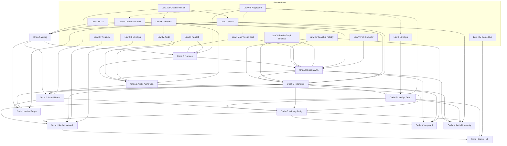

# Aethel Engine — Supremacy Roadmap (Canonical)

**Version:** 4.7 (Planning 100% — A.0 Certificate)  
**Status:** **PLANEJAMENTO A.0 100% ENCERRADO.** Execução **A.1** autorizada pelo Chief Architect.  
**Product path:** `cloud-web-app/web/` (Next 14) + `apps/studio-local/` (Tauri/wgpu)  
**Companion:** [Blueprint v4.7](.cursor/plans/blueprint_de_supremacia_aaa_a7b2ca8f.plan.md)  
**Master index (full corpus map):** [AETHEL_STUDIO_SUPREMACY_INDEX.md](AETHEL_STUDIO_SUPREMACY_INDEX.md) **v1.7** — **§ Document Authority**
**Execution playbook:** [AETHEL_SUPREMACY_EXECUTION_PLAYBOOK.md](AETHEL_SUPREMACY_EXECUTION_PLAYBOOK.md) v1.1  
**Completeness:** [AETHEL_PLANNING_COMPLETENESS.md](AETHEL_PLANNING_COMPLETENESS.md) **v1.2** — **100% planning**  
**Executor map (task queue):** [AETHEL_CLAUDE_EXECUTION_MASTER_MAP.md](AETHEL_CLAUDE_EXECUTION_MASTER_MAP.md) **v1.4**  
**Live ledger:** [AETHEL_FOCUS1_EXECUTION_PROGRESS.md](AETHEL_FOCUS1_EXECUTION_PROGRESS.md)  
**Commerce spec:** [AETHEL_NETWORK_COMMERCE_LIVEOPS_SPEC.md](AETHEL_NETWORK_COMMERCE_LIVEOPS_SPEC.md) (Laws XII–XIII)  
**Game Hub spec:** [AETHEL_GAME_HUB_PLATFORM_GROWTH_SPEC.md](AETHEL_GAME_HUB_PLATFORM_GROWTH_SPEC.md) (Law XIV)  
**Hardware scalability:** [AETHEL_HARDWARE_SCALABILITY_SPEC.md](AETHEL_HARDWARE_SCALABILITY_SPEC.md) (Law XV)  
**AI / Creative Fusion:** [AETHEL_AI_FUSION_CREATIVE_SPEC.md](AETHEL_AI_FUSION_CREATIVE_SPEC.md) (Law XVI)  
**AAA Parity Targets (Absolute Parity Bible):** [AETHEL_AAA_PARITY_TARGETS.md](AETHEL_AAA_PARITY_TARGETS.md) (Micro-Poly, Radiance, Entropy + GAS + World Forge + Workforce AI — doctrine #72 + **Absolute Supremacy Elevation — doctrine #73**)
**Vanguard Technologies (Onda K Bible):** [AETHEL_VANGUARD_TECHNOLOGIES_SPEC.md](AETHEL_VANGUARD_TECHNOLOGIES_SPEC.md) (Neural, 3DGS, Spatial XR)  
**Universal IDE Forge (Onda L Bible):** [AETHEL_UNIVERSAL_IDE_FORGE_SPEC.md](AETHEL_UNIVERSAL_IDE_FORGE_SPEC.md) (Cursor / v0 / Devin parity class)  
**Runtime Immunity (Onda M Bible):** [AETHEL_RUNTIME_IMMUNITY_SPEC.md](AETHEL_RUNTIME_IMMUNITY_SPEC.md) (PSO Vault, Zero-Copy IO, WASM Shield)  
**Studio Pillars S1→S7:** [AETHEL_STUDIO_SUPREMACY_INDEX.md](AETHEL_STUDIO_SUPREMACY_INDEX.md) — Material, World, Animation, MetaSounds, Gameplay, Netcode, Content  

**Execution order (binding):** **Focus 1** (AI brain + real files) → **Focus 2** (renderer + terrain) → **Block 6** (billing) → **Launch Hard Gate #72** → then Hub/G marketing. Doctrines **#55–#64** + **#66** + **#72** + **#73** bind. **Anti-Hype:** Swarm §0a + **#72 simulation-fidelity amendment** + **#73 supremacy-earned clause** (no supremacy marketing label before acceptance suite green). No new planning unless new competitor surface. **Theoretical docs closed 2026-07-09** — execute via Master Map. Billing-first only on live payment fire. See [Apex Doctrine](AETHEL_APEX_DOCTRINE_AND_EXECUTION_FOCUS.md) + [Index § Absolute Supremacy](AETHEL_STUDIO_SUPREMACY_INDEX.md).

### Document Authority (this Roadmap is laws — not the task list)

| Need | Open |
|------|------|
| Laws / Ondas / Zero-MVP | **This Roadmap** |
| Find any binding MD | **Studio Index** § Complete specification map |
| What to code next | **Claude Execution Master Map** (current round) |
| What is already shipped | **Focus Execution Progress** |
| Prices / dual-pool | Plans Canonical + PAYG |
| **Do not follow** | `cloud-web-app/CLAUDE_MASTER_EXECUTION_PLAN_V7\|V8` and siblings — **SUPERSEDED** (Index § Historical) |

**Rule:** Do not invent new MDs to “align” Claude. Annotate Index / Master Map / Progress.

---

## Executive Verdict (Audit-Driven)

Aethel holds **~15,000+ LoC of AAA libraries** (motion matching, spatial audio occlusion, physics worker, Yjs collab, SaveManager, cutscene player, Nanite controllers) that are **not wired** to production paths (`game-loop.ts`, `simulation-tick.ts`, `runtime-main.ts`, viewport).

**Pattern:** excellent scaffolding → zero wiring → honest blockers in code (`native_kernel.rs`, `aaa-renderer-impl.ts`).

This roadmap binds **16 Supremacy Laws** across **Ondas A→M** and **Studio Pillars S1→S7**. No law is aspirational marketing — each cites current gap and target architecture.

**Cross-cutting constraints:**
- **Zero-MVP Doctrine** (below) — governs **all** waves; no reduced-scope shipping.
- **Law VIII** — cloud features are enhancements when online, never hard dependencies for core authoring.
- **Platform Reality Doctrine** (below) — hard ceilings on Web; AAA ceiling on Desktop + **Onda G** console targets.

---

## Zero-MVP Doctrine (Binding — All Waves)

**Philosophy:** Aethel does not ship "good enough" or "for later." If a feature cannot withstand **Onda G** stress and industry parity bars, it is **not done** — it does not ship.

**Rules:**

1. **Expressly forbidden:** MVP, "phase 1 stub," "basic version," "we'll fix in v2," placeholder runtimes presented as production, or any label that defers parity to an unprioritized backlog.
2. **Ondas A→F are not destinations** — they are **sequenced construction** toward **Onda G**, **H**, **I**, **J**, **K**, **L**, **M**, and **Studio S1→S7** (production-tool depth vs UE5). Every wire in A–F must be designed assuming:
   - Onda G **Test Pyramid** (E2E + fuzz + chaos) will hammer it.
   - Onda G **Netcode** (anti-cheat, lag compensation, dedicated authority) will stress it.
   - Onda G **AAA subsystems** (destruction, fluids, foliage, cinematic ACES) will share the same tick budget.
   - Onda G **Omnichannel deploy** (TRC/cert) will audit it.
3. **Definition of Done** for any Onda A–F deliverable requires **G + K + L + M + S-readiness** — see [Studio Index](AETHEL_STUDIO_SUPREMACY_INDEX.md) § S-readiness.
4. **Law III, IV, IX, XI** already forbid MVP language; this doctrine extends that ban to **entire engine surface area**.
5. **Platform Reality Doctrine still applies:** Web published builds never claim console/RT parity; **Onda G console targets = Desktop/Tauri export pipeline only.**

**Executor gate:** PR that introduces `// TODO`, `providerUnavailable` as user-facing success, mock artifacts (`success: true` + empty blob), proxy meshes as shipped characters, or "MVP" in ship docs → **automatic reject** (Law XI Critic + Law XVI + human review).

**Anti-Mock Doctrine (extends Zero-MVP):** Forbidden in ship path — capsule character proxies, MetaSounds play-logs only, empty PCG geometry, agent/API creative split, critic that warns without rejecting.

---

## The Sixteen Supremacy Laws (Binding)

### Law I — Main Thread Liberation (COOP/COEP + SAB)

**Mandate:** The engine MUST run under `crossOriginIsolated === true` with mandatory `SharedArrayBuffer` for simulation state. Zero-copy between ECS transforms and Rapier physics. **CPU culling on the main thread is forbidden** at scale — GPU-driven culling only.

| Today | Target |
|-------|--------|
| COOP/COEP on play/runtime/studio/ide (bk); marketing pages may omit | Headers on all game/studio surfaces (done for play/runtime) |
| SAB layout + playtest bridge + Atomics (bk); fallback-copy without COI | SoA ring buffers: transforms, velocities, GAS attributes |
| Rapier still mainly on main thread (`simulation-tick.ts`) | `physics-worker` + SAB double-buffer (not structured clone) |
| CPU frustum loop in `nanite-streaming-controller.ts:253` | `nanite-worker` or pure GPU indirect draw — **delete CPU hot path** |
| `JobSystem.schedule()` never called | ECS archetype partitions in worker pool |

**Wave ownership:** B (foundation) → C (scale) → D (polish at scale).

---

### Law II — LiveOps Native (God View)

**Mandate:** Published games emit events through a **first-party Telemetry Sink**. Spatial heatmaps (death, dwell time, funnel coordinates) aggregate via **Redis Streams / grid bins**. **Cloud Saves are first-class Prisma citizens** — not a disabled flag on `SaveManager`.

| Today | Target |
|-------|--------|
| Creator analytics → `AuditLog` only | Separate `PlayerEvent` ingest (or correct use of `AnalyticsEvent`) |
| `runtime-main.ts` — zero telemetry | `packages/engine/runtime-telemetry.ts` (IDE-free bundle) |
| Death heatmaps — zero impl | `{ event, x, y, z, sessionId }` → Redis → IDE 3D overlay |
| `cloudSyncEnabled: false`, no `CloudProvider` impl | `GameSave` model + R2 blob + cross-device sync API |
| In-memory funnel buffers | Durable queue (Redis Streams or Postgres OLAP) |

**Wave ownership:** F (full LiveOps) with **F.0 wiring fixes** in Onda A scope only for broken telemetry routes (no player pipeline yet).

---

### Law III — Physical Animation (Active Ragdoll + Euphoria Parity)

**Mandate:** Animation and Rapier forces blend in real time through **Active Ragdoll** with **Active Muscle Simulation** and **Dynamic Balance** — full parity with Euphoria-class engines. Characters recover from impacts, adjust posture under force, and maintain equilibrium while animating. Ragdoll spawn/despawn with continuous muscle-driven correction — **not** inert ragdolls, **not** additive pose overlays, **not** a separate physics-only or animation-only path.

| Today | Target |
|-------|--------|
| Zero ragdoll / active ragdoll matches | Per-bone Rapier capsules + spherical/revolute joints + muscle actuators |
| `physics-engine-real.ts` — no joint API | Joint builders mirrored in Rust `physics_kernel.rs` |
| `simulation-tick.ts:183` — rigid props only | Bone pose sync + active ragdoll ↔ `MotionMatchingSystem` blend |
| Euphoria / muscle sim — missing | **Muscle torque model** per joint group (tension, rest length, activation) |
| Hit reaction — missing | **Impulse → muscle activation → balance recovery** (not pose additive) |
| Dynamic balance — missing | **Balance controller** (CoM tracking, foot placement correction, fall recovery) |

**Technical targets (Onda E — full parity, no deferred scope):**
- **MuscleSimulationSystem:** PD/actuator layers driving joint targets against Rapier constraints each tick.
- **BalanceController:** inverted-pendulum / capture-point style equilibrium on uneven terrain (feeds IK + motion matching).
- **ActiveRagdollBlend:** continuous weight field ragdoll ↔ animation driven by impact magnitude and muscle fatigue — never binary snap.
- **HitReactionPipeline:** collision impulse → localized muscle flinch → global balance correction → motion-matching re-entry.
- **Desktop authority:** muscle + balance solvers in Rust (`physics_kernel` + dedicated module); TS/web receives SAB pose buffers (Law I).

**Prohibitions:**
- Shipping **inert ragdolls** (physics-only corpses with no muscle response) is **forbidden**.
- **Additive pose-only hit reaction** without muscle/balance simulation is **forbidden**.
- Labeling animation physics as "good enough" or deferring Euphoria parity to a later wave is **forbidden**.

**Wave ownership:** B (joint API + actuator hooks) → E (**full** muscle sim + balance + active ragdoll) → D (motion matching + terrain integration at scale).

---

### Law IV — Procedural Audio (MetaSounds Parity)

**Mandate:** **One** spatial audio authority based on **pure Web Audio API** with HRTF for 3D. End fragmentation across Howler, package `AudioManager`, and AI stacks. MetaSounds = compiled graph → `AudioNode` chain, not UI mockup.

| Today | Target |
|-------|--------|
| 4 parallel stacks unwired | Single `SpatialAudioSystem` authority + sample bridge |
| HRTF REAL but occlusão unwired (`spatial-audio-occlusion.ts`) | Rapier `castRay` batch @ 100ms + LPF |
| `SoundCueEditor.tsx` — play logs only | MetaSounds compiler (pattern: `ability-graph-compiler.ts`) |
| `game-loop.ts` — no audio | Listener + emitter tick in sim clock |
| No Rust desktop audio | `cpal` + `symphonia` for Tauri exports (Onda E+) |

**Wave ownership:** E (unification + MetaSounds runtime + occlusion wire). **Complements Law IX** (generative authoring feeds the same runtime).

---

### Law IX — Generative Audio Studio (Hybrid)

**Mandate:** Infinite audio diversity through a **hybrid pipeline** — never a single mode. **Classic** high-fidelity import coexists with **Generative** IDE integrations. All generated audio lands in the **same runtime** as Law IV (`SpatialAudioSystem` + MetaSounds compiler). **Financial protection is absolute:** Aethel never absorbs third-party generative API cost.

#### Two Modes (Onda E)

| Mode | Mandate | Evidence today |
|------|---------|----------------|
| **Classic** | Import WAV/OGG/FLAC and studio-recorded assets at full fidelity via existing asset pipeline | `asset-import-pipeline.ts`, R2 presign, `loadAudio()` |
| **Generative** | IDE integrations: **ElevenLabs** (voice/TTS), **Suno** (music), **AudioLDM** (procedural SFX) | `ai-tools-registry.creative.ts` — music/TTS tools **`providerUnavailable`** (stubs only); `ai-content-generation.ts` declares `audioEndpoint` — unwired |

#### Runtime ingestion (mandatory wiring path)

Generated or imported audio **must** normalize into existing procedural kernels — not a fifth stack:

| Target module | Role | LoC (audit) |
|---------------|------|-------------|
| [`ai-adaptive-music.ts`](cloud-web-app/web/lib/audio/ai-adaptive-music.ts) | Stem-based adaptive music composer; crossfade via Web Audio `GainNode` | 287 |
| [`ai-audio-engine-sfx.ts`](cloud-web-app/web/lib/ai-audio-engine-sfx.ts) | Procedural SFX channel synthesis (`Float32Array`) | 212 |
| `SoundCueEditor` / MetaSounds compiler (Law IV) | Node graph assets referencing imported or generated clips | 670 (UI) |

**Pipeline:** Generative API → decode to `AudioBuffer` / stem files → register in project asset manifest → feed adaptive music / SFX / MetaSounds nodes → spatial core (Law IV).

#### Cost Guard — BYOK or Premium Credits only

| Rule | Implementation |
|------|----------------|
| **BYOK** | User supplies provider API keys (ElevenLabs/Suno/AudioLDM) in encrypted project or account settings; engine proxies but **never** uses platform keys |
| **Aethel Premium Credits** | Metered spend via Prisma `UsageBucket` (`schema.prisma:528-547`) — `requests` / `tokens` windows; debit before provider call |
| **Forbidden** | Platform-funded generative audio; silent API calls without pre-flight budget check |
| **Offline (Law VIII)** | Generative mode **requires network** — UI must show unavailable state; Classic import + local `ai-audio-engine-sfx.ts` synthesis remain fully offline |

**Integration points:** extend `redis-cost-guard.ts` / `lib/observability/cost-guard.ts` pattern; emit `onCloudLimitWarning` (Decision #9) before provider dispatch; block call if BYOK missing and credits exhausted.

**Wave ownership:** **Onda E** (provider adapters + asset ingest + Cost Guard gate). **Not Onda A.**

**Prohibitions:**
- Calling generative APIs without BYOK or credited `UsageBucket` authorization is **forbidden**.
- Storing generative output outside project asset manifest (orphan blobs) is **forbidden**.
- A fifth parallel audio stack for generative output is **forbidden** — Law IV authority only.

---

### Law X — UI/UX Supremacy and Premium Aesthetics

**Mandate:** Raw functionality exists across the IDE (outliner, properties, viewport, docking partial) — **premium AAA polish is missing**. The IDE must read as a **Premium Control Room**: unified design system, dark-native, subtle glassmorphism, modern typography, instant micro-animations. Product value is justified at first glance.

#### State today (audit — no hallucination)

| Surface | Status | Evidence |
|---------|--------|----------|
| CSS tokens `--aethel-*` | **REAL (partial)** | `app/globals.css` — dark bg, rgba panel tokens (`--aethel-panel`), shadows |
| Design system init | **PARTIAL** | `lib/design-system.ts` (20 LoC) — no-op if tokens exist; no component registry |
| Typography | **PARTIAL** | `--font-sans` → Geist Sans (`globals.css:101`); Inter referenced in marketplace SVG only |
| Glassmorphism | **PARTIAL** | Panel rgba values exist; not applied consistently across all floating panels |
| Properties panel | **REAL (functional)** | `PropertiesPanel3D.tsx` (566 LoC) — safe math eval (`new Function` whitelist), Sparkline |
| Docking viewport | **REAL** | Viewport DockPanel wired |
| IDE dual-layout / chat overlay | **PARTIAL** | Chat floating; universal DockPanel migration pending (Onda A.4) |
| QA design consistency | **REAL (gate)** | `npm run qa:design-system-consistency`, `qa:hardcoded-colors`, `qa:button-types` |
| i18n | **REAL** | EN canônico via react-i18next (no PT-BR in UI) |

**Gap:** tokens exist but **334+ components violate 500 LoC / consistency**; floating panels lack unified glass treatment; micro-interactions not systematic; workbench vs viewport visual language diverges.

#### Mandatory targets (Onda A → D)

| Requirement | Specification |
|-------------|---------------|
| **Design System authority** | Single `@/components/ui` + `var(--aethel-*)` tokens — **zero hex in TSX** (existing gate enforced) |
| **Dark mode native** | All surfaces via **HSL CSS variables** (`--aethel-*`); no hardcoded theme branches in components |
| **Glassmorphism** | Floating/docked panels: `backdrop-filter`, `--aethel-panel` / `--aethel-panel-strong`, consistent border `--aethel-border-primary` |
| **Typography** | **Inter** (or Geist with Inter fallback) as canonical `--font-sans`; mono for code/Sparkline |
| **Micro-animations** | 150–200ms ease on panel open, tab switch, property commit; use existing motion tokens — no layout thrash |
| **Control Room layout** | Onda A.4: universal `DockPanel` + chat docked; eliminate floating overlay as primary pattern |
| **Premium density** | Properties/outliner: Sparkline, drag-drop asset fields (`AETHEL_ASSET_DRAG_MIME`) — polish pass on spacing, focus rings, empty states |

#### Wave ownership

| Wave | UI/UX deliverables |
|------|-------------------|
| **A.4** | Universal DockPanel; chat as dock panel; design-system class on all dock surfaces |
| **A.6 gate** | `qa:design-system-consistency` + `qa:hardcoded-colors` clean on touched files |
| **B–C** | Viewport + workbench visual unification; glass panel component canonical |
| **D** | Premium polish pass: micro-animations, empty states, loading skeletons — **Frostbite-tier IDE chrome** |

**Prohibitions:**
- New UI surfaces without `var(--aethel-*)` tokens is **forbidden**.
- Hex colors in TSX is **forbidden** (existing QA gate).
- Floating chat overlay as permanent primary layout after Onda A.4 is **forbidden**.
- Shipping IDE panels that look like default shadcn/bootstrap without Aethel glass/dark treatment is **forbidden**.

---

### Law V — Render Graph + Bindless (Vanguard — No Hardcoded Passes, No Draw-Call Bottleneck)

**Mandate:** Future WebGPU renderer (desktop wgpu + web experimental path) **MUST** be built on a **dynamic Render Graph (Frame Graph)**. Topology is assembled per frame. Automatic GPU memory aliasing. Modular insertion of SSGI, RT, volumetrics **without** pass-order coupling.

**Bindless mandate (Onda C–D):** wgpu desktop **MUST** use bindless + indirect draw. **Law XV carve-out:** `webgl2` blueprint (Safari) uses classic binding — bindless not required on that path.

| Today | Target |
|-------|--------|
| WebGL2 hardcoded pass chain in `aaa-renderer-impl.ts` | Accept as legacy production path until Onda C |
| Per-draw `bindGroup` / texture slot churn (WebGL2 path) | **Prohibited** on WebGPU/wgpu path |
| `aaa-renderer-webgpu.ts` — init/plan stub only | Frame Graph kernel + bindless heap before any RT/SSGI feature |
| No `RenderGraph` symbol in `lib/` | `render-graph/` module: passes as nodes, barriers, transient resources |
| CPU submits one draw per mesh/material | Single (or few) indirect draw batches; GPU consumes instance buffer |
| Nanite/Lumen code islands | Pass nodes + bindless resource tables registered via feature flags |

**Prohibitions:**
- Rewriting WebGPU renderer as a sequential list of hardcoded passes is **forbidden**.
- Per-object/per-material GPU resource binding on the WebGPU/wgpu path is **forbidden** after Onda C kickoff.

**Technical targets (Onda C foundation, Onda D scale):**
- Global **Bindless Array** heaps: textures (VT page table + physical pool), vertex/index streams, material constants (SoA `Float32Array` upload once per frame).
- **Indirect command buffer** generated on GPU (culling compute → `drawIndexedIndirect` / `multiDrawIndirect`).
- Render Graph pass nodes declare **read/write** on bindless tables, not individual bind groups per draw.

**Wave ownership:** C (Frame Graph kernel + bindless heap + first indirect pipeline) → D (SSGI, RT, VT page table as bindless graph nodes at scale).

---

### Law VI — Distributed Cook (Vanguard — Hybrid Asset Pipeline)

**Mandate:** Heavy cook work (KTX2 texture compression, meshopt, BVH/cluster generation) **MUST** scale to **cloud-native workers** during publish/build. Developer machine stays free; iteration time approaches instant for local edits (defer heavy stages to cloud queue).

| Today | Target |
|-------|--------|
| `studio-local-cook-queue.ts` — `executionAllowed: false`, planning only | Cloud dispatch for `texture-compress`, `mesh-optimize`, BVH stages |
| `server/workers/asset-optimizer-worker.ts` — Node backend | Same contract as publish pipeline stages |
| Local Tauri `asset_cooker.rs` — BC1 watcher only | Local = fast preflight + hash; cloud = heavy compress |
| Export caps 1 GiB / 200 MiB per asset without VT | KTX2 + meshopt via distributed cook → VT-ready payloads |

**Wave ownership:** A.2 (Range Fetch + KTX2 loader foundation) → B (ChunkLoader) → C (distributed cook orchestrator in publish pipeline).

---

### Law VII — Visual Script Compiler (Vanguard — WASM / Data-Oriented)

**Mandate:** Visual Script execution **MUST NOT** remain generic JS closures/objects per entity at runtime. The Onda C compiler emits **WASM modules** or **flat bytecode / DOTS instructions** executable in **Workers** with SAB — aligned with Law I.

| Today | Target |
|-------|--------|
| `visual-script-transpile-stage.ts` emits **TypeScript classes** | Phase 1: TS (publish) → Phase 2: WASM/bytecode (Onda C) |
| `visual-script-integration.ts` — `new VisualScriptRuntime` per entity | Single VM / WASM instance + SoA entity indices |
| `performRaycast()` returns `null` | Compiled ops call physics SAB interface |
| No wasm in `lib/visual-script/` | `aethel-vs-bytecode` + worker executor + SAB entity table |

**Prohibition:** Shipping 10,000-entity games with per-entity JS interpreter loops on main thread is **forbidden** after Onda C.

**Wave ownership:** C (bytecode/WASM compiler + worker executor) — builds on A.3 physics SAB and B COOP/COEP.

---

### Law VIII — Airgapped Ready (Offline-First)

**Mandate:** Aethel Desktop (Tauri) and exported games **MUST** remain fully usable without internet or Aethel cloud availability. Cloud sync, distributed cook, and LiveOps ingest are **store-and-forward** — never blocking. The engine is **airgapped ready** by default.

#### Impact Analysis — Three Fronts (Audit v3.2)

**1. Next.js / API Routes vs Tauri IPC (The Always-Online Trap)**

| Surface | Today | Offline behavior |
|---------|-------|------------------|
| Web Studio (`useIDEBackend`) | Always `WebIDEBackend` → `fetch('/api/files/fs')`, `/api/files/tree`, `/api/render/jobs` | **FAILS** without Next server + network |
| Tauri Studio (`StudioLocalApp.tsx`) | `NativeIDEBackend` → Tauri `fs_read` / `fs_write` / `fs_tree` (`desktop_commands.rs`) | **REAL** — local disk via IPC, no HTTP |
| Yjs / Visual Script | `visual-script-collaboration.ts` — offline-first IndexedDB; `connect()` opt-in | **REAL** for solo edit |
| AI / render jobs | `/api/render/jobs`, cloud LLM routes | **FAILS** offline (graceful degrade required) |

**Target architecture — `LocalApiGateway`:**
- **Desktop:** Tauri command router intercepts any `/api/*` shim; resolves to **SQLite project DB** (metadata) + **scoped filesystem** (same security model as `ProjectRootState` in `desktop_commands.rs`). No HTTP loopback required for core IDE.
- **Web (optional online):** existing Next API routes unchanged when connected.
- **Mode flag:** `ConnectivityMode: 'online' | 'offline' | 'degraded'` surfaced to UI; Law VIII forbids hard crash on `fetch` failure for file/scene/save paths.
- **RocksDB VFS (Onda F desktop):** content-addressed blob index for 500 MB+ assets; SQLite holds sync queue metadata until RocksDB lands.

**2. Offline Asset Logistics + Pending Sync Queue**

| Surface | Today | Gap |
|---------|-------|-----|
| R2 presign upload | `presign/route.ts` — UUID keys, requires network | 500 MB import **cannot** upload offline |
| Workspace VFS | `filesystem-runtime.ts` — scoped disk when Next runs | Works **only** if local Next server is up |
| Desktop mmap | `mmap_commands.rs` — zero-copy local reads | **REAL**; not wired to Content Browser import flow |
| Cook pipeline | `studio-local-cook-queue.ts` — planning only | Local Tauri `asset_cooker.rs` partial fallback |

**Target architecture — `LocalAssetDepot` + `SyncQueue`:**
- Import 500 MB GLB **offline** → write to `project/.aethel/depot/{sha256}` (CAS path) + SQLite row `{ hash, virtualPath, syncState: 'pending' }`.
- **SyncQueue** table: `{ op: 'upload'|'cook'|'dedup-check', payloadHash, retryCount, lastError }` — processed FIFO when `ConnectivityMode === 'online'`.
- **Conflict rule:** content-hash wins; UUID presign keys deprecated for depot (aligns with Onda F CAS — Law VIII does not corrupt Law VI; cloud cook is **async enhancement**).
- **Distributed Cook (Law VI):** when offline, run **local** compress stages (Tauri worker / Node sidecar); when online, dispatch heavy stages to cloud and mark queue `delegated`.

**3. Buffered Telemetry (Store-and-Forward) — Law II Amendment**

| Surface | Today | Gap |
|---------|-------|-----|
| Creator analytics | `analytics.ts` — re-queues on `fetch` failure | **In-memory only** — lost on tab close / crash |
| Player telemetry (planned) | `runtime-main.ts` — none | Would lose heatmap data offline |
| LiveOps Redis | Onda F target | Must not assume always-connected player |

**Target architecture — `TelemetrySpool`:**
- Durable local buffer: **IndexedDB** (web/play) or **SQLite** (Tauri) — ring buffer with `{ event, x?, y?, z?, sessionId, ts, synced: false }`.
- Flush worker: listens to `online` / `visibilitychange` / periodic retry; POST batch when network available; mark rows `synced` on ACK.
- **Law II compliance:** heatmaps and retention remain accurate after reconnect — no silent drop.
- Published runtime (`packages/engine/runtime-telemetry.ts`, Onda F) **must** use spool before any network call.

| Today | Target |
|-------|--------|
| Web Studio hard-depends on `/api/*` | `LocalApiGateway` + `NativeIDEBackend` parity for all core paths |
| Tauri file IPC REAL; web always HTTP | Unified `IIDEBackend` factory: Tauri → native, browser → gateway with offline cache |
| R2 presign required for asset ingest | `LocalAssetDepot` + `SyncQueue` — cloud upload deferred |
| Analytics flush in-memory retry | `TelemetrySpool` durable store-and-forward |
| No connectivity mode | `ConnectivityMode` enum + graceful UI degrade |

**Prohibitions:**
- Core authoring (open project, edit scene, sculpt terrain, save locally, play in viewport) **must not** require network.
- Silent data loss on offline sessions is **forbidden** (telemetry, assets, saves).

**Wave ownership:**
- **A.0 (docs):** Law VIII documented; connectivity contract in architecture docs.
- **B:** `LocalApiGateway` skeleton (Tauri intercept) + `ConnectivityMode` provider.
- **B:** `LocalAssetDepot` local CAS write path (no presign required).
- **F:** `SyncQueue` cloud reconciliation + `TelemetrySpool` + `GameSave` cloud sync (Law II).
- **All waves:** every new feature passes **offline acceptance criteria** before merge.

---

### Law XI — Aethel Fusion (Anti-Laziness Orchestration)

**Mandate:** The IDE Copilot is **not** a single giant model with full-project context prone to laziness, `// TODO` stubs, and "loss in the middle." All agent orchestration (Onda **A.5** wiring + Onda **D** maturity) follows the **Aethel Fusion protocol** — multi-role, scoped context, deterministic validation.

#### State today (audit)

| Component | Status | Evidence |
|-----------|--------|----------|
| Fusion model router | **REAL (partial)** | `lib/ai/intelligent-model-router.ts`, `fusion-role-map.ts`, `ai-service.ts` — task-kind routing |
| Agent tool bus + modes | **REAL (partial)** | `lib/production/agent-tool-bus.ts` — modes include `Builder`, `QA`, `Coordinator`; **zero imports in chat UI** |
| Micro-context chunks | **REAL (partial)** | `lib/ai/deep-context-manager.ts` — category-scoped `ContextChunk`; `deep-context-context-pack.ts` |
| Task evidence ledger | **REAL** | `lib/production/task-evidence-ledger.ts` — receipts for tool decisions |
| Actor-Critic loop | **MISSING** | No generate→adversarial-review→reject pipeline |
| Mandatory validation gate (TS + Rust) | **MISSING** | No `npm run typecheck` / `cargo check`+`clippy` block before surfacing AI patches |

#### Protocol (binding)

**0. Anti-Laziness (#66) — first line before L.5**

- Every Fusion leg injects the anti-truncation system prompt.
- **LazyInspector** scans new hunks for elision/`TODO`/`FIXME` stubs **before** ProjectValidationGate; REJECT → `settle: 0` + ≤2 retries.
- Maestro/MoA chunk apply surface ≤ ~**300 LoC** per task.
- Canonical: [`AETHEL_ANTI_LAZINESS_PROTOCOL.md`](AETHEL_ANTI_LAZINESS_PROTOCOL.md).

**1. Actor-Critic (dual-model discipline)**

| Role | Agent mode | Mandate |
|------|------------|---------|
| **Actor** | `Builder` / `Creative` | Generates code, assets, or graph edits within scoped tool invocation |
| **Critic** | `QA` (adversarial) | Reviews Actor output; **rejects** if: `// TODO`, `FIXME`, placeholder stubs, empty catch blocks, `@ts-ignore`, or diff exceeds scoped paths |
| **Coordinator** | `Coordinator` | Sequences Actor→Critic; no direct user-facing patch without Critic pass |

Rejected outputs return to Actor with Critic diff notes — max **3 iterations** then escalate to human.

**2. Micro-context isolation (no whole-project vision)**

- No agent receives the full repo in one prompt.
- Context = **surgical slice** from `DeepContextManager` by `{ category, targetPaths, tokenBudget }` — typically ≤8k tokens per phase.
- `deep-context-context-pack.ts` builds packs per task; **forbidden** to attach unbounded file trees.
- Aligns with Law VIII offline: local context packs work without cloud embedding APIs.

**3. Deterministic validation gate (non-negotiable — dual stack)**

Before any AI-generated code patch is shown or applied:

**Web / TypeScript** (`cloud-web-app/web/`):

```
npm run typecheck  → MUST pass
npm run lint       → MUST pass on touched files (Onda A.6 gate)
npm run test       → MUST pass when touched modules have tests
```

**Desktop / Rust** (`apps/studio-local/src-tauri/` — **MANDATORY if any `.rs` file is in the diff**):

```
cargo check                    → MUST pass (Rust typecheck)
cargo clippy -- -D warnings    → MUST pass (zero warnings)
cargo test                     → MUST pass
```

Applies to all AAA desktop kernel paths: `physics_kernel`, wgpu renderer, `gpu_culling`, GAS (`gameplay_ability_system.rs`), `hardware_detector`, Tauri IPC, etc.

**Mixed PR:** both gate sets required. **Critic QA is strictly forbidden** from approving Desktop/backend changes without green `cargo check` + `cargo clippy`.

Failure on any gate = automatic Critic rejection — **no user bypass**. Optional: targeted `npm run test` / `cargo test` module filters in Onda D.

**Integration (Onda A.5):** wire `agent-tool-bus.ts` → chat UI with receipts (`task-evidence-ledger.ts`); Actor-Critic loop in `agent-tool-job-runner.ts` runs **applicable gate set** from diff paths (`.ts`/`.tsx` vs `.rs`).

**Wave ownership:** **A.5** (bus wiring + dual validation gate) → **D** (full Fusion maturity, critic model routing, test gate).

**Prohibitions:**
- Single-model full-repo Copilot responses to user is **forbidden** after Onda A.5.
- Surfacing AI code without applicable validation gates pass is **forbidden**.
- Critic approving `.rs` patches without `cargo check` + `cargo clippy -- -D warnings` is **forbidden**.
- Approving diffs containing `// TODO` / placeholder returns as final output is **forbidden**.

---

### Law XII — Universal Commerce & Aethel Treasury

**Mandate:** Aethel is **Merchant of Record** for the **Aethel Network** — closed-loop premium economy, universal cross-game cosmetics, UGC marketplace with Compression Mandate, and creator payouts via Stripe Connect. **No developer-local payment processing.**

| Today | Target |
|-------|--------|
| IDE extension marketplace only | **Universal Store** — cosmetics, weapons, avatars |
| `CreditLedgerEntry` = AI credits | **`AethelCoinLedger`** — premium coins separate domain |
| `PLATFORM_TAKE_RATE=0.12` single constant | **Dual lanes:** 30/70 Universal Store; 12% in-game IAP server offset |
| No `PlayerOwnedItem` / Backpack | **Aethel Backpack** (CAS lazy load) + per-game SQLite inventory |
| Cook queue `executionAllowed: false` | **Compression Mandate** — Draco + KTX2 + LOD gate before listing |
| Runtime billing stub | `Aethel.Store.PromptPurchase` + hold-to-confirm overlay |
| No P2P resale | Community market — 10% platform fee + creator royalty |

**Full specification:** [AETHEL_NETWORK_COMMERCE_LIVEOPS_SPEC.md](AETHEL_NETWORK_COMMERCE_LIVEOPS_SPEC.md) §1–4.

**Wave ownership:** **Onda H** (H.1–H.6) — CAS foundation from Onda F; KTX2 from Onda A.2.

**Prohibitions:**
- Conflating AI `CreditLedgerEntry` with player Aethel Coins is **forbidden**.
- Listing universal assets without remote cook + moderation pass is **forbidden**.
- Universal items carrying game stats into competitive worlds (`allowUniversalAssets: true` without sanitization) is **forbidden**.

---

### Law XIII — Immutable LiveOps (Blue/Green + Live Tuning)

**Mandate:** Live online games **never** receive in-place code injection on active player sessions. Deploy uses **blue/green fleets**; numeric balance changes use **Redis tuning buffers** applied only at **match/respawn boundaries** — never mid-physics tick.

| Today | Target |
|-------|--------|
| `DeploymentPipeline` schema only | **Blue/green orchestrator** — drain vN before kill |
| No live tuning API | IDE **LiveOps tab** → Redis buffer → runtime poll on boundary |
| `runtime-main.ts` — no match events | `match_start` / `match_end` / disconnect for fleet drain |
| Publish = single artifact swap | New fleet vN+1; matchmaking routes new players only |

**Full specification:** [AETHEL_NETWORK_COMMERCE_LIVEOPS_SPEC.md](AETHEL_NETWORK_COMMERCE_LIVEOPS_SPEC.md) §5 + Law XIII.

**Wave ownership:** **Onda H.7** — TelemetrySpool prerequisite from Onda F; deterministic sim from Onda C for safe tuning.

**Prohibitions:**
- Hot-patching Rapier/GAS state on connected players mid-combat is **forbidden**.
- "Hack live" server restarts with mixed code versions is **forbidden**.

---

### Law XIV — Aethel Game Hub & Platform Growth

**Mandate:** The **Game Hub** (`/arcade` → `/hub`) is a **retention-first discovery network** — not a static catalog. Fair launch visibility, verified reviews, frictionless demos, unified social identity, and Steam-parity showcase pages. Without XIV, Law XII economy sits on a **Cemetery of Indies**.

| Today | Target |
|-------|--------|
| `/arcade` static sort by `publishedAt` | **Discovery Feed** — launch guarantee + retention score + paid lane (XII) |
| No reviews | **Verified playtime** reviews (2h gate via Law II telemetry) |
| Single web `playUrl` | **5-min demo slice** + full desktop download CTA |
| No friends/presence | **Aethel Social Graph** — rich presence + deep link join |
| Basic detail page | **Game Showcase** — cinematic hero, media strip, live pulse |
| `SaveManager` cloud off | **Cross-save** via `GameSave` (Onda F + I.7) |
| Cross-play | **Post G.2** — honesty badges until ready |

**Full specification:** [AETHEL_GAME_HUB_PLATFORM_GROWTH_SPEC.md](AETHEL_GAME_HUB_PLATFORM_GROWTH_SPEC.md)

**Wave ownership:** **Onda I** — requires **F.2** telemetry, **F.1** GameSave; **I.8** cross-play gated on **G.2**.

**Prohibitions:**
- Organic feed disguising paid promotion is **forbidden** (must label "Promoted").
- Reviews without telemetry-verified playtime is **forbidden**.
- Cross-play marketing before G.2 netcode production is **forbidden**.

---

### Law XV — Scalable Fidelity (Capability Score 0–100)

**Mandate:** No exported game may assume a dedicated GPU. The engine adapts via **Capability Score (0–100)** — continuous, not rigid tiers — driving **Scalable Render Graph blueprints**, **UMABudgetPolicy**, **CullingPolicy** (CPU/GPU), and **FSR upscaling**. Visual marketing claims must match detected capability.

| Today | Target |
|-------|--------|
| Hardcoded WebGL2 pass chain only | **ScalableRenderGraph** — blueprint per score band |
| No capability detection | `HardwareStaticProfile` + `HardwareDynamicProfile` (<50ms probe + runtime) |
| `hardware_profiler.rs` — CPU/RAM only, VRAM null | Extend → `hardware_detector.rs` + score mapping |
| `gpu_culling.rs` — GPU-only | **CullingPolicy** — CPU workers when GPU bottleneck (Lei I) |
| No UMA asset cap | **UMABudgetPolicy** on `LocalAssetDepot` / chunk stream |
| No FSR / dynamic scale | FSR graph node; `recommendedInternalScale` from dynamic profile |
| Baked lighting optional | **Mandatory** `baked-lighting` publish stage (all exports) |
| Safari excluded implicitly | **WebGL2 blueprint official** — Apple ecosystem included |

**Blueprint labels (derived from score):** `enthusiast` 75–100 | `discrete` 45–74 | `integrated` 20–44 | `webgl2` 0–19.

**Full specification:** [AETHEL_HARDWARE_SCALABILITY_SPEC.md](AETHEL_HARDWARE_SCALABILITY_SPEC.md)

**Wave ownership:** **B.1** (static probe) → **C** (graph + culling) → **D** (FSR + RT enthusiast) → publish bake (Law VI).

**Prohibitions:**
- Assuming dedicated GPU in export defaults — **forbidden**.
- Ignoring capability score for render path — **forbidden**.
- Hub listing Tier-3-friendly game without baked lightmaps — **forbidden**.

---

### Law XVI — Creative Fusion (No Mock Artifacts + Chief Architect Travas)

**Mandate:** Every generative path MUST produce **real artifacts** in manifest, spawn in viewport when applicable, and record **evidence receipts**. **Custody chain:**

`Intent → CostGuard → Squad → Fusion → Provider → Yjs Transaction → Manifest → Viewport → Ledger`

#### Trava I — Cost Guard Extendido (Law IX extends to all J)

- **CreativeBridge (J.1)** is the **mandatory choke point** for every paid provider call (J.1–J.12).
- **BYOK** or **`UsageBucket` reserve/settle** before dispatch — pattern: `creative-cost-guard.ts` + `credit-wallet.ts`.
- **Zero platform-funded generative calls** for free-tier users — fail-closed, not mock success.

#### Trava II — Undo Transacional Yjs/CRDT

- All manifest / viewport / VS / SoundCue / Quest / BT writes inside **`CreativeFusionTransaction`**.
- **Ctrl+Z** reverts entire AI apply atomically (target ≤1 ms local).
- Ledger stores `transactionId` + Yjs snapshot hashes before/after.

#### Trava III — VideoToMechanic Platform Reality (J.6)

- **Allowed:** State Machine blueprint + Behavior Tree scaffold from video logic extraction.
- **Forbidden:** Auto physics, combat, netcode, or "video → GTA" claims.
- User wires Rapier/GAS/Visual Script after scaffold.

| Today | Target |
|-------|--------|
| Agent/API split; CostGuard partial on HTTP only | **CreativeBridge + CreativeCostGuard** on all J paths (Trava I) |
| AI graph edits without unified undo | **CreativeFusionTransaction** + Yjs (Trava II) |
| VideoToMechanic undefined scope | **video-to-scaffold-extractor** — BT/state machine only (Trava III) |
| Critic append-only | Actor→Critic **reject** + typecheck (Law XI + J.2) |
| Hash RAG ~120 files | **VectorIndex (J.4)** + **MultiSurfaceContextPack (L.14)** |
| Orchestrator **disabled** in production | **OrchestratorProd** (J.12) |
| Capsule proxy characters | **UsdIntegrator** (J.7) |
| Dual tool buses | **ACP Unification** (J.11) |

**Full specification:** [AETHEL_AI_FUSION_CREATIVE_SPEC.md](AETHEL_AI_FUSION_CREATIVE_SPEC.md) v1.1

**Wave ownership:** **A.5** → **J.1–J.12** — parallel with B→E.

**Prohibitions:**
- `success: true` with empty artifacts — **forbidden**.
- Bypassing CreativeBridge or CostGuard — **forbidden** (Trava I).
- Manifest/viewport write without Yjs transaction — **forbidden** (Trava II).
- VideoToMechanic auto-physics/combat — **forbidden** (Trava III).
- Marketing "video → playable AAA clone" — **forbidden forever**.

---

## Platform Reality Doctrine (Hard Limits — Non-Negotiable)

This doctrine constrains **all 16 Laws**. Marketing and export claims must respect it. Decision #10 (Graceful Degradation) is subordinate to these physical facts. **Law XV operationalizes** graceful degradation via Capability Score.

### Web — The Spectacular Trojan Horse

**Role:** Fast iteration, cloud authorship, collaboration (Yjs), publish pipeline, lightweight playtests.

**Hard walls (audit-evidenced):**

| Limit | Reality | Evidence |
|-------|---------|----------|
| **V8 heap ~4 GB tab ceiling** | Browser tabs die hard at heap pressure — no native swap | `workers/oom-sentinel.worker.ts` — 92% threshold `PAUSE_ENGINE` (110 LoC, **unwired**); no graceful recovery if sentinel absent |
| **Main thread** | Sim + render + physics compete on one thread until Law I lands | Audit Pilar 9 — no SAB/COOP/COEP today |
| **WebGPU immaturity** | Safari / Apple ecosystem forces **WebGL2 fallback** for production path | `aaa-renderer-webgpu.ts` `planAethelRenderer()` — falls back when `navigator.gpu` missing or init fails |
| **No desktop RT / bindless ceiling** | Laws V bindless on **wgpu desktop**; web shipping = WebGL2 blueprint (Law XV) | `aaa-renderer-webgpu.ts` fallback |
| **50 km² + thousands NPCs** | **Not viable** on web/V8 today | Audit Pilar 9 verdict |

**Web promise (honest):** Best-in-class **creation UX** and **published lightweight titles** — not Frostbite-class runtime scale.

### Desktop (Tauri + Rust) — The True AAA Platform

**Role:** Absolute performance ceiling, open-world scale target, native tooling, offline-first (Law VIII).

| Capability | Desktop only | Evidence |
|------------|----------------|----------|
| **Unbounded native RAM** | mmap CAS, large asset depot | `mmap_commands.rs`; desktop `ProjectRootState` |
| **Rayon parallelism** | ECS/physics parallel ticks | `ecs_parallel.rs`, `gameplay_ability_system.rs` — **benchmark only**, unwired |
| **wgpu Render Graph + RT** | Laws V–D full bindless + experimental RT | `apps/studio-local` wgpu init; renderer dropped today |
| **Euphoria-class muscle sim** | Law III authority in Rust | Planned `physics_kernel` extension |
| **100 GB worlds + VT** | ChunkLoader + desktop cache | Onda B–D |

**Desktop promise:** Parity target with UE5.4-tier **authored desktop exports** — the only platform where Laws I, III, V, VI reach full expression.

### Graceful Degradation Matrix (Export Policy)

| Feature | Web published game | Desktop export |
|---------|-------------------|----------------|
| Render | WebGL2 blueprint + Capability Score | wgpu ScalableRenderGraph + FSR + RT (score 75+) |
| Capability adaptation | **Law XV** — score 0–100 | None today |
| World scale | Strict budgets; no 50 km² claim | World Partition target |
| Physics scale | Capped entities | Full Rapier + worker/SAB |
| AI Copilot | Fusion with cloud models (online) | Fusion + local SLMs (Law VIII offline) |
| LiveOps | TelemetrySpool → cloud when online | Same |
| Universal commerce | Aethel Coins subset; sensory store in hub | Full Treasury + backpack in export |

**Forbidden claims:** Selling web runtime as equal to desktop AAA; promising Nanite/Lumen/RT on web shipping builds; ignoring 4 GB OOM in playtest marketing.

---

## Wave Map — How AAA Parity Is Reached



### Onda A — Connect the Islands (Blocked until explicit Agent execution order)

| Step | Scope | Laws touched |
|------|-------|--------------|
| A.0 | `CLAUDE.md` / `.cursorrules` + 11 Leis + Platform Reality Doctrine | All (docs) |
| A.1 | Wire `terrain-engine-runtime` → `LandscapeEditor` | — |
| A.2 | Range Fetch `s3-client.ts` + KTX2 loaders | VI (foundation) |
| A.3 | `physics-worker` + real `castRay` / `performRaycast()` | I (precursor), VII |
| A.4 | Universal DockPanel + chat dock + glass tokens | **X** |
| A.5 | `agent-tool-bus` → chat + Actor-Critic + **typecheck gate** | **XI** |
| A.6 | `typecheck` + `lint` clean | — |

**Explicitly NOT in Onda A:** Render Graph, WASM VS, cloud cook dispatch, COOP/COEP, MetaSounds runtime, cloud saves, ragdoll.

---

### Onda B — Native Cores + Threading Foundation

**Goal:** Unlock scale prerequisites (Law I, III partial) + **offline core (Law VIII)**.

- COOP/COEP + `crossOriginIsolated` gate + SAB proof-of-concept
- `physics-worker` with SAB ring buffer (eliminate `Object.fromEntries` per frame)
- wgpu upgrade; GAS Rust IPC binary (bytemuck/mmap — JSON forbidden @ 60 Hz)
- Rapier joint API (TS + Rust mirror) — ragdoll prerequisite
- R2 ChunkLoader + Range Fetch production path
- **`LocalApiGateway`** (Tauri `/api` intercept → SQLite + local FS)
- **`LocalAssetDepot`** — offline CAS import without presign
- **`ConnectivityMode`** provider + graceful degrade for AI/render jobs
- **B.1 Law XV:** `hardware_detector.rs` + `hardware-profile.ts` — Capability Score 0–100 static probe; extend `hardware_profiler.rs`

---

### Onda C — AAA Scale (Parity Inflection)

**Goal:** Laws I, V, VI, VII come alive — combat, render architecture, distributed build, script VM.

| Deliverable | Law | Evidence anchor |
|-------------|-----|-----------------|
| Dynamic **Scalable Render Graph** kernel (Capability Score blueprints) | XV, V | `packages/engine/render/scalable-render-graph/` |
| **Velocity buffer (motion vectors MRT)** | V, **K.0** | G-buffer contract for future Neural Upscale — [`AETHEL_VANGUARD_TECHNOLOGIES_SPEC.md`](AETHEL_VANGUARD_TECHNOLOGIES_SPEC.md) |
| **Async compute queue slots** in graph scheduler | V, **K.0** | Radix sort + Micro-Poly cull barrier policy |
| **CullingPolicy** CPU/GPU dynamic switch | XV, I | Extend `gpu_culling.rs` |
| **UMABudgetPolicy** on asset depot | XV, VIII | Chunk stream cap iGPU |
| Dynamic Render Graph kernel (wgpu + web experimental) | V | Replace pass-list anti-pattern before SSGI/RT |
| **Bindless resource heaps + indirect draw pipeline** | V | Megabuffers; `drawIndirect`; no per-object bind groups |
| Distributed Cook orchestrator (KTX2, meshopt, BVH → cloud workers) | VI | Extend `studio-local-cook-queue` + `asset-optimizer-worker` |
| VS → WASM/bytecode + worker executor + SAB entity table | VII, **M.0** | Replace `visual-script-transpile-stage.ts` TS-only output; WASM Shield boundary |
| **PSO fingerprint registry** (cook + Render Graph hook) | V, **M.0** | [`AETHEL_RUNTIME_IMMUNITY_SPEC.md`](AETHEL_RUNTIME_IMMUNITY_SPEC.md) — PSO Vault |
| **Async asset IO interface** (zero-copy path hook) | VI, **M.0** | VT + future DirectStorage sidecar |
| ECS worker pool; deprecate or merge dual ECS | I | `ecs-dots-system` vs `game-engine-core` |
| GPU-driven culling; remove CPU Nanite hot loop | I | `nanite-streaming-controller.ts:253` |
| PCG Graph runtime; combat hit → GAS chain | **S2**, S5 | [`AETHEL_WORLD_SYSTEMS_SPEC.md`](AETHEL_WORLD_SYSTEMS_SPEC.md) — non-empty PCG |
| **Material graph compiler hook (S1.0)** | V, S1 | [`AETHEL_MATERIAL_SUBSTRATE_SPEC.md`](AETHEL_MATERIAL_SUBSTRATE_SPEC.md) |
| **Gameplay tags + data asset schema (S5.0)** | VII | [`AETHEL_GAMEPLAY_FRAMEWORK_SPEC.md`](AETHEL_GAMEPLAY_FRAMEWORK_SPEC.md) |
| **Replication intent API (S6.0)** | G.2 | [`AETHEL_NETCODE_PRODUCTION_SPEC.md`](AETHEL_NETCODE_PRODUCTION_SPEC.md) |
| Virtual Texturing in viewport | VI | VT + cooked KTX2 payloads |

**AAA parity after Onda C (honest):** mid-tier AA web/desktop titles with scalable sim architecture — not Frostbite-film yet.

---

### Onda D — Polish Supremacy

**Goal:** Top-tier visual + world scale (Law V bindless at full scene scale, Law I at world partition scale, **Law X premium IDE chrome**).

- Bindless VT page table + physical texture pool at scale (indirect draws for entire visible set)
- Desktop experimental RT as **Render Graph node** reading bindless G-buffer tables
- SSGI + light probes as graph nodes (web permanent path per Decision #1)
- Motion matching wired to real terrain + mocap ingest
- World Partition / streaming at 50 km² **desktop-first** — **[S2](AETHEL_WORLD_SYSTEMS_SPEC.md)**
- **Material Substrate (S1.1–S1.2)** — graph → WGSL viewport preview
- **Sequencer track schema (S3.0)** — fix `DEBT-SEQ-002`
- Cost Guard native events in export policy
- Camera spline + skeletal sequencer tracks
- **Law X polish pass:** glass panels everywhere, micro-animations, unified workbench/viewport aesthetic, QA gates green
- **Law XI Fusion maturity:** full Actor-Critic routing, test gate on AI patches, critic model in Fusion router
- **FSR upscaling graph node** (Law XV) — dynamic internal scale from `HardwareDynamicProfile`
- Experimental RT graph node (score 75+ enthusiast blueprint only)
- **K.0 foundation:** `HardwareDynamicProfile.xrSessionActive` enum + blueprint downgrade policy stub; cook registry slot for `splat-quantize` (Law VI); depth buffer format documented for mesh+splat sharing

**AAA parity after Onda D:** competitive with UE5.4 for authored desktop experiences; web uses `webgl2`/`integrated` blueprints + FSR when score allows.

---

### Onda E — Audio + Animation + Generative Studio

**Goal:** Laws III, IV, and **IX** fully wired at shipping parity.

- Single Web Audio spatial core; HRTF everywhere; occlusão via Rapier
- **[S4 MetaSounds](AETHEL_METASOUNDS_SPEC.md)** — compiler + runtime; VS `audio:play` wired
- **Law IX — Generative Audio Studio:** ElevenLabs / Suno / AudioLDM → ingest → adaptive music/SFX; BYOK/credits
- **[S3 Animation](AETHEL_ANIMATION_CINEMATICS_SPEC.md)** — motion matching, Control Rig, Law III muscle + balance, HitReactionPipeline
- `cpal` desktop playback path

**AAA parity after Onda E:** Euphoria-class animation + unified spatial/MetaSounds audio + hybrid generative studio with Cost Guard — competitive with UE5 tier for authored action titles.

---

### Onda F — LiveOps + Perforce Killer

**Goal:** Laws II + asset depot (audit Pilar 10) + **Law VIII sync/telemetry completion**.

- `GameSave` Prisma + R2 + `CloudProvider` implementation
- `runtime-telemetry.ts` in published bundle + **`TelemetrySpool`** store-and-forward
- **`SyncQueue`** — reconcile `LocalAssetDepot` pending uploads with R2 CAS
- Spatial events → Redis → death heatmap IDE panel (online aggregation; offline spool first)
- CAS upload dedup + `AssetVersion` + Merkle manifest
- Binary checkout lock; scene Yjs locks in viewport UI

**AAA parity after Onda F:** LiveOps + asset depot at production scale — still **not** industry certification tier until Onda G.

---

### Onda G — Production Hardening & UE5 Industry Parity

**Goal:** Transform Aethel from **modern creation tool** to **industry standard** — the final chain link. Onda G is **not a backlog**; it is the **declared finish line** for market parity claims on Desktop/console exports.

**Nuclear rendering bible:** [AETHEL_AAA_PARITY_TARGETS.md](AETHEL_AAA_PARITY_TARGETS.md) — explicit confrontation with **Nanite, Lumen, Chaos/Niagara** via **Aethel Micro-Poly, Radiance, Entropy**. Foundation in Ondas **C–D** (Law V bindless + Render Graph); **ship** in **G.3**.

**Prerequisite:** Ondas A–F substantially complete. Zero-MVP Doctrine: nothing in A–F may ship to customers without G-readiness hooks (see AAA Parity Targets § G-readiness).

#### Pilar G.1 — Test Pyramid & Deterministic Quality

| Deliverable | Target | Today |
|-------------|--------|-------|
| **E2E IDE flows** | Playwright: open project → sculpt → publish → play build | Vitest unit tests only (~193 passing); no E2E gate |
| **Visual regression** | Golden-frame viewport screenshot diff in CI | Missing |
| **Fuzz / property tests** | Asset import corrupt files, malformed graphs, oversized payloads | Missing |
| **Chaos / deterministic stress** | Physics + netcode soak under seeded RNG; rollback hash verification | Rollback blocked until deterministic sim (Onda C) |
| **Performance budgets CI** | Frame ms / memory regression gates per scene fixture | Missing |
| **Frame profiler (Insights-class)** | In-editor + exported build timeline (CPU/GPU/Rapier) | Server OTLP only |

#### Pilar G.2 — Netcode de Alta Escala (Production Multiplayer)

**Canonical spec:** [AETHEL_NETCODE_PRODUCTION_SPEC.md](AETHEL_NETCODE_PRODUCTION_SPEC.md) (Studio **S6**)

| Deliverable | Target | Today |
|-------------|--------|-------|
| **Lag compensation** | Rewind hitscan + entity interpolation documented + tested | `networking-multiplayer.ts` — partial lobby/P2P |
| **Authority model** | Export policy: P2P vs **Dedicated Server** vs listen-server — explicit | Partial stubs |
| **Dedicated server orchestration** | Scale-out match + `LobbySession` hardened | Redis matchmaking REAL; production gaps |
| **Anti-cheat** | Server-side validation hooks + rate limits + anomaly detection | Missing |
| **Deterministic replay** | Input log → replay for debug and esports | Missing |
| **Load test** | Synthetic 1000-player soak on dedicated infra | Missing |

*Design constraint for Ondas C–F:* netcode APIs must expose hooks for G.2 from first wire — no rewrite allowed.

#### Pilar G.3 — Paridade AAA de Subsistemas (UE5/Frostbite Class)

**Nuclear stack (binding — full spec in [AETHEL_AAA_PARITY_TARGETS.md](AETHEL_AAA_PARITY_TARGETS.md)):**

| Codename | UE5 counterpart | Onda G step | Foundation (A–F) |
|----------|-----------------|-------------|------------------|
| **Aethel Micro-Poly** | Nanite | **G.3a** — compute cull + MultiDrawIndirect (+ mesh shaders) | C bindless, C GPU culling, VI meshlet cook |
| **Aethel Radiance** | Lumen | **G.3b–c** — SW voxel trace + HW RT hybrid | D SSGI/RT graph nodes, C G-buffer bindless |
| **Aethel Entropy** | Chaos / Niagara | **G.3d–e** — GPU particles + destruction | C compute, I SAB, B Rapier joints |

| Subsystem | Onda G target | Today |
|-----------|---------------|-------|
| **Micro-Poly streaming** | Meshlet pages + GPU visibility + indirect draw | CPU `nanite-streaming-controller.ts:253`; ID-color debug resolve |
| **Radiance GI** | Real-time hybrid GI — no enthusiast bake | SSGI stubs; light probes unwired |
| **Entropy VFX/destruction** | Compute-only particles + fracture | CPU `NiagaraParticleEmitter`; cosmetic graph |
| **Cinematic pipeline ACES** | End-to-end ACEScg → ACES output; USD/Alembic ingest; spline sequencer (Law III/D) | ACES in WebGL2 bloom path partial; linear camera lerp only |
| **MetaHuman-class characters** | Real facial rig + blendshapes (not capsule proxy) | Capsule proxy (audit Pilar 2) |
| **Vehicle / cloth / hair GPU** | Physics + render integration | Hair toggle cosmetic only |

*Platform Reality:* **Micro-Poly + Radiance + Entropy full stack** on **Desktop wgpu enthusiast** (Law XV 75+). Web gets **graceful subset** (baked + SSGI + FSR — no nuclear claims).

#### Pilar G.4 — Deploy Omnichannel (Console & Certification)

| Platform | Onda G target | Today |
|----------|---------------|-------|
| **PS5 / Xbox / Switch** | Export pipelines + shader permutations + platform abstraction layer | Missing |
| **TRC / XR / Lotcheck compliance** | Automated cert checklist (memory, crash, TRC violations) | Missing |
| **Mobile native (iOS/Android)** | Optional G.4b — out of web wrapper | Missing |
| **Steam / Epic publishing** | Build verification + depot layout | Publish pipeline partial (Onda A prior work) |

*Scope note:* Console SDK access is external dependency — architecture must reserve **Platform HAL** in Rust (`apps/studio-local`) from Onda B onward.

#### Pilar G.5 — Observabilidade de Jogo Publicado

- In-game crash reporting (distinct from platform Sentry)
- Session analytics + **`TelemetrySpool`** (Law II/F) at scale
- Built-in perf overlay in shipped builds
- LiveOps dashboards production-hardened (not admin-only creator metrics)

#### Pilar G.6 — Segurança & Compliance Enterprise

- Penetration test cadence; plugin sandbox audit (`plugin-sandbox-hardened.ts` extended)
- SBOM / dependency audit in CI
- GDPR/LGPD/COPPA flows for player data (extends Law II)
- SOC2-ready controls for B2B studio cloud (optional tier)

#### Pilar G.7 — Ecossistema & Developer Experience

- Public API docs + semver engine SDK
- Curated **Marketplace** with revenue share (extends Onda F CAS)
- Plugin SDK with stability guarantees
- Creator certification program + sample AAA project (dogfooding)

#### Pilar G.8 — Processo de Paridade Viva

- **Dogfooding mandate:** internal title shipped on engine every major release
- **Parity matrix** (below) updated each release — no stale claims
- **G-readiness checklist** on every Onda A–F PR
- Third-party benchmark scenes (public) for reproducible comparisons vs UE5 reference

#### Pilar G.9 — Hardening de Dependências Críticas

- COOP/COEP production rollout playbook (Law I)
- wgpu LTS pin + upgrade runbook (Decision #3)
- Rapier deterministic sim path completed (Decision #6) before anti-cheat claims
- OOM sentinel **wired** + graceful degrade tested (Platform Doctrine)
- Fusion Actor-Critic + full test gate (Law XI)

**AAA parity after Onda G (honest):** **Industry-standard Desktop + console-authored titles** competitive with UE5.4 on **Micro-Poly, Radiance, Entropy** (geometry, GI, GPU VFX/destruction) plus core pillars (animation, audio, multiplayer, LiveOps, cert). **Web remains creation + lightweight publish** — not nuclear parity.

**Wave ownership:** **G** follows **F**; parallel prep from **C** (netcode hooks, Render Graph extensibility, Platform HAL stub in Rust).

---

### Onda H — Aethel Network (Universal Commerce & Immutable LiveOps)

**Goal:** Transform Aethel from **IDE marketplace** to **Epic/Roblox-class universal economy** — Treasury, Backpack, sensory store, P2P market, blue/green LiveOps. **Not optional backlog** — Law XII/XIII finish line for commerce claims.

**Prerequisite:** Onda F (CAS depot + TelemetrySpool) + Onda A.2 (KTX2 loaders). Zero-MVP: no stub store or placeholder backpack.

| Step | Deliverable | Law |
|------|-------------|-----|
| **H.1** | `AethelCoinLedger` + Treasury + Purchase Parity + dual revenue lanes (30/70 vs 12% IAP) | XII |
| **H.2** | Universal UGC publish + **Compression Mandate** (Draco/KTX2/LOD) + AI moderation gate | XII |
| **H.3** | `PlayerOwnedItem` + **Aethel Backpack** + Avatar Room + CAS lazy load | XII |
| **H.4** | `allowUniversalAssets` + `UniversalCosmeticComponent` + runtime loader | XII |
| **H.5** | Sensory commerce UX — `InteractiveDressingRoom`, `RarityVFXContainer`, hold-to-confirm, haptics | X, IV, XII |
| **H.6** | Community market (10% fee) + `AethelEditionRegistry` scarcity (non-blockchain) | XII |
| **H.7** | Blue/green orchestrator + Redis live tuning + IDE LiveOps tab | XIII, II |
| **H.8** | 48h item custody escrow + chargeback backpack revoke + webhook hardening | XII |

**Canonical spec:** [AETHEL_NETWORK_COMMERCE_LIVEOPS_SPEC.md](AETHEL_NETWORK_COMMERCE_LIVEOPS_SPEC.md)

**AAA parity after Onda H (honest):** Universal cross-game cosmetics + creator Treasury loop + immutable LiveOps deploy — competitive with Epic Store + Roblox UGC **on desktop/console exports**. Web = creation hub + lightweight commerce subset.

---

### Onda I — Game Hub & Platform Growth (Law XIV)

**Goal:** Transform **`/arcade`** from static listing into **retention-first Game Hub** — discovery feed, verified reviews, instant demos, social graph, Steam-parity showcase, cross-save. **Without Onda I, Law XII economy has no traffic.**

**Prerequisite:** Onda **F.1–F.2** (GameSave + player telemetry); Onda **H.3** (unified account); **I.8** cross-play blocked until **G.2**.

| Step | Deliverable | Law |
|------|-------------|-----|
| **I.1** | Discovery Feed (launch guarantee + retention score + promoted lane) | XIV.1 |
| **I.2** | Verified reviews (2h playtime gate) + anti-bombing | XIV.2, II |
| **I.3** | Publish `demo-web-slice` + Instant Demo launcher | XIV.3 |
| **I.4** | Social graph + Rich Presence + deep link join | XIV.4 |
| **I.5** | Hub F2P tabs + tag morph navigation + dynamic theming | XIV.5, X |
| **I.6** | Game Showcase Page (cinematic vitrine) | XIV.6 |
| **I.7** | Cross-save wired (`GameSave` + SaveManager cloud) | XIV.7, F |
| **I.8** | Cross-play matchmaking (post G.2) + honesty badges | XIV.7, G.2 |

**Canonical spec:** [AETHEL_GAME_HUB_PLATFORM_GROWTH_SPEC.md](AETHEL_GAME_HUB_PLATFORM_GROWTH_SPEC.md)

**AAA parity after Onda I (honest):** Discovery + social + vitrine competitive with Steam Store **UX tier** for indie/mid-core; cross-play claims honest only after G.2.

---

### Onda J — Aethel Nexus (Creative Infinite Loop — Law XVI)

**Goal:** Market-best **evidence-backed creative IDE** — prompt → real artifact → viewport → playable loop. **No mock path.** Unifies agent tools, HTTP generative APIs, asset manifest, game production spine, and Fusion governance.

**Prerequisite:** **A.5** (Law XI Actor-Critic + typecheck). **Parallel** with B→E engine wiring — J does not wait for G.

| Step | Deliverable | Law / Trava |
|------|-------------|-------------|
| **J.1** | **CreativeBridge** + **CreativeCostGuard** — all paid calls reserve/settle BYOK/credits first | XVI, IX, **I** |
| **J.2** | **Nexus UI** — Activity Deck, cost preview before send, **Ctrl+Z undo UX**, evidence panel | XI, X, **II** |
| **J.3** | ~~SceneContextPack~~ → **L.14 MultiSurfaceContextPack** (scene slice) — Decision #50 | XVI, XV |
| **J.4** | **VectorIndex** — continuous fs_watch, SQLite-vec embeddings | XVI, VIII |
| **J.5** | **GraphOperator** — SoundCue / Quest / VFX nodes; **Yjs transaction envelope** | XVI, IV, **II** |
| **J.6** | **VideoToMechanic** — **State Machine + BT scaffold only**; user wires physics/GAS | XVI, VII, **III** |
| **J.7** | **UsdIntegrator** — library assets + Meshy cleanup; no proxy capsule | XVI, VI |
| **J.8** | **BrowserOperator** — governed allowlisted fetch/snapshot + CostGuard; CDP farm **HELD** | XVI, IX, **I** |
| **J.9** | **VisualEvidence** — before/after WebM + transaction snapshot hashes in ledger | XI, XVI, **II** |
| **J.10** | **LiveVoice** — governed PTT/generate→play + CostGuard; duplex WebRTC **HELD** (2026-07-11aj) | XVI, IX, **I** |
| **J.11** | **ACP Unification** — single agent bus cloud WSS + desktop Rust | XVI, VIII |
| **J.12** | **OrchestratorProd** — 25 roles + 7 squads enabled in production | XI, XVI |

**Canonical spec:** [AETHEL_AI_FUSION_CREATIVE_SPEC.md](AETHEL_AI_FUSION_CREATIVE_SPEC.md) v1.1

**Release Train AI-v1:** A.5 → J.1 → J.2+J.9 → J.4+L.14 → J.5–J.7 → J.8+J.10 → J.11+J.12.

**AAA parity after Onda J (honest):** Best-in-class **governed creative loop** for games, film beats, audio, and code — competitive with Cursor (code) + Unity Muse (assets) + Runway (video-to-design) **combined**, with evidence ledger unique. Engine AAA runtime still requires G; J completes **authoring AI**.

**Industry claim gate:** "AI-native creative IDE" marketing allowed only after **J.1 + J.2 + J.12** + Law XI typecheck gate green.

---

### Onda K — The Vanguard (Neural, 3DGS Hybrid, Spatial XR)

**Goal:** Next-decade rendering **without regressing** the Onda G nuclear stack (Micro-Poly, Radiance, Entropy). Neural upscale, hybrid Gaussian splats, and WebXR/PCVR ship **after G acceptance** — foundation contracts land in **C–D** so the **parallel dev trains are not delayed (public launch gated by #72, not by K)**.

**Prerequisite:** **G.3** (Micro-Poly depth path + Scalable Render Graph stable). **Parallel** with H/I/J — K does **not** block RTv1 Hub or the **parallel dev trains (public launch waits for #72)**.

| Step | Deliverable | Laws / deps |
|------|-------------|-------------|
| **K.0** | Velocity MRT + async compute queue slots + splat cook contract + XR downgrade enum | **V, VI, XV** — **C–D** (contracts only) |
| **K.1** | **Neural Upscale** — ONNX Runtime Rust + wgpu zero-copy; graph node after Post/UI | **V, XV** — G graph |
| **K.2** | Input/render thread isolation + optional frame gen (Reflex parity) | **I** — B threading + K.1 |
| **K.3** | **3DGS Hybrid** — GPU radix sort + depth-aware splat/mesh composite + spherical quant cook | **V, VI** — G Micro-Poly depth |
| **K.4** | **Spatial XR** — single-pass stereo, foveated VRS, `XR_SESSION_ACTIVE` → enthusiast→discrete | **XV, I** — G.3 + Law XV |

**Canonical spec:** [AETHEL_VANGUARD_TECHNOLOGIES_SPEC.md](AETHEL_VANGUARD_TECHNOLOGIES_SPEC.md) v1.0

**Architectural QA (binding):**
- **Async compute barrier:** Micro-Poly cull and splat radix sort **must not** contend on same queue — serialized via async compute slots (Decision #44).
- **Zero-MVP:** No "Frame Gen native," "3DGS production," or "spatial AAA" marketing until K acceptance suites pass.
- **Non-regression:** K nodes disabled = identical to G. K enabled = additive graph nodes only.

**AAA parity after Onda K (honest):** **Parity class** with DLSS 3 / emerging mesh+splat hybrids / Quest-class compositors — not guaranteed market leadership on Day 1 K ship. Desktop enthusiast remains primary AAA path; XR uses downgraded discrete blueprint (no HW RT in headset).

**Industry claim gate:** "Neural rendering" / "3DGS hybrid" / "spatial authoring" marketing allowed only after **K.1 + K.3 + K.4** acceptance + Law XV XR downgrade verified.

---

### Onda L — Aethel Forge (Universal IDE Engineering)

**Goal:** **Universal IDE** — parity class with **Cursor** (code comprehension), **v0 / Lovable** (Agentic UI + live preview), and **Devin** (autonomous sandbox engineering). Extends Law XI (validation gates) and Law XVI (custody + evidence) into general software and web development.

**Prerequisite:** **J.1** (`CreativeBridge` + `CreativeCostGuard`). **Parallel** with H/I/K and **does NOT delay** the **parallel dev trains** or **A.1** (public launch waits for #72).

| Step | Deliverable | Pilar | Laws / deps |
|------|-------------|-------|-------------|
| **L.1** | **ForgeSandboxExecutor** — agent → E2B/Firecracker lifecycle; CostGuard per minute | Sandbox | XI, IX, J.1 |
| **L.2** | **DevContainerManifest** — `.aethel/devcontainer.json` + templates (Node, Python, Rust, Next, Vite) | Sandbox | VIII, L.1 |
| **L.3** | **AgentShellPolicy** — agents **never** host PTY; network egress allowlist | Sandbox | XI — **#48** |
| **L.4** | **ForgeTerminalBridge** — xterm → sandbox PTY; stdout → evidence ledger | Sandbox | II, L.1 |
| **L.5** | **ProjectValidationGate** — sandbox typecheck/lint/test **blocks** Critic apply | Sandbox | **XI — #49** |
| **L.6** | **AutonomousEngineerLoop** — plan → patch → validate → apply → ledger | Sandbox | L.1–L.5, J.12 |
| **L.7** | **AgenticUIStudio** — Viewport 2D: DOM tree, props, tokens, Magic Wand | Agentic UI | X, J.2 |
| **L.8** | **PreviewOrchestrator** — inline / local / E2B HMR orchestration | Agentic UI | L.1, preview infra |
| **L.9** | **FullStackScaffoldEngine** — Next / Vite templates + sandbox + preview | Agentic UI | L.1, L.2 |
| **L.10** | **DesignTokenSync** — prompt → `--aethel-*` + Tailwind; QA color gates | Agentic UI | X, L.7 |
| **L.11** | **UIMutationTransaction** — TSX + CSS + preview DOM atomic undo (Trava II) | Agentic UI | XVI, J.1 |
| **L.12** | **RepoGraphRAG** — import/call graph + cartography; supersedes hash RAG | Code | J.4, cartography |
| **L.13** | **UniversalLspFarm** — LSP sidecars (Tauri + cloud relay) → Monaco bridge | Code | B sidecar, Monaco |
| **L.14** | **MultiSurfaceContextPack** — code + scene + preview + terminal; **absorbs J.3** | Code | **#50**, J.4, L.12 |

**Canonical spec:** [AETHEL_UNIVERSAL_IDE_FORGE_SPEC.md](AETHEL_UNIVERSAL_IDE_FORGE_SPEC.md) v1.0

**J.3 reconciliation:** Standalone `SceneContextPack` is **not shipped** — creative scene context lives inside **L.14**. **J.4 VectorIndex** remains shared foundation for J and L.

**Release Train FORGE-v1:** J.1 → L.1+L.3 → L.5 → J.4 → L.12+L.14 → L.6 → L.7+L.8 → L.9–L.11 → L.13.

**Architectural QA (binding):**
- **Agent ≠ host shell** — Decision #48; human PTY (Tauri) only for human sessions.
- **Preview E2B reused** — Decision #52; Forge extends preview infra, does not fork.
- **Law XI completed by L.5** — LLM critic alone is insufficient for ship path.

**AAA / market parity after Onda L (honest):** **Governed parity class** with Cursor + v0 + Devin — evidence, Cost Guard, multi-surface context, and transactional undo are moats; raw tab-completion latency may trail Cursor on Day 1.

**Industry claim gate:** "Universal IDE" marketing allowed only after **L.6 + L.7 + L.14** + Law XI sandbox validation green.

---

### Onda M — Aethel Immunity (Anti-Stutter, Anti-Loading, Anti-Crash)

**Goal:** Eliminate UE5's three chronic player defects via **Rust/wgpu/WASM-native** architecture — **PSO Vault** (shader stutter), **Zero-Copy IO** (loading), **WASM Shield** (script crash isolation).

**Prerequisite:** **Onda C** foundation (Render Graph, Law VII WASM path, async IO hooks). **Parallel** with J/L/K — **does NOT delay** the **parallel dev trains** or **A.1** (public launch waits for #72).

| Step | Deliverable | UE defect targeted | Laws / deps |
|------|-------------|-------------------|-------------|
| **M.0** | PSO fingerprint registry + async IO interface + WASM worker boundary hooks | — | **C–D** (contracts only) |
| **M.1** | **PSO Vault** — cloud tier bake + R2 delivery + runtime restore keyed by `gpuTier` | Shader stutter | VI, V, XV, F publish |
| **M.2** | **Zero-Copy IO** — DirectStorage (Win) + GPU decompress compute + VT integration | Loading CPU bottleneck | B Tauri, VI, D VT |
| **M.3** | **WASM Shield** — supervisor, hot-reload, trap recovery; wgpu/Rapier stay native | C++ crash propagation | VII, I, B SAB, G.5 |

**Canonical spec:** [AETHEL_RUNTIME_IMMUNITY_SPEC.md](AETHEL_RUNTIME_IMMUNITY_SPEC.md) v1.0

**Architectural QA (binding):**
- **PSO tier bundles (#54)** — not one binary per all GPUs; Law XV `gpuTier` selects bundle.
- **DirectStorage desktop-only (#55)** — web = VT + Range Fetch; wgpu has **no** DS API — Rust sidecar beside wgpu.
- **wgpu outside WASM (#57)** — gameplay scripts in WASM; render/physics native.

**Honest viability:** M.3 (WASM Shield) = **highest** — aligns with Law VII today. M.1 (PSO Vault) = **viable with tier bundles + JIT fallback**. M.2 (DirectStorage) = **Windows-first**; cross-platform via GPU decompress compute fallback.

**Industry claim gate:** "Runtime immunity" / "zero stutter" marketing only after **M.1 + M.2 + M.3** acceptance on tiered fixtures.

---

## Studio Pillars S1→S7 — Production Tool Supremacy (vs UE5 Editor)

**Goal:** Close the **artist/animator/designer/technical artist** gap — where UE5 spends 80% of studio time. Parallel to Ondas; **S.0 hooks** in A–D; **does NOT delay** the **parallel dev trains** (public launch waits for #72).

**Master index:** [AETHEL_STUDIO_SUPREMACY_INDEX.md](AETHEL_STUDIO_SUPREMACY_INDEX.md)

| Pillar | Bible | UE counterpart | Primary waves | Ship |
|--------|-------|----------------|---------------|------|
| **S1** | [Material Substrate](AETHEL_MATERIAL_SUBSTRATE_SPEC.md) | Material Editor, Substrate | C→D | S1.3 |
| **S2** | [World Systems](AETHEL_WORLD_SYSTEMS_SPEC.md) | World Partition, PCG, Landscape | A.1→C→D | S2.4 |
| **S3** | [Animation & Cinematics](AETHEL_ANIMATION_CINEMATICS_SPEC.md) | Control Rig, Sequencer, MetaHuman | D→E | S3.4 |
| **S4** | [MetaSounds](AETHEL_METASOUNDS_SPEC.md) | MetaSounds, Quartz | E | S4.3 |
| **S5** | [Gameplay Framework](AETHEL_GAMEPLAY_FRAMEWORK_SPEC.md) | GAS, Tags, Mass Entity | C→G | S5.4 |
| **S6** | [Netcode Production](AETHEL_NETCODE_PRODUCTION_SPEC.md) | Iris, Replication Graph | C→G.2 | S6.5 |
| **S7** | [Content Pipeline](AETHEL_CONTENT_PIPELINE_SPEC.md) | Interchange, Fab, Quixel | A.2→VI→J.7 | S7.4 |

**G.2 reconciliation:** Netcode table in roadmap → full spec in **S6**.

**Combined studio claim gate:** "Full production studio" marketing only after **S1–S7** acceptance + **G.3** nuclear (desktop enthusiast).

**Honest limit:** ML Deformer, full Substrate 1:1, console cert automation — documented gaps; vision 2030 not executed. **Pillar depth:** v1.2 bibles + **Execution Playbook** (GF-* fixtures, CI gates, decision tree) — see [Studio Index v1.2](AETHEL_STUDIO_SUPREMACY_INDEX.md).

---

| Capability | UE5.4 / Frostbite tier | Aethel after Onda | Aethel today |
|------------|------------------------|-------------------|--------------|
| Dynamic Render Graph | Yes | **Onda C–D** | Hardcoded WebGL2 |
| Bindless + indirect draw | Yes (Nanite/VSM) | **Onda C–D** | Per-draw WebGL2 binding |
| Distributed asset cook | Incredibuild / UBA | **Onda C** | Planning queue only |
| 10k entity script VM | Blueprint/C++ | **Onda C** | JS per entity |
| SAB multi-thread sim | Native | **Onda B–C** | Main thread only |
| MetaSounds | Yes | **Onda E** | UI mockup |
| Generative audio studio | ElevenLabs/Suno tier | **Onda E + J.1** (Law IX) | Agent/API split |
| Premium IDE UX | Frostbite/Unreal chrome | **Onda A.4 + D** (Law X) | Tokens partial; polish missing |
| AI Copilot Fusion | Actor-Critic + scoped context | **A.5 + J.2 + D** (Law XI) | Router REAL; loop unwired |
| Creative artifact pipeline | Fab/Muse in-editor | **Onda J** (Law XVI) | HTTP REAL; agent STUB split |
| Scene-aware AI context | Engine-native | **L.14** (absorbs J.3) | Code-only RAG |
| Multi-agent squads visible | Emerging | **J.12** | Topology spec only |
| Video → gameplay scaffold | — | **J.6 Trava III** | Manual only |
| USD asset integrator | Megascans/USD | **J.7** | Proxy capsule |
| Browser research operator | Manus/Perplexity | **J.8 CORE** | Governed fetch+ledger **DONE** 2026-07-11ai; CDP farm **HELD** |
| Live voice direction | Cursor/IDE voice claims | **J.10 CORE** | PTT/generate→play + CostGuard **DONE** 2026-07-11aj; duplex WebRTC **HELD** |
| Visual AI evidence | — | **J.9** | Text receipts only |
| Web 4 GB / WebGL2 ceiling | Documented limits | **Doctrine** | OOM sentinel unwired |
| Desktop AAA ceiling | wgpu + Rayon + RT | **Onda B–D** | Init only today |
| Active ragdoll + muscle sim | Euphoria / UE5 Chaos | **Onda E** (full parity) | Missing |
| LiveOps heatmaps | Analytics backends | **Onda F** | Creator AuditLog only |
| Nanite/Lumen (web) | N/A on web | SSGI + VT + baked | Unwired libs |
| **Micro-Poly (Nanite-class)** | Yes | **G.3a** (Onda C foundation) | CPU cull + debug resolve |
| **Radiance GI (Lumen-class)** | Yes | **G.3b–c** | Stubs only |
| **Entropy (Chaos/Niagara-class)** | Yes | **G.3d–e** | CPU particles |
| **Motion vectors (velocity MRT)** | Yes (TAA/DLSS) | **C (K.0)** → **K.1** | Missing |
| **Neural upscale / frame gen** | DLSS 3 / FSR 3 | **Onda K** | ONNX absent |
| **3DGS hybrid (mesh + splat)** | Emerging | **Onda K.3** | Docs only |
| **WebXR / PCVR @ 90 FPS** | Quest / PCVR | **Onda K.4** | Partial core |
| RT (desktop) | Yes | **Onda D** (graph node) | wgpu init only |
| Offline authoring (desktop) | Yes | **Onda B** (LocalApiGateway) | Tauri FS REAL; web `/api` dependent |
| Offline 500 MB asset import | Yes (local depot) | **Onda B–F** (SyncQueue) | Presign-only today |
| Telemetry store-and-forward | Yes | **Onda F** (TelemetrySpool) | In-memory retry only |
| E2E + chaos test pyramid | Yes | **Onda G.1** | Vitest only |
| Production netcode + anti-cheat | Yes | **Onda G.2** | Partial P2P/lobby |
| Destruction / fluids / foliage AAA | Yes | **Onda G.3** | Missing |
| Console TRC deploy | Yes | **Onda G.4** | Missing |
| In-game crash + perf overlay | Yes | **Onda G.5** | Platform Sentry only |
| Marketplace + plugin SDK | Yes | **Onda G.7 + H** | Yjs text collab; IDE extensions only |
| Universal Treasury + Backpack | Epic/Roblox tier | **Onda H** | Stripe Connect IDE only |
| Immutable LiveOps deploy | Yes | **Onda H.7** (Law XIII) | Schema shell only |
| Game Hub discovery + social | Steam/Roblox tier | **Onda I** (Law XIV) | `/arcade` static list only |
| Cross-play Desktop ↔ Web | Yes | **Onda I.8 + G.2** | Partial netcode |
| **Industry standard claim** | UE5.4 + platform loop | **Onda G + H + I + J** | Planning only |
| **Next-gen neural / spatial claim** | DLSS / splat / XR tier | **Onda K** (post-G) | Not started |
| **Autonomous engineering (Devin-class)** | Devin / Cursor Agent | **Onda L.6** | Not started |
| **Agentic UI / live full-stack preview** | v0 / Lovable | **Onda L.7–L.9** | E2B preview partial |
| **Codebase intelligence (graph RAG + LSP)** | Cursor | **Onda L.12–L.13** | Hash RAG only |
| **Universal IDE (combined claim)** | Cursor + v0 + Devin | **Onda L** (post J.1) | Planning only |
| **Shader stutter immunity (PSO Vault)** | UE JIT stutter | **Onda M.1** | Not started |
| **Zero-copy asset IO (DirectStorage class)** | UE loading | **Onda M.2** (Win); web VT | Not started |
| **Script crash isolation (WASM Shield)** | C++ crash | **Onda M.3** + Law VII | TS-only VS today |
| **Runtime immunity (combined claim)** | UE5 player defects | **Onda M** (post C) | Planning only |
| **Material / Substrate authoring** | UE Material Editor | **S1** | Hardcoded / missing |
| **World Partition + PCG** | UE open world | **S2** | Terrain unwired |
| **Control Rig + Sequencer** | UE animation | **S3** | Sequencer fov-only |
| **MetaSounds runtime** | UE audio graph | **S4** | Play-log mock |
| **Gameplay Tags + Mass Entity** | UE framework | **S5** | Missing |
| **Production netcode (S6)** | UE Iris | **G.2 + S6** | Partial P2P |
| **USD/Fab content pipeline** | Quixel/Fab | **S7 + J.7** | Partial |
| **Full studio supremacy claim** | UE5 + Steam | **S1–S7 + G + H + I + J + L** | Planning only |

---

## Architectural Prohibitions (Executor)

1. **Onda A execution authorized** — green light v3.4; gate after each sub-step.
2. **No hardcoded WebGPU pass chains** — Render Graph only (Law V).
3. **No per-object/per-material GPU binding on WebGPU/wgpu** — bindless arrays + indirect draw only (Law V).
4. **No main-thread CPU culling at scale** — GPU-driven only (Law I).
5. **No JSON in Tauri 60 Hz IPC loop** — binary only (Decision #2).
6. **No 10k-entity JS closure VMs** after Onda C (Law VII).
7. **No fourth audio stack** — unify to Web Audio spatial core (Law IV).
8. **No bypass of `EXPORT_MAX_*`** without VT + distributed cook (Law VI).
9. **No `console.log`** — `createComponentLogger` only.
10. **Forbidden files:** `MonacoEditorPro.runtime.tsx`, `lib/ai/agent-run-ledger.ts`, `lib/scene-graph-node.ts`.
11. **No hard network dependency** for core authoring/play paths (Law VIII).
12. **No silent telemetry/asset loss** on offline sessions — durable spool required (Law VIII + II).
13. **No inert ragdolls or additive-only hit reactions** — Active Muscle Simulation + Dynamic Balance required (Law III).
14. **No MVP / reduced-scope labels** — superseded by **Zero-MVP Doctrine §19–20**; ship parity or block.
15. **No platform-funded generative audio** — BYOK or `UsageBucket` credits only (Law IX).
16. **No new UI without `--aethel-*` tokens or hex in TSX** — Law X + QA gates.
17. **No AI patch to user without applicable validation gates** — Law XI (TS: typecheck+lint; Rust: cargo check+clippy+test).
18. **No web marketing claims exceeding Platform Reality Doctrine** — desktop/console AAA via Onda G only.
19. **No MVP / phase-1 / basic / v2-later shipping** — Zero-MVP Doctrine; G-readiness hooks required on A–F PRs.
20. **No industry parity marketing before Onda G** — "modern tool" until G cert path exists.
21. **No universal commerce claims before Onda H** — IDE extension marketplace ≠ Aethel Network.
22. **No conflating AI credits with Aethel Coins** — separate ledgers (Law XII).
23. **No live hot-patch on connected players** — Law XIII blue/green or tuning buffer only.
24. **No fake or unverified game reviews** — Law XIV telemetry gate only.
25. **No cross-play marketing before G.2** — honesty badges required.
26. **No Game Hub claims before Onda I** — Arcade listing ≠ growth engine.
27. **No export assuming dedicated GPU** — Law XV Capability Score mandatory.
28. **No publish without baked-lighting stage** — Law XV + VI publish pipeline.
29. **No mock creative artifact** — Law XVI; `success: true` + empty blob forbidden.
30. **No agent/API generative split** after J.1 — CreativeBridge mandatory.
31. **No proxy capsule as shipped character** — J.7 UsdIntegrator required.
32. **No AI-native marketing** before J.1 + J.2 + J.12 + Law XI gate.
33. **No permanent orchestrator disabled in prod** after J.12.
34. **No platform-funded generative AI** for free tier — Trava I.
35. **No manifest/viewport/graph AI write** without Yjs transaction — Trava II.
36. **No VideoToMechanic auto-physics/combat** or "video → GTA" marketing — Trava III.
37. **No Critic approval of `.rs` changes** without `cargo check` + `cargo clippy -- -D warnings` + `cargo test` — Law XI.
38. **No neural upscale / frame gen marketing** before K.1 + K.2 acceptance — K.0 hooks are not ship.
39. **No 3DGS production or splat-only open world claims** before K.3 hybrid acceptance — hero splats + Micro-Poly only.
40. **No WebXR/PCVR AAA or HW RT in headset** before K.4 + Law XV XR downgrade verified.
41. **No ONNX / radix sort / stereo ship in Ondas A–F** — foundation contracts only until post-G Onda K.
42. **No agent shell on host OS PTY** — ForgeSandboxExecutor only (Decision #48).
43. **No Critic approval without ProjectValidationGate** after L.5 — Law XI sandbox gate mandatory.
44. **No Universal IDE / Devin / Cursor killer marketing** before L.6 + L.7 + L.14 acceptance.
45. **No standalone SceneContextPack ship** — use **L.14 MultiSurfaceContextPack** (Decision #50).
46. **No Forge sandbox ship in Ondas A–F** — L-readiness hooks only until post J.1 Onda L.
47. **No "zero shader stutter" marketing** before M.1 tiered soak — JIT fallback must be documented.
48. **No DirectStorage claims on web** — M.2 desktop-only; web VT path unchanged (Decision #55).
49. **No wgpu/Rapier inside guest WASM** — M.3 WASM Shield scripts only (Decision #57).
50. **No "uncrashable engine" marketing** — use "isolated script failure recovery" until M.3 passes.
51. **No PSO vault / DirectStorage ship in Ondas A–F** — M.0 hooks only until post-C Onda M.
52. **No material graph ship without S1 compiler** — hardcoded shading forbidden at enthusiast tier.
53. **No empty PCG / open world claims** without S2 acceptance.
54. **No MetaSounds play-log as shipped audio** — S4 compiler required.
55. **No capsule proxy character** — S3 + S7 + J.7 USD path.
56. **No production multiplayer marketing** without S6 + G.2 soak tests.

---

## Approved Binding Decisions (V33 — Unchanged)

| # | Decision |
|---|----------|
| 1 | Ray Tracing: desktop wgpu experimental only; web = SSGI + probes forever |
| 2 | GAS canonical: Rust `gameplay_ability_system.rs`; TS = VS frontend |
| 3 | wgpu 0.19 → current; assume breaking changes |
| 4 | 100 GB streaming: VT + R2 Range Fetch + KTX2/meshopt |
| 5 | `aaa-render-system.ts` = **566 LoC** |
| 6 | Netcode rollback only after deterministic `simulateFunc` |
| 7 | Zero-GC: pooling + SoA `Float32Array` |
| 8 | Runtime AI: local SLMs; paid APIs authoring only |
| 9 | Cost Guard: native events, no injected generic UI |
| 10 | Graceful degradation: export-time policy |
| 11 | Render Graph + Bindless (Law V) |
| 12 | Distributed Cook + offline fallback (Law VI + VIII) |
| 13 | VS WASM compiler (Law VII) |
| 14 | Airgapped Ready (Law VIII) |
| 15 | Generative Audio hybrid; BYOK / UsageBucket only (Law IX) |
| 16 | UI/UX Supremacy — HSL tokens, glass, Inter, DockPanel (Law X) |
| 17 | Aethel Fusion — Actor-Critic, micro-context, typecheck gate (Law XI) |
| 18 | Platform Reality — Web = authoring; Desktop/console AAA = Onda G |
| 19 | Zero-MVP Doctrine — no reduced-scope ship; A–F assume G stress |
| 20 | Onda G — industry parity finish line (9 pilares G.1–G.9) |
| 21 | Law XII — Universal Commerce & Aethel Treasury (30/70, Backpack, Compression Mandate) |
| 22 | Law XIII — Immutable LiveOps (blue/green + Redis tuning) |
| 23 | Onda H — Aethel Network commerce + LiveOps finish line |
| 24 | Law XIV — Game Hub discovery, social, vitrine, cross-save |
| 25 | Onda I — platform growth finish line (anti–cemetery of indies) |
| 26 | Law XV — Capability Score 0–100, ScalableRenderGraph, UMA, FSR |
| 27 | Continuous score — no rigid tier boxes (GTX 1060 3GB safe) |
| 28 | WebGL2 blueprint — Safari official fallback (no Apple exclusion) |
| 29 | Baked lighting — mandatory publish pipeline stage (all exports) |
| 30 | Law XVI — Creative Fusion; single artifact pipeline; no mock ship path |
| 31 | Onda J — Aethel Nexus; AI parity finish line |
| 32 | CreativeBridge unifies agent registry + HTTP APIs + manifest |
| 33 | USD integrator mandatory for character/mesh ship — not proxy capsule |
| 34 | Orchestrator enabled in production after J.12 |
| 35 | IMPROVE-AI-001→015 absorbed into Onda J.1–J.12 |
| 36 | Trava I — Cost Guard Extendido; CreativeBridge choke point; zero platform pay free tier |
| 37 | Trava II — Yjs/CRDT transactional undo; Ctrl+Z atomic AI revert |
| 38 | Trava III — VideoToMechanic = BT/state machine scaffold; user wires physics |
| 39 | Law XI Rust gates — cargo check + clippy -D warnings + cargo test mandatory for `.rs` AI patches |
| 40 | Aethel Micro-Poly — Nanite-class virtualized geometry (compute cull + indirect) |
| 41 | Aethel Radiance — Lumen-class hybrid GI (SW voxel + HW RT); enthusiast desktop only |
| 42 | Aethel Entropy — Chaos/Niagara-class GPU particles + destruction |
| 43 | **Onda K — The Vanguard** — Neural Upscale, 3DGS Hybrid, Spatial XR (post-G ship) |
| 44 | **Foundation now, heavy cores in K** — velocity MRT + async compute + cook hooks in C–D |
| 45 | **3DGS hybrid only** — hero splats + Micro-Poly world; not splat-only open world |
| 46 | **XR_SESSION_ACTIVE** forces enthusiast → discrete blueprint (no HW RT in headset) |
| 47 | **Onda L — Aethel Forge** — Universal IDE (Cursor / v0 / Devin parity class) |
| 48 | **AgentShellPolicy** — agents never use host OS PTY; sandbox only |
| 49 | **ProjectValidationGate** — sandbox typecheck/lint/test blocks Critic apply (Law XI completion) |
| 50 | **L.14 MultiSurfaceContextPack** supersedes standalone J.3 SceneContextPack |
| 51 | **Onda L parallel post J.1** — does not delay Wedge #1 or A.1 |
| 52 | **Forge reuses E2B preview infra** — engineering sandbox extends preview runtime |
| 53 | **Onda M — Aethel Immunity** — PSO Vault, Zero-Copy IO, WASM Shield |
| 54 | **PSO tier bundles** — keyed by Law XV `gpuTier`; not per-exact-GPU magic |
| 55 | **DirectStorage desktop-only** — web uses VT + Range Fetch |
| 56 | **Onda M parallel post-C** — M.0 hooks C–D; does not delay Wedge or A.1 |
| 57 | **wgpu/Rapier native outside WASM** — gameplay logic in WASM Shield only |
| 58 | **GPU decompress compute** — cross-platform fallback when DirectStorage unavailable |
| 59 | **Studio Pillars S1→S7** — binding production-tool bibles |
| 60 | **S1 Material Substrate** — material graph → WGSL mandatory |
| 61 | **S2 World Systems** — PCG + World Partition spec binding |
| 62 | **S3 Animation** — Sequencer + Control Rig; MetaHuman = USD |
| 63 | **S4 MetaSounds** — graph compiler mandatory |
| 64 | **S5 Gameplay Framework** — tags + data assets + Mass SoA |
| 65 | **S6 Netcode** — dedicated spec supersedes G.2 table-only |
| 66 | **S7 Content Pipeline** — USD/Fab-class cook extends Law VI |
| 67 | **Three-ledger model** — AI UsageBucket ≠ Aethel Coins ≠ Fiat subscription |
| 68 | **Free tier AI = free models only (200K weighted/mo per `plans.ts`)** + BYOK $0 optional; cloud cook **not unlimited** when queue ships |
| 69 | **Render always local** — no pixel-streaming AAA; GPU diversity ≠ cloud COGS |
| 70 | **Creator pays variable cloud** — cross-save, cook, sandbox, servers via **Starter/Pro/Studio/Enterprise** entitlements or UsageBucket |
| 71 | **Hub launch 2k impressions = platform CAC** — Lane C Promoted = Coins only |
| 72 | **Launch Hard Gate (2026-08-16)** — annuls "Indie Web first" and 50% partial parity; public launch locked until **100%+ holistic UE5 parity** — P1 Rendering (G.3 + G.% = 100) + P2 GAS Rust/Zero-Copy (S5/S6) + P3 World Forge density (S2) + P4 Workforce AI parallel (J/L) — all acceptance-green **together** |
| 73 | **Absolute Supremacy Mandate (2026-08-16)** — 100% parity (#72) is the **floor**, 100%+ supremacy is the **ceiling**; absorb every competitor strength (UE, Cursor, v0/Devin, Meshy/Tripo/Luma, Roblox, Steam/Epic, Stripe, Runway/Veo) + supersede **on user hardware** (Law XV); **Deepen & Robustify register S-01..S-10** binds via Master Map; see Index § Absolute Supremacy Mandate |

---

## Canonical Evidence Index (Audit)

| Domain | File | LoC | Status |
|--------|------|-----|--------|
| WebGL production render | `web/lib/aaa-renderer-impl.ts` | — | REAL |
| WebGPU stub | `web/lib/aaa-renderer-webgpu.ts` | ~139 | PARTIAL |
| Physics worker (dead) | `web/workers/physics-worker.ts` | 608 | PARTIAL |
| Nanite CPU cull | `web/lib/geometry/nanite-streaming-controller.ts` | — | MAIN THREAD |
| VS transpile (TS only) | `web/lib/production/visual-script-transpile-stage.ts` | ~144 | REAL build-time |
| Cook queue (planning) | `web/lib/production/studio-local-cook-queue.ts` | ~365 | PARTIAL |
| Spatial audio HRTF | `web/lib/audio/spatial-audio-manager-core.ts` | 423 | REAL |
| Audio occlusion (unwired) | `web/lib/audio/spatial-audio-occlusion.ts` | 110 | PARTIAL |
| Motion matching | `web/lib/motion-matching-system.ts` | 575 | PARTIAL |
| SaveManager | `web/lib/save/save-manager-runtime/manager.ts` | ~520 | PARTIAL |
| Creator analytics | `web/lib/analytics.ts` | ~400 | REAL (in-memory flush retry) |
| Tauri native FS IPC | `apps/studio-local/.../desktop_commands.rs` | ~413 | REAL (offline-capable) |
| Web IDE backend | `web/lib/ide/WebIDEBackend.ts` | ~241 | ONLINE-DEPENDENT |
| Yjs offline VS | `web/lib/visual-script-collaboration.ts` | — | REAL (IndexedDB) |
| Adaptive music kernel | `web/lib/audio/ai-adaptive-music.ts` | 287 | REAL (lib) |
| Procedural SFX kernel | `web/lib/ai-audio-engine-sfx.ts` | 212 | REAL |
| Generative audio tools | `web/lib/ai-tools-registry.creative.ts` | — | STUB |
| Properties panel | `packages/ide-ui/PropertiesPanel3D.tsx` | 566 | REAL (polish pending) |
| Design tokens / glass | `web/app/globals.css` | — | PARTIAL |
| Usage metering | `prisma/schema.prisma` `UsageBucket` | — | REAL |
| Fusion router | `lib/ai/intelligent-model-router.ts` | — | REAL (partial) |
| Agent tool bus | `lib/production/agent-tool-bus.ts` | ~276 | REAL (unwired UI) |
| Deep context | `lib/ai/deep-context-manager.ts` | ~364 | REAL (partial) |
| OOM sentinel | `workers/oom-sentinel.worker.ts` | ~208 | PARTIAL (unwired) |
| WebGL2 fallback | `lib/aaa-renderer-webgpu.ts` | ~139 | REAL |
| Published runtime | `packages/engine/runtime-main.ts` | — | NO telemetry |
| Stripe Connect | `lib/server/stripe-connect.ts` | — | REAL |
| Marketplace checkout | `app/api/marketplace/checkout/route.ts` | — | REAL (IDE items) |
| Sale escrow ledger | `lib/marketplace/transactions.ts` | — | REAL (14d creator) |
| Revenue split | `lib/marketplace/payouts.ts` | — | CONFLICT (12% vs UI 70%) |
| AI credit wallet | `lib/credit-wallet.ts` | — | REAL (not Aethel Coins) |
| Local inventory | `lib/inventory/system/inventory.ts` | ~450 | REAL (orphan) |
| Runtime IAP | `packages/engine/billing/runtime-billing-client.ts` | — | STUB |
| Commerce spec | `docs/architecture/AETHEL_NETWORK_COMMERCE_LIVEOPS_SPEC.md` | — | CANONICAL |
| Game Hub / Arcade | `app/arcade/page.tsx`, `PublishedGame` | — | REAL (minimal) |
| Game Hub spec | `docs/architecture/AETHEL_GAME_HUB_PLATFORM_GROWTH_SPEC.md` | — | CANONICAL |
| Hardware / Law XV | `docs/architecture/AETHEL_HARDWARE_SCALABILITY_SPEC.md` | — | CANONICAL |
| Hardware profiler | `apps/studio-local/.../hardware_profiler.rs` | ~130 | PARTIAL (no score) |
| GPU culling | `apps/studio-local/.../gpu_culling.rs` | ~320 | PARTIAL (GPU-only) |
| Frame budget | `packages/runtime/frame-budget.ts` | ~90 | REAL (unwired to graph) |
| AI / Law XVI spec | `docs/architecture/AETHEL_AI_FUSION_CREATIVE_SPEC.md` | — | CANONICAL |
| **AAA Parity / Onda G Bible** | `docs/architecture/AETHEL_AAA_PARITY_TARGETS.md` | — | CANONICAL |
| **Vanguard / Onda K Bible** | `docs/architecture/AETHEL_VANGUARD_TECHNOLOGIES_SPEC.md` | — | CANONICAL |
| **Universal IDE Forge / Onda L Bible** | `docs/architecture/AETHEL_UNIVERSAL_IDE_FORGE_SPEC.md` | — | CANONICAL |
| **Runtime Immunity / Onda M Bible** | `docs/architecture/AETHEL_RUNTIME_IMMUNITY_SPEC.md` | — | CANONICAL |
| **Studio Supremacy Index + S1→S7** | `docs/architecture/AETHEL_STUDIO_SUPREMACY_INDEX.md` + pillar specs | — | CANONICAL |
| **Supremacy Execution Playbook** | `docs/architecture/AETHEL_SUPREMACY_EXECUTION_PLAYBOOK.md` | — | CANONICAL |
| **Planning Completeness Certificate** | `docs/architecture/AETHEL_PLANNING_COMPLETENESS.md` | — | CANONICAL |
| **Unit Economics & Subscription** | `docs/architecture/AETHEL_UNIT_ECONOMICS_AND_SUBSCRIPTION_ALIGNMENT.md` | — | CANONICAL |
| **UE5 Artist Migration Guide** | `docs/architecture/AETHEL_UE5_ARTIST_MIGRATION_GUIDE.md` | — | CANONICAL |
| Fusion router | `lib/ai/intelligent-model-router.ts` | ~305 | REAL (partial) |
| Creative agent tools | `lib/ai-tools-registry.creative.ts` | — | FAIL-CLOSED (split) |
| Game production spine | `lib/production/game-production-spine.ts` | ~380 | REAL (spec) |
| Workforce topology | `lib/production/agent-workforce-topology.ts` | ~500 | REAL (spec) |
| Production tool bus | `lib/production/agent-tool-bus.ts` | ~276 | REAL (unwired chat) |

---

## Next Step

**A.0 encerrado 100% (v4.7 — Planning Completeness Certificate). Próximo: execução A.1.**

| Fase | Ação |
|------|------|
| **A.0** | ✅ **100% planning** — Roadmap v4.7 + Studio v1.3 + Playbook v1.1 + H/I v1.1 + Migration guide |
| **A→F** | **G + K + L + M + S-readiness** on every PR |
| **S1–S7** | Production tools — parallel; S.0 hooks in A–D |
| **G–M** | Nuclear, Hub, AI, Forge, Immunity, Vanguard |

**Release Trains:** RTv1 ∥ AI-v1 ∥ FORGE-v1 ∥ IMMUNITY-v1 ∥ **STUDIO-v1** (S1.0→S7.4) ∥ A.1–A.6 ∥ B→D→G ∥ K.

Modo Agent → **A.5 + J.1** (maior ROI IA) ou A.1 (terrain) — ordem Chief Architect.
