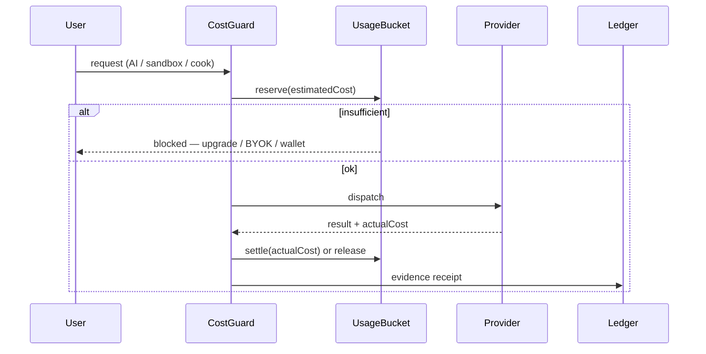

# Aethel Engine — Unit Economics & Subscription Alignment Spec

**Version:** 1.4 (Chief Architect — PAYG / wallet overage alignment)  
**Status:** **Binding** — closes gap between Law XV (hardware/cloud) and Laws IX/XII/XIV (billing)  
**Canonical sources (do not override without updating code):**
- [`AETHEL_PLANS_CANONICAL_REFERENCE.md`](./AETHEL_PLANS_CANONICAL_REFERENCE.md) — **single plan table**
- [`cloud-web-app/web/lib/plans.ts`](../../cloud-web-app/web/lib/plans.ts) — live plan definitions
- [`contracts_planning.md`](./contracts_planning.md) §3, §6, §8 — Stripe modular SKUs + entitlement matrix
- [`billing_security_analysis.md`](./billing_security_analysis.md) §4 — margin math + tier table v2

**Integrates:** Law XV, IX, XII, XIII, XIV + Ondas H, I, J, L, M, G.2

---

## Executive summary

| Question | Answer (from existing plans) |
|----------|------------------------------|
| Does the platform render games in the cloud? | **No** — render is **local** (Law XV). |
| Where is platform COGS risk? | **Weighted AI tokens**, **R2 storage**, **CDN egress**, **dedicated MP servers**, **Forge sandbox** (when live), **Hub launch CAC** |
| How do we avoid loss? | **Three ledgers**, **reserve/settle before spend** (Trava I), **hard caps in `plans.ts`**, **weighted token model**, **BYOK default on Pro/Studio platform SKUs** |
| Does infinite GPU diversity break the model? | **No** — Capability Score is client-side; platform COGS ≠ GPU model count |

**Golden rule:** *No variable platform cost without **reserved revenue** (subscription entitlement already paid, UsageBucket/Credit Wallet debit, Aethel Coins, or IAP lane 12%).*

**World-gen / long agents:** see [`AETHEL_AI_WORKLOAD_AND_BILLING_ALIGNMENT.md`](./AETHEL_AI_WORKLOAD_AND_BILLING_ALIGNMENT.md) — keep $9/$29/$79; require **JobBudget** + Creative Wallet + Fast-first; do not buy quality only with Ultra + huge context on the subscription dime.

**Calculated tables (mix margin, Creative job credits, wallet→Sonnet turns):** [`AETHEL_MARGIN_CREATIVE_WALLET_TURNS_CALCULATOR.md`](./AETHEL_MARGIN_CREATIVE_WALLET_TURNS_CALCULATOR.md).

**Apex MoA + Maestro Delegation + Auto-Heal economics:** [`AETHEL_APEX_FAST_SWARM_ORCHESTRATION.md`](./AETHEL_APEX_FAST_SWARM_ORCHESTRATION.md) §5 — Premium pin saves raw for nucleus; peripherals on Fast MoA; ~150–250 MoA cells/mo on Pro if scoped.

---

## 1. Three ledgers (NEVER mix — Decision #67)

| Ledger | Prisma / module | Paid by | Used for |
|--------|-----------------|---------|----------|
| **AI Compute Pass** | `CreditLedgerEntry`, `UsageBucket` | Creator (subscription quota, wallet top-up, or BYOK) | LLM, image, mesh, voice, video, **future** sandbox minutes |
| **Aethel Coins** | `AethelCoinLedgerEntry` (H.1 target) | Player / creator (fiat→Coins) | Universal Store, P2P market, Hub Promoted |
| **Fiat / Stripe** | Connect, subscriptions | Creator subscription | Hosting, storage, CDN, collab seats, MP servers |

**Prohibition #22 (Roadmap):** conflate AI credits with Aethel Coins — **reject PR**.

---

## 2. COGS map × who pays (bound to existing entitlements)

| Cost center | Platform COGS | Who pays | Mechanism (existing) |
|-------------|---------------|----------|----------------------|
| **Gameplay render** | **$0** | Player device | Local wgpu/WebGL2 (Law XV) |
| **Weighted AI (platform path)** | OpenRouter/provider $ | Creator | `tokensPerMonth` in `plans.ts` + `model-cost-weights.ts`; BYOK bypass |
| **R2 storage** | ~$0.015/GB-mo | Creator | `limits.storage` per tier |
| **CDN deploy egress** | R2 egress $0; overage priced | Creator | `extras.cdnEgressGB`; soft/hard stop §3.4 `contracts_planning` |
| **Cloud compile / cook** | CPU workers (when live) | Creator | **Not minuted in `plans.ts` yet** — UsageBucket reserve at ship (Wave 6) |
| **Image / 3D / video / music / voice** | Provider $$$ | Creator | `enforceExpensiveAiGenerationUsage` → **same UsageBucket** (GAP-FUSION-02) |
| **Forge sandbox** | E2B/Firecracker $/min (when live) | Creator | UsageBucket at ship (Onda L) |
| **Dedicated MP servers** | VM $/hr | Creator | Tier-gated: P2P Free/Starter; Pro 1×256MB; Studio 3×512MB (`contracts_planning` §8) |
| **Cross-save blobs** | R2 (when live) | Creator | **Not in `plans.ts` yet** — Pro+ policy (Onda I.7) |
| **Hub launch 2k impressions** | Redis + minimal bandwidth | **Platform (CAC)** | Hub spec I.1 — cap + anti-bot |
| **Hub Promoted** | Feed compute | Creator | **Aethel Coins** debit before serve |
| **Stripe fees** | ~2.9% + $0.30 | Absorbed in take rates | Universal Store 30%; IAP 10% playground |

**H.0 blocker (binding):** `payouts.ts` `PLATFORM_TAKE_RATE=0.12` ≠ Universal Store 30% — fix before Hub checkout.

---

## 3. REV map × margin (from `billing_security_analysis.md` §4)

| Lane | Rate | Source |
|------|------|--------|
| **Self-export royalty** | 5% after $100k lifetime | `billing_security_analysis.md` §3 |
| **Aethel Playground / Pay IAP** | 10% | `billing_security_analysis.md` §3 |
| **Universal Store (target)** | 30% platform / 70% creator | Law XII — **not yet in `payouts.ts`** |
| **P2P secondary (target)** | 10% + 5% royalty | Commerce spec |
| **Subscriptions** | 100% to platform | Stripe |
| **BYOK path** | $0 provider cost on platform | `extras.byokEnabled`; Pro platform SKU $15/$45 base |
| **Credit Wallet top-up** | Prepaid packs from `CreditWallet.tsx`; margin ~96–99% at weight floor | Wave 6 — see [`AETHEL_PAYG_AND_WALLET_SPEC.md`](./AETHEL_PAYG_AND_WALLET_SPEC.md) §3 |
| **On-demand AI (PAYG)** | Prepaid rate × **1.10**; bill at $25 threshold | Wave 6b — opt-in only |

### 3.1 Subscription margin (if quota fully burned on budget models)

From `billing_security_analysis.md` §4.2 — **do not re-estimate without re-running weights:**

| Tier | USD/mo (net ~) | Max API @ budget | Min gross margin |
|------|----------------|------------------|------------------|
| Starter | $9 (~$8.44) | $0.15 | ~98% |
| Pro + IA | $29 (~$27.5) | $0.68 | ~97% |
| Studio + IA | $79 (~$76) | $2.70 | ~96% |

**Ultra models (Opus/o1, 200× weight):** wallet or BYOK only — blocks -$521/account scenario.

---

## 4. Canonical subscription SKUs (from code + contracts — NOT invented)

### 4.1 Live tier matrix

**Primary source:** `plans.ts` `PLANS[]`  
**Modular Stripe decomposition:** `contracts_planning.md` §3.1, §8

| Tier | USD/mo | BRL/mo | Annual USD | Cloud projects | Storage | Weighted AI/mo | CDN egress | Collab write | MP cloud |
|------|--------|--------|------------|----------------|---------|----------------|------------|--------------|----------|
| **Free** | $0 | R$0 | — | 1 | 250 MB | 200K (free models) | 24h deploy links | 0 (spectator OK) | Local / P2P |
| **Starter** | $9 | R$47 | $90 | 3 | 2 GB | 1M | 8 GB → 9.6 GB hard | 0 (spectator OK) | P2P |
| **Basic (legacy)** | $29 | R$145 | $278.40 | ∞ | 14 GB | 4.5M | 100 GB | 2 | grandfathered Pro+IA |
| **Pro** | $29 | R$149 | $290 | ∞ | 14 GB | 4.5M | 100 GB | 2 | 1×256MB test |
| **Studio** | $79 | R$399 | $790 | ∞ | 60 GB | 18M | 500 GB | 3 (+$12/seat) | 3×512MB |
| **Enterprise** | $199 | R$995 | $1910.40 | ∞ | 1 TB | 100M | Custom | ∞ | Custom |

**Modular checkout (Pro / Studio):**

| SKU | USD/mo | Includes |
|-----|--------|----------|
| Pro Platform | $15 | Infra + BYOK default; **0** platform IA tokens |
| Pro IA Addon | +$14 | 4.5M weighted tokens → **$29 total** |
| Studio Platform | $45 | Infra + BYOK default |
| Studio IA Addon | +$34 | 18M weighted tokens → **$79 total** |
| BYOK addon (paid tiers) | +$5/mo | Optional platform features path (`extras.byokAddonUsd`) |

**Free tier AI (corrected):** Free includes **200K weighted tokens/mo on free OpenRouter models** — not "BYOK only". BYOK is **also enabled at $0** (`extras.byokEnabled: true`). Premium/ultra models require BYOK or wallet on all tiers.

**Local Tauri projects:** **Unlimited on all tiers** (`extras.localProjectsUnlimited: true`).  
**Cloud storage:** limits apply to **cloud sync/R2 only** — not local desktop disk (`extras.storageScope: 'cloud_only'`).

### 4.2 Dual-pool AI (Pro+ — canonical in `plan-ai-quotas.ts`)

Single weighted number is kept for audit (`tokensPerMonth`). **UI and enforcement** use two visible pools:

| Tier | Fast AI/mo (1×) | Premium AI/mo (raw) | Weighted total | Premium exhausted |
|------|-----------------|---------------------|----------------|-------------------|
| Free | 200K | — | 200K | — |
| Starter | 1M | — | 1M | budget models only |
| Pro / Basic legacy | **3M** | **37,500** | 4.5M | auto Fast fallback (`premiumAutoFallback`) |
| Studio | **12M** | **150,000** | 18M | auto Fast fallback |
| Enterprise | **70M** | **750,000** | 100M | auto Fast fallback |

**Ultra (200×):** wallet or BYOK on all tiers. **IDE/editor/preview never gated** by AI quota.

**UsageBucket windows:** `month` (weighted audit), `month_fast`, `month_premium_raw`.

### 4.3 Rate-limit axis (spam gate only)

From `contracts_planning.md` §7:

| Tier | requestsPerDay | tokensWeighted/mo (platform) |
|------|----------------|------------------------------|
| Free | 50 | 200K |
| Starter | 720 | 1M |
| Pro + IA | 2,880 | 4.5M |
| Pro Platform (BYOK) | 2,880 | 0 |
| Studio + IA | 7,200 | 18M |
| Studio Platform (BYOK) | 7,200 | 0 |
| Enterprise | unlimited | 100M+ (custom) |

### 4.4 Services NOT yet quota'd in `plans.ts` (honest gaps)

These COGS centers are **planned** in supremacy specs but **minute/GB caps are not in live plan code**. Do **not** invent numbers in docs until added to `plans.ts` or `contracts_planning.md`:

| Service | Status | Ship gate |
|---------|--------|-----------|
| Cloud asset cook minutes | Policy: infra bundled in paid tiers; enforce UsageBucket at dispatch | Wave 6 + cook queue live |
| Forge sandbox minutes | Debit UsageBucket before session | Onda L.1 |
| PSO Vault bakes/month | M.1 entitlement TBD | Onda M |
| Cross-save GB/player | I.7 Pro+ policy TBD | Onda I |
| Demo web egress | ≤150 MB bundle cap (Hub spec) | Onda I publish stage |

---

## 5. Anti-loss flow (reserve → settle)

**Applies when live:** J.1 CreativeBridge, L.1 ForgeSandbox, J.8 BrowserOperator, cloud cook queue, J.10 LiveVoice.

**Free tier today:** platform debits `tokensPerMonth: 200_000` on **free models only**; premium model call without BYOK/wallet → **fail-closed**.

---

## 6. Law XV × cloud (hardware question)

| Cloud service | Scales with GPU model count? | Scales with users? | Bound entitlement |
|---------------|------------------------------|--------------------|-------------------|
| Capability Score | ❌ | ❌ (local) | — |
| Weighted AI | ❌ | ✅ per token | `plans.ts` `tokensPerMonth` |
| R2 storage | ❌ | ✅ per GB | `limits.storage` |
| CDN egress | ❌ | ✅ per GB | `extras.cdnEgressGB` |
| Dedicated MP | ❌ | ✅ per VM-hour | Tier table §4.1 |
| Cloud cook / Forge | ❌ | ✅ per job/minute | UsageBucket (when live) |

**Conclusion:** GPU diversity does **not** multiply platform COGS. User count multiplies only **explicitly capped** metered services.

---

## 7. Loss risks × mitigation

| ID | Risk | Impact | Mitigation | Owner |
|----|------|--------|------------|-------|
| **UE-01** | Premium AI on Free without BYOK | Critical | `allowedModels` free-only + CostGuard | J, IX, `plans.ts` |
| **UE-02** | Cloud cook unlimited on Free | High | UsageBucket at ship; local Tauri fallback | XV, VI |
| **UE-03** | Forge sandbox orphan sessions | High | Teardown + reserve/min | L |
| **UE-04** | Storage above tier cap | High | `limits.storage` enforcement | Wave 6 |
| **UE-05** | Dedicated server without billing | High | Tier-gated MP + IAP 10% offset | G.2, H |
| **UE-06** | Hub impression bot farm | Medium | 2k cap + dedupe (Law II) | I |
| **UE-07** | CDN soft stop bypass | Medium | 120% hard stop (`contracts_planning` §3.4) | Wave 6 |
| **UE-08** | Chargeback after payout | Medium | 48h custody + 14d escrow | H |
| **UE-09** | Demo egress viral | Medium | ≤150 MB demo bundle | I |
| **UE-10** | Ledger confusion AI/Coins | High | Three ledgers (#67) | H, IX |

---

## 8. Overage & wallet (summary — full spec in PAYG doc)

When subscription **Fast + Premium** pools are exhausted (`plan-limits.ts` → `QUOTA_EXCEEDED` today):

| Path | Status | User experience |
|------|--------|-----------------|
| Prepaid **Credit Wallet** | Ledger LIVE; Stripe settlement **NOT LIVE** | Buy credits — packs + flexible $5–$500 |
| **Pay-as-you-go** (card) | **NOT LIVE** | Opt-in + **mandatory spend cap**; +10% vs prepaid; bill $25 / month-end |
| **Aethel Coins** → credits | **NOT LIVE** (H.1) | Opt-in only; **hidden from AI chrome** |
| **BYOK** | **NOT LIVE** | User pays provider; $0 platform AI COGS |
| **Upgrade plan** | LIVE | Pricing page / Stripe portal |

**Debit order (binding):** subscription pools → wallet → PAYG (capped) → block with CTAs. Coins never silent. **Never** double-debit (`GAP-PAYG-01`).

**UX supremacy:** $ equivalent meters · composer cost chip · calm 402 · Studio org pool — see Plans Canonical v1.1 §10 + PAYG v1.1 §4 · Execution Map round **6H**.

**Credit unit:** 1 credit = 1,000 weighted tokens (DEBT-FIN-008).

---

## 9. Alignment actions (remaining)

| Gap | Action | Where |
|-----|--------|-------|
| GAP-PAYG-01 double debit | Single `spend-resolver` for chat/stream | Wave 6A |
| Wallet fallback | Continue AI when pools empty + balance | Wave 6B |
| Stripe wallet checkout | Settle `CreditLedgerEntry` pending intents | Wave 6B |
| PAYG spend caps | Mandatory cap on enable; `PAYG_CAP_REACHED` | Wave 6C |
| Usage UX ($ meters, chip, modal, org pool) | Round 6H | Wave 6H |
| Modular Stripe line items | Implement `price_pro_base_15` + addon checkout | Wave 6D |
| `payouts.ts` 12% vs 30% | `RevenueLane` enum | H.0 |
| Cloud cook / Forge minutes | Add to `plans.ts` or UsageBucket only — **no doc fiction** | Wave 6 / L |
| `SubscriptionEntitlement` Prisma | Mirror `plans.ts` fields | H.1 |
| Publish cook `executionAllowed: false` | Wire quota + H.2 gate | Commerce |

---

## 10. Decisions (#67–71, corrected v4.7.1)

| # | Decision |
|---|----------|
| 67 | **Three-ledger model** — AI UsageBucket ≠ Aethel Coins ≠ Fiat subscription |
| 68 | **Free tier AI = free models only (200K weighted/mo)** + optional BYOK $0; **no** premium/ultra on platform dime; cloud cook **not unlimited** when queue ships |
| 69 | **Render always local** — no pixel-streaming AAA; GPU diversity ≠ cloud COGS |
| 70 | **Creator pays variable cloud** via **Starter/Pro/Studio/Enterprise** entitlements or UsageBucket — not a fictional Pro-only SKU |
| 71 | **Hub launch 2k impressions = platform CAC** — Lane C Promoted = Coins only |

---

## 11. Acceptance (unit economics ship gate)

- [ ] **UE-ACC-01:** Free user calls premium model without BYOK/wallet → `blockedReason: model_not_in_plan`
- [ ] **UE-ACC-02:** Storage above `limits.storage` → upgrade CTA; no silent overage on subscription
- [ ] **UE-ACC-03:** Forge sandbox minute debits UsageBucket before session start (when L ships)
- [ ] **UE-ACC-04:** Universal Store sale uses 30% lane; Playground IAP uses 10% — distinct enums
- [ ] **UE-ACC-05:** CDN hard stop at 120% included (`contracts_planning` §3.4)
- [ ] **UE-ACC-06:** Promoted Hub slot debits Aethel Coins before impressions serve

---

## Cross-links

| Document | Relationship |
|----------|--------------|
| `cloud-web-app/web/lib/plans.ts` | **Canonical prices & limits** |
| `contracts_planning.md` §8 | Full entitlement matrix |
| `billing_security_analysis.md` §4 | Margin math |
| `AETHEL_HARDWARE_SCALABILITY_SPEC.md` | §9 cloud boundary |
| `AETHEL_NETWORK_COMMERCE_LIVEOPS_SPEC.md` | Treasury, lanes |
| `AETHEL_GAME_HUB_PLATFORM_GROWTH_SPEC.md` | CAC impressions |
| `FUTURE_IMPROVEMENTS_REGISTRY.md` | IMPROVE-BILLING-* |
