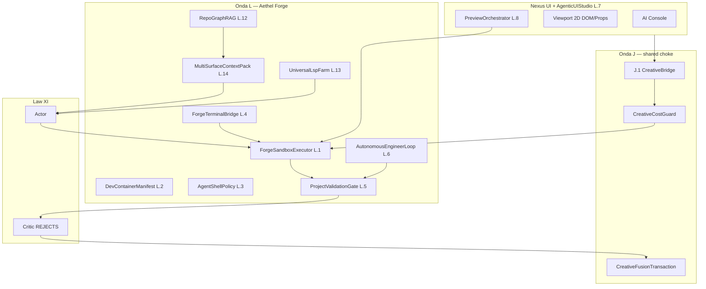

# Aethel Engine — Universal IDE Forge Spec (Onda L)

**Version:** 1.2 (Chief Architect — Absolute Supremacy Elevation, doctrine #73)
**Status:** **Binding** — **Onda L (Aethel Forge)** — Universal Software Engineering IDE  
**Canonical:** [`AETHEL_SUPREMACY_ROADMAP.md`](AETHEL_SUPREMACY_ROADMAP.md) v4.6  
**Studio cross-links:** L.14 MultiSurfaceContext; S7 cook for agent context
**Extends:** [`AETHEL_AI_FUSION_CREATIVE_SPEC.md`](AETHEL_AI_FUSION_CREATIVE_SPEC.md) (Law XI + XVI + Onda J)  
**Laws:** **XI** (Fusion + validation gates), **XVI** (Creative Fusion custody), **VIII** (airgapped / offline context), **IX** (Cost Guard on sandbox minutes)

---

## Executive mandate

Aethel is a **Universal IDE** — not only games and 3D. Onda L **absorbs and supersedes** **Cursor** (code comprehension), **v0 / Lovable** (Agentic UI + live preview), and **Devin** (autonomous engineering in sandbox) — their strengths become the floor; Aethel's governance, custody-chain and engine-native moats become the ceiling (**doctrine #73 Absolute Supremacy Mandate**, Index § Absolute Supremacy).

**Engineering cost vs the parallel dev trains (doctrine #72):**
- **Now (Ondas A–F):** no Forge ship — only **L-readiness hooks** (preview E2B env vars documented, agent-tool-bus `cloud-sandbox` target reserved).
- **Onda L (parallel post J.1):** native Forge stack — **does NOT delay** the **parallel dev trains**, RTv1 Hub, or A.1 terrain (public launch waits for #72).
- **Prerequisite:** **J.1** (`CreativeBridge` + `CreativeCostGuard`) — single agent choke point before any sandbox minute is billed.

**Sandbox billing (binding):** Forge minutes debit **`UsageBucket`** reserve/settle before session start — see [`AETHEL_UNIT_ECONOMICS_AND_SUBSCRIPTION_ALIGNMENT.md`](AETHEL_UNIT_ECONOMICS_AND_SUBSCRIPTION_ALIGNMENT.md) §4.3. **Minute caps not yet in `plans.ts`** — do not document fictional quotas until Wave 6 / L.1 adds them. Free/Starter = no sandbox until entitlement ships.

**Zero-MVP (doctrine #73):** No "Cursor killer," "Devin parity," or "v0-class Agentic UI" marketing until L acceptance suites pass. Supremacy is **earned**, never claimed — parity-class = floor, Aethel moats = ceiling; any marketing label before L acceptance green is **Anti-Hype violation** (Index § Absolute Supremacy Mandate #73).

---

## Universal IDE Doctrine (binding)

1. **Agent never touches host OS shell** — Decision #48. Human users may use native PTY (Tauri); agents use **ForgeSandboxExecutor** only.
2. **Every agent write passes ProjectValidationGate** — Decision #49. TS/TSX: `typecheck` + `lint`; Rust: `cargo check` + `clippy` + `test`; in **sandbox**, not host.
3. **Every sandbox session is evidence-backed** — stdout/stderr, exit codes, cost, teardown → `task-evidence-ledger`.
4. **Multi-surface context, not code-only RAG** — **L.14 MultiSurfaceContextPack** supersedes standalone **J.3 SceneContextPack** (Decision #50).
5. **Marketing honesty** — Fusion/MoA claims obey Swarm **§0a Canonical Anti-Hype Anchor** (reliability ≠ 5s perfection; Maestro writes nucleus).
5. **Preview ≠ Engineering sandbox** — E2B preview infra is **reused** (Decision #52); Forge adds agent lifecycle, policy, and validation loop.

---

## State today (audit — honest)

| Capability | Status | Evidence |
|------------|--------|----------|
| Agent tool bus + sandbox policy types | **REAL (spec)** | `agent-tool-bus.ts`, `cloud-sandbox` target |
| Agent tool job runner | **REAL (partial)** | `agent-tool-job-runner.ts` — observe/enforced; no sandbox exec |
| E2B preview provision/sync | **REAL (partial)** | `preview-runtime-*`, `runtime-sync` — human preview path |
| Forge sandbox executor | **AUSENTE** | No agent → E2B/Firecracker kernel |
| DevContainer manifest | **AUSENTE** | — |
| Agent on host PTY | **RISK** | `desktop_commands.rs` PTY real — **must not** wire to agent |
| ProjectValidationGate (Law XI hard) | **PARTIAL** | `change-validation.ts` = single-file TS parse; not project typecheck |
| Self-reflection critic | **PARTIAL** | LLM critique only — does not run test suite |
| Repository Cartography | **REAL** | `repository-cartography.ts` |
| Semantic code search | **PARTIAL** | Hash bag-of-words — not RepoGraphRAG |
| VectorIndex SQLite-vec | **AUSENTE** | J.4 planned; `semantic-code-search.ts` hash embed |
| SceneContextPack | **AUSENTE** | → **L.14** |
| Monaco LSP bridge (client) | **REAL** | `monaco-lsp-bridge.ts` |
| Universal LSP server farm | **AUSENTE** | `DEFAULT_LSP_WS_URL` localhost stub |
| Agentic UI (Magic Wand) | **SEED** | `useMagicWand.ts`, `RuntimePreviewSurface` |
| AgenticUIStudio Viewport 2D | **AUSENTE** | No DOM tree / props panel |
| FullStackScaffoldEngine | **AUSENTE** | — |
| AutonomousEngineerLoop | **AUSENTE** | — |
| BrowserOperator Playwright | **PARTIAL** | J.8 CORE governed fetch + ledger (2026-07-11ai); full CDP farm **HELD** |

**Implementation score today:** ~2/10 Universal IDE loop. **Architecture score on paper (post L spec):** ~9/10.

---

## Onda L delivery map

### Pilar L.A — Autonomous Engineering & Secure Sandbox (Devin-class)

| Step | Deliverable | Depends | Ship |
|------|-------------|---------|------|
| **L.1** | **ForgeSandboxExecutor** — agent tool → E2B/Firecracker create/connect/exec/teardown; CostGuard per minute | J.1, E2B preview infra | L |
| **L.2** | **DevContainerManifest** — `.aethel/devcontainer.json` + template registry (Node, Python, Rust, Next, Vite) | L.1 | L |
| **L.3** | **AgentShellPolicy** — agent forbidden on host PTY; network egress allowlist; secrets injection policy | L.1, agent-tool-bus | L |
| **L.4** | **ForgeTerminalBridge** — xterm → sandbox PTY via WSS; stream → evidence ledger | L.1, terminal components | L |
| **L.5** | **ProjectValidationGate** — sandbox typecheck/lint/test; **blocks apply**; **feeds Auto-Heal**; **requires LazyInspector PASS (#66) first** | L.1, Law XI, #66 | L |
| **L.6** | **AutonomousEngineerLoop** — Laws → Maestro/MoA → **LazyInspector (#66)** → **L.5 → Heal×≤3** → APPLY | L.1–L.5, J.1, #60–#62, **#66** | L |

### Pilar L.B — Agentic UI & Viewport 2D (v0 / Lovable-class)

| Step | Deliverable | Depends | Ship |
|------|-------------|---------|------|
| **L.7** | **AgenticUIStudio** — Viewport 2D: DOM tree, props inspector, design token picker, Magic Wand → agent bus | J.2, preview | L |
| **L.8** | **PreviewOrchestrator** — inline / local dev server / E2B HMR; agent selects strategy; sync state in context | L.1, preview runtime | L |
| **L.9** | **FullStackScaffoldEngine** — Next 14 / Vite / static templates; provision sandbox + open preview | L.1, L.2 | L |
| **L.10** | **DesignTokenSync** — prompt → `var(--aethel-*)` + Tailwind; QA `hardcoded-colors` gate | L.7, Law X | L |
| **L.11** | **UIMutationTransaction** — Trava II extension: TSX + CSS + preview DOM in one Yjs undo | J.1 Trava II | L |

### Pilar L.C — Supreme Code Comprehension (Cursor-class)

| Step | Deliverable | Depends | Ship |
|------|-------------|---------|------|
| **L.12** | **RepoGraphRAG** — import/call graph + cartography; **neighborhood slices for packs** (not whole-repo prompt dump); supersedes hash-only RAG | J.4 VectorIndex, cartography | L |
| **L.13** | **UniversalLspFarm** — language server sidecars (Tauri spawn + cloud relay); Monaco bridge auto-connect | B sidecar, Monaco | L |
| **L.14** | **MultiSurfaceContextPack** — code + cartography + scene/VS/terrain + preview DOM + terminal tail + validation errors; **absorbs J.3**; **`tokenBudget` hard truncate** (Decision #54) | J.4, L.12, deep-context | L |

**Parallel to the dev trains:** L does **not** block A.1–A.6, RTv1, H, I, or K. **Blocks:** "Universal IDE" / "Devin parity" / "Cursor killer" marketing only (public launch waits for #72).

---

## Architecture (target)



---

## Contracts (binding interfaces)

### `ForgeSandboxSession`

```typescript
export interface ForgeSandboxSession {
  sessionId: string;
  provider: 'e2b' | 'firecracker' | 'local-isolated';
  devcontainerRef?: string;
  projectId: string;
  agentMode: AgentMode;
  networkPolicy: 'none' | 'npm-registry' | 'allowlist';
  costGuardReservationId: string;  // Trava I — required
  evidenceLedgerId: string;
  createdAt: string;
  teardownAt?: string;
}
```

### `ProjectValidationGateResult`

```typescript
export interface ProjectValidationGateResult {
  verdict: 'PASS' | 'BLOCK';
  checks: Array<{
    id: 'typecheck' | 'lint' | 'test' | 'cargo-check' | 'cargo-clippy' | 'cargo-test';
    status: 'pass' | 'fail' | 'skipped';
    logRef: string;  // evidence ledger
  }>;
  sandboxSessionId: string;
}
```

### `MultiSurfaceContextPack` (supersedes J.3 SceneContextPack)

**Modular surfaces (binding):** The pack is **one schema**, not one dump. The pack builder **enables only active surfaces** for the current workspace / task — unused slices stay **omitted** (not empty stubs that burn `tokenBudget`).

| Active work | Surfaces ON (typical) | Surfaces OFF |
|-------------|----------------------|--------------|
| **Game / 3D** | `codeChunks` + `sceneSelection` / VS / terrain + `capabilityScore` + validation | Heavy `previewDomSnapshot` unless editing UI overlay |
| **React / Next site** | `codeChunks` + `previewDomSnapshot` + CSS/token context + preview console errors | Scene/terrain/VS 3D slices |
| **Python / server / CLI** | `codeChunks` + `terminalTail` + `lastValidationGate` | Scene + DOM preview |
| **Mixed mission** | Maestro may attach **multiple** surfaces — still hard-capped by `tokenBudget` (#54) |

**Same MoA / Maestro / L.5 / #66 stack** reads this pack regardless of domain — intelligence does not fork into “game AI” vs “web AI”; **context adapts**, orchestration stays one Fusion spine. Anti-Hype §0a still applies (reliability, not “perfect in 5s”).

```typescript
export interface MultiSurfaceContextPack {
  projectId: string;
  /** Code — cartography + vector + repo graph */
  repositoryManifestId?: string;
  codeChunks: ContextChunk[];
  repoGraphSlice?: { symbol: string; callers: string[]; callees: string[] };
  /** Creative — from engine (J domain) — omit when not in game/3D mode */
  sceneSelection?: string[];
  visualScriptGraphRef?: string;
  terrainChunkRef?: string;
  capabilityScore?: number;
  /** Engineering — Forge domain — omit when not in web/preview mode */
  previewDomSnapshot?: string;
  previewConsoleErrors?: string[];
  /** Terminal — omit when not debugging runtime/CLI */
  terminalTail?: string;
  lastValidationGate?: ProjectValidationGateResult;
  /** Hard cap — pack builder MUST truncate; agent prompts without pack denied (Decision #54) */
  tokenBudget: number;
  /** Measured after build — must be ≤ tokenBudget */
  tokenCount?: number;
  /** Which surfaces were enabled for this build (telemetry + Critic) */
  activeSurfaces?: Array<'code' | 'scene' | 'dom' | 'terminal' | 'validation'>;
}
```

**Default budgets (binding):** chat 2K · Worker 1.5K · Maestro 2.5K · Critic 1.2K · world step 3K. See [`AETHEL_INTELLIGENT_ROUTING_AND_CONTEXT_COMPRESSION.md`](./AETHEL_INTELLIGENT_ROUTING_AND_CONTEXT_COMPRESSION.md) §2.

| Module | Path |
|--------|------|
| Sandbox executor | `lib/production/forge-sandbox-executor.ts` |
| DevContainer registry | `lib/production/devcontainer-manifest.ts` |
| Agent shell policy | `lib/production/agent-shell-policy.ts` |
| Terminal bridge | `lib/server/forge-terminal-bridge.ts` |
| Validation gate | `lib/production/project-validation-gate.ts` |
| Engineer loop | `lib/production/autonomous-engineer-loop.ts` |
| Agentic UI studio | `packages/ide-ui/AgenticUIStudio.tsx` |
| Preview orchestrator | `lib/server/preview-orchestrator.ts` |
| Full-stack scaffold | `lib/production/fullstack-scaffold-engine.ts` |
| Design token sync | `lib/production/design-token-sync.ts` |
| UI mutation tx | `lib/production/ui-mutation-transaction.ts` |
| Repo graph RAG | `lib/server/repo-graph-rag/` |
| LSP farm | `apps/studio-local/src-tauri/src/lsp_farm.rs` + `lib/server/universal-lsp-relay.ts` |
| Multi-surface context | `lib/production/multi-surface-context-pack.ts` |
| **Domain economic router (cx)** | `lib/ai/domain-economic-router-policy.ts` — UI/panels → Sonnet-class; kernel/physics → **DeepSeek-V4-Pro (Apex reasoning)** (**#67**); CostGuard settle:0 on reject |
| **WeeklyEvolutionPlanner (cx)** | `lib/production/weekly-evolution-planner.ts` — root-cause Master Plan proposals; band-aid ban; Founder approve/reject |
| **HotFixEventBus (cx)** | `lib/production/hot-fix-event-bus.ts` — event-driven hot fixes; continuous Opus polling forbidden |
| **AutonomousEngineerLoop wire (cx)** | `lib/production/autonomous-engineer-loop.ts` — cadence → Apex mission + LazyInspector; L.1 sandbox still HELD |
| **UIMutationTransaction (cx)** | `lib/production/ui-mutation-transaction.ts` — L.11 Trava II TSX+CSS+preview DOM |
| **FounderEvolutionInbox (cx)** | `components/agents/window/FounderEvolutionInbox.tsx` — AgentsWindow Evolution tab (IDE only; Zero-UI in game) |
| **Quality competitor radar (cx)** | `lib/production/quality-competitor-radar.ts` — honesty APIs only; fake Unreal FPS forbidden |
| **Community AAA audit (cx)** | `lib/production/community-publish-aaa-audit.ts` — fail-closed light/mesh suggestions + CreativeBridge/CostGuard offer |

### FinOps + Founder God Mode (letter cx — 2026-07-13)

**Binding thesis:** War room = **Aethel Studio / AgentsWindow** + chat beside viewport — **not** orphan admin dashboards. Economic router keeps Sonnet on UI polish and reserves **DeepSeek-V4-Pro (Apex)** for deep kernel/physics (**#67**; Grok/Qwen/Llama expunged). Cadence = **hot-fix event-driven** ∥ **weekly evolution** — never 24/7 Opus polling. Community publish quality elevator = AAA light/mesh audit offer via CreativeBridge + CostGuard (fail-closed).

| CLOSED (cx) | HELD |
|-------------|------|
| Domain lanes + settle:0 reject | L.1 ForgeSandboxExecutor Devin-class |
| WeeklyEvolution + HotFix → L.6 wire | Full AgenticUIStudio L.7 DOM/props Magic Wand |
| L.11 UIMutationTransaction scaffold | RepoGraphRAG L.12 import graph folder |
| FounderEvolutionInbox IDE tab | Universal IDE marketing claim (needs L.6+L.7+L.14) |
| Honesty radar + community AAA audit | Coins / Agones / Nanite / DLSS / fake Unreal FPS |

---

## L acceptance (ship gates)

### L.A — Sandbox & engineering

- [ ] Agent `test-runner` / shell tools execute **only** via ForgeSandboxExecutor — host PTY never invoked by agent
- [ ] Teardown within 60s of session end; no orphan sandboxes in soak test
- [ ] GF: Premium-pin mission delegates peripheral (e.g. lighting) to Swarm — **no Premium debit** on that cell (#61)
- [ ] **Auto-Heal:** seeded compile error → invisible heal ≤3 reaches PASS without user pasting logs (#60)
- [ ] AutonomousEngineerLoop = Maestro∥MoA → L.5 → Heal → apply on seeded bug repo without human shell
- [ ] All sandbox minutes pass CostGuard reserve/settle (Trava I)
- [ ] MoA JobBudget respected (≤3 gens/cell; ≤4 peripheral cells; no MoA on light chat)

### L.B — Agentic UI

- [ ] Prompt → FullStackScaffoldEngine → E2B preview URL < 120s cold start (p95)
- [ ] Magic Wand element edit → UIMutationTransaction → Ctrl+Z restores TSX + preview
- [ ] DesignTokenSync output passes `qa:hardcoded-colors`

### L.C — Code comprehension

- [ ] RepoGraphRAG resolves "who imports X" correctly on Aethel monorepo fixture (≥90% precision)
- [ ] UniversalLspFarm: TS + Python LSP hover/definition work in Monaco desktop export
- [ ] MultiSurfaceContextPack includes scene + code + preview errors in single Actor payload
- [ ] Pack p95 ≤ **2,000 tokens** on GF-FORGE fixtures; agent apply **denied** without pack (Decision #54)
- [ ] L.6 loop stays within Pro-safe JobBudget (Maestro+Critic Premium sparse; Workers Fast)

---

## J.3 / J.4 reconciliation (Decision #50)

| J step | L relationship |
|--------|----------------|
| **J.3 SceneContextPack** | **Superseded by L.14** — creative scene slice becomes `MultiSurfaceContextPack.scene*` fields; do not ship standalone J.3 module |
| **J.4 VectorIndex** | **Shared foundation** — J.4 ships first; L.12 RepoGraphRAG layers graph on top |
| **J.8 BrowserOperator** | Complements L.6 — browser research vs sandbox engineering |
| **Law XI validation** | **Completed by L.5** — not optional LLM critic alone |

**Release Train FORGE-v1:** J.1 → L.1+L.3 → L.5 → J.4 → L.12+L.14 → L.6 → L.7+L.8 → L.9–L.11 → L.13.

---

## Parity & honesty matrix

| Claim | Allowed after | Forbidden until |
|-------|---------------|-----------------|
| Autonomous engineering (Devin-class) | **L.6** acceptance | L.1 hooks only |
| Isolated agent sandbox | **L.1 + L.3** | Agent on host PTY |
| Agentic UI / v0-class preview | **L.7 + L.8** | Inline iframe only |
| Full-stack scaffold from prompt | **L.9** | Manual project create |
| Cursor-class codebase intelligence | **L.12 + L.13** | Hash RAG marketing |
| Universal IDE (combined claim) | **L.6 + L.7 + L.14** | Partial wave ship |

**vs competition (honest — doctrine #73 Absolute Supremacy):** Cursor + v0 + Devin are the **floor**, not the ceiling. Aethel L targets **governed supremacy class** — the moats (governed `ForgeSandboxExecutor` isolation, multi-surface context L.14, evidence-ledger discipline, Law XVI custody chain, engine-native render preview) are **unique-superiority vectors no IDE competitor has**: no competitor ships a governed sandbox with `ProjectValidationGate` (typecheck/lint/clippy inside the sandbox), a creative custody chain (CreativeFusionTransaction), or a live engine-render surface alongside code. Raw tab-completion latency may trail Cursor on Day 1 L ship — a transient gap, NOT a structural ceiling (S-08: `COMPOSER_SURPASS_CLAIM=false` — claim earned only when the moat suite passes acceptance).

---

## L-readiness checklist (Onda A–F PRs touching IDE/agent)

- [ ] Agent tools declare `runtimeTargets` including `cloud-sandbox` — no new host-shell agent paths
- [ ] Preview routes remain human-initiated until L.1 ships
- [ ] Law XI gate hooks extensible to sandbox `ProjectValidationGate`
- [ ] Cartography manifest compatible with future RepoGraphRAG ingest
- [ ] **G-readiness + K-readiness + J-readiness** unchanged

---

## Cross-links

| Document | Relationship |
|----------|--------------|
| `AETHEL_AI_FUSION_CREATIVE_SPEC.md` | J.1 prerequisite; Travas I–II extend to L.11 |
| `AETHEL_INTELLIGENT_ROUTING_AND_CONTEXT_COMPRESSION.md` | Decisions #53–#55; Fusion Auto; ban Nano; TaskDomain; pack budgets |
| `AETHEL_VANGUARD_TECHNOLOGIES_SPEC.md` | K parallel — no conflict |
| `FUTURE_IMPROVEMENTS_REGISTRY.md` | `IMPROVE-AI-003`, `IMPROVE-DESK-002`, `IMPROVE-BRIDGE-001` → Onda L |
| `AI_CRITIQUE_DEBT_REGISTRY.md` | `DEBT-DESK-004`, preview E2B blockers |

---

## Approved decisions (#47–52, v4.6)

| # | Decision |
|---|----------|
| 47 | **Onda L — Aethel Forge** — Universal IDE engineering (Cursor / v0 / Devin parity class) |
| 48 | **AgentShellPolicy** — agents **never** use host OS PTY; sandbox only |
| 49 | **ProjectValidationGate** — project typecheck/lint/test in sandbox **blocks** Critic approval (Law XI completion) |
| 50 | **L.14 MultiSurfaceContextPack** supersedes standalone **J.3 SceneContextPack** |
| 51 | **Onda L parallel post J.1** — does not delay Wedge #1 or A.1 |
| 52 | **Forge reuses E2B preview infra** — engineering sandbox extends, not replaces, preview runtime |
| **53** | **Maestro/Critic prefer Premium elite + Workers = Apex Fusion Auto** |
| **54** | **Compressed MultiSurfaceContextPack hard dependency** of L.6 / multi-file agent apply |
| **55** | **Nano / dumb-fallback banned** |
| **56–#58** | Apex Doctrine · Apex-first · Architecture Laws gate |
| **59–#62** | Maestro Delegation + Adaptive MoA + Auto-Heal — Swarm orchestration v1.3 |
| **66** | **Anti-Laziness Protocol** — truncation ban + LazyInspector pre-L.5 + chunk ≤300 LoC — [`AETHEL_ANTI_LAZINESS_PROTOCOL.md`](./AETHEL_ANTI_LAZINESS_PROTOCOL.md) |

---

## Competitor feature matrix (Cursor / v0 / Devin / Lovable)

| Feature | Cursor | v0 / Lovable | Devin | Aethel L target |
|---------|--------|--------------|-------|-----------------|
| Tab completion | **Leader** | Basic | — | L.13 LSP farm |
| Repo-wide RAG | Strong | Weak | Medium | **L.12 RepoGraphRAG** + L.14 |
| Multi-file edit | Strong | Medium | Strong | L.6 + Law XI |
| Sandbox execution | Local | Cloud preview | **Isolated VM** | **L.1 ForgeSandbox** |
| Validation before apply | Lint partial | Weak | Test suite | **LazyInspector (#66) → L.5** |
| Agentic UI / DOM edit | — | **Leader** | — | **L.7 AgenticUIStudio** |
| Full-stack scaffold | — | **Leader** | Medium | **L.9 FullStackScaffold** |
| Game + 3D context | — | — | — | **L.14 multi-surface moat** |
| Cost governance | BYOK | Platform pay | Opaque | **Trava I CostGuard** |
| Evidence / audit | Medium | Weak | Medium | **task-evidence-ledger leader** |
| Undo AI edits | Partial | Weak | — | **L.11 UIMutationTransaction** |

**Moats vs all three:** governed sandbox + multi-surface context (game + web + code) + evidence ledger.

---

## Known limitations (honest)

| Limitation | Mitigation |
|------------|------------|
| Tab latency may trail Cursor | L.13 local LSP sidecars; cloud relay fallback |
| v0 polish on animations | L.10 design tokens; not Framer clone Day 1 |
| Devin-long autonomous runs cost | CostGuard per minute; max session budget |
| Firecracker not on all hosts | E2B primary; local-isolated dev fallback |
| LSP for Rust in cloud | Tauri LSP farm desktop-first |

---

## Failure modes & mitigations

| Failure | Mitigation |
|---------|------------|
| Agent on host PTY | L.3 policy CI audit; prohibition #42 |
| Orphan sandboxes | L.1 teardown watchdog; 60s max |
| Apply without typecheck | L.5 blocks; prohibition #43 |
| L.5 FAIL shown as success | Auto-Heal or BLOCK only (#60) |
| MoA without JobBudget | CostGuard deny fan-out |
| Preview ≠ sandbox confusion | Decision #52 docs; separate UI labels |
| RepoGraphRAG hallucination | ≥90% precision gate on monorepo fixture |
| Uncompressed 50K prompts | L.14 tokenBudget + router deny (Decision #54) |
| Static Nano / dumb Worker | Decision #55 — Fusion Auto specialists only |
| Worker always on Premium | Decision #53 amended + TaskRiskScore; Fusion Auto under ceiling |

---

## L.0b — Editor ≠ Runtime + WASM Plugin ABI (deepened 2026-07-13bi)

Founder AAA gaps #3 and #7 (plugin half). Forge remains engineering sandbox; **published games must not carry React/Monaco/IDE**.

| Contract | Path | Status |
|----------|------|--------|
| `isEditorSurface` / publish strip boundary | `lib/runtime/editor-runtime-boundary.ts` | Scaffold **CLOSED** |
| Reuses `FORBIDDEN_RUNTIME_PACKAGES` | `publish-pipeline-orchestrator.ts` | Live tree-shake gate |
| V8 isolate + winit desktop host | — | **HELD** |
| WASM Plugin ABI + sandbox load | `lib/plugins/aethel-wasm-abi.ts` | Scaffold **CLOSED** |
| AgentShell alignment (#48) | `agent-shell-policy.ts` | Agents → sandbox only |
| Plugin marketplace | — | **HELD** |

**vs Cursor/Unity (honest):** Cursor is an IDE, not a game runtime — our Forge path mirrors that. Unity/UE ship separate player binaries; Aethel’s web demo may still use R3F for Hub demos, but **published game bundles fail-closed on IDE imports**. Full V8/winit host is the desktop end-state, not claimed now.

**Trust domains:** L Forge sandbox ≠ M.3 WASM Shield guest gameplay — see Immunity §3 + M.0b.

---

## Extended acceptance + golden fixtures

| ID | Suite | Fixture |
|----|-------|---------|
| **L-ACC-01** | Agent never uses host PTY | CI policy scan |
| **L-ACC-02** | Validation gate blocks bad TS | **GF-FORGE-001** |
| **L-ACC-03** | Autonomous fix-test cycle | **GF-FORGE-001** |
| **L-ACC-04** | Prompt → preview URL < 120s p95 | L.9 scaffold |
| **L-ACC-05** | RepoGraphRAG import precision ≥90% | Aethel monorepo slice |
| **L-ACC-06** | MultiSurfaceContextPack payload complete | L.14 integration test |

See [`AETHEL_SUPREMACY_EXECUTION_PLAYBOOK.md`](AETHEL_SUPREMACY_EXECUTION_PLAYBOOK.md).


---

## Auditoria UI/UX 2026-08-22 - Dual-Mode (Foundation approval, preparacao para o Claude executar)

Regra de ouro desta secao: ZERO codigo de interface nesta auditoria - apenas critica, requisitos e gates para o executor de UI. Escopo: web (Next 14, 33+ rotas, ~60 areas de componentes) + desktop (studio-local panels + GPU terminal + engine-owned present).

### A. Triagem critica da jornada (Hub/Store -> Criacao -> Canvas (IA) <-> Monaco)

Friccoes encontradas (auditoria do disco, 2026-08-22):

1. **Superficie fragmentada**: componentes espalhados em canvas/scene-editor/viewport/editor/editors/ide/studio (6+ areas concorrentes para a mesma funcao). Exigencia: UMA casca dual-mode (Canvas Mode + Monaco Mode) como unica superficie de edicao; as areas legadas viram modulos internos dessa casca.
2. **Hub desconectado da criacao**: marketplace/hub sao rotas separadas da IDE. Exigencia: Entry Hub vira Asset Drawer integrado no Canvas Mode (minimizavel, com busca e templates) - a jornada J1-J7 (plans canonical) deve fechar em <= 2 acoes do hub ao canvas.
3. **Risco de contexto grafico**: alternar rota/abrir Monaco NAO pode recriar o WebGL/WebGPU context (perda de contexto = reload de assets, stutter). Exigencia: Canvas SINGLETON fora da arvore de rotas; context loss recovery = mesmo contrato do WebGPUContext do engine (single-attempt fail-closed + getHealth).
4. **Roubo de foco**: streaming de tokens do chat NAO pode capturar teclado enquanto o usuario digita em Monaco ou manipula gizmo no canvas. Exigencia: chat = rail colapsavel sem autofocus em idle; focus routing explicito (secao F).
5. **Layout shift**: paletas que montam/desmontam no tick de telemetria causam reflow. Exigencia: telemetria/status = camada passiva (badge honesty, nunca painel re-renderizante no hot path).

### B. Arquitetura de estado compartilhado (SSOT)

- **Um Y.Doc unico** para: cena (scene graph/ECS), arquivos (Monaco models), transacoes de IA (Law XVI CreativeFusionTransaction). A infraestrutura Yjs ja existe (fusion-shared-ydoc, law-xvi-p2f3) - falta o SHARED Y.Doc para os 3 espacos na mesma sessao.
- **Sync bidirecional IA <-> cena <-> AST**: mudanca de no na cena gera diff no codigo; refactor da IA gera atualizacao do scene graph; SEMPRE via diff patch atomico (nunca overwrite do arquivo inteiro), com preview fantasma (ghost) antes do apply (o padrao do GPU terminal ja existe).
- **Concorrencia**: regra de lock - usuario digitando > IA adia patch; conflito = merge CRDT + notificacao visual, nunca silencio.
- **Undo**: Ctrl+Z reverte transacao de IA atomicamente (Trava II ja define; exigir no modo canvas tambem, nao so no Monaco).

### C. Docking e paletas (nivel Unreal/Adobe/Spline)

Hierarquia (ordem de prioridade de espaco util):

1. Viewport/Canvas (primario, budget 60fps garantido)
2. Outliner + Inspector (docaveis, densidade profissional: collapse groups, iconografia, filtro por tipo)
3. Asset Drawer (minimizavel; hub/marketplace/templates embutidos)
4. Timeline/Sequencer (contextual - aparece com animacao/cinema)
5. Chat IA (rail lateral fixo colapsavel, contextual ao selecionado)
6. Monaco Mode (toggle: hotkey / floating drawer / split view - nunca rota nova)

Ancoragem: dock/flexivel (Unreal-class), com persistencia de layout por workspace profile; o Canvas nunca perde a primazia responsiva.

### D. Roadmap estrutural para o executor (Claude UI)

- **Fase 1 - Desacoplamento**: extrair State Store global (Zustand), Canvas singleton + Web Workers; kill switches de re-render por telemetria; roteamento de foco.
- **Fase 2 - Agent & AST Sync**: camada de traducao chat->cena->codigo (GraphOperator J.5 existente) com contrato tool-calling (secao F); transacoes atomicas + undo.
- **Fase 3 - Dual-Mode Shell**: casca unica, docking contextual, hotkeys de toggle, integracao do Asset Drawer.

### E. Matriz de riscos - O QUE NAO FAZER

1. NAO duplicar compiladores/contextos (um canvas, um runtime).
2. NAO recriar canvas por rota/toggle (context loss).
3. NAO re-renderizar arvore inteira por tick de telemetria.
4. NAO bloquear 60fps com streaming de tokens (worker + batching).
5. NAO roubar cursor do usuario (IA espera, nunca interrompe).
6. NAO memory leak: listeners/GPU buffers com ciclo de vida do singleton.
7. NAO painel novo sem necessidade (UI discipline: aprofundar superficies existentes).

### F. Requisitos criticos adicionais

- **Agent Tool Calling Protocol**: JSON Schema por ferramenta (scene patch / file diff / asset op); Idempotency keys; resultado = preview fantasma -> confirmacao -> apply atomico (Law XVI); rollback = undo Yjs.
- **Keyboard & Focus Routing**: matriz de escopos - Canvas (WASD/Gizmo) vs Monaco vs Chat; captura explicita por escopo ativo; escape-hatch unico (Esc = soltar gizmo -> foco paleta); atalhos conflitantes resolvidos por escopo, nunca por sorte.
- **Performance Budget**: 60fps no viewport garantido; token streaming em Web Worker; compilacao em background; budget de memoria GPU com evidencia (o padrao dos substrates ja existe no engine).

### G. Limitacoes e cenarios obrigatorios

- **Sem GPU**: CapScore tier (Law XV) -> fallback WebGL2 + baked-light; a UI DEVE comunicar o tier honestamente (nada de prometer qualidade que o hardware nao entrega).
- **Sem internet**: modo offline completo (rota /offline ja existe) + assets locais (LocalAssetDepot); IA indisponivel = fluxo manual COMPLETO (todas as acoes via UI direta - a IA e acelerador, nunca dependencia).
- **Sem IA**: nenhum dead-end; tudo alcancavel por UI.
- **Hardware/chips complexos**: a capacidade de criar hardware/chips existe no motor (Law XV + hardware spec); a UI deve expor isso como paleta de hardware com preview de qualidade de mercado - a mesma exigencia dos concorrentes, sem painel AAA novo (aprofundar a paleta existente).

---

## H. Matriz de paridade de usuario (concorrentes) - 2026-08-22

O que cada concorrente TEM que nos AINDA nao temos na experiencia de usuario, mapeado ao backend que ja existe (para o Claude saber que a base tecnica esta pronta):

| Concorrente | Diferencial de usuario | Nosso backend pronto | Gap de UI |
|---|---|---|---|
| Unreal Editor | Gizmos/precisao + Sequencer + Material Graph + docking | cinema_frame_graph (kw), sequencing_timeline (ju), asset_cooker, kernel ac (BRDF/materiais) | Gizmos de mercado, curvas de material node-graph, Sequencer visual |
| Adobe | Camadas nao-destrutivas + precisao de ferramentas + atalhos totais | Yjs undo (Law XVI), CreativeFusionTransaction | Stacks nao-destrutivos por propriedade, panel de ajustes |
| Cursor | Diff inline IA + tab + chat integrado + command palette | GraphOperator (J.5), Apex Router, Yjs | Diff por hunk com accept/reject, palette global, tabs |
| Spline | Friccao zero web 3D + sharing instantaneo | Engine WebGPU + honest badges | Flow de publicar/compartilhar em 1 acao, templates interativos |
| Replit | Ambiente instantaneo + agentes visiveis | Sandbox + Workforce 7 squads + CostGuard | Painel de plano do agente (passos com status), logs de agentes |
| Firebase Studio | AI-first canvas + preview continuo | CreativeBridge + CostGuard + preview honesto | Canvas AI-first: gerar->ver->refinar em loop unico |
| VS Code | Onboarding + marketplace + acessibilidade + extensoes | Hub (I.5/I.6), plugin_sandbox, qa:design-system | Loja com qualidade de descoberta, a11y completa, extensao doc |

Conclusao: a distancia para os concorrentes NAO e de backend (que esta pronto) - e de camada de usuario. Cada linha acima vira um item obrigatorio da secao I.

## I. Sistemas de usuario exigidos (sem lacunas) - 20 itens

Cada item: [hoje] -> [exigencia] -> [gate].

1. **FTUE/Onboarding** [rota /onboarding existe] -> wizard de primeiro projeto com templates interativos + tutorial passo-a-passo com marcadores no viewport -> UX-G-DM7 (primeiro asset na cena em <= 2 min sem ajuda).
2. **Command Palette global** [nao existe] -> Ctrl+K com fuzzy search de acoes/assets/nos/comandos IA -> UX-G-DM8 (qualquer acao alcancavel em <= 2 teclas apos abertura).
3. **Gizmos de mercado** [SceneToolsWorkbench parcial] -> translate/rotate/scale, world/local, snapping/grid, alt-duplicate, alinhamento -> UX-G-DM9 (transformacao de precisao sem abrir inspector).
4. **Outliner completo** [outline/ existe] -> multi-select, grupos, filtros por tipo, busca, reparent drag-drop, rename inline, visibilidade/lock, isolation mode -> UX-G-DM10 (10k objetos navegaveis sem lag).
5. **Inspector profundo** [scene-editor/ existe] -> todos os tipos de propriedade (vec/color/curve/gradient/enum), undo por propriedade, slots de material, busca no inspector -> UX-G-DM11.
6. **Undo/redo universal** [Yjs Trava II existe] -> granularidade por propriedade na cena + inspector + materiais + timeline -> UX-G-DM12 (Ctrl+Z atomico em qualquer superficie).
7. **Viewport QoL** -> vistas ortograficas (Top/Front/Side), camera bookmarks, F=focus selection, HUD, wireframe/solid/lit, velocidade de navegacao -> UX-G-DM13.
8. **Asset Browser com thumbnails do engine** [asset_cooker.rs pronto] -> drag-drop na cena, preview vivo de materiais, filtros/tags (bw), import feedback (gltf/usd) -> UX-G-DM14.
9. **Material/Shader Graph** [kernel ac pronto] -> node-graph de material (PBR) com preview em tempo real -> UX-G-DM15 (o kernel ac e a fonte; a UI e so a superficie).
10. **Sequencer visual** [ju + kw prontos] -> tracks por propriedade, keyframes/curves, cortes de camera, markers, audio tracks (metasounds) -> UX-G-DM16.
11. **AI diff inline** [GraphOperator J.5 pronto] -> diff por hunk com accept/reject, plano do agente com passos/status, context chips (o que a IA ve), logs multi-agente (Workforce) -> UX-G-DM17.
12. **Metros de custo/creditos** [CostGuard + PAYG prontos] -> $ meter vivo no composer, spend caps visiveis -> UX-G-DM18 (Trava I visivel ao usuario).
13. **Colaboracao** [collaboration/ existe] -> presence (cursors/avatars), comentarios ancorados na cena, version history -> UX-G-DM19.
14. **Acessibilidade** [parcial] -> keyboard-first (toda acao via teclado), contraste AA, screen reader, reduced motion, daltonismo -> UX-G-DM20.
15. **Theming/workspace profiles** [IMPROVE-STUDIO-012 feito] -> dark/light, densidade de UI, zoom/font scaling -> UX-G-DM21.
16. **Performance UX** -> skeletons, carga progressiva com prioridade, indicadores honestos de GPU/memoria (badges existem), cancel de operacoes longas -> UX-G-DM22.
17. **Erro/recuperacao** -> recovery de context loss (WebGPUContext pronto), guarda de mudancas nao salvas, conflitos de sync offline com UI -> UX-G-DM23.
18. **Desktop nativo** [studio-local pronto] -> menus nativos, dialogs, GPU terminal (substrato TT-01..06 pronto!), hardware report -> UX-G-DM24.
19. **Store/marketplace** [hub/marketplace prontos] -> descoberta de qualidade (thumbnails/videos/reviews I.5/I.6), instalar template em 1 clique, clareza de licenca, checkout H.0 -> UX-G-DM25.
20. **i18n + medicao** -> PT/EN no minimo, Core Web Vitals (LCP/INP/TTI) com budgets, input latency < 16ms -> UX-G-DM26.

## K. Prioridade de execucao para o Claude (UI)

- **P0 (bloqueia o modo dual)**: 3, 7, 11, 1 (gizmos, viewport QoL, AI diff, FTUE) + gates DM1..DM6 ja existentes.
- **P1 (qualidade de mercado)**: 4, 5, 6, 8, 12 (outliner, inspector, undo universal, asset browser, metros de custo).
- **P2 (diferencial)**: 9, 10, 13, 18 (material graph, sequencer, colaboracao, desktop).
- **P3 (polimento)**: 2, 14, 15, 16, 17, 19, 20 (palette, a11y, theming, perf UX, erros, store, i18n/medicao).