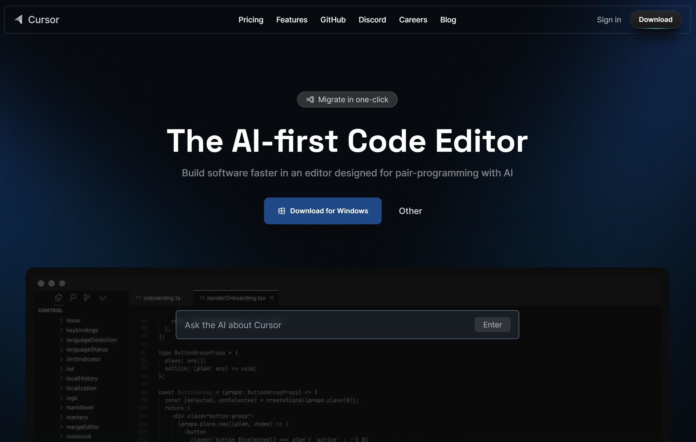
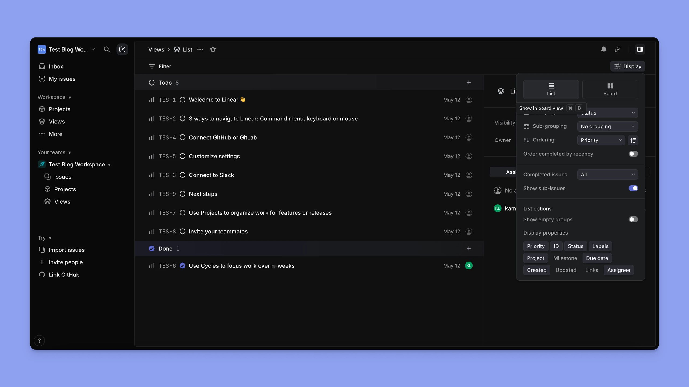
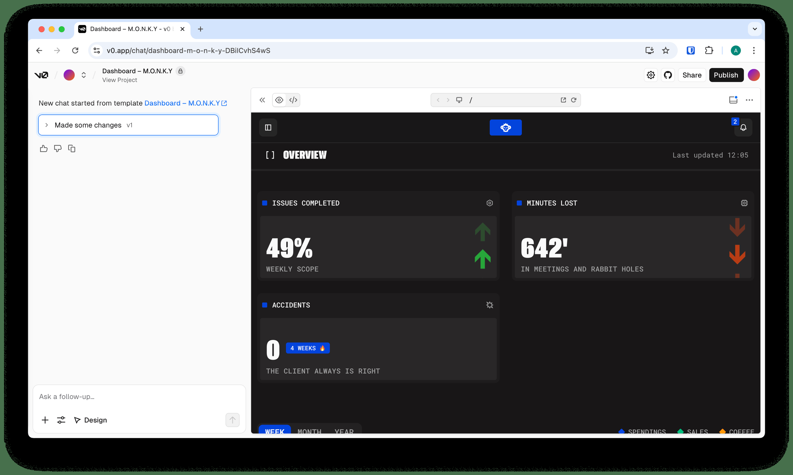
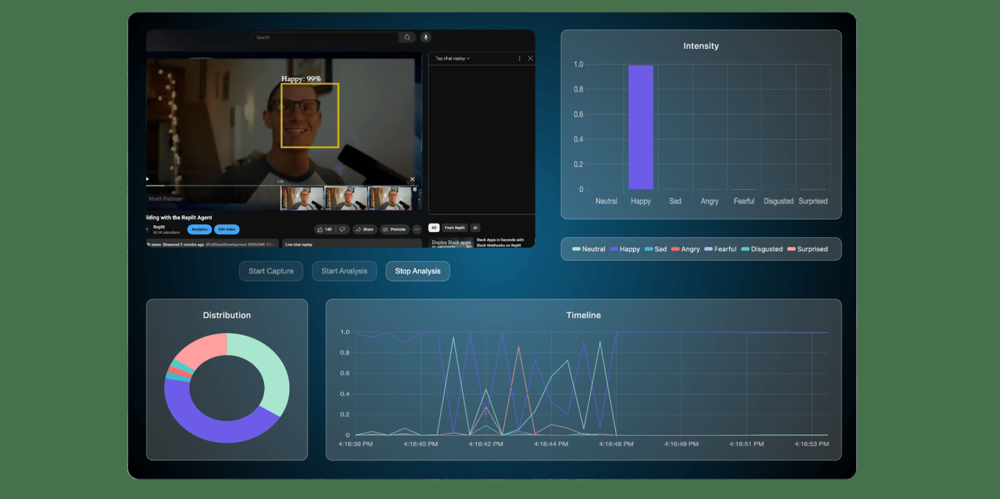
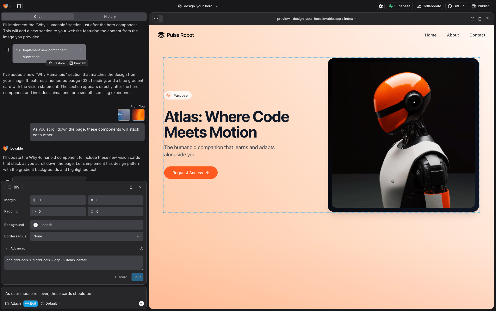
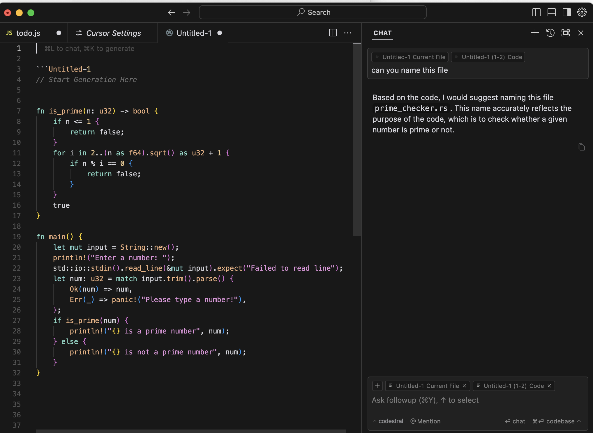
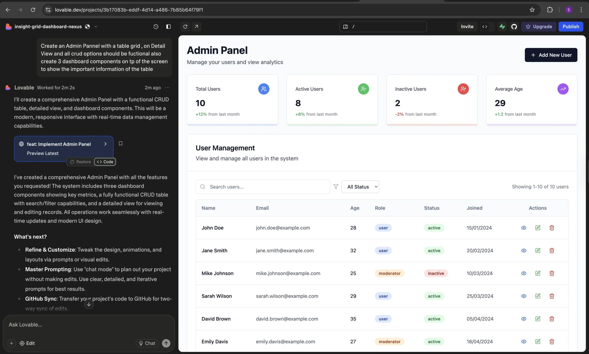
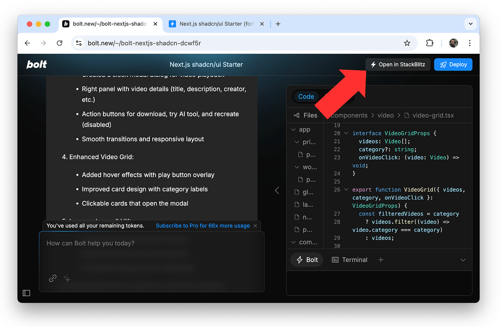
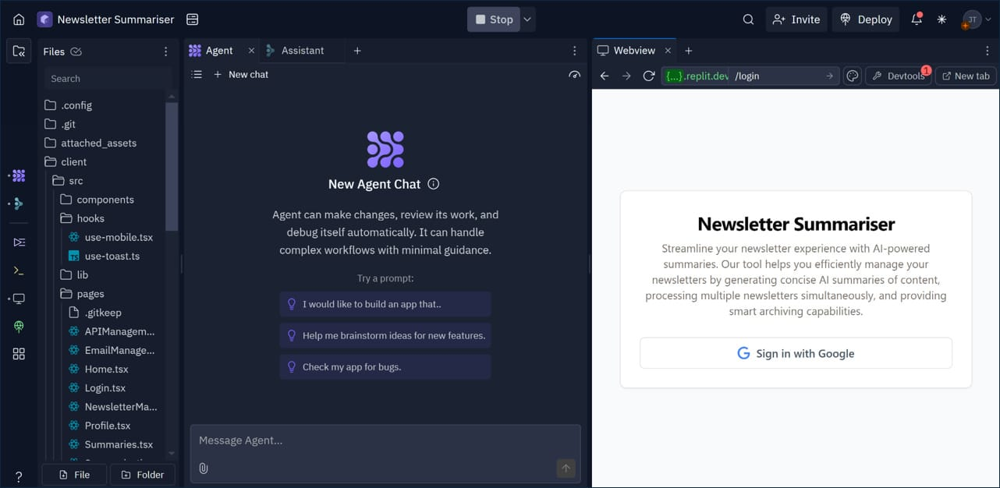

# 83_AUDITORIA_PROFUNDA_SISTEMAS_INTERFACES_GITHUB_2026-04-22
Date: 2026-04-22
Status: ACTIVE (PRIMARY COMPLEMENTARY AUDIT)
Source: imported from `docs/master/assets/auditoria-sistemas-interfaces-github-2026-04-22/auditoria-profunda-sistemas-interfaces-github-2026-04-22.pdf`
Synced branch baseline: `origin/genspark_ai_developer@5760df694`

## Role in the Canonical Set
This document is now one of the primary audit references for Aethel, but it does **not** replace the others.
Use the set together:

1. `docs/master/82_AUDITORIA_V5_AETHEL_ENGINE_DEEP_2026-04-19.md`
   Strategic direction, market benchmark, and quality bar.
2. `docs/master/83_AUDITORIA_PROFUNDA_SISTEMAS_INTERFACES_GITHUB_2026-04-22.md`
   Systems + interfaces deep-dive imported from the PDF audit, reconciled against the current GitHub branch.
3. `docs/master/84_AUDITORIA_PROFUNDA_REPOSITORIO_PLANO_DE_ACAO_2026-04-22.md`
   Repository, CI/CD, root hygiene, and execution-plan complementary audit.
4. `docs/master/81_VALIDATED_PRIORITY_BACKLOG_2026-04-20.md`
   Anti-fake-success factual guardrail for counts, claims, and repo reality.

## Why This Document Exists
The external PDF audit brought two things that are worth preserving in the canonical set:

- a sharper systems-and-interfaces lens, especially around shell quality, route maturity, and UX trust;
- a strong set of visual references embedded in the original PDF.

That said, the PDF also contains claims that were already partially outdated once the latest GitHub improvements landed. This file preserves the value of the audit **without** turning older numbers into fake truth.

## Current Reconciliation State
The local workspace is already synced with the latest upstream changes from `genspark_ai_developer`, including:

- `15c0139ab` `chore(cleanup): remove 24k lines of dead engine libs, fix .aethelrules paths, re-enable next/image`
- `3edf1eb37` `feat(ux): ship ThemeToggle in header + Storybook coverage + tests`
- `5760df694` `feat(round-81): slice god components, seed migrations, wire lighthouse + coverage`

## What From the PDF Still Holds Strongly
These points still align with the repo and remain strategic priorities:

- design-system drift is still real, even after ThemeToggle and Storybook progress;
- the workbench remains the core product and still needs deeper shell convergence;
- `C:\Users\Grosarik\Desktop\Aethel engine\meu-repo\cloud-web-app\web\components\ide\FullscreenIDE.tsx` is still too large;
- `C:\Users\Grosarik\Desktop\Aethel engine\meu-repo\cloud-web-app\web\components\ide\AIChatPanelPro.tsx` was reduced, but is still large enough to justify further decomposition;
- preview and collaboration still lag behind the benchmark set by Cursor, Replit, Windsurf, and Unreal-style workflows;
- admin surface area is still larger than ideal and should continue converging toward fewer canonical areas;
- documentation is a strength, but only when paired with explicit hierarchy and factual reconciliation.

## What Changed Since the PDF Snapshot
The following PDF claims should no longer be treated as current truth without reconciliation:

### Repo scale
- PDF snapshot: `23.653 files · 503 MB`
- Current tracked repo reality: approximately `5,465 tracked files · 53.02 MB`
- Meaning: the imported PDF is valuable directionally, but not as a raw numeric snapshot of the current repo.

### Dead engine libs
- PDF framed a large set of dead engine libraries as still present.
- Current branch already removed a major dead-code island, including files like:
  - `C:\Users\Grosarik\Desktop\Aethel engine\meu-repo\cloud-web-app\web\lib\behavior-tree.ts`
  - `C:\Users\Grosarik\Desktop\Aethel engine\meu-repo\cloud-web-app\web\lib\world-partition.ts`
  - `C:\Users\Grosarik\Desktop\Aethel engine\meu-repo\cloud-web-app\web\lib\skeletal-animation.ts`
  - `C:\Users\Grosarik\Desktop\Aethel engine\meu-repo\cloud-web-app\web\lib\collaboration-realtime.ts`

### Next/Image and performance baseline
- PDF flagged `images.unoptimized: true` as a critical performance bug.
- Current branch already re-enabled modern image behavior in:
  - `C:\Users\Grosarik\Desktop\Aethel engine\meu-repo\cloud-web-app\web\next.config.js`
- That specific blocker is no longer an active current-state claim.

### `.aethelrules`
- PDF criticized absolute-path usage in `.aethelrules`.
- Current branch already fixed this in:
  - `C:\Users\Grosarik\Desktop\Aethel engine\meu-repo\.aethelrules`

### Testing and quality pressure
- PDF described the test story as critically weak.
- That concern still exists directionally, but current reality improved:
  - tracked test files are now `45`
  - `collectCoverage` is now wired in CI-sensitive form in `C:\Users\Grosarik\Desktop\Aethel engine\meu-repo\cloud-web-app\web\jest.config.ts`
  - Lighthouse configuration now exists in `C:\Users\Grosarik\Desktop\Aethel engine\meu-repo\cloud-web-app\web\lighthouserc.js`
  - Prisma migrations are now seeded at `C:\Users\Grosarik\Desktop\Aethel engine\meu-repo\cloud-web-app\web\prisma\migrations\`

### Admin page count
- PDF cites `47` admin pages.
- Current tracked repo count is `45` admin `page.tsx` routes.
- Still too high, but not the same number.

## Current Factual Anchors After Sync
These are the reality points this audit should now be interpreted against:

- `AIChatPanelPro.tsx`: about `549` lines, not the older ~1766-line state
- `FullscreenIDE.tsx`: about `702` lines and still a top-priority god component
- `AIChatPanelContainer.tsx`: about `116` lines after extraction into session-context, provider-preflight, send-pipeline, and session-banner modules
- `ModernIDEShell.tsx`: now only `161` lines, with shell structure split into `ModernIDEShellPanels.tsx` (`281`) and `ModernIDEShellChrome.tsx` (`378`)
- tracked tests: `45`
- tracked `console.*` in `cloud-web-app/web/lib`: around `285`
- tracked `console.*` in `cloud-web-app/web/components`: around `151`
- tracked `: any`: around `1059`
- tracked hardcoded hex matches in TSX: around `1305`
- admin pages: `45`
- API routes: `320`

If these numbers change, `81_VALIDATED_PRIORITY_BACKLOG_2026-04-20.md` should be refreshed again instead of silently mutating the meaning of this imported audit.

## How to Use This Audit Operationally
Use this audit for:

- product and interface critique;
- benchmark framing against Cursor, Linear, Replit, Windsurf, Unreal, and Vercel;
- identifying where the product still feels aspirational instead of inevitable;
- deciding what quality bar the user should feel on landing, auth, dashboard, workbench, preview, and admin.

Do **not** use this audit alone for:

- exact current-state counts;
- declaring blockers closed;
- claiming parity already achieved.

For those, always pair it with `81_VALIDATED_PRIORITY_BACKLOG_2026-04-20.md` and current code inspection.

## Priority Direction Confirmed by This Audit Set
Across `81`, `82`, and this imported systems/interfaces audit, the shared execution order remains:

1. Keep the design system converging toward one visual language.
2. Continue slicing the workbench god components.
3. Turn collaboration from infrastructure into visible product UX.
4. Turn preview into a trust-building, shareable creation surface.
5. Keep replacing runtime ambiguity with evidence, tests, and structured observability.

Current reconciliation note:
- collaboration is no longer only infra + header presence;
- remote cursor overlays are now wired into the Monaco editor flow through the workbench editor pane;
- the remaining gap is no longer "make collaboration visible at all", but "turn visible cursor presence into a fully trusted shared-editing path".
- the curated merge-pressure browser lane is also now validated locally end-to-end in a real browser run; what is still not proven is local production-build parity, which currently fails with separate prerender/runtime issues outside the browser-gate lane.

## Embedded Figures Imported From the PDF
These assets were extracted from the PDF so the audit remains portable inside the repository.

### Figure 1

### Figure 2

### Figure 3

### Figure 4

### Figure 5

### Figure 6

### Figure 7

### Figure 8

### Figure 9

## Source Preservation
Original imported source preserved at:

- `docs/master/assets/auditoria-sistemas-interfaces-github-2026-04-22/auditoria-profunda-sistemas-interfaces-github-2026-04-22.pdf`

This allows future reconciliation passes without losing the source artifact.
