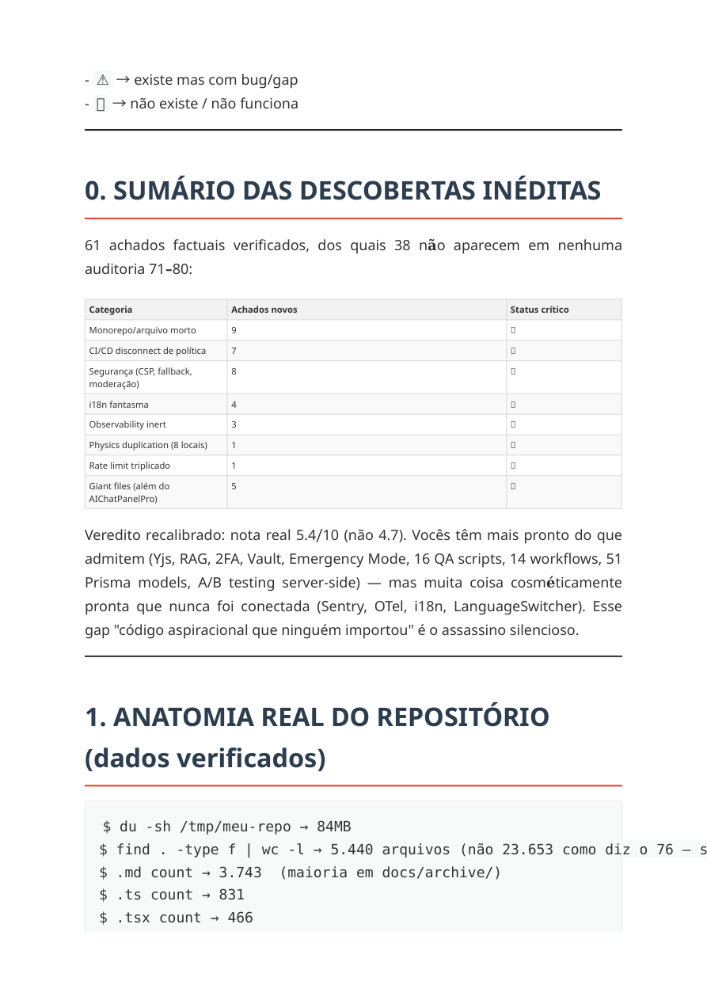
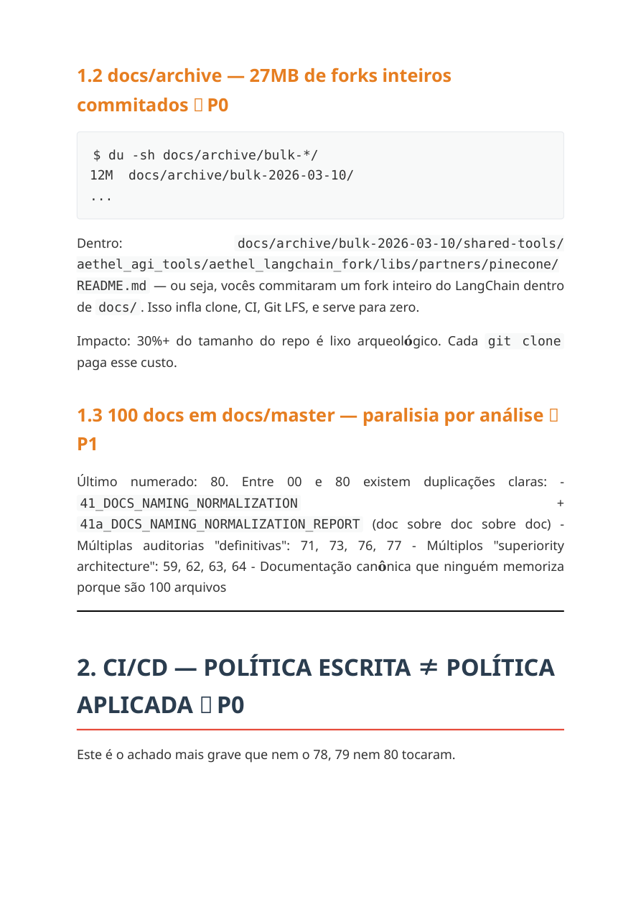

# 84_AUDITORIA_PROFUNDA_REPOSITORIO_PLANO_DE_ACAO_2026-04-22
Date: 2026-04-22
Status: ACTIVE (PRIMARY COMPLEMENTARY AUDIT — REPO + CI/CD + EXECUTION)
Source: imported from `docs/master/assets/auditoria-repositorio-plano-acao-2026-04-22/auditoria-profunda-repositorio-plano-de-acao-2026-04-22.pdf`
Synced branch baseline: `genspark_ai_developer@632775aa4`

## Papel no Conjunto Canônico
Este documento entra como a terceira auditoria principal complementar do ciclo atual.
Ele **não substitui** os outros documentos — ele fecha um ângulo que as demais auditorias tratavam só parcialmente: limpeza real do monorepo, discrepância entre política e CI aplicado, e custo operacional escondido no root / docs / pipelines.

Usar sempre o conjunto abaixo, nesta função:

1. `docs/master/82_AUDITORIA_V5_AETHEL_ENGINE_DEEP_2026-04-19.md`
   - rumo principal, benchmark, produto e barra de qualidade
2. `docs/master/83_AUDITORIA_PROFUNDA_SISTEMAS_INTERFACES_GITHUB_2026-04-22.md`
   - profundidade em shell, superfícies, UX e interfaces
3. `docs/master/84_AUDITORIA_PROFUNDA_REPOSITORIO_PLANO_DE_ACAO_2026-04-22.md`
   - profundidade em monorepo, CI/CD, root hygiene, policy-vs-reality e custo estrutural
4. `docs/master/81_VALIDATED_PRIORITY_BACKLOG_2026-04-20.md`
   - guardrail factual anti-fake-success para números, claims e priorização executiva

## Evidência Fonte Preservada
- PDF original preservado em:
  - `docs/master/assets/auditoria-repositorio-plano-acao-2026-04-22/auditoria-profunda-repositorio-plano-de-acao-2026-04-22.pdf`
- A auditoria não expôs imagens embutidas extraíveis como assets isolados.
- Para preservar o contexto visual, renderizamos páginas-chave do PDF em:
  - `docs/master/assets/auditoria-repositorio-plano-acao-2026-04-22/page-01.png`
  - `docs/master/assets/auditoria-repositorio-plano-acao-2026-04-22/page-02.png`
  - `docs/master/assets/auditoria-repositorio-plano-acao-2026-04-22/page-03.png`
  - `docs/master/assets/auditoria-repositorio-plano-acao-2026-04-22/page-04.png`
  - `docs/master/assets/auditoria-repositorio-plano-acao-2026-04-22/page-05.png`

## Prévia Visual do Documento-Fonte
| Página | Preview |
|---|---|
| Capa |  |
| Sumário e score recalibrado |  |
| Root orphan files |  |
| `docs/archive` e overload documental |  |
| CI/CD policy-vs-reality |  |

## O Que Esta Auditoria Acrescenta de Verdade
Ela reforça e explicita pontos que as auditorias `82` e `83` já tangenciavam, mas sem o mesmo foco operacional:

- o root do monorepo ainda comunica ruído e ambiguidade para quem chega novo
- existe descompasso entre política de qualidade declarada e o que o CI realmente exige em PRs
- há custo arqueológico em `docs/archive/` e excesso de documentos ativos em `docs/master/`
- vários problemas de qualidade não são só “de interface”; são problemas de **governança do repositório**
- parte do débito do Aethel não está no que falta construir, e sim no que falta **desligar, consolidar ou tornar inequívoco**

## Snapshot Reconciliado do Estado Atual
Este documento não reaproveita cegamente os números do PDF. Abaixo está a leitura reconciliada com o branch atual `632775aa4`.

- tracked repo files: `5487`
- tracked repo size: `~60.14 MB`
- `docs/master` files: `106`
- `cloud-web-app/web/app/**/page.tsx`: `80`
- `cloud-web-app/web/app/api/**/route.ts`: `320`
- `cloud-web-app/web/app/admin/**/page.tsx`: `46`
- `cloud-web-app/web/components/**/*.tsx`: `311`
- `cloud-web-app/web/lib/**/*.ts`: `345`
- tracked test files (real `*.test.*` / `*.spec.*`, excluding snapshot assets): `45`
- current branch is typechecking green again after compatibility repairs

## Claims da Nova Auditoria Que Continuam Fortes
### 1. Root hygiene ainda é um problema real
A crítica continua válida.
Hoje o root ainda contém arquivos que confundem o papel do monorepo e aumentam carga cognitiva:

- `C:\Users\Grosarik\Desktop\Aethel engine\meu-repo\physics.js`
- `C:\Users\Grosarik\Desktop\Aethel engine\meu-repo\physics_adv.test.js`
- `C:\Users\Grosarik\Desktop\Aethel engine\meu-repo\physics_performance.test.js`
- `C:\Users\Grosarik\Desktop\Aethel engine\meu-repo\server.js`
- `C:\Users\Grosarik\Desktop\Aethel engine\meu-repo\proxy-shim.js`
- `C:\Users\Grosarik\Desktop\Aethel engine\meu-repo\workbench-preview.html`
- `C:\Users\Grosarik\Desktop\Aethel engine\meu-repo\visual-regression.spec.ts`
- `C:\Users\Grosarik\Desktop\Aethel engine\meu-repo\soft-warn.spec.ts`
- `C:\Users\Grosarik\Desktop\Aethel engine\meu-repo\soft-warn-e2e.spec.ts`
- `C:\Users\Grosarik\Desktop\Aethel engine\meu-repo\executor.spec.ts`
- `C:\Users\Grosarik\Desktop\Aethel engine\meu-repo\accessibility.spec.ts`
- `C:\Users\Grosarik\Desktop\Aethel engine\meu-repo\integration-test.spec.ts`
- `C:\Users\Grosarik\Desktop\Aethel engine\meu-repo\playwright.config.js`
- `C:\Users\Grosarik\Desktop\Aethel engine\meu-repo\playwright.config.ts`

Direção correta: consolidar root e tornar claro o que é runtime, o que é tooling e o que é legado.

### 2. O overload documental é real
A crítica continua válida, mesmo depois da hierarquia `81/82/83`.

- `docs/master` ainda está em `105` arquivos
- `docs/archive` ainda pesa cerca de `17.7 MB`
- a existência de muitas auditorias fortes exige hierarquia explícita para não virar drift narrativo

Conclusão: a solução não é apagar docs úteis às cegas; é manter **poucos documentos com papel nítido** e o resto como histórico/referência.

### 3. O gap entre política declarada e enforcement em CI continua importante
A nova auditoria acerta num ponto estrutural importante:

- `qa:enterprise-gate` existe em `C:\Users\Grosarik\Desktop\Aethel engine\meu-repo\cloud-web-app\web\package.json`
- a policy menciona esse gate em `C:\Users\Grosarik\Desktop\Aethel engine\meu-repo\.github\BRANCH_PROTECTION_POLICY.md`
- mas o `C:\Users\Grosarik\Desktop\Aethel engine\meu-repo\.github\workflows\ci.yml` não executa esse agregador diretamente hoje

Isto é exatamente o tipo de desalinhamento que pode corroer a credibilidade do próprio anti-fake-success se a gente deixar passar.

### 4. E2E opcional ainda é uma crítica legítima
A auditoria também continua correta aqui:

- o job `Playwright E2E (optional)` existe
- mas está condicionado por `github.event.inputs.run_e2e == 'true'`

Isso não significa que E2E “não existe”; significa que ele ainda não é pressão padrão de merge.

### 5. `noImplicitAny: false` continua um risco concreto
Isso segue válido e alinhado com `81`.

- `C:\Users\Grosarik\Desktop\Aethel engine\meu-repo\cloud-web-app\web\tsconfig.json` ainda mantém `"noImplicitAny": false`

### 6. Giant files continuam problema, mesmo com progresso
A auditoria acerta na categoria, mas já nasceu parcialmente defasada nos números.

O que continua verdadeiro:
- `C:\Users\Grosarik\Desktop\Aethel engine\meu-repo\cloud-web-app\web\components\ide\FullscreenIDE.tsx` ainda é grande demais
- `C:\Users\Grosarik\Desktop\Aethel engine\meu-repo\cloud-web-app\web\components\ide\AIChatPanelPro.tsx` ainda é grande demais
- ainda há outros arquivos grandes no ecossistema engine/editor

## Claims da Nova Auditoria Que Precisam de Correção ou Rebaixe
### 1. Snapshot bruto de tamanho/contagem
O PDF fala em `5440 arquivos` e `84 MB`.
Isso não deve mais ser tratado como estado atual do branch.

Hoje, depois do alinhamento documental, extrações, assets e reparos:
- tracked repo files: `5480`
- tracked repo size: `~60.14 MB`

Leitura correta:
- a crítica ao repositório antigo inflado continua útil
- mas o snapshot literal do PDF já não é a fotografia atual

### 2. “14 testes” está desatualizado
O PDF tratou a suíte como quase inexistente.
Direcionalmente a crítica continua válida, mas o número literal já não representa o estado atual.

Hoje o repositório rastreado contém `45` arquivos reais `*.test.*` / `*.spec.*`.

Leitura correta:
- pressão de teste ainda é insuficiente para o tamanho do produto
- mas não estamos mais no mesmo estado de base usado pelo PDF

### 3. `AIChatPanelPro.tsx` e `FullscreenIDE.tsx` já melhoraram desde o snapshot
O PDF ainda carrega a leitura de monólitos maiores.

Estado atual reconciliado:
- `C:\Users\Grosarik\Desktop\Aethel engine\meu-repo\cloud-web-app\web\components\ide\AIChatPanelPro.tsx`: `~954` linhas
- `C:\Users\Grosarik\Desktop\Aethel engine\meu-repo\cloud-web-app\web\components\ide\FullscreenIDE.tsx`: `~1755` linhas

Além disso, já houve extrações reais:
- `C:\Users\Grosarik\Desktop\Aethel engine\meu-repo\cloud-web-app\web\components\ai-chat\useChatContextPreviews.ts`
- `C:\Users\Grosarik\Desktop\Aethel engine\meu-repo\cloud-web-app\web\components\ide\fullscreen\useWorkbenchFullAccess.ts`

### 4. Sentry “instalada mas inerte” já não descreve o branch atual
Essa crítica ficou parcialmente velha.

Hoje já existe init explícito em:
- `C:\Users\Grosarik\Desktop\Aethel engine\meu-repo\cloud-web-app\web\app\layout.tsx`
- `C:\Users\Grosarik\Desktop\Aethel engine\meu-repo\cloud-web-app\web\lib\sentry.ts`

Leitura correta:
- Sentry está ligada
- observabilidade ainda não está madura
- mas “instalada e morta” já não é descrição justa do estado atual

### 5. `images.unoptimized: true` já foi corrigido
O PDF marca isso como blocker.
Essa crítica também está superada.

O `C:\Users\Grosarik\Desktop\Aethel engine\meu-repo\cloud-web-app\web\next.config.js` já não usa mais `unoptimized: true`; o arquivo inclusive documenta essa remoção.

## Alinhamento Final Entre 81, 82, 83 e 84
### O que 82 continua dizendo melhor
- a tese do produto
- o benchmark competitivo
- o norte visual e de experiência
- o plano de qualidade “top de mercado”

### O que 83 continua dizendo melhor
- o estado das superfícies, shell, UX e interfaces
- o que já mudou no branch moderno do GitHub
- a reconciliação entre o PDF anterior e o estado real recente

### O que 84 passa a dizer melhor
- onde o monorepo ainda trai a narrativa de qualidade
- onde o CI ainda não faz enforcement do que a policy promete
- onde o root e a documentação ainda cobram custo invisível
- por que “qualidade final” também depende de governança do repositório

### O que 81 continua sendo
- o freio factual
- o documento que impede a gente de inflar o que ainda não fechou end-to-end

## Direção Operacional Sem Lacunas
Depois de alinhar `81 + 82 + 83 + 84`, a leitura conjunta mais honesta é:

1. o Aethel não está mais no estágio de “repo caótico sem norte”
2. o Aethel está no estágio de “produto promissor com gargalos grandes e governança parcialmente desalinhada”
3. os maiores riscos agora se dividem em quatro blocos:
   - monólitos de workbench/chat
   - policy-vs-CI mismatch
   - root/documentation hygiene
   - fechamento real de colaboração/preview/testes

## Regra de Uso Desta Auditoria
Se este documento conflitar com outro:

1. `81` vence em números reconciliados e claims factuais
2. `82` vence em rumo de produto e benchmark
3. `83` vence em leitura de sistemas/interfaces do branch moderno
4. `84` vence em leitura de monorepo, CI/CD, root hygiene e drift operacional

## Conclusão
Esta auditoria nova é valiosa e entra legitimamente entre as principais.
Ela não muda o rumo do Aethel; ela **melhora a nitidez** do rumo.

O conjunto atualizado fica assim:

- `82`: para onde vamos
- `83`: como estão as superfícies e interfaces
- `84`: como está a casa por baixo do piso
- `81`: o que é verdade factual agora

Esse é o conjunto mais forte que o projeto já teve até aqui sem cair em alucinação, sem perder qualidade e sem transformar auditoria em narrativa solta.
