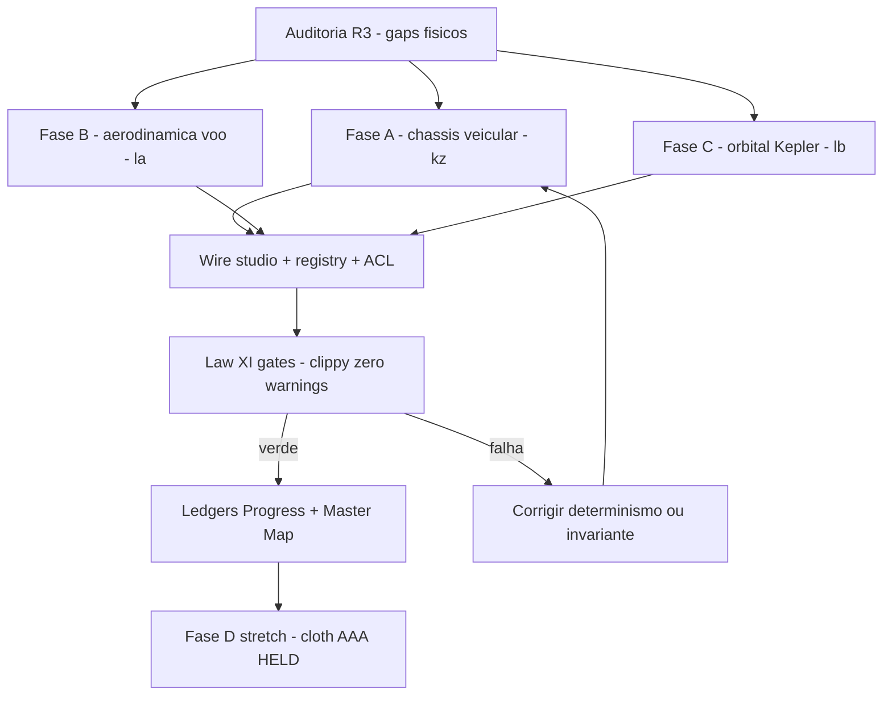

# Round R3 — Pilares Físicos de Gameplay (Chassis Veicular + Aerodinâmica + Orbital)

**Modo:** Architect → Code (implementação backend/kernel somente — **Iron Wall: zero UI**)
**Autor:** Backend/Kernel Engineer (DeepSeek)
**Data:** 2026-08-18
**Baseline confirmado em disco:** R2-K fechado (letra `ky`), G.% = 15, wire-check 135=135/24 Active, ipc-check 150/116 Public, kernel tests 1502/1502, `IPC_SURFACE_VERSION = "r25-2026-08-17"`, `REGISTRY_VERSION = "r24-2026-08-17"`.

---

## 1. Mandato (R3-A→R3-F — audit do Founder)

A auditoria R3 mediu em disco: **veículos = ZERO**, **voo = ZERO**, **espaço/microgravidade = ZERO**, **cloth AAA = HELD** (`xpbd_cloth_aaa_ready=false`). Decisões vinculantes:

> **Física:** priorizar **chassis veicular** (suspensão/roda/diferencial) + **aerodinâmica** (lift/drag/asa) + **orbital** (Kepler 2-corpos + patched conic) sobre o **MESMO spine S-17 determinístico** — gameplay rico sem quebrar rollback/fingerprint.

**Critério de prontidão (Zero-MVP / Anti-Mock):** nenhum `ready` sem soak determinístico completo; flags AAA permanecem `false` (HELD) — estes são solvers de backend determinísticos, não shipments de física AAA.

---

## 2. Padrão a replicar (medido em disco — R2-K `cinema_hot_loop_composition`)

Cada kernel segue **exatamente** o padrão estabelecido:

1. **Substrate** `packages/aethel-kernel-rust/src/<module>.rs` (~900–1500L):
   - Header doc (letra, round, gap fechado, honestidade), constantes `*_FP_SEED`/`*_FP_FOLD`/`*_EVIDENCE_KIND` com a letra na constante.
   - Estruturas `#[repr(C)]` SoA / solver determinístico, `serde::{Serialize, Deserialize}` no report.
   - Struct `Measured` interna (contadores reais, **nada mockado**), `evidence_fingerprint()` (cadeia `hash_mix` com seed+fold), `readiness()` (soak-gated: TODOS os invariantes), `run_measured_pass()`, `Report` (com campos `distinct_from_*` para ≥18 peers + 2 irmãos R3 + flags AAA sempre `false` + `coins/agones/quic` false).
   - `pub fn run_<module>_soak()` (passa duas vezes, compara fingerprint bit-a-bit) + `pub fn probe_<module>()` (delega ao soak).
   - `#[cfg(test)] mod tests` — suíte AAA (≥11 testes): invariantes matemáticos exatos, determinismo, rollback, zero-alloc keep-capacity, finite/bounded, edge-fail-safes, distinctness.
2. **Wire** `apps/studio-local/src-tauri/src/kernel_<module>_wire.rs` (~380–450L): `WireReport` camelCase + `to_report`, `probe_<module>_wire()` (mede `wire_on_surface` via `ipc_surface::acl_for` nos 2 comandos), `#[tauri::command] probe_<module>_cmd`, `SoakWireReport` + `soak_to_wire`, `#[tauri::command] run_kernel_<module>_soak_cmd`, 3 testes (wire honesto = espelha kernel; nunca reivindica AAA; soak delega ao kernel).
3. **Registro:** `kernel_registry.rs` (+1 entrada `Active`, bump `REGISTRY_VERSION`, `WIRES_ON_DISK`/`REACHABLE_WIRE_COUNT`) + `ipc_surface.rs` (+2 ACL `Public`/`KernelWire` não-hot, bump counts/versão) + studio `lib.rs` (`pub mod kernel_<module>_wire;` + macro `register_commands!` +2) + kernel `lib.rs` (`pub mod <module>;`).

---

## 3. Fase A — `vehicle_chassis_dynamics.rs` (letra **kz**, R3-A)

**Gap:** nenhum kernel de veículo existe em disco (ZERO). Solver determinístico de chassis de 4 rodas, rollback-compatível (S-17).

**Conteúdo matemático/físico (zero-alloc hot loop):**
- **Suspensão spring-damper** por roda: `F_s = -k·x - c·v` (compressão `x`, travel clampado, bump stops progressivos, anti-roll bar acoplada esq/dir).
- **Contato de pneu** (raycast/heightmap → ponto): força normal do pneu, atrito Coulomb combinado com slip, grip.
- **Chassis 6-DOF**: posição + quaternion, velocidades linear/angular, massa, tensor de inércia de caixa, altura do CoM. Integração **semi-implícita Euler** com sub-passos fixos (ex.: 240 Hz × 4) — determinística.
- **Steering Ackermann**: ângulo interno > externo pelo raio de curva (traço/bitola), layout FWD/RWD/4WD.
- **Diferencial**: open (torque 50/50), locked (bias fixo), Torque Vectoring (bias dinâmico por slip) — provado por testes.
- **Fingerprint/rollback**: snapshot = `VehicleChassisState` (pos, quat, velocidades, compressões) → rollback replay bit-idêntico.

**Invariantes de teste (≥11):** equilíbrio estático (suspensão suporta peso, sem afundar/deriva, tolerância pequena); mola-amortecedor converge à altura de repouso; determinismo bit-a-bit; rollback; split 50/50 open vs bias locked; Ackermann correto; anti-roll reduz rolagem; zero-alloc keep-capacity; finite/bounded sob frenagem; edge dt=0 no-op; distinctness ≥18 peers + irmãos.

---

## 4. Fase B — `flight_aerodynamics.rs` (letra **la**, R3-B)

**Gap:** voo = ZERO. **ATENÇÃO:** já existe `aerodynamic_navier_stokes` (letra `gv`, solver NS de fluido) — este kernel é o **modelo de voo analítico** (lift/drag/asa/superfícies de controle), **não** colide com `gv`. Nome escolhido para evitar ambiguidade.

**Conteúdo:**
- **Atmosfera ISA** (rho(h), T, p, velocidade do som) + **pressão dinâmica** `q = ½·ρ·v²`.
- **Asa/aerofólio**: `CL(α)` linear → stall (α_stall) → pós-stall (falloff determinístico); **polar de arrasto** `CD = CD0 + k·CL²` (arrasto induzido); correção de asa finita (AR, eficiência de Oswald).
- **Forças** em frame do corpo: `L = q·S·CL` (⊥ velocidade no plano de pitch), `D = q·S·CD` (oposta à velocidade).
- **Superfícies de controle**: aileron (roll), elevator (pitch), rudder (yaw) — deflexão → delta-CL/delta-momento com autoridade e limites.
- **Derivadas de estabilidade** (pitch damping) + **acoplamento de vento** (vento relativo = velocidade − vento; compõe com `wind_field_dynamics` kv).
- **Trim solver**: encontra α para L = W em voo nivelado.

**Invariantes de teste (≥11):** trim nivelado L=W; q monótono com velocidade; stall em α_stall (CL máx + queda); polar CD vs CL²; sinal do momento de elevator; determinismo; rollback; zero-alloc; finite/bounded; vento de proa reduz pressão dinâmica relativa; distinctness.

---

## 5. Fase C — `celestial_orbital_dynamics.rs` (letra **lb**, R3-C)

**Gap:** espaço/microgravidade = ZERO. Kepler 2-corpos + patched conic + microgravidade.

**Conteúdo:**
- **2-corpos Kepler**: vetores de estado `(r, v)`, `mu` do corpo central. **Equação de Kepler** `M = E − e·sin(E)` via Newton (iterações limitadas, determinísticas). **Variáveis universais** para propagação (válida em todas as cônicas).
- **Elementos orbitais ↔ estado**: `a, e, i, RAAN, ω, ν, M`; conversão ECI ida/volta.
- **Patched conic**: esfera de influência (SOI) — quando dentro do SOI de um corpo, troca de primário (`mu` switch). Ex.: transferência Terra→Lua.
- **Microgravidade**: sem arrasto, propulsão RCS por impulso (`Δv`), estado rollback-compatível.
- **Tabela de corpos**: Terra/Lua/Marte configuráveis (mu, raio, SOI).

**Invariantes de teste (≥11):** equação de Kepler (e=0 → M=E; elíptica c/ comparação fechada); período circular `T = 2π√(a³/mu)` — após 1 período a posição retorna; **vis-viva** `v² = mu(2/r − 1/a)` (conservação ao longo da órbita); round-trip elementos↔estado; detecção de SOI troca primário; microgravidade sem empuxo → velocidade constante; impulso RCS → Δv exato; velocidade de escape (e>1, energia positiva); determinismo; rollback; zero-alloc; finite/bounded; distinctness.

---

## 6. Fase D (stretch — profundar cloth AAA)

A auditoria marcou cloth como **HELD** (não-ZERO). Após as Fases A–C verdes nos gates, profundar `position_based_dynamics` (ip) + `gpu_strand_grooming` (kf) num kernel de **cloth XPBD AAA** (estiramento/curvatura/colisão SDF, sub-passos determinísticos) — **somente** se os 3 pilares passarem sem dívida. Não bloqueia R3.

---

## 7. Integração (Fases A–C — idêntico, por kernel)

| Arquivo | Edição |
|---|---|
| `packages/aethel-kernel-rust/src/lib.rs` | +3 `pub mod <module>;` |
| `packages/aethel-kernel-rust/src/kernel_registry.rs` | +3 entradas `Active` (alfabética), `WIRES_ON_DISK` 135→**138**, `REACHABLE_WIRE_COUNT` 24→**27**, `REGISTRY_VERSION` bump, notas R no header |
| `apps/studio-local/src-tauri/src/ipc_surface.rs` | +6 ACL (`probe_<module>_cmd` + `run_kernel_<module>_soak_cmd`, `Public`/`KernelWire`/não-hot, alfabético), `REGISTERED_COMMAND_COUNT` 150→**156**, `PUBLIC` 116→**122**, `IPC_SURFACE_VERSION` bump, header doc |
| `apps/studio-local/src-tauri/src/lib.rs` | +3 `pub mod kernel_<module>_wire;` + macro `register_commands!` (+6 comandos) |
| `apps/studio-local/src-tauri/src/main.rs` | via `register_commands!` (nenhuma edição manual) |

---

## 8. Gates Law XI (obrigatórios — após cada Fase)

```text
Kernel:  set CARGO_TARGET_DIR=E:\aethel-target-gnu
         cd packages/aethel-kernel-rust
         cargo check
         cargo clippy -- -D warnings     # zero warnings
         cargo test                      # harness do kernel = verde (studio test 0xc0000139 é pré-existente, não-regressão)

Studio:  cd apps/studio-local/src-tauri
         cargo clippy --all-targets      # -D warnings
```

Anti-padrões a rejeitar (Deep Executor Critique): `f32::signum(+0.0)=1.0` (usar zero-guard explícito), iteração determinística (nunca `while` sem teto), alloc no hot loop, fingerprint que omite invariante, `ready` sem soak duplo bit-idêntico.

---

## 9. Ledgers (Zero Amnesia — após gates verdes)

- `docs/architecture/AETHEL_FOCUS1_EXECUTION_PROGRESS.md` — R3-A/B/C no log de sessão + tabelas DONE (physics), wire-check 138=138/27 Active, ipc-check 156/122 Public, kernel test count.
- `docs/architecture/AETHEL_CLAUDE_EXECUTION_MASTER_MAP.md` — round log R3 + ledger kernel-by-kernel (kz/la/lb) com flags HELD honestas.
- `docs/architecture/AETHEL_STUDIO_SUPREMACY_INDEX.md` — nota de round (se necessário).

---

## 10. Diagrama de fluxo



---

## 11. Ordem de execução

1. Fase A completa (substrate + wire + registros) → gates → ledgers.
2. Fase B completa → gates → ledgers.
3. Fase C completa → gates → ledgers.
4. (Stretch) Fase D — cloth AAA, se as três fases fecharam sem dívida.

Cada fase é autônoma e shippable individualmente; a ordem respeita o mandato da auditoria (chassis → aerodinâmica → orbital).
